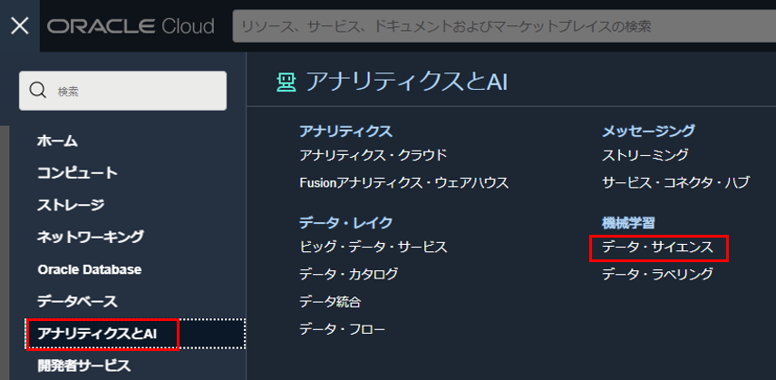
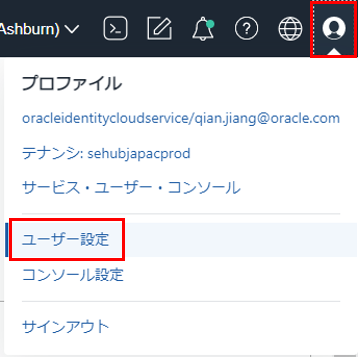
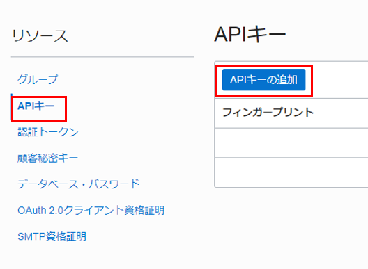

# OCI DataScienceノートブック・セッションでAnomaly Detection（異常検出）へのアクセス

OCI異常検出サービスは、さまざまなプログラミング言語で CLI ツール （oci） および SDK を使用することをサポートしています。ここで、DataScience ノートブックでOCI異常検出サービスを利用する方法を紹介します。

## 事前準備

データ・サイエンスを利用するために、以下のように仮想クラウド・ネットワーク、動的グループおよびポリシーを作成します。

### 仮想クラウド・ネットワークの作成

OCIコンソールで「仮想クラウド・ネットワーク」 > 「VCNウィザードの起動」 > 「インターネット接続性を持つVCNの作成」を選択して、VCNとサブネットを作成します。これにより、NAT ゲートウェイを使用して必要なプライベート・サブネットを自動的に作成します。

### グループの作成

次の一致ルールで動的グループを作成します。

```
ALL { resource.type = 'datasciencenotebooksession' }
```

### ポリシーの作成

次のステートメントを使用して、ルート・コンパートメントにポリシーを作成します。

サービス・ポリシー

```
allow service datascience to use virtual-network-family in tenancy
```

管理者以外のユーザー・ ポリシー

```
allow group <ユーザー・グループ> to use virtual-network-family in tenancy
allow group <ユーザー・グループ> to manage data-science-family in tenancy
```

動的グループのポリシー

```
allow dynamic-group <作成した動的グループ> to manage data-science-family in tenancy
```

## ノートブック・セッションの作成

OCI コンソール画面左上のハンバーガーメニューを展開し、「アナリティクスとAI」 > 「データ・サイエンス」を選択します。



プロジェクトを作成します。コンパートメントを選択し、「プロジェクトの作成」をクリックします。プロジェクトの作成画面で、名前と説明を入力し、「作成」をクリックします。


プロジェクトが作成されます。プロジェクトの詳細画面で、「ノートブック・セッションの作成」をクリックします。


ノートブック・セッションの詳細を入力します。

- 名前：任意の名前を入力します。
- コンピュート・シェイプ： Intel Skylake VM.Standard2.2 を選択します。 
- ブロック・ストレージ・サイズ： 50 GB に設定します。 
- VCNとサブネット：「カスタム・ネットワーキング」を選択し、作成したインターネット接続のあるプライベート・サブネットを選択します。「作成」をクリックします。


ノートブック・セッション VM が作成されます。これは数分かかります。プロビジョニングされたノートブック・セッションを開くと、以下の画面になります。


### API署名キーと構成ファイルの設定

API 署名キー・ ペアを生成します。  
OCIコンソール画面右上のプロファイル・アイコンをクリックし、「ユーザー設定」を選択します。



左側で「APIキー」を選択し、「APIキーの追加」をクリックします。



「APIキー・ペアの生成」を選択し、「秘密キーのダウンロード」をクリックし、キー・ファイルを保存します。「追加」をクリックします。


構成ファイルをコピーし、「閉じる」をクリックします。


構成ファイル（config）を作成し、コピーした値を貼り付けます。 key_file の値を、生成された秘密キーのパスに置き換えます。


ノートブック・セッションを起動します。ノートブック・セッションの詳細画面で「開く」をクリックします。


ターミナルを開きます。「File」>「New Launcher」を選択します。Launcher画面で「Terminal」アイコンを選択します。


ターミナルで、以下のコマンドを実行し、.oci ディレクトリを作成します。

```bash
mkdir ~/.oci
```

アップロード・アイコンをクリックし、作成した構成ファイルと秘密キーをノートブック・セッションにアップロードします。


ターミナルで、以下のコマンドを実行し、構成ファイルと秘密キーを .oci フォルダーに移動します。

```bash
mv <path of the config file> ~/.oci/
mv <path of the private key> ~/.oci/
```


### ノートブック・ファイルの実行

[anomaly-detection.ipynb](https://github.com/oracle-japan/ai-services-tutorials/blob/main/anomaly-detection/anomaly-detection.ipynb)ファイルをダウンロードし、ノートブックにアップロードし、実行します。  

ここは、構成を実行し、接続をセットアップします。

```py
#CONFIG_FILENAME = "/Users/USERNAME/.oci/config"
SERVICE_ENDPOINT="https://anomalydetection.aiservice.us-ashburn-1.oci.oraclecloud.com" 
NAMESPACE = "idkebl0fuyfa"
BUCKET_NAME = "bucket-ivy01-FAAS"
training_file_name="demo-training-data.csv"
compartment_id = "ocid1.compartment.oc1..aaaaaaaaaeys377iq4vzvrefmr6srfxt3tkaw4hhi3zd2nni2zm7umkjhuca"
```

```py
#config = from_file(CONFIG_FILENAME)
config = oci.config.from_file('~/.oci/config')
ad_client = AnomalyDetectionClient(config,service_endpoint=SERVICE_ENDPOINT)
```

プロジェクトを作成します。

```py
proj_details = CreateProjectDetails(display_name="Test-Project",description="Project description",compartment_id=compartment_id,)
create_res = ad_client.create_project(create_project_details=proj_details)
print("----CREATING----")
print(create_res.data)
time.sleep(5)
project_id = create_res.data.id
```

```py
get_proj = ad_client.get_project(project_id=project_id)
print("----READING---")
print(get_proj.data)
```

```py
list_proj = ad_client.list_projects(compartment_id=compartment_id)
print("----LISTING----")
print(list_proj.data)
time.sleep(5)
```

データ・アセットを作成します。

```py
print("-*-*-*-DATA ASSET-*-*-*-")

dDetails = DataSourceDetails(data_source_type="ORACLE_OBJECT_STORAGE")

dObjDeatils = DataSourceDetailsObjectStorage(
    namespace=NAMESPACE,
    bucket_name=BUCKET_NAME,
    object_name=training_file_name,
)

da_details = CreateDataAssetDetails(
    display_name="Test-DataAsset",
    description="DataAsset Description",
    compartment_id=compartment_id,
    project_id=project_id,
    data_source_details=dObjDeatils,
)
create_res = ad_client.create_data_asset(create_data_asset_details=da_details)
print("----CREATING----")
print(create_res.data)
da_id = create_res.data.id
```

```py
# READ CALL
get_da = ad_client.get_data_asset(data_asset_id=da_id)
print("----READING----")
print(get_da.data)

# LIST CALL
list_da = ad_client.list_data_assets(
    compartment_id=compartment_id, project_id=project_id
)
print("----LISTING----")
print(list_da.data)
time.sleep(5)
```

トレーニング・モデルを作成します。

```py
# MODEL
print("-*-*-*-MODEL-*-*-*-")
# CREATE CALL
dataAssetIds = [da_id]
mTrainDetails = ModelTrainingDetails(
    target_fap=0.02, training_fraction=0.7, data_asset_ids=dataAssetIds
)
mDetails = CreateModelDetails(
    display_name="Test-Model",
    description="Model description",
    compartment_id=compartment_id,
    project_id=project_id,
    model_training_details=mTrainDetails,
)

create_res = ad_client.create_model(create_model_details=mDetails)
print("----CREATING----")
print(create_res.data)
model_id = create_res.data.id

# READ CALL
get_model = ad_client.get_model(model_id=model_id)
print("----READING----")
print(get_model.data)
time.sleep(10)
while get_model.data.lifecycle_state == Model.LIFECYCLE_STATE_CREATING:
    get_model = ad_client.get_model(model_id=model_id)
    time.sleep(60)
    print(get_model.data.lifecycle_state)
print(get_model.data)

# LIST CALL
list_model = ad_client.list_models(compartment_id=compartment_id, project_id=project_id)
print("----LISTING----")
print(list_model.data)
time.sleep(10)
```

```py
# MODEL
print("-*-*-*-MODEL-*-*-*-")
# CREATE CALL
dataAssetIds = [da_id]
mTrainDetails = ModelTrainingDetails(
    target_fap=0.02, training_fraction=0.7, data_asset_ids=dataAssetIds
)
mDetails = CreateModelDetails(
    display_name="Test-Model",
    description="Model description",
    compartment_id=compartment_id,
    project_id=project_id,
    model_training_details=mTrainDetails,
)

create_res = ad_client.create_model(create_model_details=mDetails)
print("----CREATING----")
print(create_res.data)
model_id = create_res.data.id

# READ CALL
get_model = ad_client.get_model(model_id=model_id)
print("----READING----")
print(get_model.data)
time.sleep(10)
while get_model.data.lifecycle_state == Model.LIFECYCLE_STATE_CREATING:
    get_model = ad_client.get_model(model_id=model_id)
    time.sleep(60)
    print(get_model.data.lifecycle_state)
print(get_model.data)

# LIST CALL
list_model = ad_client.list_models(compartment_id=compartment_id, project_id=project_id)
print("----LISTING----")
print(list_model.data)
time.sleep(10)
```

モデルを利用し、異常を検出します。

```py
# DETECT
print("-*-*-*-DETECT-*-*-*-")
## Method 1: Load the data from a csv file with first column as timestamp
# df = pd.read_csv(filename)
# signalNames = [e for e in df.columns if e != 'timestamp']

## Method 2: create a random dataframe with the appropriate header
num_rows = 1
signalNames = ["temperature_1", "temperature_2", "temperature_3", "temperature_4", "temperature_5", "pressure_1", "pressure_2", "pressure_3", "pressure_4", "pressure_5"]
# df = pd.DataFrame(np.random.rand(num_rows, len(signalNames)), columns=signalNames)
df = pd.DataFrame(data = [[-0.00000000000000001,-1.5588250424377889,-2.3941492028804823,2.593357112443483,-1.6094973523998164,-1.8641932916192756,-1.4677973361129089,-2.7708583572138727,-2.9587694388165655,1000000000000000]], columns=signalNames)
print(df)
#df.insert(0, 'timestamp', pd.date_range(start=date_today, periods=num_rows, freq='min')) # ID05042022.o
df.insert(0, 'timestamp', pd.date_range(start=date.today(), periods=num_rows, freq='min')) # ID05042022.n

#print(df)

df['timestamp'] = df['timestamp'].apply(lambda x: x.strftime('%Y-%m-%dT%H:%M:%SZ'))

# Now create the Payload from the dataframe
#print(df)


payloadData = []
for index, row in df.iterrows():
    timestamp = datetime.strptime(row['timestamp'], "%Y-%m-%dT%H:%M:%SZ")
    values = list(row[signalNames])
    dItem = DataItem(timestamp=timestamp, values=values)
    payloadData.append(dItem)
    


# ID05052022.so
#print("*********** Detect Payload ************");

#print("***************************************");
# ID05052022.eo


inline = InlineDetectAnomaliesRequest(model_id=model_id, request_type="INLINE", signal_names=signalNames, data=payloadData)
```

## 生データを前処理する方法

実際のビジネスでは、収集された生データは大きく異なる可能性があります。モデル・トレーニングで使用する前にデータ分析と前処理が必要になります。ここで、いくつかのデータの前処理方法を紹介します。

[Pythonノートブック](https://github.com/oracle-japan/ai-services-tutorials/blob/main/anomaly-detection/anomaly-detection-data-preparation-notebook.ipynb)をダウンロードし、ノートブックで開きます。

### データの準備

時系列の異常検出の目的で、収集されたデータには主に、タイムスタンプ 、シグナルやセンサーからの測定値を含めます。これらの値は、一貫性のある統一されたシステムやプロセスから取得する必要があります。  
カテゴリ機能 (都市名、郵便番号、ブランドなど) や非時系列の数値機能 (都市の大きさ、人口数、GPS 位置) などは、センサー・データと一緒に使用して、データの理解や前処理に役立てることができますが、通常、異常検出モデルの構築には使用されません。  
収集されたデータは通常、行列のようなもので、最初の列はタイムスタンプで、他の列はシグナル/センサー、および他の属性です。各行は、特定の時間のシステム全体の１つの観測値を表す必要があります。  
ただし、実際には、データがさまざまなデータ・ソースから取得され、形式が異なり、要件に一致しない場合があります。最初に、データ・セット、属性、観測、およびデータ型の意味を理解します。実際のシナリオに基づいて、データを事前処理を行います。

#### 使用するデータのダウンロード

- [サンプル・データ](https://raw.githubusercontent.com/oracle-japan/ai-services-tutorials/main/anomaly-detection/example.csv): 欠損値、データの状態、分布、単調な属性などを示すサンプル・ データ
- [建物の温度データ](https://raw.githubusercontent.com/oracle-japan/ai-services-tutorials/main/anomaly-detection/building_temperature.csv): 2 つの建物の温度データ
- [建物の圧力データ](https://raw.githubusercontent.com/oracle-japan/ai-services-tutorials/main/anomaly-detection/building_pressure.csv): 2 つの建物の圧力データ

#### 単一データ・ソースの読み込み

データはさまざまなデータ・ソースから取得され、データベースのテーブル、JSONドキュメント、CSVファイル、TXT ファイルなどのさまざまな形式になります。分析のために、これらの非 CSV ファイル形式は 2-D マトリックス形式に変換してCSV形式で保存します。

#### データの読み込み

CSV ファイルからデータ・フレームを使用してデータをロードします。

```py
import pandas as pd
import numpy as np
from datetime import datetime
import matplotlib.pyplot as plt
import random
import json
import os

# ...

# Please specify the data path of the files you downloaded
DATA_PATH = '/home/datascience/files/'

file_name = DATA_PATH + 'example.csv'
print(file_name)

dateparse = lambda x: datetime.strptime(x, '%Y-%m-%dT%H:%M:%SZ')
example_df = pd.read_csv(file_name, parse_dates=['timestamp'], date_parser=dateparse)
example_df.head()
```

結果は以下となります。


#### 異なるデータ・ソースの組み合わせ

データ・ソースが異なる場合、データを適切に組み合わせ、単一のテーブルにまとめる必要があります。 各行が特定の時間のすべてのシグナルやセンサーなどを表します。
Cassandra または InfluxDB の場合、データ・セットには、タイムスタンプ、センサー名 (キー)、センサー値 (値)3 つ以上の列がある場合があります。そのような場合、データ・ファイルを適切に正規化して、タイムスタンプと属性を持たせる必要があります。
building_temperature.csvは、建物 1 と建物 2の温度情報を含みます。

```py
file_name = DATA_PATH + 'building_temperature.csv'

dateparse = lambda x: datetime.strptime(x, '%Y-%m-%dT%H:%M:%SZ')
raw_temerature_df = pd.read_csv(file_name, parse_dates=['timestamp'], date_parser=dateparse)
raw_temerature_df.head(5)
```

```py
timestamp	building_name	sensor_name	sensor_value
0	2019-01-01 10:00:00	building1	temperature_1	40.1746
1	2019-01-01 10:00:00	building1	temperature_2	44.2003
2	2019-01-01 10:00:00	building1	temperature_3	42.2857
3	2019-01-01 10:00:00	building1	temperature_4	48.0491
4	2019-01-01 10:00:00	building1	temperature_5	49.1427
```

building_pressure.csvは、建物 1 と建物 2 の圧力情報を含みます。

```py
file_name = DATA_PATH + 'building_pressure.csv'

dateparse = lambda x: datetime.strptime(x, '%Y-%m-%dT%H:%M:%SZ')
raw_pressure_df = pd.read_csv(file_name, parse_dates=['timestamp'], date_parser=dateparse)
raw_pressure_df.head(5)
```

```py
	timestamp	building_name	sensor_name	sensor_value
0	2019-01-01 10:00:00	building1	pressure_1	107.4260
1	2019-01-01 10:00:00	building1	pressure_2	82.2464
2	2019-01-01 10:00:00	building1	pressure_3	68.8326
3	2019-01-01 10:00:00	building1	pressure_4	82.9828
4	2019-01-01 10:00:00	building1	pressure_5	118.4210
```

各センサーの値を独自の列に入れます。

```py
def convert_df_to_sensor_columns(df):
    # Assume the building name is always same in this df
    df_multidx = df.copy(deep=False).set_index(['timestamp', 'building_name', 'sensor_name'])[:]
    newdf = pd.DataFrame(pd.Series(df_multidx.values.reshape(-1,), index=df_multidx.index), columns=['sensor_value'])
    newdf = newdf.unstack(level=-1)
    newdf.columns = [name for (_, name) in newdf.columns] # No need 2-tuple name for column name
    newdf.reset_index(inplace=True) # Get timestamp and building_name as regular column
    return newdf

new_temperature_df = convert_df_to_sensor_columns(raw_temerature_df)
new_pressure_df = convert_df_to_sensor_columns(raw_pressure_df)
new_pressure_df.head()
```

```py
timestamp	building_name	pressure_1	pressure_2	pressure_3	pressure_4	pressure_5
0	2019-01-01 10:00:00	building1	107.4260	82.2464	68.8326	82.9828	118.4210
1	2019-01-01 10:00:00	building2	93.3252	107.4895	101.2728	103.6401	118.9729
2	2019-01-01 12:04:00	building1	95.4847	115.2700	92.5658	96.5299	108.9100
3	2019-01-01 12:04:00	building2	103.9656	99.8513	110.2489	81.7845	108.4648
4	2019-01-01 14:00:00	building1	108.2850	90.8498	113.5338	105.5288	105.9302
```

2 つのデータ・フレームを結合します。

```py
new_combined_df = new_temperature_df.join(new_pressure_df.set_index(['timestamp', 'building_name']), 
                                          on=['timestamp', 'building_name'], how='outer')
new_combined_df = new_combined_df.sort_values(by='timestamp', ignore_index=True)
new_combined_df.head(5)
```

```py
timestamp	building_name	temperature_1	temperature_2	temperature_3	temperature_4	temperature_5	pressure_1	pressure_2	pressure_3	pressure_4	pressure_5
0	2019-01-01 10:00:00	building1	40.1746	44.2003	42.2857	48.0491	49.1427	107.4260	82.2464	68.8326	82.9828	118.4210
1	2019-01-01 10:00:00	building2	43.5483	38.7111	44.8513	46.5925	36.1578	93.3252	107.4895	101.2728	103.6401	118.9729
2	2019-01-01 12:04:00	building1	40.3374	36.9857	38.2883	49.7044	43.2163	95.4847	115.2700	92.5658	96.5299	108.9100
3	2019-01-01 12:04:00	building2	44.2044	42.8381	37.6925	45.5218	46.4769	103.9656	99.8513	110.2489	81.7845	108.4648
4	2019-01-01 14:00:00	building1	38.6388	49.3813	41.7175	39.1863	
```

#### モデルとデータごとに分ける

場合によっては、データを別々に維持し、後で個別の異常検出モデルを構築する必要があります。その理由は、多変量異常検出アルゴリズムが、トレーニング・データ内の属性間のダイナミクスと相関関係を学習することを目的としているからです。たとえば、大学キャンパス内の複数の建物をサポートする大規模な HVAC 監視システムでは、センサーを異なる建物に別々に分割して、異なるモデルをトレーニングすることは明らかです。これらのセンサーを 1 つのモデルに組み合わせると、モデルのパフォーマンスが低下する可能性があります。  
上記の場合、2 つの異なる建物があり、圧力と温度の測定値は建物間で独立しているようです。データを分割して別のモデルをトレーニングします。

```py
combined_building1_df = new_combined_df[lambda x: x.building_name == 'building1'][:].reset_index(drop=True)
combined_building2_df = new_combined_df[lambda x: x.building_name == 'building2'][:].reset_index(drop=True)
combined_building2_df.head(6)
```

```py
timestamp	building_name	temperature_1	temperature_2	temperature_3	temperature_4	temperature_5	pressure_1	pressure_2	pressure_3	pressure_4	pressure_5
0	2019-01-01 10:00:00	building2	43.5483	38.7111	44.8513	46.5925	36.1578	93.3252	107.4895	101.2728	103.6401	118.9729
1	2019-01-01 12:04:00	building2	44.2044	42.8381	37.6925	45.5218	46.4769	103.9656	99.8513	110.2489	81.7845	108.4648
2	2019-01-01 14:00:00	building2	49.3398	43.6821	49.4704	46.8524	38.6499	102.5381	108.5772	102.6563	104.3309	78.1749
3	2019-01-01 16:05:00	building2	44.0298	42.0483	42.9457	39.4220	45.0344	105.2351	76.1339	95.0577	94.7237	82.4337
4	2019-01-01 18:01:00	building2	42.8496	49.0936	46.8881	48.5843	45.6018	103.6058	109.8257	112.5301	100.2707	85.4824
5	2019-01-01 20:01:00	building2	46.6364	37.3295	40.5927	42.9285	40.1532	95.8819	86.6172	92.6144	97.0362	91.7113
```

#### タイムスタンプおよび時間頻度の調整

タイムスタンプの頻度がシグナルごとに異なる場合は、それらを適切に調整する必要があります。  
基本的な方法は、さまざまなデータ・ソースからの一意のタイムスタンプをすべて使用し、特定のシグナルのタイムスタンプが収集されていない場合は、最後のタイムスタンプを入力することです。  
他の方法では、シグナルが分または秒レベルで収集される場合、任意の分に対して 1 つの値のみを選択するなど、大まかなレベルでタイムスタンプをアップサンプリングする必要があります。ただし、実際の使用に影響を与えないように、アップサンプリングの必要性をドメイン知識またはビジネス・ユースケースに合わせて理解する必要があります。  
上記の例では、温度と圧力に関する 2 つのデータフレームの頻度は同じですが (1 日 1 回の読み取り)、タイムスタンプは適切に調整されていません。常に 1 分から 8 分ずれています。ドメインの知識に基づいて、このわずかな時間のずれがビジネスに影響を与えない可能性があり、センサーの値が数分ごとにほぼ安定しているとします。  
簡単な方法の 1 つは、一意のタイムスタンプをすべて使用し、特定のタイムスタンプの値を持たない属性に過去の値を入力することです。ただし、これを実行すると、時間の頻度が変更されます。レコードが 1 つしかない日もあるし、2 つある日もあります。 1 つのレコードを削除し、元の頻度 (1 日 1 回) を維持する必要があります。  
Oracleのアルゴリズムまたサービスは欠損値もサポートしているため、ユーザーは一部のタイムスタンプの欠損値をそのままにしておくこともできます。

```py
# Drop no-use attributes
combined_building1_df.drop(['building_name'], inplace=True, axis=1)

# Backfill missing values due to timestamp are not aligned
combined_building1_df.bfill(inplace=True) # Note, this step may not be needed, as our algorithm can also fill missing values

# Add a key to help remove row with duplicated days
combined_building1_df['date_till_hour'] = combined_building1_df['timestamp'].apply(lambda x: x.strftime('%Y-%m-%d %H'))
combined_building1_df.drop_duplicates(subset='date_till_hour', keep='first', inplace=True)
combined_building1_df.drop(['date_till_hour'], inplace=True, axis=1)
combined_building1_df.head()
```

```py
timestamp	temperature_1	temperature_2	temperature_3	temperature_4	temperature_5	pressure_1	pressure_2	pressure_3	pressure_4	pressure_5
0	2019-01-01 10:00:00	40.1746	44.2003	42.2857	48.0491	49.1427	107.4260	82.2464	68.8326	82.9828	118.4210
1	2019-01-01 12:04:00	40.3374	36.9857	38.2883	49.7044	43.2163	95.4847	115.2700	92.5658	96.5299	108.9100
2	2019-01-01 14:00:00	38.6388	49.3813	41.7175	39.1863	47.1067	108.2850	90.8498	113.5338	105.5288	105.9302
3	2019-01-01 16:05:00	41.2899	49.3942	37.3080	46.2660	40.6187	97.5775	82.8489	103.1098	98.8703	89.1356
4	2019-01-01 18:01:00	38.9499	40.9180	39.9061	46.6894	49.0726	105.2541	93.6006	93.2559	115.8786	82.7962
```

#### データの探索

データが読み込まれた後、データを探索し、潜在的な問題を特定します。データ探索には多くの方法があり、特定のビジネス・シナリオに大きく依存する場合があります。
ここでは、時系列データに適したいくつかの基本的な方法のみを紹介します。

```py
file_name = DATA_PATH + 'example.csv'

dateparse = lambda x: datetime.strptime(x, '%Y-%m-%dT%H:%M:%SZ')
example_df = pd.read_csv(file_name, parse_dates=['timestamp'], date_parser=dateparse)
example_df.info()
```

```py
<class 'pandas.core.frame.DataFrame'>
RangeIndex: 500 entries, 0 to 499
Data columns (total 14 columns):
 #   Column     Non-Null Count  Dtype         
---  ------     --------------  -----         
 0   timestamp  500 non-null    datetime64[ns]
 1   sensor1    500 non-null    float64       
 2   sensor2    500 non-null    float64       
 3   sensor3    500 non-null    float64       
 4   sensor4    500 non-null    float64       
 5   sensor5    500 non-null    float64       
 6   sensor6    500 non-null    float64       
 7   sensor7    500 non-null    float64       
 8   sensor8    500 non-null    float64       
 9   sensor9    500 non-null    float64       
 10  sensor10   478 non-null    float64       
 11  sensor11   25 non-null     float64       
 12  location   500 non-null    object        
 13  status     500 non-null    object        
dtypes: datetime64[ns](1), float64(11), object(2)
memory usage: 54.8+ KB
```

```py
example_df.describe()
```

```py
	sensor1	sensor2	sensor3	sensor4	sensor5	sensor6	sensor7	sensor8	sensor9	sensor10	sensor11
count	500.000000	500.000000	500.000000	500.000000	500.000000	500.000000	500.000000	500.000000	500.000000	478.000000	25.000000
mean	0.163042	0.145753	0.164147	0.165664	0.133664	0.166875	0.156911	0.000000	0.009245	-0.026995	0.474572
std	0.908563	0.837650	0.828226	0.838714	0.834534	0.819496	0.840272	1.158172	1.751856	6.660626	0.263944
min	-2.637500	-2.536400	-2.142900	-2.075600	-2.015000	-1.960500	-2.185800	-2.000000	-3.538800	-60.000000	0.092400
25%	-0.522425	-0.448225	-0.421400	-0.457625	-0.458450	-0.442050	-0.420900	-1.000000	-1.477050	-0.449025	0.238100
50%	0.268850	0.212050	0.167650	0.209700	0.189500	0.259050	0.196950	0.000000	-0.001700	0.229800	0.472600
75%	0.872075	0.773800	0.780675	0.792300	0.750450	0.793375	0.828275	1.000000	1.543950	0.809350	0.657800
max	2.652600	2.211700	2.056400	1.999700	2.150300	2.127200	2.454200	2.000000	3.617800	100.110000	0.949400
```

上記の関数は、基本的なデータ統計、欠損値、最小値または最大値、および平均値とその他の分位値を表示します。 これを使用して、ビジネスの観点から疑わしい属性や無効な属性をすばやく確認できます。
1 つの属性に多数の欠損値がある場合は、その理由を考えて、それを削除するか、有効な値で埋める必要があります。
この例では、sensor11 には 25 個の値 があり(他は欠損値) 、使用によってこのセンサーを削除したり、欠落している理由を特定したりできます。

```py
example_df.count() / len(example_df)
```

```py
timestamp    1.000
sensor1      1.000
sensor2      1.000
sensor3      1.000
sensor4      1.000
sensor5      1.000
sensor6      1.000
sensor7      1.000
sensor8      1.000
sensor9      1.000
sensor10     0.956
sensor11     0.050
location     1.000
status       1.000
dtype: float64
```

```py
example_df.drop(['sensor11'], inplace=True, axis=1)
```

#### 属性の分布プロット

すべての属性の分布をプロットし、値の範囲と分布を確認します。

```py
sensor_cols = [e for e in example_df.columns if e != 'timestamp']
example_df[sensor_cols].hist(bins=100, figsize=(15, 6))
```

sensor10 は他のものよりもはるかに広い範囲を持っているように見えます。


```py
example_df[['sensor10']].apply(pd.Series.value_counts, bins=[-60, -20, -5, 0, 0.5, 1])
```

```py
sensor10
(-5.0, 0.0]	193
(0.5, 1.0]	103
(0.0, 0.5]	103
(-60.001, -20.0]	3
(-20.0, -5.0]	0
```

[-60, -5] の範囲にいくつかの極端な値があるように見えますが、ドメインの知識に基づいてそれらを除外できます。

```py
example_df[lambda x: x['sensor10']<-5][:].head()
```

```py
timestamp	sensor1	sensor2	sensor3	sensor4	sensor5	sensor6	sensor7	sensor8	sensor9	sensor10	location	status
97	2018-04-10 16:00:00	0.7468	1.2587	0.3632	0.2091	1.2539	0.4938	1.0273	1.2224	-2.5654	-60.0	building1	active
142	2018-05-25 16:00:00	0.4374	-0.6623	0.2805	-0.2146	0.1622	-0.3386	-0.2518	0.8617	-1.0349	-60.0	building1	active
191	2018-07-13 16:00:00	-0.3555	-0.3829	-1.3414	-0.6930	-0.9549	-0.0544	-0.4447	0.4689	-0.2439	-60.0	building1	active
```

#### タイム・ウインドウにデータのプロット

時系列データの場合、タイムスタンプ軸に各属性をプロットして、データの傾向、ギャップ、またはその他の問題を確認する必要があります。

```py
example_df.plot(x='timestamp', figsize=(14,3), ylim=[-3, 3]) # Plot all numeric data
```


傾向に従っていないデータ・ポイント、単調に増加または減少している場合、およびデータのギャップがある期間に注意してください。
属性の数が多すぎない場合は、各列を個別にプロットして、パターンをより明確に観察できます。
属性が多すぎる場合は、特定の特性 (種類、場所など) に基づいて異なるグループに分類し、各グループからいくつかの代表的な属性を選択して観察することができます。
これらの属性に問題があることがわかった場合は、次の方法を使用して結論を確認します。

#### 単調な属性

時系列のグラフに基づいて、単調な属性を特定できますが、これはモデルのトレーニングには役に立たない可能性があり、削除することができます

```py
example_df[['timestamp', 'sensor8', 'sensor9']].plot(x='timestamp', figsize=(14,3)) # Plot individual column
```


sensor8 は単調に減少し、他のシグナルとは相関しません。 この場合、モデルのトレーニングの前に削除することをお勧めします。

ただし、sensor9 は単調に見えますが、時系列全体で変動し、値の全体が表示されない可能性があります。したがって、この属性はモデルのトレーニングには適していません。モデルをトレーニングする前に、データ・セット内のすべての値の範囲を持つように、より多くのデータが必要です

#### 特徴相関

シグナルや属性間の相関を計算し、それらをドメイン知識でチェックして、その一貫性を検証することです。 これにより、モデルをトレーニングする前にデータの問題を特定できる可能性もあります。

```py
corr = example_df.corr()

import seaborn as sns


%matplotlib inline

# plot the heatmap
plt.figure(figsize = (10, 8))

sns.heatmap(corr.abs(), cmap='BuGn', cbar=False, vmin=0, vmax=1, annot=True, fmt='.2f')
plt.xticks(rotation=90, fontsize=12)
plt.yticks(rotation=0, fontsize=12)
plt.title('Correlation Heatmap', fontsize=20)
plt.show()
```


このヒートマップでは、sensor8 と sensor9 に強い相関があるようです。 これは実際のビジネス・シナリオでも当てはまることがわかりました (2 つのセンサーが物理的に近くにあります)。

### データの前処理

#### NULL値の削除

センサー属性のほとんどが NULL または NAN 値 (たとえば、50% 以上) である場合は、それらを削除することも検討する必要があります。

```py
# Example of removing all null columns
null_cols = example_df.columns[example_df.isnull().all()] # identify columns thare all null
print(null_cols)
example_df.drop(null_cols, axis = 1, inplace = True) # drop nan columns in place
```

#### タイムスタンプと数値データを保持

多変量異常検出アルゴリズムは、タイムスタンプと数値データのみを必要とするため、これらの属性のみを保持する必要があります。

```py
# Example of keeping only the timestamp and numeric columns
# Only keep timestamp, and numeric sensor columns
valid_sensor_columns = [col for col, typ in example_df.dtypes.items() if (col == 'timestamp') or 
                        (typ == 'float64' or typ == 'float32' or typ == 'int64') ]
data_df = example_df[valid_sensor_columns].copy()
data_df.head()
```

#### 無効な観測の削除

分布分析に基づいて、特定の属性の一部の値が、データ収集の問題、またはサービスが利用できないために有効でない場合、それらの観察を削除できます。

```py
clean_df = example_df[lambda x: ~pd.isna(x['sensor10'])][:] # remove missing value rows

clean_df = example_df[lambda x: x['sensor4']>0][:] # remove observations with negative values in sensor4

clean_df = example_df[lambda x: (x['sensor1']>0) & (x['sensor2']<0) ][:] 
# remove observations with negative values in column1 and positive values in column2
```

たとえば、sensor10 にはいくつかの極端な値があり、無効と見なされ、削除する必要があります。

```py
clean_df = data_df[lambda x: (x['sensor10'] > -5) & (x['sensor10'] < 5)][:]
clean_df.shape
```

#### 既知の外れ値/異常をトレーニング・セットからの削除

上記のさまざまな分析アプローチで、ユーザーが調査またはドメイン知識によって既知の外れ値を見つけた場合は、モデルのトレーニングの前に外れ値を削除することをお勧めします。 テスト・データの場合、結果を検証したり、モデルのパフォーマンスを確認したりするために、これらの外れ値をそのまま保持できます。
以下のように、センサー1の値が2より大きい場合、異常だと判断し、削除できます。

```py
clean_df = clean_df[lambda x: x['sensor1'] <= 2][:]
print(clean_df.shape)
clean_df.head()
```

#### 削除／クリーニングするデータの量

無効な行が多すぎる場合、その理由を理解し、根本的な原因を確認します。 たとえば、データ収集に問題がある場合は、より優れたセンサー・ブランドやタイプを使用できます。既知の外れ値が多すぎる場合、ビジネスの観点から確認する必要があります。それは現実と一致していますか。たとえば、実際のビジネス・ケースで、このような異常や障害が実際に頻繁に発生する場合、これは想定どおりです。それ以外の場合は、データを確認するか、概算数値を使用して異常観測を削除する必要があります。
一般的に、データから最大 1% ～ 5% の外れ値/異常を削除しないでください。これを超える場合は、使用されている条件を再確認し、より慎重に削除する必要があります。

### データの分割とフォーマット

#### データの分割

通常、一般的な ML モデル開発では、データはトレーニング・セットとテスト・セットに分割され、ML モデルはトレーニング・セットからトレーニングされ、テスト・セットでパフォーマンスが評価されます。
ここでも同様に、妥当なタイムスタンプを選択してデータを 2 つのセットに分割することをお勧めします。
また、すべての歴史データをトレーニング・セットとして使用して ML モデルを構築し、本番データで異常検出することもできます。ただし、モデルのパフォーマンスがビジネス・ケースを満たしていることを確認するために、モデル開発を数回繰り返した後にのみ、この方法を使用することをお勧めします。

完全なパターンを学習し、高性能モデルをトレーニングするには、トレーニング ・セットにすべての属性の値の範囲全体が含まれている必要があります。ユーザーはタイムスタンプを選択してデータを分割できます。たとえば、トレーニングとテストの比率を 70%と30%、または最大 90%と10% に維持できます。

```py
split_ratio = 0.9
split_idx = int(combined_building1_df.shape[0] * split_ratio)
train_building1_df = combined_building1_df[0:split_idx]
test_building1_df = combined_building1_df[split_idx:]
print(f"training set size: {train_building1_df.shape}, testing set size: {test_building1_df.shape}")
```

#### データ・フォーマット

現在、異常検知サービスはCSVとJSON形式をサポートします。

CSV形式
上記の手順で前処理されたデータフレームに似ています。

-	CSV ファイルの最初の列はタイムスタンプである必要があります。
-	各行は、特定のタイムスタンプでのすべての属性の 1 つの観察です。
-	欠損値は許容されます。

```CSV
timestamp,signal1,signal2,signal3,signal4,signal5,signal6,signal7,signal8,signal9,signal10
2020-01-01 13:00:01,1,1.1,2,2.2,3,3.3,4,4.4,5,5.5
2020-01-01 13:01:00,1,1.1,2,2.2,3,3.3,4,4.4,,
2020-01-01 13:02:02,,1.12,2,2.02,3.01,3.32,4,,5.01,5.54
...
```

JSON形式
JSON 形式も簡単で、すべての属性名をリストするキー （signalNames） と、タイムスタンプと属性の値をリストするキー・データが含まれています。

```Json
{
    "requestType": "INLINE",
    "columnLabels": [ "sensor1", "sensor2", "sensor3", "sensor4", "sensor5", "sensor6", "sensor7", "sensor8", "sensor9", "sensor10" ],
    "data": [
        {
            "timestamp": "2018-01-03T16:00:01Z",
            "value": [ 0.8885, 0.6459, -0.0016, -0.9061, 0.1349, -0.4967, 0.4335, 0.4813, -1.0798, 0.2734 ]
        },
        {
            "timestamp": "2018-01-03T16:00:02Z",
            "value": [ 0.8825, 0.66, -0.01, -0.9161, 0.1349, -0.47, 0.45, 0.4234, -1.1339, 0.3423 ]
        }
      ]
}
```

次の関数でデータフレームをJSON 形式に変換します。

```py
def convert_df_to_json(df, outfile_name):
# NOTE: Assume the first column or the index in dataframe is the timestamp, will force to change it as timestamp in output
    out_json = {'requestType': 'INLINE', 'columnLabels': [], 'data': []}
    column_0 = list(df.columns)[0]
    if df.index.name == None:
        df.index = df[column_0]
        df.drop([column_0], inplace=True, axis=1)
    out_json['columnLabels'] = list(df.columns)
    out_json['data'] = [{'timestamp': index.strftime('%Y-%m-%dT%H:%M:%S.000Z'), 'value': list(row.values)} for index, row 
                        in df.iterrows()]

    with open(outfile_name, 'w') as file:
        file.write(json.dumps(out_json, indent=2))
    print(f"JSON output file save to {outfile_name}")
    return out_json
```

#### サンプル・データの前処理結果

上記の手順を実行した後、提供された生データを次のように変換できます。

- [処理されたトレーニング CSV データ](https://github.com/oracle-japan/ai-services-tutorials/blob/main/anomaly-detection/demo-training-data.csv)：タイムスタンプ列を含む 11 個の信号、7299 個の観測値
- [処理されたテスト JSONデータ](https://github.com/oracle-japan/ai-services-tutorials/blob/main/anomaly-detection/demo-testing-data.json)：タイムスタンプ列を含む同じ 11 個の信号、100 個の観測値
