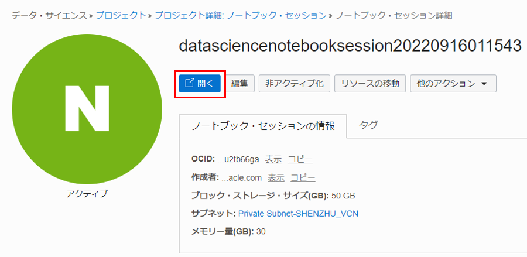

# 事前準備

## 仮想クラウド・ネットワークの作成

OCIコンソールで「仮想クラウド・ネットワーク」 > 「VCNウィザードの起動」 > 「インターネット接続性を持つVCNの作成」を選択して、VCNとサブネットを作成します。これにより、NAT ゲートウェイを使用して必要なプライベート・サブネットを自動的に作成します。

## 動的グループの作成

次の一致ルールで動的グループを作成します。

```
ALL { resource.type = 'datasciencenotebooksession' }
```

## ポリシーの作成

次のステートメントを使用して、ルート・コンパートメントにポリシーを作成します。

サービス・ポリシー

```
allow service datascience to use virtual-network-family in tenancy
```

管理者以外のユーザー・ ポリシー

```
allow group <ユーザー・グループ> to use virtual-network-family in tenancy
allow group <ユーザー・グループ> to manage data-science-family in tenancy
```

動的グループに対するポリシー

```
allow dynamic-group <作成した動的グループ> to manage data-science-family in tenancy
```

# ノートブック・セッションの作成

OCI コンソール画面左上のハンバーガーメニューを展開し、「アナリティクスとAI」 > 「データ・サイエンス」を選択します。


プロジェクトを作成します。コンパートメントを選択し、「プロジェクトの作成」をクリックします。プロジェクトの作成画面で、名前と説明を入力し、「作成」をクリックします。


ノートブック・セッションを作成します。作成したプロジェクト名をクリックします。


プロジェクトの詳細画面で、「ノートブック・セッションの作成」をクリックします。


ノートブック・セッションの詳細を入力します。

* 名前：任意の名前を入力します。
* コンピュート・シェイプ： Intel Skylake VM. Standard2.2 を選択します。
* ブロック・ストレージ・サイズ： 50 GB に設定します。 
* VCNとサブネット：「カスタム・ネットワーキング」を選択し、作成したインターネット接続のあるプライベート・サブネットを選択します。
* 「作成」をクリックします。


ノートブック・セッション VM が作成されます。これは数分かかります。プロビジョニングされたノートブック・セッションを開くと、以下の画面になります。


# API 署名キーと構成ファイルの作成

API 署名キー・ ペアを生成します。
OCIコンソール画面右上のプロファイル・アイコンをクリックし、「ユーザー設定」を選択します。


左側で「APIキー」を選択し、「APIキーの追加」をクリックします。


「APIキー・ペアの生成」を選択し、「秘密キーのダウンロード」をクリックし、キー・ファイルを保存します。「追加」をクリックします。


構成ファイルをコピーし、「閉じる」をクリックします。


構成ファイル（config）を作成し、コピーした値を貼り付けます。 key_file の値を、生成された秘密キーのパスに置き換えます。


ノートブック・セッションを起動します。ノートブック・セッションの詳細画面で「開く」をクリックします。



ターミナルを開きます。「File」>「New Launcher」を選択します。Launcher画面で「Terminal」アイコンを選択します。


ターミナルで、以下のコマンドを実行し、.oci ディレクトリを作成します。

```bash
mkdir ~/.oci
```

アップロード・アイコンをクリックし、作成した構成ファイルと秘密キーをノートブック・セッションにアップロードします。


ターミナルで、以下のコマンドを実行し、構成ファイルと秘密キーを .oci フォルダーに移動します。

```bash
mv <path of the config file> ~/.oci/
mv <path of the private key> ~/.oci/
```


# 画像分析 API の呼びだし

[Image features demo 1](https://github.com/oracle-japan/ai-services-tutorials/blob/main/vision/image-demo1.ipynb) および [Image features demo 2](https://github.com/oracle-japan/ai-services-tutorials/blob/main/vision/image-demo2.ipynb) ファイルをダウンロードし、ノートブックにアップロードします。


[Image features demo 1](https://github.com/oracle-japan/ai-services-tutorials/blob/main/vision/image-demo1.ipynb) は画像分類のノートブックで、[Image features demo 2](https://github.com/oracle-japan/ai-services-tutorials/blob/main/vision/image-demo2.ipynb) は物体検出と テキスト検出のノートブックです。
アップロードしたノートブックを開きます。各セルを調べて、1 つずつ実行します。 各セルで Shift+Enter キーをクリックして、セル内のコードを実行できます。

# ドキュメント分析 API の呼びだし

[Document AI features demo 1](https://github.com/oracle-japan/ai-services-tutorials/blob/main/vision/document-demo1.ipynb) および [Document AI features demo 2](https://github.com/oracle-japan/ai-services-tutorials/blob/main/vision/document-demo2.ipynb) ファイルをダウンロードし、ノートブックにアップロードし、実行します。
[Document AI features demo 1](https://github.com/oracle-japan/ai-services-tutorials/blob/main/vision/document-demo1.ipynb) は、テキスト分類のノートブックで、 [Document AI features demo 2](https://github.com/oracle-japan/ai-services-tutorials/blob/main/vision/document-demo2.ipynb) は、文書分類、言語分類、テーブル検出のノートブックです。


# バッチ（非同期 API）の呼びだし

[Image classification batch feature demo](https://github.com/oracle-japan/ai-services-tutorials/blob/main/vision/image-batch-demo.ipynb) および [Document text detection batch feature demo](https://github.com/oracle-japan/ai-services-tutorials/blob/main/vision/document-batch-demo.ipynb) ファイルをダウンロードし、ノートブックにアップロードし、実行します。

[Image classification batch feature demo](https://github.com/oracle-japan/ai-services-tutorials/blob/main/vision/image-batch-demo.ipynb) は、画像分類のノートブックで、[Document text detection batch feature demo](https://github.com/oracle-japan/ai-services-tutorials/blob/main/vision/document-batch-demo.ipynb) は、テキスト検出のノートブックです。これらのノートブックは、バッチ入力よりも Vision サービスの画像とドキュメントの AI 機能を使用する方法を示しています。


