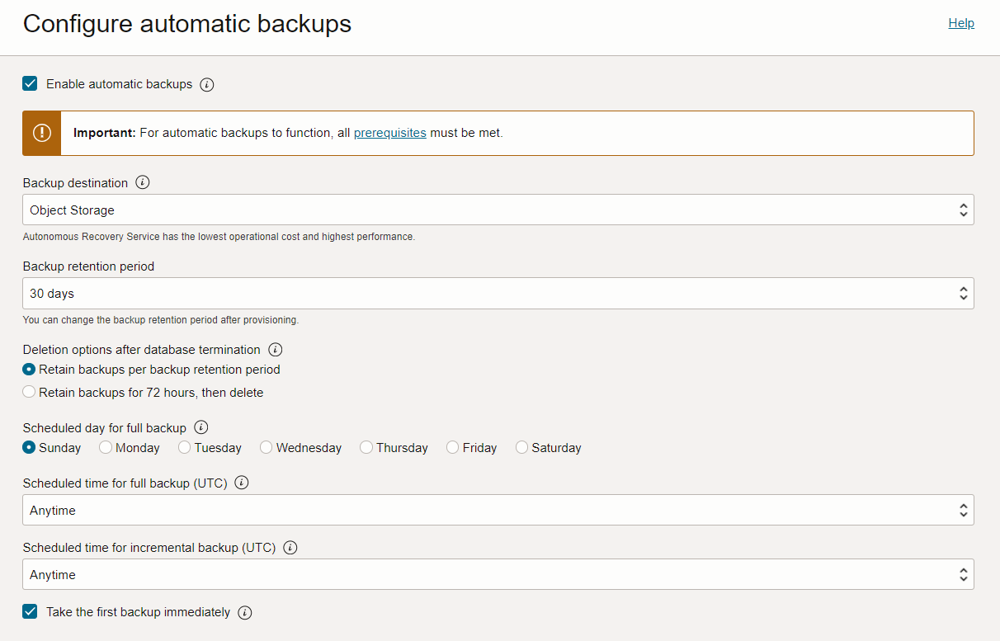
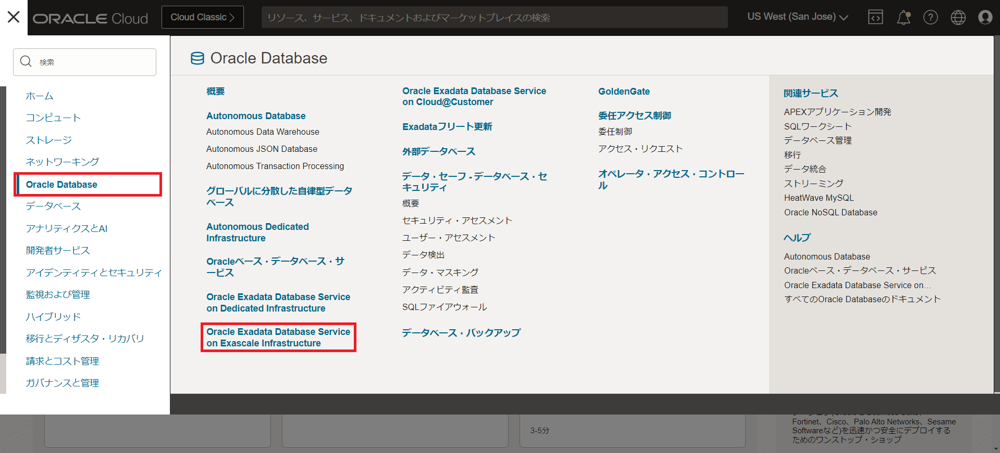
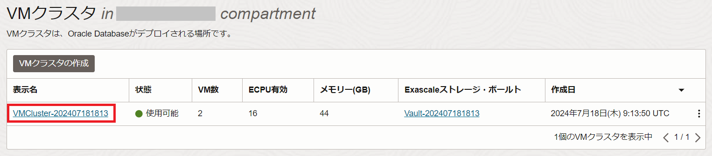
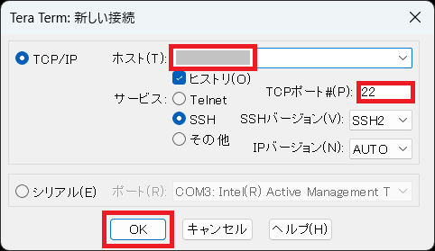
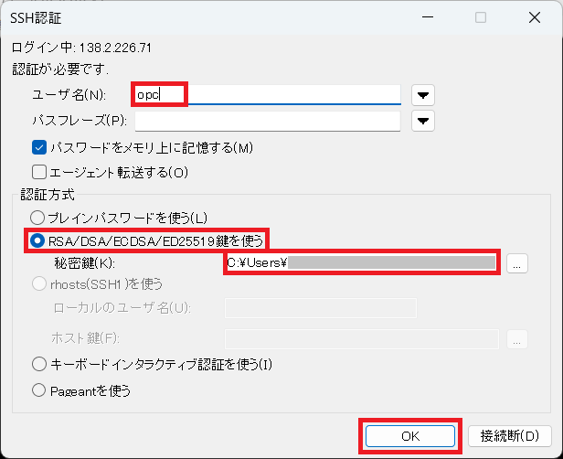
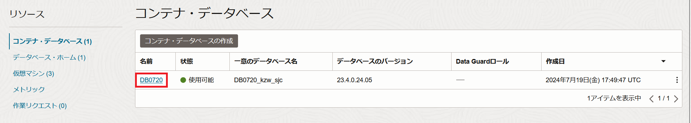
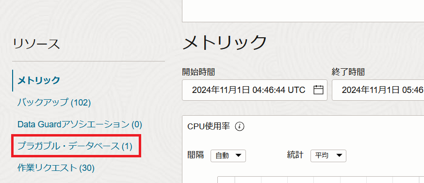
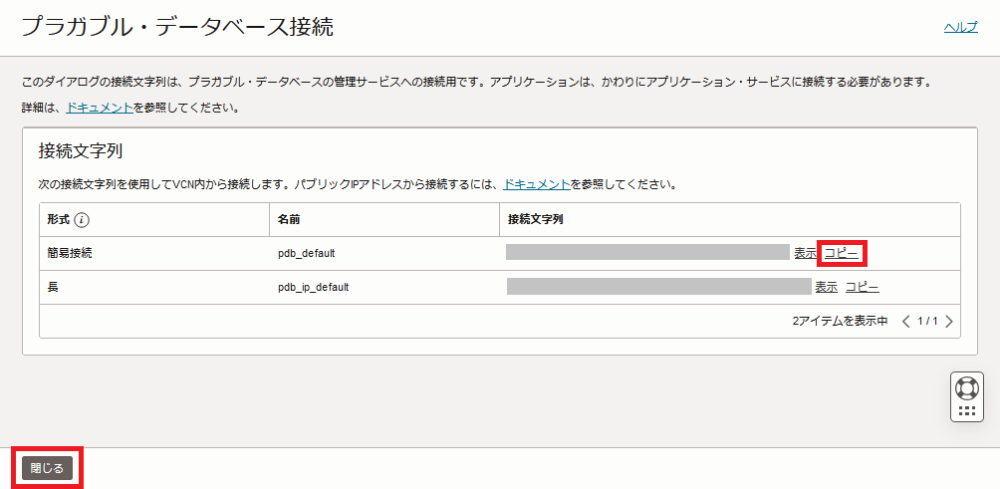

# はじめに

**Oracle Exadata Database Service on Exascale Infrastructure (ExaDB-XS)** は、Oracle AI Database が高い可用性を備えつつ高いパフォーマンスを発揮できる**Oracle Exadata Database Machine (Exadata)**を、より低いエントリーコストでご利用いただけるサービスです。

ExaDB-XS は、Exadata Database Service on Dedicated Infrastructure (ExaDB-D)と同じ強力な自動化機能を使用して VM クラスタとデータベースを管理しますが、物理的なコンピュートとストレージはサービスから抽象化されます。VM クラスタとデータベースをデプロイするだけで、その上で実行されるオラクル管理のインフラストラクチャを意識する必要はありません。

この章では、ExaDB-XS の VM クラスタとデータベースの作成を行います。

<br>

**前提条件 :**

- **VCN の作成**

  [Oracle Cloud Infrastructure チュートリアル](../../beginners/creating-vcn/index.md) を参考に、仮想クラウド・ネットワーク(VCN)の作成が完了していること

- **サービス制限の確認・引き上げのリクエスト**

  ExaDB-XS を利用するには、まずサービス制限を引き上げる必要があります。サービス制限については[もしもみなみんが DB をクラウドで動かしてみたら - 第 16 回 サービス制限について](https://blogs.oracle.com/otnjp/post/minamin-cloud-016-servicelimits)を参照ください。

<br>

**注意** チュートリアル内の画面ショットについては Oracle Cloud Infrastructure の現在のコンソール画面と異なっている場合があります

<a id="anchor1"></a>

# 1. VM クラスタおよびデータベースの作成

[Exascale インフラストラクチャでの Oracle Exadata Database Service のプロビジョニング](https://docs.oracle.com/ja/learn/exadb-xs-db/index.html)を参考に、ExaDB-XS の VM クラスタを作成し、その上にコンテナ・データベースをプロビジョニングします。

> **タスク 2：コンテナ・データベースのプロビジョニング**のステップ 3 の**「データベース・バックアップの構成」**でバックアップ保存先を設定します。
> その際、デフォルト設定の Autonomous Recovery Service を使用する場合は、[103 : 自動バックアップを設定しよう](../../exadbd/exadb-d103-automatic-backup/index.md)を参考に、セットアップを行ってください。
> オブジェクト・ストレージを選択する場合は、セットアップ作業は不要です。
>
> 

<br/>

# 2. **DB システムへのアクセス**

1. OCI コンソール・メニューから **Oracle AI Database** → **Oracle Exadata Database Service on Exascale Infrastructure** に移動します。

   

1. [1. VM クラスタおよびデータベースの作成](#anchor1)で作成した**VM クラスタ**の表示名をクリックします。

   

1. **リソース**の一覧から**仮想マシン**をクリックします。

   

1. 接続したいノードの**パブリック IP アドレス**に表示されている IP アドレスをメモします。

   

1. 任意のターミナルソフトを起動し、以下の情報で ssh 接続します。

   - **IP アドレス** - 上記ステップで確認したインスタンスの **パブリック IP アドレス**
   - **ポート** - 22 (デフォルト)
   - **ユーザー** - opc (DB システムは、接続用に予め opc というユーザーが用意されています)
   - **SSH 鍵** - [1. VM クラスタおよびデータベースの作成](#anchor1)で追加した公開鍵と対になる秘密鍵を使用します。
   - **パスフレーズ** - 秘密鍵にパスフレーズが設定されている場合は指定してください。
     下記は Tera Term を利用した場合の接続の設定例です。

   

   

   接続が成功すると以下のように表示されます。

   

1. oracle ユーザーにログインします。

   実行コマンド

   ```sh
   sudo su -　oracle
   ```

   実行例

   ```sh
   [opc@demo1-hqilr ~]$ sudo su - oracle
   Last login: Fri Nov  1 04:06:00 UTC 2024
   [oracle@demo1-hqilr ~]$
   ```

   ログアウトせず、そのまま次に進んでください。

<BR>

# 3. **データベース(PDB)へのアクセス**

1. 環境変数設定ファイルの読み込み

   oracle ユーザーのホーム・ディレクトリ(/home/oracle)に環境変数設定ファイルが自動で生成されていて、そのファイルの中身を読み込むことで簡単に環境変数が設定され、データベースの接続が簡素化されます。

   以下のように環境変数設定ファイルを確認し、読み込みます。また、環境変数の設定が反映されたか確認します。

   実行コマンド

   ```sh
   ls
   . <データベース名> .env
   env | grep ORACLE
   ```

   実行例

   ```sh
   [oracle@demo1-hqilr ~]$ ls
   DB0720.env
   [oracle@demo1-hqilr ~]$ . DB0720.env
   [oracle@demo1-hqilr ~]$ env | grep ORACLE
   ORACLE_UNQNAME=DB0720_kzw_sjc
   ORACLE_SID=DB07201
   ORACLE_BASE=/u02/app/oracle
   ORACLE_HOME=/u02/app/oracle/product/23.0.0.0/dbhome_1
   ORACLE_HOSTNAME=demo1-hqilr.sub07180912150.vcnsjc.oraclevcn.com
   ```

1. データベース(CDB)に接続する

   以下のコマンドを用いてデータベースのコンテナ・データベース (CDB)に対して sys ユーザで SQL\*Plus から接続します。

   実行コマンド

   ```sh
   sqlplus / as sysdba
   ```

   実行例

   ```sh
   [oracle@demo1-hqilr ~]$ sqlplus / as sysdba

   SQL*Plus: Release 23.0.0.0.0 - Production on Fri Nov 1 04:40:20 2024
   Version 23.4.0.24.05

   Copyright (c) 1982, 2024, Oracle.  All rights reserved.


   Connected to:
   Oracle Database 23ai EE Extreme Perf Release 23.0.0.0.0 - Production
   Version 23.4.0.24.05

   SQL>
   ```

   接続しているデータベースのデータベース名とコンテナ名を確認します。

   実行コマンド

   ```sql
   show parameter db_name
   show con_name
   ```

   実行例

   ```
   SQL> show parameter db_name

   NAME                                 TYPE        VALUE
   ------------------------------------ ----------- ------------------------------
   db_name                              string      DB0720
   SQL> show con_name

   CON_NAME
   ------------------------------
   CDB$ROOT
   SQL>
   ```

1. PDB に接続する

   データベース構築時に作成された PDB を確認し、PDB に接続します。
   (PDB$SEED でない方の PDB 名を指定します)

   実行コマンド

   ```sql
   show pdbs
   alter session set container = <PDB名> ;
   ```

   実行例

   ```sql
   SQL> show pdbs

       CON_ID CON_NAME                       OPEN MODE  RESTRICTED
   ---------- ------------------------------ ---------- ----------
           2 PDB$SEED                       READ ONLY  NO
           3 PDB1                           READ WRITE NO
   SQL> alter session set container = PDB1 ;

   Session altered.

   SQL>
   ```

1. PDB 上にスキーマを作成します。

   尚、ここでは便宜上、最低限必要な権限を付与していますが、要件に応じて権限・ロールを付与するようにしてください。

   実行コマンド

   ```sql
   create user TESTUSER identified by <任意のパスワード> ;
   grant CREATE SESSION, CONNECT,RESOURCE,UNLIMITED TABLESPACE to TESTUSER ;
   exit
   ```

   実行例

   ```sql
   SQL> create user TESTUSER identified by Welcome1 ;

   User created.

   SQL> grant CREATE SESSION, CONNECT,RESOURCE,UNLIMITED TABLESPACE to TESTUSER ;

   Grant succeeded.

   SQL> exit
   SQL> exit
   Disconnected from Oracle Database 23ai EE Extreme Perf Release 23.0.0.0.0 - Production
   Version 23.4.0.24.05
   [oracle@demo1-hqilr ~]$
   ```

<BR>

# 4. **PDB 上のスキーマへのアクセス**

1.  OCI コンソール・メニューから **Oracle AI Database** → **Oracle Exadata Database Service on Exascale Infrastructure** に移動します。

    

1.  [1. VM クラスタおよびデータベースの作成](#anchor1)で作成した**VM クラスタ**の表示名をクリックします。

    

1.  **データベース**の一覧から作成したデータベースの名前をクリックします。

    

1.  **リソース**の一覧から**プラガブル・データベース**をクリックします。

    

1.  **プラガブル・データベース**の一覧から接続したい PDB の名前をクリックします。

    

1.  **PDB 接続**をクリックします。

    

1.  **簡易接続**の接続文字列の右にある**コピー**をクリックし、クリップボードに簡易接続文字列をコピーします。
    その後、**閉じる**をクリックし、ダイアログを閉じます。

        

1.  DB システムへアクセスして oracle ユーザとしてログインします。([2. DB システムへのアクセス](#anchor2)を参照ください。)

1.  環境変数設定ファイルを読み込みます。([3. データベース(PDB)へのアクセスの 1.](#anchor3)を参照ください。)

1.  PDB 上のスキーマに接続します。

    実行コマンド

    ```sh
    sqlplus <スキーマ名>/<パスワード>@<簡易接続文字列>
    ```

    実行例

    ```sh
    [oracle@demo1-hqilr ~]$ sqlplus testuser/Welcome1@<簡易接続文字列>

    SQL*Plus: Release 23.0.0.0.0 - Production on Fri Nov 1 06:14:44 2024
    Version 23.4.0.24.05

    Copyright (c) 1982, 2024, Oracle.  All rights reserved.

    Last Successful login time: Mon Sep 02 2024 05:08:30 +00:00

    Connected to:
    Oracle Database 23ai EE Extreme Perf Release 23.0.0.0.0 - Production
    Version 23.4.0.24.05

    SQL>
    ```

1.  接続情報を確認します。

    実行コマンド

    ```sql
    show con_name
    show user
    ```

    実行例

    ```sql
    SQL> show con_name

    CON_NAME
    ------------------------------
    PDB1
    SQL> show user
    USER is "TESTUSER"
    ```

以上で、この章の作業は完了です。

<br>

# 参考資料

- [Oracle Exadata Database Service on Exascale Infrastructure の紹介](https://blogs.oracle.com/oracle4engineer/post/ja-introducing-oracle-exadata-database-service-on-exascale-infrastructure)
- [Exascale インフラストラクチャでの Oracle Exadata Database Service のプロビジョニング](https://docs.oracle.com/ja/learn/exadb-xs-db/index.html)
