# はじめに

**Oracle Cloud Infrastructure Exadata Database Service on Dedicated Infrastructure (ExaDB-D)** は、Oracle AI Database が高い可用性を備えつつ高いパフォーマンスを発揮できる**Oracle Exadata Database Machine (Exadata)**が利用可能なサービスです。同じように OCI 上で Exadata を利用可能なサービスとしては、Autonomous Data Warehouse や Autonomous Transaction Processing などの Autonomous Database のサービスがありますが、ExaDB-D が他のサービスと大きく違うところは、全オプションが使える**専有型の Automated 型 サービス**であるということです。

- **専有型** : H/W もユーザー専有となり、他のユーザーの環境と分離されるため、セキュリティ・性能を担保できます。
- **User-Managed サービス** : OS 以上は顧客管理。OS 上の構築・運用・管理に有効な機能を、クラウドのツールでも提供。パッチ適用やメンテナンスの実施判断・作業タイミングは顧客判。OS ログインが可能でこれまで同様の管理方法を用いることができる (OS 権限が必要な変更作業、サード・パーティの Agent の導入、ローカルにログやダンプファイルの配置など)ので、別途インスタンスやストレージサービスを立てる必要はありません。

また、オンライン・スケーリング (停止なし)での 1 時間単位での柔軟な価格体系、デフォルトでの可用性構成や容易に高可用性構成が組めること、PaaS としてのプロビジョニングや管理面などのメリットがあります。

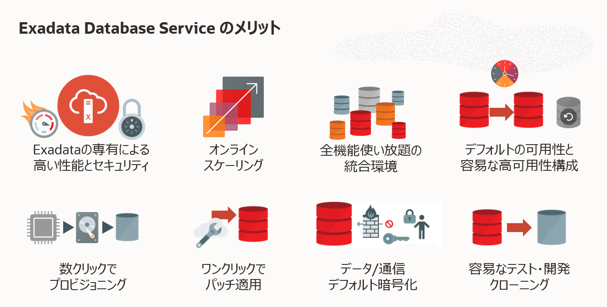

**前提条件 :**

- **シェイプの確認**
  ExaDB-D で利用したいシェイプ名を事前に確認しましょう。ExaDB-D で利用可能なシェイプについては[Oracle Cloud Infrastructure Documentation - Oracle Exadata Database Service on Dedicated Infrastructure Description](https://docs.oracle.com/cd/F56555_01/ecscm/exa-service-desc.html)を参照ください。
- **サービス制限の確認・引き上げのリクエスト**
  ExaDB-D を利用するには、まずサービス制限を引き上げる必要があります。サービス制限については[もしもみなみんが DB をクラウドで動かしてみたら - 第 16 回 サービス制限について](https://blogs.oracle.com/otnjp/post/minamin-cloud-016-servicelimits)を参照ください。
- **テナント内の準備**

  次に、環境作成する前に必要な環境確認やインフラレイヤーでの準備を、下記のチュートリアルをみながら準備しましょう。

  - [OCI コンソールにアクセスして基本を理解する](../../beginners/getting-started/)
  - [クラウドに仮想ネットワーク(VCN)を作る](../../beginners/creating-vcn/)

  ExaDB-D 用の VCN 内の設定として、前提条件は下記のようなものがあります。

  - ExaDB-D では、２つのサブネット(クライアント・サブネットとバックアップ・サブネット)が必要なので２つ作成
  - クライアント・サブネット内では全てのノード間で、TCP と ICMP の疎通が必要なのでセキュリティ・リストを設定
  - IP アドレス・スペースの要件

    - Exadata Database Cloud で利用するサブネットは下記と重複しないこと

      X8 以前： 192.168.\*(特に 192.168.128.0/20)

      X8M 以降： 100.64.0.0/10

    - クライアント・サブネットで 192.168.16.16/28 と重複しないこと
    - 複数システムを利用する場合、相互の IP アドレスが重複しないこと
    - シェイプ(ラック・サイズ)に応じて、必要なアドレス数を用意 ([Oracle Cloud Infrastructure Documentation - Network Setup for Exadata Cloud Infrastructure Instances](https://docs.oracle.com/en-us/iaas/exadatacloud/exacs/ecs-network-setup.html#vcn-subnets)を参照ください。)

**所要時間 :** 約 6 時間

<BR>

# 1. Exadata Infrastructure の作成

1. OCI コンソール・メニューから **Oracle AI Database** → **Oracle Exadata Database Service on Dedicated Inrastructure** に移動します。


1. 利用したいコンパートメントを**コンパートメント**から選択します。

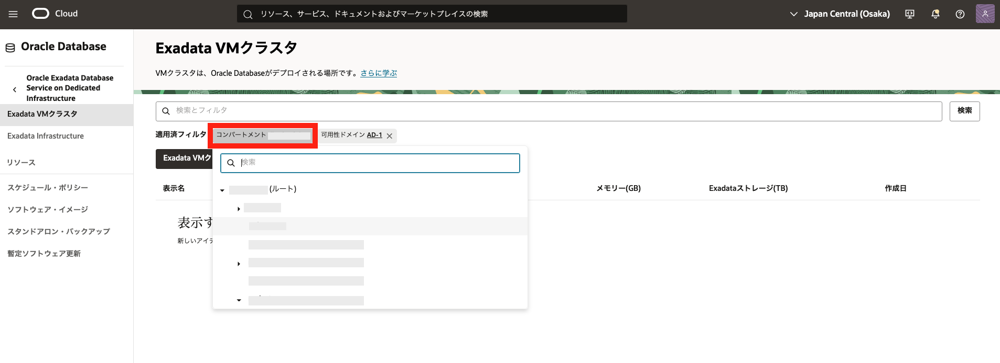

2. 利用したいリージョンを右上のリージョンのメニューをクリックして、**リージョン**の一覧から選択します。

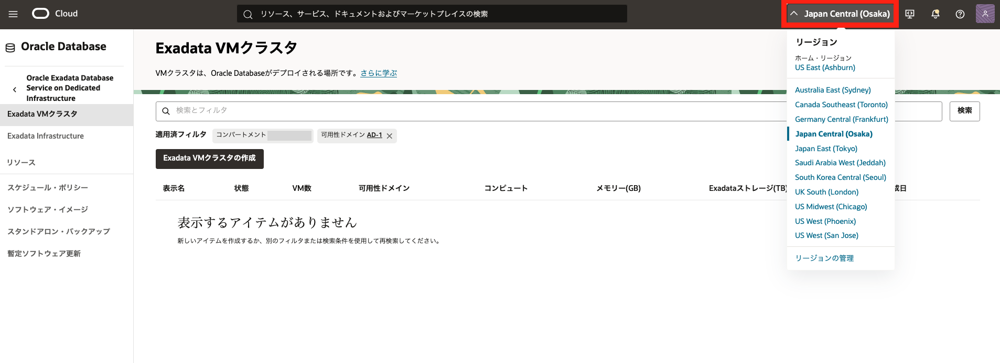

3. 画面左の **Oracle Exadata Database Service on Dedicated Inrastructure** の下の **Exadata Infrastructure** をクリックします。
4. **Exadata インフラストラクチャの作成** をクリックします。

5. **Exadata インフラストラクチャの作成** の各項目は以下のように設定します。その他の設定はデフォルトのままにします。
   **Exadata Infrastructure の作成**
   - **表示名** - 任意
   - **コンパートメント** - 利用したいコンパートメントを選択します。
   - **可用性ドメインの選択** - 利用する可用性ドメインを選択します。 (東京や大阪の場合は 1 つしかありません。)
   - **配置クラスタグループ** - 利用したいクラスタグループを選択します。
   - **Exadata クラウド・インフラストラクチャ・モデルの選択** - 利用するシェイプ (Exadata の Rack モデル)を選択します。
   - **コンピュートおよびストレージ構成** (X8-2、X8M-2、X9M-2、X11M を選択した場合。※Exadata ベース、X6-2、X7-2、X8-2 を選択した場合は設定が異なります。)
     - **データベース・サーバー** - 使用したいデータベース・サーバーの台数を指定します。 (最低 2 台)
     - **ストレージ・サーバー** - 使用したいストレージ・サーバーの台数を指定します。 (最低 3 台)

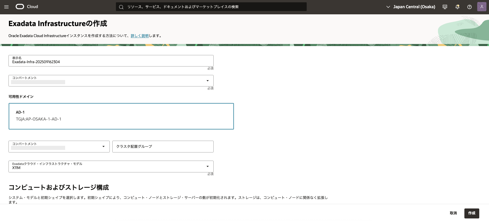

**システム構成の選択** (X8-2、X8M-2、X9M-2、X11M を選択した場合) - 使用したいシステム構成を選択します。
設定後、**Exadata Infrastructure の作成**をクリックします。作成まで 1 分ほどかかります。

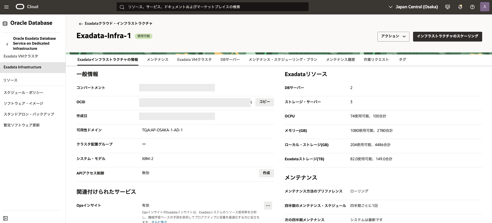

<BR>

# 2. Exadata VM クラスタの作成

1. OCI コンソール・メニューから **Oracle AI Database** → **Oracle Exadata Database Service on Dedicated Inrastructure** に移動します。


2. **Exadata VM クラスタの作成** をクリックします。

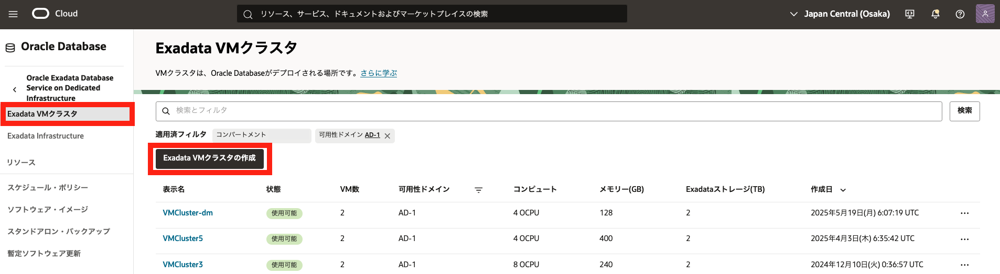

<a id="anchor1"></a>

3. **Exadata VM クラスタの作成** の各項目は以下のように設定します。その他の設定はデフォルトのままにします。

   - **表示名** - 任意
   - **クラスタ名** - 任意もしくはなしでも可能
   - **コンパートメント** - 利用したいコンパートメントを選択します。
   - **[コンパートメント名]の Exadata インフラストラクチャの選択** - [1. Exadata Infrastructure の作成](#1-exadata-infrastructureの作成)で作成した Exadata インフラストラクチャを選択します。
   - **バージョン** - Grid Infrastructure のバージョンを選択します。

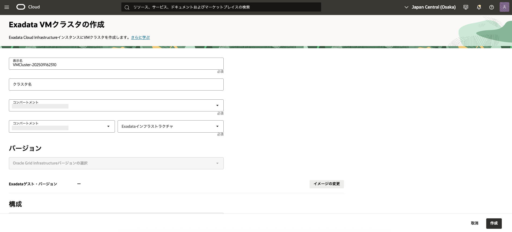

- **構成** - **仮想マシン当たりの OCPU 数を指定** - 仮想マシン当たりで利用したい OCPU 数を指定します。　(本ガイドではデフォルトの 2 を選択します。)
- **Eadata ストレージ** - 使用可能な Exadata ストレージ(TB)の指定をします

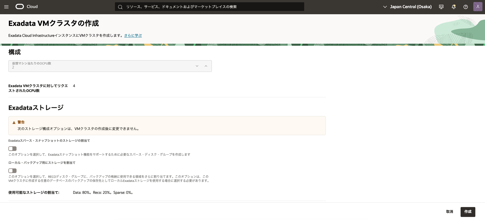

- **SSH キーの追加** - **ペアの生成**、**SSH キー・ファイルのアップロード**、**SSH キーの貼付け**のいずれかの選択肢より SSH キーを追加します。
- **ネットワーク設定の構成**
  - **[コンパートメント名]の仮想クラウド・ネットワークの選択** - 前提条件で用意した VCN を指定します。
  - **[コンパートメント名]のクライアントのサブネットの選択** - 前提条件で用意したクライアント用のサブネットを選択します。
  - **[コンパートメント名]のバックアップ・サブネットの選択** - 前提条件で用意したバックアップ用のサブネットを選択します。
  - **ホスト名接頭辞** - 任意

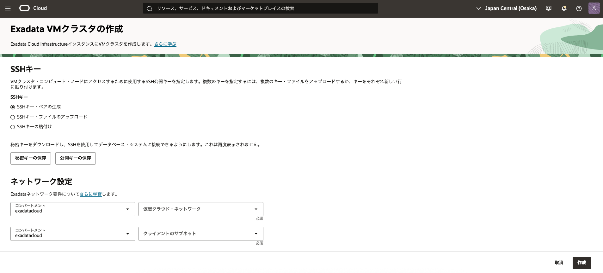

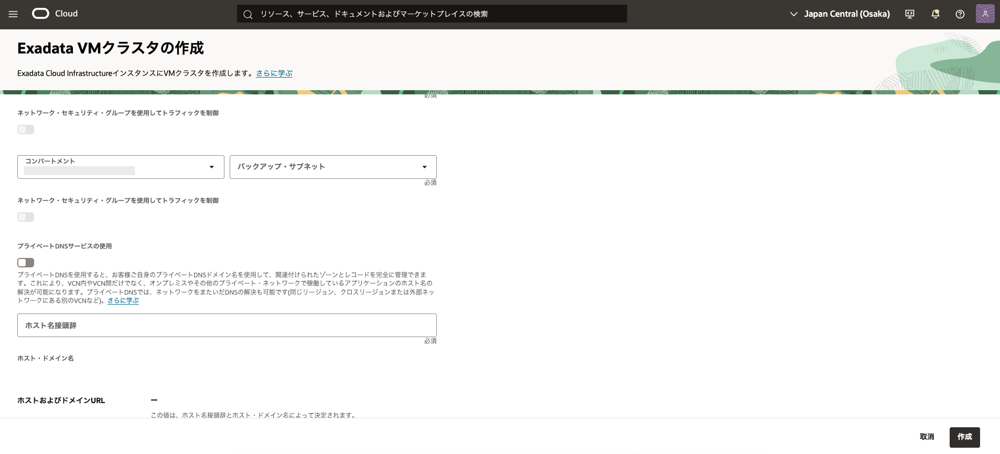

- **ライセンス・タイプの選択** - **含まれるライセンス**、**ライセンス持ち込み(BYOL)** のいずれかを選択します。

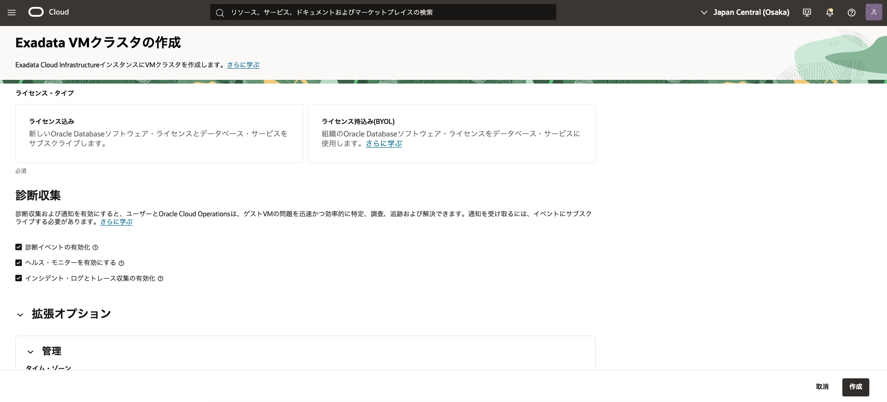

- **拡張オプションの表示** - 拡張オプションを表示すると以下の設定ができます。（文字コードを選択できることを確認ください。）
  - **管理** - フォルト・ドメインとタイム・ゾーンの指定ができます。
  - **ネットワーク** - SCAN リスナー・ポート(TCP/IP)指定できます。
  - **クラウド自動化更新** - Oracle は、クラウド・ツールおよび自動化に必要なデータベース・ツールおよびエージェント・ソフトウェアの更新を定期的に適用します。VM クラスタに更新を適用する希望の期間を構成できます
  - **セキュリティ** - セキュリティ属性を追加し、Zero Trust Packet Routing (ZPR)ポリシーを使用してリソースへのアクセスを制御できます。
  - **タグ** - フリーフォーム・タグと定義済タグでリソースを編成するためにメタデータを追加できます。

設定後、**Exadata VM クラスタの作成** をクリックします。作成まで 3~4 時間ほどかかります。

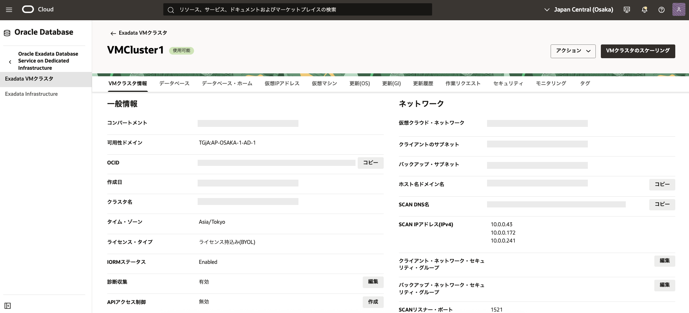

<BR>

# 3. **データベースの作成**

1. OCI コンソール・メニューから **Oracle AI Database** → **Oracle Public Cloud 上の Exadata** に移動します。


2. [2. Exadata VM クラスタの作成](#2-exadata-vmクラスタの作成)で作成した**Exadata VM クラスタ**の表示名をクリックします。


3. **データベースの作成** をクリックします。


4. **データベースの作成** の各項目は以下のように設定します。その他の設定はデフォルトのままにします。

   - **データベースの基本情報**
     - **データベース名** - 任意
     - **一意のデータベース名** - 任意もしくはなしでも可能
     - **データベースのバージョン** - 利用したいデータベースのバージョンを選択します。
     - **PDB 名** - 任意もしくはなしでも可能 (なしの場合、デフォルトで PDB1 と設定されます。)

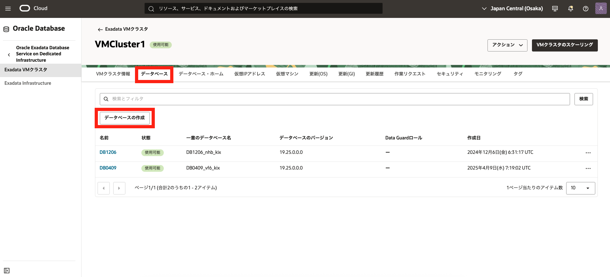

- **データベース・ホームの指定**
  - **データベース・ホームの表示名** - 任意
  - **データベース・イメージ** - データベース・イメージの変更をクリックします。
    **データベース・ソフトウェア・イメージ**の選択画面で、使用したい**イメージ・タイプ**と**Oracle AI Database バージョン**選択します。

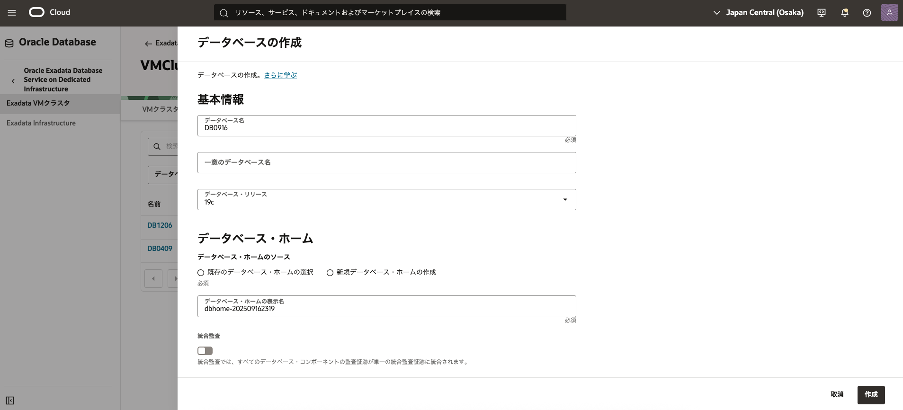

設定後、**選択**をクリックします。

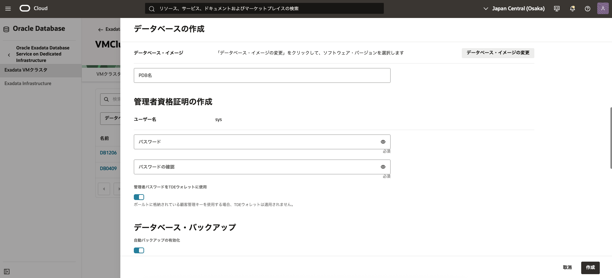

- **管理者資格証明の作成**
  - **パスワード** - 任意 (sys スキーマのパスワードです。後から使用しますので、忘れずにメモしておいてください。)
  - **パスワードの確認** - 任意 (sys スキーマのパスワードです。後から使用しますので、忘れずにメモしておいてください。)
- **ワークロード・タイプの選択** - **トランザクション処理**か**データ・ウェアハウス**のいずれかを選択します。
- **データベース・バックアップの構成**
- **自動バックアップの有効化** からチェックを外します。自動バックアップは作成後に有効化可能です。この章ではチェックを外します。

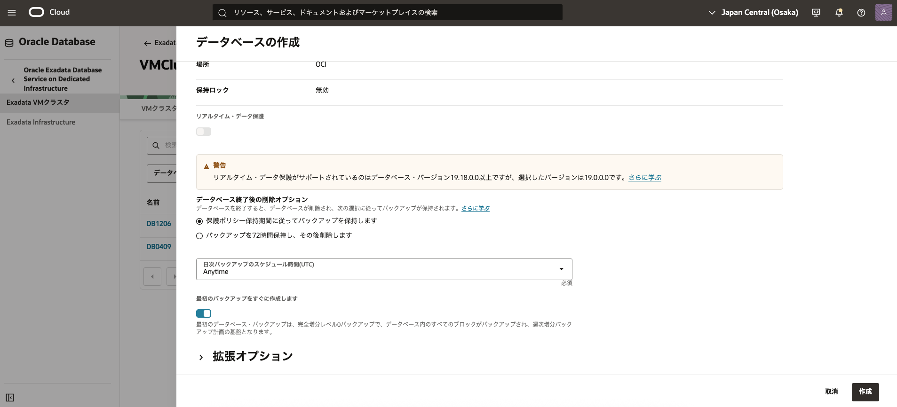

設定後、**データベースの作成** をクリックします。作成まで 40 分ほどかかります。

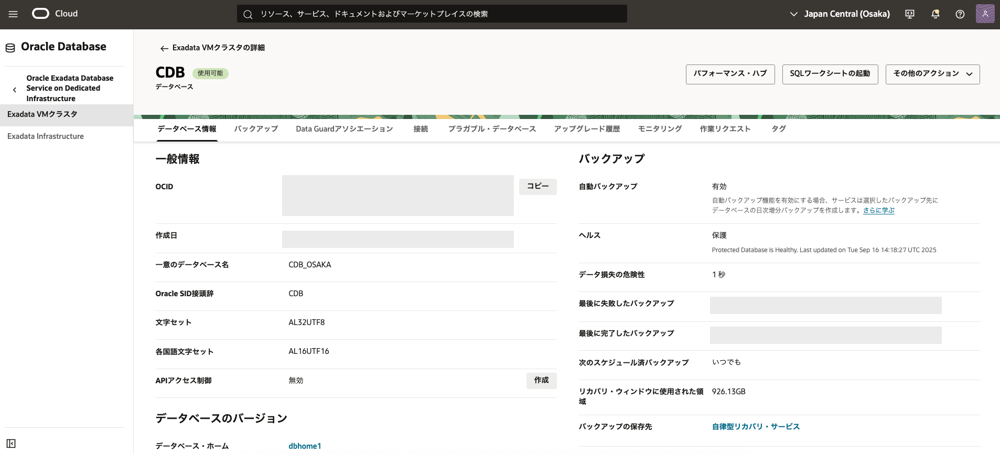

<BR>

<a id="anchor2"></a>

# 4. **DB システムへのアクセス**

1. OCI コンソール・メニューから **Oracle AI Database** → **Oracle Exadata Database Service on Dedicated Inrastructure** に移動します。

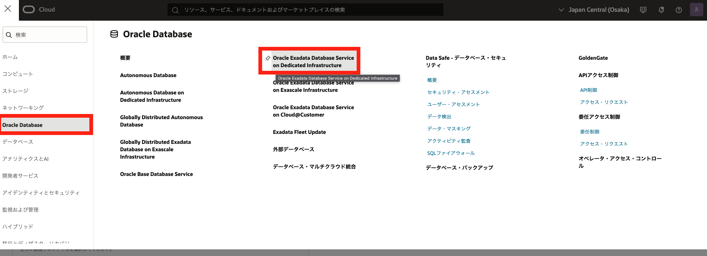

2. [2. Exadata VM クラスタの作成](#2-exadata-vmクラスタの作成)で作成した**Exadata VM クラスタ**の表示名をクリックします。

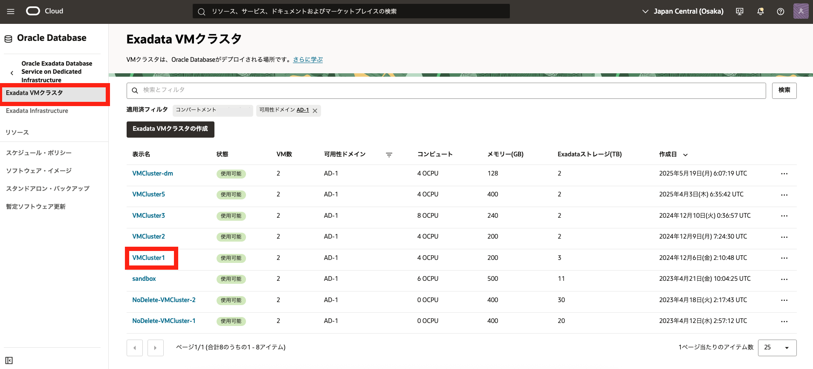

3. **リソース**の一覧から**仮想マシン**をクリックします。

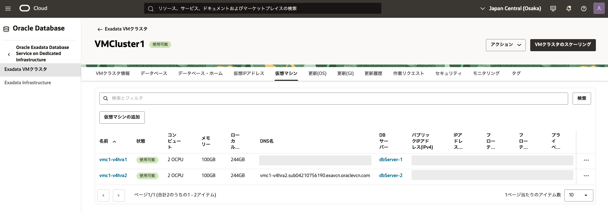

4. 接続したいノードの**パブリック IP アドレス**に表示されている IP アドレスをメモします。
5. 任意のターミナルソフトを起動し、以下の情報で ssh 接続します。

   - **IP アドレス** - 上記ステップで確認したインスタンスの **パブリック IP アドレス**
   - **ポート** - 22 (デフォルト)
   - **ユーザー** - opc (DB システムは、接続用に予め opc というユーザーが用意されています)
   - **SSH 鍵** - [2. Exadata VM クラスタの作成の 3.](#anchor1)で追加した公開鍵と対になる秘密鍵を使用します。
   - **パスフレーズ** - 秘密鍵にパスフレーズが設定されている場合は指定してください。
     下記は Tera Term を利用した場合の接続の設定例です。

   

   

   接続が成功すると以下のように表示されます。

   

6. oracle ユーザーにログインします。

   実行コマンド

   ```
   sudo su -　oracle
   ```

   実行例

   ```
   [opc@exa1-tmhmo1 ~]$ sudo su - oracle
   Last login: Fri Jul  8 17:30:15 JST 2022
   [oracle@exa1-tmhmo1 ~]$
   ```

   ログアウトせず、そのまま次に進んでください。

<BR>

# 5. **データベース(PDB)へのアクセス**

<a id="anchor3"></a>

1. 環境変数設定ファイルの読み込み

   oracle ユーザーのホーム・ディレクトリ(/home/oracle)に環境変数設定ファイルが自動で生成されていて、そのファイルの中身を読み込むことで簡単に環境変数が設定され、データベースの接続が簡素化されます。

   以下のように環境変数設定ファイルを確認し、読み込みます。また、環境変数の設定が反映されたか確認します。

   実行コマンド

   ```
   ls
   . <データベース名> .env
   env | grep ORACLE
   ```

   実行例

   ```
   [oracle@exa1-tmhmo1 ~]$ ls
   DB.env
   [oracle@exa1-tmhmo1 ~]$ . DB.env
   [oracle@exa1-tmhmo1 ~]$ env | grep ORACLE
   ORACLE_UNQNAME=DB_bkc_kix
   ORACLE_SID=DB1
   ORACLE_BASE=/u02/app/oracle
   ORACLE_HOSTNAME=exa1-tmhmo1.sub07160524340.testvcn.oraclevcn.com
   ORACLE_HOME=/u02/app/oracle/product/19.0.0.0/dbhome_1
   ```

2. データベース(CDB)に接続する

   以下のコマンドを用いて[3. データベースの作成](#3-データベースの作成)で作成したデータベースのコンテナ・データベース (CDB)に対して sys ユーザで SQL\*Plus から接続します。

   実行コマンド

   ```
   sqlplus / as sysdba
   ```

   実行例

   ```
   [oracle@exa1-tmhmo1 ~]$ sqlplus / as sysdba

   SQL*Plus: Release 19.0.0.0.0 - Production on Mon Jul 4 22:15:37 2022
   Version 19.15.0.0.0

   Copyright (c) 1982, 2022, Oracle.  All rights reserved.


   Connected to:
   Oracle Database 19c EE Extreme Perf Release 19.0.0.0.0 - Production
   Version 19.15.0.0.0

   SQL>
   ```

   接続しているデータベースのデータベース名とコンテナ名を確認します。

   実行コマンド

   ```sql
   show parameter db_name
   show con_name
   ```

   実行例

   ```
   SQL> show parameter db_name

   NAME                                 TYPE        VALUE
   ------------------------------------ ----------- ------------------------------
   db_name                              string      DB
   SQL> show con_name

   CON_NAME
   ------------------------------
   CDB$ROOT
   ```

3. PDB に接続する

   デフォルトで作成されている PDB を確認し、PDB インスタンスに接続します。

   実行コマンド

   ```sql
   show pdbs
   alter session set container = PDB ;
   ```

   実行例

   ```
   SQL> show pdbs

       CON_ID CON_NAME                       OPEN MODE  RESTRICTED
   ---------- ------------------------------ ---------- ----------
           2 PDB$SEED                       READ ONLY  NO
           3 PDB                            READ WRITE NO
   SQL> alter session set container = PDB ;

   Session altered.

   SQL>
   ```

4. PDB 上にスキーマを作成します。

   尚、ここでは便宜上、最低限必要な権限を付与していますが、要件に応じて権限・ロールを付与するようにしてください。

   実行コマンド

   ```sql
   create user TESTUSER identified by <任意のパスワード> ;
   grant CREATE SESSION, CONNECT,RESOURCE,UNLIMITED TABLESPACE to TESTUSER ;
   exit
   ```

   実行例

   ```
   SQL> create user TESTUSER identified by Welcome1 ;

   User created.

   SQL> grant CREATE SESSION, CONNECT,RESOURCE,UNLIMITED TABLESPACE to TESTUSER ;

   Grant succeeded.

   SQL> exit
   Disconnected from Oracle Database 19c EE Extreme Perf Release 19.0.0.0.0 - Production
   Version 19.15.0.0.0
   [oracle@exa1-tmhmo1 ~]$
   ```

<BR>

# 6. **PDB 上のスキーマへのアクセス**

1. OCI コンソール・メニューから **Oracle AI Database** → **Oracle Public Cloud 上の Exadata** に移動します。


2. [2. Exadata VM クラスタの作成](#2-exadata-vmクラスタの作成)で作成した**Exadata VM クラスタ**の表示名をクリックします。
   **データベース**の一覧から[3. データベースの作成](#3-データベースの作成)で作成したデータベースの名前をクリックします。


3. **リソース**の一覧から**プラガブル・データベース**をクリックします。
   **プラガブル・データベース**の一覧から接続したい PDB の名前をクリックします。

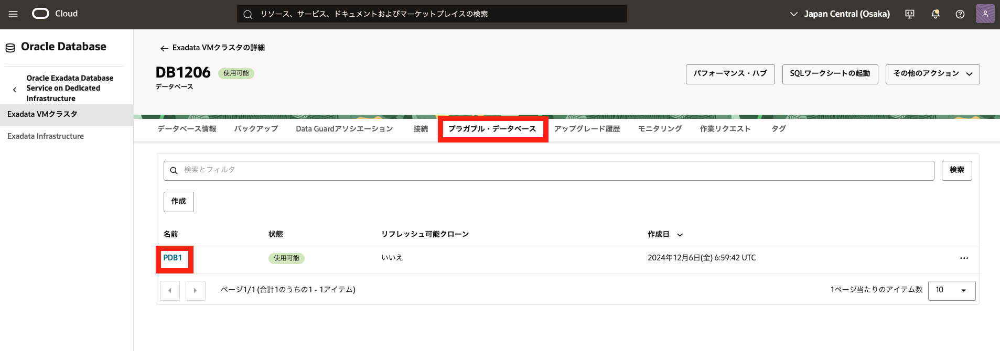

4. **PDB 接続**をクリックします。

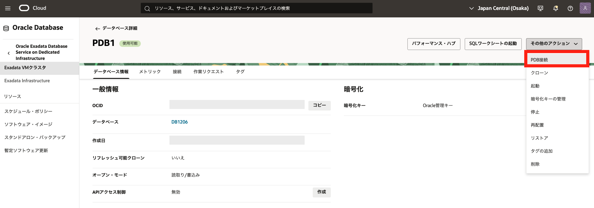

5. **簡易接続**の接続文字列の右にある**コピー**をクリックし、メモします。

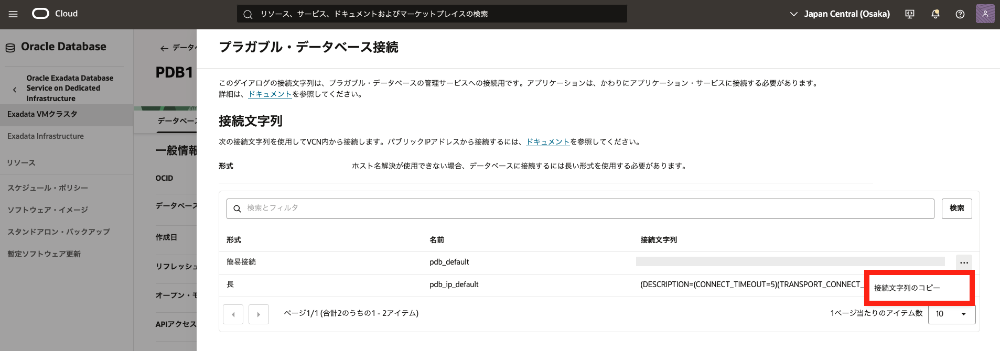

6. ダイアログを閉じます。

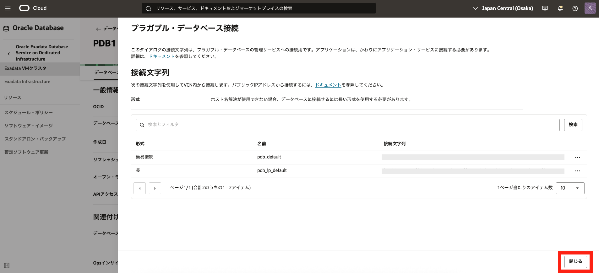

7. DB システムへアクセスして oracle ユーザとしてログインします。([4. DB システムへのアクセス](#anchor2)を参照ください。)

8. 環境変数設定ファイルを読み込みます。([5. データベース(PDB)へのアクセスの 1.](#anchor3)を参照ください。)

9. PDB 上のスキーマに接続します。

   実行コマンド

   ```
   sqlplus <スキーマ名>/<パスワード>@<8.でメモした接続文字列>
   ```

   実行例

   ```
   [oracle@exa1-tmhmo1 ~]$ sqlplus testuser/Welcome1@exa1-tmhmo-scan.sub07160524340.testvcn.oraclevcn.com:1521/DB_PDB.paas.oracle.com

   SQL*Plus: Release 19.0.0.0.0 - Production on Tue Jul 5 10:00:30 2022
   Version 19.15.0.0.0

   Copyright (c) 1982, 2022, Oracle.  All rights reserved.


   Connected to:
   Oracle Database 19c EE Extreme Perf Release 19.0.0.0.0 - Production
   Version 19.15.0.0.0

   SQL>
   ```

10. 接続情報を確認します。

実行コマンド

```sql
show con_name
show user
```

実行例

```
SQL> show con_name

CON_NAME
------------------------------
PDB
SQL> show user
USER is "TESTUSER"
```

以上で この章の作業は完了です。

<BR>

# 参考資料

- [Oracle Cloud Infrastructure Documentation - Oracle Exadata Database Service on Dedicated Infrastructure](https://docs.oracle.com/en-us/iaas/exadatacloud/index.html)
- [Oracle Cloud Infrastructure Exadata Database Service on Dedicated Infrastructure (ExaDB-D) サービス詳細](https://speakerdeck.com/oracle4engineer/exadata-database-cloud-technical-detail)

<BR>
