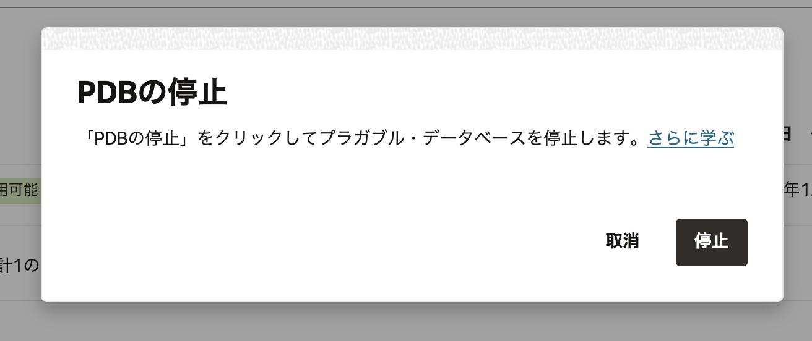

## はじめに

**Oracle Cloud Infrastructure Exadata Database Service on Dedicated Infrastructure (ExaDB-D)** では、OCI 上で稼働する Oracle Database の PDB を OCI コンソールから停止や起動、クローン作成など簡単に操作できます。この章では実際の操作手順を確認します。

<br>

**前提条件 :**

- [101 : ExaDB-D を使おう](/ocitutorials/exadbd/exadb-d101-create-exadb-d) を実施し、ExaDB-D の作成が完了していること

**所要時間 :** 約 1 時間

<br>

## 1. PDB の起動・停止

1. OCI コンソール・メニューから **Oracle Database** → **Oracle Public Cloud 上の Exadata** へ移動します。

   

2. 利用したいコンパートメントを「リスト範囲」の「コンパートメント」から選択します。

   

3. 利用したいリージョンを、右上のリージョンのドロップダウンから選択します。

   

4. 操作対象の PDB を持つ **Exadata VM クラスタ** の表示名をクリックします。

   

5. **データベース**一覧から対象データベースの名前をクリックします。

   

6. **リソース** 一覧から **プラガブル・データベース** をクリックします。

   

7. 操作したい PDB の右側「・・・」メニューをクリックし、**停止**を選択します。

   

8. 確認画面が表示されたら、**PDB の停止** をクリックします。

   

   操作した PDB の **状態** が **更新中** となります。

   

9. 停止が完了すると、**状態** が **使用可能** へ戻ります。

   

10. 対象 PDB の **プラガブル・データベースの詳細** からオープン・モードを確認します。  
    状態が **マウント済** となっていることを確認します。


    同様の手順でPDBの起動も可能です。起動すると **読み取り/書込み** モードになっています。


<br>

## 2. PDB の新規作成

1. OCI コンソール・メニューから **Oracle Database** → **Oracle Public Cloud 上の Exadata** へ移動します。

   

2. 操作対象の **Exadata VM クラスタ** の表示名をクリックします。

   

3. **データベース**一覧から対象データベースをクリックします。

   

4. **リソース** の一覧から **プラガブル・データベース** をクリックします。

   

5. **プラガブル・データベースの作成** をクリックします。

   

6. **プラガブル・データベースの作成** ダイアログに下記を入力します。

   - **PDB 名** - 任意の名前を入力します。
   - **データベースの TDE ウォレット・パスワード** - データベース作成時に設定した sys スキーマのパスワードを入力します（[101 : ExaDB-D を使おう](/ocitutorials/exadbd/exadb-d101-create-exadb-d) の「3. データベースの作成」で設定したパスワードです）。

   入力後、**プラガブル・データベースの作成**をクリックします。

   

7. 作成が完了すると、PDB の **状態** が **使用可能** と表示されます。

   

   

8. 対象 PDB の **プラガブル・データベースの詳細** でオープン・モードが **読み取り/書込み** となっていることを確認します。

   

<br>

## 3. PDB クローンの作成

1. [101 : ExaDB-D を使おう](/ocitutorials/exadbd/exadb-d101-create-exadb-d) の「6. PDB 上のスキーマへのアクセス」で作成したスキーマに接続します。スキーマが未作成の場合は「5. データベース(PDB)へのアクセス」をご参照ください。

2. スキーマ上にサンプルデータを追加します。  
   実行コマンド例：

   ```sql
   CREATE TABLE EMPLOYEE (
     EmployeeID int,
     LastName varchar(255),
     FirstName varchar(255),
     Address varchar(255),
     City varchar(255)
   );

   INSERT INTO EMPLOYEE (EmployeeID, LastName, FirstName, Address, City)
   VALUES ('1', 'James', 'Steve', '123way', 'Los Angeles');

   exit;
   ```

3. OCI コンソール・メニューから **Oracle Database** → **Oracle Public Cloud 上の Exadata** に移動します。


1.  操作したい PDB を持つ**Exadata VM クラスタ**の表示名をクリックします。


1. **データベース**の一覧から対象のデータベースの名前をクリックします。


1. **リソース**の一覧から**プラガブル・データベース**をクリックします。


1. クローン元となる PDB の右側にある・・・メニューをクリックして、**クローン**をクリックします。


1. **PDB のクローニング**ダイアログに以下の情報を入力します。

   - **[コンパートメント名]の Exadata VM クラスタ** - クローン先の VM クラスタを選択します。
   - **宛先データベース** - PDB クローンの作成先を指定します。
   - **ソース・データベースの管理パスワード** - 本ガイドのようにローカルの CDB に作成する場合は入力不要です。リモートの CDB に作成する場合入力が必須となります。データベースを作成した際に設定した sys スキーマのパスワードです。[101 : ExaDB-D を使おう](/ocitutorials/exadbd/exadb-d101-create-exadb-d)の**3. データベースの作成**で設定したパスワードです。
   - **新規 PDB の構成**
     - **PDB 名** - 任意の名前を入力します。
     - **データベースの TDE ウォレット・パスワード** - データベースを作成した際に設定した sys スキーマのパスワードです。[101 : ExaDB-D を使おう](/ocitutorials/exadbd/exadb-d101-create-exadb-d)の**3. データベースの作成**で設定したパスワードです。

   設定後、**PDB のクローニング**をクリックします。


1. 作成が完了すると作成した PDB の**状態**が**使用可能**と表示されます。


1. 対象の PDB の**プラガブル・データベースの詳細**でオープン・モードを確認できます。

   対象の PDB の状態が**読み取り/書込み**になっていることを確認します。


1. クローン元(PDB1)で作成されていたスキーマ(TESTUSER)とサンプルデータ(EMPLOYEE 表)がクローン(PDB3)に存在することをデータベースに SQL\*Plus から接続して確認します。接続方法は[101 : ExaDB-D を使おう](/ocitutorials/exadbd/exadb-d101-create-exadb-d)の**5. データベース(PDB)へのアクセス**を参照ください。

   データベースに接続して以下のように確認します。

   実行コマンド

   ```sql
   show con_name
   show pdbs
   alter session set container = pdb3;
   select * from testuser.employee;
   ```

   実行例

   ```
   SQL> show con_name

   CON_NAME
   ------------------------------
   CDB$ROOT
   SQL> show pdbs

       CON_ID CON_NAME                       OPEN MODE  RESTRICTED
   ---------- ------------------------------ ---------- ----------
            2 PDB$SEED                       READ ONLY  NO
            3 PDB1                           READ WRITE NO
            4 PDB2                           READ WRITE NO
            5 PDB3                           READ WRITE NO
   SQL> alter session set container = pdb3;

   Session altered.

   SQL> select * from testuser.employee;

   EMPLOYEEID LASTNAME   FIRSTNAME  ADDRESS    CITY
   ---------- ---------- ---------- ---------- -----------
            1 James      Steve      123way     Los Angeles
   ```

   クローン元(PDB1)で作成されていたスキーマ(TESTUSER)とサンプルデータ(EMPLOYEE 表)がクローン(PDB3)に存在することが確認できました。

   以上で この章の作業は完了です。

<BR>

<a id="anchor11"></a>

# 参考資料

- [Oracle Cloud Infrastructure Documentation - Oracle Exadata Database Service on Dedicated Infrastructure](https://docs.oracle.com/en-us/iaas/exadatacloud/index.html)
- [Oracle Cloud Infrastructure Exadata Database Service on Dedicated Infrastructure (ExaDB-D) サービス詳細](https://speakerdeck.com/oracle4engineer/exadata-database-cloud-technical-detail)

<BR>
