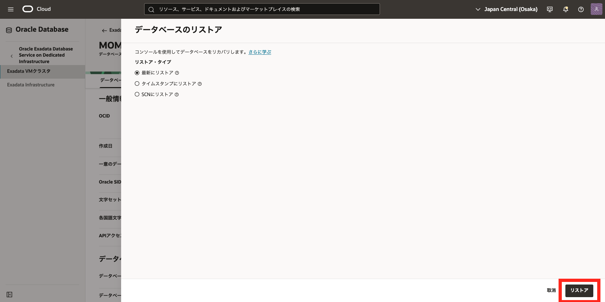

# はじめに

Oracle Exadata Database Service on Dedicated Infrastructure（ExaDB-D）では、自動バックアップやオンデマンドバックアップ機能を活用することで、**最新の状態や任意の過去時点（Point in Time Recovery：PITR）**まで**データベースを簡単に復旧**できます。また、バックアップは元のデータベースだけでなく、**他の DB システムへのリストアも可能**です。

このチュートリアルでは、OCI コンソールを使ってバックアップからデータベースをリストアする具体的な手順をご紹介します。

**前提条件 :**

- [101 : ExaDB-D を使おう](/ocitutorials/exadbd/exadb-d101-create-exadb-d)を通じて ExaDB-D の作成が完了していること

- [103 : 自動バックアップを設定しよう](/ocitutorials/exadbd/exadb-d103-automatic-backup)を通じてバックアップを取得していること

**所要時間 :** 約 1 時間　※環境によって異なるため、参考値です

# 1. バックアップ元のデータベースに対してリストア

まずはバックアップ元のデータベースに対してリストアしてみましょう。
リストア方法には下記 3 つがありますので、リストアしたい地点に応じてどのリストア方法を利用するか検討してください。

- **最新にリストア**  
  データ損失の可能性が最も低い、直近の正常な状態にデータベースをリストアします。

- **タイムスタンプにリストア** 
  指定した日時にデータベースをリストアします。

- **SCN にリストア** 
  SCN を使用してデータベースをリストアします。 
  有効な SCN を指定する必要がありますので、データベース・ホストにアクセスして問い合せるか、オンラインまたはアーカイブ・ログにアクセスして使用する SCN 番号を確認してください。

1. ナビゲーション・メニューから **Oracle AI Database** → **Oracle Exadata Database Service on Dedicated Infrastructure** に移動します。

1. 利用したいコンパートメントを**リスト範囲**の**コンパートメント**から選択します。

1. 利用したいリージョンを右上のリージョンの折りたたみメニューをクリックして、**リージョン**の一覧から選択します。

1. リストアしたい**Exadata VM クラスタ**の表示名をクリックします。

1. **データベース**の一覧から対象のデータベースの名前をクリックします。

1. 画面上部から**リストア**ボタンをクリックします。

1. **データベースのリストア**ダイアログで、リストア方法を選択します。(本ガイドでは、**最新にリストア**を選択します。)

1. **データベースのリストア**ボタンをクリックします。

リストア作業が完了するとステータスが**更新中**から**使用可能**に変わります

 

# 2. バックアップから新規データベースとしてリストア

続いて、取得したバックアップを利用して新規データベースとしてリストアする手順を紹介します。

1. 対象のデータベースの**データベース詳細**ぺージの**バックアップ**をクリックします。

1. リストア対象のバックアップの右側にあるアクション・アイコン(3 つのドット)から、**データベース作成**をクリックします。

2. **バックアップからのデータベースの作成**ダイアログに以下の情報を入力します。

- **DB システムの構成**
  - **[コンパートメント名]の VM クラスタの選択** - リストア先の VM クラスタを選択します。
  - **データベース・ホームの構成** - **既存のデータベース・ホームの選択**か**新規データベース・ホームの作成**を選択します。**新規データベース・ホームの作成**を選択の場合、任意の**データベース・ホームの表示名**と**データベース・イメージ**を選択します
- **データベースの構成**
  - **データベース名** - 任意
  - **一意のデータベース名** - 任意もしくはなしでも可能
  - **パスワード** - 任意
  - **パスワードの確認** - 任意
- **ソース・データベースの TDE ウォレットまたは RMAN パスワードを入力してください** - リストア対象のデータベースの TDE ウォレットまたは RMAN パスワードを入力します。

設定後、**作成**をクリックします。

データベースの作成がバックエンドで開始します。作業が完了するとステータスが**更新中**から**使用可能**に変わります。

 

# 3. オンデマンドバックアップを使用したリストア

1. ナビゲーション・メニューから **Oracle AI Database** → **Oracle Exadata Database Service on Dedicated Infrastructure** に移動し、**スタンドアロン・バックアップ**をクリックします。

1. リストア対象のバックアップの右側にあるアクション・アイコン(3 つのドット)から、**データベース作成**をクリックします。

 

1. **バックアップからのデータベースの作成**ダイアログに情報を入力します。設定方法は[2. バックアップから新規データベースとしてリストアの 3.](#anchor1)と同様です。
   データベースの作成がバックエンドで開始します。作業が完了するとステータスが**更新中**から**使用可能**に変わります。

以上で、この章の作業は完了です。

# 参考資料

- [Oracle Cloud Infrastructure Documentation - Oracle Exadata Database Service on Dedicated Infrastructure](https://docs.oracle.com/en-us/iaas/exadatacloud/index.html)
- [Oracle Cloud Infrastructure Exadata Database Service on Dedicated Infrastructure (ExaDB-D) サービス詳細](https://speakerdeck.com/oracle4engineer/exadata-database-cloud-technical-detail)

 
