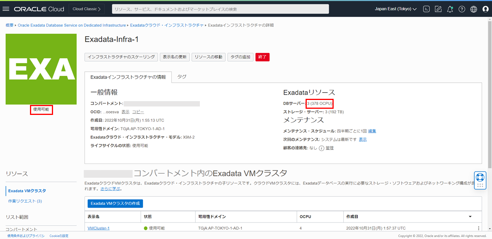

<a id="anchor0"></a>

# はじめに

**Oracle Cloud Infrastructure Exadata Database Service on Dedicated Infrastructure (ExaDB-D)** のスケーリングの対象は、2 種類あります。１つは、割り当てられている H/W リソース内で利用可能な、OCPU 数のスケール・アップ/ダウン。データベースや仮想マシンを再起動することなく、処理を継続したままオンラインで変更可能です。また、VM クラスタ全体に対しての変更になります。そのため、例えばノード毎に CPU コア数を変えることはできないので、仮想マシン数の倍数が指定可能になります。もう１つは、インフラストラクチャー部分のデータベース・サーバーとストレージ・サーバーのスケール・アップ(ダウンは不可)。こちらは、X8M 以降のモデルで可能で、CPU・メモリ・ストレージなど H/W 的に割り当てられている専有リソースを増やしたい場合に、オンラインで追加が可能です。

**前提条件 :**

- [101 : ExaDB-D を使おう](/ocitutorials/exadbd/exadb-d101-create-exadb-d)を通じて ExaDB-D の作成が完了していること
- [Oracle Cloud Infrastructure Documentation > コマンド・ライン・インターフェース > クイックスタート](https://docs.oracle.com/ja-jp/iaas/Content/API/SDKDocs/cliinstall.htm)を通じて OCI CLI のセットアップが完了していること

**所要時間 :** 約 6 時間（待ち時間を含む）※環境によって異なるため、参考値です

<BR>

# 1. OCPU のスケーリング

まずはコンソール上の操作での OCPU スケーリングからです。

1. OCI コンソール・メニューから **Oracle Database** → **Oracle Public Cloud 上の Exadata** に移動します。

   

1. 利用したいコンパートメントを**リスト範囲**の**コンパートメント**から選択します。

   

1. 利用したいリージョンを右上のリージョンの折りたたみメニューをクリックして、**リージョン**の一覧から選択します。

   

1. スケーリングしたい**Exadata VM クラスタ**の表示名をクリックします。

   

1. **VM クラスタ情報**で**有効な OCPU**を確認します。表示されている値は現在有効なクラスタ内の仮想マシンに割り当てられたすべての OCPU の合計です。(本ガイドでは 4OCPU(各 2OCPU の VM が 2 ノード・クラスタ構成で有効な OCPU は 4OCPU))

   

1. **VM クラスタのスケーリング**をクリックします。

   

1. **VM クラスタのスケーリング**ダイアログの**VM 当たりの OCPU 数**で現在の OCPU 数から変更したい OCPU 数を指定します。(本ガイドでは 4OCPU(VM あたり 4OCPU)を指定)

   

   設定後、**変更の保存**をクリックします。

   

1. ステータスが**更新中**から**使用可能**になり、**VM クラスタ情報**の**有効な OCPU**が指定した値に変更されているか確認します。(本ガイドでは仮想マシン当たり 4OCPU と指定したため、**有効な OCPU**の値は 8OCPU(各 4OCPU の VM が 2 ノード・クラスタ構成で有効な OCPU は 8OCPU))

   

   なお、オンラインでのスケーリングなので、ステータスがスケーリング進行中でもサービスの使用は可能です。

<BR>

# 2. CLI での OCPU のスケーリング

CLI(OCI CLI/REST/Terraform など)でもスケール・アップ/ダウンは可能です。今回は、OCI CLI での方法を紹介します。

本ガイドでは OCI CLI のセットアップが完了していることを前提として進めます。セットアップされていない方は[Oracle Cloud Infrastructure Documentation > コマンド・ライン・インターフェース > クイックスタート](https://docs.oracle.com/ja-jp/iaas/Content/API/SDKDocs/cliinstall.htm)をご参考にセットアップしてください。OCI CLI は別途 VM を立ててセットアップをします。

1. 現在の CPU コア数(現在有効なクラスタ内の仮想マシンに割り当てられたすべての OCPU の合計)を確認します。以下のコマンドを実行します。

   ```
   oci db cloud-vm-cluster get --cloud-vm-cluster-id <スケーリングしたいVMクラスタのOCID> --query 'data.{"1.Name":"display-name","2.shape":"shape","3.cpu-core-count": "cpu-core-count"}'
   ```

   ※VM クラスタの OCID は**Exadata VM クラスタの詳細**の**VM クラスタ情報**から確認できます。
   

   実行結果例：

   ```
   {
   "1.Name": "VMCluster-1",
   "2.shape": "Exadata.X9M",
   "3.cpu-core-count": 4
   }
   ```

   結果から、CPU コア数が 4(各 2OCPU の VM が 2 ノード・クラスタ構成で有効な OCPU は 4OCPU)ということがわかります。

2. OCI CLI でスケール・アップを実行します。以下のコマンドを実行します。(本ガイドでは CPU コア数を 8(各 4OCPU の VM が 2 ノード・クラスタ構成で有効な OCPU は 8OCPU)に変更するように実行します。)

   ```
   oci db cloud-vm-cluster update --cpu-core-count 8 --cloud-vm-cluster-id <スケーリングしたいVMクラスタのOCID>
   ```

   コンソール画面でスケーリングをした VM クラスタのステータスが**更新中**に切り替わっていることを確認します。

   

   約 3 分後に**使用可能**に切り替わります。

   

3. 現在の CPU コア数を確認します。以下のコマンドを実行します。

   ```
   oci db cloud-vm-cluster get --cloud-vm-cluster-id <VMクラスタのOCID> --query 'data.{"1.Name":"display-name","2.shape":"shape","3.cpu-core-count": "cpu-core-count"}'
   ```

   実行結果例：

   ```
   {
   "1.Name": "VMCluster-1",
   "2.shape": "Exadata.X9M",
   "3.cpu-core-count": 8
   }
   ```

   CPU コア数が 8(各 4OCPU の VM が 2 ノード・クラスタ構成で有効な OCPU は 8OCPU)に変更されているため、スケール・アップが成功したことが確認できました。

<BR>

# 3. インフラストラクチャのスケーリング

<a id="anchor3-1"></a>

## データベース・サーバーの追加

1. OCI コンソール・メニューから **Oracle Database** → **Oracle Public Cloud 上の Exadata** に移動します。

   

1. **Exadata インフラストラクチャ**をクリックします。

   

1. スケーリングする Exadata インフラストラクチャの表示名をクリックします。

   

1. **インフラストラクチャのスケーリング**をクリックします。

   

1. **Exadata Infrastructure のスケーリング**ダイアログで以下のように設定します。

   - **データベース・サーバー**を選択します。
   - **データベース・サーバー** - データベース・サーバーの合計台数を入力します。一回のスケーリング操作で追加できるのは最大 4 台までです。（本ガイドでは、3 台とします。）

   設定後、**スケール**をクリックします。

   

   Exadata インフラストラクチャの状態が**更新中**となります。

   

   3 分ほど経過すると、Exadata インフラストラクチャの状態が**使用可能**となり、**Exadata インフラストラクチャの情報**にある**DB サーバー**の情報が反映されていることを確認します。

   

1. 容量を追加したい**Exadata VM クラスタ**の表示名をクリックします。

   

1. **VM クラスタのスケーリング**をクリックします。

   

1. **VM クラスタのスケーリング**ダイアログの**容量を追加**にチェックを付け、現在のリソースとスケーリング後のリソースを確認し、**更新**をクリックします。

   

   VM クラスタの**作業リクエスト**の**Scale Cloud VM Cluster Compute**の状態が**成功**となったら完了です。(完了まで 5 時間程かかります。※環境によって異なるため、参考値です)

   

<a id="anchor3-2"></a>

## ストレージ・サーバーの追加

1. OCI コンソール・メニューから **Oracle Database** → **Oracle Public Cloud 上の Exadata** に移動します。

   

1. **Exadata インフラストラクチャ**をクリックします。

   

1. スケーリングする Exadata インフラストラクチャの表示名をクリックします。

   

1. **インフラストラクチャのスケーリング**をクリックします。

   

1. **Exadata Infrastructure のスケーリング**ダイアログで以下のように設定します。

   - **ストレージ・サーバー**を選択します。
   - **ストレージ・サーバー** - ストレージ・サーバーの合計台数を入力します。一回のスケーリング操作で追加できるのは最大 6 台までです。（本ガイドでは、4 台とします。）

   設定後、**スケール**をクリックします。

   

   Exadata インフラストラクチャの状態が**更新中**となります。

   

   3 分ほど経過すると、Exadata インフラストラクチャの状態が**使用可能**となり、**Exadata インフラストラクチャの情報**にある**DB サーバー**の情報が反映されていることを確認します。

   

1. 容量を追加したい**Exadata VM クラスタ**の表示名をクリックします。

   

1. **VM クラスタのスケーリング**をクリックします。

   

1. **VM クラスタのスケーリング**ダイアログの**容量を追加**にチェックを付け、現在のリソースとスケーリング後のリソースを確認し、**更新**をクリックします。

   

   VM クラスタの**作業リクエスト**の**Scale Cloud VM Cluster Storage**の状態が**成功**となったら完了です。(完了まで 1 時間程かかります。※環境によって異なるため、参考値です)
   

<br>
以上で、この章の作業は完了です。

<a id="anchor11"></a>

# 参考資料

- [Oracle Cloud Infrastructure Documentation - Oracle Exadata Database Service on Dedicated Infrastructure](https://docs.oracle.com/en-us/iaas/exadatacloud/index.html)
- [Oracle Cloud Infrastructure Exadata Database Service on Dedicated Infrastructure (ExaDB-D) サービス詳細](https://speakerdeck.com/oracle4engineer/exadata-database-cloud-technical-detail)

<BR>
