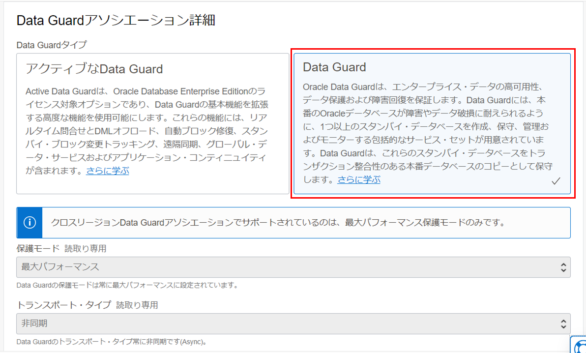
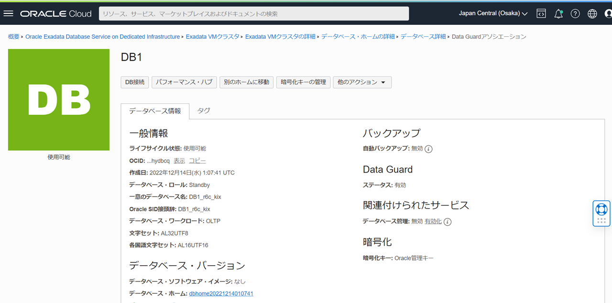
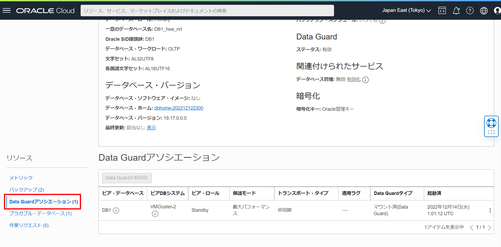
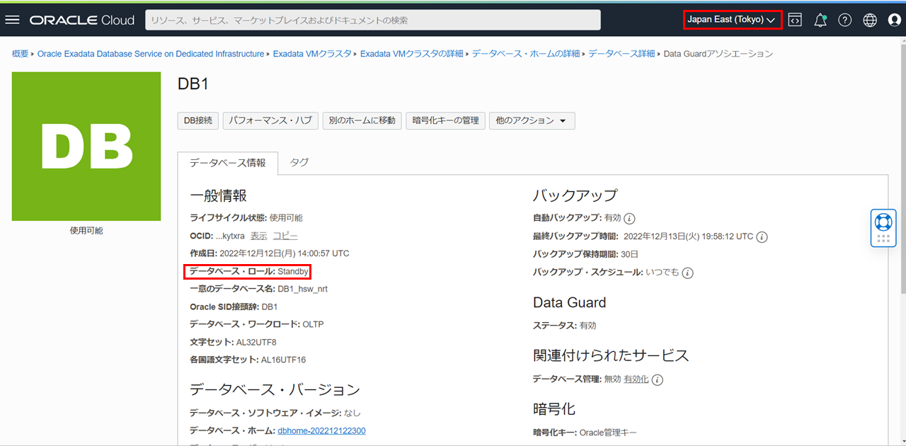

# はじめに

**Oracle Data Guard**とは、変更履歴(REDO)を利用して自動でリアルタイム・データベース複製を持つことが出来る機能です。この機能を利用することによって、データベース障害やリージョン障害などの RTO/RPO を短くすることができ、広範囲な計画停止(メンテナンス)においてもスタンバイをプライマリに切り替えることによって停止時間を極小化することが可能です。バックアップを取得していても、有事の際の復旧において、大量データのリストアが必要になる場合では RTO を満たせないケースもあります。こういったケースに備えて、バックアップだけでなく、すぐに切り替えられるスタンバイを持つことは重要です。災害対策(DR)としてのデータ保護はもちろんのこと、移行やアップグレードの停止時間短縮といった利用用途もあります。また、参照専用として利用可能な Active Data Guard にしたり、一時的に読み書き可能なスナップショット・スタンバイとして利用したりと、普段から利用できるスタンバイ・データベースを持つことができます。参照処理をオフロードしたり、この仕組みを応用してデータ破損が検知された場合にクライアントにエラーを返すことなく自動修復をしてくれる自動メディア・ブロックリカバリ機能も使えるため、Data Guard であればスタンバイのリソースも有効活用して ROI を高めつつ、きちんと切り替えられるスタンバイを持つということが可能です。

ここでは、OCI コンソールから ExaDB-D で別リージョン間(東京、大阪)での Data Guard を構成する手順について紹介します。東京をプライマリ、大阪をスタンバイとして構成します。使用するリージョンは任意です。
**前提条件 :**

- [101 : ExaDB-D を使おう](/ocitutorials/exadbd/exadb-d101-create-exadb-d)を通じて、プライマリ・データベースのリージョン（本ガイドでは東京リージョン）で ExaDB-D の作成が完了していること。
- [その 2 - クラウドに仮想ネットワーク(VCN)を作る](/ocitutorials/beginners/creating-vcn/)を通じて、スタンバイ・データベースのリージョン（本ガイドでは大阪リージョン）で VCN の作成が完了していること。
- プライマリ・データベースのリージョン（本ガイドでは東京リージョン）とスタンバイ・データベースのリージョン（本ガイドでは大阪リージョン）間でリモート VCN ピアリングの設定が完了していること。設定方法については、[Oracle Cloud Infrasturcture ドキュメント - DRG を介した異なるリージョン内の VCN のピアリング](https://docs.oracle.com/ja-jp/iaas/Content/Network/Tasks/scenario_e.htm#scenario_e)をご参照ください。
- プライマリ・データベースのリージョン（本ガイドでは東京リージョン）とスタンバイ・データベースのリージョン（本ガイドでは大阪リージョン）のそれぞれの VCN のセキュリティ・リストの設定でポート 1521 を開く。設定方法については、[Oracle Cloud Infrastructure ドキュメント - セキュリティ・リスト](https://docs.oracle.com/ja-jp/iaas/Content/Network/Concepts/securitylists.htm)をご参照ください。

**所要時間 :** 約 2 時間　※環境によって異なるため、参考値です。

 

# 1. Data Guard の構成

1. OCI コンソール・メニューから **Oracle AI Database** → **Oracle Public Cloud 上の Exadata** に移動します。

   

1. 利用したいコンパートメントを**リスト範囲**の**コンパートメント**から選択します。

   

1. 利用したいリージョンを右上のリージョンの折りたたみメニューをクリックして、**リージョン**の一覧から選択します。

   

1. 操作したい**Exadata VM クラスタ**の表示名をクリックします。

   

1. **データベース**の一覧から対象のデータベースの名前をクリックします。

   

1. **リソース**の一覧から**Data Guard アソシエーション**をクリックし、**Data Guard の有効化**をクリックします。

   

1. **Data Guard の有効化** の各項目は以下のように設定します。その他の設定はデフォルトのままにします。

   - **ピア DB システムの選択**
     - **リージョン** - スタンバイ・データベースを作成したいリージョン（本ガイドでは大阪リージョン）
     - **可用性ドメイン** - 任意
     - **シェイプ** - スタンバイ・データベースを作成したい VM クラスタのシェイプ
     - **Data Guard ピア・リソース・タイプ** - VM クラスタ
     - **[コンパートメント名]の VM クラスタの選択** - スタンバイ・データベースを作成したい VM クラスタを選択

   

   - **Data Guard アソシエーション詳細**
     - **Data Guard タイプ** - **アクティブな Data Guard**か**Data Guard**を選択します。（本ガイドでは、**Data Guard**を選択します。）

   

   - **データベース・ホームの選択**
     - **データベース・ホームの構成** - **既存のデータベース・ホームの選択**か**新規データベース・ホームの作成**を選択します。（本ガイドでは、**新規データベース・ホームの作成**を選択します。）
     - **データベース・イメージの変更** - カスタム・イメージを使用したい場合は**データベース・イメージの変更**ボタンをクリックし、作成済みのカスタム・イメージを選択します。（本ガイドでは、変更はせずに進みます。）
   - **スタンバイ・データベースの構成**
     - **データベース・パスワード** - データベースの管理パスワードを入力します。スタンバイ・データベース管理パスワードは、プライマリ・データベースの管理パスワードと同じである必要があります。

   設定後、**Enable data guard** をクリックします。作成まで 1 時間ほどかかります。（作成時間は環境によって異なります。）

   

   

   完了すると、プライマリ・データベースとスタンバイ・データベースが使用可能な状態に切り替わります。

   

   

1. プライマリ・データベースのリージョン（本ガイドでは東京リージョン）の**データベース詳細**の**リソース**の一覧から**Data Guard アソシエーション**をクリックし、スタンバイ・データベースの情報が追加されていることを確認します。

   

1. スタンバイ・データベースのリージョン（本ガイドでは大阪リージョン）の**データベース詳細**の**リソース**の一覧から**Data Guard アソシエーション**をクリックし、プライマリ・データベースの情報が追加されていることを確認します。

   

 

# 2. Data Guard の切り替え

コンソールや CLI から、簡単に Data Guard の切り替え(スイッチオーバー、フェイルオーバー)や、旧プライマリの回復(フェイルオーバー実施後に旧プライマリ・データベースを簡単にスタンバイとして復旧)が可能です。

## スイッチオーバー

スイッチオーバーは主に計画停止用途のもので、スタンバイに REDO を転送・適用をしきった状態で、プライマリとスタンバイを切り替えます。そのため、切り替え後には旧プライマリは新スタンバイとして Data Guard 構成を保った状態となります。

1. プライマリ・データベースのリージョン（本ガイドでは、東京リージョン）の**データベース詳細**の**リソース**の一覧から**Data Guard アソシエーション**をクリックし、**アクション・ボタン**をクリックし、**スイッチオーバー**をクリックします。

   

1. **データベース管理パスワード**を入力し、**OK**ボタンをクリックします。プライマリ・データベースの管理パスワードとスタンバイ・データベース管理パスワードは同じパスワードが設定されています。

   

1. データベースの状態が**更新中**になります。

   

1. データベースの状態が**使用可能**になるとプライマリ・データベース（本ガイドでは、東京リージョン）とスタンバイ・データベース（本ガイドでは、大阪リージョン）のそれぞれの**データベース・ロール**が切り替わります。

   旧プライマリ・データベース（本ガイドでは、東京リージョン）の**データベース・ロール**が**Standby**に切り替わっている

   

   旧スタンバイ・データベース（本ガイドでは、大阪リージョン）の**データベース・ロール**が**Primary**に切り替わっている

   

## フェイルオーバー

フェイルオーバーは主に計画外停止用途のもので、プライマリ側が利用できない状態の際にスタンバイ側に切り替える際に用いられます。旧プライマリは壊れている状態で切り替えられ、非同期転送をしている場合には未転送分データがない可能性もあり、基本的には切り替え後にスタンバイがない構成となります。そのため、フェイルオーバー後にも Data Guard での可用性構成を組むために、スタンバイを作成して再度 Data Guard を構成することが必要となります。

1. スタンバイ・データベースのリージョン（本ガイドでは東京リージョン）の**データベース詳細**の**リソース**の一覧から**Data Guard アソシエーション**をクリックし、**アクション・ボタン**をクリックし、**フェイルオーバー**をクリックします。

   

1. **データベース管理パスワード**を入力し、**OK**ボタンをクリックします。プライマリ・データベースの管理パスワードとスタンバイ・データベース管理パスワードは同じパスワードが設定されています。

   

1. データベースの状態が**更新中**になります。

   

1. データベースの状態が**使用可能**になるとスタンバイ・データベース（本ガイドでは、東京リージョン）とプライマリ・データベース（本ガイドでは、大阪リージョン）のそれぞれの**データベース・ロール**が変更されます。

   旧スタンバイ・データベース（本ガイドでは、東京リージョン）の**データベース・ロール**が**Primary**に切り替わっている

   

   旧プライマリ・データベース（本ガイドでは、大阪リージョン）の**データベース・ロール**が**Disabled Standby**に切り替わっている

   

## 回復

フェイルオーバー後に活用されるのが Flashback Database 機能です。旧プライマリを障害発生直前(スタンバイが切り替わる前の時点)までデータを戻し(フラッシュバック)、スタンバイにロールを変換して Data Guard 構成に組み込まれ、フラッシュバックしたことで生じる差分も自動で同期されるため、一からスタンバイを構築する必要はありません。そのため、ExaDB-D の Data Guard 機能では、コンソール上の『回復』というボタンをクリックするだけで簡単に Data Guard が再構成されます。

1. プライマリ・データベースのリージョン（本ガイドでは東京リージョン）の**データベース詳細**の**リソース**の一覧から**Data Guard アソシエーション**をクリックし、**アクション・ボタン**をクリックし、**回復**をクリックします。

   

1. **データベース管理パスワード**を入力し、**OK**ボタンをクリックします。プライマリ・データベースの管理パスワードとスタンバイ・データベース管理パスワードは同じパスワードが設定されています。

   

1. データベースの状態が**更新中**になります。

   

1. データベースの状態が**使用可能**になると、**Disabled Standby**であったデータベース（本ガイドでは、大阪リージョン）の**データベース・ロール**が**Standby**に回復されます。

   

# 3. Data Guard 構成に含まれる DB の削除方法

Data Guard アソシエーションに含まれるデータベースもしくは DB システムを削除する場合、最初にスタンバイ・データベース(DB システム)を削除しましょう。スタンバイ・データベースが紐づけられている状態の時に、プライマリ・データベースを削除しようとするとエラーが表示され、削除できません。もし、プライマリ・データベースの環境のみを削除したい場合には、一度ロールを切り替えて削除対象の環境をスタンバイ・ロールにしてから削除という形をとって頂ければと思います。

プライマリ・データベースから削除しようとした場合の例

 

以上で この章の作業は完了です。

 

# 参考資料

- [Oracle Cloud Infrastructure Documentation - Oracle Exadata Database Service on Dedicated Infrastructure](https://docs.oracle.com/en-us/iaas/exadatacloud/index.html)
- [Oracle Cloud Infrastructure Exadata Database Service on Dedicated Infrastructure (ExaDB-D) サービス詳細](https://speakerdeck.com/oracle4engineer/exadata-database-cloud-technical-detail)

 
