

# はじめに

Data Guard は、Oracle Database 自身が持つレプリケーション機能です。 プライマリ DB の更新情報（REDO ログ）をスタンバイ DB に転送し、その REDO ログを使ってリカバリし続けることでプライマリ DB と同じ状態を維持します。
Data Guard Group もしくは Data Guard Association を使用している場合、Oracle Database Autonomous Recovery Service（RCV/ZRCV）および OCI Object Storage をバックアップの保存先として、プライマリ・データベースだけでなくスタンバイ・データベースにも自動バックアップの設定をすることができます。

このチュートリアルでは Exadata Database Service on Dedicated Infrastructure (ExaDB-D) のスタンバイ・データベースに自動バックアップを設定する方法を紹介します。


今回は Oracle Database Autonomous Recovery Service を例として取り上げていますが、OCI Object Storage でも同様の手順で設定可能です。  


**前提条件 :**

- [108 : Data Guard を構成しよう ](../exadb-d108-dataguard/)を通じて Data Guard 構成が完了していること

- Oracle Database Autonomous Recovery Service（RCV/ZRCV）および OCI Object Storage を利用する上での事前準備が完了していること

- プライマリとスタンバイのバックアップの取得先は統一すること
   

**注意** チュートリアル内の画面ショットについては現在の画面と異なっている場合があります。

 
**所要時間 :** 約90分
 

# 1. スタンバイ・データベースで自動バックアップを有効化しよう

ExaDB-D の場合、Oracle Data Guard を有効にすると、スタンバイ・データベース用に新しい DB システムが作成され、Data Guard アソシエーションが構成されます。
Data Guard アソシエーションの構築が完了したら、スタンバイ・データベースの詳細画面に移動して自動バックアップを有効にします。


プライマリ・データベースの自動バックアップを設定する際は、プライマリ・データベース作成時に自動バックアップの構成をすることができますが、スタンバイ・データベースへの自動バックアップの設定は、スタンバイ・データベース作成後に実施します。スタンバイ・データベース作成時に自動バックアップの設定をすることはできません。  


まず、ナビケーションメニューから、「Oracle Database」>「Exadata Database Service on Dedicated Infrastructure」をクリックします。

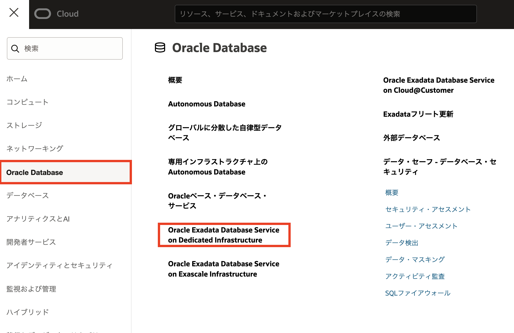

自動バックアップを構成するスタンバイ・データベースのプライマリ・データベースを含む VM クラスタの名前をクリックします。

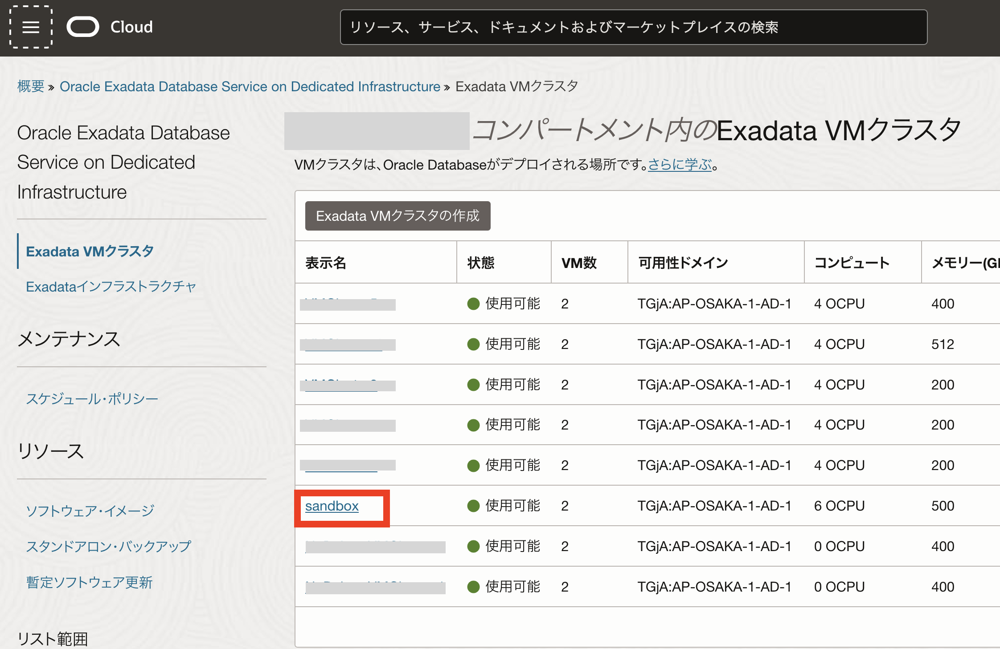

次に自動バックアップを構成するスタンバイ・データベースのプライマリ・データベースを含むデータベースの名前をクリックします。

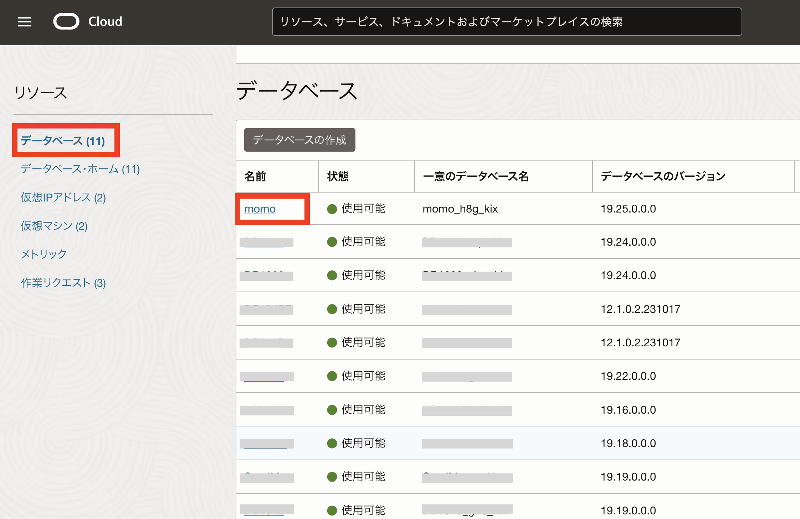

「プライマリ・データベースの詳細」ページを下の方にスクロールし、「Data Guard グループ」をクリックします。メンバーから自動バックアップを構成するスタンバイ・データベースの名前をクリックします。

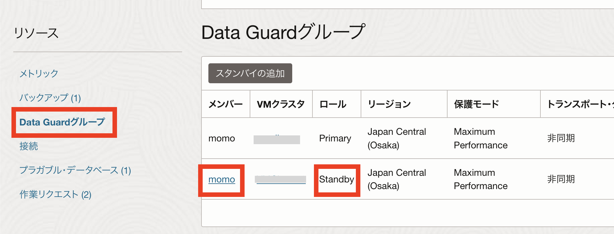

「スタンバイ・データベース詳細」ページで「自動バックアップの有効化」をクリックしてバックアップを構成します。
ここでは、詳細画面に「スタンバイ」と表示されていることを確認してから操作しましょう。

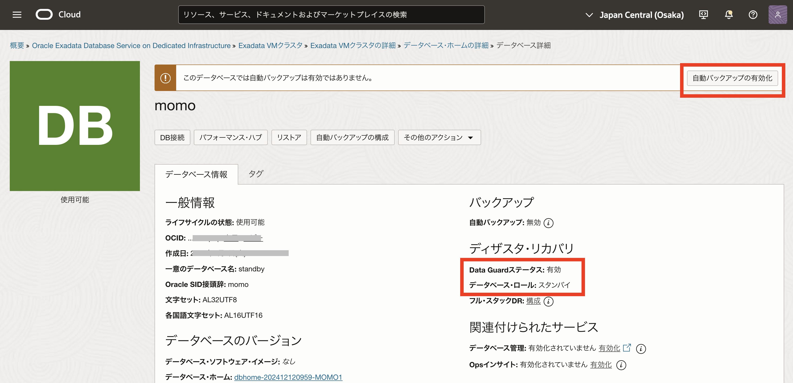

「データベース・バックアップの構成」で「自動バックアップの有効化」を選択し、今回は「バックアップの保存先」として「Autonomous Recovery Service (推奨)」を選択します。

**入力項目と入力内容**

- **自動バックアップの有効化**: 有効化するためにチェック
- **バックアップの保存先**：「自律型リカバリ・サービス(推奨)」（デフォルト）を選択します
- **保護ポリシー**：事前設定された保持期間のポリシー、または、事前定義したカスタム・ポリシーを選択します。保護ポリシーの設定に従って、バックアップの保管場所と保持ロックの有無の情報も表示されます。
- **リアルタイム・データ保護**： REDO 転送オプションの有無を選択します。


リカバリ・サービスには 2 種類のタイプがあります。Autonomous Recovery Service (RCV) と Zero Data Loss Autonomous Recovery Service (ZRCV) です。 この 2 種類の違いは、REDO 転送オプションの有無です。RCV は REDO 転送オプション無し、ZRCV が REDO 転送オプションありのタイプです。 REDO 転送オプションを有効化すると、リアルタイム REDO 転送が実施されるため、DB ストレージ上の REDO ログを損失する障害においても、0 に近いリカバリ・ポイント目標(RPO)が提供されます。


> - チェックボックスにチェックあり ＝ Zero Data Loss Autonomous Recovery Service (ZRCV) を利用
> - チェックボックスにチェックなし ＝ Autonomous Recovery Service (RCV) を利用
>    

- **データベース終了後の削除オプション**：データベースの終了後に保護されたデータベース・バックアップを保持するために使用できるオプション。データベースに偶発的または悪意のある障害が発生した場合にバックアップからデータベースをリストアする場合にも役立ちます。
- **日次バックアップのスケジュール時間(UTC)**：増分バックアップが開始される時間ウィンドウを指定します。
- **最初のバックアップをすぐに作成します**：最初の完全バックアップを延期することを選択した場合、データベース障害が発生してもデータベースがリカバリできない可能性があります。

すべての項目を入力し終わったら「変更の保存」をクリックします。

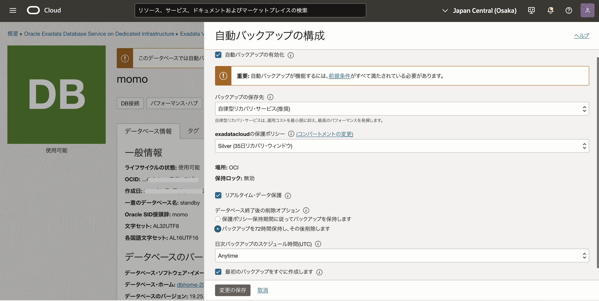

「最初のバックアップをすぐに作成します」のチェックボックスを有効化した場合は、自動バックアップを有効化してすぐにバックアップ処理が開始され、データベースのステータスが「バックアップ進行中」に変更されます。

「データベース詳細」ページには、「自動バックアップ」ステータスと詳細が「バックアップ」セクションに表示されます。

下にスクロールし、「バックアップ」タブを開くと取得中のバックアップが表示されます。この状態で、初回バックアップが完了するまで待ちます。

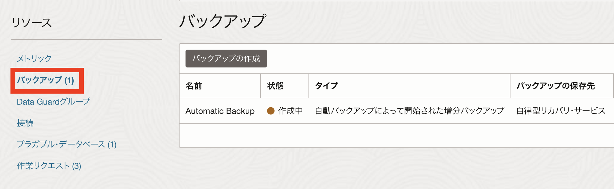

 

# 2. スタンバイ・データベース・バックアップからのデータベースを作成しよう

今度は、スタンバイ・データベース・バックアップから取得したバックアップを使用して、新規データベースを作成してみましょう。

「スタンバイ・データベースの詳細」ページで、「バックアップ」をクリックします。

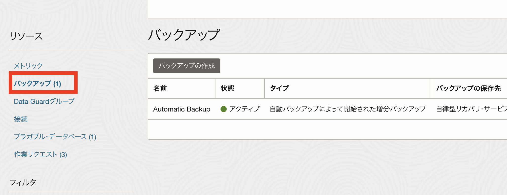

「バックアップ」セクションで、リストアするバックアップを選択します。  
そしてバックアップの「アクション」メニューをクリックし、「データベースの作成」をクリックします。

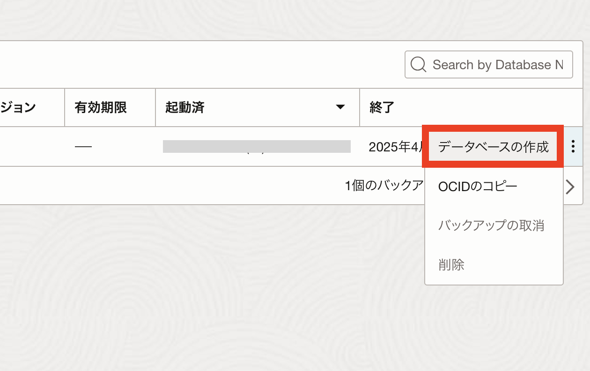

「バックアップからのデータベースの作成」ウィンドウで必要項目を入力します。

※設定方法は新規作成時と同様です。入力項目は[101 : ExaDB-D を使おう ](../exadb-d101-create-exadb-d/)をご参照下さい。

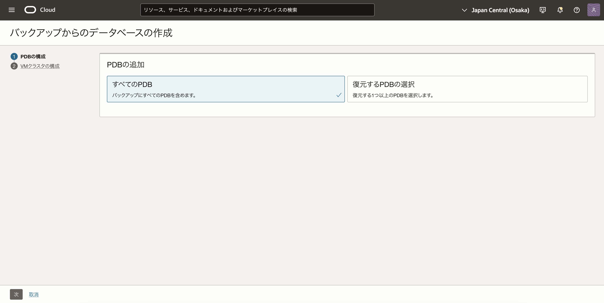

情報を入力し終わったら「DB システムの作成」をクリックします。
「**DB システムの作成** 」をクリックします。 

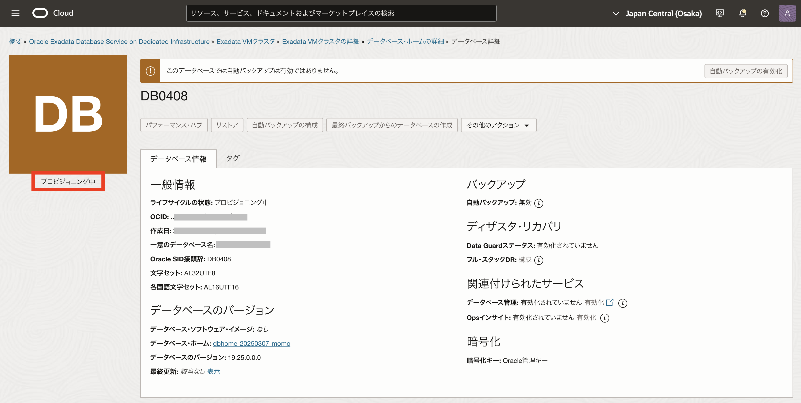

DB システムの作成が開始されます。

作業が完了するとステータスが**PROVISIONING...** から **AVAILABLE** に変わります。

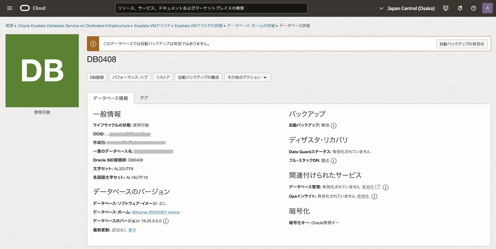

選択したリージョンおよび可用性ドメインに新しいデータベースが作成されます。

以上で、この章の作業は完了です。
 

# 参考資料

- [製品サイト] [Oracle Database Autonomous Recovery Service](https://www.oracle.com/jp/database/zero-data-loss-autonomous-recovery-service/)

- [マニュアル] [スタンバイ・データベースで自動バックアップを有効にするには](https://docs.oracle.com/cd/F56555_01/ecscm/ecs-using-data-guard.html#GUID-B7B7FA89-0994-454A-9EBE-0F20A1D1E11E)

- [マニュアル] [Oracle Database Autonomous Recovery Service](https://docs.oracle.com/cd/E83857_01/paas/recovery-service/index.html)

- [チュートリアル] [Backup and Restore from a Standby Database with Oracle Database Autonomous Recovery Service on Oracle Exadata Database Service on Dedicated Infrastructure](https://docs.oracle.com/en/learn/backup-and-restore-exadata/index.html)
   
