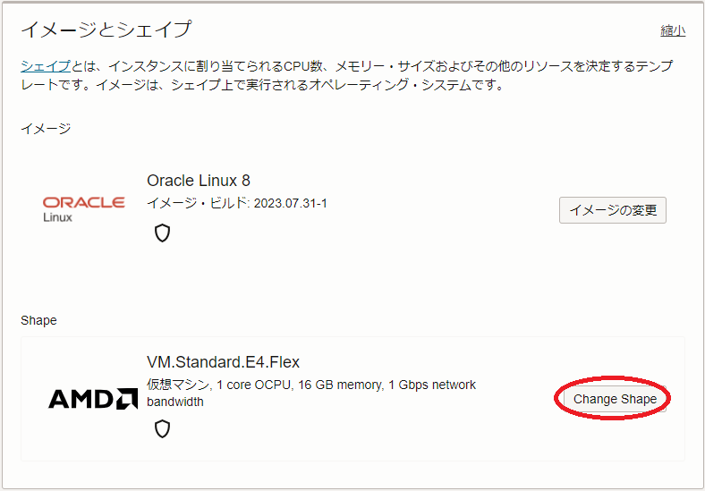

**注意 :** 本コンテンツ内の画面ショットは、現在のOCIコンソール画面と異なっている場合があります。

# 0. 概要

ベアメタルインスタンスは、作成時にBIOS設定を指定することが可能ですが、この中にはHPCワークロードの実行時パフォーマンスに影響する以下の項目が含まれます。

- **NUMA nodes per socket** （以降 **NPS** と呼称します。）  
**NPS** は、CPUソケット当たりの **NUMA**（Non-Umiform Memory Access）ノード数を指定するBIOS設定です。  
サーバ用途のCPUでメモリ性能を向上させるために採用されているメモリインタリーブは、インターリーブするメモリチャネルを同一NUMAノードに接続されるものに限定します。このため、 **NPS** を適切に調整することで、あるCPUコアから見て距離的に同じメモリチャネルのみをインターリーブし、 **[STREAM](https://www.cs.virginia.edu/stream/)** ベンチマークのようなメモリアクセスパターンを持つアプリケーションの性能を向上させることが可能でです。  
例えば、AMD EPYC 9654プロセッサと同じアーキテクチャの **[BM.Standard.E5.192](https://docs.oracle.com/ja-jp/iaas/Content/Compute/References/computeshapes.htm#bm-standard)** のプロセッサは、12個の **CCD**（Core Complex Die）と、 **I/O Die** 内の **UMC**（Unified Memory Controller）が下図 （出典： **[AMD EPYC 9004 Series Architecture Overview](https://www.amd.com/system/files/documents/58015-epyc-9004-tg-architecture-overview.pdf)**）のように構成されており、最も距離が近い関係（ローカル）にある3個の **UMC** が1グループを構成し、12個の **UMC** が4グループに分かれています。  
  
このため、 **NPS** を4に設定することで、最も距離の近い3個の **UMC** のグループ内にメモリインターリーブを限定し、 **NUMA** ノード内のメモリアクセス性能を向上させることが可能となります。  
指定可能な **NPS** 値は、対象のシェイプ毎に異なり、HPC/機械学習ワークロード向けベアメタルシェイプでは下表のようになっています。

  | シェイプ               | サポートする **NPS**          |
  | :------------------: | :-----------------------: |
  | BM.Optimized3.36   | 1（デフォルト）, 2            |
  | BM.Standard.E5.192 | 0（※1）, 1（デフォルト）, 2, 4 |
  | BM.Standard.E6.256 | 0（※1）, 1（デフォルト）, 2, 4 |
  | BM.GPU4.8          | 0（※1）, 1, 2, 4（デフォルト） |
  | BM.GPU.A100-v2.8   | 0（※1）, 1, 2, 4（デフォルト） |

  ※1）2CPUソケットを1 **NUMA** ノードとして構成

- **Simultanious Multi Threading** （以降 **SMT** と呼称します。）  
**SMT** は、CPUコア当たりに2個の論理スレッドを割当てるかどうかのBIOS設定です。  
HPCワークロードにみられるCPUインテンシブなアプリケーションは、この **SMT** を無効化する（CPUコア当たりに1個の論理スレッドを割当てる）ことで、性能が向上することがあります。  
BIOS設定上 **SMT** を有効化してインスタンスを作成した場合でも、OS設定でこれを無効化することが出来ますが、BIOS設定上 **SMT** を無効化してインスタンスを作成した場合、 **SMT** を有効化するためにはインスタンスを再作成する必要があります。

以降では、 **NPS** と **SMT** のBIOS設定を指定して、計算/GPUノード用途のベアメタルインスタンスを作成する方法と、作成したベアメタルインスタンスのBIOS設定を確認する方法を解説します。

ベアメタルインスタンス作成時のBIOS設定に関するOCI公式ドキュメントは、 **[ここ](https://docs.oracle.com/ja-jp/iaas/Content/Compute/References/bios-settings.htm#bios-settings)** を参照してください。

# 1. BIOS設定を指定したベアメタルインスタンスの作成

## 1-0. 概要

本章は、ベアメタルインスタンス作成時のBIOS設定方法を解説します。

ベアメタルインスタンスのBIOS設定は、 **[OCI HPCチュートリアル集](../../#1-oci-hpcチュートリアル集)** で解説している構築手法を前提としたHPC/GPUクラスタの計算/GPUノードの場合、以下の方法で指定します。

- **[インスタンス構成](../../#5-7-インスタンス構成)** で指定  
**OCI HPCチュートリアル集** のOCIコンソールを使用する手動構築でHPC/GPUクラスタを構築する場合、構築手順中で作成する **インスタンス構成** にBIOS設定を指定します。
- **[Terraform](../../#5-12-terraform)** スクリプトで指定  
**OCI HPCチュートリアル集** の **Terraform** を使用する自動構築でHPC/GPUクラスタを構築する場合、構築手順中で作成する **Terraform** スクリプトにBIOS設定を指定します。

なお、 **OCI HPCチュートリアル集** の **[HPCクラスタスタック](../../#5-10-hpcクラスタスタック)** を使用する自動構築でHPC/GPUクラスタを構築する場合、 **HPCクラスタスタック** がBIOS設定に対応していないため、計算/GPUノードのBIOS設定を変更することが出来ません。

また、単一インスタンスをOCIコンソールから作成する場合は、インスタンス作成画面でBIOS設定を指定します。

以降では、BIOS設定の指定方法を以下3タイプに分けて解説します。

- **インスタンス構成** で指定
- **Terraform** スクリプトで指定
- 単一インスタンス作成時にOCIコンソールで指定

## 1-1. インスタンス構成でBIOS設定を指定する方法

**[インスタンス構成](../../#5-7-インスタンス構成)** を作成する際の以下 **イメージとシェイプ** フィールドで **シェイプの変更** ボタンをクリックし、

表示される以下 **すべてのシェイプの参照** サイドバーで **ベア・メタル・マシン** をクリックして表示される所望のシェイプ（ここでは **BM.Optimized3.36** ）を選択して **詳細BIOS設定** ボタンをクリックし、

表示される以下の **詳細BIOS設定** フィールドで **NPS** と **SMT** を所望の値に設定し、 **シェイプの選択** ボタンをクリックします。

## 1-2. TerraformスクリプトでBIOS設定を指定する方法

**[OCI HPCチュートリアル集](../../#1-oci-hpcチュートリアル集)** の **[Terraform](../../#5-12-terraform)** を使用する自動構築でHPC/GPUクラスタを構築する際のBIOS設定を適用する方法は、HPCクラスタの場合は **OCI HPCチュートリアル集** の **[HPCクラスタを構築する（基礎インフラ自動構築編）](../../spinup-hpc-cluster-withterraform/)** の **[1-1-2. スタック作成](../../spinup-hpc-cluster-withterraform/#1-1-2-スタック作成)**（**[リソース・マネージャ](../../#5-2-リソースマネージャ)** を使用する場合）か **[1-2-3. Terraformスクリプト作成](../../spinup-hpc-cluster-withterraform/#1-2-3-terraformスクリプト作成)**（**[Terraform](../../#5-12-terraform)** CLIを使用する場合）を、GPUクラスタの場合は **OCI HPCチュートリアル集** の **[GPUクラスタを構築する（基礎インフラ自動構築編）](../../spinup-gpu-cluster-withterraform/)** の **[1-1-2. スタック作成](../../spinup-gpu-cluster-withterraform/#1-1-2-スタック作成)** （ **リソース・マネージャ** を使用する場合）か **[1-2-3. Terraformスクリプト作成](../../spinup-gpu-cluster-withterraform/#1-2-3-terraformスクリプト作成)** （ **Terraform** CLIを使用する場合）を参照してください。

## 1-3. 単一インスタンス作成時にOCIコンソールで指定する方法

**コンピュート・インスタンスの作成** 画面の以下 **イメージとシェイプ** フィールドで**シェイプの変更** ボタンをクリックし、

表示される以下 **すべてのシェイプの参照** サイドバーで **ベア・メタル・マシン** をクリックして表示される所望のシェイプ（ここでは **BM.Optimized3.36** ）を選択して **詳細BIOS設定** ボタンをクリックし、

表示される以下の **詳細BIOS設定** フィールドで **NPS** と **SMT** を所望の値に設定し、 **シェイプの選択** ボタンをクリックします。

# 2. 作成したベアメタルインスタンスのBIOS設定確認

本章は、作成したベアメタルインスタンスのBIOS設定を確認します。

OCIコンソールで当該ベアメタルインスタンスの **インスタンスの詳細** 画面を表示し、以下の **BIOS設定** フィールドで **NPS** と **SMT** の設定を確認します。

