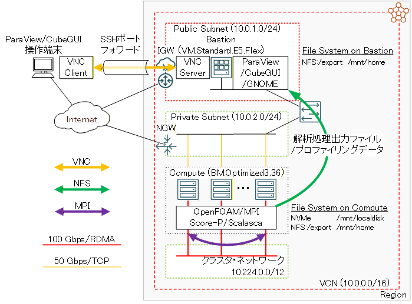
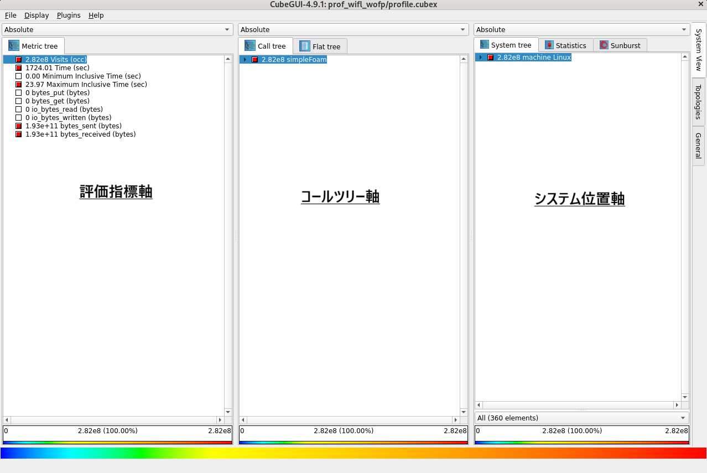
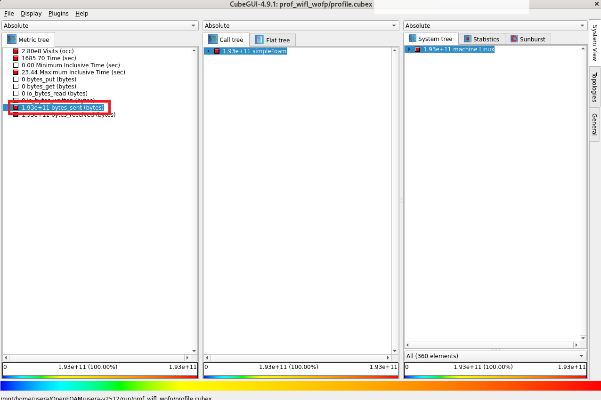
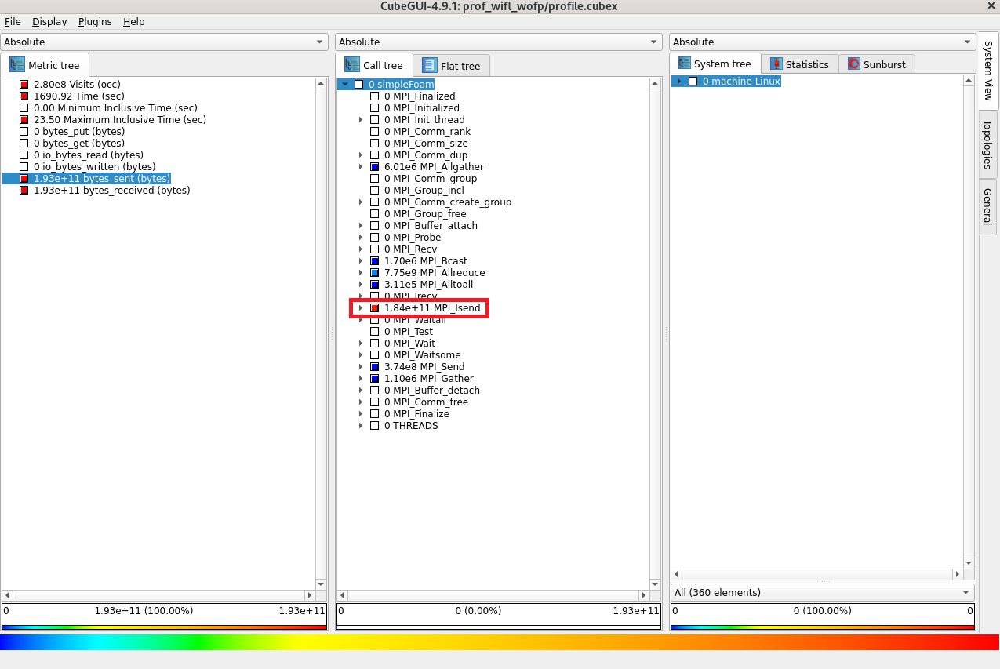
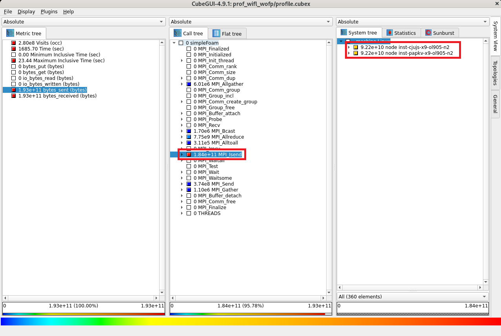
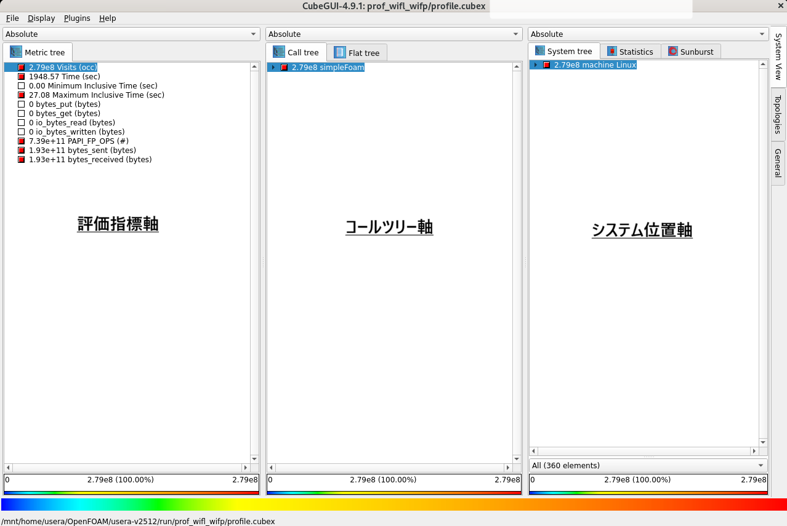
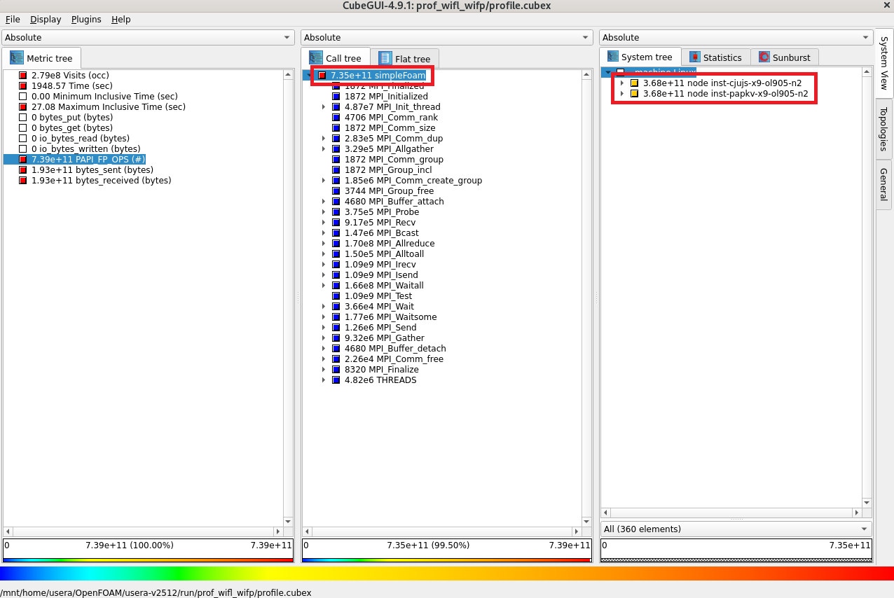
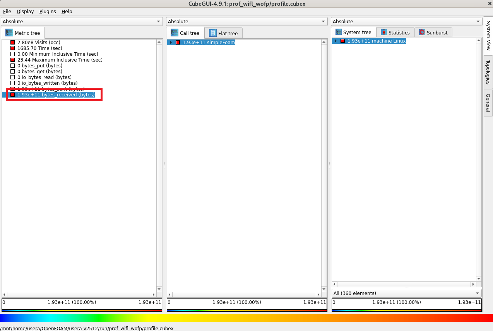
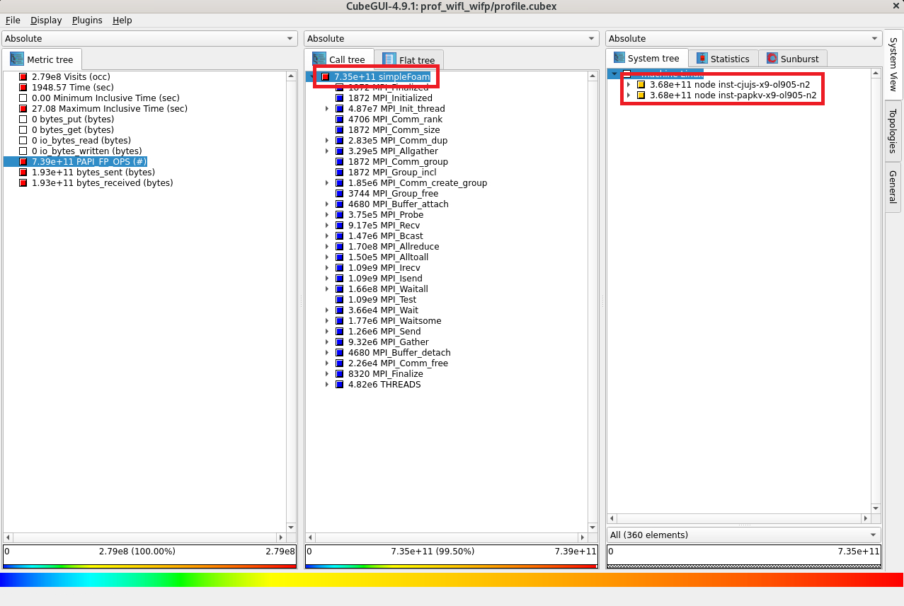

# 0. 概要

**[OpenFOAM](https://www.openfoam.com/)** は、性能向上を目的としたプロファイリングを行う場合いくつかの方法が考えられますが、 **OpenFOAM** のソースコードが入手可能であることを利用し、以下のオープンソースのプロファイリングツール群（※1）を活用することで、

- **[Score-P](https://www.vi-hps.org/projects/score-p/)**
- **[Scalasca](https://www.scalasca.org/)**
- **[CubeGUI](https://www.scalasca.org/scalasca/software/cube-4.x/download.html)**
- **[PAPI](https://icl.utk.edu/papi/)**

※1）これらのプロファイリングツールは、 **[OCI HPCプロファイリング関連Tips集](../../#2-3-プロファイリング関連tips集)** の **[Score-P・Scalasca・CubeGUIで並列アプリケーションをプロファイリング](../scorep-profiling/)** と **[PAPIでHPCアプリケーションをプロファイリング](../papi-profiling/)** で紹介されています。

**OpenFOAM** の解析フローで通常最大の所要時間を要する、ソルバー実行時の以下情報を取得することが可能になります。

- MPI通信に関する情報
    - MPI通信全体の所要時間情報
    - MPI通信全体の送受信データ量情報
    - MPI通信関数毎の所要時間情報
    - MPI通信関数毎の送受信データ量情報
    - 計算ノード毎の送受信データ量情報
    - MPIプロセスごとの送受信データ量情報
- 浮動小数点演算に関する情報
    - 総浮動小数点演算数
    - ソルバーが実行した浮動小数点演算数
    - 計算ノード毎の浮動小数点演算数
    - MPIプロセスごとの浮動小数点演算数

以上を踏まえて本プロファイリング関連Tipsは、インターコネクトでノード間接続するHPCクラスタの計算ノードに **Score-P** でプロファイリング情報を取得できるようにコンパイルした **OpenFOAM** をインストールし、 **OpenFOAM** のチュートリアルに含まれるオートバイ走行時乱流シミュレーションのプロファイリング情報を取得、これを **CubeGUI** をインストールしたBastionノードで解析する手順を解説します。

本プロファイリング関連Tipsは、以下の環境を前提とします。

- 計算ノード
    - シェイプ： **[BM.Optimized3.36](https://docs.oracle.com/ja-jp/iaas/Content/Compute/References/computeshapes.htm#bm-hpc-optimized)**
    - ノード数： 2ノード以上
    - イメージ： **Oracle Linux** 9.05ベースのHPC **[クラスタネットワーキングイメージ](../../#5-13-クラスタネットワーキングイメージ)** （※2）
- ノード間接続インターコネクト
    - **[クラスタ・ネットワーク](../../#5-1-クラスタネットワーク)** 
    - リンク速度： 100 Gbps
- Bastionノード
    - シェイプ ： **[VM.Standard.E5.Flex](https://docs.oracle.com/ja-jp/iaas/Content/Compute/References/computeshapes.htm#flexible)**
    - イメージ： **Oracle Linux** 9.05ベースのHPC **[クラスタネットワーキングイメージ](../../#5-13-クラスタネットワーキングイメージ)** （※2）
- ファイル共有ストレージ
    - NFSでサービスする任意のファイル共有ストレージ（※3）
    - Bastionノードと全計算ノードのCFD解析ユーザホームディレクトリをファイル共有
- **OpenFOAM** ： v2512（※4）
- **ParaView** ： 6.0.1（※4）
- **Score-P** ：9.4（※5）
- **Scalasca** ：2.6.2（※5）
- **CubeGUI** ：4.9.1（※5）
- **PAPI** ：7.2.0（※6）
- MPI： **[OpenMPI](https://www.open-mpi.org/)** 5.0.8（※7）

※2）**[OCI HPCテクニカルTips集](../../#3-oci-hpcテクニカルtips集)** の **[クラスタネットワーキングイメージの選び方](../../tech-knowhow/osimage-for-cluster/)** の **[1. クラスタネットワーキングイメージ一覧](../../tech-knowhow/osimage-for-cluster/#1-クラスタネットワーキングイメージ一覧)** のイメージ **No.13** です。  
※3）このファイル共有ストレージの選定・構築方法は、 **[OCI HPCテクニカルTips集](../../#3-oci-hpcテクニカルtips集)** の **[HPC/GPUクラスタ向けファイル共有ストレージの最適な構築手法](../../tech-knowhow/howto-configure-sharedstorage/)** を参照してください。  
※4） **[OCI HPCテクニカルTips集](../../#3-oci-hpcテクニカルtips集)** の **[OpenFOAMインストール・利用方法](../../tech-knowhow/install-openfoam/)** に従って構築された **OpenFOAM** と **ParaView** です。  
※5） **[OCI HPCプロファイリング関連Tips集](../../#2-3-プロファイリング関連tips集)** の **[Score-P・Scalasca・CubeGUIで並列アプリケーションをプロファイリング](../scorep-profiling/)** に従って構築された **Score-P** 、 **Scalasca** 、及び **CubeGUI** です。  
※6） **[OCI HPCプロファイリング関連Tips集](../../#2-3-プロファイリング関連tips集)** の **[PAPIでHPCアプリケーションをプロファイリング](../papi-profiling/)** に従って構築された **PAPI** です。  
※7） **[OCI HPCテクニカルTips集](../../#3-oci-hpcテクニカルtips集)** の **[Slurm環境での利用を前提とするUCX通信フレームワークベースのOpenMPI構築方法](../../tech-knowhow/build-openmpi/)** に従って構築された **OpenMPI** です。



以降では、以下の順に解説します。

1. **[OpenFOAM環境構築](#1-openfoam環境構築)**
2. **[プロファイリングツールインストール](#2-プロファイリングツールインストール)**
3. **[プロファイリング対応OpenFOAMインストール](#3-プロファイリング対応openfoamインストール)**
4. **[プロファイリング手法データの取得](#4-プロファイリング手法データの取得)**
5. **[プロファイリング手法データの確認](#5-プロファイリング手法データの確認)**

# 1. OpenFOAM環境構築

本章は、プロファイリング対応 **OpenFOAM** をインストールする際のベースとなる **OpenFOAM** 環境を構築します。  
ここでインストールするプロファイリング機能を持たない **OpenFOAM** は、オーバーヘッドを伴うプロファイリングの影響を排除した比較用の性能計測に用いたり、プロファイリング・チューニング後のプロダクション実行時に使用します。

この構築は、 **[OCI HPCテクニカルTips集](../../#3-oci-hpcテクニカルtips集)** の **[OpenFOAMインストール・利用方法](../../tech-knowhow/install-openfoam/)** の手順に従い実施します。

この際、計算ノードのNVMe SSDローカルディスクにプロファイリング利用ユーザ用の作業ディレクトリ（ここでは **/mnt/localdisk/usera** とし、このディレクトリをユーザ **usera** で読み書きできるようにします。）を作成します。

# 2. プロファイリングツールインストール

## 2-0. 概要

本章は、プロファイリングツールのインストールを以下の順に実施します。

1. **[PAPIインストール](#2-1-papiインストール)** （Bastionノードと全ての計算ノード）
2. **[Score-Pインストール](#2-2-score-pインストール)** （Bastionノードと全ての計算ノード）
3. **[Scalascaインストール](#2-3-scalascaインストール)** （Bastionノードと全ての計算ノード）
4. **[CubeGUIインストール](#2-4-cubeguiインストール)** （Bastionノード）

## 2-1. PAPIインストール

**PAPI** のインストールは、 **[OCI HPCプロファイリング関連Tips集](../../#2-3-プロファイリング関連tips集)** の **[PAPIでHPCアプリケーションをプロファイリング](../papi-profiling/)** の **[2-2. PAPIインストール](../papi-profiling/#2-2-papiインストール)** の手順に従い実施します。

## 2-2. Score-Pインストール

**Score-P** のインストールは、 **[OCI HPCプロファイリング関連Tips集](../../#2-3-プロファイリング関連tips集)** の **[Score-P・Scalasca・CubeGUIで並列アプリケーションをプロファイリング](../scorep-profiling/)** の **[2-3. Score-Pインストール](../scorep-profiling/#2-3-score-pインストール)** の手順に従い実施します。

## 2-3. Scalascaインストール

**Scalasca** のインストールは、 **[OCI HPCプロファイリング関連Tips集](../../#2-3-プロファイリング関連tips集)** の **[Score-P・Scalasca・CubeGUIで並列アプリケーションをプロファイリング](../scorep-profiling/)** の **[2-4. Scalascaインストール](../scorep-profiling/#2-4-scalascaインストール)** の手順に従い実施します。

## 2-4. CubeGUIインストール

**CubeGUI** のインストールは、 **[OCI HPCプロファイリング関連Tips集](../../#2-3-プロファイリング関連tips集)** の **[Score-P・Scalasca・CubeGUIで並列アプリケーションをプロファイリング](../scorep-profiling/)** の **[2-5. CubeGUIインストール](../scorep-profiling/#2-5-cubeguiインストール)** の手順に従い実施します。

# 3. プロファイリング対応OpenFOAMインストール

## 3-0. 概要

本章は、プロファイリングに対応する **OpenFOAM** のインストールを以下の順に実施します。

1. **[インストール事前準備](#3-1-インストール事前準備)**
2. **[PETScインストール](#3-2-petscインストール)**
3. **[VTKインストール](#3-3-vtkインストール)**
4. **[ParaViewインストール](#3-4-paraviewインストール)**
5. **[プロファイリング対応OpenFOAMインストール](#3-5-プロファイリング対応openfoamインストール)**

これらの手順は、全ての計算ノードで実施します。

## 3-1. インストール事前準備

以下コマンドをrootユーザで実行し、 **OpenFOAM** と外部ツールをダウンロード・展開します。

```sh
$ mkdir /opt/OpenFOAM-prof && cd /opt/OpenFOAM-prof
$ wget https://dl.openfoam.com/source/v2512/OpenFOAM-v2512.tgz && tar --no-same-owner -xvf ./OpenFOAM-v2512.tgz
$ wget https://dl.openfoam.com/source/v2512/ThirdParty-v2512.tar.gz && tar --no-same-owner -xvf ./ThirdParty-v2512.tar.gz
$ module load openmpi
$ source /opt/OpenFOAM-prof/OpenFOAM-v2512/etc/bashrc
$ cd $WM_THIRD_PARTY_DIR
$ mkdir sources/metis && wget -P sources/metis https://github.com/xijunke/METIS-1/raw/master/metis-5.1.0.tar.gz && tar -C sources/metis -xvf sources/metis/metis-5.1.0.tar.gz
$ mkdir sources/petsc && wget -P sources/petsc https://web.cels.anl.gov/projects/petsc/download/release-snapshots/petsc-lite-3.24.3.tar.gz && tar -C sources/petsc -xvf sources/petsc/petsc-lite-3.24.3.tar.gz
$ mkdir sources/vtk && wget -P sources/vtk https://www.vtk.org/files/release/9.5/VTK-9.5.2.tar.gz && tar -C sources/vtk -xvf sources/vtk/VTK-9.5.2.tar.gz
```

次に、以下コマンドをrootユーザで実行し、 **OpenFOAM** インストールの事前チェックを実行、その結果を確認します。

```sh
$ foamSystemCheck

Checking basic system...
-------------------------------------------------------------------------------
Shell:       bash
Host:        frend
OS:          Linux version 5.14.0-503.40.1.el9_5.x86_64

System check: PASS
==================
Can continue to OpenFOAM installation.

$
```

## 3-2. PETScインストール

**PETSc** のインストールは、 **[OCI HPCテクニカルTips集](../../#3-oci-hpcテクニカルtips集)** の **[OpenFOAMインストール・利用方法](../../tech-knowhow/install-openfoam/)** の **[2-3. PETScインストール](../../tech-knowhow/install-openfoam/#2-3-petscインストール)** の手順に従い実施します。

## 3-3. VTKインストール

**VTK** のインストールは、 **[OCI HPCテクニカルTips集](../../#3-oci-hpcテクニカルtips集)** の **[OpenFOAMインストール・利用方法](../../tech-knowhow/install-openfoam/)** の **[2-4. VTKインストール](../../tech-knowhow/install-openfoam/#2-4-vtkインストール)** の手順に従い実施します。

## 3-4. ParaViewインストール

**ParaView** のインストールは、 **[OCI HPCテクニカルTips集](../../#3-oci-hpcテクニカルtips集)** の **[OpenFOAMインストール・利用方法](../../tech-knowhow/install-openfoam/)** の **[2-5. ParaViewインストール](../../tech-knowhow/install-openfoam/#2-5-paraviewインストール)** の手順に従い実施します。

## 3-5. プロファイリング対応OpenFOAMインストール

以下コマンドをrootユーザで実行し、 **Score-P** のコンパイルコマンドで **OpenFOAM** をコンパイル・インストールします。  
本手順は、 **BM.Optimized3.36** で30分程度を要します。

```sh
$ export VTK_DIR=$WM_THIRD_PARTY_DIR/platforms/linux64Gcc/VTK-9.5.2
$ export ParaView_DIR=$WM_THIRD_PARTY_DIR/platforms/linux64Gcc/ParaView-6.0.1
$ module load papi scorep
$ cd $WM_PROJECT_DIR && sed -i 's/gcc$(COMPILER_VERSION)/scorep-mpicc/' wmake/rules/General/Gcc/c && sed -i 's/g++$(COMPILER_VERSION)/scorep-mpicxx/' wmake/rules/General/Gcc/c++ && ./Allwmake -j -s -q -l
```

次に、以下コマンドをrootユーザで実行し、 **OpenFOAM** のインストールをテストします。

```sh
$ foamInstallationTest
    :
    :
    :
Summary
-------------------------------------------------------------------------------
Base configuration ok.
Critical systems ok.

Done

$
```

# 4. プロファイリング手法データの取得

## 4-0. 概要

本章は、 **OpenFOAM** に同梱されるチュートリアルのオートバイ走行時乱流シミュレーション（**incompressible/simpleFoam/motorBike**）をプロファイリング対象とし、ノードあたり36コアを搭載する **BM.Optimized3.36** を2ノード使用する72 MPIプロセス実行時のプロファイリング手法によるデータを取得します。  
この際、プロファイリングによるオーバーヘッドを考慮した精度の良いプロファイリングを **PAPI** による浮動小数点演算数を含まない場合と含む場合で取得するため、以下の手順で実施します。

1. **[事前準備](#4-1-事前準備)**
    - オートバイ走行時乱流シミュレーションケースディレクトリ作成
    - プロファイリングを実施しない場合の実行時間を計測
    - プロファイリングを実施する場合の実行時間を計測
    - 両者に隔たりがある場合プロファイリング対象を限定するフィルタを作成
2. **[浮動小数点演算数を含まないプロファイリング手法データの取得](#4-2-浮動小数点演算数を含まないプロファイリング手法データの取得)**
    - フィルタを適用して浮動小数点演算数を含まないプロファイリングを実施
    - 先の実行時間の隔たりが解消していることを確認
3. **[浮動小数点演算数を含むプロファイリング手法データの取得](#4-3-浮動小数点演算数を含むプロファイリング手法データの取得)**
    - フィルタを適用して浮動小数点演算数を含むプロファイリングを実施
    - 先の実行時間の隔たりが解消していることを確認

ここでプロファイリング実行時は、ストレージ領域へのアクセスによる影響を極力排除したプロファイリング結果を得るため、NVMe SSDローカルディスクをケースディレクトリのストレージ領域に使用します。

## 4-1. 事前準備

以下コマンドを1番目の計算ノードのプロファイリング利用ユーザで実行し、オートバイ走行時乱流シミュレーションのケースディレクトリを作成します。

```sh
$ module load openmpi
$ source /opt/OpenFOAM/OpenFOAM-v2512/etc/bashrc
$ mkdir -p $FOAM_RUN
$ run
$ cp -pR $FOAM_TUTORIALS/incompressible/simpleFoam/motorBike .
$ cd ./motorBike
$ mkdir -p ./constant/triSurface && cp -f $FOAM_TUTORIALS/resources/geometry/motorBike.obj.gz ./constant/triSurface/
$ cp $FOAM_TUTORIALS/incompressible/simpleFoam/pitzDailyExptInlet/system/decomposeParDict ./system/
$ sed -i 's/numberOfSubdomains 4/numberOfSubdomains 72/' ./system/decomposeParDict
$ sed -i 's/(2 2 1)/(9 8 1)/' ./system/decomposeParDict
```

次に、以下コマンドを1番目の計算ノードのプロファイリング利用ユーザで実行し、プロファイリング対象のソルバー **simpleFoam** を実行するための事前処理を実施します。

```sh
$ . ${WM_PROJECT_DIR:?}/bin/tools/RunFunctions
$ runApplication surfaceFeatureExtract
$ runApplication blockMesh
$ runApplication decomposePar
$ mpirun -n 72 -N 36 -machinefile ~/hostlist.txt -x UCX_NET_DEVICES=mlx5_2:1 bash -c "module load openmpi; source /opt/OpenFOAM/OpenFOAM-v2512/etc/bashrc; snappyHexMesh -parallel -overwrite"
$ mpirun -n 72 -N 36 -machinefile ~/hostlist.txt -x UCX_NET_DEVICES=mlx5_2:1 bash -c "module load openmpi; source /opt/OpenFOAM/OpenFOAM-v2512/etc/bashrc; topoSet -parallel"
$ restore0Dir -processor
$ mpirun -n 72 -N 36 -machinefile ~/hostlist.txt -x UCX_NET_DEVICES=mlx5_2:1 bash -c "module load openmpi; source /opt/OpenFOAM/OpenFOAM-v2512/etc/bashrc; potentialFoam -parallel -writephi"
```

次に、以下コマンドを全ての計算ノードのプロファイリング利用ユーザで実行し、　ここまでに作成したケースディレクトリをファイル共有ストレージからNVMe SSDローカルディスクにコピーします。

```sh
$ cp -pR ${FOAM_RUN}/motorBike /mnt/localdisk/usera
```

次に、以下コマンドを1番目の計算ノードのプロファイリング利用ユーザで実行し、　プロファイリングを実施しない場合の **simpleFoam** の実行時間を標準出力中の **ExecutionTime** の表示から確認します。

```sh
$ cd /mnt/localdisk/usera/motorBike
$ mpirun -n 72 -N 36 -machinefile ~/hostlist.txt -x UCX_NET_DEVICES=mlx5_2:1 -x PATH -x LD_LIBRARY_PATH -x WM_PROJECT_DIR simpleFoam -parallel > ./log.simpleFoam_wofl_wofp_wosc
[inst-cjujs-x9-ol905-n2:48554] SET UCX_NET_DEVICES=mlx5_2:1
$ grep ^ExecutionTime ./log.simpleFoam_wofl_wofp_wosc | tail -1
ExecutionTime = 17.97 s  ClockTime = 18 s
$
```

次に、以下コマンドを1番目の計算ノードのプロファイリング利用ユーザで実行し、プロファイリングを実施して **simpleFoam** を実行します。  
ここで、 **Score-P** がプロファイリング情報格納メモリ領域（ **SCOREP_TOTAL_MEMORY** で指定します。）が足りない旨の以下メッセージを出力していることを確認します。

```sh
$ module load papi scorep scalasca
$ source /opt/OpenFOAM-prof/OpenFOAM-v2512/etc/bashrc
$ scalasca -analyze mpirun -n 72 -N 36 -machinefile ~/hostlist.txt "-x UCX_NET_DEVICES=mlx5_2:1" "-x LD_LIBRARY_PATH" "-x WM_PROJECT_DIR" `which simpleFoam` -parallel
:
[Score-P] src/measurement/SCOREP_Memory.c:187: Error: No free memory page available: Out of memory. Please increase SCOREP_TOTAL_MEMORY=16375808 and try again.
:
$
```

次に、以下コマンドを1番目の計算ノードのプロファイリング利用ユーザで実行し、先の実行により作成されたプロファイリングデータ格納ディレクトリを削除後、プロファイリングを実施した場合の **simpleFoam** の実行時間を標準出力中の **ExecutionTime** の表示から確認します。  
この際、プロファイリング情報格納メモリ領域に先のメッセージで指示された値よりやや大きな32 MBを指定していることに留意します。
この実行により、カレントディレクトリにディレクトリ **scorep_simpleFoam_36p72xP_sum** が作成され、ここに取得したプロファイリングデータが格納されます。

```sh
$ rm -rf ./scorep_simpleFoam_36p72xP_sum/
$ SCOREP_TOTAL_MEMORY=32M scalasca -analyze mpirun -n 72 -N 36 -machinefile ~/hostlist.txt "-x UCX_NET_DEVICES=mlx5_2:1" "-x LD_LIBRARY_PATH" "-x WM_PROJECT_DIR" `which simpleFoam` -parallel > ./log.simpleFoam_wofl_wofp_wisc
S=C=A=N: Scalasca 2.6.2 runtime summarization
S=C=A=N: ./scorep_simpleFoam_36p72xP_sum experiment archive
S=C=A=N: Tue Mar 10 14:29:28 2026: Collect start
/opt/openmpi/bin/mpirun -n 72 -N 36 -machinefile /mnt/home/usera/hostlist.txt -x UCX_NET_DEVICES=mlx5_2:1 -x LD_LIBRARY_PATH -x WM_PROJECT_DIR /opt/OpenFOAM-prof/OpenFOAM-v2512/platforms/linux64GccDPInt32Opt/bin/simpleFoam -parallel
S=C=A=N: Tue Mar 10 14:30:53 2026: Collect done (status=0) 85s
S=C=A=N: ./scorep_simpleFoam_36p72xP_sum complete.
$ grep ^ExecutionTime ./log.simpleFoam_wofl_wofp_wisc | tail -1
ExecutionTime = 70.79 s  ClockTime = 72 s
$
```

次に、両者の実行時間に大きな隔たりがあるため、以下のコマンドを1番目の計算ノードのプロファイリング利用ユーザで実行し、プロファイリングのオーバーヘッドの原因を調査します。

```sh
$ scalasca -examine -s ./scorep_simpleFoam_36p72xP_sum
INFO: Post-processing runtime summarization report (profile.cubex)...
/opt/scorep/bin/scorep-score  -r ./scorep_simpleFoam_36p72xP_sum/profile.cubex > ./scorep_simpleFoam_36p72xP_sum/scorep.score
INFO: Score report written to ./scorep_simpleFoam_36p72xP_sum/scorep.score
$ head -n 35 ./scorep_simpleFoam_36p72xP_sum/scorep.score

Estimated aggregate size of event trace:                   432GB
Estimated requirements for largest trace buffer (max_buf): 11GB
Estimated memory requirements (SCOREP_TOTAL_MEMORY):       11GB
(warning: The memory requirements cannot be satisfied by Score-P to avoid
 intermediate flushes when tracing. Set SCOREP_TOTAL_MEMORY=4G to get the
 maximum supported memory or reduce requirements using USR regions filters.)

flt     type     max_buf[B]         visits time[s] time[%] time/visit[us]  region
         ALL 11,466,352,515 17,383,129,905 5549.29   100.0           0.32  ALL
         USR 11,117,543,164 16,173,339,257 2149.42    38.7           0.13  USR
         COM    482,730,430    927,139,156  351.31     6.3           0.38  COM
         MPI    373,398,257    276,099,731 3042.98    54.8          11.02  MPI
     PTHREAD      2,790,814      6,551,689    5.57     0.1           0.85  PTHREAD
      SCOREP             46             72    0.01     0.0         102.94  SCOREP

         USR    813,510,074  1,756,784,573  147.34     2.7           0.08  void* malloc(size_t)
         USR    746,468,086     28,710,311    2.64     0.0           0.09  void Foam::vtk::foamVtkBase64Layer::write(const char*, std::streamsize)
         USR    746,468,086     28,710,311    2.15     0.0           0.07  void Foam::base64Layer::write(const char*, std::streamsize)
         USR    674,481,002     25,941,577    2.36     0.0           0.09  virtual void Foam::vtk::foamVtkBase64Layer::write(double)
         USR    674,481,002     25,941,577    2.34     0.0           0.09  virtual void Foam::vtk::foamVtkBase64Layer::write(float)
         USR    459,877,080     17,687,580    0.78     0.0           0.04  virtual std::ostream& Foam::OFstream::stdStream()
         USR    433,888,078    132,810,408    6.26     0.1           0.05  bool Foam::IOstream::fatalCheck(const char*) const
         USR    374,457,434     14,402,209    0.67     0.0           0.05  void Foam::ensightFile::newline()
         USR    349,137,438     13,428,363    1.48     0.0           0.11  virtual Foam::Ostream& Foam::ensightFile::write(float)
         USR    270,177,674    682,020,701   49.48     0.9           0.07  Foam::List<T>::~List() [with T = double]
         USR    226,422,352    599,653,464   28.39     0.5           0.05  Foam::label Foam::Detail::PtrListDetail<T>::find_next(Foam::label) const [with T = Foam::fvPatchField<double>]
         USR    219,142,898    582,210,656   56.35     1.0           0.10  unsigned int Foam::Hasher(const void*, size_t, unsigned int)
         USR    219,142,898    582,210,656   34.57     0.6           0.06  unsigned int jenkins_hashlittle(const void*, size_t, unsigned int)
         USR    201,444,568    217,174,683   10.71     0.2           0.05  virtual const faceList& Foam::polyMesh::faces() const
         MPI    156,089,268     84,176,201  109.29     2.0           1.30  MPI_Isend
         MPI    156,087,933     84,176,201   66.76     1.2           0.79  MPI_Irecv
         USR    146,770,000    159,592,500    7.99     0.1           0.05  Foam::scalarField& Foam::lduMatrix::upper()
         USR    142,833,132    149,394,822    7.41     0.1           0.05  virtual const pointField& Foam::polyMesh::points() const
         USR    139,328,150    123,644,144    6.12     0.1           0.05  virtual const labelList& Foam::polyMesh::faceOwner() const
$
```

この出力から、呼び出された回数を示す **visits** 列の値が大きい **region** 列に **simpleFoam** を構成する関数等が多数存在しこれらが大きなオーバーヘッドとなっていることが予想されるため、プロファイリング対象からこれらを除く以下のフィルタをファイル名 **scorep.filt** で作成し、これを全ての計算ノードの **/mnt/localdisk/usera/motorBike** ディレクトリに配置します。

```sh
SCOREP_REGION_NAMES_BEGIN
  EXCLUDE *
SCOREP_REGION_NAMES_END
```

## 4-2. 浮動小数点演算数を含まないプロファイリング手法データの取得

以下コマンドを1番目の計算ノードのプロファイリング利用ユーザで実行し、先の実行により作成されたプロファイリングデータ格納ディレクトリを削除後、フィルタを適用して浮動小数点演算数を含まないプロファイリング手法データを取得します。  
この際、その実行時間を **[4.1. 事前準備](#4-1-事前準備)** のプロファイリングを実施しない場合のもの（17.97秒）と比較し、両者の隔たりが解消していることを確認します。

```sh
$ rm -rf ./scorep_simpleFoam_36p72xP_sum/
$ SCOREP_TOTAL_MEMORY=32M scalasca -analyze -f ./scorep.filt mpirun -n 72 -N 36 -machinefile ~/hostlist.txt "-x UCX_NET_DEVICES=mlx5_2:1" "-x LD_LIBRARY_PATH" "-x WM_PROJECT_DIR" `which simpleFoam` -parallel > ./log.simpleFoam_wifl_wofp_wisc
S=C=A=N: Scalasca 2.6.2 runtime summarization
S=C=A=N: ./scorep_simpleFoam_36p72xP_sum experiment archive
S=C=A=N: Tue Mar 10 14:43:43 2026: Collect start
/opt/openmpi/bin/mpirun -n 72 -N 36 -machinefile /mnt/home/usera/hostlist.txt -x UCX_NET_DEVICES=mlx5_2:1 -x LD_LIBRARY_PATH -x WM_PROJECT_DIR /opt/OpenFOAM-prof/OpenFOAM-v2512/platforms/linux64GccDPInt32Opt/bin/simpleFoam -parallel
S=C=A=N: Tue Mar 10 14:44:08 2026: Collect done (status=0) 25s
S=C=A=N: ./scorep_simpleFoam_36p72xP_sum complete.
$ grep ^ExecutionTime ./log.simpleFoam_wifl_wofp_wisc | tail -1
ExecutionTime = 21.27 s  ClockTime = 22 s
$
```

次に、以下コマンドを1番目の計算ノードのプロファイリング利用ユーザで実行し、浮動小数点演算数を含まないプロファイリングレポートを作成します。

```sh
$ scalasca -examine -s scorep_simpleFoam_36p72xP_sum
```

次に、以下コマンドを1番目の計算ノードのプロファイリング利用ユーザで実行し、フィルタの適用により除外した **simpleFoam** を構成する関数等が表示されないことを確認します。

```sh
$ head -n 35 scorep_simpleFoam_36p72xP_sum/scorep.score

Estimated aggregate size of event trace:                   18GB
Estimated requirements for largest trace buffer (max_buf): 358MB
Estimated memory requirements (SCOREP_TOTAL_MEMORY):       368MB
(hint: When tracing set SCOREP_TOTAL_MEMORY=368MB to avoid intermediate flushes
 or reduce requirements using USR regions filters.)

flt     type  max_buf[B]      visits time[s] time[%] time/visit[us]  region
         ALL 374,857,337 280,274,902 1685.70   100.0           6.01  ALL
         MPI 373,397,191 276,097,403  886.03    52.6           3.21  MPI
     PTHREAD   1,767,532   4,177,427    4.81     0.3           1.15  PTHREAD
      SCOREP          46          72  794.87    47.2    11039821.05  SCOREP

         MPI 156,089,268  84,176,201   93.79     5.6           1.11  MPI_Isend
         MPI 156,087,933  84,176,201   53.39     3.2           0.63  MPI_Irecv
         MPI  45,324,994  83,676,912   11.21     0.7           0.13  MPI_Test
         MPI  11,272,292  11,935,368  265.92    15.8          22.28  MPI_Allreduce
         MPI   4,156,230  11,495,788  271.20    16.1          23.59  MPI_Waitall
         MPI   4,040,030      68,389    0.10     0.0           1.40  MPI_Recv
     PTHREAD     836,238   1,956,483    0.38     0.0           0.19  int pthread_mutex_lock( pthread_mutex_t* )
     PTHREAD     836,238   1,956,483    0.32     0.0           0.16  int pthread_mutex_unlock( pthread_mutex_t* )
         MPI     525,174      22,158    6.43     0.4         290.37  MPI_Probe
         MPI     260,644     275,976    0.66     0.0           2.39  MPI_Gather
         MPI     125,355      68,389   22.33     1.3         326.45  MPI_Send
     PTHREAD      77,376     192,266    0.05     0.0           0.24  int pthread_mutex_init( pthread_mutex_t*, const pthread_mutexattr_t* )
         MPI      67,964     132,182    1.50     0.1          11.32  MPI_Waitsome
         MPI      46,308      48,122   73.91     4.4        1535.92  MPI_Bcast
         MPI      15,028      15,912    9.17     0.5         576.28  MPI_Allgather
     PTHREAD      11,180      27,676    0.02     0.0           0.79  int pthread_cond_broadcast( pthread_cond_t* )
     PTHREAD       8,216      21,110    0.00     0.0           0.11  int pthread_cond_init( pthread_cond_t*, const pthread_condattr_t* )
         MPI       6,214       2,705    0.09     0.0          32.72  MPI_Wait
     PTHREAD       5,486      12,173    4.03     0.2         331.27  int pthread_cond_wait( pthread_cond_t*, pthread_mutex_t* )
     PTHREAD       2,678       7,276    0.00     0.0           0.19  int pthread_mutex_destroy( pthread_mutex_t* )
     PTHREAD       1,274       3,528    0.00     0.0           0.10  int pthread_cond_destroy( pthread_cond_t* )
         MPI       1,020       1,080    5.73     0.3        5307.25  MPI_Alltoall
$
```

次に、以下コマンドを1番目の計算ノードのプロファイリング利用ユーザで実行し、プロファイリングデータ格納ディレクトリをNVMe SSDローカルディスクからファイル共有ストレージに移動します。

```sh
$ mv scorep_simpleFoam_36p72xP_sum ${FOAM_RUN}/prof_wifl_wofp
```

## 4-3. 浮動小数点演算数を含むプロファイリング手法データの取得

以下コマンドを1番目の計算ノードのプロファイリング利用ユーザで実行し、フィルタを適用して浮動小数点演算数を含むプロファイリング手法データを取得します。  
この際、その実行時間を **[4.1. 事前準備](#4-1-事前準備)** のプロファイリングを実施しない場合のもの（17.97秒）と比較し、両者に大きな隔たりが無いことを確認します。

```sh
$ SCOREP_METRIC_PAPI=PAPI_FP_OPS SCOREP_TOTAL_MEMORY=32M scalasca -analyze -f ./scorep.filt mpirun -n 72 -N 36 -machinefile ~/hostlist.txt "-x UCX_NET_DEVICES=mlx5_2:1" "-x LD_LIBRARY_PATH" "-x WM_PROJECT_DIR" `which simpleFoam` -parallel > ./log.simpleFoam_wifl_wifp_wisc
S=C=A=N: Scalasca 2.6.2 runtime summarization
S=C=A=N: ./scorep_simpleFoam_36p72xP_sum experiment archive
S=C=A=N: Tue Mar 10 14:47:16 2026: Collect start
/opt/openmpi/bin/mpirun -n 72 -N 36 -machinefile /mnt/home/usera/hostlist.txt -x UCX_NET_DEVICES=mlx5_2:1 -x LD_LIBRARY_PATH -x WM_PROJECT_DIR /opt/OpenFOAM-prof/OpenFOAM-v2512/platforms/linux64GccDPInt32Opt/bin/simpleFoam -parallel
S=C=A=N: Tue Mar 10 14:47:44 2026: Collect done (status=0) 28s
S=C=A=N: ./scorep_simpleFoam_36p72xP_sum complete.
$ grep ^ExecutionTime ./log.simpleFoam_wifl_wifp_wisc | tail -1
ExecutionTime = 24.89 s  ClockTime = 25 s
$
```

次に、以下コマンドを1番目の計算ノードのプロファイリング利用ユーザで実行し、浮動小数点演算数を含むプロファイリングレポートを作成します。

```sh
$ scalasca -examine -s scorep_simpleFoam_36p72xP_sum
```

次に、以下コマンドを1番目の計算ノードのプロファイリング利用ユーザで実行し、プロファイリングデータ格納ディレクトリをNVMe SSDローカルディスクからファイル共有ストレージに移動します。

```sh
$ mv scorep_simpleFoam_36p72xP_sum ${FOAM_RUN}/prof_wifl_wifp
```

# 5. プロファイリング手法データの確認

## 5-0. 概要

本章は、先に取得したプロファイリング手法のデータをBasionノード上で確認します。

## 5-1. 浮動小数点演算数を含まないプロファイリング手法データの確認

以下コマンドをプロファイリング利用ユーザで実行し、トータル時間を評価指標としたプロファイリング結果を表示します。

```sh
$ module load openmpi papi scorep scalasca cubegui
$ source /opt/OpenFOAM/OpenFOAM-v2512/etc/bashrc
$ run
$ scalasca -examine -s -x "-s totaltime" ./prof_wifl_wofp
/opt/scorep/bin/scorep-score  -s totaltime -r ./prof_wifl_wofp/profile.cubex > ./prof_wifl_wofp/scorep.score
INFO: Score report written to ./prof_wifl_wofp/scorep.score
$ head -n 35 ./prof_wifl_wofp/scorep.score

Estimated aggregate size of event trace:                   18GB
Estimated requirements for largest trace buffer (max_buf): 358MB
Estimated memory requirements (SCOREP_TOTAL_MEMORY):       368MB
(hint: When tracing set SCOREP_TOTAL_MEMORY=368MB to avoid intermediate flushes
 or reduce requirements using USR regions filters.)

flt     type  max_buf[B]      visits time[s] time[%] time/visit[us]  region
         ALL 374,857,337 280,274,902 1685.70   100.0           6.01  ALL
         MPI 373,397,191 276,097,403  886.03    52.6           3.21  MPI
      SCOREP          46          72  794.87    47.2    11039821.05  SCOREP
     PTHREAD   1,767,532   4,177,427    4.81     0.3           1.15  PTHREAD

      SCOREP          46          72  794.87    47.2    11039821.05  simpleFoam
         MPI   4,156,230  11,495,788  271.20    16.1          23.59  MPI_Waitall
         MPI  11,272,292  11,935,368  265.92    15.8          22.28  MPI_Allreduce
         MPI 156,089,268  84,176,201   93.79     5.6           1.11  MPI_Isend
         MPI      46,308      48,122   73.91     4.4        1535.92  MPI_Bcast
         MPI          84          72   70.10     4.2      973649.03  MPI_Init_thread
         MPI 156,087,933  84,176,201   53.39     3.2           0.63  MPI_Irecv
         MPI     125,355      68,389   22.33     1.3         326.45  MPI_Send
         MPI  45,324,994  83,676,912   11.21     0.7           0.13  MPI_Test
         MPI      15,028      15,912    9.17     0.5         576.28  MPI_Allgather
         MPI     525,174      22,158    6.43     0.4         290.37  MPI_Probe
         MPI       1,020       1,080    5.73     0.3        5307.25  MPI_Alltoall
     PTHREAD       5,486      12,173    4.03     0.2         331.27  int pthread_cond_wait( pthread_cond_t*, pthread_mutex_t* )
         MPI      67,964     132,182    1.50     0.1          11.32  MPI_Waitsome
         MPI     260,644     275,976    0.66     0.0           2.39  MPI_Gather
         MPI          84          72    0.39     0.0        5427.65  MPI_Finalize
     PTHREAD     836,238   1,956,483    0.38     0.0           0.19  int pthread_mutex_lock( pthread_mutex_t* )
     PTHREAD     836,238   1,956,483    0.32     0.0           0.16  int pthread_mutex_unlock( pthread_mutex_t* )
         MPI         168         144    0.10     0.0         685.38  MPI_Comm_create_group
         MPI   4,040,030      68,389    0.10     0.0           1.40  MPI_Recv
         MPI       6,214       2,705    0.09     0.0          32.72  MPI_Wait
     PTHREAD      77,376     192,266    0.05     0.0           0.24  int pthread_mutex_init( pthread_mutex_t*, const pthread_mutexattr_t* )
$
```

この出力から、以下のことがわかります。

- MPI通信と **simpleFoam** で総所要時間のほぼ全て（ **99.8%** ）を占めている
    - MPI通信時間： 52.6%
    - **simpleFoam** ： 47.2%
- 以下のMPI通信関数は総所要時間の一割以上を占める
    - **MPI_Waitall** ： 16.1%
    - **MPI_Allreduce** ： 15.8%

次に、以下コマンドをParaView/CubeGUI操作端末に表示されているBastionノードのプロファイリング利用ユーザのGNOMEデスクトップ上のターミナルで実行し、浮動小数点演算数を含まないプロファイリング手法データを読み込んで **CubeGUI** を起動します。

```sh
$ module load openmpi cubegui
$ source /opt/OpenFOAM/OpenFOAM-v2512/etc/bashrc
$ run
$ cube ./prof_wifl_wofp/profile.cubex
```



次に、以下画面の評価指標軸で **bytes_sent** をクリックし、MPI通信の総送信データ量が **193Gバイト** であることを確認します。



次に、以下画面のコールツリー軸で色がより赤に近いサブルーチンを辿り、 **MPI_Isend** がこのうちの **184Gバイト** を送信していることを確認します。



次に、以下画面のコールツリー軸で **MPI_Isend** をクリックし、システム位置軸を1階層下がり、この **MPI_Isend** の総データ量が2台の計算ノードから **92.2Gバイト** づつ均等に送信されていることを確認します。



次に、以下画面の評価指標軸で **bytes_received** をクリックし、MPI通信の総受信データ量が **193Gバイト** であること、 **MPI_Waitall** がこのうちの **184Gバイト** を受信していることを確認します。



次に、以下画面のコールツリー軸で **MPI_Waitall** をクリックし、この **MPI_Waitall** の総データ量が2台の計算ノードで **92.0Gバイト** づつ均等に受信されていることを確認します。


## 5-2. 浮動小数点演算数を含むプロファイリング手法データの確認

以下コマンドをParaView/CubeGUI操作端末に表示されているBastionノードのプロファイリング利用ユーザのGNOMEデスクトップ上のターミナルで実行し、浮動小数点演算数を含むプロファイリング手法データを読み込んで **CubeGUI** を起動します。

```sh
$ module load openmpi cubegui
$ source /opt/OpenFOAM/OpenFOAM-v2512/etc/bashrc
$ run
$ cube ./prof_wifl_wifp/profile.cubex
```



次に、以下画面の評価指標軸で **PAPI_FP_OPS** をクリックし、総浮動小数点演算数が **739 GFLOP** であることを確認します。



次に、以下画面のコールツリー軸とシステム位置軸をそれぞれ1階層下がり、 **simpleFoam** からこのうちの **735 GFLOP** が実行されてこれが2台の計算ノードから **368 GFLOP** づつ均等に実行されていることを確認します。

