# 0. 概要

本パフォーマンス関連Tipsは、 **Intel Ice Lake** プロセッサを搭載するベアメタルシェイプ **[BM.Optimized3.36](https://docs.oracle.com/ja-jp/iaas/Content/Compute/References/computeshapes.htm#bm-hpc-optimized)** を **[クラスタ・ネットワーク](../../#5-1-クラスタネットワーク)** でノード間接続するHPCクラスタで **[OpenFOAM](https://www.openfoam.com/)** を実行する際、CFD解析フローのトータルコストパフォーマンスを最適化するための考慮点を解説します。  
この際、コストパフォーマンスに影響する以下4項目をこの順に検証し、最終的にマルチノード（本パフォーマンス関連Tipsでは最大8ノードまで検証します。）で **OpenFOAM** を実行する際のコストパフォーマンスを最大化する実行方法にたどり着くようアプローチします。

1. **[ストレージ領域を考慮した最適な実行方法](#1-ストレージ領域を考慮した最適な実行方法)**
2. **[最適なノード内並列実行方法](#2-最適なノード内並列実行方法)**
3. **[最適なノード間並列実行方法](#3-最適なノード間並列実行方法)**
4. **[コストパフォーマンスを最大にするノード数の検証](#4-コストパフォーマンスを最大にするノード数の検証)**

本パフォーマンス関連Tipsの性能計測は、 **[OCI HPCテクニカルTips集](../../#3-oci-hpcテクニカルtips集)** の **[OpenFOAMインストール・利用方法](../../tech-knowhow/install-openfoam/)** に従って構築された **OpenFOAM** を使用し、 **[OCI HPCテクニカルTips集](../../#3-oci-hpcテクニカルtips集)** の **[Slurmによるリソース管理・ジョブ管理システム構築方法](../../tech-knowhow/setup-slurm-cluster/)** に従って構築された **[Slurm](https://slurm.schedmd.com/)** 環境でバッチジョブとして計測します。  
また、 **NUMA nodes per socket** （以降 **NPS** と呼称）に **NPS1** と **NPS2** を指定して実行する計測は、 **[OCI HPCテクニカルTips集](../../#3-oci-hpcテクニカルtips集)** の **[Slurmによるリソース管理・ジョブ管理システム運用Tips](../../tech-knowhow/slurm-tips/)** の **[3. ヘテロジニアス環境下のパーティションを使った計算/GPUノード割り当て制御](../../tech-knowhow/slurm-tips/#3-ヘテロジニアス環境下のパーティションを使った計算gpuノード割り当て制御)** に従って構築した **Slurm** 環境で行います。

本パフォーマンス関連Tipsで使用する環境を以下に示します。

- 計算ノード
    - シェイプ： **BM.Optimized3.36**
    - ノード数： 最大8ノード
    - イメージ： **Oracle Linux** 9.05ベースのHPC **[クラスタネットワーキングイメージ](../../#5-13-クラスタネットワーキングイメージ)** （※1）
    - BIOS設定
        - **SMT** ： 無効（※2）
        - **NPS** ： **1** （以降 **NPS1** と呼称します。） / **2** （以降 **NPS2** と呼称します。）（※3）
    - ローカルディスク： NVMe SSD 3.84 TBドライブ x 1
- ノード間接続インターコネクト
    - **クラスタ・ネットワーク**
    - リンク速度： 100 Gbps
- **OpenFOAM**
    - バージョン ： v2512
    - 解析対象モデル
        - **[OpenFOAM HPC Benchmark Suite](https://develop.openfoam.com/committees/hpc)** の **[HPC_Motorbike](https://develop.openfoam.com/committees/hpc/-/tree/develop/incompressible/simpleFoam/HPC_motorbike)** の **[Small](https://develop.openfoam.com/committees/hpc/-/tree/develop/incompressible/simpleFoam/HPC_motorbike/Small/v1912)** モデル（※4）
        - Mesh stats（ **HPC_Motorbike Small** モデルのデフォルト）
            - points： 26426
            - faces： 65863
            - internal faces： 54137
            - cells： 20000
        - 解析対象タイムステップ： 0 - 500（ **HPC_Motorbike Small** モデルのデフォルト）
- MPI： **[OpenMPI](https://www.open-mpi.org/)** 5.0.8（※5）
- ファイル共有ストレージ
    - 標準  **マウント・ターゲット** の **ファイル・ストレージ** （NFS）
    - クライアント： 計算ノード

※1）**[OCI HPCテクニカルTips集](../../#3-oci-hpcテクニカルtips集)** の **[クラスタネットワーキングイメージの選び方](../../tech-knowhow/osimage-for-cluster/)** の **[1. クラスタネットワーキングイメージ一覧](../../tech-knowhow/osimage-for-cluster/#1-クラスタネットワーキングイメージ一覧)** の **No.13** です。  
※2） **OpenFOAM** がメモリ帯域幅依存でハイパースレッディングによる効果は期待できないため、 **[OCI HPCパフォーマンス関連情報](../../#2-oci-hpcパフォーマンス関連情報)** の **[パフォーマンスに関連するベアメタルインスタンスのBIOS設定方法](../../benchmark/bios-setting/)** の手順に従い、 **SMT** を無効化します。  
※3） **NPS** の設定方法は、 **[OCI HPCパフォーマンス関連情報](../../#2-oci-hpcパフォーマンス関連情報)** の **[パフォーマンスに関連するベアメタルインスタンスのBIOS設定方法](../../benchmark/bios-setting/)** を参照してください。  
※4）このモデルのケースディレクトリは、メッシュ作成を行う **AllmeshS** スクリプトとメッシュ分割・ソルバー実行を行う **Allrun** スクリプトを含み、 **AllmeshS**
→ **Allrun** → **reconstructParMesh** ・ **reconstructPar** の順にCFD解析フローを行いますが、本パフォーマンス関連Tipsでは **Allrun** 以降の処理にフォーカスします。  
※5） **[OCI HPCテクニカルTips集](../../#3-oci-hpcテクニカルtips集)** の **[Slurm環境での利用を前提とするUCX通信フレームワークベースのOpenMPI構築方法](../../tech-knowhow/build-openmpi/)** に従って構築された **OpenMPI** です。

以降の検証結果から、 <b><u>以下の実行方法で解析対象モデルのCFD解析フローのコストパフォーマンスが最大になる</u></b> ことが判明しています。

- CFD解析フローのストレージ領域に（NVMe SSDローカルディスクではなく）ファイル共有ストレージ（※6）を使用する
- **NPS2** で作成した計算ノードを **8** ノード使用する
- NUMAノード単位のサイクリック分割でノード当たり **36** プロセスを割り当てる
- **UCX_RNDV_THRESH** に **intra:16kb,inter:auto** を使用する

※6）より性能の高いファイル共有ストレージを採用することでNVMe SSDローカルディスクに対する優位性が拡大しますが、ファイル共有ストレージの性能向上は **[OCI HPCテクニカルTips集](../../#3-oci-hpcテクニカルtips集)** の **[HPC/GPUクラスタ向けファイル共有ストレージの最適な構築手法](../../tech-knowhow/howto-configure-sharedstorage/)** が参考になります。なお、本パフォーマンス関連Tipsで使用しているファイル共有ストレージは、このドキュメント中最も性能の低い **標準FSS** です。

この検証結果は、異なる解析対象モデルにはそのまま当てはまらない場合もありますが、自身の解析対象モデルに適した検証結果を導き出す際、本パフォーマンス関連Tipsで採用している検証手法を流用することが可能です。

# 1. ストレージ領域を考慮した最適な実行方法

## 1-0. 概要

本章は、 **OpenFOAM** がCFD解析フローの様々なステージでストレージへのアクセスを行うことを踏まえ、これらのストレージアクセスを **BM.Optimized3.36** が搭載するIOPSと帯域幅に優れるNVMe SSDローカルディスク（以降 **L** と呼称します。）とNFSでサービスするファイル共有ストレージ（以降 **S** と呼称します。）のどちらに対して行うべきか、CFD解析フローのトータルコストパフォーマンスの観点で検証します。

本パフォーマンス関連Tipsでは、ストレージアクセスを伴うCFD解析フローを以下3ステップに分類し、それぞれのステップに最適なストレージ領域を検証します。

1. **decomposePar** による並列計算用メッシュ分割（以降" **ステップ 1.** "と呼称します。）（※7）
2. **potentialFoam** ・ **simpleFoam** によるソルバー実行（以降" **ステップ 2.** "と呼称します。）（※7）
3. **reconstructParMesh** ・ **reconstructPar** による並列計算結果マージ処理（以降" **ステップ 3.** "と呼称します。）

※7） **Allrun** スクリプト内から実行されます。

ここで、 **ステップ 1.** と **ステップ 3.** は非並列実行で **ステップ 2.** は並列実行となり、1コアしか使用しない非並列実行ステップを **L** を必要としない **S** で実行する場合、36コアを搭載する **BM.Optimized3.36** 複数ノードで構成するHPCクラスタを使用せずに1コアの仮想マシンを使用することで、トータルコストパフォーマンスを向上させることが可能です。

以上より、使用するストレージ領域を考慮した各ステップの実行方法は、以下のように考えることが出来ます。  
なお以降の説明は、以下の呼称を使用します。

- ヘッドノード： 並列計算を実行するHPCクラスタのうちの1計算ノードでバッチジョブスクリプトが実行される
- その他計算ノード： 並列計算を実行するHPCクラスタのうちのヘッドノードを除く計算ノード
- VM： **S** にアクセス可能な1コアを搭載する仮想マシン

1. **ステップ 1.**
    - **L** の場合
        1. メッシュ分割前のケースディレクトリ（※8）を **S** からヘッドノードの **L** にコピー（ **T1** ）
        2. ヘッドノードの **L** 上で **decomposePar** を実行（ **T2** ）
    - **S** の場合
        1. VMの **S** 上で **decomposePar** を実行
2. **ステップ 2.**
    - **L** の場合
        - **ステップ 1.** が **L** の場合
            1. ヘッドノードの **L** 上のメッシュ分割後のケースディレクトリ（※9）をその他計算ノードの **L** にコピー（※10）（ **T3** ）
            2. **L** 上で **potentialFoam** を実行（ **T4** ）
            3. **L** 上で **simpleFoam** を実行（ **T5** ）
        - **ステップ 1.** が **S** 場合
            1. **S** 上のメッシュ分割後のケースディレクトリ（※9）を全計算ノードの **L** にコピー（※11）（ **T6** ）
            2. **L** 上で **potentialFoam** を実行（ **T4** ）
            3. **L** 上で **simpleFoam** を実行（ **T5** ）
    - **S** の場合（ **ステップ 1.** は **S** で実行することになります。）
        1. **S** 上で **potentialFoam** を実行（ **T7** ）
        2. **S** 上で **simpleFoam** を実行（ **T8** ）
3. **ステップ 3.**
    - **L** の場合（ **ステップ 2.** は **L** で実行することになります。）
        1. その他計算ノードの **L** 上のケースディレクトリをヘッドノードの **L** にコピー（※12）（ **T9** ）
        2. ヘッドノードの **L** 上で **reconstructParMesh** を実行（ **T10** ）
        3. ヘッドノードの **L** 上で **reconstructPar** を実行（ **T11** ）
        4. ヘッドノードの **L** 上のマージ処理後の **processorxx** ディレクトリを除くケースディレクトリ（※13）を **S** にコピー（ **T12** ）
    - **S** の場合
        1. 全計算ノードの **L** 上のケースディレクトリ（※14）を **S** にコピー（※15）（ **T13** ）（ **ステップ 2.** が **S** の場合必要ありません。）
        2. VMの **S** 上で **reconstructParMesh** ・ **reconstructPar** を実行

ここで **Tx** は、その工程の所要時間を表し、以降の解説で引用します。

※8）総ファイル容量が1,793 MB、総ファイル・ディレクトリ数が63です。  
※9）288並列の場合、総ファイル容量が3,886 MB、総ファイル・ディレクトリ数が6,688です。  
※10）このコピーは、ヘッドノードから起動する **[pdsh](https://github.com/chaos/pdsh)** でその他計算ノードからrsyncを並列実行し、所要時間の短縮を行っています。    
※11）このコピーは、ヘッドノードから起動する **pdsh** で全計算ノードからrsyncを並列実行し、所要時間の短縮を行っています。  
※12）このコピーは、ヘッドノードから起動する **pdsh** でその他計算ノードからrsyncを並列実行し、コピー対象を自身の計算結果を格納する **processorxx** ディレクトリのみに限定することで、所要時間の短縮を行っています。  
※13） **writeInterval** 値が **10** の場合、総ファイル容量が71,309 MB、総ファイル・ディレクトリ数が666です。  
※14）288並列で **writeInterval** 値が **10** の場合、コピー後の **S** 上のケースディレクトリの総ファイル容量が94,328 MB、総ファイル・ディレクトリ数が179,776です。  
※15）このコピーは、ヘッドノードから起動する **pdsh** で全計算ノードからrsyncを並列実行し、コピー対象を自身の計算結果を格納する **processorxx** ディレクトリのみに限定することで、所要時間の短縮を行っています。

なお本章の検証は、以下の条件のもとに実施します。

- VMで実行する **decomposePar** ・ **reconstructParMesh** ・ **reconstructPar** のコストは、HPCクラスタのコストと比較して十分小さいため、これを無視します。
- ケースディレクトリの総容量・総ファイル数、メッシュ分割・マージ処理の所要時間、及びソルバー実行の所要時間に影響する並列数と計算結果の出力頻度（ケースディレクトリの **system/controlDict** ファイルの **writeInterval** 値です。）は、以下を使用します。
    - 並列数：144並列 / 288並列（ **BM.Optimized3.36** の4ノードと8ノード相当です。）
    - 計算結果の出力頻度： **1,000** （デフォルト）/ **100** / **10**

以降の検証結果から、 <b><u>以下の実行方法でトータルコストパフォーマンスが最大になる</u></b> ことが判明しています。

- **decomposePar** による並列計算用メッシュ分割をVMのファイル共有ストレージ上で実行
- **potentialFoam** ・ **simpleFoam** によるソルバー実行をHPCクラスタのファイル共有ストレージ上で実行
- **reconstructParMesh** ・ **reconstructPar** による並列計算結果マージ処理をVMのファイル共有ストレージ上で実行

またこのファイル共有ストレージを使用することによる優位性は、より性能の高いファイル共有ストレージを使用することで更に向上させることが可能です。  
ここで、HPCクラスタ向けファイル共有ストレージの性能向上を検討する場合、 **[OCI HPCテクニカルTips集](../../#3-oci-hpcテクニカルtips集)** の **[HPC/GPUクラスタ向けファイル共有ストレージの最適な構築手法](../../tech-knowhow/howto-configure-sharedstorage/)** が参考になります。  
なお、本パフォーマンス関連Tipsで使用しているファイル共有ストレージは、このドキュメント中最も性能の低い **標準FSS** です。

## 1-1. ステップ 1. の検証

**ステップ 1.** に **L** と **S** のどちらを使用するかは、 **ステップ 2.** を **S** で行う場合は **S** を採用し、 **ステップ 2.** を **L** で行う場合は以下で計測する所要時間の短い方を採用する、という方針で判断します。

- **ステップ 1.** が **L** の場合の所要時間： **T1** + **T2** + **T3**
- **ステップ 1.** が **S** の場合の所要時間： **T6**

以上の判断を行うため、各 **Tx** を計測した結果が以下です。  
これらの値は、5回計測を実施しその最大値と最小値を除く3回の算術平均をその結果としています。

| 所要時間                                                        | 144並列       | 288並列       |
| :---------------------------------------------------------: | ----------: | ----------: |
| **T1**                                                      | 12.9 秒      | ←           |
| **T2**                                                      | 120.1 秒     | 131.9 秒     |
| **T3**                                                      | 8.3 秒       | 8.6 秒       |
| **T1** + **T2** + **T3** （ **ステップ 1.** が **L** の場合の所要時間） | **133.0 秒** | **144.8 秒** |
| **T6** （ **ステップ 1.** が **S** の場合の所要時間）                   | **33.8 秒**  | **43.8 秒**  |

以上の結果から、 **ステップ 2.** を **L** で行う場合について、以下のことがわかります。

- メッシュ分割前後でケースディレクトリの総ファイル容量と総ファイル・ディレクトリ数が増加するためケースディレクトリのコピーに要する時間は増加する（ **T1** < **T6** ）
- **L** 上で行うメッシュ分割の所要時間（ **T2** + **T3** ）がメッシュ分割前後のケースディレクトリコピー時間の差（ **T6** - **T1** ）を大幅に上回る

以上より、 **ステップ 2.** を **L** で行う場合144並列と288並列のいずれも **ステップ 1.** が  **S** の場合の所要時間が **L** の場合の所要時間を下回り、 **ステップ 2.** を **S** で行う場合を含めて、 **ステップ 1.** は **S** を使用する方法が有利と判断できます。

## 1-2. ステップ 2. ・ステップ 3. の検証

**ステップ 2.** と **ステップ 3.** は、 **L** と **S** のどちらを使用するかの判断がお互いに影響しあうため、これらの2ステップを一体で考えて以下の3パターンで計測する所要時間の中で最も短いものを採用する、という方針で判断します。  
なおここでは、 **[1-1. ステップ 1. の検証](#1-1-ステップ-1-の検証)** の結果を踏まえて **ステップ 1.** に **S** を使用する前提です。

- **ステップ 2.** と **ステップ 3.** が何れも **L** の場合の所要時間： **T6** + **T4** + **T5** + **T9** + **T10** + **T11** + **T12**
- **ステップ 2.** が **L** で **ステップ 3.** が **S** の場合の所要時間： **T6** + **T4** + **T5** + **T13**
- **ステップ 2.** と **ステップ 3.** が何れも **S** の場合の所要時間： **T7** + **T8**

以上の判断を行うため、 **writeInterval** と並列数を変化させたときの各 **Tx** を計測した結果が以下です。  
これらの値は、5回計測を実施しその最大値と最小値を除く3回の算術平均をその結果としています。

[ **writeInterval** = 1,000]

| 所要時間                                                                                                                | 144並列       | 288並列       |
| :-----------------------------------------------------------------------------------------------------------------: | ----------: | ----------: |
| **T4**                                                                                                              | 6.5 秒       | 4.7 秒       |
| **T5**                                                                                                              | 229.5 秒     | 107.3 秒     |
| **T6**                                                                                                              | 40.7 秒      | 54.6 秒      |
| **T7**                                                                                                              | 9.6 秒       | 8.3 秒       |
| **T8**                                                                                                              | 230.4 秒     | 108.0 秒     |
| **T9**                                                                                                              | 1.8 秒       | 1.3 秒       |
| **T10**                                                                                                             | 81.3 秒      | 82.8 秒      |
| **T11**                                                                                                             | 0.1 秒       | 0.2 秒       |
| **T12**                                                                                                             | 7.1 秒       | 7.2 秒       |
| **T13**                                                                                                             | 25.9 秒      | 23.2 秒      |
| **T6** + **T4** + **T5** + **T9** + **T10** + **T11** + **T12** （ **ステップ 2.** と **ステップ 3.** が何れも **L** の場合の所要時間） | **367.1 秒** | **258.1 秒** |
| **T6** + **T4** + **T5** + **T13** （ **ステップ 2.** が **L** で **ステップ 3.** が **S** の場合の所要時間）                         | **302.7 秒** | **189.8 秒** |
| **T7** + **T8** （ **ステップ 2.** と **ステップ 3.** が何れも **S** の場合の所要時間）                                                 | **240.0 秒** | **116.3 秒** |

[ **writeInterval** = 100]

| 所要時間                                                                                                                | 144並列       | 288並列       |
| :-----------------------------------------------------------------------------------------------------------------: | ----------: | ----------: |
| **T4**                                                                                                              | 6.6 秒       | 4.7 秒       |
| **T5**                                                                                                              | 231.8 秒     | 110.6 秒     |
| **T6**                                                                                                              | 40.7 秒      | 54.6 秒      |
| **T7**                                                                                                              | 9.6 秒       | 8.2 秒       |
| **T8**                                                                                                              | 237.7 秒     | 118.5 秒     |
| **T9**                                                                                                              | 5.6 秒       | 3.5 秒       |
| **T10**                                                                                                             | 81.3 秒      | 82.3 秒      |
| **T11**                                                                                                             | 341.4 秒     | 351.9 秒     |
| **T12**                                                                                                             | 32.8 秒      | 31.3 秒      |
| **T13**                                                                                                             | 81.3 秒      | 63.9 秒      |
| **T6** + **T4** + **T5** + **T9** + **T10** + **T11** + **T12** （ **ステップ 2.** と **ステップ 3.** が何れも **L** の場合の所要時間） | **740.2 秒** | **638.8 秒** |
| **T6** + **T4** + **T5** + **T13** （ **ステップ 2.** が **L** で **ステップ 3.** が **S** の場合の所要時間）                         | **360.5 秒** | **233.7 秒** |
| **T7** + **T8** （ **ステップ 2.** と **ステップ 3.** が何れも **S** の場合の所要時間）                                                 | **247.3 秒** | **126.8 秒** |

[ **writeInterval** = 10]

| 所要時間                                                                                                                | 144並列         | 288並列         |
| :-----------------------------------------------------------------------------------------------------------------: | ------------: | ------------: |
| **T4**                                                                                                              | 6.5 秒         | 4.8 秒         |
| **T5**                                                                                                              | 247.8 秒       | 117.9 秒       |
| **T6**                                                                                                              | 40.7 秒        | 54.6 秒        |
| **T7**                                                                                                              | 9.7 秒         | 8.3 秒         |
| **T8**                                                                                                              | 318.1 秒       | 205.4 秒       |
| **T9**                                                                                                              | 38.7 秒        | 21.9 秒        |
| **T10**                                                                                                             | 83.6 秒        | 85.0 秒        |
| **T11**                                                                                                             | 2,925.2 秒     | 3,003.2 秒     |
| **T12**                                                                                                             | 257.3 秒       | 255.3 秒       |
| **T13**                                                                                                             | 581.0 秒       | 410.5 秒       |
| **T6** + **T4** + **T5** + **T9** + **T10** + **T11** + **T12** （ **ステップ 2.** と **ステップ 3.** が何れも **L** の場合の所要時間） | **3,599.8 秒** | **3,542.7 秒** |
| **T6** + **T4** + **T5** + **T13** （ **ステップ 2.** が **L** で **ステップ 3.** が **S** の場合の所要時間）                         | **876.1 秒**   | **587.8 秒**   |
| **T7** + **T8** （ **ステップ 2.** と **ステップ 3.** が何れも **S** の場合の所要時間）                                                 | **322.7 秒**   | **213.7 秒**   |

以上の結果から、以下のことがわかります。

- **T11** が **writeInterval** に比例して増大するためこの非並列処理をHPCクラスタで実行するのは非現実的
- **ステップ 2.** の **S** に対する **L** の優位性は並列数と**writeInterval** の増加に伴い増大する
- 計算結果を **L** から **S** にコピーする時間が **ステップ 2.** の **S** に対する **L** の優位性を大きく上回る
- 各所要時間は以下の順に増大する
    1. **ステップ 2.** と **ステップ 3.** が何れも **S** の場合
    2. **ステップ 2.** が **L** で **ステップ 3.** が **S** の場合
    3. **ステップ 2.** と **ステップ 3.** が何れも **L** の場合
- 以上の考察は並列数と **writeInterval** が何れの組み合わせに於いても当てはまる

以上より、3パターンの中で **ステップ 2.** と **ステップ 3.** が何れも **S** の場合が最も有利と判断できます。

# 2. 最適なノード内並列実行方法

## 2-0. 概要

本章は、 **OpenFOAM** をノード内並列で実行する際、プロセッサ演算処理あたり利用可能なメモリ帯域や並列実行時に使用する **OpenMPI** のノード内通信性能がその性能に影響を与えることを念頭に、単一ノードで最大性能を引き出す実行時パラメータの組み合わせを探ります。

ここでは、メモリ帯域に影響する以下パラメータと、

- プロセス数 ： **8** / **16** / **32** / **36**
- **NPS** ： **NPS1** / **NPS2**
- プロセス分割方法 ： ブロック分割 / サイクリック分割（※16）

**[OCI HPCパフォーマンス関連情報](../../#2-oci-hpcパフォーマンス関連情報)** の **[OpenMPIのMPI集合通信チューニング方法（BM.Optimized3.36編）](../../benchmark/openmpi-perftune/)** の **[1. 1ノード](../../benchmark/openmpi-perftune/#1-1ノード)** の結果からノード内の **OpenMPI** 通信性能に影響することがわかっている以下パラメータを検証します。

- **UCX_RNDV_THRESH** ： **auto** / **16kb** / **128kb** （※17）
- **coll_hcoll_enable** ： **0** / **1** （※18）
- **coll_ucc_enable** ： **0** / **1** （※19）

※16）NUMAノードに対するMPIプロセスの分割方法で、詳細は **[OCI HPCパフォーマンス関連情報](../../#2-oci-hpcパフォーマンス関連情報)** の **[パフォーマンスを考慮したプロセス・スレッドのコア割当て指定方法（BM.Optimized3.36編）](../../benchmark/cpu-binding/)** を参照してください。  
※17）詳細は **[OCI HPCパフォーマンス関連情報](../../#2-oci-hpcパフォーマンス関連情報)** の **[OpenMPIのMPI通信性能に影響するパラメータとその関連Tips](../../benchmark/openmpi-perftips/)** の **[3-6. UCX_RNDV_THRESH](../../benchmark/openmpi-perftips/#3-6-ucx_rndv_thresh)** を参照してください。  
※18）詳細は **[OCI HPCパフォーマンス関連情報](../../#2-oci-hpcパフォーマンス関連情報)** の **[OpenMPIのMPI通信性能に影響するパラメータとその関連Tips](../../benchmark/openmpi-perftips/)** の **[3-1. coll_hcoll_enable](../../benchmark/openmpi-perftips/#3-1-coll_hcoll_enable)** を参照してください。  
※19）詳細は **[OCI HPCパフォーマンス関連情報](../../#2-oci-hpcパフォーマンス関連情報)** の **[OpenMPIのMPI通信性能に影響するパラメータとその関連Tips](../../benchmark/openmpi-perftips/)** の **[3-9. coll_ucc_enable](../../benchmark/openmpi-perftips/#3-9-coll_ucc_enable)** を参照してください。  

ここで、テスト回数を減らす目的で以下2回に分けてテストを実施し、実行時パラメータの最適な組み合わせを探索します。

- **[Test intra1](#2-1-test-intra1)**
    - プロセス数の4パターンを検証してこの最適値を決定
    - **NPS** は **NPS1** に固定
    - プロセス分割方法はブロック分割に固定
    - **UCX_RNDV_THRESH** は **auto** に固定（デフォルト）
    - **coll_hcoll_enable** は **1** に固定（デフォルト）
    - **coll_ucc_enable** は **0** に固定（デフォルト）
- **[Test intra2](#2-2-test-intra2)**
    - 以下を組み合わせた20パターンを検証してこれらの最適値を決定
        - **NPS** / プロセス分割方法を組合せた4パターン
        - **UCX_RNDV_THRESH** と **coll_hcoll_enable** と **coll_ucc_enable** の以下組み合わせ5パターン
            - **UCX_RNDV_THRESH** = **auto** ・ **coll_hcoll_enable** = **1** ・  **coll_ucc_enable** = **0**（全てデフォルト）
            - **UCX_RNDV_THRESH** = **16kb** ・ **coll_hcoll_enable** = **1** ・  **coll_ucc_enable** = **0**
            - **UCX_RNDV_THRESH** = **16kb** ・ **coll_hcoll_enable** = **0** ・  **coll_ucc_enable** = **1**
            - **UCX_RNDV_THRESH** = **128kb** ・ **coll_hcoll_enable** = **1** ・  **coll_ucc_enable** = **0**
            - **UCX_RNDV_THRESH** = **128kb** ・ **coll_hcoll_enable** = **0** ・  **coll_ucc_enable** = **1**
    - プロセス数は **[Test intra1](#2-1-test-intra1)** で決定した最適値を使用

ここでこれら2回のテストは、ストレージ領域へのアクセスによる影響を極力排除して実行時パラメータの効果にフォーカスするため、以下の条件で実施します。

- **ステップ 1.** ・ **ステップ 2.** ・ **ステップ 3.** のストレージ領域にそれぞれ **S** ・ **L** ・ **S** を使用
- **writeInterval** 値に1,000を使用（タイムステップ時点の結果をストレージ領域に出力しません。）
- 評価項目は **potentialFoam** と **simpleFoam** の所要時間（ **T4** と **T5** です。）

次に、以上2回のテストで見出した最適な実行時パラメータの組み合わせと **[1. ストレージ領域を考慮した最適な実行方法](#1-ストレージ領域を考慮した最適な実行方法)** の結果から得られた最適なストレージの利用形態を考慮し、以下の条件でテストを実施して最適な実行条件を最終確認します。

- **[Test intra3](#2-3-test-intra3)**
    - プロセス数は **[Test intra1](#2-1-test-intra1)** で決定した最適値を使用
    - 以下実行時パラメータは **[Test intra2](#2-2-test-intra2)** で決定した最適値を使用
        - **NPS**
        - プロセス分割方法
        - **UCX_RNDV_THRESH**
        - **coll_hcoll_enable**
        - **coll_ucc_enable** 
    - **ステップ 1.** ・ **ステップ 2.** ・ **ステップ 3.** のストレージ領域にそれぞれ **S** ・ **S** ・ **S** を使用
    - **writeInterval** 値に1,000を使用（タイムステップ時点の結果をストレージ領域に出力しません。）

以降の検証結果から、 <b><u>以下の実行時パラメータでトータルコストパフォーマンスが最大になる</u></b> ことが判明しています。

- プロセス数 ： **36**
- **NPS** ： **NPS2**
- プロセス分割方法 ： サイクリック分割
- **UCX_RNDV_THRESH** ： **16kb**
- **coll_hcoll_enable** ： **1**
- **coll_ucc_enable** ： **0**

## 2-1. Test intra1

以下のグラフは、プロセス数を増やした時の **potentialFoam** と **simpleFoam** の所要時間と並列化効率の変化を示しています。

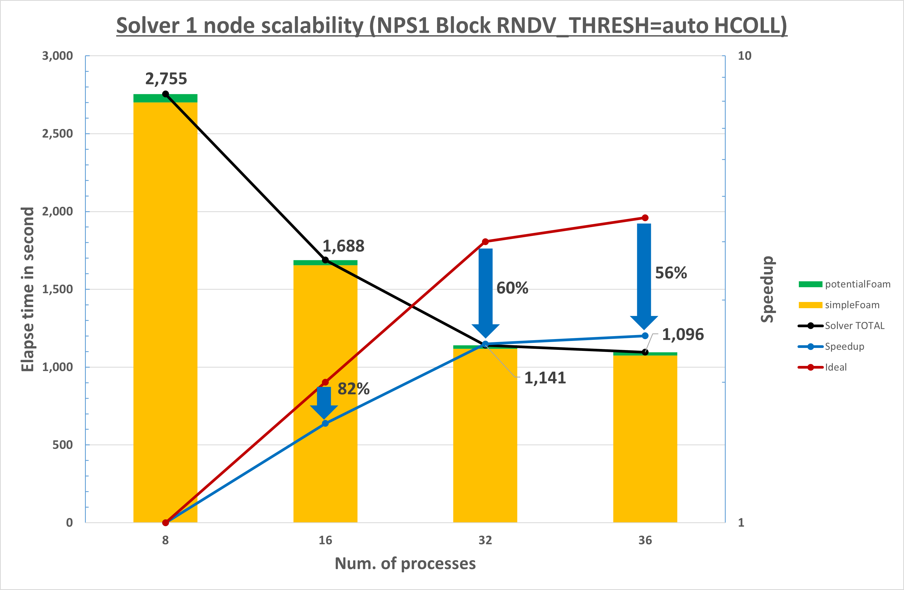

以上より、プロセス数 **36** が最も性能が良いことがわかりますが、次点のプロセス数 **32** との差が小さいため、 **[Test intra2](#2-2-test-intra2)** ではプロセス数 **32** とプロセス数 **36** を使用して検証を進めます。

## 2-2. Test intra2

以下8枚のグラフは、 **UCX_RNDV_THRESH** ・ **coll_hcoll_enable** ・ **coll_ucc_enable** の各組合せによる **potentialFoam** と **simpleFoam** の所要時間をプロセス数と **NPS** とプロセス分割方法毎に比較したものです。

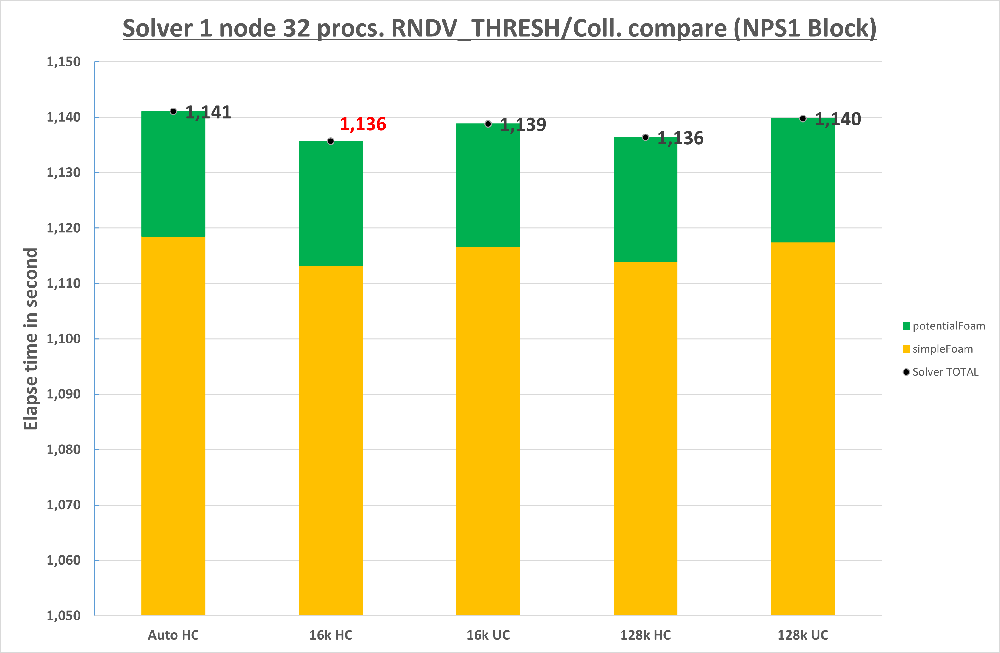

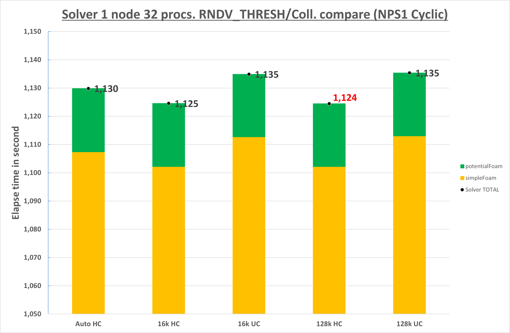

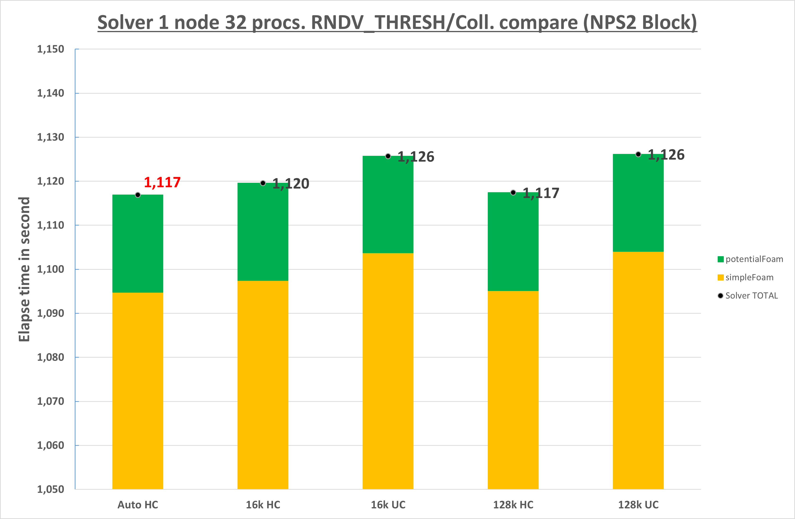

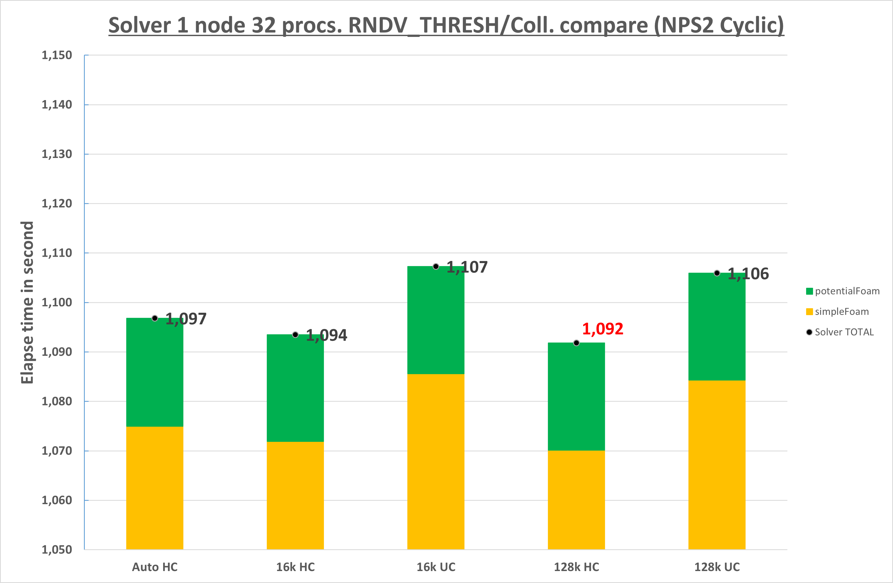

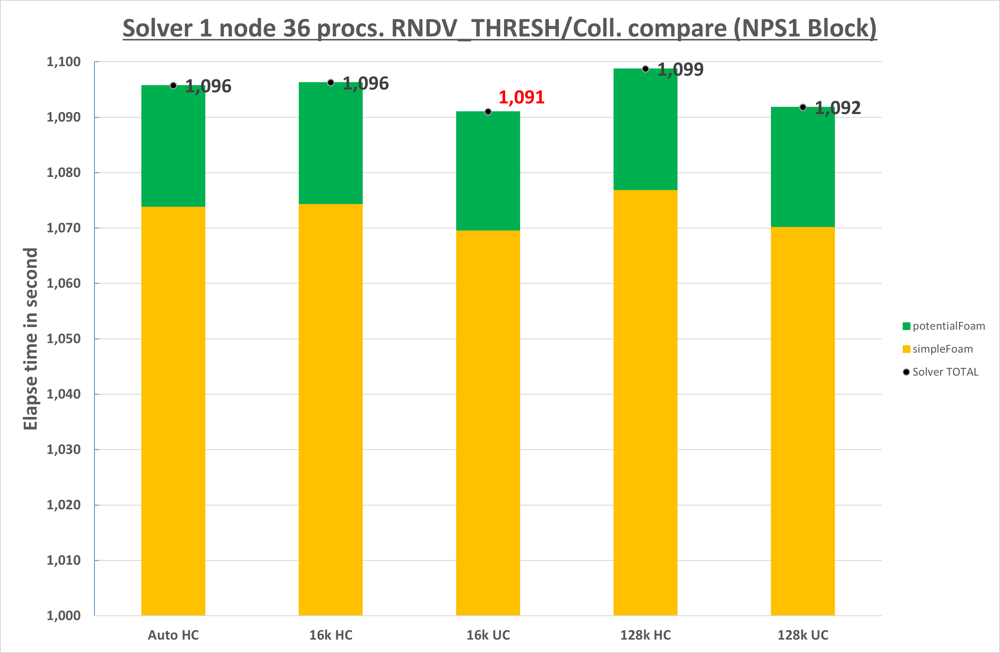

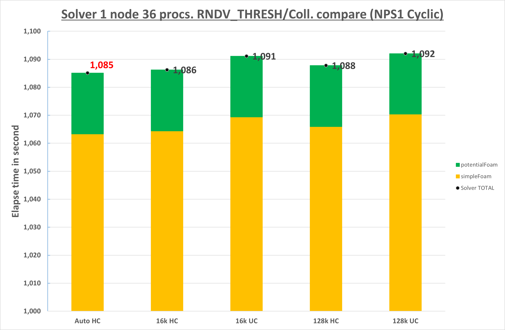

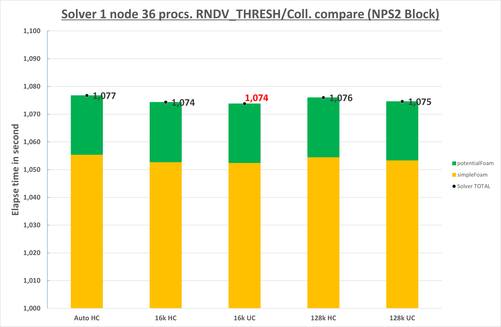

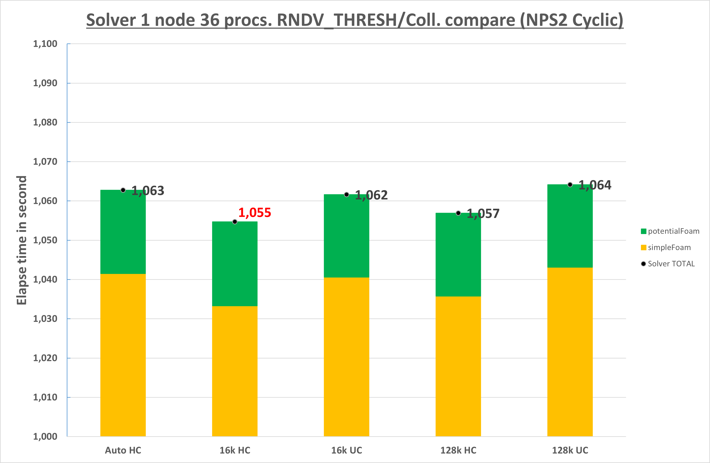

これより、プロセス数・ **NPS** ・プロセス分割方法の各組み合わせに於いて、以下の実行時パラメータの組み合わせが最も性能が良いことがわかります。

| プロセス数 | NPS      | プロセス分割方法 | ｜   | RNDV_THRESH | coll_hcoll_enable | coll_ucc_enable |
| :------: | :------: | :---------: | :-: | :---------: | :---------------: | :-------------: |
| 32       | **NPS1** | ブロック分割      | ｜   | **16kb**    | **1**             | **0**           |
|          |          | サイクリック分割    | ｜   | **128kb**   | **1**             | **0**           |
|          | **NPS2** | ブロック分割      | ｜   | **auto**    | **1**             | **0**           |
|          |          | サイクリック分割    | ｜   | **128kb**   | **1**             | **0**           |
| 36       | **NPS1** | ブロック分割      | ｜   | **16kb**    | **0**             | **1**           |
|          |          | サイクリック分割    | ｜   | **auto**    | **1**             | **0**           |
|          | **NPS2** | ブロック分割      | ｜   | **16k**     | **0**             | **1**           |
|          |          | サイクリック分割    | ｜   | **16kb**    | **1**             | **0**           |

次に以下グラフは、プロセス数・ **NPS** ・プロセス分割方法の各組み合わせに於ける最も性能の良い実行時パラメータの組み合わせで **potentialFoam** と **simpleFoam** の所要時間を比較したものです。

これより、プロセス数 **32** ・ **36** 何れの場合に於いても、 **NPS2** とサイクリック分割の組み合わせが最も性能が良く、 **NPS1** とブロック分割の組み合わせにデフォルトの実行時パラメータを組み合わせた所要時間からそれぞれ **4.5 %** と **3.9 %** 性能が向上しています。

以上より、プロセス数 **36** ・ **NPS2** ・サイクリック分割・ **tune** の組み合わせが最も性能が良いことがわかりますが、次点のプロセス数 **32** ・ **NPS2** ・サイクリック分割・ **tune** の組み合わせとの差が **3.5 %** と小さいため、 **[Test intra3](#2-3-test-intra3)** では両者を使用して検証を進めます。

## 2-3. Test intra3

以下のグラフは、ストレージに **S** を使用した場合の **potentialFoam** と **simpleFoam** の所要時間を、デフォルトの実行時パラメータとここまででに見出した最適な実行時パラメータで比較しています。  
この際、デフォルトの実行時パラメータを以下としています。

- **NPS**： **NPS1**
- プロセス分割方法： ブロック分割
- **UCX_RNDV_THRESH** ： **auto**
- **coll_hcoll_enable** ： **1**
- **coll_ucc_enable** ： **0**

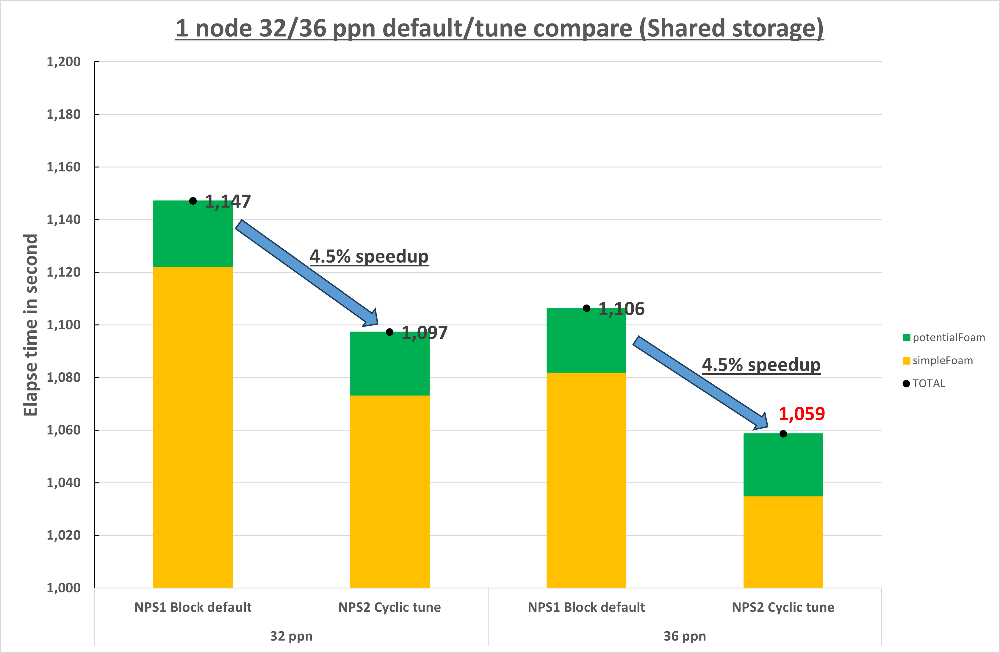

これより、プロセス数 **32** ・ **36** 何れの場合に於いても、最適な実行時パラメータの組み合わせによりデフォルトから **4.5 %** 性能が向上していることがわかります。

以上より、ストレージに **S** を使用した場合に於いても、プロセス数 **36** ・ **NPS2** ・サイクリック分割・ **tune** の組み合わせが最も性能が良いことを確認できました。

# 3. 最適なノード間並列実行方法

## 3-0. 概要

本章は、 **OpenFOAM** を **[クラスタ・ネットワーク](../../#5-1-クラスタネットワーク)** を跨いでノード間並列実行する際、ノード数増加に伴うスケーラビリティーや並列実行時に使用する **OpenMPI** のノード間通信性能がその性能に影響を与えることを念頭に、コストパフォーマンスを最大にするノード数や実行時パラメータの組み合わせを探ります。

ここでは、以下のノード数と、

- ノード数 ： **2** / **4** / **8**

**[OCI HPCパフォーマンス関連情報](../../#2-oci-hpcパフォーマンス関連情報)** の **[OpenMPIのMPI集合通信チューニング方法（BM.Optimized3.36編）](../../benchmark/openmpi-perftune/)** の **[2. 2ノード](../../benchmark/openmpi-perftune/#2-2ノード)** 、 **[3. 4ノード](../../benchmark/openmpi-perftune/#3-4ノード)** 、及び **[4. 8ノード](../../benchmark/openmpi-perftune/#4-8ノード)** の結果からノード間の **OpenMPI** 通信性能に影響することがわかっている以下パラメータを検証します。

- **UCX_TLS** ： **all** / **self,sm,rc** / **self,sm,ud** （※20）
- **UCX_ZCOPY_THRESH** ： **auto** / **128kb** （※21）
- **UCX_RNDV_THRESH** ： **inter:auto** / **inter:128kb**

※20）詳細は **[OCI HPCパフォーマンス関連情報](../../#2-oci-hpcパフォーマンス関連情報)** の **[OpenMPIのMPI通信性能に影響するパラメータとその関連Tips](../../benchmark/openmpi-perftips/)** の **[3-4. UCX_TLS](../../benchmark/openmpi-perftips/#3-4-ucx_tls)** を参照してください。なお、 **self,sm,ud** は4ノードと8ノードにのみ使用します。  
※21）詳細は **[OCI HPCパフォーマンス関連情報](../../#2-oci-hpcパフォーマンス関連情報)** の **[OpenMPIのMPI通信性能に影響するパラメータとその関連Tips](../../benchmark/openmpi-perftips/)** の **[3-7. UCX_ZCOPY_THRESH](../../benchmark/openmpi-perftips/#3-7-ucx_zcopy_thresh)** を参照してください。   

ここで、以下のテストで実行時パラメータの最適な組み合わせを探索します。

- **[Test inter1](#3-1-test-inter1)**
    - ノード数毎に以下実行時パラメータの組み合わせを検証してこの最適値を決定
        - **UCX_TLS** = **all** ・ **UCX_ZCOPY_THRESH** = **auto** ・ **UCX_RNDV_THRESH** = **inter:auto** （全てデフォルト）
        - **UCX_TLS** = **self,sm,rc** ・ **UCX_ZCOPY_THRESH** = **128kb** ・ **UCX_RNDV_THRESH** = **inter:128kb**
        - **UCX_TLS** = **self,sm,ud** ・ **UCX_ZCOPY_THRESH** = **128kb** ・ **UCX_RNDV_THRESH** = **inter:128kb**
    - ノード当たりプロセス数は **[Test intra1](#2-1-test-intra1)** で決定した最適値を使用（※22）
    - 以下実行時パラメータは **[Test intra2](#2-2-test-intra2)** で決定した最適値を使用
        - **NPS**
        - プロセス分割方法
        - **UCX_RNDV_THRESH (intra)**
        - **coll_hcoll_enable**
        - **coll_ucc_enable**

※22） **[Test intra1](#2-1-test-intra1)** ではプロセス数 **36** が最も性能が良いという結果ですが、プロセス数 **32** との性能差が **3.6 %** と小さくノード間並列に拡張する際に性能が逆転する可能性に配慮し、両者を評価対象とします。

ここでこのテストは、ストレージ領域へのアクセスによる影響を極力排除して実行時パラメータの効果にフォーカスするため、以下の条件で実施します。

- **ステップ 1.** ・ **ステップ 2.** ・ **ステップ 3.** のストレージ領域にそれぞれ **S** ・ **L** ・ **S** を使用
- **writeInterval** 値に1,000を使用（タイムステップ時点の結果をストレージ領域に出力しません。）
- 評価項目は **potentialFoam** と **simpleFoam** の所要時間（ **T4** と **T5** です。）

次に、このテストで見出したノード数毎の最適な実行時パラメータの組み合わせと **[1. ストレージ領域を考慮した最適な実行方法](#1-ストレージ領域を考慮した最適な実行方法)** の結果から得られた最適なストレージの利用形態を考慮し、以下の条件でテストを実施してノード数毎の最適な実行条件を最終確認します。

- **[Test inter2](#3-2-test-inter2)**
    - ノード当たりプロセス数は **[Test intra1](#2-1-test-intra1)** で決定した最適値を使用（※22）
    - 以下実行時パラメータは **[Test intra2](#2-2-test-intra2)** で決定した最適値を使用
        - **NPS**
        - プロセス分割方法
        - **UCX_RNDV_THRESH (intra)**
        - **coll_hcoll_enable**
        - **coll_ucc_enable**
    - 以下実行時パラメータは **[Test inter1](#3-1-test-inter1)** で決定した最適値を使用
        - **UCX_TLS**
        - **UCX_ZCOPY_THRESH**
        - **UCX_RNDV_THRESH (inter)**
    - **ステップ 1.** ・ **ステップ 2.** ・ **ステップ 3.** のストレージ領域にそれぞれ **S** ・ **S** ・ **S** を使用
    - **writeInterval** 値に1,000を使用（タイムステップ時点の結果をストレージ領域に出力しません。）

以降の検証結果から、ノード数毎の最適な実行条件が以下であると判明しています。

- 2ノード
    - ノード当たりプロセス数
    - **UCX_TLS**
    - **UCX_ZCOPY_THRESH**
    - **UCX_RNDV_THRESH (inter)**

## 3-1. Test inter1

以下3枚のグラフは、2ノード・4ノード・8ノードでの **potentialFoam** と **simpleFoam** の所要時間を各実行時パラメータの組み合わせ毎に比較したものです。

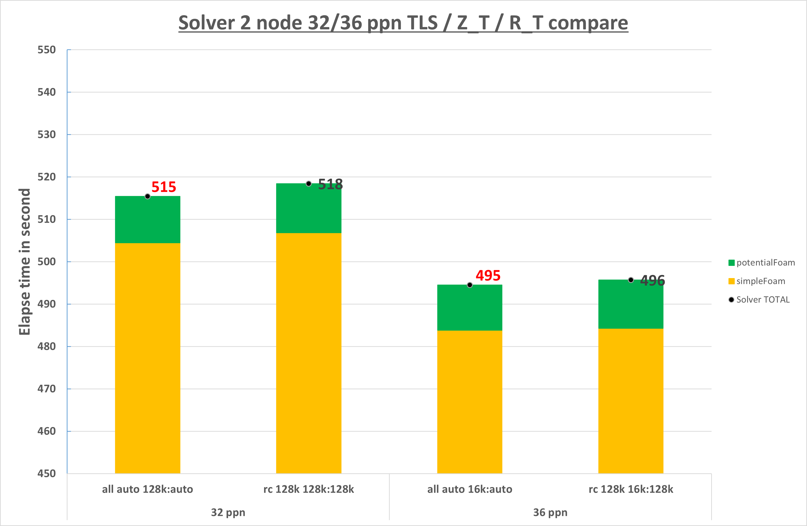

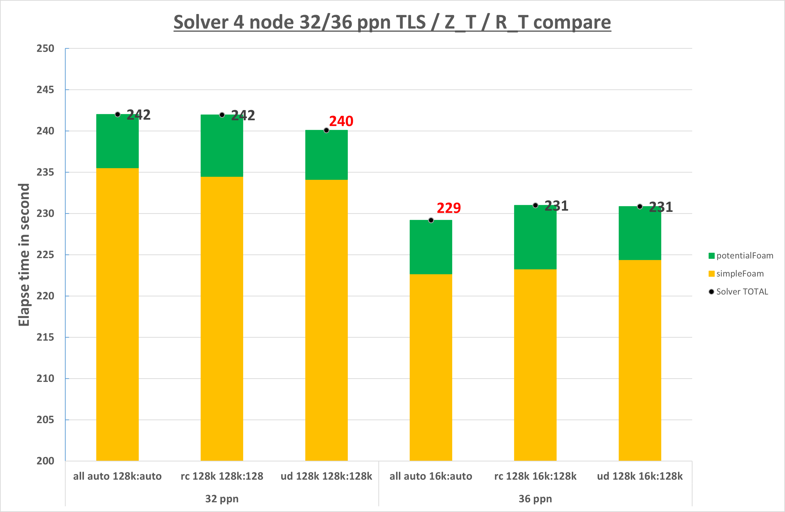

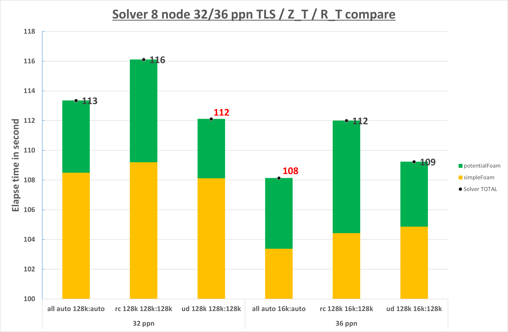

これより、各ノード数で以下の実行時パラメータの組み合わせが最も性能が良いことがわかります。

| ノード数 | ノード当たり プロセス数 | ｜   | UCX_TLS        | UCX_ZCOPY_THRESH | UCX_RNDV_THRESH (inter) |     |
| :--: | :---------: | :-: | :------------: | :--------------: | :---------------------: | --- |
| 2    | **32**      | ｜   | **all**        | **auto**         | **auto**                |     |
|      | **36**      | ｜   | **all**        | **auto**         | **auto**                |     |
| 4    | **32**      | ｜   | **self,sm,ud** | **128kb**        | **128kb**               |     |
|      | **36**      | ｜   | **all**        | **auto**         | **auto**                |     |
| 8    | **32**      | ｜   | **self,sm,ud** | **128kb**        | **128kb**               |     |
|      | **36**      | ｜   | **all**        | **auto**         | **auto**                |     |

## 3-2. Test inter2

以下のグラフは、ストレージに **S** を使用した場合の **potentialFoam** と **simpleFoam** の所要時間を、デフォルトの実行時パラメータとここまででに見出した最適な実行時パラメータでノード数毎に比較しています。  
この際、デフォルトの実行時パラメータを以下としています。

- **NPS** ： **NPS1**
- プロセス分割方法： ブロック分割
- **UCX_RNDV_THRESH** ： **auto**
- **coll_hcoll_enable** ： **1**
- **coll_ucc_enable** ： **0**
- **UCX_TLS** ： **all**
- **UCX_ZCOPY_THRESH** ： **auto**

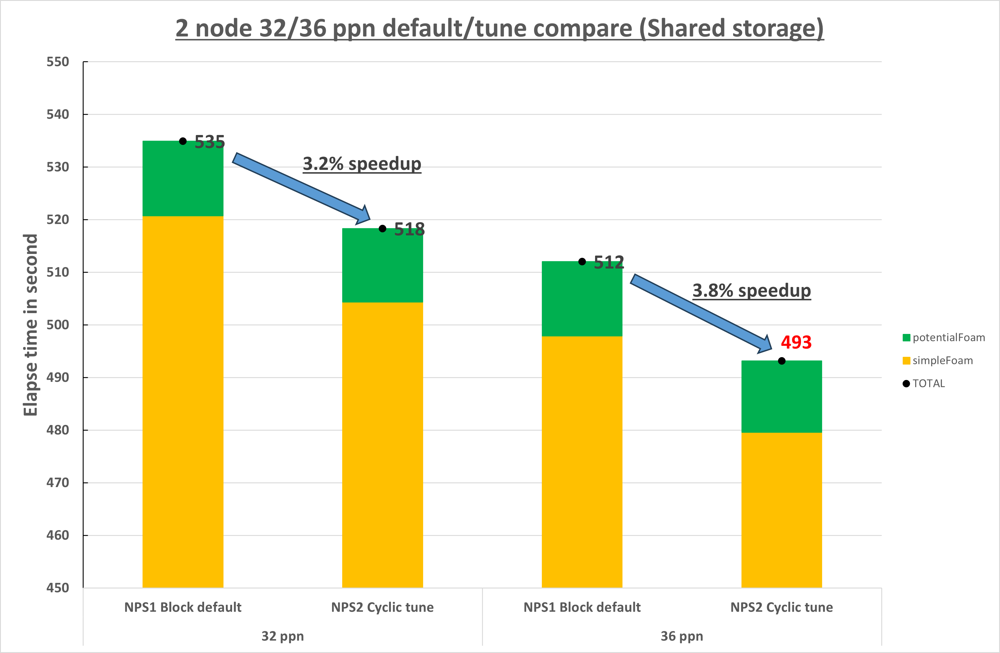

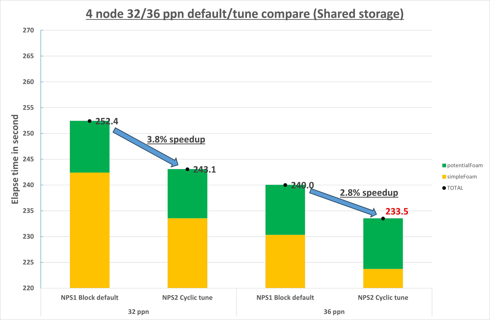

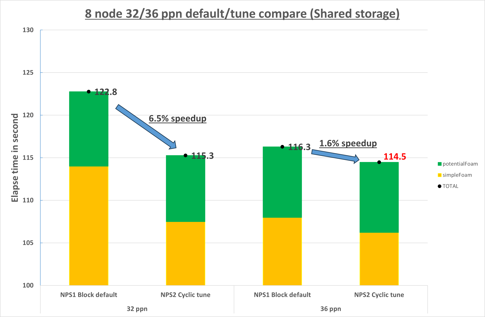

これより、各ノード数に於ける最適な実行時パラメータの組み合わせによりデフォルトから以下の性能向上を得られることがわかります。

| ノード数 | ノード当たりプロセス数 | ｜   | スピードアップ|
| :--: | :---------: | :-: | :------------: |
| 2    | **32**      | ｜   | 3.2 %     | 
|      | **36**      | ｜   | 3.8 %      | 
| 4    | **32**      | ｜   | 3.8 %  | 
|      | **36**      | ｜   |2.8 %      | 
| 8    | **32**      | ｜   | 6.5 %  | 
|      | **36**      | ｜   | 1.6 %       | 

以上より、どのノード数でストレージに **S** を使用した場合に於いても、プロセス数 **36** ・ **NPS2** ・サイクリック分割・ **tune** の組み合わせが最も性能が良いことを確認できました。

# 4. コストパフォーマンスを最大にするノード数の検証

本章は、これまでの検証結果を元に、コストパフォーマンスを最大にするノード数を検証します。

この検証方法は、 **[1. ストレージ領域を考慮した最適な実行方法](#1-ストレージ領域を考慮した最適な実行方法)** の結果から並列計算用メッシュ分割と並列計算結果マージ処理をVMで実行することが有利と判明しているため、実質的なCFD解析フローの実行コストを決定するソルバー実行時の計算ノードの使用延べ時間を算出し、これが最小となるノード数をコストパフォーマンス最大のノード数とします。  
この計算ノード使用延べ時間は、ここまでに導き出した各ノード数での最適な実行時パラメータを使用した際のファイル共有ストレージを使用するソルバー実行の所要時間とノード数を掛けた値で算出します。

| ノード数 | ソルバー実行所要時間 | 計算ノード使用延べ時間 |
| :--: | ---------: | ----------: |
| 1    | 1,059 秒    | 1,059 秒     |
| 2    | 493 秒      | 986 秒       |
| 4    | 234 秒      | 934 秒       |
| 8    | 114 秒      | 916 秒       |

以上より、8ノードまでのHPCクラスタで本解析モデルを実行する場合、 <b><u>コストパフォーマンスを最大にするノード数は **8** ノード</u></b> であることがわかります。

ここで以下のグラフは、ノード数を増やした時のソルバー実行の所要時間と並列化効率の変化を示しています。

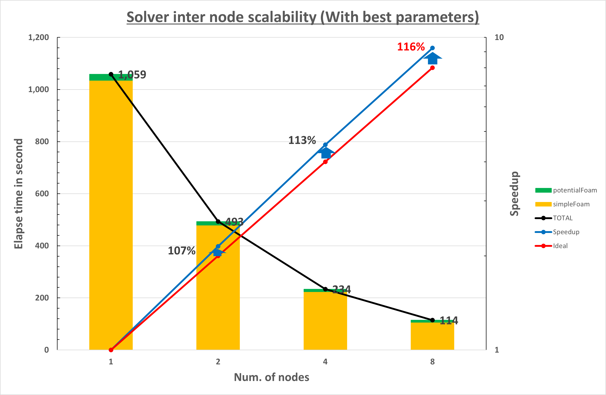

これより、ノード間並列でスーパーリニアが発生（ **simpleFoam** の所要時間がこれに該当します。）しており、ノード数増加に伴い並列化効率が向上するため、最大実行ノード数の **8** ノードで最大の並列化効率となっており、この点がコストパフォーマンスを最大にするノード数を決定する要因になっています。