# 0. 概要

オープンソースのMPI実装である **[OpenMPI](https://www.open-mpi.org/)** は、  **[Modular Component Architecture](https://docs.open-mpi.org/en/v5.0.x/mca.html)** （以降 **MCA** と呼称します。）を採用することで、ビルド時に組み込むコンポーネントを介して集合通信を含む多彩な機能を提供し、この **MCA** パラメータにはMPI集合通信性能に影響するものがあります。  
特にMPI集合通信の高速化を意識して開発されている **[HCOLL](https://docs.nvidia.com/networking/display/hpcxv223/hcoll)** や **[Unified Collective Communication](https://github.com/openucx/ucc)** （以降 **UCC** と呼称します。）は、その特性を理解して適切に利用することで、MPI集合通信性能を大幅に向上させることが可能です。

また **OpenMPI** は、高帯域・低遅延のMPIプロセス間通信を実現するためにその通信フレームワークに **[UCX](https://openucx.org/)** を採用し、この **UCX** のパラメータにもMPI集合通信性能に影響するパラメータが存在します。

またMPI集合通信は、ノード内並列では実質的にメモリコピーとなるため、メモリ性能に影響するMPIプロセスのコア割当てや **NUMA nodes per socket** （以降 **NPS** と呼称します。）もその性能に影響します。

以上を踏まえて本パフォーマンス関連Tipsは、第3世代 **Intel Xeon** プロセッサを搭載するベア・メタル・シェイプ **[BM.Optimized3.36](https://docs.oracle.com/ja-jp/iaas/Content/Compute/References/computeshapes.htm#bm-hpc-optimized)** に於ける **OpenMPI** のMPI集合通信性能にフォーカスし、以下の **計測条件** を組合せたテストケース毎に以下の **実行時パラメータ** を変えてその性能を **[Intel MPI Benchmarks](https://www.intel.com/content/www/us/en/developer/articles/technical/intel-mpi-benchmarks.html)** で計測し、最適な **実行時パラメータ** の組み合わせを導きます。

[**計測条件**]

- ノード数 ： **1** ・ **2** ・ **4** ・ **8**
- ノード当たりMPIプロセス数 ： **8** ・ **16** ・ **32** ・ **36**
- MPI集合通信関数 ： **Alltoall** ・ **Allgather** ・ **Allreduce**

[**実行時パラメータ**]

- **UCX_TLS** ： **all** ・ **self,sm,rc** ・ **self,sm,ud** ・ **self,sm,dc** （※1）
- **UCX_RNDV_THRESH** ： **auto** ・ **4kb** ・ **8kb** ・ **16kb** ・ **32kb** ・ **64kb** ・ **128kb** （※2）
- **UCX_ZCOPY_THRESH** ： **auto** ・ **4kb** ・ **8kb** ・ **16kb** ・ **32kb** ・ **64kb** ・ **128kb** （※3）
- **coll_hcoll_enable** ： **0** ・ **1** （※4）
- **coll_ucc_enable** ： **0** ・ **1** （※5）
- MPIプロセス分割方法 ： ブロック分割・サイクリック分割（※6）
- **NPS** ：  **1** （以降 **NPS1** と呼称します。）・ **2** （以降 **NPS2** と呼称します。）（※7）

※1） **UCX** のパラメータで、2ノード以上の **計測条件** で使用します。詳細は **[OCI HPCパフォーマンス関連情報](../../#2-oci-hpcパフォーマンス関連情報)** の **[OpenMPIのMPI通信性能に影響するパラメータとその関連Tips](../../benchmark/openmpi-perftips/)** の **[3-4. UCX_TLS](../../benchmark/openmpi-perftips/#3-4-ucx_tls)** を参照してください。  
※2） **UCX** のパラメータで、詳細は **[OCI HPCパフォーマンス関連情報](../../#2-oci-hpcパフォーマンス関連情報)** の **[OpenMPIのMPI通信性能に影響するパラメータとその関連Tips](../../benchmark/openmpi-perftips/)** の **[3-6. UCX_RNDV_THRESH](../../benchmark/openmpi-perftips/#3-6-ucx_rndv_thresh)** を参照してください。  
※3） **UCX** のパラメータで、2ノード以上の **計測条件** で使用します。詳細は **[OCI HPCパフォーマンス関連情報](../../#2-oci-hpcパフォーマンス関連情報)** の **[OpenMPIのMPI通信性能に影響するパラメータとその関連Tips](../../benchmark/openmpi-perftips/)** の **[3-7. UCX_ZCOPY_THRESH](../../benchmark/openmpi-perftips/#3-7-ucx_zcopy_thresh)** を参照してください。  
※4） **MCA** のパラメータで、詳細は **[OCI HPCパフォーマンス関連情報](../../#2-oci-hpcパフォーマンス関連情報)** の **[OpenMPIのMPI通信性能に影響するパラメータとその関連Tips](../../benchmark/openmpi-perftips/)** の **[3-1. coll_hcoll_enable](../../benchmark/openmpi-perftips/#3-1-coll_hcoll_enable)** を参照してください。  
※5） **MCA** のパラメータで、詳細は **[OCI HPCパフォーマンス関連情報](../../#2-oci-hpcパフォーマンス関連情報)** の **[OpenMPIのMPI通信性能に影響するパラメータとその関連Tips](../../benchmark/openmpi-perftips/)** の **[3-9. coll_ucc_enable](../../benchmark/openmpi-perftips/#3-9-coll_ucc_enable)** を参照してください。  
※6）NUMAノードに対するMPIプロセスの分割方法で、詳細は **[OCI HPCパフォーマンス関連情報](../../#2-oci-hpcパフォーマンス関連情報)** の **[パフォーマンスを考慮したプロセス・スレッドのコア割当て指定方法（BM.Optimized3.36編）](../../benchmark/cpu-binding/)** を参照してください。  
※7）**NPS** の設定方法は、 **[OCI HPCパフォーマンス関連情報](../../#2-oci-hpcパフォーマンス関連情報)** の **[パフォーマンスに関連するベアメタルインスタンスのBIOS設定方法](../../benchmark/bios-setting/)** を参照してください。

また本パフォーマンス関連Tipsの検証は、以下の実行環境で実施しています。

[実行環境]
- シェイプ： **BM.Optimized3.36** （  **Simultanious Multi Threading** （以降 **SMT** と呼称します。）無効（※8））
- ノード間接続 ： **[クラスタ・ネットワーク](../../#5-1-クラスタネットワーク)** （※9）
- OS： **Oracle Linux** 8.10ベースのHPC **[クラスタネットワーキングイメージ](../../#5-13-クラスタネットワーキングイメージ)** （※10）
- **OpenMPI** ： 5.0.6（※11）
- **[OpenUCX](https://openucx.readthedocs.io/en/master/index.html#)** ： 1.17.0（※11）
- **Intel MPI Benchmarks** ： 2021.7（※12）

※8）**SMT** の設定方法は、 **[OCI HPCパフォーマンス関連情報](../../#2-oci-hpcパフォーマンス関連情報)** の **[パフォーマンスに関連するベアメタルインスタンスのBIOS設定方法](../../benchmark/bios-setting/)** を参照してください。  
※9）本テクニカルTipsの2ノード以上の計測は、 **クラスタ・ネットワーク** の同一リーフスイッチに接続するインスタンスを使用して行っています。同一リーフスイッチに接続するインスタンス間のノード間接続に於ける効果は、 **[OCI HPCパフォーマンス関連情報](../../#2-oci-hpcパフォーマンス関連情報)** の **[クラスタ・ネットワークのトポロジーを考慮したノード間通信最適化方法](../../benchmark/topology-aware-cn-tuning/)** を参照してください。  
※10）**[OCI HPCテクニカルTips集](../../#3-oci-hpcテクニカルtips集)** の **[クラスタネットワーキングイメージの選び方](../../tech-knowhow/osimage-for-cluster/)** の **[1. クラスタネットワーキングイメージ一覧](../../tech-knowhow/osimage-for-cluster/#1-クラスタネットワーキングイメージ一覧)** のイメージ **No.12** です。  
※11） **[OCI HPCテクニカルTips集](../../#3-oci-hpcテクニカルtips集)** の **[Slurm環境での利用を前提とするUCX通信フレームワークベースのOpenMPI構築方法](../../tech-knowhow/build-openmpi/)** に従って構築された **OpenMPI** と **OpenUCX** です。  
※12） **[OCI HPCパフォーマンス関連情報](../../#2-oci-hpcパフォーマンス関連情報)** の **[Intel MPI Benchmarks実行方法](../../benchmark/run-imb/)** の **[1. OpenMPIでIntel MPI Benchmarksを実行する場合](../../benchmark/run-imb/#1-openmpiでintel-mpi-benchmarksを実行する場合)** に従って構築された **Intel MPI Benchmarks** です。

また **Intel MPI Benchmarks** の計測は、 **numactl** コマンドを介して以下の実行時オプションを指定して起動します。

```sh
$ numactl -l IMB-MPI1 -msglog 0:xx -mem 2.3G -off_cache 39,64 -npmin num_of_procs alltoall/allgather/allreduce
```

ここで計測するメッセージサイズの上限（ **xx** ）は、MPI集合通信関数とノード数に応じて以下の値を使用します。  
この設定値は、計測可能な最大値から決定しています。

|               | 1ノード | 2ノード | 4ノード | 8ノード |
| :-----------: | :--: | :--: | :--: | ---- |
| **Alltoall**  | 25   | 24   | 23    | 22    |
| **Allgather** | 25   | 24   | 23    | 22    |
| **Allreduce** | 30   | 30   | 30    | 30    |

また **Intel MPI Benchmarks** の計測は、テストケース毎に5回実施し、その最大値と最小値を除く3回の算術平均をその結果とします。

なお、本パフォーマンス関連Tipsで取得したMPI集合通信特性を使用して実アプリケーションにプロファイリング・チューニングを適用する実例は、 **[OCI HPCパフォーマンス関連情報](../../#2-oci-hpcパフォーマンス関連情報)** の **[プロファイリング情報に基づく並列アプリケーションチューニング方法](../profiling-tuning/)** を参照してください。

以降では、以下 **計測条件** の順に解説します。

1. **[1ノード](#1--1ノード)**
2. **[2ノード](#2--2ノード)**
3. **[4ノード](#3--4ノード)**
4. **[8ノード](#4--8ノード)**

# 1.  1ノード

## 1-0. 概要

本章は、1ノードに8・16・32・36の各MPIプロセスを割当てる場合の各MPI集合通信関数の通信性能について、以下の **実行時パラメータ** の最適な組み合わせを検証します。

- **UCX_RNDV_THRESH** ： **auto** ・ **16kb** ・ **32kb** ・ **64kb** ・ **128kb**
- **coll_hcoll_enable** ： **0** ・ **1**
- **coll_ucc_enable** ： **0** ・ **1**
- MPIプロセス分割方法 ： ブロック分割・サイクリック分割
- **NPS** ：  **1** ・ **2**

## 1-1. 8 MPIプロセス

### 1-1-0. 概要

本章は、1ノードに8 MPIプロセスを割当てる場合の最適な **実行時パラメータ** の組み合わせをMPI集合通信関数毎に検証し、その結果を考察します。

### 1-1-1. Alltoall

以下のグラフは、 **UCX_RNDV_THRESH** を変化させたときの **Alltoall** の結果を、 **NPS** 、MPIプロセス分割方法、及び集合通信コンポーネントの組合せ毎に示しています。


以上より、各集合通信コンポーネントの **UCX_RNDV_THRESH** を下表の値とした場合が最も性能が良いと判断してこれを固定、 

||No COLL|UCC|HCOLL|
|:---:|-:|-:|-:|
|**UCX_RNDV_THRESH**|32KB|32KB|32KB|

**NPS** とMPIプロセス分割方法の各組合せを集合通信コンポーネント毎に比較したものが以下のグラフです。


以上より、 **NPS** とMPIプロセス分割方法を下表の設定とした場合が最も性能が良いと判断してこれを固定、 

||No COLL|UCC|HCOLL|
|:---:|-:|-:|-:|
|**NPS**|2|1|1|
|MPIプロセス分割方法|サイクリック分割|サイクリック分割|サイクリック分割|

集合通信コンポーネントを比較したものが以下のグラフです。  
ここでは、チューニングを全く適用しなかった場合と比較するため、全パラメータがデフォルトの組合せ（ **UCX_RNDV_THRESH=auto** ・ **coll_hcoll_enable=1** ・ **coll_ucc_enable=0** ）を含めています。


以上の結果は、以下のように考察することが出来ます。

- **UCC** は32KB以上で性能が低下しそれ未満で顕著な傾向無し
- **HCOLL** は顕著な傾向無し
- **UCC** は **HCOLL** に対して32KB以上で性能が向上しそれ未満で顕著な傾向無し
- チューニング未適用は8KBから128KBの間で大幅に性能が低下

### 1-1-2. Allgather

以下のグラフは、 **UCX_RNDV_THRESH** を変化させたときの **Allgather** の結果を、 **NPS** 、MPIプロセス分割方法、及び集合通信コンポーネントの組合せ毎に示しています。


以上より、各集合通信コンポーネントの **UCX_RNDV_THRESH** を下表の値とした場合が最も性能が良いと判断してこれを固定、 

||No COLL|UCC|HCOLL|
|:---:|-:|-:|-:|
|**UCX_RNDV_THRESH**|64KB|32KB|64KB|

**NPS** とMPIプロセス分割方法の各組合せを集合通信コンポーネント毎に比較したものが以下のグラフです。


以上より、 **NPS** とMPIプロセス分割方法を下表の設定とした場合が最も性能が良いと判断してこれを固定、 

||No COLL|UCC|HCOLL|
|:---:|-:|-:|-:|
|**NPS**|1|1|2|
|MPIプロセス分割方法|サイクリック分割|ブロック分割|ブロック分割|

集合通信コンポーネントを比較したものが以下のグラフです。  
ここでは、チューニングを全く適用しなかった場合と比較するため、全パラメータがデフォルトの組合せ（ **UCX_RNDV_THRESH=auto** ・ **coll_hcoll_enable=1** ・ **coll_ucc_enable=0** ）を含めています。


以上の結果は、以下のように考察することが出来ます。

- **UCC** はほぼ全域で性能が低下
- **HCOLL** はほぼ全域で性能が低下
- **UCC** は **HCOLL** に対して4KBから32KBの間で性能が向上しそれ未満で性能が低下
- チューニング適用による性能の変化無し

### 1-1-3. Allreduce

以下のグラフは、 **UCX_RNDV_THRESH** を変化させたときの **Allreduce** の結果を、 **NPS** 、MPIプロセス分割方法、及び集合通信コンポーネントの組合せ毎に示しています。


以上より、各集合通信コンポーネントの **UCX_RNDV_THRESH** を下表の値とした場合が最も性能が良いと判断してこれを固定、 

||No COLL|UCC|HCOLL|
|:---:|-:|-:|-:|
|**UCX_RNDV_THRESH**|64KB|128KB|128KB|

**NPS** とMPIプロセス分割方法の各組合せを集合通信コンポーネント毎に比較したものが以下のグラフです。


以上より、 **NPS** とMPIプロセス分割方法を下表の設定とした場合が最も性能が良いと判断してこれを固定、 

||No COLL|UCC|HCOLL|
|:---:|-:|-:|-:|
|**NPS**|2|2|2|
|MPIプロセス分割方法|ブロック分割|サイクリック分割|サイクリック分割|

集合通信コンポーネントを比較したものが以下のグラフです。  
ここでは、チューニングを全く適用しなかった場合と比較するため、全パラメータがデフォルトの組合せ（ **UCX_RNDV_THRESH=auto** ・ **coll_hcoll_enable=1** ・ **coll_ucc_enable=0** ）を含めています。


以上の結果は、以下のように考察することが出来ます。

- **UCC** は256KB以上で性能が向上しそれ未満で性能が低下
- **HCOLL** はほぼ全域で性能が向上
- **UCC** は **HCOLL** に対してほぼ全域で性能が低下
- チューニング未適用は16KBから16MBの間で大幅に性能が低下

## 1-2.  16 MPIプロセス

### 1-2-0. 概要

本章は、1ノードに16 MPIプロセスを割当てる場合の最適な **実行時パラメータ** の組み合わせをMPI集合通信関数毎に検証し、その結果を考察します。

### 1-2-1. Alltoall

以下のグラフは、 **UCX_RNDV_THRESH** を変化させたときの **Alltoall** の結果を、 **NPS** 、MPIプロセス分割方法、及び集合通信コンポーネントの組合せ毎に示しています。

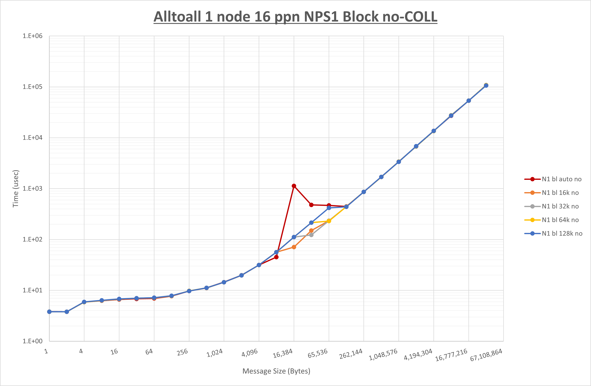


以上より、各集合通信コンポーネントの **UCX_RNDV_THRESH** を下表の値とした場合が最も性能が良いと判断してこれを固定、 

||No COLL|UCC|HCOLL|
|:---:|-:|-:|-:|
|**UCX_RNDV_THRESH**|16KB|32KB|32KB|

**NPS** とMPIプロセス分割方法の各組合せを集合通信コンポーネント毎に比較したものが以下のグラフです。


以上より、 **NPS** とMPIプロセス分割方法を下表の設定とした場合が最も性能が良いと判断してこれを固定、 

||No COLL|UCC|HCOLL|
|:---:|-:|-:|-:|
|**NPS**|1|1|1|
|MPIプロセス分割方法|サイクリック分割|サイクリック分割|サイクリック分割|

集合通信コンポーネントを比較したものが以下のグラフです。  
ここでは、チューニングを全く適用しなかった場合と比較するため、全パラメータがデフォルトの組合せ（ **UCX_RNDV_THRESH=auto** ・ **coll_hcoll_enable=1** ・ **coll_ucc_enable=0** ）を含めています。


以上の結果は、以下のように考察することが出来ます。

- **UCC** は16KB以上で性能が低下し128B未満で性能が向上
- **HCOLL** は1KB以上で顕著な傾向無くそれ未満で性能が向上
- **UCC** は **HCOLL** に対して32KB以上で性能が低下しそれ未満で顕著な傾向無し
- チューニング未適用は8KBから128KBの間で大幅に性能が低下

### 1-2-2. Allgather

以下のグラフは、 **UCX_RNDV_THRESH** を変化させたときの **Allgather** の結果を、 **NPS** 、MPIプロセス分割方法、及び集合通信コンポーネントの組合せ毎に示しています。


以上より、各集合通信コンポーネントの **UCX_RNDV_THRESH** を下表の値とした場合が最も性能が良いと判断してこれを固定、 

||No COLL|UCC|HCOLL|
|:---:|-:|-:|-:|
|**UCX_RNDV_THRESH**|64KB|32KB|32KB|

**NPS** とMPIプロセス分割方法の各組合せを集合通信コンポーネント毎に比較したものが以下のグラフです。


以上より、 **NPS** とMPIプロセス分割方法を下表の設定とした場合が最も性能が良いと判断してこれを固定、 

||No COLL|UCC|HCOLL|
|:---:|-:|-:|-:|
|**NPS**|1|2|2|
|MPIプロセス分割方法|サイクリック分割|ブロック分割|ブロック分割|

集合通信コンポーネントを比較したものが以下のグラフです。  
ここでは、チューニングを全く適用しなかった場合と比較するため、全パラメータがデフォルトの組合せ（ **UCX_RNDV_THRESH=auto** ・ **coll_hcoll_enable=1** ・ **coll_ucc_enable=0** ）を含めています。


以上の結果は、以下のように考察することが出来ます。

- **UCC** は16KB以上で顕著な傾向無くそれ未満で性能が低下
- **HCOLL** は32KB以上で顕著な傾向無くそれ未満のほぼ全域で性能が低下
- **UCC** は **HCOLL** に対して4KBから16KBの間で性能が向上しそれ未満で性能が低下
- チューニング適用による性能の変化無し

### 1-2-3. Allreduce

以下のグラフは、 **UCX_RNDV_THRESH** を変化させたときの **Allreduce** の結果を、 **NPS** 、MPIプロセス分割方法、及び集合通信コンポーネントの組合せ毎に示しています。


以上より、各集合通信コンポーネントの **UCX_RNDV_THRESH** を下表の値とした場合が最も性能が良いと判断してこれを固定、 

||No COLL|UCC|HCOLL|
|:---:|-:|-:|-:|
|**UCX_RNDV_THRESH**|64KB|128KB|128KB|

**NPS** とMPIプロセス分割方法の各組合せを集合通信コンポーネント毎に比較したものが以下のグラフです。


以上より、 **NPS** とMPIプロセス分割方法を下表の設定とした場合が最も性能が良いと判断してこれを固定、 

||No COLL|UCC|HCOLL|
|:---:|-:|-:|-:|
|**NPS**|2|2|2|
|MPIプロセス分割方法|ブロック分割|サイクリック分割|ブロック分割|

集合通信コンポーネントを比較したものが以下のグラフです。  
ここでは、チューニングを全く適用しなかった場合と比較するため、全パラメータがデフォルトの組合せ（ **UCX_RNDV_THRESH=auto** ・ **coll_hcoll_enable=1** ・ **coll_ucc_enable=0** ）を含めています。


以上の結果は、以下のように考察することが出来ます。

- **UCC** は32KB以上で性能が向上しそれ未満で性能が低下
- **HCOLL** は32MB以上で性能が向上し4KB以下で性能が低下
- **UCC** は **HCOLL** に対して8KB以上で顕著な傾向が無くそれ未満で性能が低下
- チューニング未適用は8KBから16MBの間で大幅に性能が低下

## 1-3.  32 MPIプロセス

### 1-3-0. 概要

本章は、1ノードに32 MPIプロセスを割当てる場合の最適な **実行時パラメータ** の組み合わせをMPI集合通信関数毎に検証し、その結果を考察します。

### 1-3-1. Alltoall

以下のグラフは、 **UCX_RNDV_THRESH** を変化させたときの **Alltoall** の結果を、 **NPS** 、MPIプロセス分割方法、及び集合通信コンポーネントの組合せ毎に示しています。


以上より、各集合通信コンポーネントの **UCX_RNDV_THRESH** を下表の値とした場合が最も性能が良いと判断してこれを固定、 

||No COLL|UCC|HCOLL|
|:---:|-:|-:|-:|
|**UCX_RNDV_THRESH**|16KB|16KB|16KB|

**NPS** とMPIプロセス分割方法の各組合せを集合通信コンポーネント毎に比較したものが以下のグラフです。


以上より、 **NPS** とMPIプロセス分割方法を下表の設定とした場合が最も性能が良いと判断してこれを固定、 

||No COLL|UCC|HCOLL|
|:---:|-:|-:|-:|
|**NPS**|1|1|1|
|MPIプロセス分割方法|サイクリック分割|サイクリック分割|ブロック分割|

集合通信コンポーネントを比較したものが以下のグラフです。  
ここでは、チューニングを全く適用しなかった場合と比較するため、全パラメータがデフォルトの組合せ（ **UCX_RNDV_THRESH=auto** ・ **coll_hcoll_enable=1** ・ **coll_ucc_enable=0** ）を含めています。


以上の結果は、以下のように考察することが出来ます。

- **UCC** は16KB以上と128B以下で性能が低下
- **HCOLL** は2KB以上で顕著な傾向が無くそれ未満で概ね性能が向上
- **UCC** は **HCOLL** に対して16KB以上で性能が低下しそれ未満で顕著な傾向無し
- チューニング未適用は8KBから512KBの間で大幅に性能が低下

### 1-3-2. Allgather

以下のグラフは、 **UCX_RNDV_THRESH** を変化させたときの **Allgather** の結果を、 **NPS** 、MPIプロセス分割方法、及び集合通信コンポーネントの組合せ毎に示しています。


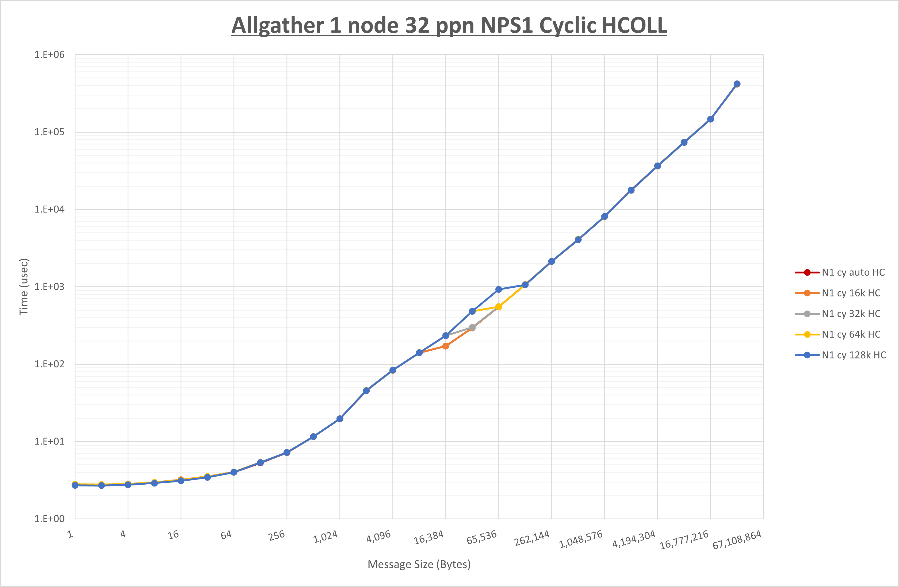


以上より、各集合通信コンポーネントの **UCX_RNDV_THRESH** を下表の値とした場合が最も性能が良いと判断してこれを固定、 

||No COLL|UCC|HCOLL|
|:---:|-:|-:|-:|
|**UCX_RNDV_THRESH**|16KB|16KB|16KB|

**NPS** とMPIプロセス分割方法の各組合せを集合通信コンポーネント毎に比較したものが以下のグラフです。


以上より、 **NPS** とMPIプロセス分割方法を下表の設定とした場合が最も性能が良いと判断してこれを固定、 

||No COLL|UCC|HCOLL|
|:---:|-:|-:|-:|
|**NPS**|2|2|2|
|MPIプロセス分割方法|ブロック分割|ブロック分割|ブロック分割|

集合通信コンポーネントを比較したものが以下のグラフです。  
ここでは、チューニングを全く適用しなかった場合と比較するため、全パラメータがデフォルトの組合せ（ **UCX_RNDV_THRESH=auto** ・ **coll_hcoll_enable=1** ・ **coll_ucc_enable=0** ）を含めています。


以上の結果は、以下のように考察することが出来ます。

- **UCC** は128Bから512Bの間で性能が低下しそれ以外で顕著な傾向無し
- **HCOLL** は2KBから8KBの間で性能が低下しそれ以外で顕著な傾向無し
- **UCC** は **HCOLL** に対して128Bから512Bの間で性能が低下し2KBから8KBの間で性能が向上
- チューニング適用による性能の変化無し

### 1-3-3. Allreduce

以下のグラフは、 **UCX_RNDV_THRESH** を変化させたときの **Allreduce** の結果を、 **NPS** 、MPIプロセス分割方法、及び集合通信コンポーネントの組合せ毎に示しています。


以上より、各集合通信コンポーネントの **UCX_RNDV_THRESH** を下表の値とした場合が最も性能が良いと判断してこれを固定、 

||No COLL|UCC|HCOLL|
|:---:|-:|-:|-:|
|**UCX_RNDV_THRESH**|Auto|128KB|128KB|

**NPS** とMPIプロセス分割方法の各組合せを集合通信コンポーネント毎に比較したものが以下のグラフです。


以上より、 **NPS** とMPIプロセス分割方法を下表の設定とした場合が最も性能が良いと判断してこれを固定、 

||No COLL|UCC|HCOLL|
|:---:|-:|-:|-:|
|**NPS**|2|1|1|
|MPIプロセス分割方法|ブロック分割|サイクリック分割|ブロック分割|

集合通信コンポーネントを比較したものが以下のグラフです。  
ここでは、チューニングを全く適用しなかった場合と比較するため、全パラメータがデフォルトの組合せ（ **UCX_RNDV_THRESH=auto** ・ **coll_hcoll_enable=1** ・ **coll_ucc_enable=0** ）を含めています。


以上の結果は、以下のように考察することが出来ます。

- **UCC** は512KB以上で性能が向上しそれ未満で顕著な傾向無し
- **HCOLL** は32MB以上と4KB以下で性能が向上
- **UCC** は **HCOLL** に対して4KB以下で性能が低下
- チューニング未適用は64KBから16MBの間で大幅に性能が低下

## 1-4.  36 MPIプロセス

### 1-4-0. 概要

本章は、1ノードに36 MPIプロセスを割当てる場合の最適な **実行時パラメータ** の組み合わせをMPI集合通信関数毎に検証し、その結果を考察します。

### 1-4-1. Alltoall

以下のグラフは、 **UCX_RNDV_THRESH** を変化させたときの **Alltoall** の結果を、 **NPS** 、MPIプロセス分割方法、及び集合通信コンポーネントの組合せ毎に示しています。


以上より、各集合通信コンポーネントの **UCX_RNDV_THRESH** を下表の値とした場合が最も性能が良いと判断してこれを固定、 

||No COLL|UCC|HCOLL|
|:---:|-:|-:|-:|
|**UCX_RNDV_THRESH**|16KB|16KB|16KB|

**NPS** とMPIプロセス分割方法の各組合せを集合通信コンポーネント毎に比較したものが以下のグラフです。


以上より、 **NPS** とMPIプロセス分割方法を下表の設定とした場合が最も性能が良いと判断してこれを固定、 

||No COLL|UCC|HCOLL|
|:---:|-:|-:|-:|
|**NPS**|1|1|2|
|MPIプロセス分割方法|サイクリック分割|サイクリック分割|ブロック分割|

集合通信コンポーネントを比較したものが以下のグラフです。  
ここでは、チューニングを全く適用しなかった場合と比較するため、全パラメータがデフォルトの組合せ（ **UCX_RNDV_THRESH=auto** ・ **coll_hcoll_enable=1** ・ **coll_ucc_enable=0** ）を含めています。


以上の結果は、以下のように考察することが出来ます。

- **UCC** は16KB以上で性能が低下し128B以下で性能が向上
- **HCOLL** は128KB以上で性能が低下し1KB以下で概ね性能が向上
- **UCC** は **HCOLL** に対して16KBから128KBの間で性能が低下
- チューニング未適用は8KBから256KBの間で大幅に性能が低下

### 1-4-2. Allgather

以下のグラフは、 **UCX_RNDV_THRESH** を変化させたときの **Allgather** の結果を、 **NPS** 、MPIプロセス分割方法、及び集合通信コンポーネントの組合せ毎に示しています。


以上より、各集合通信コンポーネントの **UCX_RNDV_THRESH** を下表の値とした場合が最も性能が良いと判断してこれを固定、 

||No COLL|UCC|HCOLL|
|:---:|-:|-:|-:|
|**UCX_RNDV_THRESH**|16KB|16KB|16KB|

**NPS** とMPIプロセス分割方法の各組合せを集合通信コンポーネント毎に比較したものが以下のグラフです。


以上より、 **NPS** とMPIプロセス分割方法を下表の設定とした場合が最も性能が良いと判断してこれを固定、 

||No COLL|UCC|HCOLL|
|:---:|-:|-:|-:|
|**NPS**|2|2|2|
|MPIプロセス分割方法|ブロック分割|ブロック分割|ブロック分割|

集合通信コンポーネントを比較したものが以下のグラフです。  
ここでは、チューニングを全く適用しなかった場合と比較するため、全パラメータがデフォルトの組合せ（ **UCX_RNDV_THRESH=auto** ・ **coll_hcoll_enable=1** ・ **coll_ucc_enable=0** ）を含めています。


以上の結果は、以下のように考察することが出来ます。

- **UCC** は64B以下で性能が向上しそれ以外で顕著な傾向無し
- **HCOLL** は1KB以下で性能が向上しそれ以外で顕著な傾向無し
- **UCC** は **HCOLL** に対して2KBから8KBの間で性能が向上しそれ未満で性能が低下
- チューニング適用による性能の変化無し

### 1-4-3. Allreduce

以下のグラフは、 **UCX_RNDV_THRESH** を変化させたときの **Allreduce** の結果を、 **NPS** 、MPIプロセス分割方法、及び集合通信コンポーネントの組合せ毎に示しています。


以上より、各集合通信コンポーネントの **UCX_RNDV_THRESH** を下表の値とした場合が最も性能が良いと判断してこれを固定、 

||No COLL|UCC|HCOLL|
|:---:|-:|-:|-:|
|**UCX_RNDV_THRESH**|Auto|128KB|128KB|

**NPS** とMPIプロセス分割方法の各組合せを集合通信コンポーネント毎に比較したものが以下のグラフです。


以上より、 **NPS** とMPIプロセス分割方法を下表の設定とした場合が最も性能が良いと判断してこれを固定、 

||No COLL|UCC|HCOLL|
|:---:|-:|-:|-:|
|**NPS**|2|1|1|
|MPIプロセス分割方法|ブロック分割|ブロック分割|ブロック分割|

集合通信コンポーネントを比較したものが以下のグラフです。  
ここでは、チューニングを全く適用しなかった場合と比較するため、全パラメータがデフォルトの組合せ（ **UCX_RNDV_THRESH=auto** ・ **coll_hcoll_enable=1** ・ **coll_ucc_enable=0** ）を含めています。

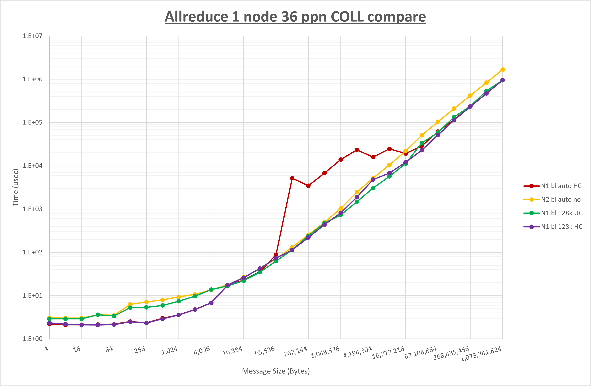

以上の結果は、以下のように考察することが出来ます。

- **UCC** は128B以上で性能が向上
- **HCOLL** は128KB以上と4KB以下で性能が向上
- **UCC** は **HCOLL** に対して8KB以上で顕著な傾向が無くそれ未満で性能が低下
- チューニング未適用は64KBから64MBの間で大幅に性能が低下

# 2.  2ノード

## 2-0. 概要

本章は、2ノードにノード当たり8・16・32・36の各MPIプロセス、トータルで16・32・64・72の各MPIプロセスを割当てる場合の各MPI集合通信関数の通信性能について、以下の **実行時パラメータ** の最適な組み合わせを検証します。

- **UCX_TLS** ： **all** ・ **self,sm,rc** ・ **self,sm,ud** ・ **self,sm,dc**
- **UCX_RNDV_THRESH** ： **auto** ・ **4kb** ・ **8kb** ・ **16kb** ・ **32kb** ・ **64kb** ・ **128kb** （※13）
- **UCX_ZCOPY_THRESH** ： **auto** ・ **4kb** ・ **8kb** ・ **16kb** ・ **32kb** ・ **64kb** ・ **128kb**
- **coll_hcoll_enable** ： **0** ・ **1**
- **coll_ucc_enable** ： **0** ・ **1**
- MPIプロセス分割方法 ： ブロック分割・サイクリック分割
- **NPS** ：  **1** ・ **2**

※13） **UCX_RNDV_THRESH** は、ノード内は **auto** と **[1. 1ノード](#1--1ノード)** で判明した最適値、ノード間はここに記載の7種類を使用し、以下8個の組合せを検証します。

- **intra:auto,inter:auto**
- **intra:optimal_value,inter:auto**
- **intra:optimal_value,inter:4kb**
- **intra:optimal_value,inter:8kb**
- **intra:optimal_value,inter:16kb**
- **intra:optimal_value,inter:32kb**
- **intra:optimal_value,inter:64kb**
- **intra:optimal_value,inter:128kb**

ここで、全ての **実行時パラメータ** の組み合わせを検証することは非現実的なため、組み合わせを減らす目的で以下3ステップに分けて検証を行います。

- ステップ1
    - **UCX_TLS** と **UCX_RNDV_THRESH** を組合せた32個のパターンを検証してこれらの最適値を決定
    - **coll_hcoll_enable** は **1** に固定（デフォルト）
    - **coll_ucc_enable** は **0** に固定（デフォルト）
    - MPIプロセス分割方法はブロック分割に固定
    - **NPS** は **NPS1** に固定
- ステップ2
    - **UCX_ZCOPY_THRESH** の7パターンを検証してこの最適値を決定
    - **UCX_TLS** と **UCX_RNDV_THRESH** はステップ1で決定した最適値を使用
    - **coll_hcoll_enable** は **1** に固定（デフォルト）
    - **coll_ucc_enable** は **0** に固定（デフォルト）
    - MPIプロセス分割方法はブロック分割に固定
    - **NPS** は **NPS1** に固定
- ステップ3
    - **coll_hcoll_enable** / **coll_ucc_enable** / MPIプロセス分割方法 / **NPS** を組合せた12パターンを検証してこれらの最適値を決定
    - **UCX_TLS** と **UCX_RNDV_THRESH** はステップ1で決定した最適値を使用
    - **UCX_ZCOPY_THRESH** はステップ2で決定した最適値を使用

## 2-1. ノード当たり8 MPIプロセス

### 2-1-0. 概要

本章は、2ノードにノード当たり8 MPIプロセスでトータル16 MPIプロセスを割当てる場合の最適な **実行時パラメータ** の組み合わせをMPI集合通信関数毎に検証し、その結果を考察します。

下表は、各MPI集合通信関数の最適な **UCX_TLS** 、 **UCX_RNDV_THRESH** 、及び **UCX_ZCOPY_THRESH** を示しており、この設定値を使用することでデフォルト値に対して性能が向上します。

| MPI集合通信関数     | UCX_TLS    | UCX_RNDV_THRESH         | UCX_ZCOPY_THRESH |
| :-----------: | :--------: | :---------------------: | :--------------: |
| **Alltoall**  | self,sm,rc | intra:32kb,inter:128kb  | 128kb            |
| **Allgather** | self,sm,rc | intra:64kb,inter:128kb  | 128kb            |
| **Allreduce** | self,sm,rc | intra:128kb,inter:128kb | 128kb            |

**HCOLL** / **UCC** / MPIプロセス分割方法 / **NPS** に関する傾向は、各MPI集合関数のセクションを参照ください。

### 2-1-1. Alltoall

[ステップ1]

以下のグラフは、 **UCX_RNDV_THRESH** を変化させたときの **Alltoall** の結果を、 **UCX_TLS** の設定値毎に示しています。  
ノード内の **UCX_RNDV_THRESH** の最適値は、 **[1-1-1 Alltoall](#1-1-1-alltoall)** の **HCOLL** の結果から32kbとしています。


以上より、 **UCX_RNDV_THRESH** を **intra:32kb,inter:128kb** とした場合が最も性能が良いと判断してこれを固定し、 **UCX_TLS** の各設定値を比較したものが以下のグラフです。


以上より、 **UCX_TLS** を **self,sm,rc** とした場合が最も性能が良いと判断してこれを固定します。

[ステップ2]

以下のグラフは、 **UCX_ZCOPY_THRESH** を変化させたときの **Alltoall** の結果です。


以上より、 **UCX_ZCOPY_THRESH** を **128kb** とした場合が最も性能が良いと判断してこれを固定します。

[ステップ3]

以下のグラフは、**NPS** とMPIプロセス分割方法の各組合せを集合通信コンポーネント毎に比較したものです。


以上より、 **NPS** とMPIプロセス分割方法を下表の設定とした場合が最も性能が良いと判断してこれを固定、 

||No COLL|UCC|HCOLL|
|:---:|-:|-:|-:|
|**NPS**|2|2|1|
|MPIプロセス分割方法|ブロック分割|ブロック分割|ブロック分割|

集合通信コンポーネントを比較したものが以下のグラフです。  
ここでは、チューニングを全く適用しなかった場合と比較するため、全パラメータがデフォルトの組合せ（ **UCX_RNDV_THRESH=auto** ・ **UCX_ZCOPY_THRESH=auto** ・ **coll_hcoll_enable=1** ・ **coll_ucc_enable=0** ）を含めています。


以上の結果は、以下のように考察することが出来ます。

- **UCC** は4KBから256KBの間で性能が低下し256B以下で概ね性能が向上
- **HCOLL** は256B以下で概ね性能が向上
- **UCC** は **HCOLL** に対して64KB以下で概ね性能が低下
- チューニング未適用は2KBから128KBの間で大幅に性能が低下

### 2-1-2. Allgather

[ステップ1]

以下のグラフは、 **UCX_RNDV_THRESH** を変化させたときの **Allgather** の結果を、 **UCX_TLS** の設定値毎に示しています。  
ノード内の **UCX_RNDV_THRESH** の最適値は、 **[1-1-2 Allgather](#1-1-2-allgather)** の **HCOLL** の結果から64kbとしています。


以上より、 **UCX_RNDV_THRESH** を **intra:64kb,inter:128kb** とした場合が最も性能が良いと判断してこれを固定し、 **UCX_TLS** の各設定値を比較したものが以下のグラフです。


以上より、 **UCX_TLS** を **self,sm,rc** とした場合が最も性能が良いと判断してこれを固定します。

[ステップ2]

以下のグラフは、 **UCX_ZCOPY_THRESH** を変化させたときの **Allgather** の結果です。


以上より、 **UCX_ZCOPY_THRESH** を **128kb** とした場合が最も性能が良いと判断してこれを固定します。

[ステップ3]

以下のグラフは、**NPS** とMPIプロセス分割方法の各組合せを集合通信コンポーネント毎に比較したものです。


以上より、 **NPS** とMPIプロセス分割方法を下表の設定とした場合が最も性能が良いと判断してこれを固定、 

||No COLL|UCC|HCOLL|
|:---:|-:|-:|-:|
|**NPS**|1|2|2|
|MPIプロセス分割方法|サイクリック分割|ブロック分割|ブロック分割|

集合通信コンポーネントを比較したものが以下のグラフです。  
ここでは、チューニングを全く適用しなかった場合と比較するため、全パラメータがデフォルトの組合せ（ **UCX_RNDV_THRESH=auto** ・ **UCX_ZCOPY_THRESH=auto** ・ **coll_hcoll_enable=1** ・ **coll_ucc_enable=0** ）を含めています。


以上の結果は、以下のように考察することが出来ます。

- **UCC** は全域で性能が向上
- **HCOLL** はほぼ全域で性能が向上
- **UCC** は **HCOLL** に対して16KB以下で概ね性能が向上
- チューニング適用による性能の変化無し

### 2-1-3. Allreduce

[ステップ1]

以下のグラフは、 **UCX_RNDV_THRESH** を変化させたときの **Allreduce** の結果を、 **UCX_TLS** の設定値毎に示しています。  
ノード内の **UCX_RNDV_THRESH** の最適値は、 **[1-1-3 Allreduce](#1-1-3-allreduce)** の **HCOLL** の結果から128kbとしています。


以上より、 **UCX_RNDV_THRESH** を **intra:128kb,inter:128kb** とした場合が最も性能が良いと判断してこれを固定し、 **UCX_TLS** の各設定値を比較したものが以下のグラフです。


以上より、 **UCX_TLS** を **self,sm,rc** とした場合が最も性能が良いと判断してこれを固定します。

[ステップ2]

以下のグラフは、 **UCX_ZCOPY_THRESH** を変化させたときの **Allreduce** の結果です。


以上より、 **UCX_ZCOPY_THRESH** を **128kb** とした場合が最も性能が良いと判断してこれを固定します。

[ステップ3]

以下のグラフは、**NPS** とMPIプロセス分割方法の各組合せを集合通信コンポーネント毎に比較したものです。


以上より、 **NPS** とMPIプロセス分割方法を下表の設定とした場合が最も性能が良いと判断してこれを固定、 

||No COLL|UCC|HCOLL|
|:---:|-:|-:|-:|
|**NPS**|2|2|2|
|MPIプロセス分割方法|ブロック分割|ブロック分割|サイクリック分割|

集合通信コンポーネントを比較したものが以下のグラフです。  
ここでは、チューニングを全く適用しなかった場合と比較するため、全パラメータがデフォルトの組合せ（ **UCX_RNDV_THRESH=auto** ・ **UCX_ZCOPY_THRESH=auto** ・ **coll_hcoll_enable=1** ・ **coll_ucc_enable=0** ）を含めています。


以上の結果は、以下のように考察することが出来ます。

- **UCC** は全域で性能が向上
- **HCOLL** は全域で性能が向上
- **UCC** は **HCOLL** に対して128Bから512KBで性能が低下しそれ以外で顕著な傾向無し
- チューニング未適用は16KBから16MBの間で大幅に性能が低下

## 2-2. ノード当たり16 MPIプロセス

### 2-2-0. 概要

本章は、2ノードにノード当たり16 MPIプロセスでトータル32 MPIプロセスを割当てる場合の最適な **実行時パラメータ** の組み合わせをMPI集合通信関数毎に検証し、その結果を考察します。

下表は、各MPI集合通信関数の最適な **UCX_TLS** 、 **UCX_RNDV_THRESH** 、及び **UCX_ZCOPY_THRESH** を示しており、この設定値を使用することでデフォルト値に対して性能が向上します。

| MPI集合通信関数     | UCX_TLS    | UCX_RNDV_THRESH         | UCX_ZCOPY_THRESH |
| :-----------: | :--------: | :---------------------: | :--------------: |
| **Alltoall**  | self,sm,rc | intra:32kb,inter:128kb  | 128kb            |
| **Allgather** | self,sm,rc | intra:32kb,inter:128kb  | 128kb            |
| **Allreduce** | self,sm,rc | intra:128kb,inter:128kb | 128kb            |

**HCOLL** / **UCC** / MPIプロセス分割方法 / **NPS** に関する傾向は、各MPI集合関数のセクションを参照ください。

### 2-2-1. Alltoall

[ステップ1]

以下のグラフは、 **UCX_RNDV_THRESH** を変化させたときの **Alltoall** の結果を、 **UCX_TLS** の設定値毎に示しています。  
ノード内の **UCX_RNDV_THRESH** の最適値は、 **[1-2-1 Alltoall](#1-2-1-alltoall)** の **HCOLL** の結果から32kbとしています。


以上より、 **UCX_RNDV_THRESH** を **intra:32kb,inter:128kb** とした場合が最も性能が良いと判断してこれを固定し、 **UCX_TLS** の各設定値を比較したものが以下のグラフです。


以上より、 **UCX_TLS** を **self,sm,rc** とした場合が最も性能が良いと判断してこれを固定します。

[ステップ2]

以下のグラフは、 **UCX_ZCOPY_THRESH** を変化させたときの **Alltoall** の結果です。


以上より、 **UCX_ZCOPY_THRESH** を **128kb** とした場合が最も性能が良いと判断してこれを固定します。

[ステップ3]

以下のグラフは、**NPS** とMPIプロセス分割方法の各組合せを集合通信コンポーネント毎に比較したものです。

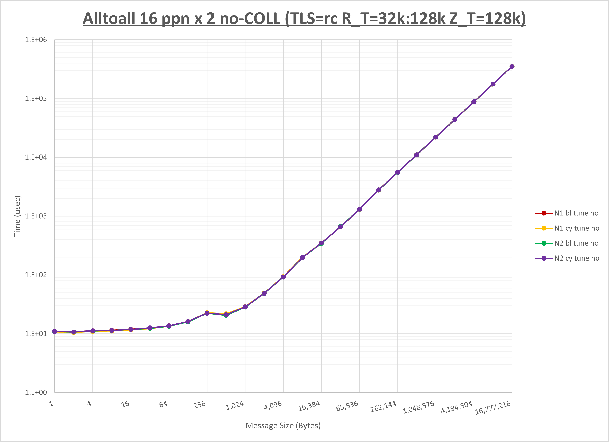


以上より、 **NPS** とMPIプロセス分割方法を下表の設定とした場合が最も性能が良いと判断してこれを固定、 

||No COLL|UCC|HCOLL|
|:---:|-:|-:|-:|
|**NPS**|2|2|1|
|MPIプロセス分割方法|ブロック分割|ブロック分割|ブロック分割|

集合通信コンポーネントを比較したものが以下のグラフです。  
ここでは、チューニングを全く適用しなかった場合と比較するため、全パラメータがデフォルトの組合せ（ **UCX_RNDV_THRESH=auto** ・ **UCX_ZCOPY_THRESH=auto** ・ **coll_hcoll_enable=1** ・ **coll_ucc_enable=0** ）を含めています。


以上の結果は、以下のように考察することが出来ます。

- **UCC** は512B未満で性能が向上しそれ以上で顕著な傾向無し
- **HCOLL** は512B未満で性能が向上しそれ以上で顕著な傾向無し
- **UCC** は **HCOLL** に対して64KB以下で概ね性能が低下
- チューニング未適用は2KBから32KBの間で大幅に性能が低下

### 2-2-2. Allgather

[ステップ1]

以下のグラフは、 **UCX_RNDV_THRESH** を変化させたときの **Allgather** の結果を、 **UCX_TLS** の設定値毎に示しています。  
ノード内の **UCX_RNDV_THRESH** の最適値は、 **[1-2-2 Allgather](#1-2-2-allgather)** の **HCOLL** の結果から32kbとしています。


以上より、 **UCX_RNDV_THRESH** を **intra:32kb,inter:128kb** とした場合が最も性能が良いと判断してこれを固定し、 **UCX_TLS** の各設定値を比較したものが以下のグラフです。


以上より、 **UCX_TLS** を **self,sm,rc** とした場合が最も性能が良いと判断してこれを固定します。

[ステップ2]

以下のグラフは、 **UCX_ZCOPY_THRESH** を変化させたときの **Allgather** の結果です。


以上より、 **UCX_ZCOPY_THRESH** を **128kb** とした場合が最も性能が良いと判断してこれを固定します。

[ステップ3]

以下のグラフは、**NPS** とMPIプロセス分割方法の各組合せを集合通信コンポーネント毎に比較したものです。


以上より、 **NPS** とMPIプロセス分割方法を下表の設定とした場合が最も性能が良いと判断してこれを固定、 

||No COLL|UCC|HCOLL|
|:---:|-:|-:|-:|
|**NPS**|1|2|2|
|MPIプロセス分割方法|サイクリック分割|ブロック分割|ブロック分割|

集合通信コンポーネントを比較したものが以下のグラフです。  
ここでは、チューニングを全く適用しなかった場合と比較するため、全パラメータがデフォルトの組合せ（ **UCX_RNDV_THRESH=auto** ・ **UCX_ZCOPY_THRESH=auto** ・ **coll_hcoll_enable=1** ・ **coll_ucc_enable=0** ）を含めています。


以上の結果は、以下のように考察することが出来ます。

- **UCC** は全域で性能が向上
- **HCOLL** はほぼ全域で性能が向上
- **UCC** は **HCOLL** に対して顕著な傾向無し
- チューニング適用による性能の変化無し

### 2-2-3. Allreduce

[ステップ1]

以下のグラフは、 **UCX_RNDV_THRESH** を変化させたときの **Allreduce** の結果を、 **UCX_TLS** の設定値毎に示しています。  
ノード内の **UCX_RNDV_THRESH** の最適値は、 **[1-2-3 Allreduce](#1-2-3-allreduce)** の **HCOLL** の結果から128kbとしています。


以上より、 **UCX_RNDV_THRESH** を **intra:128kb,inter:128kb** とした場合が最も性能が良いと判断してこれを固定し、 **UCX_TLS** の各設定値を比較したものが以下のグラフです。


以上より、 **UCX_TLS** を **self,sm,rc** とした場合が最も性能が良いと判断してこれを固定します。

[ステップ2]

以下のグラフは、 **UCX_ZCOPY_THRESH** を変化させたときの **Allreduce** の結果です。


以上より、 **UCX_ZCOPY_THRESH** を **128kb** とした場合が最も性能が良いと判断してこれを固定します。

[ステップ3]

以下のグラフは、**NPS** とMPIプロセス分割方法の各組合せを集合通信コンポーネント毎に比較したものです。


以上より、 **NPS** とMPIプロセス分割方法を下表の設定とした場合が最も性能が良いと判断してこれを固定、 

||No COLL|UCC|HCOLL|
|:---:|-:|-:|-:|
|**NPS**|2|2|2|
|MPIプロセス分割方法|サイクリック分割|サイクリック分割|サイクリック分割|

集合通信コンポーネントを比較したものが以下のグラフです。  
ここでは、チューニングを全く適用しなかった場合と比較するため、全パラメータがデフォルトの組合せ（ **UCX_RNDV_THRESH=auto** ・ **UCX_ZCOPY_THRESH=auto** ・ **coll_hcoll_enable=1** ・ **coll_ucc_enable=0** ）を含めています。


以上の結果は、以下のように考察することが出来ます。

- **UCC** は全域で性能が向上
- **HCOLL** は全域で性能が向上
- **UCC** は **HCOLL** に対して1MBから16MBで性能が低下し4KB以下で性能が向上
- チューニング未適用は32KBから16MBの間で大幅に性能が低下

## 2-3. ノード当たり32 MPIプロセス

### 2-3-0. 概要

本章は、2ノードにノード当たり32 MPIプロセスでトータル64 MPIプロセスを割当てる場合の最適な **実行時パラメータ** の組み合わせをMPI集合通信関数毎に検証し、その結果を考察します。

下表は、各MPI集合通信関数の最適な **UCX_TLS** 、 **UCX_RNDV_THRESH** 、及び **UCX_ZCOPY_THRESH** を示しており、この設定値を使用することでデフォルト値に対して性能が向上します。

| MPI集合通信関数     | UCX_TLS    | UCX_RNDV_THRESH         | UCX_ZCOPY_THRESH |
| :-----------: | :--------: | :---------------------: | :--------------: |
| **Alltoall**  | self,sm,rc | intra:16kb,inter:128kb  | 128kb            |
| **Allgather** | self,sm,rc | intra:16kb,inter:128kb  | 128kb            |
| **Allreduce** | self,sm,rc | intra:128kb,inter:128kb | 128kb            |

**HCOLL** / **UCC** / MPIプロセス分割方法 / **NPS** に関する傾向は、各MPI集合関数のセクションを参照ください。

### 2-3-1. Alltoall

[ステップ1]

以下のグラフは、 **UCX_RNDV_THRESH** を変化させたときの **Alltoall** の結果を、 **UCX_TLS** の設定値毎に示しています。  
ノード内の **UCX_RNDV_THRESH** の最適値は、 **[1-3-1 Alltoall](#1-3-1-alltoall)** の **HCOLL** の結果から16kbとしています。


以上より、 **UCX_RNDV_THRESH** を **intra:16kb,inter:128kb** とした場合が最も性能が良いと判断してこれを固定し、 **UCX_TLS** の各設定値を比較したものが以下のグラフです。


以上より、 **UCX_TLS** を **self,sm,rc** とした場合が最も性能が良いと判断してこれを固定します。

[ステップ2]

以下のグラフは、 **UCX_ZCOPY_THRESH** を変化させたときの **Alltoall** の結果です。


以上より、 **UCX_ZCOPY_THRESH** を **128kb** とした場合が最も性能が良いと判断してこれを固定します。

[ステップ3]

以下のグラフは、**NPS** とMPIプロセス分割方法の各組合せを集合通信コンポーネント毎に比較したものです。


以上より、 **NPS** とMPIプロセス分割方法を下表の設定とした場合が最も性能が良いと判断してこれを固定、 

||No COLL|UCC|HCOLL|
|:---:|-:|-:|-:|
|**NPS**|2|2|1|
|MPIプロセス分割方法|ブロック分割|ブロック分割|ブロック分割|

集合通信コンポーネントを比較したものが以下のグラフです。  
ここでは、チューニングを全く適用しなかった場合と比較するため、全パラメータがデフォルトの組合せ（ **UCX_RNDV_THRESH=auto** ・ **UCX_ZCOPY_THRESH=auto** ・ **coll_hcoll_enable=1** ・ **coll_ucc_enable=0** ）を含めています。

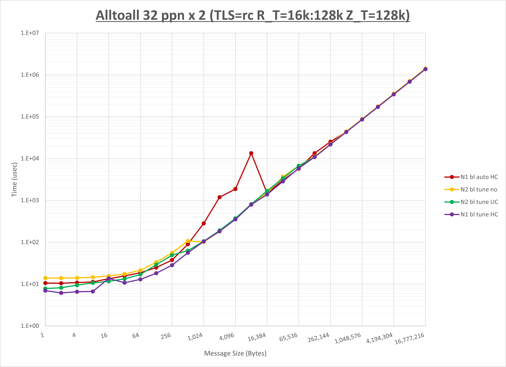

以上の結果は、以下のように考察することが出来ます。

- **UCC** は1KB未満で性能が向上しそれ以上で顕著な傾向無し
- **HCOLL** は1KB未満で性能が向上しそれ以上で顕著な傾向無し
- **UCC** は **HCOLL** に対して256B以下で概ね性能が低下
- チューニング未適用は8KB以下で性能が低下

### 2-3-2. Allgather

[ステップ1]

以下のグラフは、 **UCX_RNDV_THRESH** を変化させたときの **Allgather** の結果を、 **UCX_TLS** の設定値毎に示しています。  
ノード内の **UCX_RNDV_THRESH** の最適値は、 **[1-3-2 Allgather](#1-3-2-allgather)** の **HCOLL** の結果から16kbとしています。


以上より、 **UCX_RNDV_THRESH** を **intra:16kb,inter:128kb** とした場合が最も性能が良いと判断してこれを固定し、 **UCX_TLS** の各設定値を比較したものが以下のグラフです。


以上より、 **UCX_TLS** を **self,sm,rc** とした場合が最も性能が良いと判断してこれを固定します。

[ステップ2]

以下のグラフは、 **UCX_ZCOPY_THRESH** を変化させたときの **Allgather** の結果です。


以上より、 **UCX_ZCOPY_THRESH** を **128kb** とした場合が最も性能が良いと判断してこれを固定します。

[ステップ3]

以下のグラフは、**NPS** とMPIプロセス分割方法の各組合せを集合通信コンポーネント毎に比較したものです。


以上より、 **NPS** とMPIプロセス分割方法を下表の設定とした場合が最も性能が良いと判断してこれを固定、 

||No COLL|UCC|HCOLL|
|:---:|-:|-:|-:|
|**NPS**|2|2|2|
|MPIプロセス分割方法|ブロック分割|ブロック分割|ブロック分割|

集合通信コンポーネントを比較したものが以下のグラフです。  
ここでは、チューニングを全く適用しなかった場合と比較するため、全パラメータがデフォルトの組合せ（ **UCX_RNDV_THRESH=auto** ・ **UCX_ZCOPY_THRESH=auto** ・ **coll_hcoll_enable=1** ・ **coll_ucc_enable=0** ）を含めています。


以上の結果は、以下のように考察することが出来ます。

- **UCC** はほぼ全域で性能が向上
- **HCOLL** は全域で性能が向上
- **UCC** は **HCOLL** に対して1KBから4KBの間と16B以下で性能が向上し64Bから512Bの間で性能が低下
- チューニング未適用は32KB以下で性能が低下

### 2-3-3. Allreduce

[ステップ1]

以下のグラフは、 **UCX_RNDV_THRESH** を変化させたときの **Allreduce** の結果を、 **UCX_TLS** の設定値毎に示しています。  
ノード内の **UCX_RNDV_THRESH** の最適値は、 **[1-3-3 Allreduce](#1-3-3-allreduce)** の **HCOLL** の結果から128kbとしています。


以上より、 **UCX_RNDV_THRESH** を **intra:128kb,inter:128kb** とした場合が最も性能が良いと判断してこれを固定し、 **UCX_TLS** の各設定値を比較したものが以下のグラフです。


以上より、 **UCX_TLS** を **self,sm,rc** とした場合が最も性能が良いと判断してこれを固定します。

[ステップ2]

以下のグラフは、 **UCX_ZCOPY_THRESH** を変化させたときの **Allreduce** の結果です。


以上より、 **UCX_ZCOPY_THRESH** を **128kb** とした場合が最も性能が良いと判断してこれを固定します。

[ステップ3]

以下のグラフは、**NPS** とMPIプロセス分割方法の各組合せを集合通信コンポーネント毎に比較したものです。


以上より、 **NPS** とMPIプロセス分割方法を下表の設定とした場合が最も性能が良いと判断してこれを固定、 

||No COLL|UCC|HCOLL|
|:---:|-:|-:|-:|
|**NPS**|2|1|1|
|MPIプロセス分割方法|ブロック分割|ブロック分割|ブロック分割|

集合通信コンポーネントを比較したものが以下のグラフです。  
ここでは、チューニングを全く適用しなかった場合と比較するため、全パラメータがデフォルトの組合せ（ **UCX_RNDV_THRESH=auto** ・ **UCX_ZCOPY_THRESH=auto** ・ **coll_hcoll_enable=1** ・ **coll_ucc_enable=0** ）を含めています。


以上の結果は、以下のように考察することが出来ます。

- **UCC** はほぼ全域で性能が向上
- **HCOLL** は全域で性能が向上
- **UCC** は **HCOLL** に対して1MBから16MBまで性能が向上しそれ以上とそれ以下で概ね性能が低下
- チューニング未適用は16MB以下で大幅に性能が低下

## 2-4. ノード当たり36 MPIプロセス

### 2-4-0. 概要

本章は、2ノードにノード当たり36 MPIプロセスでトータル72 MPIプロセスを割当てる場合の最適な **実行時パラメータ** の組み合わせをMPI集合通信関数毎に検証し、その結果を考察します。

下表は、各MPI集合通信関数の最適な **UCX_TLS** 、 **UCX_RNDV_THRESH** 、及び **UCX_ZCOPY_THRESH** を示しており、この設定値を使用することでデフォルト値に対して性能が向上します。

| MPI集合通信関数     | UCX_TLS    | UCX_RNDV_THRESH         | UCX_ZCOPY_THRESH |
| :-----------: | :--------: | :---------------------: | :--------------: |
| **Alltoall**  | self,sm,rc | intra:16kb,inter:128kb  | 128kb            |
| **Allgather** | self,sm,rc | intra:16kb,inter:128kb  | 128kb            |
| **Allreduce** | self,sm,rc | intra:128kb,inter:128kb | 128kb            |

**HCOLL** / **UCC** / MPIプロセス分割方法 / **NPS** に関する傾向は、各MPI集合関数のセクションを参照ください。

### 2-4-1. Alltoall

[ステップ1]

以下のグラフは、 **UCX_RNDV_THRESH** を変化させたときの **Alltoall** の結果を、 **UCX_TLS** の設定値毎に示しています。  
ノード内の **UCX_RNDV_THRESH** の最適値は、 **[1-4-1 Alltoall](#1-4-1-alltoall)** の **HCOLL** の結果から16kbとしています。


以上より、 **UCX_RNDV_THRESH** を **intra:16kb,inter:128kb** とした場合が最も性能が良いと判断してこれを固定し、 **UCX_TLS** の各設定値を比較したものが以下のグラフです。


以上より、 **UCX_TLS** を **self,sm,rc** とした場合が最も性能が良いと判断してこれを固定します。

[ステップ2]

以下のグラフは、 **UCX_ZCOPY_THRESH** を変化させたときの **Alltoall** の結果です。


以上より、 **UCX_ZCOPY_THRESH** を **128kb** とした場合が最も性能が良いと判断してこれを固定します。

[ステップ3]

以下のグラフは、**NPS** とMPIプロセス分割方法の各組合せを集合通信コンポーネント毎に比較したものです。


以上より、 **NPS** とMPIプロセス分割方法を下表の設定とした場合が最も性能が良いと判断してこれを固定、 

||No COLL|UCC|HCOLL|
|:---:|-:|-:|-:|
|**NPS**|2|2|2|
|MPIプロセス分割方法|サイクリック分割|ブロック分割|ブロック分割|

集合通信コンポーネントを比較したものが以下のグラフです。  
ここでは、チューニングを全く適用しなかった場合と比較するため、全パラメータがデフォルトの組合せ（ **UCX_RNDV_THRESH=auto** ・ **UCX_ZCOPY_THRESH=auto** ・ **coll_hcoll_enable=1** ・ **coll_ucc_enable=0** ）を含めています。


以上の結果は、以下のように考察することが出来ます。

- **UCC** は512B以下で性能が向上
- **HCOLL** は512B以下で性能が向上
- **UCC** は **HCOLL** に対して512B以下で概ね性能が低下
- チューニング未適用は256KB以下で性能が低下

### 2-4-2. Allgather

[ステップ1]

以下のグラフは、 **UCX_RNDV_THRESH** を変化させたときの **Allgather** の結果を、 **UCX_TLS** の設定値毎に示しています。  
ノード内の **UCX_RNDV_THRESH** の最適値は、 **[1-4-2 Allgather](#1-4-2-allgather)** の **HCOLL** の結果から16kbとしています。


以上より、 **UCX_RNDV_THRESH** を **intra:16kb,inter:128kb** とした場合が最も性能が良いと判断してこれを固定し、 **UCX_TLS** の各設定値を比較したものが以下のグラフです。


以上より、 **UCX_TLS** を **self,sm,rc** とした場合が最も性能が良いと判断してこれを固定します。

[ステップ2]

以下のグラフは、 **UCX_ZCOPY_THRESH** を変化させたときの **Allgather** の結果です。


以上より、 **UCX_ZCOPY_THRESH** を **128kb** とした場合が最も性能が良いと判断してこれを固定します。

[ステップ3]

以下のグラフは、**NPS** とMPIプロセス分割方法の各組合せを集合通信コンポーネント毎に比較したものです。


以上より、 **NPS** とMPIプロセス分割方法を下表の設定とした場合が最も性能が良いと判断してこれを固定、 

||No COLL|UCC|HCOLL|
|:---:|-:|-:|-:|
|**NPS**|1|2|2|
|MPIプロセス分割方法|ブロック分割|ブロック分割|ブロック分割|

集合通信コンポーネントを比較したものが以下のグラフです。  
ここでは、チューニングを全く適用しなかった場合と比較するため、全パラメータがデフォルトの組合せ（ **UCX_RNDV_THRESH=auto** ・ **UCX_ZCOPY_THRESH=auto** ・ **coll_hcoll_enable=1** ・ **coll_ucc_enable=0** ）を含めています。


以上の結果は、以下のように考察することが出来ます。

- **UCC** はほぼ全域で性能が向上
- **HCOLL** は全域で性能が向上
- **UCC** は **HCOLL** に対して1KBから4KBの間で性能が向上し64Bから512Bの間で性能が低下
- チューニング未適用は16KB以下で性能が低下

### 2-4-3. Allreduce

[ステップ1]

以下のグラフは、 **UCX_RNDV_THRESH** を変化させたときの **Allreduce** の結果を、 **UCX_TLS** の設定値毎に示しています。  
ノード内の **UCX_RNDV_THRESH** の最適値は、 **[1-4-3 Allreduce](#1-4-3-allreduce)** の **HCOLL** の結果から128kbとしています。


以上より、 **UCX_RNDV_THRESH** を **intra:128kb,inter:128kb** とした場合が最も性能が良いと判断してこれを固定し、 **UCX_TLS** の各設定値を比較したものが以下のグラフです。


以上より、 **UCX_TLS** を **self,sm,rc** とした場合が最も性能が良いと判断してこれを固定します。

[ステップ2]

以下のグラフは、 **UCX_ZCOPY_THRESH** を変化させたときの **Allreduce** の結果です。


以上より、 **UCX_ZCOPY_THRESH** を **128kb** とした場合が最も性能が良いと判断してこれを固定します。

[ステップ3]

以下のグラフは、**NPS** とMPIプロセス分割方法の各組合せを集合通信コンポーネント毎に比較したものです。


以上より、 **NPS** とMPIプロセス分割方法を下表の設定とした場合が最も性能が良いと判断してこれを固定、 

||No COLL|UCC|HCOLL|
|:---:|-:|-:|-:|
|**NPS**|2|1|1|
|MPIプロセス分割方法|ブロック分割|ブロック分割|ブロック分割|

集合通信コンポーネントを比較したものが以下のグラフです。  
ここでは、チューニングを全く適用しなかった場合と比較するため、全パラメータがデフォルトの組合せ（ **UCX_RNDV_THRESH=auto** ・ **UCX_ZCOPY_THRESH=auto** ・ **coll_hcoll_enable=1** ・ **coll_ucc_enable=0** ）を含めています。


以上の結果は、以下のように考察することが出来ます。

- **UCC** は全域で性能が向上
- **HCOLL** は全域で性能が向上
- **UCC** は **HCOLL** に対して8KB以上で概ね性能が向上しそれ未満で性能が低下
- チューニング未適用は64MB以下で大幅に性能が低下

# 3.  4ノード

## 3-0. 概要

本章は、4ノードにノード当たり8・16・32・36の各MPIプロセス、トータルで32・64・128・144の各MPIプロセスを割当てる場合の各MPI集合通信関数の通信性能について、以下の **実行時パラメータ** の最適な組み合わせを検証します。

- **UCX_TLS** ： **all** ・ **self,sm,rc** ・ **self,sm,ud** ・ **self,sm,dc**
- **UCX_RNDV_THRESH** ： **auto** ・ **4kb** ・ **8kb** ・ **16kb** ・ **32kb** ・ **64kb** ・ **128kb** （※14）
- **UCX_ZCOPY_THRESH** ： **auto** ・ **4kb** ・ **8kb** ・ **16kb** ・ **32kb** ・ **64kb** ・ **128kb**
- **coll_hcoll_enable** ： **0** ・ **1**
- **coll_ucc_enable** ： **0** ・ **1**
- MPIプロセス分割方法 ： ブロック分割・サイクリック分割
- **NPS** ：  **1** ・ **2**

※14） **UCX_RNDV_THRESH** は、ノード内は **auto** と **[1. 1ノード](#1--1ノード)** で判明した最適値、ノード間はここに記載の7種類を使用し、以下8個の組合せを検証します。

- **intra:auto,inter:auto**
- **intra:optimal_value,inter:auto**
- **intra:optimal_value,inter:4kb**
- **intra:optimal_value,inter:8kb**
- **intra:optimal_value,inter:16kb**
- **intra:optimal_value,inter:32kb**
- **intra:optimal_value,inter:64kb**
- **intra:optimal_value,inter:128kb**

ここで、全ての **実行時パラメータ** の組み合わせを検証することは非現実的なため、組み合わせを減らす目的で以下3ステップに分けて検証を行います。

- ステップ1
    - **UCX_TLS** と **UCX_RNDV_THRESH** を組合せた32個のパターンを検証してこれらの最適値を決定
    - **coll_hcoll_enable** は **1** に固定（デフォルト）
    - **coll_ucc_enable** は **0** に固定（デフォルト）
    - MPIプロセス分割方法はブロック分割に固定
    - **NPS** は **NPS1** に固定
- ステップ2
    - **UCX_ZCOPY_THRESH** の7パターンを検証してこの最適値を決定
    - **UCX_TLS** と **UCX_RNDV_THRESH** はステップ1で決定した最適値を使用
    - **coll_hcoll_enable** は **1** に固定（デフォルト）
    - **coll_ucc_enable** は **0** に固定（デフォルト）
    - MPIプロセス分割方法はブロック分割に固定
    - **NPS** は **NPS1** に固定
- ステップ3
    - **coll_hcoll_enable** / **coll_ucc_enable** / MPIプロセス分割方法 / **NPS** を組合せた12パターンを検証してこれらの最適値を決定
    - **UCX_TLS** と **UCX_RNDV_THRESH** はステップ1で決定した最適値を使用
    - **UCX_ZCOPY_THRESH** はステップ2で決定した最適値を使用

## 3-1. ノード当たり8 MPIプロセス

### 3-1-0. 概要

本章は、4ノードにノード当たり8 MPIプロセスでトータル32 MPIプロセスを割当てる場合の最適な **実行時パラメータ** の組み合わせをMPI集合通信関数毎に検証し、その結果を考察します。

下表は、各MPI集合通信関数の最適な **UCX_TLS** 、 **UCX_RNDV_THRESH** 、及び **UCX_ZCOPY_THRESH** を示しており、この設定値を使用することでデフォルト値に対して性能が向上します。

| MPI集合通信関数     | UCX_TLS    | UCX_RNDV_THRESH         | UCX_ZCOPY_THRESH |
| :-----------: | :--------: | :---------------------: | :--------------: |
| **Alltoall**  | self,sm,ud | intra:32kb,inter:128kb  | 128kb            |
| **Allgather** | self,sm,rc | intra:64kb,inter:128kb  | 128kb            |
| **Allreduce** | self,sm,rc | intra:128kb,inter:128kb | 128kb            |

**HCOLL** / **UCC** / MPIプロセス分割方法 / **NPS** に関する傾向は、各MPI集合関数のセクションを参照ください。

### 3-1-1. Alltoall

[ステップ1]

以下のグラフは、 **UCX_RNDV_THRESH** を変化させたときの **Alltoall** の結果を、 **UCX_TLS** の設定値毎に示しています。  
ノード内の **UCX_RNDV_THRESH** の最適値は、 **[1-1-1 Alltoall](#1-1-1-alltoall)** の **HCOLL** の結果から32kbとしています。


以上より、 **UCX_RNDV_THRESH** を **intra:32kb,inter:128kb** とした場合が最も性能が良いと判断してこれを固定し、 **UCX_TLS** の各設定値を比較したものが以下のグラフです。


以上より、 **UCX_TLS** を **self,sm,ud** とした場合が最も性能が良いと判断してこれを固定します。

[ステップ2]

以下のグラフは、 **UCX_ZCOPY_THRESH** を変化させたときの **Alltoall** の結果です。


以上より、 **UCX_ZCOPY_THRESH** を **128kb** とした場合が最も性能が良いと判断してこれを固定します。

[ステップ3]

以下のグラフは、**NPS** とMPIプロセス分割方法の各組合せを集合通信コンポーネント毎に比較したものです。


以上より、 **NPS** とMPIプロセス分割方法を下表の設定とした場合が最も性能が良いと判断してこれを固定、 

||No COLL|UCC|HCOLL|
|:---:|-:|-:|-:|
|**NPS**|2|2|2|
|MPIプロセス分割方法|ブロック分割|ブロック分割|サイクリック分割|

集合通信コンポーネントを比較したものが以下のグラフです。  
ここでは、チューニングを全く適用しなかった場合と比較するため、全パラメータがデフォルトの組合せ（ **UCX_RNDV_THRESH=auto** ・ **UCX_ZCOPY_THRESH=auto** ・ **coll_hcoll_enable=1** ・ **coll_ucc_enable=0** ）を含めています。


以上の結果は、以下のように考察することが出来ます。

- **UCC** は2KBから64KBの間で性能が低下し256B以下で性能が向上
- **HCOLL** は512Bから32KBの間で性能が低下しそれ未満で性能が向上
- **UCC** は **HCOLL** に対して128B以下で概ね性能が低下
- チューニング未適用は2KB以上で性能が低下

### 3-1-2. Allgather

[ステップ1]

以下のグラフは、 **UCX_RNDV_THRESH** を変化させたときの **Allgather** の結果を、 **UCX_TLS** の設定値毎に示しています。  
ノード内の **UCX_RNDV_THRESH** の最適値は、 **[1-1-2 Allgather](#1-1-2-allgather)** の **HCOLL** の結果から64kbとしています。


以上より、 **UCX_RNDV_THRESH** を **intra:64kb,inter:128kb** とした場合が最も性能が良いと判断してこれを固定し、 **UCX_TLS** の各設定値を比較したものが以下のグラフです。


以上より、 **UCX_TLS** を **self,sm,rc** とした場合が最も性能が良いと判断してこれを固定します。

[ステップ2]

以下のグラフは、 **UCX_ZCOPY_THRESH** を変化させたときの **Allgather** の結果です。


以上より、 **UCX_ZCOPY_THRESH** を **128kb** とした場合が最も性能が良いと判断してこれを固定します。

[ステップ3]

以下のグラフは、**NPS** とMPIプロセス分割方法の各組合せを集合通信コンポーネント毎に比較したものです。


以上より、 **NPS** とMPIプロセス分割方法を下表の設定とした場合が最も性能が良いと判断してこれを固定、 

||No COLL|UCC|HCOLL|
|:---:|-:|-:|-:|
|**NPS**|2|2|2|
|MPIプロセス分割方法|サイクリック分割|ブロック分割|サイクリック分割|

集合通信コンポーネントを比較したものが以下のグラフです。  
ここでは、チューニングを全く適用しなかった場合と比較するため、全パラメータがデフォルトの組合せ（ **UCX_RNDV_THRESH=auto** ・ **UCX_ZCOPY_THRESH=auto** ・ **coll_hcoll_enable=1** ・ **coll_ucc_enable=0** ）を含めています。


以上の結果は、以下のように考察することが出来ます。

- **UCC** はほぼ全域で性能が向上
- **HCOLL** はほぼ全域で性能が向上
- **UCC** は **HCOLL** に対して128Bから1KBの間で性能が低下し2KBと8KBの間と64B以下で性能が向上
- チューニング適用による性能の変化無し

### 3-1-3. Allreduce

[ステップ1]

以下のグラフは、 **UCX_RNDV_THRESH** を変化させたときの **Allreduce** の結果を、 **UCX_TLS** の設定値毎に示しています。  
ノード内の **UCX_RNDV_THRESH** の最適値は、 **[1-1-3 Allreduce](#1-1-3-allreduce)** の **HCOLL** の結果から128kbとしています。


以上より、 **UCX_RNDV_THRESH** を **intra:128kb,inter:128kb** とした場合が最も性能が良いと判断してこれを固定し、 **UCX_TLS** の各設定値を比較したものが以下のグラフです。


以上より、 **UCX_TLS** を **self,sm,rc** とした場合が最も性能が良いと判断してこれを固定します。

[ステップ2]

以下のグラフは、 **UCX_ZCOPY_THRESH** を変化させたときの **Allreduce** の結果です。


以上より、 **UCX_ZCOPY_THRESH** を **128kb** とした場合が最も性能が良いと判断してこれを固定します。

[ステップ3]

以下のグラフは、**NPS** とMPIプロセス分割方法の各組合せを集合通信コンポーネント毎に比較したものです。


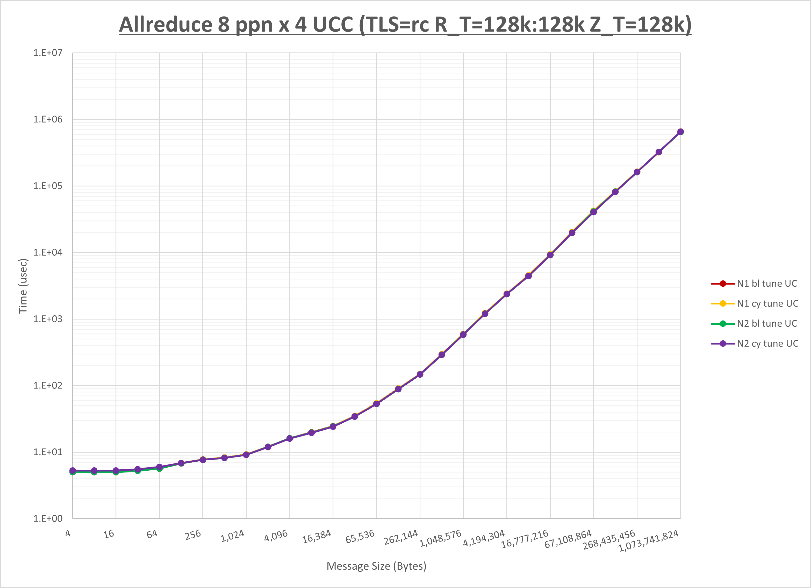


以上より、 **NPS** とMPIプロセス分割方法を下表の設定とした場合が最も性能が良いと判断してこれを固定、 

||No COLL|UCC|HCOLL|
|:---:|-:|-:|-:|
|**NPS**|1|2|1|
|MPIプロセス分割方法|ブロック分割|ブロック分割|ブロック分割|

集合通信コンポーネントを比較したものが以下のグラフです。  
ここでは、チューニングを全く適用しなかった場合と比較するため、全パラメータがデフォルトの組合せ（ **UCX_RNDV_THRESH=auto** ・ **UCX_ZCOPY_THRESH=auto** ・ **coll_hcoll_enable=1** ・ **coll_ucc_enable=0** ）を含めています。


以上の結果は、以下のように考察することが出来ます。

- **UCC** は全域で性能が向上
- **HCOLL** は全域で性能が向上
- **UCC** は **HCOLL** に対して128Bから4KBで性能が低下
- チューニング未適用は32KBから16MBの間で大幅に性能が低下

## 3-2. ノード当たり16 MPIプロセス

### 3-2-0. 概要

本章は、4ノードにノード当たり16 MPIプロセスでトータル64 MPIプロセスを割当てる場合の最適な **実行時パラメータ** の組み合わせをMPI集合通信関数毎に検証し、その結果を考察します。

下表は、各MPI集合通信関数の最適な **UCX_TLS** 、 **UCX_RNDV_THRESH** 、及び **UCX_ZCOPY_THRESH** を示しており、この設定値を使用することでデフォルト値に対して性能が向上します。

| MPI集合通信関数     | UCX_TLS    | UCX_RNDV_THRESH         | UCX_ZCOPY_THRESH |
| :-----------: | :--------: | :---------------------: | :--------------: |
| **Alltoall**  | self,sm,ud | intra:32kb,inter:32kb  | 128kb            |
| **Allgather** | self,sm,rc | intra:32kb,inter:128kb  | 128kb            |
| **Allreduce** | self,sm,rc | intra:128kb,inter:128kb | 128kb            |

**HCOLL** / **UCC** / MPIプロセス分割方法 / **NPS** に関する傾向は、各MPI集合関数のセクションを参照ください。

### 3-2-1. Alltoall

[ステップ1]

以下のグラフは、 **UCX_RNDV_THRESH** を変化させたときの **Alltoall** の結果を、 **UCX_TLS** の設定値毎に示しています。  
ノード内の **UCX_RNDV_THRESH** の最適値は、 **[1-2-1 Alltoall](#1-2-1-alltoall)** の **HCOLL** の結果から32kbとしています。


以上より、 **UCX_RNDV_THRESH** を **intra:32kb,inter:32kb** とした場合が最も性能が良いと判断してこれを固定し、 **UCX_TLS** の各設定値を比較したものが以下のグラフです。


以上より、 **UCX_TLS** を **self,sm,ud** とした場合が最も性能が良いと判断してこれを固定します。

[ステップ2]

以下のグラフは、 **UCX_ZCOPY_THRESH** を変化させたときの **Alltoall** の結果です。


以上より、 **UCX_ZCOPY_THRESH** を **128kb** とした場合が最も性能が良いと判断してこれを固定します。

[ステップ3]

以下のグラフは、**NPS** とMPIプロセス分割方法の各組合せを集合通信コンポーネント毎に比較したものです。


以上より、 **NPS** とMPIプロセス分割方法を下表の設定とした場合が最も性能が良いと判断してこれを固定、 

||No COLL|UCC|HCOLL|
|:---:|-:|-:|-:|
|**NPS**|2|2|2|
|MPIプロセス分割方法|ブロック分割|ブロック分割|ブロック分割|

集合通信コンポーネントを比較したものが以下のグラフです。  
ここでは、チューニングを全く適用しなかった場合と比較するため、全パラメータがデフォルトの組合せ（ **UCX_RNDV_THRESH=auto** ・ **UCX_ZCOPY_THRESH=auto** ・ **coll_hcoll_enable=1** ・ **coll_ucc_enable=0** ）を含めています。


以上の結果は、以下のように考察することが出来ます。

- **UCC** は1KB以下で性能が向上
- **HCOLL** は1KB以下で性能が向上
- **UCC** は **HCOLL** に対して256B以下で概ね性能が低下
- チューニング未適用は64KB以下で概ね性能が低下

### 3-2-2. Allgather

[ステップ1]

以下のグラフは、 **UCX_RNDV_THRESH** を変化させたときの **Allgather** の結果を、 **UCX_TLS** の設定値毎に示しています。  
ノード内の **UCX_RNDV_THRESH** の最適値は、 **[1-2-2 Allgather](#1-2-2-allgather)** の **HCOLL** の結果から32kbとしています。


以上より、 **UCX_RNDV_THRESH** を **intra:32kb,inter:128kb** とした場合が最も性能が良いと判断してこれを固定し、 **UCX_TLS** の各設定値を比較したものが以下のグラフです。

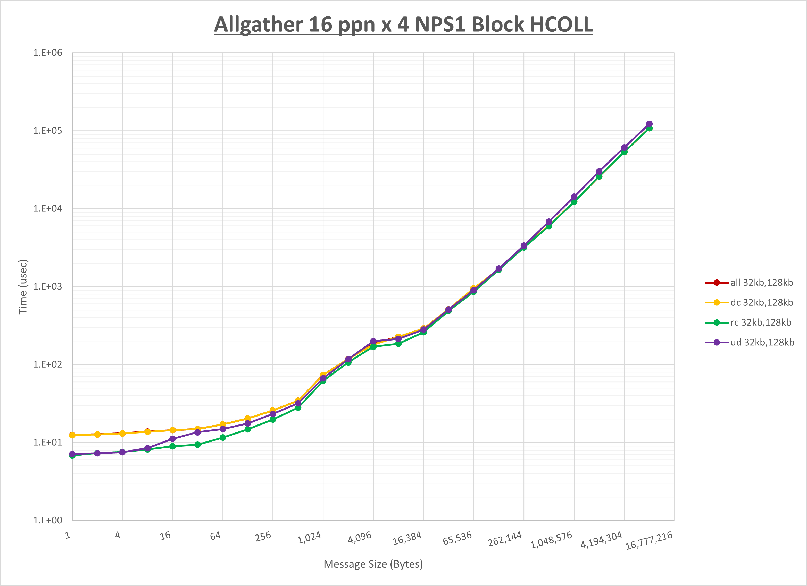

以上より、 **UCX_TLS** を **self,sm,rc** とした場合が最も性能が良いと判断してこれを固定します。

[ステップ2]

以下のグラフは、 **UCX_ZCOPY_THRESH** を変化させたときの **Allgather** の結果です。


以上より、 **UCX_ZCOPY_THRESH** を **128kb** とした場合が最も性能が良いと判断してこれを固定します。

[ステップ3]

以下のグラフは、**NPS** とMPIプロセス分割方法の各組合せを集合通信コンポーネント毎に比較したものです。


以上より、 **NPS** とMPIプロセス分割方法を下表の設定とした場合が最も性能が良いと判断してこれを固定、 

||No COLL|UCC|HCOLL|
|:---:|-:|-:|-:|
|**NPS**|1|2|2|
|MPIプロセス分割方法|サイクリック分割|サイクリック分割|ブロック分割|

集合通信コンポーネントを比較したものが以下のグラフです。  
ここでは、チューニングを全く適用しなかった場合と比較するため、全パラメータがデフォルトの組合せ（ **UCX_RNDV_THRESH=auto** ・ **UCX_ZCOPY_THRESH=auto** ・ **coll_hcoll_enable=1** ・ **coll_ucc_enable=0** ）を含めています。


以上の結果は、以下のように考察することが出来ます。

- **UCC** はほぼ全域で性能が向上
- **HCOLL** は全域で性能が向上
- **UCC** は **HCOLL** に対して64Bから512Bの間で性能が低下し16B以下で性能が向上
- チューニング未適用は128KB以下で性能が低下

### 3-2-3. Allreduce

[ステップ1]

以下のグラフは、 **UCX_RNDV_THRESH** を変化させたときの **Allreduce** の結果を、 **UCX_TLS** の設定値毎に示しています。  
ノード内の **UCX_RNDV_THRESH** の最適値は、 **[1-2-3 Allreduce](#1-2-3-allreduce)** の **HCOLL** の結果から128kbとしています。


以上より、 **UCX_RNDV_THRESH** を **intra:128kb,inter:128kb** とした場合が最も性能が良いと判断してこれを固定し、 **UCX_TLS** の各設定値を比較したものが以下のグラフです。

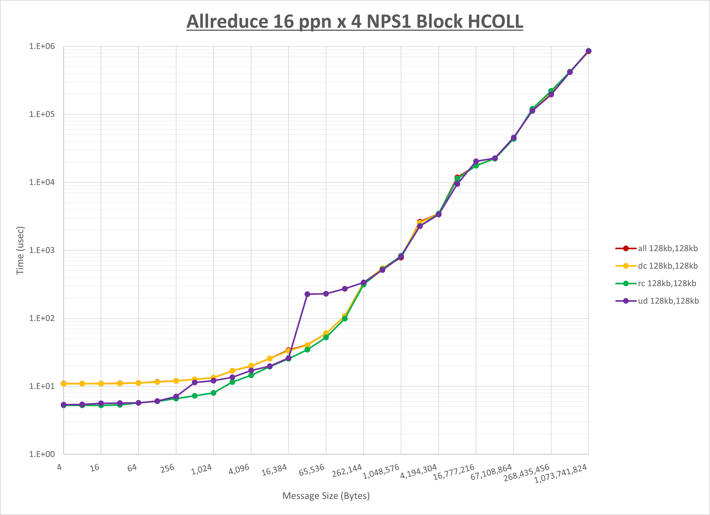

以上より、 **UCX_TLS** を **self,sm,rc** とした場合が最も性能が良いと判断してこれを固定します。

[ステップ2]

以下のグラフは、 **UCX_ZCOPY_THRESH** を変化させたときの **Allreduce** の結果です。


以上より、 **UCX_ZCOPY_THRESH** を **128kb** とした場合が最も性能が良いと判断してこれを固定します。

[ステップ3]

以下のグラフは、**NPS** とMPIプロセス分割方法の各組合せを集合通信コンポーネント毎に比較したものです。


以上より、 **NPS** とMPIプロセス分割方法を下表の設定とした場合が最も性能が良いと判断してこれを固定、 

||No COLL|UCC|HCOLL|
|:---:|-:|-:|-:|
|**NPS**|2|2|1|
|MPIプロセス分割方法|サイクリック分割|サイクリック分割|サイクリック分割|

集合通信コンポーネントを比較したものが以下のグラフです。  
ここでは、チューニングを全く適用しなかった場合と比較するため、全パラメータがデフォルトの組合せ（ **UCX_RNDV_THRESH=auto** ・ **UCX_ZCOPY_THRESH=auto** ・ **coll_hcoll_enable=1** ・ **coll_ucc_enable=0** ）を含めています。


以上の結果は、以下のように考察することが出来ます。

- **UCC** は全域で性能が向上
- **HCOLL** は全域で性能が向上
- **UCC** は **HCOLL** に対して2MBから16MBの間で性能が向上し128Bから4KBの間で性能が低下
- チューニング未適用は16MB以下で大幅に性能が低下

## 3-3. ノード当たり32 MPIプロセス

### 3-3-0. 概要

本章は、4ノードにノード当たり32 MPIプロセスでトータル128 MPIプロセスを割当てる場合の最適な **実行時パラメータ** の組み合わせをMPI集合通信関数毎に検証し、その結果を考察します。

下表は、各MPI集合通信関数の最適な **UCX_TLS** 、 **UCX_RNDV_THRESH** 、及び **UCX_ZCOPY_THRESH** を示しており、この設定値を使用することでデフォルト値に対して性能が向上します。

| MPI集合通信関数     | UCX_TLS    | UCX_RNDV_THRESH         | UCX_ZCOPY_THRESH |
| :-----------: | :--------: | :---------------------: | :--------------: |
| **Alltoall**  | self,sm,ud | intra:16kb,inter:128kb  | 128kb            |
| **Allgather** | self,sm,rc | intra:16kb,inter:128kb  | 128kb            |
| **Allreduce** | self,sm,rc | intra:128kb,inter:128kb | 128kb            |

**HCOLL** / **UCC** / MPIプロセス分割方法 / **NPS** に関する傾向は、各MPI集合関数のセクションを参照ください。

### 3-3-1. Alltoall

[ステップ1]

以下のグラフは、 **UCX_RNDV_THRESH** を変化させたときの **Alltoall** の結果を、 **UCX_TLS** の設定値毎に示しています。  
ノード内の **UCX_RNDV_THRESH** の最適値は、 **[1-3-1 Alltoall](#1-3-1-alltoall)** の結果から16kbとしています。


以上より、 **UCX_RNDV_THRESH** を **intra:16kb,inter:128kb** とした場合が最も性能が良いと判断してこれを固定し、 **UCX_TLS** の各設定値を比較したものが以下のグラフです。


以上より、 **UCX_TLS** を **self,sm,ud** とした場合が最も性能が良いと判断してこれを固定します。

[ステップ2]

以下のグラフは、 **UCX_ZCOPY_THRESH** を変化させたときの **Alltoall** の結果です。


以上より、 **UCX_ZCOPY_THRESH** を **128kb** とした場合が最も性能が良いと判断してこれを固定します。

[ステップ3]

以下のグラフは、**NPS** とMPIプロセス分割方法の各組合せを集合通信コンポーネント毎に比較したものです。


以上より、 **NPS** とMPIプロセス分割方法を下表の設定とした場合が最も性能が良いと判断してこれを固定、 

||No COLL|UCC|HCOLL|
|:---:|-:|-:|-:|
|**NPS**|2|1|1|
|MPIプロセス分割方法|サイクリック分割|ブロック分割|サイクリック分割|

集合通信コンポーネントを比較したものが以下のグラフです。  
ここでは、チューニングを全く適用しなかった場合と比較するため、全パラメータがデフォルトの組合せ（ **UCX_RNDV_THRESH=auto** ・ **UCX_ZCOPY_THRESH=auto** ・ **coll_hcoll_enable=1** ・ **coll_ucc_enable=0** ）を含めています。


以上の結果は、以下のように考察することが出来ます。

- **UCC** は512B以下で性能が向上
- **HCOLL** は256B以下で性能が向上
- **UCC** は **HCOLL** に対して顕著な傾向無し
- チューニング未適用は8KB以下で性能が大幅に低下

### 3-3-2. Allgather

[ステップ1]

以下のグラフは、 **UCX_RNDV_THRESH** を変化させたときの **Allgather** の結果を、 **UCX_TLS** の設定値毎に示しています。  
ノード内の **UCX_RNDV_THRESH** の最適値は、 **[1-3-2 Allgather](#1-3-2-allgather)** の結果から16kbとしています。


以上より、 **UCX_RNDV_THRESH** を **intra:16kb,inter:128kb** とした場合が最も性能が良いと判断してこれを固定し、 **UCX_TLS** の各設定値を比較したものが以下のグラフです。


以上より、 **UCX_TLS** を **self,sm,rc** とした場合が最も性能が良いと判断してこれを固定します。

[ステップ2]

以下のグラフは、 **UCX_ZCOPY_THRESH** を変化させたときの **Allgather** の結果です。


以上より、 **UCX_ZCOPY_THRESH** を **128kb** とした場合が最も性能が良いと判断してこれを固定します。

[ステップ3]

以下のグラフは、**NPS** とMPIプロセス分割方法の各組合せを集合通信コンポーネント毎に比較したものです。


以上より、 **NPS** とMPIプロセス分割方法を下表の設定とした場合が最も性能が良いと判断してこれを固定、 

||No COLL|UCC|HCOLL|
|:---:|-:|-:|-:|
|**NPS**|2|2|2|
|MPIプロセス分割方法|ブロック分割|ブロック分割|ブロック分割|

集合通信コンポーネントを比較したものが以下のグラフです。  
ここでは、チューニングを全く適用しなかった場合と比較するため、全パラメータがデフォルトの組合せ（ **UCX_RNDV_THRESH=auto** ・ **UCX_ZCOPY_THRESH=auto** ・ **coll_hcoll_enable=1** ・ **coll_ucc_enable=0** ）を含めています。


以上の結果は、以下のように考察することが出来ます。

- **UCC** はほぼ全域で性能が向上
- **HCOLL** はほぼ全域で性能が向上
- **UCC** は **HCOLL** に対して32Bから512Bの間で性能が低下
- チューニング未適用は16KB以下で性能が低下

### 3-3-3. Allreduce

[ステップ1]

以下のグラフは、 **UCX_RNDV_THRESH** を変化させたときの **Allreduce** の結果を、 **UCX_TLS** の設定値毎に示しています。  
ノード内の **UCX_RNDV_THRESH** の最適値は、 **[1-3-3 Allreduce](#1-3-3-allreduce)** の結果から128kbとしています。


以上より、 **UCX_RNDV_THRESH** を **intra:128kb,inter:128kb** とした場合が最も性能が良いと判断してこれを固定し、 **UCX_TLS** の各設定値を比較したものが以下のグラフです。


以上より、 **UCX_TLS** を **self,sm,rc** とした場合が最も性能が良いと判断してこれを固定します。

[ステップ2]

以下のグラフは、 **UCX_ZCOPY_THRESH** を変化させたときの **Allreduce** の結果です。


以上より、 **UCX_ZCOPY_THRESH** を **128kb** とした場合が最も性能が良いと判断してこれを固定します。

[ステップ3]

以下のグラフは、**NPS** とMPIプロセス分割方法の各組合せを集合通信コンポーネント毎に比較したものです。


以上より、 **NPS** とMPIプロセス分割方法を下表の設定とした場合が最も性能が良いと判断してこれを固定、 

||No COLL|UCC|HCOLL|
|:---:|-:|-:|-:|
|**NPS**|2|1|1|
|MPIプロセス分割方法|ブロック分割|ブロック分割|サイクリック分割|

集合通信コンポーネントを比較したものが以下のグラフです。  
ここでは、チューニングを全く適用しなかった場合と比較するため、全パラメータがデフォルトの組合せ（ **UCX_RNDV_THRESH=auto** ・ **UCX_ZCOPY_THRESH=auto** ・ **coll_hcoll_enable=1** ・ **coll_ucc_enable=0** ）を含めています。

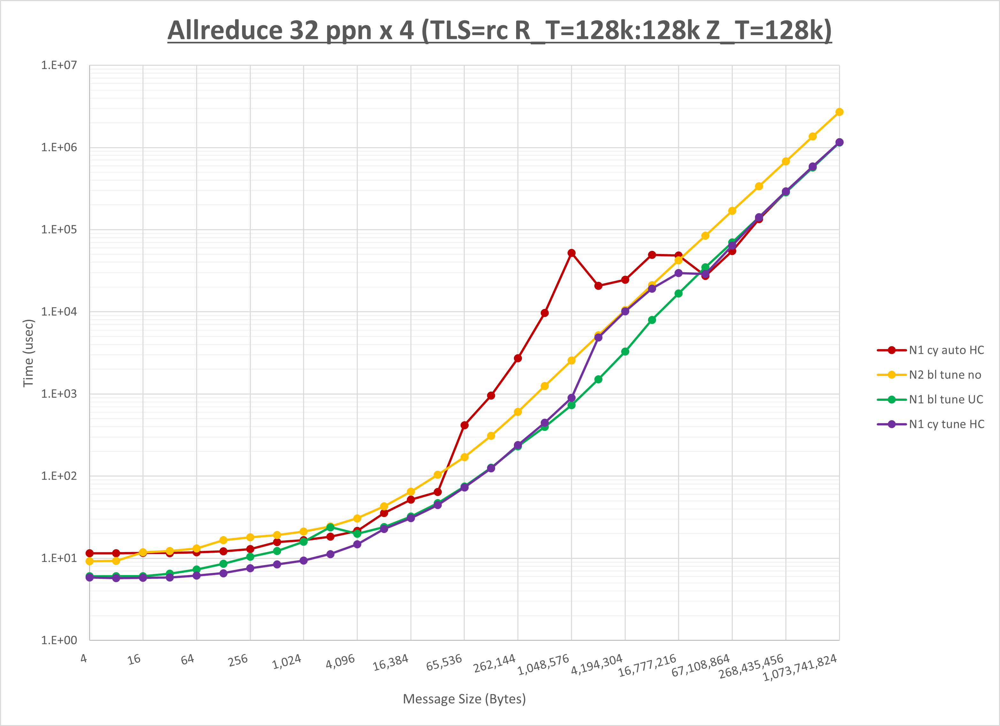

以上の結果は、以下のように考察することが出来ます。

- **UCC** は全域で性能が向上
- **HCOLL** は全域で性能が向上
- **UCC** は **HCOLL** に対して512KBから16MBまで性能が向上し4KB以下で性能が低下
- チューニング未適用は16MB以下で大幅に性能が低下

## 3-4. ノード当たり36 MPIプロセス

### 3-4-0. 概要

本章は、4ノードにノード当たり36 MPIプロセスでトータル144 MPIプロセスを割当てる場合の最適な **実行時パラメータ** の組み合わせをMPI集合通信関数毎に検証し、その結果を考察します。

下表は、各MPI集合通信関数の最適な **UCX_TLS** 、 **UCX_RNDV_THRESH** 、及び **UCX_ZCOPY_THRESH** を示しており、この設定値を使用することでデフォルト値に対して性能が向上します。

| MPI集合通信関数     | UCX_TLS    | UCX_RNDV_THRESH         | UCX_ZCOPY_THRESH |
| :-----------: | :--------: | :---------------------: | :--------------: |
| **Alltoall**  | self,sm,ud | intra:16kb,inter:128kb  | 128kb            |
| **Allgather** | self,sm,rc | intra:16kb,inter:128kb  | 128kb            |
| **Allreduce** | self,sm,rc | intra:128kb,inter:128kb | 128kb            |

**HCOLL** / **UCC** / MPIプロセス分割方法 / **NPS** に関する傾向は、各MPI集合関数のセクションを参照ください。

### 3-4-1. Alltoall

[ステップ1]

以下のグラフは、 **UCX_RNDV_THRESH** を変化させたときの **Alltoall** の結果を、 **UCX_TLS** の設定値毎に示しています。  
ノード内の **UCX_RNDV_THRESH** の最適値は、 **[1-4-1 Alltoall](#1-4-1-alltoall)** の結果から16kbとしています。


以上より、 **UCX_RNDV_THRESH** を **intra:16kb,inter:128kb** とした場合が最も性能が良いと判断してこれを固定し、 **UCX_TLS** の各設定値を比較したものが以下のグラフです。


以上より、 **UCX_TLS** を **self,sm,ud** とした場合が最も性能が良いと判断してこれを固定します。

[ステップ2]

以下のグラフは、 **UCX_ZCOPY_THRESH** を変化させたときの **Alltoall** の結果です。


以上より、 **UCX_ZCOPY_THRESH** を **128kb** とした場合が最も性能が良いと判断してこれを固定します。

[ステップ3]

以下のグラフは、**NPS** とMPIプロセス分割方法の各組合せを集合通信コンポーネント毎に比較したものです。


以上より、 **NPS** とMPIプロセス分割方法を下表の設定とした場合が最も性能が良いと判断してこれを固定、 

||No COLL|UCC|HCOLL|
|:---:|-:|-:|-:|
|**NPS**|1|1|2|
|MPIプロセス分割方法|サイクリック分割|ブロック分割|ブロック分割|

集合通信コンポーネントを比較したものが以下のグラフです。  
ここでは、チューニングを全く適用しなかった場合と比較するため、全パラメータがデフォルトの組合せ（ **UCX_RNDV_THRESH=auto** ・ **UCX_ZCOPY_THRESH=auto** ・ **coll_hcoll_enable=1** ・ **coll_ucc_enable=0** ）を含めています。


以上の結果は、以下のように考察することが出来ます。

- **UCC** は512B以下で概ね性能が向上
- **HCOLL** は512B以下で性能が向上
- **UCC** は **HCOLL** に対して256B以下で概ね性能が低下
- チューニング未適用は全域で性能が低下

### 3-4-2. Allgather

[ステップ1]

以下のグラフは、 **UCX_RNDV_THRESH** を変化させたときの **Allgather** の結果を、 **UCX_TLS** の設定値毎に示しています。  
ノード内の **UCX_RNDV_THRESH** の最適値は、 **[1-4-2 Allgather](#1-4-2-allgather)** の結果から16kbとしています。


以上より、 **UCX_RNDV_THRESH** を **intra:16kb,inter:128kb** とした場合が最も性能が良いと判断してこれを固定し、 **UCX_TLS** の各設定値を比較したものが以下のグラフです。


以上より、 **UCX_TLS** を **self,sm,rc** とした場合が最も性能が良いと判断してこれを固定します。

[ステップ2]

以下のグラフは、 **UCX_ZCOPY_THRESH** を変化させたときの **Allgather** の結果です。


以上より、 **UCX_ZCOPY_THRESH** を **128kb** とした場合が最も性能が良いと判断してこれを固定します。

[ステップ3]

以下のグラフは、**NPS** とMPIプロセス分割方法の各組合せを集合通信コンポーネント毎に比較したものです。


以上より、 **NPS** とMPIプロセス分割方法を下表の設定とした場合が最も性能が良いと判断してこれを固定、 

||No COLL|UCC|HCOLL|
|:---:|-:|-:|-:|
|**NPS**|2|2|2|
|MPIプロセス分割方法|ブロック分割|ブロック分割|ブロック分割|

集合通信コンポーネントを比較したものが以下のグラフです。  
ここでは、チューニングを全く適用しなかった場合と比較するため、全パラメータがデフォルトの組合せ（ **UCX_RNDV_THRESH=auto** ・ **UCX_ZCOPY_THRESH=auto** ・ **coll_hcoll_enable=1** ・ **coll_ucc_enable=0** ）を含めています。


以上の結果は、以下のように考察することが出来ます。

- **UCC** はほぼ全域で性能が向上
- **HCOLL** は全域で性能が向上
- **UCC** は **HCOLL** に対して顕著な傾向無し
- チューニング未適用は16KB以下で性能が低下

### 3-4-3. Allreduce

[ステップ1]

以下のグラフは、 **UCX_RNDV_THRESH** を変化させたときの **Allreduce** の結果を、 **UCX_TLS** の設定値毎に示しています。  
ノード内の **UCX_RNDV_THRESH** の最適値は、 **[1-4-3 Allreduce](#1-4-3-allreduce)** の結果から128kbとしています。


以上より、 **UCX_RNDV_THRESH** を **intra:128kb,inter:128kb** とした場合が最も性能が良いと判断してこれを固定し、 **UCX_TLS** の各設定値を比較したものが以下のグラフです。


以上より、 **UCX_TLS** を **self,sm,rc** とした場合が最も性能が良いと判断してこれを固定します。

[ステップ2]

以下のグラフは、 **UCX_ZCOPY_THRESH** を変化させたときの **Allreduce** の結果です。


以上より、 **UCX_ZCOPY_THRESH** を **128kb** とした場合が最も性能が良いと判断してこれを固定します。

[ステップ3]

以下のグラフは、**NPS** とMPIプロセス分割方法の各組合せを集合通信コンポーネント毎に比較したものです。


以上より、 **NPS** とMPIプロセス分割方法を下表の設定とした場合が最も性能が良いと判断してこれを固定、 

||No COLL|UCC|HCOLL|
|:---:|-:|-:|-:|
|**NPS**|2|1|1|
|MPIプロセス分割方法|ブロック分割|ブロック分割|ブロック分割|

集合通信コンポーネントを比較したものが以下のグラフです。  
ここでは、チューニングを全く適用しなかった場合と比較するため、全パラメータがデフォルトの組合せ（ **UCX_RNDV_THRESH=auto** ・ **UCX_ZCOPY_THRESH=auto** ・ **coll_hcoll_enable=1** ・ **coll_ucc_enable=0** ）を含めています。


以上の結果は、以下のように考察することが出来ます。

- **UCC** はほぼ全域で性能が向上
- **HCOLL** は全域で性能が向上
- **UCC** は **HCOLL** に対して8KB以上で概ね性能が向上しそれ未満で性能が低下
- チューニング未適用は32MB以下で大幅に性能が低下

# 4.  8ノード

## 4-0. 概要

本章は、8ノードにノード当たり8・16・32・36の各MPIプロセス、トータルで64・128・256・288の各MPIプロセスを割当てる場合の各MPI集合通信関数の通信性能について、以下の **実行時パラメータ** の最適な組み合わせを検証します。

- **UCX_TLS** ： **all** ・ **self,sm,rc** ・ **self,sm,ud** ・ **self,sm,dc**
- **UCX_RNDV_THRESH** ： **auto** ・ **4kb** ・ **8kb** ・ **16kb** ・ **32kb** ・ **64kb** ・ **128kb** （※15）
- **UCX_ZCOPY_THRESH** ： **auto** ・ **4kb** ・ **8kb** ・ **16kb** ・ **32kb** ・ **64kb** ・ **128kb**
- **coll_hcoll_enable** ： **0** ・ **1**
- **coll_ucc_enable** ： **0** ・ **1**
- MPIプロセス分割方法 ： ブロック分割・サイクリック分割
- **NPS** ：  **1** ・ **2**

※15） **UCX_RNDV_THRESH** は、ノード内は **auto** と **[1. 1ノード](#1--1ノード)** で判明した最適値、ノード間はここに記載の7種類を使用し、以下8個の組合せを検証します。

- **intra:auto,inter:auto**
- **intra:optimal_value,inter:auto**
- **intra:optimal_value,inter:4kb**
- **intra:optimal_value,inter:8kb**
- **intra:optimal_value,inter:16kb**
- **intra:optimal_value,inter:32kb**
- **intra:optimal_value,inter:64kb**
- **intra:optimal_value,inter:128kb**

ここで、全ての **実行時パラメータ** の組み合わせを検証することは非現実的なため、組み合わせを減らす目的で以下3ステップに分けて検証を行います。

- ステップ1
    - **UCX_TLS** と **UCX_RNDV_THRESH** を組合せた32個のパターンを検証してこれらの最適値を決定
    - **coll_hcoll_enable** は **1** に固定（デフォルト）
    - **coll_ucc_enable** は **0** に固定（デフォルト）
    - MPIプロセス分割方法はブロック分割に固定
    - **NPS** は **NPS1** に固定
- ステップ2
    - **UCX_ZCOPY_THRESH** の7パターンを検証してこの最適値を決定
    - **UCX_TLS** と **UCX_RNDV_THRESH** はステップ1で決定した最適値を使用
    - **coll_hcoll_enable** は **1** に固定（デフォルト）
    - **coll_ucc_enable** は **0** に固定（デフォルト）
    - MPIプロセス分割方法はブロック分割に固定
    - **NPS** は **NPS1** に固定
- ステップ3
    - **coll_hcoll_enable** / **coll_ucc_enable** / MPIプロセス分割方法 / **NPS** を組合せた12パターンを検証してこれらの最適値を決定
    - **UCX_TLS** と **UCX_RNDV_THRESH** はステップ1で決定した最適値を使用
    - **UCX_ZCOPY_THRESH** はステップ2で決定した最適値を使用

## 4-1. ノード当たり8 MPIプロセス

### 4-1-0. 概要

本章は、8ノードにノード当たり8 MPIプロセスでトータル64 MPIプロセスを割当てる場合の最適な **実行時パラメータ** の組み合わせをMPI集合通信関数毎に検証し、その結果を考察します。

下表は、各MPI集合通信関数の最適な **UCX_TLS** 、 **UCX_RNDV_THRESH** 、及び **UCX_ZCOPY_THRESH** を示しており、この設定値を使用することでデフォルト値に対して性能が向上します。

| MPI集合通信関数     | UCX_TLS    | UCX_RNDV_THRESH         | UCX_ZCOPY_THRESH |
| :-----------: | :--------: | :---------------------: | :--------------: |
| **Alltoall**  | self,sm,rc | intra:32kb,inter:128kb  | 128kb            |
| **Allgather** | self,sm,rc | intra:64kb,inter:128kb  | 128kb            |
| **Allreduce** | self,sm,rc | intra:128kb,inter:128kb | 128kb            |

**HCOLL** / **UCC** / MPIプロセス分割方法 / **NPS** に関する傾向は、各MPI集合関数のセクションを参照ください。

### 4-1-1. Alltoall

[ステップ1]

以下のグラフは、 **UCX_RNDV_THRESH** を変化させたときの **Alltoall** の結果を、 **UCX_TLS** の設定値毎に示しています。  
ノード内の **UCX_RNDV_THRESH** の最適値は、 **[1-1-1 Alltoall](#1-1-1-alltoall)** の結果から32kbとしています。


以上より、 **UCX_RNDV_THRESH** を **intra:32kb,inter:128kb** とした場合が最も性能が良いと判断してこれを固定し、 **UCX_TLS** の各設定値を比較したものが以下のグラフです。


以上より、 **UCX_TLS** を **self,sm,rc** とした場合が最も性能が良いと判断してこれを固定します。

[ステップ2]

以下のグラフは、 **UCX_ZCOPY_THRESH** を変化させたときの **Alltoall** の結果です。


以上より、 **UCX_ZCOPY_THRESH** を **128kb** とした場合が最も性能が良いと判断してこれを固定します。

[ステップ3]

以下のグラフは、**NPS** とMPIプロセス分割方法の各組合せを集合通信コンポーネント毎に比較したものです。


以上より、 **NPS** とMPIプロセス分割方法を下表の設定とした場合が最も性能が良いと判断してこれを固定、 

||No COLL|UCC|HCOLL|
|:---:|-:|-:|-:|
|**NPS**|1|1|1|
|MPIプロセス分割方法|ブロック分割|ブロック分割|ブロック分割|

集合通信コンポーネントを比較したものが以下のグラフです。  
ここでは、チューニングを全く適用しなかった場合と比較するため、全パラメータがデフォルトの組合せ（ **UCX_RNDV_THRESH=auto** ・ **UCX_ZCOPY_THRESH=auto** ・ **coll_hcoll_enable=1** ・ **coll_ucc_enable=0** ）を含めています。


以上の結果は、以下のように考察することが出来ます。

- **UCC** は1KB以下で性能が向上
- **HCOLL** は1KB以下で性能が向上
- **UCC** は **HCOLL** に対して128B以下で概ね性能が低下
- チューニング未適用は概ね性能が低下

### 4-1-2. Allgather

[ステップ1]

以下のグラフは、 **UCX_RNDV_THRESH** を変化させたときの **Allgather** の結果を、 **UCX_TLS** の設定値毎に示しています。  
ノード内の **UCX_RNDV_THRESH** の最適値は、 **[1-1-2 Allgather](#1-1-2-allgather)** の結果から64kbとしています。


以上より、 **UCX_RNDV_THRESH** を **intra:64kb,inter:128kb** とした場合が最も性能が良いと判断してこれを固定し、 **UCX_TLS** の各設定値を比較したものが以下のグラフです。


以上より、 **UCX_TLS** を **self,sm,rc** とした場合が最も性能が良いと判断してこれを固定します。

[ステップ2]

以下のグラフは、 **UCX_ZCOPY_THRESH** を変化させたときの **Allgather** の結果です。


以上より、 **UCX_ZCOPY_THRESH** を **128kb** とした場合が最も性能が良いと判断してこれを固定します。

[ステップ3]

以下のグラフは、**NPS** とMPIプロセス分割方法の各組合せを集合通信コンポーネント毎に比較したものです。


以上より、 **NPS** とMPIプロセス分割方法を下表の設定とした場合が最も性能が良いと判断してこれを固定、 

||No COLL|UCC|HCOLL|
|:---:|-:|-:|-:|
|**NPS**|1|2|2|
|MPIプロセス分割方法|サイクリック分割|ブロック分割|サイクリック分割|

集合通信コンポーネントを比較したものが以下のグラフです。  
ここでは、チューニングを全く適用しなかった場合と比較するため、全パラメータがデフォルトの組合せ（ **UCX_RNDV_THRESH=auto** ・ **UCX_ZCOPY_THRESH=auto** ・ **coll_hcoll_enable=1** ・ **coll_ucc_enable=0** ）を含めています。


以上の結果は、以下のように考察することが出来ます。

- **UCC** は64KB以上と32B以下で性能が向上し64Bから512Bの間で性能が低下
- **HCOLL** は64KB以上で性能が向上
- **UCC** は **HCOLL** に対して64Bから512Bの間で性能が低下し32B以下で性能が向上
- チューニング未適用は64KB以下で性能が低下

### 4-1-3. Allreduce

[ステップ1]

以下のグラフは、 **UCX_RNDV_THRESH** を変化させたときの **Allreduce** の結果を、 **UCX_TLS** の設定値毎に示しています。 **coll_hcoll_enable** ・MPIプロセス分割方法・ **NPS** は、ここではそれぞれ **1** ・ブロック分割・ **NPS1** としています。  
なお、ノード内の **UCX_RNDV_THRESH** の最適値は、 **[1-1-3 Allreduce](#1-1-3-allreduce)** の結果から128kbとしています。


以上より、 **UCX_RNDV_THRESH** を **intra:128kb,inter:128kb** とした場合が最も性能が良いと判断してこれを固定し、 **UCX_TLS** の各設定値を比較したものが以下のグラフです。


以上より、 **UCX_TLS** を **self,sm,rc** とした場合が最も性能が良いと判断してこれを固定します。

[ステップ2]

以下のグラフは、 **UCX_ZCOPY_THRESH** を変化させたときの **Allreduce** の結果です。


以上より、 **UCX_ZCOPY_THRESH** を **128kb** とした場合が最も性能が良いと判断してこれを固定します。

[ステップ3]

以下のグラフは、**NPS** とMPIプロセス分割方法の各組合せを集合通信コンポーネント毎に比較したものです。


以上より、 **NPS** とMPIプロセス分割方法を下表の設定とした場合が最も性能が良いと判断してこれを固定、 

||No COLL|UCC|HCOLL|
|:---:|-:|-:|-:|
|**NPS**|1|2|2|
|MPIプロセス分割方法|ブロック分割|ブロック分割|サイクリック分割|

集合通信コンポーネントを比較したものが以下のグラフです。  
ここでは、チューニングを全く適用しなかった場合と比較するため、全パラメータがデフォルトの組合せ（ **UCX_RNDV_THRESH=auto** ・ **UCX_ZCOPY_THRESH=auto** ・ **coll_hcoll_enable=1** ・ **coll_ucc_enable=0** ）を含めています。


以上の結果は、以下のように考察することが出来ます。

- **UCC** は全域で性能が向上
- **HCOLL** は全域で性能が向上
- **UCC** は **HCOLL** に対して64MB以上で性能が向上
- チューニング未適用は16MB以下で大幅に性能が低下

## 4-2. ノード当たり16 MPIプロセス

### 4-2-0. 概要

本章は、8ノードにノード当たり16 MPIプロセスでトータル128 MPIプロセスを割当てる場合の最適な **実行時パラメータ** の組み合わせをMPI集合通信関数毎に検証し、その結果を考察します。

下表は、各MPI集合通信関数の最適な **UCX_TLS** 、 **UCX_RNDV_THRESH** 、及び **UCX_ZCOPY_THRESH** を示しており、この設定値を使用することでデフォルト値に対して性能が向上します。

| MPI集合通信関数     | UCX_TLS    | UCX_RNDV_THRESH         | UCX_ZCOPY_THRESH |
| :-----------: | :--------: | :---------------------: | :--------------: |
| **Alltoall**  | self,sm,rc | intra:32kb,inter:128kb  | 128kb            |
| **Allgather** | self,sm,rc | intra:32kb,inter:128kb  | 128kb            |
| **Allreduce** | self,sm,rc | intra:128kb,inter:128kb | 128kb            |

**HCOLL** / **UCC** / MPIプロセス分割方法 / **NPS** に関する傾向は、各MPI集合関数のセクションを参照ください。

### 4-2-1. Alltoall

[ステップ1]

以下のグラフは、 **UCX_RNDV_THRESH** を変化させたときの **Alltoall** の結果を、 **UCX_TLS** の設定値毎に示しています。  
ノード内の **UCX_RNDV_THRESH** の最適値は、 **[1-2-1 Alltoall](#1-2-1-alltoall)** の結果から32kbとしています。


以上より、 **UCX_RNDV_THRESH** を **intra:32kb,inter:128kb** とした場合が最も性能が良いと判断してこれを固定し、 **UCX_TLS** の各設定値を比較したものが以下のグラフです。


以上より、 **UCX_TLS** を **self,sm,rc** とした場合が最も性能が良いと判断してこれを固定します。

[ステップ2]

以下のグラフは、 **UCX_ZCOPY_THRESH** を変化させたときの **Alltoall** の結果です。

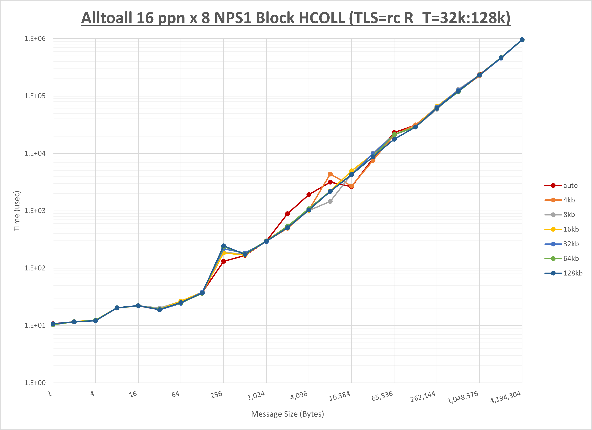

以上より、 **UCX_ZCOPY_THRESH** を **128kb** とした場合が最も性能が良いと判断してこれを固定します。

[ステップ3]

以下のグラフは、**NPS** とMPIプロセス分割方法の各組合せを集合通信コンポーネント毎に比較したものです。


以上より、 **NPS** とMPIプロセス分割方法を下表の設定とした場合が最も性能が良いと判断してこれを固定、 

||No COLL|UCC|HCOLL|
|:---:|-:|-:|-:|
|**NPS**|2|2|2|
|MPIプロセス分割方法|ブロック分割|ブロック分割|サイクリック分割|

集合通信コンポーネントを比較したものが以下のグラフです。  
ここでは、チューニングを全く適用しなかった場合と比較するため、全パラメータがデフォルトの組合せ（ **UCX_RNDV_THRESH=auto** ・ **UCX_ZCOPY_THRESH=auto** ・ **coll_hcoll_enable=1** ・ **coll_ucc_enable=0** ）を含めています。


以上の結果は、以下のように考察することが出来ます。

- **UCC** は512B以下で性能が向上
- **HCOLL** は512B以下で概ね性能が向上
- **UCC** は **HCOLL** に対して2KB以下で概ね性能が低下
- チューニング未適用は4KB以下で概ね性能が低下

### 4-2-2. Allgather

[ステップ1]

以下のグラフは、 **UCX_RNDV_THRESH** を変化させたときの **Allgather** の結果を、 **UCX_TLS** の設定値毎に示しています。  
ノード内の **UCX_RNDV_THRESH** の最適値は、 **[1-2-2 Allgather](#1-2-2-allgather)** の結果から32kbとしています。


以上より、 **UCX_RNDV_THRESH** を **intra:32kb,inter:128kb** とした場合が最も性能が良いと判断してこれを固定し、 **UCX_TLS** の各設定値を比較したものが以下のグラフです。


以上より、 **UCX_TLS** を **self,sm,rc** とした場合が最も性能が良いと判断してこれを固定します。

[ステップ2]

以下のグラフは、 **UCX_ZCOPY_THRESH** を変化させたときの **Allgather** の結果です。


以上より、 **UCX_ZCOPY_THRESH** を **128kb** とした場合が最も性能が良いと判断してこれを固定します。

[ステップ3]

以下のグラフは、**NPS** とMPIプロセス分割方法の各組合せを集合通信コンポーネント毎に比較したものです。


以上より、 **NPS** とMPIプロセス分割方法を下表の設定とした場合が最も性能が良いと判断してこれを固定、 

||No COLL|UCC|HCOLL|
|:---:|-:|-:|-:|
|**NPS**|1|2|2|
|MPIプロセス分割方法|サイクリック分割|サイクリック分割|ブロック分割|

集合通信コンポーネントを比較したものが以下のグラフです。  
ここでは、チューニングを全く適用しなかった場合と比較するため、全パラメータがデフォルトの組合せ（ **UCX_RNDV_THRESH=auto** ・ **UCX_ZCOPY_THRESH=auto** ・ **coll_hcoll_enable=1** ・ **coll_ucc_enable=0** ）を含めています。


以上の結果は、以下のように考察することが出来ます。

- **UCC** はほぼ全域で性能が向上
- **HCOLL** はほぼ全域で性能が向上
- **UCC** は **HCOLL** に対して32Bから512Bの間で性能が低下し16B以下で性能が向上
- チューニング未適用は128KB以下で性能が低下

### 4-2-3. Allreduce

[ステップ1]

以下のグラフは、 **UCX_RNDV_THRESH** を変化させたときの **Allreduce** の結果を、 **UCX_TLS** の設定値毎に示しています。  
ノード内の **UCX_RNDV_THRESH** の最適値は、 **[1-2-3 Allreduce](#1-2-3-allreduce)** の結果から128kbとしています。


以上より、 **UCX_RNDV_THRESH** を **intra:128kb,inter:128kb** とした場合が最も性能が良いと判断してこれを固定し、 **UCX_TLS** の各設定値を比較したものが以下のグラフです。


以上より、 **UCX_TLS** を **self,sm,rc** とした場合が最も性能が良いと判断してこれを固定します。

[ステップ2]

以下のグラフは、 **UCX_ZCOPY_THRESH** を変化させたときの **Allreduce** の結果です。


以上より、 **UCX_ZCOPY_THRESH** を **128kb** とした場合が最も性能が良いと判断してこれを固定します。

[ステップ3]

以下のグラフは、**NPS** とMPIプロセス分割方法の各組合せを集合通信コンポーネント毎に比較したものです。


以上より、 **NPS** とMPIプロセス分割方法を下表の設定とした場合が最も性能が良いと判断してこれを固定、 

||No COLL|UCC|HCOLL|
|:---:|-:|-:|-:|
|**NPS**|2|2|2|
|MPIプロセス分割方法|サイクリック分割|サイクリック分割|サイクリック分割|

集合通信コンポーネントを比較したものが以下のグラフです。  
ここでは、チューニングを全く適用しなかった場合と比較するため、全パラメータがデフォルトの組合せ（ **UCX_RNDV_THRESH=auto** ・ **UCX_ZCOPY_THRESH=auto** ・ **coll_hcoll_enable=1** ・ **coll_ucc_enable=0** ）を含めています。


以上の結果は、以下のように考察することが出来ます。

- **UCC** は全域で性能が向上
- **HCOLL** は全域で性能が向上
- **UCC** は **HCOLL** に対して1MB以上で性能が向上し128Bから32KBの間で性能が低下
- チューニング未適用は8MB以下で大幅に性能が低下

## 4-3. ノード当たり32 MPIプロセス

### 4-3-0. 概要

本章は、8ノードにノード当たり32 MPIプロセスでトータル256 MPIプロセスを割当てる場合の最適な **実行時パラメータ** の組み合わせをMPI集合通信関数毎に検証し、その結果を考察します。

下表は、各MPI集合通信関数の最適な **UCX_TLS** 、 **UCX_RNDV_THRESH** 、及び **UCX_ZCOPY_THRESH** を示しており、この設定値を使用することでデフォルト値に対して性能が向上します。

| MPI集合通信関数     | UCX_TLS    | UCX_RNDV_THRESH         | UCX_ZCOPY_THRESH |
| :-----------: | :--------: | :---------------------: | :--------------: |
| **Alltoall**  | self,sm,ud | intra:16kb,inter:128kb  | 128kb            |
| **Allgather** | self,sm,rc | intra:16kb,inter:128kb  | 128kb            |
| **Allreduce** | self,sm,rc | intra:128kb,inter:128kb | 128kb            |

**HCOLL** / **UCC** / MPIプロセス分割方法 / **NPS** に関する傾向は、各MPI集合関数のセクションを参照ください。

### 4-3-1. Alltoall

[ステップ1]

以下のグラフは、 **UCX_RNDV_THRESH** を変化させたときの **Alltoall** の結果を、 **UCX_TLS** の設定値毎に示しています。  
ノード内の **UCX_RNDV_THRESH** の最適値は、 **[1-3-1 Alltoall](#1-3-1-alltoall)** の結果から16kbとしています。


以上より、 **UCX_RNDV_THRESH** を **intra:16kb,inter:128kb** とした場合が最も性能が良いと判断してこれを固定し、 **UCX_TLS** の各設定値を比較したものが以下のグラフです。


以上より、 **UCX_TLS** を **self,sm,ud** とした場合が最も性能が良いと判断してこれを固定します。

[ステップ2]

以下のグラフは、 **UCX_ZCOPY_THRESH** を変化させたときの **Alltoall** の結果です。


以上より、 **UCX_ZCOPY_THRESH** を **128kb** とした場合が最も性能が良いと判断してこれを固定します。

[ステップ3]

以下のグラフは、**NPS** とMPIプロセス分割方法の各組合せを集合通信コンポーネント毎に比較したものです。


以上より、 **NPS** とMPIプロセス分割方法を下表の設定とした場合が最も性能が良いと判断してこれを固定、 

||No COLL|UCC|HCOLL|
|:---:|-:|-:|-:|
|**NPS**|1|1|2|
|MPIプロセス分割方法|サイクリック分割|ブロック分割|ブロック分割|

集合通信コンポーネントを比較したものが以下のグラフです。  
ここでは、チューニングを全く適用しなかった場合と比較するため、全パラメータがデフォルトの組合せ（ **UCX_RNDV_THRESH=auto** ・ **UCX_ZCOPY_THRESH=auto** ・ **coll_hcoll_enable=1** ・ **coll_ucc_enable=0** ）を含めています。


以上の結果は、以下のように考察することが出来ます。

- **UCC** は顕著な傾向無し
- **HCOLL** は2KBから64KBの間で性能が低下し512B以下で性能が向上
- **UCC** は **HCOLL** に対して256Bから16KBの間で性能が向上し128B以下で概ね性能が低下
- チューニング未適用は概ね性能が低下

### 4-3-2. Allgather

[ステップ1]

以下のグラフは、 **UCX_RNDV_THRESH** を変化させたときの **Allgather** の結果を、 **UCX_TLS** の設定値毎に示しています。  
ノード内の **UCX_RNDV_THRESH** の最適値は、 **[1-3-2 Allgather](#1-3-2-allgather)** の結果から16kbとしています。


以上より、 **UCX_RNDV_THRESH** を **intra:16kb,inter:128kb** とした場合が最も性能が良いと判断してこれを固定し、 **UCX_TLS** の各設定値を比較したものが以下のグラフです。

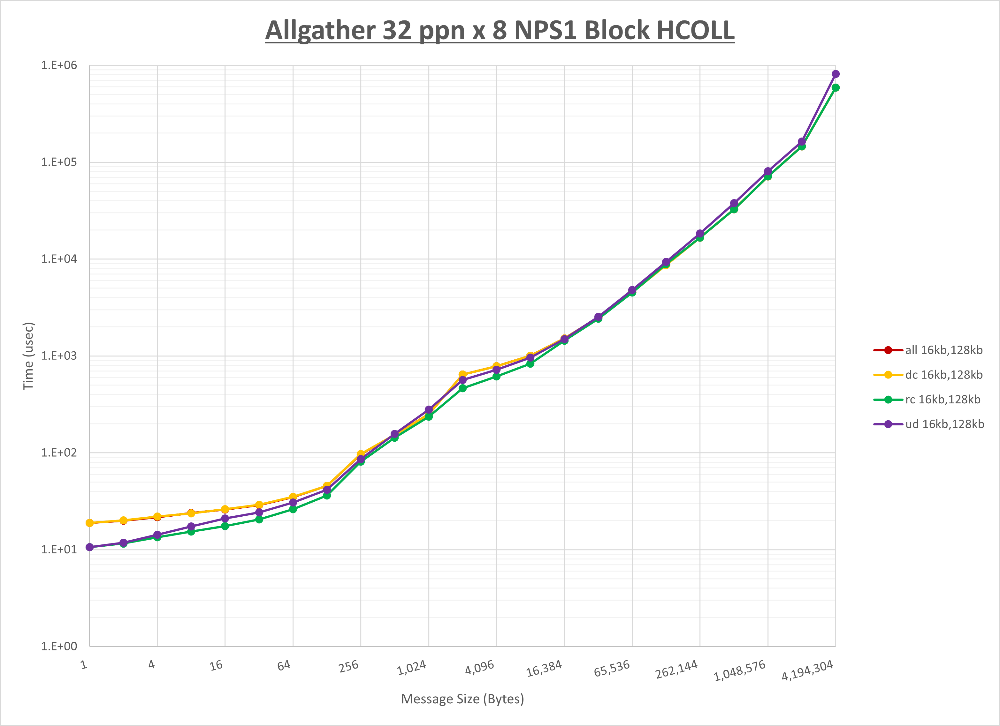

以上より、 **UCX_TLS** を **self,sm,rc** とした場合が最も性能が良いと判断してこれを固定します。

[ステップ2]

以下のグラフは、 **UCX_ZCOPY_THRESH** を変化させたときの **Allgather** の結果です。


以上より、 **UCX_ZCOPY_THRESH** を **128kb** とした場合が最も性能が良いと判断してこれを固定します。

[ステップ3]

以下のグラフは、**NPS** とMPIプロセス分割方法の各組合せを集合通信コンポーネント毎に比較したものです。


以上より、 **NPS** とMPIプロセス分割方法を下表の設定とした場合が最も性能が良いと判断してこれを固定、 

||No COLL|UCC|HCOLL|
|:---:|-:|-:|-:|
|**NPS**|2|2|2|
|MPIプロセス分割方法|ブロック分割|ブロック分割|ブロック分割|

集合通信コンポーネントを比較したものが以下のグラフです。  
ここでは、チューニングを全く適用しなかった場合と比較するため、全パラメータがデフォルトの組合せ（ **UCX_RNDV_THRESH=auto** ・ **UCX_ZCOPY_THRESH=auto** ・ **coll_hcoll_enable=1** ・ **coll_ucc_enable=0** ）を含めています。


以上の結果は、以下のように考察することが出来ます。

- **UCC** は4KB以上と8B以下で性能が向上し16Bから1KBの間で性能が低下
- **HCOLL** はほぼ全域で性能が向上
- **UCC** は **HCOLL** に対して8B以下で性能が向上し16Bから512KBの間で性能が低下
- チューニング未適用は16KB以下で性能が低下

### 4-3-3. Allreduce

[ステップ1]

以下のグラフは、 **UCX_RNDV_THRESH** を変化させたときの **Allreduce** の結果を、 **UCX_TLS** の設定値毎に示しています。  
ノード内の **UCX_RNDV_THRESH** の最適値は、 **[1-3-3 Allreduce](#1-3-3-allreduce)** の結果から128kbとしています。


以上より、 **UCX_RNDV_THRESH** を **intra:128kb,inter:128kb** とした場合が最も性能が良いと判断してこれを固定し、 **UCX_TLS** の各設定値を比較したものが以下のグラフです。


以上より、 **UCX_TLS** を **self,sm,rc** とした場合が最も性能が良いと判断してこれを固定します。

[ステップ2]

以下のグラフは、 **UCX_ZCOPY_THRESH** を変化させたときの **Allreduce** の結果です。


以上より、 **UCX_ZCOPY_THRESH** を **128kb** とした場合が最も性能が良いと判断してこれを固定します。

[ステップ3]

以下のグラフは、**NPS** とMPIプロセス分割方法の各組合せを集合通信コンポーネント毎に比較したものです。


以上より、 **NPS** とMPIプロセス分割方法を下表の設定とした場合が最も性能が良いと判断してこれを固定、 

||No COLL|UCC|HCOLL|
|:---:|-:|-:|-:|
|**NPS**|2|1|1|
|MPIプロセス分割方法|ブロック分割|サイクリック分割|サイクリック分割|

集合通信コンポーネントを比較したものが以下のグラフです。  
ここでは、チューニングを全く適用しなかった場合と比較するため、全パラメータがデフォルトの組合せ（ **UCX_RNDV_THRESH=auto** ・ **UCX_ZCOPY_THRESH=auto** ・ **coll_hcoll_enable=1** ・ **coll_ucc_enable=0** ）を含めています。


以上の結果は、以下のように考察することが出来ます。

- **UCC** は全域で性能が向上
- **HCOLL** は全域で性能が向上
- **UCC** は **HCOLL** に対して512KB以上で性能が向上し64KB以下で概ね性能が低下
- チューニング未適用は16MB以下で大幅に性能が低下

## 4-4. ノード当たり36 MPIプロセス

### 4-4-0. 概要

本章は、8ノードにノード当たり36 MPIプロセスでトータル288 MPIプロセスを割当てる場合の最適な **実行時パラメータ** の組み合わせをMPI集合通信関数毎に検証し、その結果を考察します。

下表は、各MPI集合通信関数の最適な **UCX_TLS** 、 **UCX_RNDV_THRESH** 、及び **UCX_ZCOPY_THRESH** を示しており、この設定値を使用することでデフォルト値に対して性能が向上します。

| MPI集合通信関数     | UCX_TLS    | UCX_RNDV_THRESH         | UCX_ZCOPY_THRESH |
| :-----------: | :--------: | :---------------------: | :--------------: |
| **Alltoall**  | self,sm,ud | intra:16kb,inter:128kb  | 128kb            |
| **Allgather** | self,sm,rc | intra:16kb,inter:128kb  | 128kb            |
| **Allreduce** | self,sm,rc | intra:128kb,inter:128kb | 128kb            |

**HCOLL** / **UCC** / MPIプロセス分割方法 / **NPS** に関する傾向は、各MPI集合関数のセクションを参照ください。

### 4-4-1. Alltoall

[ステップ1]

以下のグラフは、 **UCX_RNDV_THRESH** を変化させたときの **Alltoall** の結果を、 **UCX_TLS** の設定値毎に示しています。  
ノード内の **UCX_RNDV_THRESH** の最適値は、 **[1-4-1 Alltoall](#1-4-1-alltoall)** の結果から16kbとしています。


以上より、 **UCX_RNDV_THRESH** を **intra:16kb,inter:128kb** とした場合が最も性能が良いと判断してこれを固定し、 **UCX_TLS** の各設定値を比較したものが以下のグラフです。


以上より、 **UCX_TLS** を **self,sm,ud** とした場合が最も性能が良いと判断してこれを固定します。

[ステップ2]

以下のグラフは、 **UCX_ZCOPY_THRESH** を変化させたときの **Alltoall** の結果です。


以上より、 **UCX_ZCOPY_THRESH** を **128kb** とした場合が最も性能が良いと判断してこれを固定します。

[ステップ3]

以下のグラフは、**NPS** とMPIプロセス分割方法の各組合せを集合通信コンポーネント毎に比較したものです。


以上より、 **NPS** とMPIプロセス分割方法を下表の設定とした場合が最も性能が良いと判断してこれを固定、 

||No COLL|UCC|HCOLL|
|:---:|-:|-:|-:|
|**NPS**|2|2|2|
|MPIプロセス分割方法|サイクリック分割|サイクリック分割|ブロック分割|

集合通信コンポーネントを比較したものが以下のグラフです。  
ここでは、チューニングを全く適用しなかった場合と比較するため、全パラメータがデフォルトの組合せ（ **UCX_RNDV_THRESH=auto** ・ **UCX_ZCOPY_THRESH=auto** ・ **coll_hcoll_enable=1** ・ **coll_ucc_enable=0** ）を含めています。


以上の結果は、以下のように考察することが出来ます。

- **UCC** は顕著な傾向無し
- **HCOLL** は1KB以上で概ね性能が低下しそれ未満で性能が低下
- **UCC** は **HCOLL** に対して256B以下で概ね性能が低下
- チューニング未適用は全域で概ね性能が低下

### 4-4-2. Allgather

[ステップ1]

以下のグラフは、 **UCX_RNDV_THRESH** を変化させたときの **Allgather** の結果を、 **UCX_TLS** の設定値毎に示しています。  
ノード内の **UCX_RNDV_THRESH** の最適値は、 **[1-4-2 Allgather](#1-4-2-allgather)** の結果から16kbとしています。


以上より、 **UCX_RNDV_THRESH** を **intra:16kb,inter:128kb** とした場合が最も性能が良いと判断してこれを固定し、 **UCX_TLS** の各設定値を比較したものが以下のグラフです。


以上より、 **UCX_TLS** を **self,sm,rc** とした場合が最も性能が良いと判断してこれを固定します。

[ステップ2]

以下のグラフは、 **UCX_ZCOPY_THRESH** を変化させたときの **Allgather** の結果です。


以上より、 **UCX_ZCOPY_THRESH** を **128kb** とした場合が最も性能が良いと判断してこれを固定します。

[ステップ3]

以下のグラフは、**NPS** とMPIプロセス分割方法の各組合せを集合通信コンポーネント毎に比較したものです。


以上より、 **NPS** とMPIプロセス分割方法を下表の設定とした場合が最も性能が良いと判断してこれを固定、 

||No COLL|UCC|HCOLL|
|:---:|-:|-:|-:|
|**NPS**|1|2|2|
|MPIプロセス分割方法|ブロック分割|ブロック分割|ブロック分割|

集合通信コンポーネントを比較したものが以下のグラフです。  
ここでは、チューニングを全く適用しなかった場合と比較するため、全パラメータがデフォルトの組合せ（ **UCX_RNDV_THRESH=auto** ・ **UCX_ZCOPY_THRESH=auto** ・ **coll_hcoll_enable=1** ・ **coll_ucc_enable=0** ）を含めています。


以上の結果は、以下のように考察することが出来ます。

- **UCC** は16Bから256Bの間で性能が低下しそれ以外で性能が向上
- **HCOLL** はほぼ全域で性能が向上
- **UCC** は **HCOLL** に対して16Bから256Bの間で性能が低下
- チューニング未適用は8KB以下で大幅に性能が低下

### 4-4-3. Allreduce

[ステップ1]

以下のグラフは、 **UCX_RNDV_THRESH** を変化させたときの **Allreduce** の結果を、 **UCX_TLS** の設定値毎に示しています。  
ノード内の **UCX_RNDV_THRESH** の最適値は、 **[1-4-3 Allreduce](#1-4-3-allreduce)** の結果から128kbとしています。


以上より、 **UCX_RNDV_THRESH** を **intra:128kb,inter:128kb** とした場合が最も性能が良いと判断してこれを固定し、 **UCX_TLS** の各設定値を比較したものが以下のグラフです。

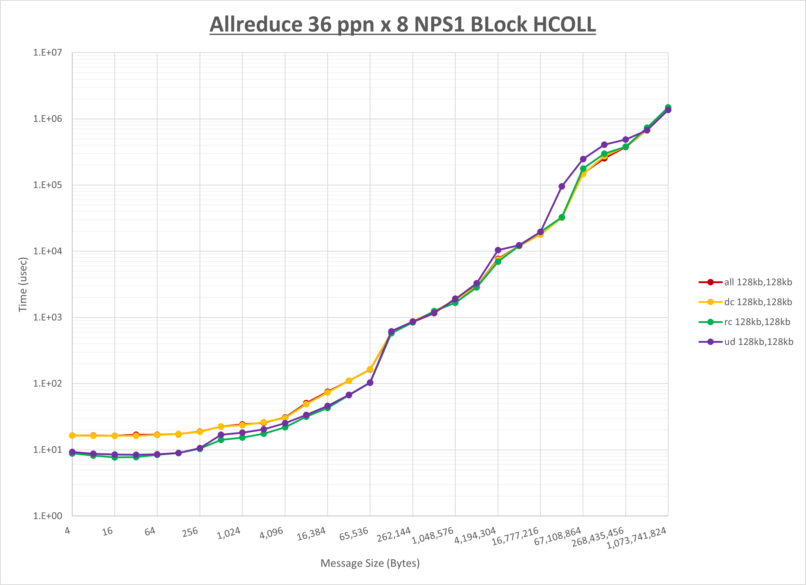

以上より、 **UCX_TLS** を **self,sm,rc** とした場合が最も性能が良いと判断してこれを固定します。

[ステップ2]

以下のグラフは、 **UCX_ZCOPY_THRESH** を変化させたときの **Allreduce** の結果です。


以上より、 **UCX_ZCOPY_THRESH** を **128kb** とした場合が最も性能が良いと判断してこれを固定します。

[ステップ3]

以下のグラフは、**NPS** とMPIプロセス分割方法の各組合せを集合通信コンポーネント毎に比較したものです。


以上より、 **NPS** とMPIプロセス分割方法を下表の設定とした場合が最も性能が良いと判断してこれを固定、 

||No COLL|UCC|HCOLL|
|:---:|-:|-:|-:|
|**NPS**|2|1|1|
|MPIプロセス分割方法|ブロック分割|ブロック分割|ブロック分割|

集合通信コンポーネントを比較したものが以下のグラフです。  
ここでは、チューニングを全く適用しなかった場合と比較するため、全パラメータがデフォルトの組合せ（ **UCX_RNDV_THRESH=auto** ・ **UCX_ZCOPY_THRESH=auto** ・ **coll_hcoll_enable=1** ・ **coll_ucc_enable=0** ）を含めています。


以上の結果は、以下のように考察することが出来ます。

- **UCC** は概ね全域で性能が向上
- **HCOLL** は全域で性能が向上
- **UCC** は **HCOLL** に対して8KB以下で性能が低下
- チューニング未適用は64MB以下で大幅に性能が低下
