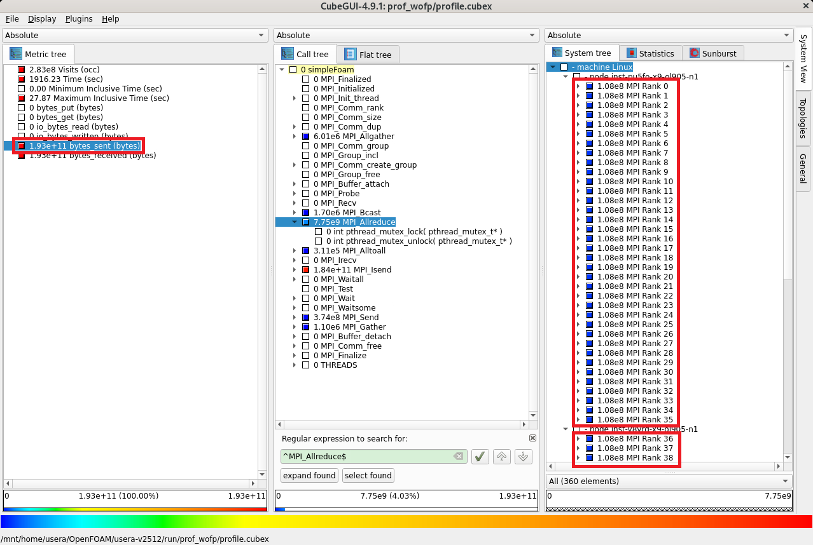
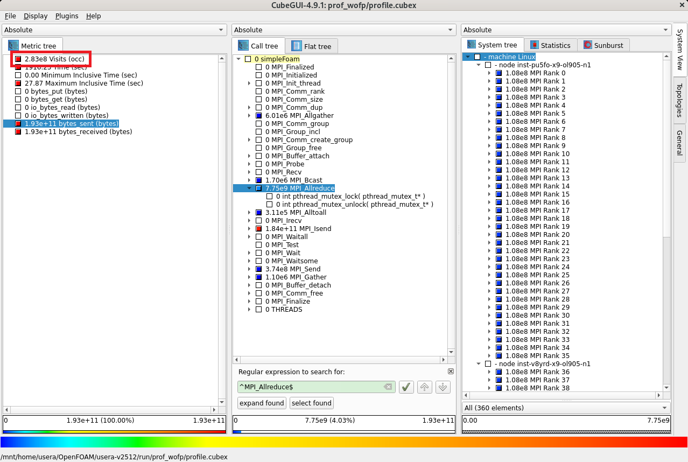
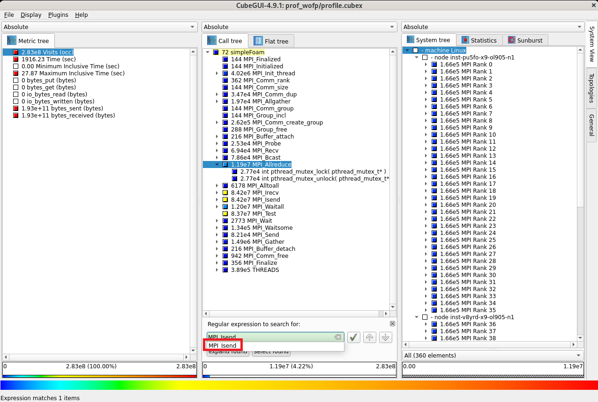
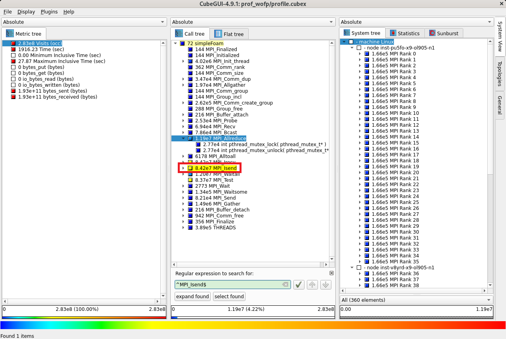
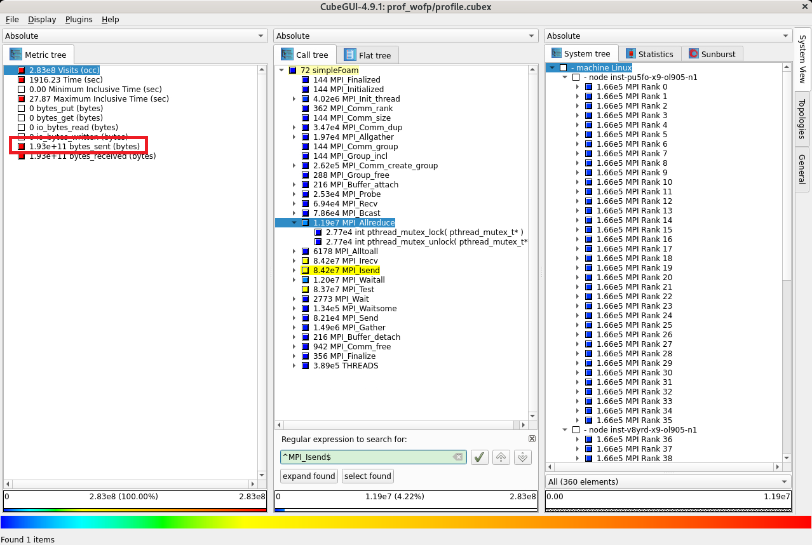
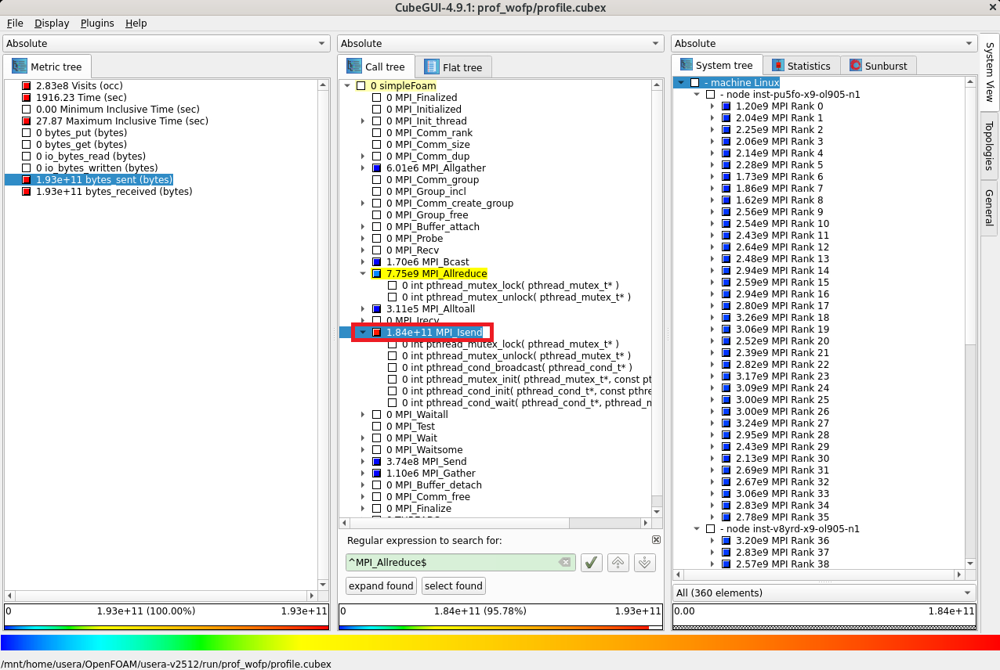
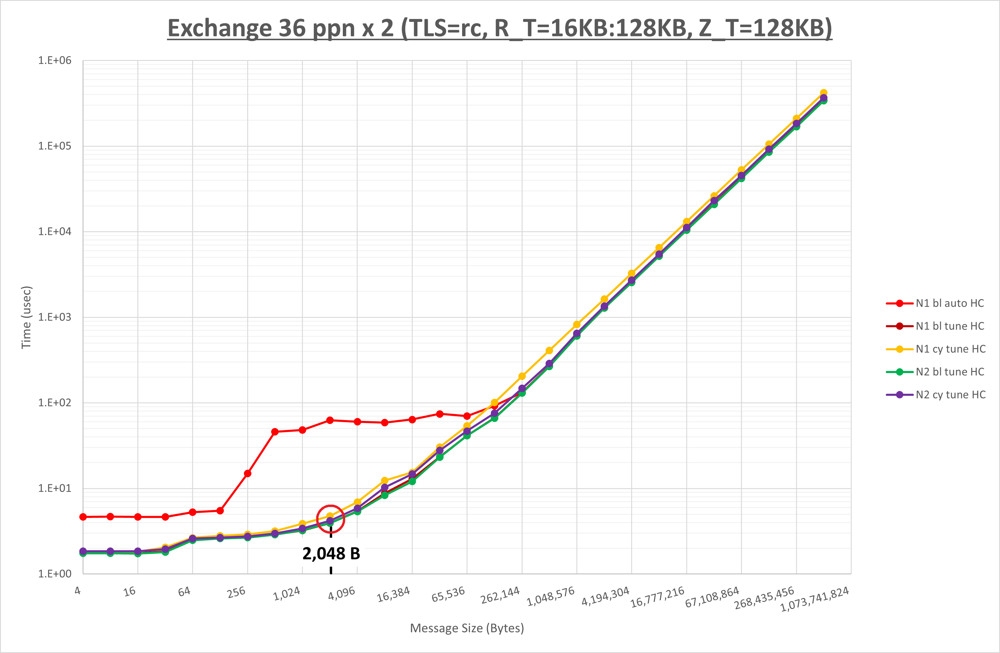

# 0. 概要

**[OpenFOAM](https://www.openfoam.com/)** は、そのソースコード体系が大規模・複雑なため、 **OpenFOAM** 自身をソースコードレベルでプロファイリング・チューニングすることは容易ではありませんが、並列計算時に使用するMPI通信にフォーカスすることで、 **OpenFOAM** そのものには手を付けずに性能向上を検討することが可能です。

ここでMPI通信の性能向上に寄与する実行時パラメータは、MPI通信特性に合わせて選定する必要があるため、MPI通信にフォーカスしたプロファイリング・チューニングを実施するためには、 **OpenFOAM** 実行時に以下の情報を取得する必要があります。

- 総所要時間に占める割合の大きなMPI通信関数
- 上記MPI通信関数呼び出し時のメッセージサイズ

以上の情報が入手できれば、以下のステップに従いMPI通信にフォーカスした **OpenFOAM** のプロファイリング・チューニングが可能になります。

- プロファイリング
    - **asis** （※1）の所要時間計測
    - **asis** のプロファイリング取得時の所要時間計測
    - 両者に大きな差が無く精度の良いプロファイリング情報を取得出来ていることを確認
    - プロファイリング情報から **ホットスポット** （※2）のMPI通信関数を特定
- チューニング
    - **ホットスポット** のMPI通信関数に対する最適な実行時パラメータ検討
    - チューニング適用時のプロファイリング取得
    - プロファイリング情報から **ホットスポット** のMPI通信関数に対するチューニングの効果を確認
    - チューニング適用時の所要時間計測
    - **asis** とチューニング適用時の所要時間比較・チューニング効果確認

※1）本パフォーマンス・プロファイリング関連Tipsでは、チューニング適用前のアプリケーションの状態を **asis** と呼称します。  
※2）本パフォーマンス・プロファイリング関連Tipsでは、所要時間のうち上位を占めるプログラム単位（サブルーチン・関数、MPI通信関数、IO等）を **ホットスポット** と呼称します。

ここでMPI通信にフォーカスしたプロファイリングは、 **OpenFOAM** のソースコードが入手可能であることを利用し、以下のオープンソースのプロファイリングツール群を活用することが可能です。

- **[Score-P](https://www.vi-hps.org/projects/score-p/)**
- **[Scalasca](https://www.scalasca.org/)**
- **[CubeGUI](https://www.scalasca.org/scalasca/software/cube-4.x/download.html)**

以上を踏まえて本パフォーマンス・プロファイリング関連Tipsは、プロファイリングツールに **Score-P** 、 **Scalasca** 、及び **CubeGUI** を使用し、 **OpenFOAM** のチュートリアルに含まれるオートバイ走行時乱流シミュレーションのソルバー実行部分のプロファイリング情報をMPI通信にフォーカスして取得、 **ホットスポット** のMPI通信関数にフォーカスしてチューニングを適用、その性能を向上させる手順を解説します。  

またMPI通信関数のチューニング手法は、 **[OCI HPCパフォーマンス関連情報](../../#2-oci-hpcパフォーマンス関連情報)** の **[OpenMPIのMPI集合通信チューニング方法（BM.Optimized3.36編）](../../benchmark/openmpi-perftune/)** で得られた結果を元に検討します。

本パフォーマンス・プロファイリング関連Tipsは、以下の環境を前提とします。

- 計算ノード
    - シェイプ： **[BM.Optimized3.36](https://docs.oracle.com/ja-jp/iaas/Content/Compute/References/computeshapes.htm#bm-hpc-optimized)**
    - ノード数： 2ノード
    - イメージ： **Oracle Linux** 9.05ベースのHPC **[クラスタネットワーキングイメージ](../../#5-13-クラスタネットワーキングイメージ)** （※3）
- ノード間接続インターコネクト
    - **[クラスタ・ネットワーク](../../#5-1-クラスタネットワーク)** 
    - リンク速度： 100 Gbps
- Bastionノード
    - シェイプ ： **[VM.Standard.E5.Flex](https://docs.oracle.com/ja-jp/iaas/Content/Compute/References/computeshapes.htm#flexible)**
    - イメージ： **Oracle Linux** 9.05ベースのHPC **[クラスタネットワーキングイメージ](../../#5-13-クラスタネットワーキングイメージ)** （※3）
- ファイル共有ストレージ
    - NFSでサービスする任意のファイル共有ストレージ（※4）
    - Bastionノードと全計算ノードのCFD解析ユーザホームディレクトリをファイル共有
- **OpenFOAM** ： v2512（※5）
- **Score-P** ：9.4（※6）
- **Scalasca** ：2.6.2（※6）
- **CubeGUI** ：4.9.1（※6）
- MPI： **[OpenMPI](https://www.open-mpi.org/)** 5.0.8（※7）

※3）**[OCI HPCテクニカルTips集](../../#3-oci-hpcテクニカルtips集)** の **[クラスタネットワーキングイメージの選び方](../../tech-knowhow/osimage-for-cluster/)** の **[1. クラスタネットワーキングイメージ一覧](../../tech-knowhow/osimage-for-cluster/#1-クラスタネットワーキングイメージ一覧)** のイメージ **No.13** です。  
※4）このファイル共有ストレージの選定・構築方法は、 **[OCI HPCテクニカルTips集](../../#3-oci-hpcテクニカルtips集)** の **[HPC/GPUクラスタ向けファイル共有ストレージの最適な構築手法](../../tech-knowhow/howto-configure-sharedstorage/)** を参照してください。  
※5） **[OCI HPCテクニカルTips集](../../#3-oci-hpcテクニカルtips集)** の **[OpenFOAMインストール・利用方法](../../tech-knowhow/install-openfoam/)** に従って構築された **OpenFOAM** をプロダクション実行用途で用意し、同じバージョンを本プロファイリング関連Tipsの手順に従いプロファイリング用途で追加インストールします。  
※6） **[OCI HPCプロファイリング関連Tips集](../../#2-3-プロファイリング関連tips集)** の **[Score-P・Scalasca・CubeGUIで並列アプリケーションをプロファイリング](../scorep-profiling/)** に従って構築された **Score-P** 、 **Scalasca** 、及び **CubeGUI** です。  
※7） **[OCI HPCテクニカルTips集](../../#3-oci-hpcテクニカルtips集)** の **[Slurm環境での利用を前提とするUCX通信フレームワークベースのOpenMPI構築方法](../../tech-knowhow/build-openmpi/)** に従って構築された **OpenMPI** です。

以降では、以下の順に解説します。

1. **[プロファイリング・チューニング環境構築](#1-プロファイリングチューニング環境構築)**
2. **[プロファイリング](#2-プロファイリング)**
3. **[チューニング](#3-チューニング)**

# 1. プロファイリング・チューニング環境構築

本章は、本プロファイリング・チューニング関連Tipsで使用するプロファイリング対応の **OpenFOAM** 環境を構築します。

この構築は、 **[OCI HPCプロファイリング関連Tips集](../../#2-3-プロファイリング関連tips集)** の **[Score-P・Scalasca・CubeGUIでOpenFOAMをプロファイリング](../../benchmark/openfoam-profiling/)** の手順に従い実施します。

# 2. プロファイリング

## 2-0. 概要

本章は、 **OpenFOAM** に同梱されるチュートリアルのオートバイ走行時乱流シミュレーション（**incompressible/simpleFoam/motorBike**）のソルバー（ **simpleFoam** ）実行部分をプロファイリング対象とし、ノードあたり36コアを搭載する **BM.Optimized3.36** を2ノード使用する72 MPIプロセス実行時のプロファイリング手法によるデータをMPI通信にフォーカスして計算ノードで取得し、これをBastionノードの **CubeGUI** で確認します。

## 2-1. プロファイリング手法データの取得

この取得は、 **[OCI HPCプロファイリング関連Tips集](../../#2-3-プロファイリング関連tips集)** の **[Score-P・Scalasca・CubeGUIでOpenFOAMをプロファイリング](../../benchmark/openfoam-profiling/)** の **[4. プロファイリング手法データの取得](../../benchmark/openfoam-profiling/#4-プロファイリング手法データの取得)** の手順のうち、 **[4-3. 浮動小数点演算数を含むプロファイリング手法データの取得](../../benchmark/openfoam-profiling/#4-3-浮動小数点演算数を含むプロファイリング手法データの取得)** を除く手順に従い実施します。

## 2-2. プロファイリング手法データの確認

以下コマンドをBastionノードのプロファイリング利用ユーザで実行し、トータル時間を評価指標としたプロファイリング結果を表示します。

```sh
$ module load openmpi papi scorep scalasca cubegui
$ source /opt/OpenFOAM/OpenFOAM-v2512/etc/bashrc
$ run
$ scalasca -examine -s -x "-s totaltime" ./prof_wofp
/opt/scorep/bin/scorep-score  -s totaltime -r ./prof_wofp/profile.cubex > ./prof_wofp/scorep.score
INFO: Score report written to ./prof_wofp/scorep.score
$ head -n 35 ./prof_wofp/scorep.score

Estimated aggregate size of event trace:                   18GB
Estimated requirements for largest trace buffer (max_buf): 360MB
Estimated memory requirements (SCOREP_TOTAL_MEMORY):       370MB
(hint: When tracing set SCOREP_TOTAL_MEMORY=370MB to avoid intermediate flushes
 or reduce requirements using USR regions filters.)

flt     type  max_buf[B]      visits time[s] time[%] time/visit[us]  region
         ALL 376,634,203 282,682,028 1916.23   100.0           6.78  ALL
         MPI 373,398,205 276,097,498 1003.25    52.4           3.63  MPI
      SCOREP          46          72  907.56    47.4    12605046.59  SCOREP
     PTHREAD   3,519,074   6,584,458    5.43     0.3           0.82  PTHREAD

      SCOREP          46          72  907.56    47.4    12605046.59  simpleFoam
         MPI  11,272,292  11,935,368  289.20    15.1          24.23  MPI_Allreduce
         MPI   4,156,230  11,495,788  270.64    14.1          23.54  MPI_Waitall
         MPI          84          72  164.58     8.6     2285835.79  MPI_Init_thread
         MPI 156,089,268  84,176,201   94.01     4.9           1.12  MPI_Isend
         MPI      46,308      48,122   74.01     3.9        1537.95  MPI_Bcast
         MPI 156,087,933  84,176,201   53.52     2.8           0.64  MPI_Irecv
         MPI     125,355      68,389   22.17     1.2         324.21  MPI_Send
         MPI  45,324,994  83,676,912   11.11     0.6           0.13  MPI_Test
         MPI      15,028      15,912    9.31     0.5         585.24  MPI_Allgather
         MPI     525,174      22,158    6.43     0.3         290.29  MPI_Probe
         MPI       1,020       1,080    5.02     0.3        4644.08  MPI_Alltoall
     PTHREAD       5,226      12,888    4.46     0.2         346.02  int pthread_cond_wait( pthread_cond_t*, pthread_mutex_t* )
         MPI      67,834     132,277    1.82     0.1          13.75  MPI_Waitsome
         MPI     260,644     275,976    0.69     0.0           2.50  MPI_Gather
     PTHREAD   1,711,502   3,159,641    0.52     0.0           0.16  int pthread_mutex_lock( pthread_mutex_t* )
         MPI          84          72    0.43     0.0        5905.75  MPI_Finalize
     PTHREAD   1,711,502   3,159,641    0.35     0.0           0.11  int pthread_mutex_unlock( pthread_mutex_t* )
         MPI         168         144    0.10     0.0         699.08  MPI_Comm_create_group
         MPI   4,040,030      68,389    0.10     0.0           1.40  MPI_Recv
         MPI       6,214       2,705    0.09     0.0          32.80  MPI_Wait
     PTHREAD      77,376     192,266    0.06     0.0           0.30  int pthread_mutex_init( pthread_mutex_t*, const pthread_mutexattr_t* )
$
```

この出力から、MPI通信にフォーカスした場合のホットスポットは **MPI_Allreduce** と **MPI_Waitall** で、それぞれ総所要時間の **15.1%** と **14.1%** を占めていることがわかります。  
ここで **MPI_Waitall** は、 **11.5 M** 回呼び出されており、これを上回る **84.2 M** 回呼び出されている **MPI_Isend** ・ **MPI_Irecv** と組み合わせた解析モデル領域分割境界のデータ交換に使用される、 **[Intel MPI Benchmarks](https://www.intel.com/content/www/us/en/developer/articles/technical/intel-mpi-benchmarks.html)** で言うところの **Exchange** 型通信パターンで使用されていると特定します。

そこで、 **MPI_Allreduce** と **Exchange** 型通信パターンをチューニング対象とし、続いてその呼び出し時メッセージサイズを調査します。

以下コマンドをParaView/CubeGUI操作端末に表示されているBastionノードのプロファイリング利用ユーザのGNOMEデスクトップ上のターミナルで実行し、プロファイリング手法データを読み込んで **CubeGUI** を起動します。

```sh
$ module load openmpi cubegui
$ source /opt/OpenFOAM/OpenFOAM-v2512/etc/bashrc
$ run
$ cube ./prof_wofp/profile.cubex
```

次に、評価指標軸の **Time (sec)** をクリックし、


コールツリー軸領域の任意の箇所をクリックしたのちに **Ctrl-F** キーを入力し、表示される検索フィールドに **MPI_Allreduce** と入力し、表示される **MPI_Allreduce** プルダウンメニューを選択すると、


コールツリー軸に **simpleFoam** から呼ばれた **MPI_Allreduce** が所要時間の上位として色付きで表示されます。


次に、評価指標軸の **Visits (occ)** をクリックし、


コールツリー軸に表示されている **MPI_Allreduce** をクリックして1階層下がりシステム位置軸を2階層下ると、各MPIプロセスが **MPI_Allreduce** を均等に **166,000回** 呼び出していることがわかります。


次に、評価指標軸の **bytes_sent (bytes)** をクリックすると、各MPIプロセスが **MPI_Allreduce** で均等に **108 MB** 送信していることがわかります。



以上で、 **MPI_Allreduce** のメッセージサイズ算出に必要な情報が取得できました。

次に、評価指標軸の **Visits (occ)** をクリックし、



コールツリー軸に表示されている検索フィールドに **MPI_Isend** と入力し、表示される **MPI_Isend** プルダウンメニューを選択すると、



コールツリー軸に **simpleFoam** から呼ばれた **MPI_Isend** が呼び出し回数 **84.2 M** 回で表示されます。



次に、評価指標軸の **bytes_sent (bytes)** をクリックし、



コールツリー軸に表示されている **MPI_Isend** をクリックして1階層下がると、 **MPI_Isend** の送信データ量が **184 GB** であることがわかります。



以上で、 **Exchange** 型通信パターンのメッセージサイズ算出に必要な情報が取得できました。

# 3. チューニング

## 3-0. 概要

本章は、先に取得したプロファイリング情報を元に、以下の手順でチューニングを実施します。

1. **[チューニング手法検討](#3-1-チューニング手法検討)**  
ここでは、特定した **ホットスポット** に対するチューニング手法を検討します。
2. **[チューニング適用時プロファイリング取得](#3-2-チューニング適用時プロファイリング取得)**  
ここでは、チューニングを適用した状態でプロファイリングを実施し、取得したプロファイリング情報から **ホットスポット** に対するチューニングの効果を確認します。
3. **[チューニング適用時所要時間計測](#3-3-チューニング適用時所要時間計測)**  
ここでは、チューニングを適用した状態の所要時間を計測し、 **asis** とチューニング適用時の所要時間を比較してチューニングの最終的な効果を確認します。

## 3-1. チューニング手法検討

先の **[2. プロファイリング](#2-プロファイリング)** の結果から、以下のことが判明しました。

- 所要時間上位のMPI関数は **MPI_Allreduce** と **MPI_Waitall** でそれぞれ総所要時間の **15.1%** と **14.1%** を占めこれらを **ホットスポット** と特定
- **ホットスポット** の **MPI_Allreduce** は以下の特性を有する
    - 72個のMPIプロセスが均等に **166,000回** 呼び出している
    - 72個のMPIプロセスが均等に **108 MB** のデータを送信している
- **ホットスポット** の **MPI_Waitall** は **MPI_Isend** ・ **MPI_Irecv** と組み合わせた **Exchange** 型通信パターンで実行されていると特定
- **MPI_Waitall** を含む **Exchange** 型通信パターンは以下の特性を有する
    - **84.2 M** 回実行されている
    - **184 GB** のデータを送信している

ここで、 **ホットスポット** の **MPI_Allreduce** が全て同一メッセージサイズで呼び出されていると仮定し、このメッセージサイズを以下の計算式から求めます。

108 (MB) / 166,000 (回) / 72 (MPIプロセス) = **9.0 B**

また、 **ホットスポット** の **MPI_Waitall** を含む **Exchange** 型通信パターンが全て同一メッセージサイズで行われていると仮定し、このメッセージサイズを以下の計算式から求めます。

184 (GB) / 84.2 (M回) = **2,185.3 B**

以上の情報から、以下2通りの **OpenMPI** のMPI通信をターゲットにチューニング手法を検討します。

- **MPI_Allreduce**
    - ノード数： 2ノード
    - ノード当たりプロセス数： 36
    - メッセージサイズ： 9.0 B
- **Exchange** 型通信
    - ノード数： 2ノード
    - ノード当たりプロセス数： 36
    - メッセージサイズ： 2,185.3 B

ここで、 **[OpenMPIのMPI集合通信チューニング方法（BM.Optimized3.36編）](../../benchmark/openmpi-perftune/)** の当該箇所である **[2-4-3. Allreduce](../../benchmark/openmpi-perftune/#2-4-3-allreduce)** の最後に記載されている以下グラフに於いて、実際のメッセージサイズである **9.0 B** に最も近いの **8 B** メッセージサイズ部分を確認し、


緑色と紫色のグラフがほぼ同じ値で所要時間が短いため以下2種類のパラメータ設定が適していると判断、これを **MPI_Allreduce** に対するチューニング手法として採用します。

- **UCX_TLS**： **self,sm,ud**
- **UCX_RNDV_THRESH**： **intra:64kb,inter:128kb**
- **UCX_ZCOPY_THRESH**： **128kb**
- **NPS**： **NPS2**
- MPIプロセス分割方法： ブロック分割（※8）（デフォルトのため **asis** にも適用されています。）
- **coll_hcoll_enable**： 0 / 1（デフォルトのため **asis** にも適用されています。）
- **coll_ucc_enable**： 1 / 0（デフォルトのため **asis** にも適用されています。）

※8）NUMAノードに対するMPIプロセスの分割方法で、詳細は **[OCI HPCパフォーマンス関連情報](../../#2-oci-hpcパフォーマンス関連情報)** の **[パフォーマンスを考慮したプロセス・スレッドのコア割当て指定方法（BM.Optimized3.36編）](../../benchmark/cpu-binding/)** を参照してください。

次に、 **[OpenMPIのMPI集合通信チューニング方法（BM.Optimized3.36編）](../../benchmark/openmpi-perftune/)** の当該箇所である **[2-4-4. Exchange](../../benchmark/openmpi-perftune/#2-4-4-exchange)** の最後に記載されている以下グラフに於いて、実際のメッセージサイズである **2,185.3 B** に最も近いの **2,048 B** メッセージサイズ部分を確認し、



最も所要時間の短い緑色のグラフである以下のパラメータ設定が適していると判断、これを **Exchange** 型通信に対するチューニング手法として採用します。

- **UCX_TLS**： **self,sm,rc**
- **UCX_RNDV_THRESH**： **intra:16kb,inter:128kb**
- **UCX_ZCOPY_THRESH**： **128kb**
- **NPS**： **NPS2**
- MPIプロセス分割方法： ブロック分割（デフォルトのため **asis** にも適用されています。）

以上より、 **MPI_Allreduce** と **Exchange** 型通信に対する最適なパラメーター設定が異なるため、以降では以下8通りのパラメータの組み合わせを検証します。

| No. | UCX_TLS        | UCX_RNDV_THRESH            | coll_hcoll_enable | coll_ucc_enable |
| :-: | :------------: | :------------------------: | :---------------: | :-------------: |
| 1.  | **self,sm,rc** | **intra:16kb,inter:128kb** | **1**             | **0**           |
| 2.  | **self,sm,rc** | **intra:64kb,inter:128kb** | **1**             | **0**           |
| 3.  | **self,sm,ud** | **intra:16kb,inter:128kb** | **1**             | **0**           |
| 4.  | **self,sm,ud** | **intra:64kb,inter:128kb** | **1**             | **0**           |
| 5.  | **self,sm,rc** | **intra:16kb,inter:128kb** | **0**             | **1**           |
| 6.  | **self,sm,rc** | **intra:64kb,inter:128kb** | **0**             | **1**           |
| 7.  | **self,sm,ud** | **intra:16kb,inter:128kb** | **0**             | **1**           |
| 8.  | **self,sm,ud** | **intra:64kb,inter:128kb** | **0**             | **1**           |

なお、以下は全組み合わせ共通のパラメータです。

- **UCX_ZCOPY_THRESH**： **128kb**
- **NPS**： **NPS2**
- MPIプロセス分割方法： ブロック分割

## 3-2. チューニング適用時プロファイリング取得

以下コマンドを1番目の計算ノードのプロファイリング利用ユーザで実行し、チューニングを適用した時のプロファイリングを取得してその所要時間をプロファイリングを実施しない場合のもの（18秒）と比較して両者に大きな隔たりが無いことを確認、その後プロファイリングデータを格納しているディレクトリ **scorep_simpleFoam_36p72xP_sum** をNVMe SSDローカルディスクからファイル共有ストレージに移動、これを8通りのパラメータの組み合わせだけ繰り返します。

```sh
$ cd /mnt/localdisk/usera/motorBike
$ module load openmpi papi scorep scalasca
$ source /opt/OpenFOAM-prof/OpenFOAM-v2512/etc/bashrc
# UCX_TLS=self,sm,rc UCX_RNDV_THRESH=intra:16kb,inter:128kb with HCOLL
$ scalasca -analyze -f ./scorep.filt mpirun -n 72 -N 36 -machinefile ~/hostlist.txt "--mca coll_hcoll_enable 1" "--mca coll_ucc_enable 0" "--mca coll_ucc_priority 100" "-x UCX_NET_DEVICES=mlx5_2:1" "-x UCX_TLS=self,sm,rc" "-x UCX_RNDV_THRESH=intra:16kb,inter:128kb" "-x UCX_ZCOPY_THRESH=128kb" "-x LD_LIBRARY_PATH" "-x WM_PROJECT_DIR" `which simpleFoam` -parallel > ./log.simpleFoam_wisc_wihc_tlrc_rt16
$ grep ^ExecutionTime ./log.simpleFoam_wisc_wihc_tlrc_rt16 | tail -1
$ mv scorep_simpleFoam_36p72xP_sum ${FOAM_RUN}/prof_wofp_wihc_tlrc_rt16
# UCX_TLS=self,sm,rc UCX_RNDV_THRESH=intra:64kb,inter:128kb with HCOLL
$ scalasca -analyze -f ./scorep.filt mpirun -n 72 -N 36 -machinefile ~/hostlist.txt "--mca coll_hcoll_enable 1" "--mca coll_ucc_enable 0" "--mca coll_ucc_priority 100" "-x UCX_NET_DEVICES=mlx5_2:1" "-x UCX_TLS=self,sm,rc" "-x UCX_RNDV_THRESH=intra:64kb,inter:128kb" "-x UCX_ZCOPY_THRESH=128kb" "-x LD_LIBRARY_PATH" "-x WM_PROJECT_DIR" `which simpleFoam` -parallel > ./log.simpleFoam_wisc_wihc_tlrc_rt64
$ grep ^ExecutionTime ./log.simpleFoam_wisc_wihc_tlrc_rt64 | tail -1
$ mv scorep_simpleFoam_36p72xP_sum ${FOAM_RUN}/prof_wofp_wihc_tlrc_rt64
# UCX_TLS=self,sm,ud UCX_RNDV_THRESH=intra:16kb,inter:128kb with HCOLL
$ scalasca -analyze -f ./scorep.filt mpirun -n 72 -N 36 -machinefile ~/hostlist.txt "--mca coll_hcoll_enable 1" "--mca coll_ucc_enable 0" "--mca coll_ucc_priority 100" "-x UCX_NET_DEVICES=mlx5_2:1" "-x UCX_TLS=self,sm,ud" "-x UCX_RNDV_THRESH=intra:16kb,inter:128kb" "-x UCX_ZCOPY_THRESH=128kb" "-x LD_LIBRARY_PATH" "-x WM_PROJECT_DIR" `which simpleFoam` -parallel > ./log.simpleFoam_wisc_wihc_tlud_rt16
$ grep ^ExecutionTime ./log.simpleFoam_wisc_wihc_tlud_rt16 | tail -1
$ mv scorep_simpleFoam_36p72xP_sum ${FOAM_RUN}/prof_wofp_wihc_tlud_rt16
# UCX_TLS=self,sm,ud UCX_RNDV_THRESH=intra:64kb,inter:128kb with HCOLL
$ scalasca -analyze -f ./scorep.filt mpirun -n 72 -N 36 -machinefile ~/hostlist.txt "--mca coll_hcoll_enable 1" "--mca coll_ucc_enable 0" "--mca coll_ucc_priority 100" "-x UCX_NET_DEVICES=mlx5_2:1" "-x UCX_TLS=self,sm,ud" "-x UCX_RNDV_THRESH=intra:64kb,inter:128kb" "-x UCX_ZCOPY_THRESH=128kb" "-x LD_LIBRARY_PATH" "-x WM_PROJECT_DIR" `which simpleFoam` -parallel > ./log.simpleFoam_wisc_wihc_tlud_rt64
$ grep ^ExecutionTime ./log.simpleFoam_wisc_wihc_tlud_rt64 | tail -1
$ mv scorep_simpleFoam_36p72xP_sum ${FOAM_RUN}/prof_wofp_wihc_tlud_rt64
# UCX_TLS=self,sm,rc UCX_RNDV_THRESH=intra:16kb,inter:128kb with UCC
$ scalasca -analyze -f ./scorep.filt mpirun -n 72 -N 36 -machinefile ~/hostlist.txt "--mca coll_hcoll_enable 0" "--mca coll_ucc_enable 1" "--mca coll_ucc_priority 100" "-x UCX_NET_DEVICES=mlx5_2:1" "-x UCX_TLS=self,sm,rc" "-x UCX_RNDV_THRESH=intra:16kb,inter:128kb" "-x UCX_ZCOPY_THRESH=128kb" "-x LD_LIBRARY_PATH" "-x WM_PROJECT_DIR" `which simpleFoam` -parallel > ./log.simpleFoam_wisc_wiuc_tlrc_rt16
$ grep ^ExecutionTime ./log.simpleFoam_wisc_wiuc_tlrc_rt16 | tail -1
$ mv scorep_simpleFoam_36p72xP_sum ${FOAM_RUN}/prof_wofp_wiuc_tlrc_rt16
# UCX_TLS=self,sm,rc UCX_RNDV_THRESH=intra:64kb,inter:128kb with UCC
$ scalasca -analyze -f ./scorep.filt mpirun -n 72 -N 36 -machinefile ~/hostlist.txt "--mca coll_hcoll_enable 0" "--mca coll_ucc_enable 1" "--mca coll_ucc_priority 100" "-x UCX_NET_DEVICES=mlx5_2:1" "-x UCX_TLS=self,sm,rc" "-x UCX_RNDV_THRESH=intra:64kb,inter:128kb" "-x UCX_ZCOPY_THRESH=128kb" "-x LD_LIBRARY_PATH" "-x WM_PROJECT_DIR" `which simpleFoam` -parallel > ./log.simpleFoam_wisc_wiuc_tlrc_rt64
$ grep ^ExecutionTime ./log.simpleFoam_wisc_wiuc_tlrc_rt64 | tail -1
$ mv scorep_simpleFoam_36p72xP_sum ${FOAM_RUN}/prof_wofp_wiuc_tlrc_rt64
# UCX_TLS=self,sm,ud UCX_RNDV_THRESH=intra:16kb,inter:128kb with UCC
$ scalasca -analyze -f ./scorep.filt mpirun -n 72 -N 36 -machinefile ~/hostlist.txt "--mca coll_hcoll_enable 0" "--mca coll_ucc_enable 1" "--mca coll_ucc_priority 100" "-x UCX_NET_DEVICES=mlx5_2:1" "-x UCX_TLS=self,sm,ud" "-x UCX_RNDV_THRESH=intra:16kb,inter:128kb" "-x UCX_ZCOPY_THRESH=128kb" "-x LD_LIBRARY_PATH" "-x WM_PROJECT_DIR" `which simpleFoam` -parallel > ./log.simpleFoam_wisc_wiuc_tlud_rt16
$ grep ^ExecutionTime ./log.simpleFoam_wisc_wiuc_tlud_rt16 | tail -1
$ mv scorep_simpleFoam_36p72xP_sum ${FOAM_RUN}/prof_wofp_wiuc_tlud_rt16
# UCX_TLS=self,sm,ud UCX_RNDV_THRESH=intra:64kb,inter:128kb with UCC
$ scalasca -analyze -f ./scorep.filt mpirun -n 72 -N 36 -machinefile ~/hostlist.txt "--mca coll_hcoll_enable 0" "--mca coll_ucc_enable 1" "--mca coll_ucc_priority 100" "-x UCX_NET_DEVICES=mlx5_2:1" "-x UCX_TLS=self,sm,ud" "-x UCX_RNDV_THRESH=intra:64kb,inter:128kb" "-x UCX_ZCOPY_THRESH=128kb" "-x LD_LIBRARY_PATH" "-x WM_PROJECT_DIR" `which simpleFoam` -parallel > ./log.simpleFoam_wisc_wiuc_tlud_rt64
$ grep ^ExecutionTime ./log.simpleFoam_wisc_wiuc_tlud_rt64 | tail -1
$ mv scorep_simpleFoam_36p72xP_sum ${FOAM_RUN}/prof_wofp_wiuc_tlud_rt64
```

次に、以下コマンドをBastionノードのプロファイリング利用ユーザで実行し、トータル時間を評価指標としたプロファイリング結果を表示、これを8通りのパラメータの組み合わせだけ繰り返します。

```sh
$ module load openmpi papi scorep scalasca
$ source /opt/OpenFOAM/OpenFOAM-v2512/etc/bashrc
$ run
# UCX_TLS=self,sm,rc UCX_RNDV_THRESH=intra:16kb,inter:128kb with HCOLL
$ scalasca -examine -s -x "-s totaltime" ./prof_wofp_wihc_tlrc_rt16
$ head -n 35 ./prof_wofp_wihc_tlrc_rt16/scorep.score
# UCX_TLS=self,sm,rc UCX_RNDV_THRESH=intra:64kb,inter:128kb with HCOLL
$ scalasca -examine -s -x "-s totaltime" ./prof_wofp_wihc_tlrc_rt64
$ head -n 35 ./prof_wofp_wihc_tlrc_rt64/scorep.score
# UCX_TLS=self,sm,ud UCX_RNDV_THRESH=intra:16kb,inter:128kb with HCOLL
$ scalasca -examine -s -x "-s totaltime" ./prof_wofp_wihc_tlud_rt16
$ head -n 35 ./prof_wofp_wihc_tlud_rt16/scorep.score
# UCX_TLS=self,sm,ud UCX_RNDV_THRESH=intra:64kb,inter:128kb with HCOLL
$ scalasca -examine -s -x "-s totaltime" ./prof_wofp_wihc_tlud_rt64
$ head -n 35 ./prof_wofp_wihc_tlud_rt64/scorep.score
# UCX_TLS=self,sm,rc UCX_RNDV_THRESH=intra:16kb,inter:128kb with UCC
$ scalasca -examine -s -x "-s totaltime" ./prof_wofp_wiuc_tlrc_rt16
$ head -n 35 ./prof_wofp_wiuc_tlrc_rt16/scorep.score
# UCX_TLS=self,sm,rc UCX_RNDV_THRESH=intra:64kb,inter:128kb with UCC
$ scalasca -examine -s -x "-s totaltime" ./prof_wofp_wiuc_tlrc_rt64
$ head -n 35 ./prof_wofp_wiuc_tlrc_rt64/scorep.score
# UCX_TLS=self,sm,ud UCX_RNDV_THRESH=intra:16kb,inter:128kb with UCC
$ scalasca -examine -s -x "-s totaltime" ./prof_wofp_wiuc_tlud_rt16
$ head -n 35 ./prof_wofp_wiuc_tlud_rt16/scorep.score
# UCX_TLS=self,sm,ud UCX_RNDV_THRESH=intra:64kb,inter:128kb with UCC
$ scalasca -examine -s -x "-s totaltime" ./prof_wofp_wiuc_tlud_rt64
$ head -n 35 ./prof_wofp_wiuc_tlud_rt64/scorep.score
```

この出力から、 **MPI_Allreduce** と **MPI_Waitall** の所要時間がそれぞれ289.20 秒と270.64 秒から以下のように減少しており、何れの8通りのパラメータの組み合わせに於いてもチューニングの効果が確認できます。

| No. | MPI_Allreduce | MPI_Waitall |
| :-: | ------------: | ----------: |
| 1.  | 220.83 秒      | 206.66 秒    |
| 2.  | 222.09 秒      | 196.84 秒    |
| 3.  | 249.35 秒      | 222.44 秒    |
| 4.  | 253.69 秒      | 204.80 秒    |
| 5.  | 237.45 秒      | 207.93 秒    |
| 6.  | 236.96 秒      | 200.65 秒    |
| 7.  | 273.76 秒      | 222.60 秒    |
| 8.  | 273.30 秒      | 220.28 秒    |

## 3-3. チューニング適用時所要時間計測

以下コマンドを1番目の計算ノードのプロファイリング利用ユーザで実行し、チューニング適用時の所要時間を計測、これを8通りのパラメータの組み合わせだけ繰り返します。

```sh
$ source /opt/OpenFOAM/OpenFOAM-v2512/etc/bashrc
# UCX_TLS=self,sm,rc UCX_RNDV_THRESH=intra:16kb,inter:128kb with HCOLL
$ mpirun -n 72 -N 36 -hostfile ~/hostlist.txt --mca coll_hcoll_enable 1 --mca coll_ucc_enable 0 --mca coll_ucc_priority 100 -x UCX_NET_DEVICES=mlx5_2:1 -x UCX_TLS=self,sm,rc -x UCX_RNDV_THRESH=intra:16kb,inter:128kb -x UCX_ZCOPY_THRESH=128kb -x PATH -x LD_LIBRARY_PATH -x WM_PROJECT_DIR simpleFoam -parallel  > ./log.simpleFoam_wosc_wihc_tlrc_rt16
[inst-oqqrv-x9-ol905-n2:12658] SET UCX_NET_DEVICES=mlx5_2:1
[inst-oqqrv-x9-ol905-n2:12658] SET UCX_TLS=self,sm,rc
[inst-oqqrv-x9-ol905-n2:12658] SET UCX_RNDV_THRESH=intra:16kb,inter:128kb
[inst-oqqrv-x9-ol905-n2:12658] SET UCX_ZCOPY_THRESH=128kb
$ grep ^ExecutionTime ./log.simpleFoam_wosc_wihc_tlrc_rt16 | tail -1
ExecutionTime = 15.7 s  ClockTime = 16 s
# UCX_TLS=self,sm,rc UCX_RNDV_THRESH=intra:64kb,inter:128kb with HCOLL
$ mpirun -n 72 -N 36 -hostfile ~/hostlist.txt --mca coll_hcoll_enable 1 --mca coll_ucc_enable 0 --mca coll_ucc_priority 100 -x UCX_NET_DEVICES=mlx5_2:1 -x UCX_TLS=self,sm,rc -x UCX_RNDV_THRESH=intra:64kb,inter:128kb -x UCX_ZCOPY_THRESH=128kb -x PATH -x LD_LIBRARY_PATH -x WM_PROJECT_DIR simpleFoam -parallel  > ./log.simpleFoam_wosc_wihc_tlrc_rt64
[inst-oqqrv-x9-ol905-n2:12882] SET UCX_NET_DEVICES=mlx5_2:1
[inst-oqqrv-x9-ol905-n2:12882] SET UCX_TLS=self,sm,rc
[inst-oqqrv-x9-ol905-n2:12882] SET UCX_RNDV_THRESH=intra:64kb,inter:128kb
[inst-oqqrv-x9-ol905-n2:12882] SET UCX_ZCOPY_THRESH=128kb
$ grep ^ExecutionTime ./log.simpleFoam_wosc_wihc_tlrc_rt64 | tail -1
ExecutionTime = 15.66 s  ClockTime = 16 s
# UCX_TLS=self,sm,ud UCX_RNDV_THRESH=intra:16kb,inter:128kb with HCOLL
$ mpirun -n 72 -N 36 -hostfile ~/hostlist.txt --mca coll_hcoll_enable 1 --mca coll_ucc_enable 0 --mca coll_ucc_priority 100 -x UCX_NET_DEVICES=mlx5_2:1 -x UCX_TLS=self,sm,ud -x UCX_RNDV_THRESH=intra:16kb,inter:128kb -x UCX_ZCOPY_THRESH=128kb -x PATH -x LD_LIBRARY_PATH -x WM_PROJECT_DIR simpleFoam -parallel  > ./log.simpleFoam_wosc_wihc_tlud_rt16
[inst-oqqrv-x9-ol905-n2:13102] SET UCX_NET_DEVICES=mlx5_2:1
[inst-oqqrv-x9-ol905-n2:13102] SET UCX_TLS=self,sm,ud
[inst-oqqrv-x9-ol905-n2:13102] SET UCX_RNDV_THRESH=intra:16kb,inter:128kb
[inst-oqqrv-x9-ol905-n2:13102] SET UCX_ZCOPY_THRESH=128kb
$ grep ^ExecutionTime ./log.simpleFoam_wosc_wihc_tlud_rt16 | tail -1
ExecutionTime = 16.13 s  ClockTime = 17 s
# UCX_TLS=self,sm,ud UCX_RNDV_THRESH=intra:64kb,inter:128kb with HCOLL
$ mpirun -n 72 -N 36 -hostfile ~/hostlist.txt --mca coll_hcoll_enable 1 --mca coll_ucc_enable 0 --mca coll_ucc_priority 100 -x UCX_NET_DEVICES=mlx5_2:1 -x UCX_TLS=self,sm,ud -x UCX_RNDV_THRESH=intra:64kb,inter:128kb -x UCX_ZCOPY_THRESH=128kb -x PATH -x LD_LIBRARY_PATH -x WM_PROJECT_DIR simpleFoam -parallel  > ./log.simpleFoam_wosc_wihc_tlud_rt64
[inst-oqqrv-x9-ol905-n2:13327] SET UCX_NET_DEVICES=mlx5_2:1
[inst-oqqrv-x9-ol905-n2:13327] SET UCX_TLS=self,sm,ud
[inst-oqqrv-x9-ol905-n2:13327] SET UCX_RNDV_THRESH=intra:64kb,inter:128kb
[inst-oqqrv-x9-ol905-n2:13327] SET UCX_ZCOPY_THRESH=128kb
$ grep ^ExecutionTime ./log.simpleFoam_wosc_wihc_tlud_rt64 | tail -1
ExecutionTime = 16.11 s  ClockTime = 17 s
# UCX_TLS=self,sm,rc UCX_RNDV_THRESH=intra:16kb,inter:128kb with UCC
$ mpirun -n 72 -N 36 -hostfile ~/hostlist.txt --mca coll_hcoll_enable 0 --mca coll_ucc_enable 1 --mca coll_ucc_priority 100 -x UCX_NET_DEVICES=mlx5_2:1 -x UCX_TLS=self,sm,rc -x UCX_RNDV_THRESH=intra:16kb,inter:128kb -x UCX_ZCOPY_THRESH=128kb -x PATH -x LD_LIBRARY_PATH -x WM_PROJECT_DIR simpleFoam -parallel  > ./log.simpleFoam_wosc_wiuc_tlrc_rt16
[inst-oqqrv-x9-ol905-n2:13565] SET UCX_NET_DEVICES=mlx5_2:1
[inst-oqqrv-x9-ol905-n2:13565] SET UCX_TLS=self,sm,rc
[inst-oqqrv-x9-ol905-n2:13565] SET UCX_RNDV_THRESH=intra:16kb,inter:128kb
[inst-oqqrv-x9-ol905-n2:13565] SET UCX_ZCOPY_THRESH=128kb
$ grep ^ExecutionTime ./log.simpleFoam_wosc_wiuc_tlrc_rt16 | tail -1
ExecutionTime = 16.03 s  ClockTime = 16 s
# UCX_TLS=self,sm,rc UCX_RNDV_THRESH=intra:64kb,inter:128kb with UCC
$ mpirun -n 72 -N 36 -hostfile ~/hostlist.txt --mca coll_hcoll_enable 0 --mca coll_ucc_enable 1 --mca coll_ucc_priority 100 -x UCX_NET_DEVICES=mlx5_2:1 -x UCX_TLS=self,sm,rc -x UCX_RNDV_THRESH=intra:64kb,inter:128kb -x UCX_ZCOPY_THRESH=128kb -x PATH -x LD_LIBRARY_PATH -x WM_PROJECT_DIR simpleFoam -parallel  > ./log.simpleFoam_wosc_wiuc_tlrc_rt64
[inst-oqqrv-x9-ol905-n2:13795] SET UCX_NET_DEVICES=mlx5_2:1
[inst-oqqrv-x9-ol905-n2:13795] SET UCX_TLS=self,sm,rc
[inst-oqqrv-x9-ol905-n2:13795] SET UCX_RNDV_THRESH=intra:64kb,inter:128kb
[inst-oqqrv-x9-ol905-n2:13795] SET UCX_ZCOPY_THRESH=128kb
$ grep ^ExecutionTime ./log.simpleFoam_wosc_wiuc_tlrc_rt64 | tail -1
ExecutionTime = 16.03 s  ClockTime = 16 s
# UCX_TLS=self,sm,ud UCX_RNDV_THRESH=intra:16kb,inter:128kb with UCC
$ mpirun -n 72 -N 36 -hostfile ~/hostlist.txt --mca coll_hcoll_enable 0 --mca coll_ucc_enable 1 --mca coll_ucc_priority 100 -x UCX_NET_DEVICES=mlx5_2:1 -x UCX_TLS=self,sm,ud -x UCX_RNDV_THRESH=intra:16kb,inter:128kb -x UCX_ZCOPY_THRESH=128kb -x PATH -x LD_LIBRARY_PATH -x WM_PROJECT_DIR simpleFoam -parallel  > ./log.simpleFoam_wosc_wiuc_tlud_rt16
[inst-oqqrv-x9-ol905-n2:14031] SET UCX_NET_DEVICES=mlx5_2:1
[inst-oqqrv-x9-ol905-n2:14031] SET UCX_TLS=self,sm,ud
[inst-oqqrv-x9-ol905-n2:14031] SET UCX_RNDV_THRESH=intra:16kb,inter:128kb
[inst-oqqrv-x9-ol905-n2:14031] SET UCX_ZCOPY_THRESH=128kb
$ grep ^ExecutionTime ./log.simpleFoam_wosc_wiuc_tlud_rt16 | tail -1
ExecutionTime = 16.43 s  ClockTime = 18 s
# UCX_TLS=self,sm,ud UCX_RNDV_THRESH=intra:64kb,inter:128kb with UCC
$ mpirun -n 72 -N 36 -hostfile ~/hostlist.txt --mca coll_hcoll_enable 0 --mca coll_ucc_enable 1 --mca coll_ucc_priority 100 -x UCX_NET_DEVICES=mlx5_2:1 -x UCX_TLS=self,sm,ud -x UCX_RNDV_THRESH=intra:64kb,inter:128kb -x UCX_ZCOPY_THRESH=128kb -x PATH -x LD_LIBRARY_PATH -x WM_PROJECT_DIR simpleFoam -parallel  > ./log.simpleFoam_wosc_wiuc_tlud_rt64
[inst-oqqrv-x9-ol905-n2:14301] SET UCX_NET_DEVICES=mlx5_2:1
[inst-oqqrv-x9-ol905-n2:14301] SET UCX_TLS=self,sm,ud
[inst-oqqrv-x9-ol905-n2:14301] SET UCX_RNDV_THRESH=intra:64kb,inter:128kb
[inst-oqqrv-x9-ol905-n2:14301] SET UCX_ZCOPY_THRESH=128kb
$ grep ^ExecutionTime ./log.simpleFoam_wosc_wiuc_tlud_rt64 | tail -1
ExecutionTime = 16.6 s  ClockTime = 18 s
$
```

この結果から、 **asis** と8通りのパラメータの組み合わせの所要時間を比較し、最も性能の良いパラメータの組み合わせを選定します。

以下は、本プロファイリング・チューニング関連Tips環境で所要時間を計測した結果です。  
この計測結果は、 **asis** とチューニング適用時をそれぞれ5回計測した最大値と最小値を除く3回の算術平均です。

| No.  | 所要時間     | 性能向上比      |
| :--: | -------: | ---------: |
| asis | 18.08 秒  | -          |
| 1.   | 15.617 秒 | **15.77％** |
| 2.   | 15.623 秒 | **15.73％** |
| 3.   | 16.10 秒  | **12.3％**  |
| 4.   | 16.15 秒  | **12.0％**  |
| 5.   | 16.18 秒  | **11.7％**  |
| 6.   | 16.14 秒  | **12.0％**  |
| 7.   | 16.54 秒  | **9.3％**   |
| 8.   | 16.59 秒  | **9.0％**   |

以上より、 **No.1** の以下パラメータの組み合わせが最適と判断できます。

- **UCX_TLS**： **self,sm,rc**
- **UCX_RNDV_THRESH**： **intra:16kb,inter:128kb**
- **UCX_ZCOPY_THRESH**： **128kb**
- **NPS**： **NPS2**
- MPIプロセス分割方法： ブロック分割
- **coll_hcoll_enable**： 1
- **coll_ucc_enable**： 0
