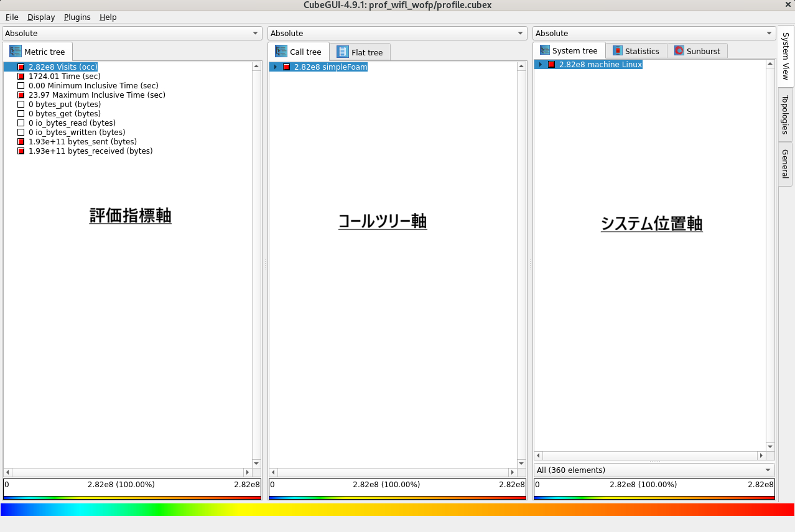
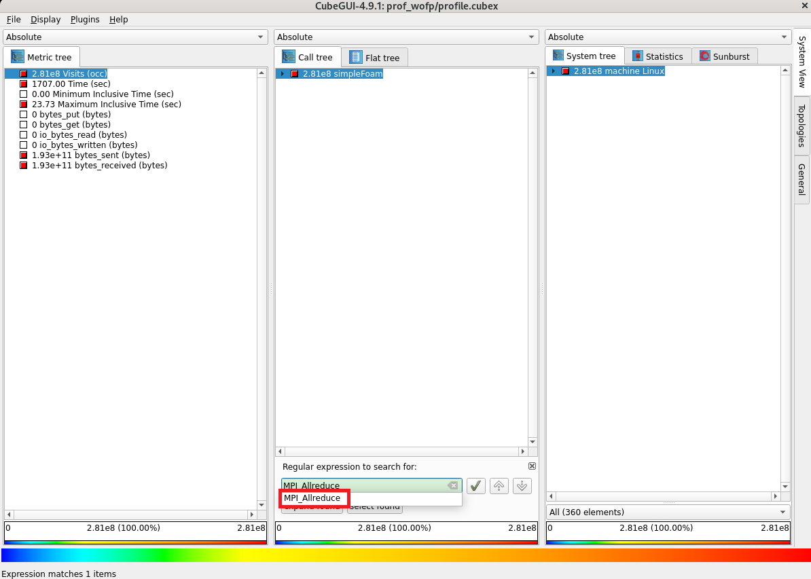
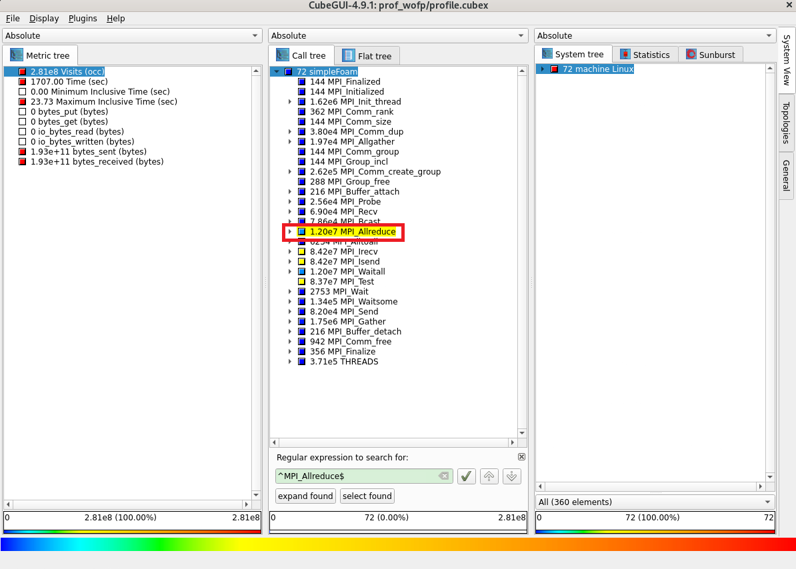
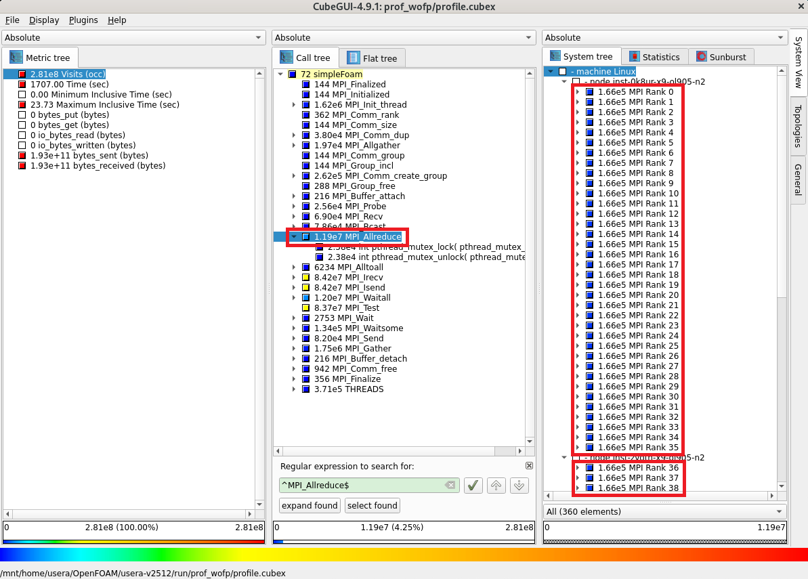
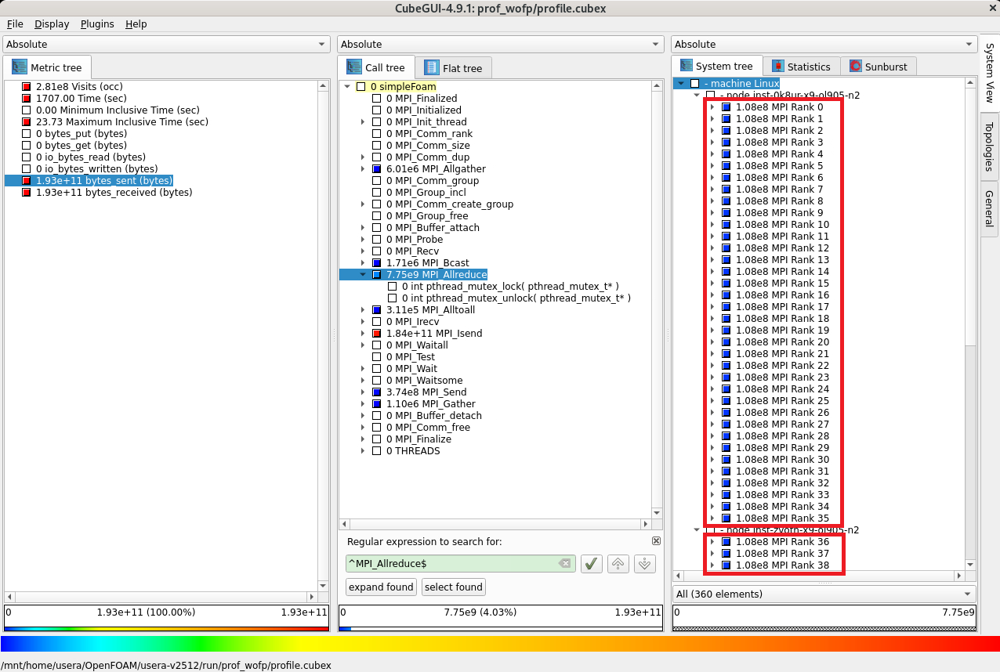
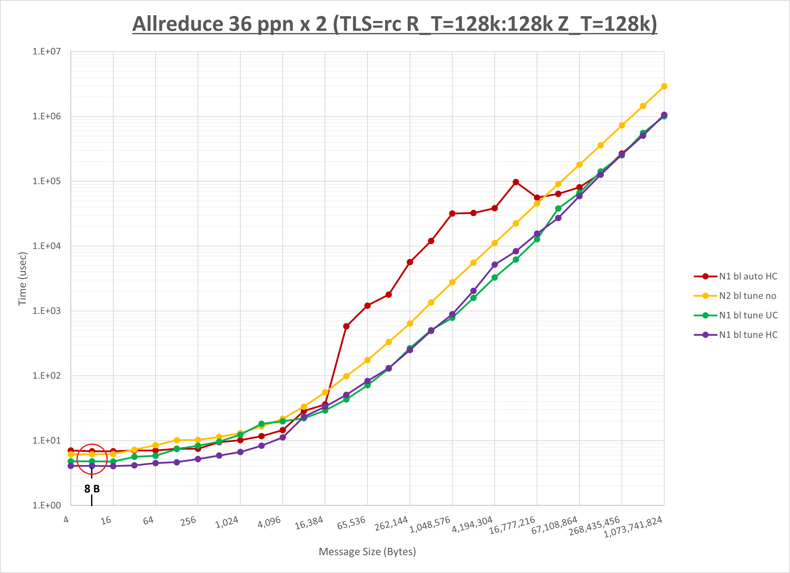

# 0. 概要

**[OpenFOAM](https://www.openfoam.com/)** は、そのソースコード体系が大規模・複雑なため、 **OpenFOAM** 自身をソースコードレベルでプロファイリング・チューニングすることは容易ではありませんが、並列計算時に使用するMPI通信にフォーカスすることで、 **OpenFOAM** そのものには手を付けずに性能向上を検討することが可能です。

ここでMPI通信の性能向上に寄与する実行時パラメータは、以下のMPI通信特性に合わせて選定する必要があるため、MPI通信にフォーカスしたプロファイリング・チューニングを実施するためには、 **OpenFOAM** 実行時にこれらの情報を取得する必要があります。

- 総所要時間に占める割合の大きなMPI通信関数
- 上記MPI通信関数呼び出し時のメッセージサイズ

以上の情報が入手できれば、以下のステップに従いMPI通信にフォーカスした **OpenFOAM** のプロファイリング・チューニングが可能になります。

- プロファイリング
    - **asis** （※1）の所要時間計測
    - プロファイリング取得時の所要時間計測
    - 両者に差が無く精度の良いプロファイリング情報を取得出来ていることを確認
    - プロファイリング情報から **ホットスポット** （※2）のMPI通信関数を特定
- チューニング
    - **ホットスポット** のMPI通信関数に対する最適な実行時パラメータ検討
    - チューニング適用時のプロファイリング取得
    - プロファイリング情報から **ホットスポット** のMPI通信関数に対するチューニングの効果を確認
    - チューニング適用時の所要時間計測
    - **asis** とチューニング適用時の所要時間比較・チューニング効果確認

※1）本パフォーマンス・プロファイリング関連Tipsでは、チューニング適用前のアプリケーションの状態を **asis** と呼称します。  
※2）本パフォーマンス・プロファイリング関連Tipsでは、所要時間のうち上位を占めるプログラム単位（サブルーチン・関数、MPI通信関数、IO等）を **ホットスポット** と呼称します。

ここでMPI通信にフォーカスしたプロファイリングは、 **OpenFOAM** のソースコードが入手可能であることを利用し、以下のオープンソースのプロファイリングツール群を活用することが可能です。

- **[Score-P](https://www.vi-hps.org/projects/score-p/)**
- **[Scalasca](https://www.scalasca.org/)**
- **[CubeGUI](https://www.scalasca.org/scalasca/software/cube-4.x/download.html)**

以上を踏まえて本パフォーマンス・プロファイリング関連Tipsは、プロファイリングツールに **Score-P** 、 **Scalasca** 、及び **CubeGUI** を使用し、 **OpenFOAM** のプロファイリング情報をMPI通信にフォーカスして取得し得られた **ホットスポット** のMPI通信関数にフォーカスしてチューニングを適用、その性能を向上させる手順を解説します。  

本手順は、 **[クラスタ・ネットワーク](../../#5-1-クラスタネットワーク)** で相互接続する **[BM.Optimized3.36](https://docs.oracle.com/ja-jp/iaas/Content/Compute/References/computeshapes.htm#bm-hpc-optimized)** を計算ノードとするHPCクラスタ環境で実行することを前提とし、 **OpenFOAM** のチュートリアルに含まれるオートバイ走行時乱流シミュレーションのソルバー（ **simpleFoam** ）実行部分をプロファイリング・チューニング対象に使用します。

またMPI通信関数のチューニング手法は、 **[OCI HPCパフォーマンス関連情報](../../#2-oci-hpcパフォーマンス関連情報)** の **[OpenMPIのMPI集合通信チューニング方法（BM.Optimized3.36編）](../../benchmark/openmpi-perftune/)** で得られた結果を元に検討します。

以降では、以下の順に解説します。

1. **[プロファイリング・チューニング環境構築](#1-プロファイリングチューニング環境構築)**
2. **[プロファイリング](#2-プロファイリング)**
3. **[チューニング](#3-チューニング)**

# 1. プロファイリング・チューニング環境構築

本章は、本プロファイリング・チューニング関連Tipsで使用するプロファイリング対応の **OpenFOAM** 環境を構築します。

この構築は、 **[OCI HPCプロファイリング関連Tips集](../../#2-3-プロファイリング関連tips集)** の **[Score-P・Scalasca・CubeGUIでOpenFOAMをプロファイリング](../../benchmark/openfoam-profiling/)** の手順に従い実施します。

# 2. プロファイリング

## 2-0. 概要

本章は、 **OpenFOAM** に同梱されるチュートリアルのオートバイ走行時乱流シミュレーション（**incompressible/simpleFoam/motorBike**）のソルバー（ **simpleFoam** ）実行部分をプロファイリング対象とし、ノードあたり36コアを搭載する **BM.Optimized3.36** を2ノード使用する72 MPIプロセス実行時のプロファイリング手法によるデータをMPI通信にフォーカスして計算ノードで取得し、これをBastionノードの **CubeGUI** で確認します。

## 2-1. プロファイリング手法データの取得

この取得は、 **[OCI HPCプロファイリング関連Tips集](../../#2-3-プロファイリング関連tips集)** の **[Score-P・Scalasca・CubeGUIでOpenFOAMをプロファイリング](../../benchmark/openfoam-profiling/)** の **[4. プロファイリング手法データの取得](../../benchmark/openfoam-profiling/#4-プロファイリング手法データの取得)** の手順のうち、3. **[4-3. 浮動小数点演算数を含むプロファイリング手法データの取得](../../benchmark/openfoam-profiling/#4-3-浮動小数点演算数を含むプロファイリング手法データの取得)** を除く手順に従い実施します。

## 2-2. プロファイリング手法データの確認

以下コマンドをプロファイリング利用ユーザで実行し、トータル時間を評価指標としたプロファイリング結果を表示します。

```sh
$ module load openmpi papi scorep scalasca cubegui
$ source /opt/OpenFOAM/OpenFOAM-v2512/etc/bashrc
$ run
$ scalasca -examine -s -x "-s totaltime" ./prof_wofp
/opt/scorep/bin/scorep-score  -s totaltime -r ./prof_wofp/profile.cubex > ./prof_wofp/scorep.score
INFO: Score report written to ./prof_wofp/scorep.score
$ head -n 35 ./prof_wofp/scorep.score

Estimated aggregate size of event trace:                   18GB
Estimated requirements for largest trace buffer (max_buf): 358MB
Estimated memory requirements (SCOREP_TOTAL_MEMORY):       368MB
(hint: When tracing set SCOREP_TOTAL_MEMORY=368MB to avoid intermediate flushes
 or reduce requirements using USR regions filters.)

flt     type  max_buf[B]      visits time[s] time[%] time/visit[us]  region
         ALL 375,260,969 280,526,204 1707.00   100.0           6.08  ALL
         MPI 373,397,529 276,096,980  900.45    52.8           3.26  MPI
      SCOREP          46          72  801.67    47.0    11134355.68  SCOREP
     PTHREAD   1,863,394   4,429,152    4.88     0.3           1.10  PTHREAD

      SCOREP          46          72  801.67    47.0    11134355.68  simpleFoam
         MPI   4,156,230  11,495,788  276.63    16.2          24.06  MPI_Waitall
         MPI  11,272,292  11,935,368  271.21    15.9          22.72  MPI_Allreduce
         MPI 156,089,268  84,176,201   95.05     5.6           1.13  MPI_Isend
         MPI      46,308      48,122   73.78     4.3        1533.27  MPI_Bcast
         MPI          84          72   72.72     4.3     1009981.74  MPI_Init_thread
         MPI 156,087,933  84,176,201   53.75     3.1           0.64  MPI_Irecv
         MPI     125,355      68,389   22.17     1.3         324.15  MPI_Send
         MPI  45,324,994  83,676,912   11.17     0.7           0.13  MPI_Test
         MPI      15,028      15,912    8.86     0.5         556.65  MPI_Allgather
         MPI     525,174      22,158    6.21     0.4         280.16  MPI_Probe
         MPI       1,020       1,080    5.23     0.3        4841.93  MPI_Alltoall
     PTHREAD       5,486      12,252    4.05     0.2         330.84  int pthread_cond_wait( pthread_cond_t*, pthread_mutex_t* )
         MPI      67,574     131,759    2.22     0.1          16.84  MPI_Waitsome
         MPI     260,644     275,976    0.75     0.0           2.71  MPI_Gather
         MPI          84          72    0.41     0.0        5705.50  MPI_Finalize
     PTHREAD     883,792   2,082,306    0.38     0.0           0.18  int pthread_mutex_lock( pthread_mutex_t* )
     PTHREAD     883,792   2,082,306    0.36     0.0           0.17  int pthread_mutex_unlock( pthread_mutex_t* )
         MPI         168         144    0.10     0.0         694.01  MPI_Comm_create_group
         MPI   4,040,030      68,389    0.09     0.0           1.34  MPI_Recv
         MPI       6,214       2,705    0.09     0.0          33.33  MPI_Wait
     PTHREAD      77,376     192,266    0.05     0.0           0.25  int pthread_mutex_init( pthread_mutex_t*, const pthread_mutexattr_t* )
$
```

この出力から、MPI通信にフォーカスした場合のホットスポットは **MPI_Waitall** と **MPI_Allreduce** で、それぞれ総所要時間の **16.2%** と **15.9%** を占めていることがわかります。

そこで、MPI通信の性能向上に寄与する実行時パラメータが判明している **MPI_Allreduce** をチューニング対象とし、続いてその呼び出し時メッセージサイズを調査します。

以下コマンドをParaView/CubeGUI操作端末に表示されているBastionノードのプロファイリング利用ユーザのGNOMEデスクトップ上のターミナルで実行し、プロファイリング手法データを読み込んで **CubeGUI** を起動します。

```sh
$ module load openmpi cubegui
$ source /opt/OpenFOAM/OpenFOAM-v2512/etc/bashrc
$ run
$ cube ./prof_wofp/profile.cubex
```



次に、コールツリー軸領域の任意の箇所をクリックしたのちに **Ctrl-F** キーを入力し、表示される検索フィールドに **MPI_Allreduce** と入力し、表示された **MPI_Allreduce** プルダウンメニューを選択すると、



コールツリー軸に **simpleFoam** から呼ばれた **MPI_Allreduce** が表示されます。




次に、コールツリー軸に表示された **MPI_Allreduce** をクリックして1階層下がりシステム位置軸を2階層下ると、各MPIプロセスが **MPI_Allreduce** を均等に **166,000回** 呼び出していることがわかります。



次に、評価指標軸の **bytes_sent** をクリックすると、各MPIプロセスが **MPI_Allreduce** で均等に **108 MB** 送信していることがわかります。



# 3. チューニング

## 3-0. 概要

本章は、先に取得したプロファイリング情報を元に、以下の手順でチューニングを実施します。

- **ホットスポット** に対するチューニング手法検討
- チューニング適用時のプロファイリング取得
- プロファイリング情報から **ホットスポット** に対するチューニングの効果を確認
- チューニング適用時の  **所要時間** 計測
- **asis** とチューニング適用時の  **所要時間** 比較・チューニング効果確認

## 3-1. チューニング手順

先の **[2. プロファイリング](#2-プロファイリング)** の結果から、以下のことが判明しました。

- 所要時間上位のMPI関数は **MPI_Waitall** と **MPI_Allreduce** でこれを **ホットスポット** と特定
- **ホットスポット** の **MPI_Allreduce** は以下の特性を有する
    - 72個のMPIプロセスから均等に **108 MB** のデータが送信されている
    - 72個のMPIプロセスから均等に **166,000回** 呼び出している

ここで、 **ホットスポット** の **MPI_Allreduce** が各回とも同一メッセージサイズであると仮定し、このメッセージサイズを以下の計算式から求めます。

108 (MB) / 166,000 (回) / 72 (MPIプロセス) = **9.0 B**

以上の情報から、 **OpenMPI** の以下MPI通信をターゲットにチューニング手法を検討します。

- MPI関数： **MPI_Allreduce**
- ノード数： 2ノード
- ノード当たりプロセス数： 36
- メッセージサイズ： 9.0 B

ここで、 **[OpenMPIのMPI集合通信チューニング方法（BM.Optimized3.36編）](../../benchmark/openmpi-perftune/)** の当該箇所である **[2-4-3. Allreduce](../../benchmark/openmpi-perftune/#2-4-3-allreduce)** の最後に記載されている以下グラフに於いて、実際のメッセージサイズである **9.0 B** に最も近いの **8 B** メッセージサイズ部分を確認し、



最も所要時間の短い紫色のグラフである以下のパラメータ設定が適していると判断、これをチューニング手法として採用します。

- UCX_TLS： self,sm,rc
- UCX_RNDV_THRESH： intra:128kb,inter:128kb
- UCX_ZCOPY_THRESH： 128kb
- **NPS**： 1（ **asis** と同じ設定です。）
- プロセス配置： ブロック分割（デフォルトのため **asis** と同じ設定です。）
- coll_hcoll_enable： 1（デフォルトのため **asis** と同じ設定です。）

次に、以下コマンドを1番目の計算ノードのプロファイリング利用ユーザで実行し、チューニング手法適用時のプロファイリングを取得します。  
この実行により、カレントディレクトリにディレクトリ **scorep_simpleFoam_36p72xP_sum** が作成され、ここに取得したプロファイリングデータが格納されます。

```sh
$ module load openmpi papi scorep scalasca
$ source /opt/OpenFOAM-prof/OpenFOAM-v2512/etc/bashrc
$ scalasca -analyze -f ./scorep.filt mpirun -n 72 -N 36 -machinefile ~/hostlist.txt "-x UCX_NET_DEVICES=mlx5_2:1" "-x UCX_TLS=self,sm,rc" "-x UCX_RNDV_THRESH=intra:128kb,inter:128kb" "-x UCX_ZCOPY_THRESH=128kb" "-x LD_LIBRARY_PATH" "-x WM_PROJECT_DIR" `which simpleFoam` -parallel > ./log.simpleFoam_wisc_witn
```

次に、以下コマンドを1番目の計算ノードのプロファイリング利用ユーザで実行し、プロファイリングデータ格納ディレクトリをNVMe SSDローカルディスクからファイル共有ストレージに移動します。

```sh
$ mv scorep_simpleFoam_36p72xP_sum ${FOAM_RUN}/prof_wofp_witn
```

以下コマンドをBastionノードのプロファイリング利用ユーザで実行し、トータル時間を評価指標としたプロファイリング結果を表示します。

```sh
$ module load openmpi papi scorep scalasca
$ source /opt/OpenFOAM/OpenFOAM-v2512/etc/bashrc
$ run
$ scalasca -examine -s -x "-s totaltime" ./prof_wofp_witn
/opt/scorep/bin/scorep-score  -s totaltime -r ./prof_wofp_witn/profile.cubex > ./prof_wofp_witn/scorep.score
INFO: Score report written to ./prof_wofp_witn/scorep.score
[usera@bast-of run]$ head -n 35 ./prof_wofp_witn/scorep.score

Estimated aggregate size of event trace:                   18GB
Estimated requirements for largest trace buffer (max_buf): 362MB
Estimated memory requirements (SCOREP_TOTAL_MEMORY):       372MB
(hint: When tracing set SCOREP_TOTAL_MEMORY=372MB to avoid intermediate flushes
 or reduce requirements using USR regions filters.)

flt     type  max_buf[B]      visits time[s] time[%] time/visit[us]  region
         ALL 379,205,091 288,600,000 1670.83   100.0           5.79  ALL
         MPI 373,395,813 276,093,961  864.18    51.7           3.13  MPI
      SCOREP          46          72  801.04    47.9    11125600.18  SCOREP
     PTHREAD   6,224,894  12,505,967    5.60     0.3           0.45  PTHREAD

      SCOREP          46          72  801.04    47.9    11125600.18  simpleFoam
         MPI  11,272,292  11,935,368  237.21    14.2          19.87  MPI_Allreduce
         MPI   4,156,230  11,495,788  219.01    13.1          19.05  MPI_Waitall
         MPI 156,089,268  84,176,201  121.35     7.3           1.44  MPI_Isend
         MPI          84          72  103.27     6.2     1434318.66  MPI_Init_thread
         MPI      46,308      48,122   74.82     4.5        1554.77  MPI_Bcast
         MPI 156,087,933  84,176,201   52.85     3.2           0.63  MPI_Irecv
         MPI     125,355      68,389   23.43     1.4         342.55  MPI_Send
         MPI  45,324,994  83,676,912   11.10     0.7           0.13  MPI_Test
         MPI      15,028      15,912    7.92     0.5         497.97  MPI_Allgather
         MPI     260,644     275,976    5.25     0.3          19.03  MPI_Gather
     PTHREAD       5,070      12,395    4.23     0.3         341.20  int pthread_cond_wait( pthread_cond_t*, pthread_mutex_t* )
         MPI     525,174      22,158    3.77     0.2         170.28  MPI_Probe
         MPI       1,020       1,080    2.44     0.1        2261.48  MPI_Alltoall
         MPI      66,456     128,740    1.14     0.1           8.83  MPI_Waitsome
     PTHREAD   3,064,698   6,117,392    0.68     0.0           0.11  int pthread_mutex_lock( pthread_mutex_t* )
     PTHREAD   3,064,698   6,117,392    0.60     0.0           0.10  int pthread_mutex_unlock( pthread_mutex_t* )
         MPI          84          72    0.37     0.0        5159.58  MPI_Finalize
         MPI         168         144    0.10     0.0         664.47  MPI_Comm_create_group
         MPI   4,040,030      68,389    0.08     0.0           1.18  MPI_Recv
         MPI       6,214       2,705    0.05     0.0          17.96  MPI_Wait
     PTHREAD      77,324     192,122    0.05     0.0           0.24  int pthread_mutex_init( pthread_mutex_t*, const pthread_mutexattr_t* )
$
```

この出力から、 **MPI_Allreduce** の時間が271秒から237秒に減少しており、チューニングの効果が確認できます。

次に、以下コマンドを計算ノードのプロファイリング利用ユーザで実行し、チューニング適用時の  **所要時間** を計測します。

```sh
$ mpirun -n 72 -N 36 -hostfile ~/hostlist.txt -x UCX_NET_DEVICES=mlx5_2:1 -x UCX_TLS=self,sm,rc -x UCX_RNDV_THRESH=intra:128kb,inter:128kb -x UCX_ZCOPY_THRESH=128kb -x PATH -x LD_LIBRARY_PATH -x WM_PROJECT_DIR simpleFoam -parallel  > ./log.simpleFoam_wosc_witn
[inst-0k8ur-x9-ol905-n2:38016] SET UCX_NET_DEVICES=mlx5_2:1
[inst-0k8ur-x9-ol905-n2:38016] SET UCX_TLS=self,sm,rc
[inst-0k8ur-x9-ol905-n2:38016] SET UCX_RNDV_THRESH=intra:128kb,inter:128kb
[inst-0k8ur-x9-ol905-n2:38016] SET UCX_ZCOPY_THRESH=128kb
$ grep ^ExecutionTime ./log.simpleFoam_wosc_witn | tail -1
ExecutionTime = 15.97 s  ClockTime = 17 s
$
```

この結果から、 **asis** とチューニング適用時の  **所要時間** を比較し、チューニングの効果を確認します。

以下は、本プロファイリング・チューニング関連Tips環境で  **所要時間** を計測した結果です。  
この計測結果は、 **asis** とチューニング適用時をそれぞれ5回計測した最大値と最小値を除く3回の算術平均です。

|asis|チューニング適用時|性能向上比|
|:-:|:-:|:-:|
|17.85秒|15.91秒|**12.2％**|