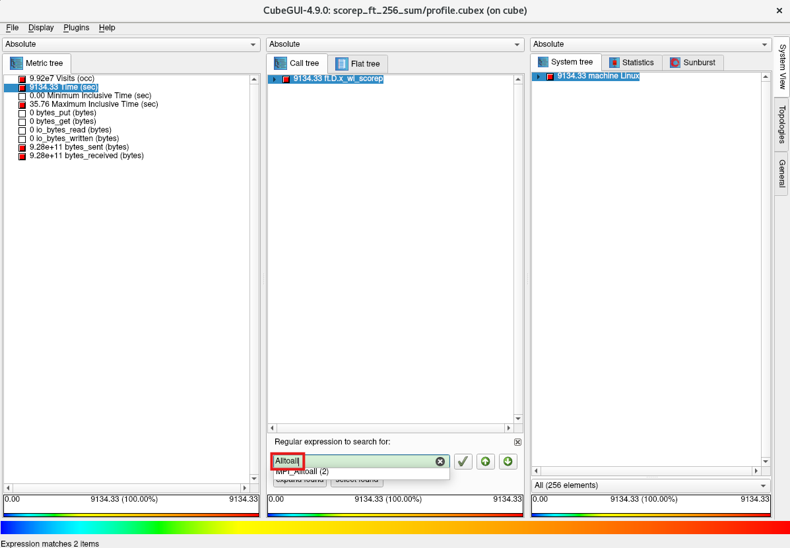
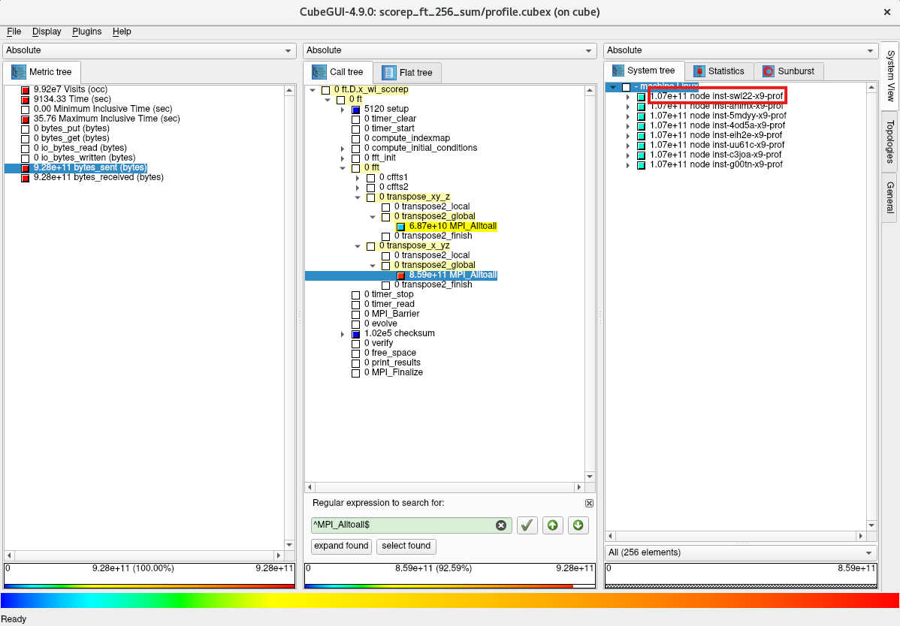
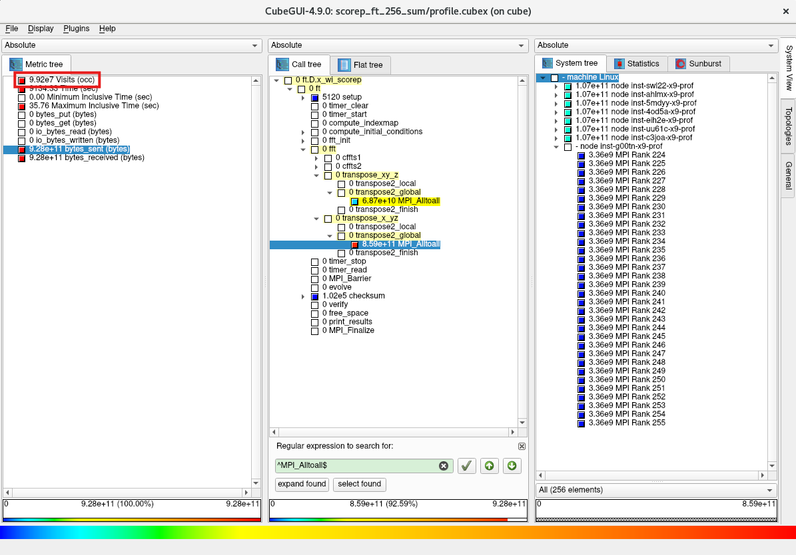

***
# 0. 概要

並列アプリケーションのチューニングは、以下のステップを経て行われることが一般的です。

- プロファイリング
    - **asis** （※1）の所要時間計測
    - プロファイリング取得時の所要時間計測
    - 両者に差がある場合プロファイリングオーバーヘッドの原因を特定
    - プロファイリングオーバーヘッド対象個所を除外してプロファイリング取得
    - プロファイリング情報から **ホットスポット** （※2）を特定
- チューニング
    - **ホットスポット** に対するチューニング手法検討
    - チューニング適用時のプロファイリング取得
    - プロファイリング情報から **ホットスポット** に対するチューニングの効果を確認
    - チューニング適用時の所要時間計測
    - **asis** とチューニング適用時の所要時間比較・チューニング効果確認

※1）本パフォーマンス・プロファイリング関連Tipsでは、チューニング適用前のアプリケーションの状態を **asis** と呼称します。  
※2）本パフォーマンス・プロファイリング関連Tipsでは、所要時間のうち上位を占めるプログラム単位（サブルーチン・関数、MPI通信関数、IO等）を **ホットスポット** と呼称します。

以上のステップでチューニングの効果が得られた場合は、チューニング適用状態を **asis** として上記ステップを繰り返し、更なる性能向上を図ります。

以上を踏まえて本パフォーマンス・プロファイリング関連Tipsは、プロファイリングツールに以下のオープンソースソフトウェアを使用し、

- **[Score-P](https://www.vi-hps.org/projects/score-p/)**
- **[Scalasca](https://www.scalasca.org/)**
- **[CubeGUI](https://www.scalasca.org/scalasca/software/cube-4.x/download.html)**

**[OpenMPI](https://www.open-mpi.org/)** を使用する並列アプリケーションを **ホットスポット** となるMPI通信関数にフォーカスしてチューニングし、その性能を向上させる手順を解説します。  

本手順は、 **[クラスタ・ネットワーク](../../#5-1-クラスタネットワーク)** で相互接続する **[BM.Optimized3.36](https://docs.oracle.com/ja-jp/iaas/Content/Compute/References/computeshapes.htm#bm-hpc-optimized)** を計算ノードとするHPCクラスタ環境で実行することを前提とし、 **[NAS Parallel Benchmarks](https://www.nas.nasa.gov/software/npb.html)** （以降 **NPB** と呼称します。）の **FT Class D** をプロファイリング・チューニング対象の並列アプリケーションに使用します。

またMPI通信関数のチューニング手法は、 **[OCI HPCパフォーマンス関連情報](../../#2-oci-hpcパフォーマンス関連情報)** の **[OpenMPIのMPI集合通信チューニング方法（BM.Optimized3.36編）](../../benchmark/openmpi-perftune/)** で得られた結果を元に検討します。

以降では、以下の順に解説します。

1. **[プロファイリング・チューニング環境構築](#1-プロファイリングチューニング環境構築)**
2. **[プロファイリング](#2-プロファイリング)**
3. **[チューニング](#3-チューニング)**

***
# 1. プロファイリング・チューニング環境構築

本章は、本プロファイリング・チューニング関連Tipsで使用する環境を構築します。

この構築は、 **[OCI HPCプロファイリング関連Tips集](../../#2-3-プロファイリング関連tips集)** の **[Score-P・Scalasca・CubeGUIで並列アプリケーションをプロファイリング](../../benchmark/scorep-profiling/)** の **[1. プロファイリング環境構築](../../benchmark/scorep-profiling/#1-プロファイリング環境構築)** の手順に従い実施します。

本プロファイリング・チューニング関連Tipsは、 **[クラスタ・ネットワーク](../../#5-1-クラスタネットワーク)** の同一リーフスイッチに接続する8ノードの計算ノードを使用しているため、その他の構成では以降のプロファイリング・チューニングの結果が異なります。（※3）

※3）**クラスタ・ネットワーク** の同一リーフスイッチに接続するインスタンス間のノード間接続に於ける効果は、 **[OCI HPCパフォーマンス関連情報](../../#2-oci-hpcパフォーマンス関連情報)** の **[クラスタ・ネットワークのトポロジーを考慮したノード間通信最適化方法](../../benchmark/topology-aware-cn-tuning/)** を参照してください。

***
# 2. プロファイリング

## 2-0. 概要

本章は、 **NPB** の **FT Class D** を使用し、 **Scalasca** から起動する **Score-P** でプロファイリング手法によるプロファイリングを実施します。  
ここでMPIの実行は、8ノードの計算ノードにノード当たり32個のMPIプロセスを配置する256並列のフラットMPIとし、プロセス分割方法にブロック分割を使用（※4）します。  
この際、プロファイリングによるオーバーヘッドを考慮した精度の良いプロファイリングを実施するため、以下の手順で実施します。

- **NPB** バイナリの作成
- **asis** の  **所要時間** （※5）計測
- プロファイリング取得時の  **所要時間** 計測
- 両者に差がある場合プロファイリングオーバーヘッドの原因を特定
- プロファイリングオーバーヘッド対象個所を除外してプロファイリング取得
- プロファイリング情報から **ホットスポット** を特定

※4）プロセス分割方法にブロック分割を使用する場合の実行方法は、 **[OCI HPCパフォーマンス関連情報](../../#2-oci-hpcパフォーマンス関連情報)** の **[パフォーマンスを考慮したプロセス・スレッドのコア割当て指定方法（BM.Optimized3.36編）](../../benchmark/cpu-binding/)** を参照してください。  
※5）以降では、 **NPB** の **FT Class D** の出力の **Time in seconds** を  **所要時間** として扱います。

## 2-1. プロファイリング手順

以下コマンドを計算ノードのプロファイリング利用ユーザで実行し、 **NPB** の **FT Class D** のプロファイリング未取得用バイナリ（**ft.D.x_wo_scorep**）とプロファイリング取得用バイナリ（**ft.D.x_wi_scorep**）を作成します。

```sh
$ mkdir ~/`hostname` && cd ~/`hostname` && wget https://www.nas.nasa.gov/assets/npb/NPB3.4.3.tar.gz
$ tar -xvf ./NPB3.4.3.tar.gz
$ cd NPB3.4.3/NPB3.4-MPI
$ cp config/make.def.template config/make.def
$ make ft CLASS=D
$ mv bin/ft.D.x bin/ft.D.x_wo_scorep
$ sed -i 's/^MPIFC = mpif90/MPIFC = scorep-mpif90/g' config/make.def
$ diff config/make.def.template config/make.def
32c32
< MPIFC = mpif90
---
> MPIFC = scorep-mpif90
$ make clean
$ make ft CLASS=D
$ mv bin/ft.D.x bin/ft.D.x_wi_scorep
```

次に、以下コマンドを計算ノードのプロファイリング利用ユーザで実行し、 **asis** の  **所要時間** を計測します。

```sh
$ mpirun -n 256 --hostfile ~/hostlist.txt --bind-to core --map-by ppr:16:package --rank-by fill -x UCX_NET_DEVICES=mlx5_2:1 ./bin/ft.D.x_wo_scorep 2>&1 | grep "Time in seconds ="
 Time in seconds =                    32.41
$
```

次に、以下コマンドを計算ノードのプロファイリング利用ユーザで実行し、プロファイリング取得時の  **所要時間** を計測します。  
この実行により、カレントディレクトリにディレクトリ **scorep_ft_256_sum** が作成され、ここに取得したプロファイリングデータが格納されます。

```sh
$ scalasca -analyze mpirun -n 256 -machinefile ~/hostlist.txt "--bind-to core" "--map-by ppr:16:package" "--rank-by fill" "-x UCX_NET_DEVICES=mlx5_2:1" ./bin/ft.D.x_wi_scorep 2>&1 | grep "Time in seconds ="
 Time in seconds =                    32.74
$
```

以上より、 **asis** とプロファイリング取得時の  **所要時間** に大きな差が無い（32.41秒と32.74秒）ことが確認できました。  
もし両者に大きな差がある場合は、プロファイリングのオーバーヘッドの原因を調査し、プロファイリング対象を限定するフィルタを作成し、これを使用してプロファイリングのオーバーヘッドを排除します。  
この手順は、 **[OCI HPCプロファイリング関連Tips集](../../#2-3-プロファイリング関連tips集)** の **[Score-P・Scalasca・CubeGUIで並列アプリケーションをプロファイリング](../../benchmark/scorep-profiling/)** の **[2-1. 事前準備](../../benchmark/scorep-profiling/#2-1-事前準備)** を参照してください。


次に、以下コマンドを計算ノードのプロファイリング利用ユーザで実行し、トータル時間を評価指標としたプロファイリング情報を作成します。

```sh
$ scalasca -examine -s -x "-s totaltime" scorep_ft_256_sum/
```

次に、以下コマンドを計算ノードのプロファイリング利用ユーザで実行し、作成したプロファイリング情報を表示します。

```sh
$ head -n 35 scorep_ft_256_sum/scorep.score

Estimated aggregate size of event trace:                   2462MB
Estimated requirements for largest trace buffer (max_buf): 10MB
Estimated memory requirements (SCOREP_TOTAL_MEMORY):       12MB
(hint: When tracing set SCOREP_TOTAL_MEMORY=12MB to avoid intermediate flushes
 or reduce requirements using USR regions filters.)

flt     type max_buf[B]     visits time[s] time[%] time/visit[us]  region
         ALL 10,082,337 99,243,224 9134.33   100.0          92.04  ALL
         USR 10,075,130 99,198,680 4654.88    51.0          46.92  USR
         MPI      4,332     16,384 4479.29    49.0      273394.14  MPI
         COM      2,834     27,904    0.15     0.0           5.43  COM
      SCOREP         41        256    0.01     0.0          40.52  SCOREP

         MPI      1,836      6,912 3631.26    39.8      525355.87  MPI_Alltoall
         USR  9,165,312 90,243,072 2181.55    23.9          24.17  fftz2
         USR        702      6,912  717.82     7.9      103850.86  transpose2_local
         MPI      1,700      6,400  587.28     6.4       91762.80  MPI_Reduce
         USR        650      6,400  448.36     4.9       70056.11  evolve
         USR      1,404     13,824  386.17     4.2       27935.09  cffts1
         USR        702      6,912  385.43     4.2       55762.38  cffts2
         USR        702      6,912  258.85     2.8       37449.58  transpose2_finish
         MPI         84        256  248.91     2.7      972291.31  MPI_Init
         USR         26        256  164.06     1.8      640862.56  free_space
         USR         52        512   47.06     0.5       91917.14  compute_indexmap
         USR    898,560  8,847,360   43.95     0.5           4.97  cfftz
         USR        208      2,048   21.56     0.2       10525.81  vranlc
         MPI         68        256    7.20     0.1       28111.36  MPI_Barrier
         MPI         84        256    4.43     0.0       17290.94  MPI_Finalize
         MPI        168        512    0.16     0.0         319.79  MPI_Comm_split
         MPI        340      1,280    0.05     0.0          42.35  MPI_Bcast
         COM        650      6,400    0.04     0.0           6.43  checksum
         COM        702      6,912    0.03     0.0           4.26  transpose2_global
         COM        650      6,400    0.03     0.0           4.51  transpose_x_yz
         COM         26        256    0.03     0.0         100.69  ft


$
```

この出力から、MPI通信関数にフォーカスすると、以下のことがわかります。

- **MPI_Alltoall** に3,631秒を要しトータル時間の約 **40%** を占めている
- **MPI_Reduce** に587秒を要しトータル時間の約 **6%** を占めている
- **MPI_Init** に249秒を要しトータル時間の約 **3%** を占めている

次に、以下コマンドを計算ノードのプロファイリング利用ユーザで実行し、プロファイリングデータ格納ディレクトリを次の実行に備えて別名に変更します。

```sh
$ mv scorep_ft_256_sum scorep_ft_256_sum_def
```

以降は、Bastionノードの **CubeGUI** でプロファイリングを継続するため、計算ノードのディレクトリ **scorep_ft_256_sum_def** をBastionノードにコピーします。

次に、以下コマンドをBastionノードのプロファイリング利用ユーザで実行し、 **CubeGUI** を起動します。

```sh
$ cube path_to_dir/scorep_ft_256_sum_def/profile.cubex
```

次に、評価指標軸の **Time** をクリックします。


次に、コールツリー軸領域の任意の箇所をクリックしたのちに **Ctrl-F** キーを入力し、表示される検索フィールドに **Alltoall** と入力します。



次に、表示された **MPI_Alltoall(2)** プルダウンメニューを選択します。


次に、コールツリー軸の表示から **MPI_Alltoall** がサブルーチン/関数の **transpose_xy_z** と **transpose_x_yz** の2か所から呼ばれており、後者のほうが圧倒的に時間を要していることがわかります。


次に、評価指標軸の **bytes_sent** をクリックします。


次に、コールツリー軸の **MPI_Alltoall** の時間を要している側をクリックします。


次に、システム位置軸の **machine Linux** をクリックします。


次に、システム位置軸の8ノードの計算ノードのうち1ノードをクリックします。



次に、選択した計算ノード配下に32個のMPIプロセスが表示され、各MPIプロセスが3.36 GBのデータを **MPI_Alltoall** で送信していることを突き止めます。


次に、他の計算ノードを選択し、同様に計算ノード配下の32個のMPIプロセスが同サイズのデータを **MPI_Alltoall** で送信していることを確認します。


次に、評価指標軸の **Visits** をクリックします。



次に、コールツリー軸の **MPI_Alltoall** の時間を要している側をクリックし、システム位置軸の表示から計算ノード配下の32個の全てのMPIプロセスが時間を要している側の **MPI_Alltoall** を25回呼び出していることを突き止めます。


***
# 3. チューニング

## 3-0. 概要

本章は、先に取得したプロファイリング情報を元に、以下の手順でチューニングを実施します。

- **ホットスポット** に対するチューニング手法検討
- チューニング適用時のプロファイリング取得
- プロファイリング情報から **ホットスポット** に対するチューニングの効果を確認
- チューニング適用時の  **所要時間** 計測
- **asis** とチューニング適用時の  **所要時間** 比較・チューニング効果確認

## 3-1. チューニング手順

先の **[2. プロファイリング](#2-プロファイリング)** の結果から、以下のことが判明しました。

- 最も時間を要しているMPI関数は **MPI_Alltoall** で2か所から呼び出されている
- **transpose_x_yz** から呼ばれる **MPI_Alltoall** が殆どの時間を占めこれを **ホットスポット** と特定
- **ホットスポット** の **MPI_Alltoall** は以下の特性を有する
    - 256個のMPIプロセスから均等に総量3.36 GBのデータが送信されている
    - 256個のMPIプロセスから均等に25回コールされている

ここで、 **ホットスポット** の **MPI_Alltoall** が各回とも同一メッセージサイズであると仮定し、このメッセージサイズを以下の計算式から求めます。

3.36 (GB) / 25 (回) / 256 (MPIプロセス) = **525 KB**

以上の情報から、 **OpenMPI** の以下MPI通信をターゲットにチューニング手法を検討します。

- MPI関数： **MPI_Alltoall**
- ノード数： 8ノード
- ノード当たりプロセス数： 32
- メッセージサイズ： 525 KB

ここで、 **[OpenMPIのMPI集合通信チューニング方法（BM.Optimized3.36編）](../../benchmark/openmpi-perftune/)** の当該箇所である **[4-3-1. Alltoall](../../benchmark/openmpi-perftune/#4-3-1-alltoall)** に於いて、最後に記載されている以下グラフの512 KBメッセージサイズ部分を確認し、


最も所要時間の短い黄色のグラフである以下のパラメータ設定が適していると判断、これをチューニング手法として採用します。

- UCX_TLS： self,sm,ud
- UCX_RNDV_THRESH： intra:16kb,inter:128kb
- UCX_ZCOPY_THRESH： 128kb
- **NPS**： 1
- プロセス配置： サイクリック分割（※5）
- coll_hcoll_enable： 0

※5）プロセス分割方法にサイクリック分割を使用する場合の実行方法は、 **[OCI HPCパフォーマンス関連情報](../../#2-oci-hpcパフォーマンス関連情報)** の **[パフォーマンスを考慮したプロセス・スレッドのコア割当て指定方法（BM.Optimized3.36編）](../../benchmark/cpu-binding/)** を参照してください。

次に、以下コマンドを計算ノードのプロファイリング利用ユーザで実行し、チューニング手法適用時のプロファイリングを取得します。  
この実行により、カレントディレクトリにディレクトリ **scorep_ft_256_sum** が作成され、ここに取得したプロファイリングデータが格納されます。

```sh
$ scalasca -analyze mpirun -n 256 -machinefile ~/hostlist.txt "--map-by pe-list=`for i in \`seq 0 15\`; do seq -s, $i 18 35 | tr '\n' ','; done | sed 's/,$//g'`:ordered" "--mca coll_hcoll_enable 0" "-x UCX_NET_DEVICES=mlx5_2:1" "-x UCX_TLS=self,sm,ud" "-x UCX_RNDV_THRESH=intra:16kb,inter:128kb" "-x UCX_ZCOPY_THRESH=128kb" ./bin/ft.D.x_wi_scorep
```

次に、以下コマンドを計算ノードのプロファイリング利用ユーザで実行し、トータル時間を評価指標としたプロファイリング情報を作成します。

```sh
$ scalasca -examine -s -x "-s totaltime" scorep_ft_256_sum/
```

次に、以下コマンドを計算ノードのプロファイリング利用ユーザで実行し、作成したプロファイリング情報を表示します。

```sh
$ head -n 35 scorep_ft_256_sum/scorep.score

Estimated aggregate size of event trace:                   2462MB
Estimated requirements for largest trace buffer (max_buf): 10MB
Estimated memory requirements (SCOREP_TOTAL_MEMORY):       12MB
(hint: When tracing set SCOREP_TOTAL_MEMORY=12MB to avoid intermediate flushes
 or reduce requirements using USR regions filters.)

flt     type max_buf[B]     visits time[s] time[%] time/visit[us]  region
         ALL 10,082,337 99,243,224 8211.33   100.0          82.74  ALL
         USR 10,075,130 99,198,680 4596.88    56.0          46.34  USR
         MPI      4,332     16,384 3614.27    44.0      220597.31  MPI
         COM      2,834     27,904    0.17     0.0           6.00  COM
      SCOREP         41        256    0.01     0.0          34.58  SCOREP

         MPI      1,836      6,912 3378.02    41.1      488718.85  MPI_Alltoall
         USR  9,165,312 90,243,072 2181.79    26.6          24.18  fftz2
         USR        702      6,912  723.68     8.8      104699.28  transpose2_local
         USR        702      6,912  412.58     5.0       59690.86  cffts2
         USR      1,404     13,824  396.78     4.8       28702.14  cffts1
         USR        650      6,400  394.26     4.8       61603.52  evolve
         USR        702      6,912  278.05     3.4       40226.67  transpose2_finish
         MPI         84        256  186.26     2.3      727571.60  MPI_Init
         USR         26        256   97.82     1.2      382113.92  free_space
         USR         52        512   47.86     0.6       93468.91  compute_indexmap
         USR    898,560  8,847,360   43.55     0.5           4.92  cfftz
         MPI      1,700      6,400   34.49     0.4        5389.22  MPI_Reduce
         USR        208      2,048   20.45     0.2        9986.40  vranlc
         MPI         84        256   10.93     0.1       42714.15  MPI_Finalize
         MPI         68        256    3.03     0.0       11818.25  MPI_Barrier
         MPI        340      1,280    0.91     0.0         709.50  MPI_Bcast
         MPI        168        512    0.62     0.0        1217.71  MPI_Comm_split
         COM        650      6,400    0.05     0.0           8.34  checksum
         COM        702      6,912    0.03     0.0           4.46  transpose2_global
         COM        650      6,400    0.03     0.0           4.73  transpose_x_yz
         COM         26        256    0.03     0.0         103.13  ft
$
```

この出力から、 **MPI_Alltoall** の時間が3,631秒から3,378秒に減少しており、チューニング
の効果が確認できます。  
またチューニング適用の副次的な効果として、 **MPI_Reduce** の時間が587秒から34秒に減少していることも確認できます。

次に、以下コマンドを計算ノードのプロファイリング利用ユーザで実行し、チューニング適用時の  **所要時間** を計測します。

```sh
$ mpirun -n 256 --hostfile ~/hostlist.txt --map-by pe-list=`for i in \`seq 0 15\`; do seq -s, $i 18 35 | tr '\n' ','; done | sed 's/,$//g'`:ordered --mca coll_hcoll_enable 0 -x UCX_NET_DEVICES=mlx5_2:1 -x UCX_TLS=self,sm,ud -x UCX_RNDV_THRESH=intra:16kb,inter:128kb -x UCX_ZCOPY_THRESH=128kb ./bin/ft.D.x_wo_scorep 2>&1 | grep "Time in seconds ="
 Time in seconds =                    28.97
$
```

この結果から、 **asis** とチューニング適用時の  **所要時間** を比較し、チューニングの効果を確認します。

以下は、本プロファイリング・チューニング関連Tips環境で  **所要時間** を計測した結果です。  
この計測結果は、 **asis** とチューニング適用時をそれぞれ5回計測し、最大値と最小値を除く3回の算術平均です。

|asis|チューニング適用時|性能向上比|
|:-:|:-:|:-:|
|32.6秒|29.1秒|**12.0％**|