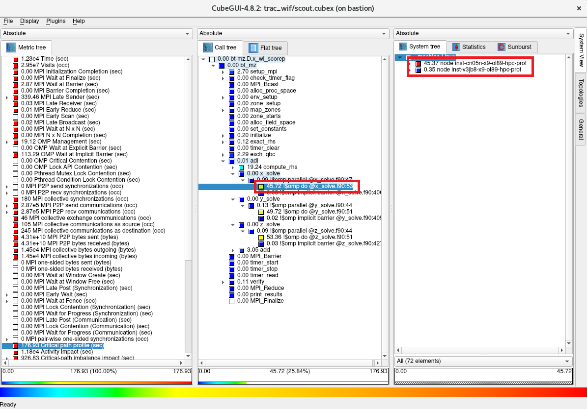
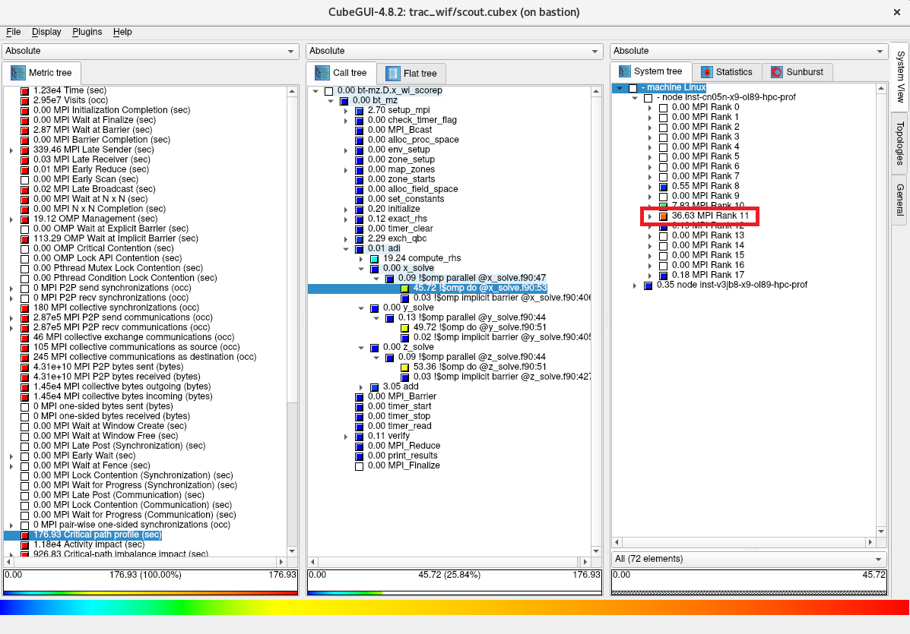

# 0. 概要

**[Score-P](https://www.vi-hps.org/projects/score-p/)** は、HPCワークロードを高並列に実行するアプリケーションをスケーラブルで簡易にプロファイリング（※1）することを目的に開発されたオープンソースのプロファイリングツールで、以下の代表的な並列プログラミングモデルに対応しています。

- スレッド並列
    - OpenMP
    - Pthreads
- プロセス並列
    - MPI
    - SHMEM
- GPU並列
    - CUDA
    - OpenCL
    - OpenACC

また **Score-P** は、並列アプリケーションの評価指標に対して、統計的に扱うプロファイリング手法（※1）とタイムスタンプと共に扱うトレーシング手法（※1）の何れにも対応しており、解析用途に合わせたプロファイリングが可能です。

※1）本プロファイリング関連Tipsでは、性能向上を目的とした並列アプリケーションの性能解析プロセス全般を **プロファイリング** と呼称し、この中で評価指標を統計的に扱う **プロファイリング** の1つの方法を **プロファイリング手法** と呼称します。これに対し、評価指標をタイムスタンプと共に扱う **プロファイリング** の1つの方法を **トレーシング手法** と呼称します。

また **Score-P** は、 **[PAPI](https://icl.utk.edu/papi/)** が取得するハードウェアカウンタ等の情報を取り込むことで、以下のように浮動小数点演算数等の情報をサブルーチンや関数単位で集計することが可能です。


**[Scalasca](https://www.scalasca.org/)** は、 **Score-P** が出力するトレーシング手法のデータをタイムスタンプ情報を元に解析する機能を持ち、並列アプリケーションのクリティカルパスの特定やプロセス間・スレッド間で発生する待ち時間等、プロファイリング手法では得られない情報を提供します。

また **Scalasca** は、 **Score-P** のフロントエンドとしても機能し、殆どの **Score-P** の操作を **Scalasca** から実施することが可能です。

**[CubeGUI](https://www.scalasca.org/scalasca/software/cube-4.x/download.html)** は、**Score-P** が出力するプロファイリング手法のデータを読み込むことで、プロファイリング対象の並列アプリケーションを以下の3評価軸で表示し、

- 評価指標軸
    - CPU時間
    - MPI通信データ量
    - I/Oデータ量
- コールツリー軸
    - サブルーチン・関数
    - MPI関数
    - OpenMPループ
- システム位置軸
    - ノード
    - MPIプロセス
    - OpneMPスレッド

以下のようにGUIで視覚的に表示することで、


以下の観点で並列アプリケーションをプロファイリングすることが可能です。

- MPI通信によるスケーラビリティへの影響
    - MPI通信が全体に対してどの程度の時間を占めているか
    - 最も通信データ量の多いMPI関数は何か
    - 各MPIプロセスのMPI通信データ量に偏りがあるか
- ロードバランス不均衡によるスケーラビリティへの影響
    - MPIで並列化されたループの実行に各計算ノードがどの程度時間を要しているか
    - MPIで並列化されたループの実行に各MPIプロセスがどの程度時間を要しているか
    - OpenMPで並列化されたループの実行に各OpenMPスレッドがどの程度時間を要しているか
- ホットスポットの特定
    - 最も時間を要しているサブルーチンはどこか
    - 最もMPI通信データ量の多いMPI関数はどのサブルーチンから呼ばれているか
- I/Oによるスケーラビリティへの影響
    - I/Oがどの程度の時間を要しているか

また **CubeGUI** は、 **Scalasca** がトレーシング手法のデータを解析した結果を読み込んで、以下のようにGUIで確認することが可能です。


以上の各ツールの関係は、 **[Score-Pのウェブサイト](https://perftools.pages.jsc.fz-juelich.de/cicd/scorep/tags/latest/html/)** に記載のある以下のアーキテクチャ図が参考になります。


以上を踏まえて本プロファイリング関連Tipsは、 **Score-P** と **Scalasca** をインストールした計算ノードをインターコネクトでノード間接続するHPCクラスタで並列アプリケーションのプロファイリング情報を取得し、これを **CubeGUI** をインストールしたBastionノードでプロファイリング手法とトレーシング手法を使用して解析する手順を解説します。  
なお **CubeGUI** は、GUIの描画にXウィンドウシステムを使用するため、Xサーバの稼働する **CubeGUI** 操作端末にこの操作画面を表示し、これを操作する方法を解説します。  
またプロファイリング対象の並列アプリケーションは、 **[NAS Parallel Benchmarks](https://www.nas.nasa.gov/software/npb.html)** を使用して解説を進めます。

本プロファイリング関連Tipsは、以下の環境を前提とします。

- 計算ノード
    - シェイプ： **[BM.Optimized3.36](https://docs.oracle.com/ja-jp/iaas/Content/Compute/References/computeshapes.htm#bm-hpc-optimized)**
    - ノード数： 2ノード以上
    - イメージ： **Oracle Linux** 9.05ベースのHPC **[クラスタネットワーキングイメージ](../../#5-13-クラスタネットワーキングイメージ)** （※1）
- ノード間接続インターコネクト
    - **[クラスタ・ネットワーク](../../#5-1-クラスタネットワーク)** 
    - リンク速度： 100 Gbps
- Bastionノード
    - シェイプ ： **[VM.Standard.E5.Flex](https://docs.oracle.com/ja-jp/iaas/Content/Compute/References/computeshapes.htm#flexible)**
    - イメージ： **Oracle Linux** 9.05ベースのHPC **クラスタネットワーキングイメージ** （※1）
- **Score-P** ：9.4
- **Scalasca** ：2.6.2
- **CubeGUI** ：4.9.1
- MPI： **[OpenMPI](https://www.open-mpi.org/)** 5.0.8（※2）
- **PAPI** ：7.2.0（※3）

※1）**[OCI HPCテクニカルTips集](../../#3-oci-hpcテクニカルtips集)** の **[クラスタネットワーキングイメージの選び方](../../tech-knowhow/osimage-for-cluster/)** の **[1. クラスタネットワーキングイメージ一覧](../../tech-knowhow/osimage-for-cluster/#1-クラスタネットワーキングイメージ一覧)** の **No.13** です。  
※2） **[OCI HPCテクニカルTips集](../../#3-oci-hpcテクニカルtips集)** の **[Slurm環境での利用を前提とするUCX通信フレームワークベースのOpenMPI構築方法](../../tech-knowhow/build-openmpi/)** に従って構築された **OpenMPI** です。  
※3） **[OCI HPCプロファイリング関連Tips集](../../#2-3-プロファイリング関連tips集)** の **[PAPIでHPCアプリケーションをプロファイリング](../papi-profiling/)** に従って構築された **PAPI** です。


なお、本プロファイリング関連Tipsで構築したプロファイリング環境を使用して実アプリケーションにプロファイリング・チューニングを適用する実例は、 **[OCI HPCパフォーマンス関連情報](../../#2-oci-hpcパフォーマンス関連情報)** の **[プロファイリング情報に基づく並列アプリケーションチューニング方法](../profiling-tuning/)** を参照してください。

以降では、以下の順に解説します。

1. **[HPCクラスタ構築](#1-hpcクラスタ構築)**
2. **[プロファイリングツールインストール](#2-プロファイリングツールインストール)**
3. **[プロファイリング手法データの取得](#3-プロファイリング手法データの取得)**
4. **[プロファイリング手法データの確認](#4-プロファイリング手法データの確認)**
5. **[トレーシング手法データの取得](#5-トレーシング手法データの取得)**
6. **[トレーシング手法データの確認](#6-トレーシング手法データの確認)**

# 1. HPCクラスタ構築

本章は、本プロファイリング関連Tipsで使用するHPCクラスタを構築します。

この構築は、 **[OCI HPCチュートリアル集](../../#1-oci-hpcチュートリアル集)** の **[HPCクラスタを構築する(基礎インフラ手動構築編)](../../spinup-cluster-network/)** の手順に従う等で実施します。

この際、計算ノードとBastionノードを以下のように構成します。

- 計算ノード **ブート・ボリューム** サイズ ： 100GB以上（インストールするソフトウェアの容量確保のため）
- 計算ノードSMT : 無効（※4）
- Bastionノード **ブート・ボリューム** サイズ ： 200GB以上（インストールするソフトウェアの容量確保のため）
- Bastionノードコア数 ： 8コア（ **CubeGUI** のコンパイル高速化のため）

※4）SMTを無効化する方法は、 **[OCI HPCパフォーマンス関連情報](../../#2-oci-hpcパフォーマンス関連情報)** の **[パフォーマンスに関連するベアメタルインスタンスのBIOS設定方法](../../benchmark/bios-setting/)** を参照してください。  

また計算ノードは、プロファイリング利用ユーザのホームディレクトリをNFSで共有します。

# 2. プロファイリングツールインストール

## 2-0. 概要

本章は、プロファイリングツールとその前提条件ソフトウェアのインストールを以下の順に実施します。

1. **[OpenMPIインストール](#2-1-openmpiインストール)**
2. **[PAPIインストール](#2-2-papiインストール)**
3. **[Score-Pインストール](#2-3-score-pインストール)**
4. **[Scalascaインストール](#2-4-scalascaインストール)**
5. **[CubeGUIインストール](#2-5-cubeguiインストール)**

## 2-1. OpenMPIインストール

**OpenMPI** のインストールは、 **[OCI HPCテクニカルTips集](../../#3-oci-hpcテクニカルtips集)** の **[Slurm環境での利用を前提とするUCX通信フレームワークベースのOpenMPI構築方法](../../tech-knowhow/build-openmpi/)** の **[1. インストール・セットアップ](../../tech-knowhow/build-openmpi/#1-インストールセットアップ)** の手順に従い、全ての計算ノードに実施します。

## 2-2. PAPIインストール

**PAPI** のインストールは、 **[OCI HPCプロファイリング関連Tips集](../../#2-3-プロファイリング関連tips集)** の **[PAPIでHPCアプリケーションをプロファイリング](../papi-profiling/)** の **[2-2. PAPIインストール](../papi-profiling/#2-2-papiインストール)** の手順に従い、全ての計算ノードに実施します。

## 2-3. Score-Pインストール

以下コマンドを全ての計算ノードのopcユーザで実行し、 **Score-P** の前提条件ソフトウェアをインストールします。

```sh
$ sudo yum-config-manager --enable ol9_codeready_builder ol9_developer_EPEL
$ sudo dnf install -y binutils-devel libunwind libunwind-devel gcc-plugin-devel llvm-devel clang-devel cmake gcc-plugin-devel
```

次に、以下コマンドを全ての計算ノードのrootユーザで実行し、 **Score-P** をインストールします。  
これにより、 **Score-P** が **/opt/scorep** にインストールされます。

```sh
$ mkdir -p ~/`hostname` && cd ~/`hostname` && wget https://perftools.pages.jsc.fz-juelich.de/cicd/scorep/tags/scorep-9.4/scorep-9.4.tar.gz
$ tar -xvf ./scorep-9.4.tar.gz
$ module load openmpi papi
$ cd scorep-9.4 && ./configure --with-libgotcha=download
$ make -j && make install; echo $?
```

次に、以下のファイルを **/usr/share/Modules/modulefiles/scorep** で作成します。  
このファイルは、 **[Environment Modules](https://envmodules.io/)** にモジュール名 **scorep** を登録し、これをロードすることで **Score-P** 利用環境の設定を可能にします

```sh
#%Module1.0
##
## Score-P for OpenMPI

proc ModulesHelp { } {
        puts stderr "Score-P for OpenMPI\n"
}

module-whatis "Score-P for OpenMPI"

set pkg_root  /opt/scorep
set ver       9.4

prepend-path PATH   $pkg_root/bin
```

## 2-4. Scalascaインストール

以下コマンドを全ての計算ノードのrootユーザで実行し、 **Scalasca** をインストールします。  
これにより、 **Scalasca** が **/opt/scalasca** にインストールされます。

```sh
$ cd ~/`hostname` && wget https://apps.fz-juelich.de/scalasca/releases/scalasca/2.6/dist/scalasca-2.6.2.tar.gz
$ tar -xvf ./scalasca-2.6.2.tar.gz
$ cd scalasca-2.6.2 && ./configure
$ make -j && make install; echo $?
```

次に、以下のファイルを **/usr/share/Modules/modulefiles/scalasca** で作成します。  
このファイルは、 **[Environment Modules](https://envmodules.io/)** にモジュール名 **scalasca** を登録し、これをロードすることで **Scalasca** 利用環境の設定を可能にします

```sh
#%Module1.0
##
## Scalasca for OpenMPI

proc ModulesHelp { } {
        puts stderr "Scalasca for OpenMPI\n"
}

module-whatis "Scalasca for OpenMPI"

set pkg_root  /opt/scalasca
set ver       2.6.2

prepend-path PATH   $pkg_root/bin
```

次に、以下コマンドをrootユーザで実行した結果となるよう、 **sshd_config** ファイルを修正します。  
これは、 **Score-P** と **Scalasca** 実行に必要な環境変数をSSH経由でリモートノードに引き渡すために必要です。  
なお、以降のSSHに関連する手順は、プロファイリングジョブをジョブスケジューラを介して実行することでリモートノードへの環境変数の引き渡しが行われる場合は、実施する必要がありません。

```sh
$ diff /etc/ssh/sshd_config_org /etc/ssh/sshd_config
107c107
< #PermitUserEnvironment no
---
> PermitUserEnvironment yes
131a132
> AcceptEnv SCOREP_* SCAN_*
$
```

次に、以下コマンドをrootユーザで実行し、先の **sshd_config** ファイルの修正を反映します。

```sh
$ systemctl restart sshd
```

次に、以下のファイルを **Score-P** を利用するユーザで作成し、このパーミッションを **600** とします。  
これは、 **Score-P** と **Scalasca** 実行に必要な環境変数をSSH経由でリモートノードに引き渡すために必要です。

```sh
$ cat ~/.ssh/config 
Host *
SendEnv SCOREP_* SCAN_*
$
```

## 2-5. CubeGUIインストール

以下コマンドをBastionノードのopcユーザで実行し、 **CubeGUI** の前提条件ソフトウェアである **[Qt](https://www.qt.io/)** の前提条件ソフトウェアをインストールします。

```sh
$ sudo yum-config-manager --enable ol9_codeready_builder ol9_developer_EPEL
$ sudo dnf install -y cmake mesa-libGL mesa-libGL-devel mesa-dri-drivers git xauth xcb-proto xcb-util-devel xcb-util-wm xcb-util-wm-devel xcb-util-cursor xcb-util-cursor-devel libXrender-devel xcb-util-keysyms xcb-util-keysyms-devel libxkbcommon-devel libxkbcommon-x11 libxkbcommon-x11-devel fontconfig-devel freetype-devel libXext-devel libSM-devel libICE-devel
```

次に、以下コマンドをBastionノードのopcユーザで実行し、 **CubeGUI** の前提条件ソフトウェアである **Qt** をインストールします。  
これにより、 **Qt** が **/usr/local/Qt-5.15.18** にインストールされます。
本手順は、8コアのVMインスタンスで40分程度を要します。

```sh
$ mkdir -p ~/`hostname` && cd ~/`hostname` && git clone https://code.qt.io/qt/qt5.git
$ cd qt5 && git checkout 5.15
$ perl init-repository
$ ./configure -opensource -confirm-license -nomake examples -nomake tests
$ make -j && sudo make install
```

次に、以下コマンドをBastionノードのopcユーザで実行し、 **CubeGUI** の前提条件ソフトウェアである **CubeLib** をインストールします。

```sh
$ cd ~/`hostname` && wget https://apps.fz-juelich.de/scalasca/releases/cube/4.9/dist/cubelib-4.9.1.tar.gz
$ tar -xvf ./cubelib-4.9.1.tar.gz
$ cd cubelib-4.9.1 && ./configure
$ make -j && sudo make install; echo $?
```

次に、以下コマンドをBastionノードのopcユーザで実行し、 **CubeGUI** をインストールします。  
これにより、 **CubeGUI** が **/opt/cubegui** にインストールされます。

```sh
$ cd ~/`hostname` && wget https://apps.fz-juelich.de/scalasca/releases/cube/4.9/dist/cubegui-4.9.1.tar.gz
$ tar -xvf ./cubegui-4.9.1.tar.gz
$ cd cubegui-4.9.1 && ./configure --with-qt=/usr/local/Qt-5.15.18/bin --with-cubelib=/opt/cubelib/bin
$ make -j && sudo make install; echo $?
```

次に、以下のファイルを **/usr/share/Modules/modulefiles/cubegui** で作成します。  
このファイルは、 **[Environment Modules](https://envmodules.io/)** にモジュール名 **cubegui** を登録し、これをロードすることで **CubeGUI** 利用環境の設定を可能にします

```sh
#%Module1.0
##
## CubeGUI

proc ModulesHelp { } {
        puts stderr "CubeGUI\n"
}

module-whatis "CubeGUI"

set pkg_root  /opt/cubegui
set ver       4.9.1

prepend-path PATH   $pkg_root/bin
prepend-path PATH   /usr/local/Qt-5.15.18/bin
```

次に、Xサーバの稼働する **CubeGUI** 操作端末から以下コマンドを実行し、Xフォワードを有効にしてBastionノードにプロファイリング利用ユーザでログインします。

```sh
$ ssh -X user@bastion_IP
Activate the web console with: systemctl enable --now cockpit.socket

Last login: Tue Apr 23 10:35:11 2024 from x.y.z.w
/usr/bin/xauth:  file /home/opc/.Xauthority does not exist
$ printenv DISPLAY
localhost:10.0
$
```

次に、以下コマンドをプロファイリング利用ユーザで実行し、

```sh
$ module load cubegui
$ cube
```

以下のように **CubeGUI** のスタート画面が起動することを確認します。


# 3. プロファイリング手法データの取得

## 3-0. 概要

本章は、**NAS Parallel Benchmarks** をプロファイリング対象とし、 **Scalasca** から起動する **Score-P** でプロファイリング手法によるデータを実施します。  
ここでは、ノードあたり36コアを搭載する **BM.Optimized3.36** を2ノード使用することから、36 MPIプロセス・2 OpenMPスレッドの組み合わせを使用します。  
この際、プロファイリングによるオーバーヘッドを考慮した精度の良いプロファイリングを **PAPI** による浮動小数点演算数を含まない場合と含む場合で取得するため、以下の手順で実施します。

1. **[事前準備](#3-1-事前準備)**
    - **NAS Parallel Benchmarks** バイナリの作成
    - プロファイリングを実施しない場合の実行時間を計測
    - プロファイリングを実施した場合の実行時間を計測
    - 両者に隔たりがある場合プロファイリング対象を限定するフィルタを作成
2. **[浮動小数点演算数を含まないプロファイリング手法データの取得](#3-2-浮動小数点演算数を含まないプロファイリング手法データの取得)**
    - フィルタを適用して浮動小数点演算数を含まないプロファイリングを実施
    - 先の実行時間の隔たりが解消していることを確認
3. **[浮動小数点演算数を含むプロファイリング手法データの取得](#3-3-浮動小数点演算数を含むプロファイリング手法データの取得)**
    - フィルタを適用して浮動小数点演算数を含むプロファイリングを実施
    - 先の実行時間の隔たりが解消していることを確認

## 3-1. 事前準備

以下コマンドを何れかの計算ノードのプロファイリング利用ユーザで実行し、プロファイリングを実施しない **NAS Parallel Benchmarks** のバイナリ（**bt-mz.D.x_wo_scorep**）とプロファイリングを実施する **NAS Parallel Benchmarks** のバイナリ（**bt-mz.D.x_wi_scorep**）を作成します。

```sh
$ cd ~ && wget https://www.nas.nasa.gov/assets/npb/NPB3.4.3-MZ.tar.gz
$ tar -xvf ./NPB3.4.3-MZ.tar.gz
$ cd NPB3.4.3-MZ/NPB3.4-MZ-MPI
$ cp config/make.def.template config/make.def
$ module load openmpi papi
$ make bt-mz CLASS=D
$ mv bin/bt-mz.D.x bin/bt-mz.D.x_wo_scorep
$ sed -i 's/^FC = mpif90/FC = scorep-mpif90/g' config/make.def
$ diff config/make.def.template config/make.def
32c32
< FC = mpif90
---
> FC = scorep-mpif90
$ make clean
$ make bt-mz CLASS=D
$ mv bin/bt-mz.D.x bin/bt-mz.D.x_wi_scorep
```

次に、以下コマンドを何れかの計算ノードのプロファイリング利用ユーザで実行し、プロファイリングを実施しない場合の実行時間を計測します。

```sh
$ mpirun -n 36 -N 18 -machinefile ~/hostlist.txt -x UCX_NET_DEVICES=mlx5_2:1 -x OMP_NUM_THREADS=2 -bind-to none ./bin/bt-mz.D.x_wo_scorep | grep "Time in seconds"
 Time in seconds =                   164.46
$
```

次に、以下コマンドを何れかの計算ノードのプロファイリング利用ユーザで実行し、プロファイリングを実施した場合の実行時間を計測します。  
この実行により、カレントディレクトリにディレクトリ **scorep_bt-mz_18p36xO_sum** が作成され、ここに取得したプロファイリングデータが格納されます。

```sh
$ module load scorep scalasca
$ scalasca -analyze mpirun -n 36 -N 18 -machinefile ~/hostlist.txt "-x UCX_NET_DEVICES=mlx5_2:1" "-x OMP_NUM_THREADS=2" "-x LD_LIBRARY_PATH" "-bind-to none" ./bin/bt-mz.D.x_wi_scorep 2>&1 | grep "Time in seconds"
 Time in seconds =                   359.84
$
```

次に、両者の実行時間に2倍以上の隔たりがあるため、以下のコマンドを計算ノードのプロファイリング利用ユーザで実行し、プロファイリングのオーバーヘッドの原因を調査します。

```sh
$ scalasca -examine -s scorep_bt-mz_18p36xO_sum
INFO: Post-processing runtime summarization report (profile.cubex)...
/opt/scorep/bin/scorep-score  -r ./scorep_bt-mz_18p36xO_sum/profile.cubex > ./scorep_bt-mz_18p36xO_sum/scorep.score
INFO: Score report written to ./scorep_bt-mz_18p36xO_sum/scorep.score
$ head -n 35 scorep_bt-mz_18p36xO_sum/scorep.score

Estimated aggregate size of event trace:                   3329GB
Estimated requirements for largest trace buffer (max_buf): 94GB
Estimated memory requirements (SCOREP_TOTAL_MEMORY):       94GB
(warning: The memory requirements cannot be satisfied by Score-P to avoid
 intermediate flushes when tracing. Set SCOREP_TOTAL_MEMORY=4G to get the
 maximum supported memory or reduce requirements using USR regions filters.)

flt     type     max_buf[B]          visits  time[s] time[%] time/visit[us]  region
         ALL 99,883,283,163 137,448,437,987 25744.79   100.0           0.19  ALL
         USR 99,849,533,550 137,419,676,413 12360.21    48.0           0.09  USR
         OMP     29,449,094      24,287,232 12941.42    50.3         532.85  OMP
         COM      2,660,710       3,613,660    11.37     0.0           3.15  COM
         MPI      1,793,380         860,646   431.78     1.7         501.69  MPI
      SCOREP             41              36     0.00     0.0          28.54  SCOREP

         USR 32,473,108,434  44,677,967,872  5515.58    21.4           0.12  binvcrhs
         USR 32,473,108,434  44,677,967,872  4301.58    16.7           0.10  matmul_sub
         USR 32,473,108,434  44,677,967,872  2258.69     8.8           0.05  matvec_sub
         USR    858,664,976   1,152,495,616   135.90     0.5           0.12  lhsinit
         USR    858,664,976   1,152,495,616    95.04     0.4           0.08  binvrhs
         USR    783,427,736   1,080,078,336    53.18     0.2           0.05  exact_solution
         OMP      2,533,092       1,028,096     0.15     0.0           0.15  !$omp parallel @exch_qbc.f90:206
         OMP      2,533,092       1,028,096     0.15     0.0           0.14  !$omp parallel @exch_qbc.f90:217
         OMP      2,533,092       1,028,096     0.17     0.0           0.16  !$omp parallel @exch_qbc.f90:245
         OMP      2,533,092       1,028,096     0.15     0.0           0.15  !$omp parallel @exch_qbc.f90:256
         OMP      1,271,592         516,096     1.30     0.0           2.51  !$omp parallel @rhs.f90:29
         OMP      1,266,546         514,048     0.40     0.0           0.78  !$omp parallel @z_solve.f90:44
         OMP      1,266,546         514,048     0.30     0.0           0.58  !$omp parallel @x_solve.f90:47
         OMP      1,266,546         514,048     0.16     0.0           0.32  !$omp parallel @add.f90:23
         OMP      1,266,546         514,048     0.32     0.0           0.62  !$omp parallel @y_solve.f90:44
         MPI        781,865         286,642     0.32     0.0           1.12  MPI_Irecv
         MPI        781,865         286,642     0.93     0.0           3.26  MPI_Isend
         COM        757,016       1,028,096     2.35     0.0           2.28  copy_x_face
         COM        757,016       1,028,096     2.18     0.0           2.12  copy_y_face
$
```

この出力から、呼び出された回数を示す **visits** 列の値が大きい **region** 列を特定し、これに従いプロファイリング対象からこれらの **region** を除外する以下のフィルタを作成します。

```sh
$ cat ./scorep.filt
SCOREP_REGION_NAMES_BEGIN
    EXCLUDE
        binvcrhs
        matmul_sub
        matvec_sub
        lhsinit
        binvrhs
        exact_solution
SCOREP_REGION_NAMES_END
$
```

次に、以下コマンドを何れかの計算ノードのプロファイリング利用ユーザで実行し、先のプロファイリングデータを格納するディレクトリを次の実行に備えて別名に変更します。

```sh
$ mv scorep_bt-mz_18p36xO_sum prof_wof_wopapi
```

## 3-2. 浮動小数点演算数を含まないプロファイリング手法データの取得

以下コマンドを何れかの計算ノードのプロファイリング利用ユーザで実行し、フィルタを適用して浮動小数点演算数を含まないプロファイリング手法データを取得します。  
この際、その実行時間を **[3.1. 事前準備](#3-1-事前準備)** のプロファイリングを実施しない場合のもの（164.46秒）と比較し、両者の隔たりが解消していることを確認します。

```sh
$ scalasca -analyze -f ./scorep.filt mpirun -n 36 -N 18 -machinefile ~/hostlist.txt "-x UCX_NET_DEVICES=mlx5_2:1" "-x OMP_NUM_THREADS=2" "-x LD_LIBRARY_PATH" "-bind-to none" ./bin/bt-mz.D.x_wi_scorep 2>&1 | grep "Time in seconds"
 Time in seconds =                   169.91
$
```

次に、以下コマンドを何れかの計算ノードのプロファイリング利用ユーザで実行し、浮動小数点演算数を含まないプロファイリングレポートを作成します。

```sh
$ scalasca -examine -s scorep_bt-mz_18p36xO_sum
```

次に、以下コマンドを何れかの計算ノードのプロファイリング利用ユーザで実行し、フィルタの適用により除外した **region** が表示されないことを確認します。

```sh
$ head -n 35 scorep_bt-mz_18p36xO_sum/scorep.score

Estimated aggregate size of event trace:                   1155MB
Estimated requirements for largest trace buffer (max_buf): 33MB
Estimated memory requirements (SCOREP_TOTAL_MEMORY):       37MB
(hint: When tracing set SCOREP_TOTAL_MEMORY=37MB to avoid intermediate flushes
 or reduce requirements using USR regions filters.)

flt     type max_buf[B]     visits  time[s] time[%] time/visit[us]  region
         ALL 34,411,239 29,464,803 12043.87   100.0         408.75  ALL
         OMP 29,449,094 24,287,232 11718.50    97.3         482.50  OMP
         COM  2,660,710  3,613,660    10.97     0.1           3.04  COM
         MPI  1,793,380    860,646   314.17     2.6         365.04  MPI
         USR    508,014    703,229     0.24     0.0           0.34  USR
      SCOREP         41         36     0.00     0.0          28.64  SCOREP

         OMP  2,533,092  1,028,096     0.15     0.0           0.15  !$omp parallel @exch_qbc.f90:206
         OMP  2,533,092  1,028,096     0.15     0.0           0.15  !$omp parallel @exch_qbc.f90:217
         OMP  2,533,092  1,028,096     0.17     0.0           0.17  !$omp parallel @exch_qbc.f90:245
         OMP  2,533,092  1,028,096     0.15     0.0           0.15  !$omp parallel @exch_qbc.f90:256
         OMP  1,271,592    516,096     1.22     0.0           2.37  !$omp parallel @rhs.f90:29
         OMP  1,266,546    514,048     0.59     0.0           1.15  !$omp parallel @z_solve.f90:44
         OMP  1,266,546    514,048     0.50     0.0           0.97  !$omp parallel @x_solve.f90:47
         OMP  1,266,546    514,048     0.15     0.0           0.29  !$omp parallel @add.f90:23
         OMP  1,266,546    514,048     0.53     0.0           1.04  !$omp parallel @y_solve.f90:44
         MPI    781,865    286,642     0.32     0.0           1.10  MPI_Irecv
         MPI    781,865    286,642     0.93     0.0           3.23  MPI_Isend
         COM    757,016  1,028,096     2.31     0.0           2.24  copy_x_face
         COM    757,016  1,028,096     2.15     0.0           2.09  copy_y_face
         OMP    757,016  1,028,096    11.37     0.1          11.06  !$omp do @exch_qbc.f90:206
         OMP    757,016  1,028,096     1.22     0.0           1.19  !$omp implicit barrier @exch_qbc.f90:215
         OMP    757,016  1,028,096     8.50     0.1           8.27  !$omp do @exch_qbc.f90:217
         OMP    757,016  1,028,096     0.98     0.0           0.96  !$omp implicit barrier @exch_qbc.f90:226
         OMP    757,016  1,028,096    18.06     0.1          17.57  !$omp do @exch_qbc.f90:245
         OMP    757,016  1,028,096     2.96     0.0           2.88  !$omp implicit barrier @exch_qbc.f90:254
         OMP    757,016  1,028,096    11.84     0.1          11.52  !$omp do @exch_qbc.f90:256
$
```

次に、以下コマンドを何れかの計算ノードのプロファイリング利用ユーザで実行し、プロファイリングデータ格納ディレクトリを次の実行に備えて別名に変更します。

```sh
$ mv scorep_bt-mz_18p36xO_sum prof_wif_wopapi
```

## 3-3. 浮動小数点演算数を含むプロファイリング手法データの取得

以下コマンドを何れかの計算ノードのプロファイリング利用ユーザで実行し、フィルタを適用して浮動小数点演算数を含むプロファイリング手法データを取得します。  
この際、その実行時間を **[3.1. 事前準備](#3-1-事前準備)** のプロファイリングを実施しない場合のもの（164.46秒）と比較し、両者に大きな隔たりが無いことを確認します。

```sh
$ SCOREP_METRIC_PAPI=PAPI_FP_OPS scalasca -analyze -f ./scorep.filt mpirun -n 36 -N 18 -machinefile ~/hostlist.txt "-x UCX_NET_DEVICES=mlx5_2:1" "-x OMP_NUM_THREADS=2" "-x LD_LIBRARY_PATH" "-bind-to none" ./bin/bt-mz.D.x_wi_scorep 2>&1 | grep "Time in seconds"
 Time in seconds =                   169.30
$
```

次に、以下コマンドを何れかの計算ノードのプロファイリング利用ユーザで実行し、浮動小数点演算数を含むプロファイリングレポートを作成します。

```sh
$ scalasca -examine -s scorep_bt-mz_18p36xO_sum
```

次に、以下コマンドを何れかの計算ノードのプロファイリング利用ユーザで実行し、プロファイリングデータ格納ディレクトリを次の実行に備えて別名に変更します。

```sh
$ mv scorep_bt-mz_18p36xO_sum prof_wif_wipapi
```

# 4. プロファイリング手法データの確認

## 4-0. 概要

本章は、先に取得したプロファイリング手法のデータを、 浮動小数点演算数を含まないものと含むものに分けて、その確認を行います。  
なお、 **[3. プロファイリング手法データの取得](#3-プロファイリング手法データの取得)** により、十分精度の期待できるプロファイリング手法を用いたプロファイリングのデータが計算ノードのプロファイリング利用ユーザのホームディレクトリ配下の以下ディレクトリに作成されているため、以降の手順に備えてこれらをBastionノードのプロファイリング利用ユーザのホームディレクトリ配下に予めコピーしておきます。

-  **prof_wif_wopapi** ：浮動小数点演算数を含まない
-  **prof_wif_wipapi** ：浮動小数点演算数を含む

## 4-1. 浮動小数点演算数を含まないプロファイリング手法データの確認

以下コマンドを何れかの計算ノードのプロファイリング利用ユーザで実行し、トータル時間を評価指標としたプロファイリング結果を表示します。

```sh
$ scalasca -examine -s -x "-s totaltime" prof_wif_wopapi
/opt/scorep/bin/scorep-score  -s totaltime -r ./prof_wif_wopapi/profile.cubex > ./prof_wif_wopapi/scorep.score
INFO: Score report written to ./prof_wif_wopapi/scorep.score
$ head -n 35 prof_wif_wopapi/scorep.score

Estimated aggregate size of event trace:                   1155MB
Estimated requirements for largest trace buffer (max_buf): 33MB
Estimated memory requirements (SCOREP_TOTAL_MEMORY):       37MB
(hint: When tracing set SCOREP_TOTAL_MEMORY=37MB to avoid intermediate flushes
 or reduce requirements using USR regions filters.)

flt     type max_buf[B]     visits  time[s] time[%] time/visit[us]  region
         ALL 34,411,239 29,464,803 12043.87   100.0         408.75  ALL
         OMP 29,449,094 24,287,232 11718.50    97.3         482.50  OMP
         MPI  1,793,380    860,646   314.17     2.6         365.04  MPI
         COM  2,660,710  3,613,660    10.97     0.1           3.04  COM
         USR    508,014    703,229     0.24     0.0           0.34  USR
      SCOREP         41         36     0.00     0.0          28.64  SCOREP

         OMP    378,508    514,048  3531.27    29.3        6869.52  !$omp do @z_solve.f90:51
         OMP    378,508    514,048  3413.06    28.3        6639.57  !$omp do @y_solve.f90:51
         OMP    378,508    514,048  3170.22    26.3        6167.17  !$omp do @x_solve.f90:53
         OMP    380,016    516,096   336.79     2.8         652.56  !$omp do @rhs.f90:77
         OMP    380,016    516,096   325.89     2.7         631.46  !$omp do @rhs.f90:292
         OMP    380,016    516,096   322.78     2.7         625.43  !$omp do @rhs.f90:182
         MPI    228,410    286,642   283.10     2.4         987.64  MPI_Waitall
         OMP    380,016    516,096   134.79     1.1         261.17  !$omp do @rhs.f90:59
         OMP    380,016    516,096   130.07     1.1         252.02  !$omp do @rhs.f90:34
         OMP    378,508    514,048   118.20     1.0         229.93  !$omp do @add.f90:23
         OMP    380,016    516,096    41.01     0.3          79.46  !$omp do @rhs.f90:399
         OMP    378,508    514,048    33.31     0.3          64.79  !$omp implicit barrier @z_solve.f90:427
         OMP    378,508    514,048    28.57     0.2          55.58  !$omp implicit barrier @y_solve.f90:405
         MPI         84         36    27.49     0.2      763540.87  MPI_Init
         OMP    378,508    514,048    19.52     0.2          37.98  !$omp implicit barrier @x_solve.f90:406
         OMP    757,016  1,028,096    18.06     0.1          17.57  !$omp do @exch_qbc.f90:245
         OMP    380,016    516,096    12.81     0.1          24.83  !$omp implicit barrier @rhs.f90:410
         OMP    757,016  1,028,096    11.84     0.1          11.52  !$omp do @exch_qbc.f90:256
         OMP    757,016  1,028,096    11.37     0.1          11.06  !$omp do @exch_qbc.f90:206
         OMP    380,016    516,096    11.09     0.1          21.50  !$omp implicit barrier @rhs.f90:69
$
```

この出力から、以下のことがわかります。

- 以下のソースプログラム中のOpenMPループでそれぞれトータル時間の30%弱を占めている
    - **z_solve.f90** の51行目
    - **y_solve.f90** の51行目
    - **x_solve.f90** の53行目
- MPI通信時間がトータル時間の **2.6%** を占めている
- MPI_Waitall関数がトータル時間の **2.4%** を占めておりこの分プロセス間のロードバランスに問題がある

次に、以下コマンドをBastionノードのプロファイリング利用ユーザで実行し、 **CubeGUI** を起動します。

```sh
$ module load cubegui
$ cube path_to_dir/prof_wif_wopapi/profile.cubex
```


次に、以下画面の評価指標軸で **Time** をクリックし、トータル時間が12,000秒であることを確認します。


次に、以下画面のコールツリー軸で色がより赤に近いサブルーチンを辿り、最上位のサブルーチンで最も時間を占めている **adi** を突き止めます。


次に、以下画面のコールツリー軸で更に時間を要しているサブルーチンを辿り、先に確認したそれぞれ30％弱のトータル時間を占めているOpenMPループが以下の順に呼び出されていることを確認します。

- **bt_mz** -> **adi** -> **x_solve** -> **x_solve.f90** の53行目
- **bt_mz** -> **adi** -> **y_solve** -> **y_solve.f90** の51行目
- **bt_mz** -> **adi** -> **z_solve** -> **z_solve.f90** の51行目


次に、以下画面のコールツリー軸で **x_solve.f90:53** をクリックし、システム位置軸を1階層下がり、このOpenMPループの3,170.22秒の内訳が2台の計算ノードでそれぞれ1,576.64秒と1,593.58秒であることを確認します。


次に、以下画面のシステム位置軸を更に1階層下がり、このOpenMPループの3,170.22秒の内訳が36個のMPIプロセスにどのように配分されているかを確認します。


次に、以下画面のシステム位置軸で1番目の計算ノードのランク0のMPIプロセスをクリックし、このMPIプロセスの87.72秒の内訳が2個のOpenMPスレッドにどのように配分されているかを確認します。


次に、以下画面の評価指標軸で **bytes_sent** をクリックし、MPI通信の総送信データ量が43.1Gバイトであることを確認します。


次に、以下画面のコールツリー軸で色がより赤に近いサブルーチンを辿り、ほぼ全てのデータを送信しているのが以下の順に呼び出されたMPI_Isend関数であることを確認します。

- **bt_mz** -> **exch_qbc** -> **MPI_Isend**


次に、以下画面のコールツリー軸で **MPI_Isend** をクリックし、システム位置軸を1階層下がり、このMPI_Isend関数の総データ量の43.1Gバイトの内訳が2台の計算ノードでそれぞれ21.5Gバイトと21.6Gバイトであることを確認します。


次に、以下画面のシステム位置軸を更に1階層下がり、このMPI_Isend関数の総データ量の43.1Gバイトの内訳が36個のMPIプロセスにどのように配分されているかを確認します。


## 4-2. 浮動小数点演算数を含むプロファイリング手法データの確認

以下コマンドをBastionノードのプロファイリング利用ユーザで実行し、 **CubeGUI** を起動します。

```sh
$ module load cubegui
$ cube path_to_dir/prof_wif_wipapi/profile.cubex
```


次に、以下画面の評価指標軸で **PAPI_FP_OPS** をクリックし、総浮動小数点演算数が50.2TFLOPであることを確認します。


次に、以下画面のコールツリー軸で色がより赤に近いサブルーチンを辿り、最上位のサブルーチンで最も浮動小数点演算数の多い **adi** を突き止めます。


次に、以下画面のコールツリー軸で更に赤に近いサブルーチンを辿り、最も浮動小数点演算数の多い3個のOpenMPループでそれぞれ14.5TFLOP、14.6TFLOP、及び14.6TFLOP実行され、これらが以下の順に呼び出されていることを確認します。

- **bt_mz** -> **adi** -> **x_solve** -> **x_solve.f90** の53行目
- **bt_mz** -> **adi** -> **y_solve** -> **y_solve.f90** の51行目
- **bt_mz** -> **adi** -> **z_solve** -> **z_solve.f90** の51行目


次に、以下画面のコールツリー軸で **x_solve.f90:53** をクリックし、システム位置軸を1階層下がり、このOpenMPループの14.5TFLOPの内訳が2台の計算ノードでそれぞれ7.24TFLOPと7.22TFLOPであることを確認します。


次に、以下画面のシステム位置軸を更に1階層下がり、このOpenMPループの14.5TFLOPの内訳が36個のMPIプロセスにどのように配分されているかを確認します。


次に、以下画面のシステム位置軸で1番目の計算ノードのランク0のMPIプロセスをクリックし、このMPIプロセスの402GFLOPの内訳が2個のOpenMPスレッドにどのように配分されているかを確認します。


# 5. トレーシング手法データの取得

本章は、**NAS Parallel Benchmarks** をプロファイリング対象とし、 **Scalasca** から起動する **Score-P** でトレーシング手法によるデータを取得します。  
ここでは、先のプロファイリング手法と同様36 MPIプロセス・2 OpenMPスレッドの組み合わせを使用します。  
この際、プロファイリングによるオーバーヘッド発生を考慮した精度の良いプロファイリングデータを取得するため、先のプロファイリング手法で作成したフィルタを使用します。

以下コマンドを何れかの計算ノードのプロファイリング利用ユーザで実行し、フィルタを適用してトレーシング手法データを取得します。  
この際、その実行時間を **[3.1. 事前準備](#3-1-事前準備)** のプロファイリングを実施しない場合のもの（164.46秒）と比較し、両者に大きな隔たりが無いことを確認します。  
ここで、 **[3.2. 浮動小数点演算数を含まないプロファイリング手法データの取得](#3-2-浮動小数点演算数を含まないプロファイリング手法データの取得)** のフィルタを適用した際のプロファイリングレポートの出力 **Estimated memory requirements (SCOREP_TOTAL_MEMORY)** に表示されているトレーシング手法のデータを格納するために必要なメモリ領域サイズの37MBを環境変数に指定して実行することに留意します。

```sh
$ SCOREP_TOTAL_MEMORY=37M scalasca -analyze -q -t -f ./scorep.filt mpirun -n 36 -N 18 -machinefile ~/hostlist.txt "-x UCX_NET_DEVICES=mlx5_2:1" "-x OMP_NUM_THREADS=2" "-x LD_LIBRARY_PATH" "-bind-to none" ./bin/bt-mz.D.x_wi_scorep 2>&1 | grep "Time in seconds"
 Time in seconds =                   170.03
$
```

次に、以下コマンドを何れかの計算ノードのプロファイリング利用ユーザで実行し、プロファイリングデータ格納ディレクトリを次の実行に備えて別名に変更します。

```sh
$ mv scorep_bt-mz_18p36xO_trace trac_wif
```

# 6. トレーシング手法データの確認

本章は、先に取得したトレーシング手法のデータを確認します。  
なお、 **[5. トレーシング手法データの取得](#5-トレーシング手法データの取得)** により、十分精度の期待できるトレーシング手法を用いたプロファイリングのデータが計算ノードのプロファイリング利用ユーザのホームディレクトリ配下のディレクトリ **trac_wif** に作成されているため、以降の手順に備えてこれをBastionノードのプロファイリング利用ユーザのホームディレクトリ配下に予めコピーしておきます。

以下コマンドをBastionノードのプロファイリング利用ユーザで実行し、 **CubeGUI** を起動します。

```sh
$ cube path_to_dir/trac_wif/scout.cubex
```


次に、以下画面の評価指標軸で **Critical path profile** をクリックし、プログラム実行時のクリティカルパスに172.06秒要していることを確認します。


次に、以下画面のコールツリー軸で色がより赤に近いサブルーチンを辿り、最上位のサブルーチンで最もクリティカルパスに占める実行時間の多い **adi** を突き止めます。


次に、以下画面のコールツリー軸で更に実行時間の多いサブルーチンを辿り、最もクリティカルパスに占める実行時間の多い3個のOpenMPループでそれぞれ44.87秒、49.11秒、及び51.98秒を要し、これらが以下の順に呼び出されていることを確認します。

- **bt_mz** -> **adi** -> **x_solve** -> **x_solve.f90** の53行目
- **bt_mz** -> **adi** -> **y_solve** -> **y_solve.f90** の51行目
- **bt_mz** -> **adi** -> **z_solve** -> **z_solve.f90** の51行目


次に、以下画面のコールツリー軸で **x_solve.f90:53** をクリックし、システム位置軸を1階層下がり、このOpenMPループの44.87秒の内訳が2台の計算ノードでそれぞれ0.72秒と44.15秒であり、片側の計算ノードでほぼすべてのクリティカルパスの実行時間が占められていることを確認します。



次に、以下画面のシステム位置軸を更に1階層下がり、このOpenMPループの44.87秒の内訳が36個のMPIプロセスにどのように配分されているかを確認、ランク25のMPIプロセスで大部分のクリティカルパスの実行時間が占められていることを確認します。



次に、以下画面のシステム位置軸で2番目の計算ノードのランク25のMPIプロセスをクリックし、このMPIプロセスの43.09秒の内訳が2個のOpenMPスレッドにどのように配分されているかを確認します。

