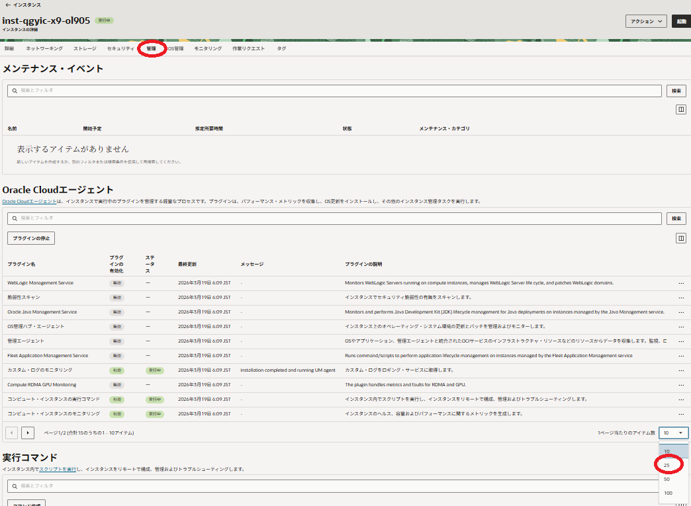
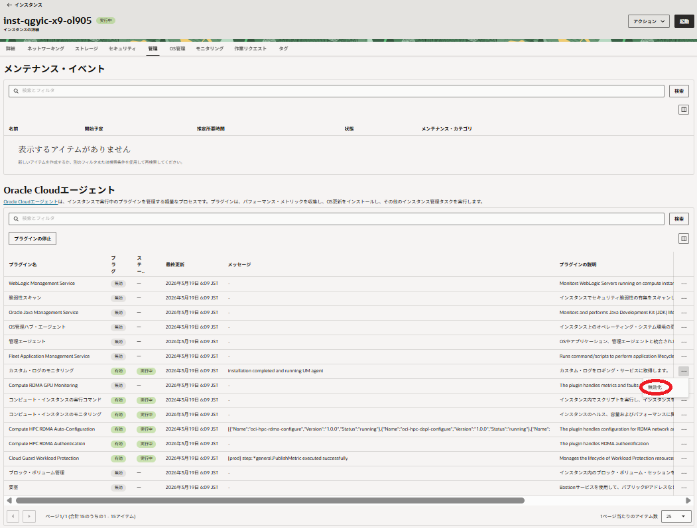
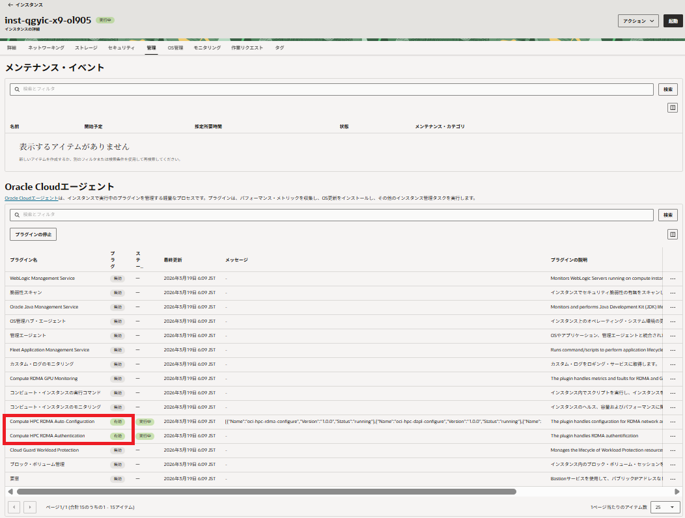

# 0. 概要

HPCワークロードの高並列実行に於けるスケーラビリティは、いわゆるOSジッターの影響を受けるため、不要なOS常駐サービスを停止することで、これを改善できる場合があります。  
ただこの場合、停止しようとするサービスは、以下の観点で事前に精査する必要があります。

- 使用するリソースがどの程度か
- 提供する機能が不要か

これらの調査を経て停止するサービスを特定したら、対象のサービスを停止し、HPCワークロードを実行します。

本パフォーマンス関連Tipsは、HPCワークロード向けベアメタルシェイプ  **[BM.Optimized3.36](https://docs.oracle.com/ja-jp/iaas/Content/Compute/References/computeshapes.htm#bm-hpc-optimized)** と **Oracle Linux** 9.05ベースのHPC **[クラスタネットワーキングイメージ](../../#5-13-クラスタネットワーキングイメージ)** （※1）を使用するインスタンスを **[クラスタ・ネットワーク](../../#5-1-クラスタネットワーク)** と共に作成するHPCクラスタを想定し、この計算ノード上で不要サービスを停止することで、高並列時のスケーラビリティ向上を目的とするOSレベルのパフォーマンスチューニングを適用する方法を解説します。

※1）**[OCI HPCテクニカルTips集](../../#3-oci-hpcテクニカルtips集)** の **[クラスタネットワーキングイメージの選び方](../../tech-knowhow/osimage-for-cluster/)** の **[1. クラスタネットワーキングイメージ一覧](../../tech-knowhow/osimage-for-cluster/#1-クラスタネットワーキングイメージ一覧)** のイメージ **No.13** です。

不要サービスの特定は、Linuxのプロセスアカウンティングを利用し、インスタンス作成直後のワークロードを実行していない状態でCPUを使用しているプロセスを特定、このプロセスが提供する機能を考慮して不要サービスかどうかを判断、不要と判断したサービスを停止します。  
また不要サービスを停止した後、再度プロセスアカウンティング情報を取得し、その効果を確認します。

以降では、以下の順に解説します。

1. **[調査用HPCクラスタ構築](#1-調査用hpcクラスタ構築)**
2. **[不要サービス特定](#2-不要サービス特定)**
3. **[不要サービス停止](#3-不要サービス停止)**
4. **[不要サービス停止による効果確認](#4-不要サービス停止による効果確認)**
5. **[プロダクション用HPCクラスタ構築](#5-プロダクション用hpcクラスタ構築)**

自身のHPCクラスタの計算ノードが本パフォーマンス関連Tipsの前提と同じシェイプ・OSの場合は、本パフォーマンス関連Tipsと同じサービスを停止するだけでチューニングを適用することが出来るため、1章、2章、及び4章は参照にとどめて3章と5章の手順を適用します。  
計算ノードのシェイプやOSが異なる場合は、1章の手順から順次チューニングを進めます。この場合は、対象となる不要サービスが本パフォーマンス関連Tipsと異なる可能性があるため、自身で特定した不要サービスに合わせた停止方法を適用します。

# 1. 調査用HPCクラスタ構築

本章は、不要サービスの特定とその効果確認に使用する調査用HPCクラスタを構築します。

この構築は、 **[OCI HPCチュートリアル集](../../#1-oci-hpcチュートリアル集)** の **[HPCクラスタを構築する(基礎インフラ手動構築編)](../../spinup-cluster-network/)** の手順に従う等で実施します。

# 2. 不要サービス特定

## 2-0. 概要

本章は、調査用HPCクラスタの計算ノード上で、Linuxのプロセスアカウンティングによる不要サービスの特定を以下の順に実施します。

- psacctを起動
- アカウンティング情報取得
- 不要サービス特定

また、通常プライベートサブネットに接続される計算ノードでは、ファイアーウォールを不要と判断出来る場合が多いため、本パフォーマンス関連Tipsではこれも不要サービスとして扱います。

また、 **OCA** のプラグインはHPC関連プラグイン（※2）以外は不要と判断出来る場合が多いため、本パフォーマンス関連Tipsではこれらも不要サービスとして扱います。

※2）これらプラグインの詳細は、 **[OCI HPCテクニカルTips集](../../#3-oci-hpcテクニカルtips集)** の **[クラスタネットワーキングイメージを使ったクラスタ・ネットワーク接続方法](../../tech-knowhow/howto-connect-clusternetwork/)** を参照して下さい。

本章の調査により、本パフォーマンス関連Tipsでは以下を不要サービスと判断しています。

- **Performance Co-Pilot**
- **dnf-makecache.timer**
- **統合モニタリング・エージェント** （ **OCA** エージェント）
- **コンピュート・インスタンスの実行コマンド** （ **OCA** エージェント）
- **コンピュート・インスタンスのモニタリング** （ **OCA** エージェント）
- **Cloud Guard Workload Protection** （ **OCA** エージェント）
- **ksplice**
- **firewalld**

## 2-1. 不要サービス特定手順

以下コマンドをopcユーザで実行し、psacctサービスを起動してプロセスアカウンティングのデータファイルが生成されることを確認します。

```sh
$ sudo systemctl enable --now psacct
$ ls -l /var/account
total 4
-rw-r--r--. 1 root root 256 Mar 17 16:45 pacct
$
```

次に、以下コマンドをopcユーザで実行し、OSを再起動して起動後にプロセスアカウンティングのデータファイルが生成されることを再度確認します。

```sh
$ sudo shutdown -r now
$ ssh inst-xxxxx-comp
$ ls -l /var/account
total 256
-rw-r--r--. 1 root root 256320 Mar 17 17:09 pacct
$
```

プロセスアカウンティングのデータファイルは、logrotateが同じディレクトリに日付をファイル名として日時でローテーションします。  
このため、psacctサービスを起動した翌々日早朝まで放置し、起動翌日丸一日分のアカウンティング情報を含むファイル（以下の例ではpsacctサービス起動日を2026年3月17日として **pacct-20260319** です。）が作成されていることを確認します。

```sh
$ ls -l /var/account/pacct*
-rw------- 1 root root 1291968 Mar 19 08:12 /var/account/pacct
-rw-r--r-- 1 root root  182590 Mar 18 00:00 /var/account/pacct-20260318.gz
-rw------- 1 root root 3623488 Mar 19 00:00 /var/account/pacct-20260319
$ 
```

次に、以下コマンドをopcユーザで実行し、CPU時間を消費している上位10プロセスを特定します。

```sh
$ sudo sa -ca /var/account/pacct-20260319 | head -11
   56617  100.00%  124837.53re  100.00%       5.98cp  100.00%         0avio     43608k
     139    0.25%       1.81re    0.00%       1.80cp   30.10%         0avio     20238k   xz
      15    0.03%       1.68re    0.00%       1.57cp   26.33%         0avio     88444k   dnf
      72    0.13%       2.49re    0.00%       0.97cp   16.18%         0avio    199701k   ruby
    1603    2.83%  124772.33re   99.95%       0.86cp   14.33%         0avio         0k   kworker/dying*
      26    0.05%       0.28re    0.00%       0.24cp    4.02%         0avio     70280k   python3
      96    0.17%       0.19re    0.00%       0.17cp    2.86%         0avio     72544k   ksplice
       1    0.00%       0.15re    0.00%       0.15cp    2.57%         0avio     31088k   pmlogextract
      48    0.08%       3.68re    0.00%       0.12cp    2.05%         0avio     68763k   uptrack-upgrade
       1    0.00%       0.04re    0.00%       0.04cp    0.63%         0avio     24608k   pmlogcheck
     365    0.64%       0.06re    0.00%       0.02cp    0.38%         0avio     48892k   ps
$
```

この出力から、対象期間中最も多くCPU時間を消費した（約30%）プロセスが **xz** であり、以下コマンドをopcユーザで実行した結果、このプロセスがユーザ **pcp** で実行されており、このプロセスがパフォーマンス監視や記録のために使用する **[Performance Co-Pilot](https://pcp.io/)** に関連するものであるため、不要サービスと判定します。

```sh
$ sudo lastcomm -f /var/account/pacct-20260319 --pid | grep ^xz
xz                     pcp      __         0.00 secs Wed Mar 18 23:55 85684 85668
xz                     pcp      __         2.09 secs Wed Mar 18 23:55 85661 85660
xz                     pcp      __         0.00 secs Wed Mar 18 23:55 85458 85429
xz                     pcp      __         0.00 secs Wed Mar 18 23:25 84533 84517
xz                     pcp      __         0.00 secs Wed Mar 18 23:25 84310 84281
xz                     pcp      __         0.00 secs Wed Mar 18 22:55 83179 83163
xz                     pcp      __         2.08 secs Wed Mar 18 22:55 83156 83155
xz                     pcp      __         0.00 secs Wed Mar 18 22:55 82953 82924
xz                     pcp      __         0.00 secs Wed Mar 18 22:25 82016 82000
xz                     pcp      __         2.07 secs Wed Mar 18 22:25 81993 81992
:
$
```

次に、対象期間中2番目にCPU時間を消費した（約26%）プロセスが **dnf** であり、以下コマンドをopcユーザで実行した結果、このプロセスの親プロセスIDが1（Systemd）で1時間強の毎回異なる間隔で実行されていることから、Systemdタイマーの **OnUnitInactiveSec** から起動されていることを特定、

```sh
$ sudo lastcomm -f /var/account/pacct-20260319 --command dnf --pid
dnf              S     root     __         0.16 secs Wed Mar 18 22:42 82587 1
dnf              S     root     __         0.15 secs Wed Mar 18 21:12 78926 1
dnf              S     root     __         1.24 secs Wed Mar 18 20:00 76276 1
dnf              S     root     __         0.16 secs Wed Mar 18 18:05 71418 1
dnf              S     root     __         1.23 secs Wed Mar 18 16:36 67543 1
dnf              S     root     __         0.16 secs Wed Mar 18 14:50 62723 1
dnf              S     root     __        43.82 secs Wed Mar 18 13:01 58828 1
dnf              S     root     __         0.16 secs Wed Mar 18 11:04 53904 1
dnf              S     root     __         0.16 secs Wed Mar 18 09:46 50249 1
dnf              S     root     __         1.25 secs Wed Mar 18 08:14 46585 1
dnf              S     root     __         0.15 secs Wed Mar 18 06:14 41468 1
dnf              S     root     __         1.23 secs Wed Mar 18 04:49 37666 1
dnf              S     root     __         0.15 secs Wed Mar 18 03:09 33906 1
dnf              S     root     __        44.22 secs Wed Mar 18 01:18 29049 1
dnf              S     root     __         0.16 secs Wed Mar 18 00:01 25269 1
$
```

以下コマンドをopcユーザで実行し、このプロセスが有効なdnfレポジトリのパッケージメターデータを定期的に更新する **dnf-makecache.timer** から起動されていることを特定、OSアップデート等のパッケージ管理は定期的なメンテナンス時に適用する運用を想定し、不要サービスと判定します。  
自身の環境に於けるdnf-makecacheの要・不要は、man dnfを参照してその判断を行ってください。

```sh
$ for sct in `sudo systemctl list-units --type=timer | grep timer | awk '{print $1}'`; do echo $sct; sudo systemctl cat $sct | grep ^OnUnitInactiveSec; echo; done
dnf-makecache.timer
OnUnitInactiveSec=1h

logrotate.timer

mlocate-updatedb.timer

pmie_check.timer

pmie_daily.timer

pmie_farm_check.timer

pmlogger_check.timer

pmlogger_daily.timer

pmlogger_farm_check.timer

systemd-tmpfiles-clean.timer

unified-monitoring-agent_config_downloader.timer
OnUnitInactiveSec=15min

$
```

次に、対象期間中3番目にCPU時間を消費した（約16%）プロセスが **ruby** であり、以下コマンドをopcユーザで実行した結果、このプロセスの親プロセスIDが1（Systemd）で20分前後の毎回異なる間隔で実行されていることから、Systemdタイマーの **OnUnitInactiveSec** から起動されていることを特定、

```sh
$ sudo lastcomm -f /var/account/pacct-20260319 --command ruby --pid
ruby             S     root     __         0.77 secs Wed Mar 18 23:56 85870 1
ruby             S     root     __         0.79 secs Wed Mar 18 23:35 85015 1
ruby             S     root     __         0.80 secs Wed Mar 18 23:18 83981 1
ruby             S     root     __         0.81 secs Wed Mar 18 22:53 82690 1
ruby             S     root     __         0.78 secs Wed Mar 18 22:34 82491 1
ruby             S     root     __         0.82 secs Wed Mar 18 22:13 81429 1
ruby             S     root     __         0.85 secs Wed Mar 18 21:54 80204 1
ruby             S     root     __         0.88 secs Wed Mar 18 21:29 79948 1
ruby             S     root     __         0.76 secs Wed Mar 18 21:13 78949 1
ruby             S     root     __         0.78 secs Wed Mar 18 20:51 77703 1
:
:
:
$
```

以下コマンドをopcユーザで実行し、このプロセスがアプリケーションからの **カスタム・ログ** を収集する **[Oracle Cloud Agent](https://docs.oracle.com/ja-jp/iaas/Content/Compute/Tasks/manage-plugins.htm)** （以降 **OCA** と呼称）のプラグインである **統合モニタリング・エージェント** から起動されていることを特定、不要サービスと判定します。  
自身の環境に於ける **統合モニタリング・エージェント** の要・不要は、OCI公式ドキュメントの **[ここ](https://docs.oracle.com/ja-jp/iaas/Content/Logging/Concepts/agent_management.htm)** を参照してその判断を行ってください。

```sh
$ for sct in `sudo systemctl list-units --type=timer | grep timer | awk '{print $1}'`; do echo $sct; sudo systemctl cat $sct | grep ^OnUnitInactiveSec; echo; done
dnf-makecache.timer
OnUnitInactiveSec=1h

logrotate.timer

mlocate-updatedb.timer

pmie_check.timer

pmie_daily.timer

pmie_farm_check.timer

pmlogger_check.timer

pmlogger_daily.timer

pmlogger_farm_check.timer

systemd-tmpfiles-clean.timer

unified-monitoring-agent_config_downloader.timer
OnUnitInactiveSec=15min

$

```
次に、対象期間中4番目にCPU時間を消費した（約14%）プロセスが **kworker/dying** であり、カーネルスレッドによるプロセス終了処理に伴うもののため、削減不可能と判断します。

次に、対象期間中5番目にCPU時間を消費した（約4%）プロセスが **python3** であり、以下コマンドをopcユーザで実行した結果、このプロセスがユーザ **pcp** で実行されていることから、 **Performance Co-Pilot** に関連するものであることを特定します。

```sh
$ sudo lastcomm -f /var/account/pacct-20260319 --command python3 --pid
python3                pcp      __         1.12 secs Wed Mar 18 00:10 26417 26189
python3                pcp      __         1.14 secs Wed Mar 18 00:10 26410 26189
python3                pcp      __         0.61 secs Wed Mar 18 00:10 26403 26189
:
:
:
$
```

次に、対象期間中6番目にCPU時間を消費した（約3%）プロセスが **ksplice** であり、kspliceがOS稼働中にカーネル等のアップデートを適用するためのサービスで、OSアップデート等のパッケージ管理は定期的なメンテナンス時に適用する運用を想定し、不要サービスと判定します。  
自身の環境に於けるkspliceの要・不要は、Oracle公式ドキュメントの **[ここ](https://docs.oracle.com/cd/F61410_01/ksplice-user/)** を参照してその判断を行ってください。

次に、対象期間中7番目にCPU時間を消費した（約3%）プロセスが **pmlogextract** であり、 **Performance Co-Pilot** に関連するものであることを特定します。

次に、対象期間中8番目にCPU時間を消費した（約2%）プロセスが **uptrack-upgrade** であり、kspliceのための **Oracle Ksplice Uptrack server** へのカーネルアップデート情報取得サービスで、先の **ksplice** に関連するものであることを特定します。

# 3. 不要サービス停止

## 3-0. 概要

本章は、調査用HPCクラスタの計算ノード上で、不要と特定した以下サービスを停止します。

- **Performance Co-Pilot**
- **dnf-makecache.timer**
- **統合モニタリング・エージェント** （ **OCA** エージェント）
- **コンピュート・インスタンスの実行コマンド** （ **OCA** エージェント）
- **コンピュート・インスタンスのモニタリング** （ **OCA** エージェント）
- **Cloud Guard Workload Protection** （ **OCA** エージェント）
- **ksplice**
- **firewalld**

## 3-1. 不要サービス停止手順

以下コマンドをopcユーザで実行し、 **Performance Co-Pilot** 関連パッケージを削除します。

```sh
$ sudo dnf remove -y pcp
```

次に、以下コマンドをopcユーザで実行し、 **dnf-makecache** を停止します。

```sh
$ sudo systemctl disable --now dnf-makecache.timer
```

次に、OCIコンソールにログインし、以下計算サーバの **インスタンスの詳細** 画面で **管理** タブをクリックし、 **Oracle Cloudエージェント** フィールドの **ページ当たりのアイテム数** プルダウンメニューで **25** をクリックします。



表示される以下画面で、 **カスタム・ログのモニタリング** プラグインの **無効化** プルダウンメニューをクリックし、 **統合モニタリング・エージェント** を停止します。  
また同様に、 **コンピュート・インスタンスの実行コマンド** 、 **コンピュート・インスタンスのモニタリング** 、及び **Cloud Guard Workload Protection** も停止します。



これにより、以下画面のように **Oracle Cloudエージェント** フィールドでHPC関連プラグインの **Compute HPC RDMA Auto-Configuration** と **Compute HPC RDMA Authentication** のみが有効となります。



次に、以下コマンドをopcユーザで実行し、 **ksplice** 関連パッケージを削除します。

```sh
$ sudo dnf remove -y ksplice uptrack
```

次に、以下コマンドをopcユーザで実行し、ファイアーウォールを停止します。

```sh
$ sudo systemctl disable --now firewalld
```

次に、以下コマンドをopcユーザで実行し、OSを再起動します。

```sh
$ sudo shutdown -r now
```

OSが起動したら、ここまでに停止した不要サービスが起動していないことを確認します。

# 4. 不要サービス停止による効果確認

本章は、調査用HPCクラスタの計算ノード上で、不要サービスを停止した状態で取得したプロセスアカウンティング情報を基に、以下の手順でその効果を確認します。

不要サービスを停止した翌々日早朝まで放置し、停止した翌日一日分のアカウンティング情報（以下の例では **pacct-20260321** です。）が作成されているのを確認します。

```sh
$ ls -l /var/account/pacct*
-rw------- 1 root root 223040 Mar 21 07:29 /var/account/pacct
-rw-r--r-- 1 root root 182590 Mar 18 00:00 /var/account/pacct-20260318.gz
-rw------- 1 root root 447338 Mar 19 00:00 /var/account/pacct-20260319.gz
-rw------- 1 root root 503366 Mar 20 00:00 /var/account/pacct-20260320.gz
-rw------- 1 root root 655104 Mar 21 00:00 /var/account/pacct-20260321
$ 
```

次に、以下コマンドをopcユーザで実行し、CPU時間を消費している上位10プロセスを特定します。

```sh
$ sudo sa -ca /var/account/pacct-20260321 | head -11
   10236  100.00%   57721.90re  100.00%       0.30cp  100.00%         0avio     53281k
     727    7.10%   57701.46re   99.96%       0.29cp   96.19%         0avio         0k   kworker/dying*
       2    0.02%       0.03re    0.00%       0.01cp    2.15%         0avio     55264k   updatedb
       4    0.04%       0.68re    0.00%       0.00cp    0.66%         0avio      5504k   systemd
       1    0.01%       0.00re    0.00%       0.00cp    0.39%         0avio       843k   gzip
       2    0.02%       0.00re    0.00%       0.00cp    0.22%         0avio    963456k   C1 CompilerThre
       1    0.01%       0.00re    0.00%       0.00cp    0.11%         0avio    963456k   Reference Handl
       1    0.01%       0.00re    0.00%       0.00cp    0.11%         0avio    963456k   Finalizer
       1    0.01%       0.00re    0.00%       0.00cp    0.11%         0avio    963456k   GC task thread#
       1    0.01%       0.00re    0.00%       0.00cp    0.06%         0avio     55504k   logrotate
    5758   56.25%       0.00re    0.00%       0.00cp    0.00%         0avio     56272k   pgrep
$
```

不要サービスを停止する前の結果と比較し、停止したサービスによるCPU時間の消費が無いことを確認します。  
本パフォーマンス関連Tipsの環境では、適用したサービス停止で1日当たり約6秒（5.98秒 - 0.30秒）の不要サービスによるCPU消費を抑えられることが確認できました。

# 5. プロダクション用HPCクラスタ構築

本章は、不要サービスを停止した調査用HPCクラスタの計算ノードのうちの1ノードで **[カスタム・イメージ](../../#5-6-カスタムイメージ)** を取得し、これを元に必要なノード数の計算ノードを持つ、不要サービスが停止されているプロダクション用のHPCクラスタを構築します。

この構築は、 **[OCI HPCテクニカルTips集](../../#3-oci-hpcテクニカルtips集)** の **[計算/GPUノード作成時の効果的なOSカスタマイズ方法](../../tech-knowhow/compute-os-customization)** の **[2. カスタム・イメージを使用したOSカスタマイズ](../../tech-knowhow/compute-os-customization/#2-カスタムイメージを使用したosカスタマイズ)** の手順に従い実施します。