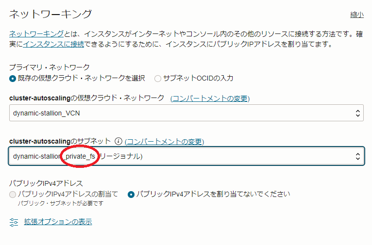

HPCクラスタやGPUクラスタは、そのフロントエンドとなるBastionノードを含む全てのノードで利用できるファイル共有ストレージが運用上必須です。  
代表的なファイル共有ストレージの用途は、ユーザホームディレクトリですが、この領域は通常高いパフォーマンスより安定したサービスの提供が重視されるため、NFSがその有力な候補です。

OCIは、NFSのマネージドサービスとしてファイル・ストレージを提供しており、ファイルサーバ構築の必要無く簡単に利用できるため、HPC/GPUクラスタ用ユーザホームディレクトリの有力な候補です。  
**[HPCクラスタスタック](/ocitutorials/hpc/#5-10-hpcクラスタスタック)** は、ファイル・ストレージの構築・セットアップを行う機能を持っており、ファイル・ストレージをユーザホームディレクトリに利用するHPC/GPUクラスタを自動構築することが出来ます。

これに対し、OCIのブロックストレージサービスであるブロック・ボリュームを使用してNFSサーバを構築し、この領域をユーザホームディレクトリとして使用することも可能です。  
この手法は、ファイル・ストレージを使用する場合と比較して構築の手間がかかりますが、価格性能比の圧倒的に高いブロック・ボリュームの特徴を利用して、コストパフォーマンスを大幅に高めることが可能です。  
ファイル・ストレージとブロック・ボリュームを使用したNFSサーバの価格と性能の比較は、チュートリアル **[ブロック・ボリュームでNFSサーバを構築する](/ocitutorials/hpc/spinup-nfs-server/)** 前段の比較表を参照ください。

このチュートリアルは、チュートリアル **[ブロック・ボリュームでNFSサーバを構築する](/ocitutorials/hpc/spinup-nfs-server/)** でブロック・ボリュームをアタッチしたベアメタルインスタンス **[BM.Optimized3.36](https://docs.oracle.com/ja-jp/iaas/Content/Compute/References/computeshapes.htm#bm-hpc-optimized)** をNFSサーバとするファイル共有ストレージを構築し、チュートリアル **[HPCクラスタを構築する(基礎インフラ手動構築編)](/ocitutorials/hpc/spinup-cluster-network/)** や **[GPUクラスタを構築する(基礎インフラ手動構築編)](/ocitutorials/hpc/spinup-gpu-cluster/)** で基礎インフラとして構築するHPC/GPUクラスタのファイル共有ストレージとして利用する、コストパフォーマンスの優れたクラスタシステムを構築します。

**所要時間 :** 約2時間

***
# 0. 概要

本チュートリアルは、チュートリアル **[ブロック・ボリュームでNFSサーバを構築する](/ocitutorials/hpc/spinup-nfs-server/)** とチュートリアル **[HPCクラスタを構築する(基礎インフラ手動構築編)](/ocitutorials/hpc/spinup-cluster-network/)** かチュートリアル **[GPUクラスタを構築する(基礎インフラ手動構築編)](/ocitutorials/hpc/spinup-gpu-cluster/)** を組み合わせて、以下のシステムを構築します。  
この図中、左下の一点鎖線で囲まれたリソースを **HPC/GPUクラスタを構築する(基礎インフラ手動構築編)** で構築し、それ以外のリソースを **ブロック・ボリュームでNFSサーバを構築する** で構築します。


[**ブロック・ボリュームでNFSサーバを構築する** がデプロイするリソース]
- VCNと関連するネットワークリソース
- ブロック・ボリューム
- NFSサーバ用インスタンス
- Bastionノード
- NFSクライアント用インスタンス

[**HPC/GPUクラスタを構築する(基礎インフラ手動構築編)** がデプロイするリソース]
- クラスタ・ネットワーク
- 計算/GPUノード

本チュートリアルは、以上2個のチュートリアルを活用し、以下の手順でシステムを構築します。

- NFSサーバ構築（**ブロック・ボリュームでNFSサーバを構築する** を実施）
- NFSサーバ環境確認
- HPC/GPUクラスタ構築（**HPC/GPUクラスタを構築する(基礎インフラ手動構築編)** 実施）
- HPC/GPUクラスタ環境確認
- BastionノードNFSサーバ領域マウント

***
# 1. NFSサーバ構築

本章は、チュートリアル **[ブロック・ボリュームでNFSサーバを構築する](/ocitutorials/hpc/spinup-nfs-server/)** の0章から4章までを実施し、NFSサーバを構築します。

この際、 **[1. スタックの作成](/ocitutorials/hpc/spinup-nfs-server/#1-スタックの作成)** のステップ **5.4 NFS Client Instance Configuration - Optional** フィールドで指定するNFSクライアント用インスタンスのシェイプとノード数は、このインスタンスが環境確認用途で最小限のリソースで十分であることから、以下に変更します。

- **Client Compute Shape :** VM.Standard2.1
- **Number of clients :** 1

   

***
# 2. NFSサーバ環境確認

本章は、先に構築したNFSサーバ環境を確認し、後のHPC/GPUクラスタ構築時に必要な情報を収集します。

1. BastionノードSSH公開鍵確認

   Bastionノードのopcユーザで以下コマンドを実行し、計算/GPUノードにSSHログインする際使用するSSH秘密鍵に対応する公開鍵を確認します。  
   この公開鍵は、後に構築するHPC/GPUクラスタに紐づける **[インスタンス構成](/ocitutorials/hpc/#5-7-インスタンス構成)** 作成時に使用します。

   ```sh 
   > ssh-keygen -y -f ~/.ssh/id_rsa
   ```

2. NFSサーバマウント設定確認

   NFSクライアントのopcユーザで以下コマンドを実行し、この出力を保存します。  
   ここで確認したNFSサーバマウント設定は、後に構築するHPC/GPUクラスタに紐づける **[cloud-init](/ocitutorials/hpc/#5-11-cloud-init)** 設定ファイル（cloud-config）を作成する際に使用します。

   ```sh 
   > grep vers=3 /etc/fstab | sed 's/\/mnt\/nfs /\/mnt\/home /g'
   10.0.6.xxx:/mnt/nfsshare/exports /mnt/home nfs vers=3,defaults,noatime,nodiratime,bg,timeo=100,ac,actimeo=120,nocto,rsize=1048576,wsize=1048576,nolock,local_lock=none,proto=tcp,sec=sys,_netdev 0 0
   ```

***
# 3. HPC/GPUクラスタ構築

本章は、HPCクラスタの場合はチュートリアル **[HPCクラスタを構築する(基礎インフラ手動構築編)](/ocitutorials/hpc/spinup-cluster-network/)** の1章から3章、GPUクラスタの場合はチュートリアル **[GPUクラスタを構築する(基礎インフラ手動構築編)](/ocitutorials/hpc/spinup-gpu-cluster/)** の1章から2章と3章か4章を実施し、HPC/GPUクラスタを構築します。

この際、以下3点をチュートリアルの手順から変更します。

1. cloud-config修正

   **1.1 cloud-config作成** で作成する **[cloud-init](/ocitutorials/hpc/#5-11-cloud-init)** 設定ファイル（cloud-config）で、先に保存したNFSマウント設定を/etc/fstabに書き込みマウントする処理を **runmcd** 領域に追加します。

   以下は、この処理を追加したHPCクラスタ用（BM.Optimized3.36用）とGPUクラスタ用（BM.GPU4.8/BM.GPU.GM4.8用）のcloud-configで、NFSサーバIPアドレスの4フィールド目（xxx）の値を自身の環境に合わせて修正します。

   [HPCクラスタ用]

   ```sh
   #cloud-config
   runcmd:
   #
   # Mount NVMe local storage
     - parted -s /dev/nvme0n1 mklabel gpt
     - parted -s /dev/nvme0n1 -- mkpart primary xfs 1 -1
   # To ensure partition is really created before mkfs phase
     - sleep 60
     - mkfs.xfs -L localscratch /dev/nvme0n1p1
     - mkdir -p /mnt/localdisk
     - echo "LABEL=localscratch /mnt/localdisk/ xfs defaults,noatime 0 0" >> /etc/fstab
     - mount /mnt/localdisk
   #
   # Mount NFS home directory
     - echo "10.0.6.xxx:/mnt/nfsshare/exports /mnt/home nfs vers=3,defaults,noatime,nodiratime,bg,timeo=100,ac,actimeo=120,nocto,rsize=1048576,wsize=1048576,nolock,local_lock=none,proto=tcp,sec=sys,_netdev 0 0" >> /etc/fstab
     - mkdir -p /mnt/home
     - mount /mnt/home   
   #
   # Stop firewalld
     - systemctl stop firewalld
     - systemctl disable firewalld
   #
   # Set up cluster network interface
     - systemctl start oci-rdma-configure
   #
   # Start CN authentication renew service for OL8 HPC image to avoid 15min. hiatus of CN connection on deployment
     - systemctl start oci-cn-auth-renew.service
   ```

   [GPUクラスタ用]

   ```sh
   #cloud-config
   yum_repos:
   # To install docker community edition
     ol7_developer:
       name: Oracle Linux $releasever Development Packages ($basearch)
       baseurl: https://yum$ociregion.$ocidomain/repo/OracleLinux/OL7/developer/$basearch/
       enabled: true
       gpgcheck: true
       gpgkey: file:///etc/pki/rpm-gpg/RPM-GPG-KEY-oracle
     docker-ce-stable:
       name: Docker CE Stable - $basearch
       baseurl: https://download.docker.com/linux/centos/$releasever/$basearch/stable
       enabled: true
       gpgcheck: true
       gpgkey: https://download.docker.com/linux/centos/gpg
   # To install NVIDIA container
     libnvidia-container:
       name: libnvidia-container
       baseurl: https://nvidia.github.io/libnvidia-container/stable/centos7/$basearch
       enabled: true
       gpgcheck: true
       gpgkey: https://nvidia.github.io/libnvidia-container/gpgkey
     libnvidia-container-experimental:
       name: libnvidia-container-experimental
       baseurl: https://nvidia.github.io/libnvidia-container/experimental/centos7/$basearch
       enabled: true
       gpgcheck: true
       gpgkey: https://nvidia.github.io/libnvidia-container/gpgkey
   packages:
   # Install Docker community edition and NVIDIA container toolkit
     - docker-ce
     - nvidia-container-toolkit
   runcmd:
   # NVMe local storage setting
     - vgcreate nvme /dev/nvme0n1 /dev/nvme1n1 /dev/nvme2n1 /dev/nvme3n1
     - lvcreate -l 100%FREE nvme
     - mkfs.xfs -L localscratch /dev/nvme/lvol0
     - mkdir -p /mnt/localdisk
     - echo "LABEL=localscratch /mnt/localdisk/ xfs defaults,noatime 0 0" >> /etc/fstab
     - mount /mnt/localdisk
   # Mount NFS home directory
     - echo "10.0.6.xxx:/mnt/nfsshare/exports /mnt/home nfs vers=3,defaults,noatime,nodiratime,bg,timeo=100,ac,actimeo=120,nocto,rsize=1048576,wsize=1048576,nolock,local_lock=none,proto=tcp,sec=sys,_netdev 0 0" >> /etc/fstab
     - mkdir -p /mnt/home
     - mount /mnt/home   
   # Stop firewalld
     - systemctl stop firewalld
     - systemctl disable firewalld
   # Set up cluster network interface
     - systemctl start oci-rdma-configure
   # Expand root file system to those set by instance configuration
     - /usr/libexec/oci-growfs -y
   # Pull Horovod/TensorFlow docker images
     - systemctl start docker
     - systemctl enable docker
     - docker pull horovod/horovod:latest
     - docker pull nvcr.io/nvidia/tensorflow:22.11-tf2-py3
   ```

2. 計算/GPUノード接続サブネット修正

   **1.2 インスタンス構成作成** のステップ **3.5 ネットワーキング フィールド** で指定する計算/GPUノードを接続するサブネットで、以下のように **_private_fs** で終わる名称のサブネットを指定します。

   

   また、 **1.3 クラスタ・ネットワーク作成** のステップ **3.3 ネットワーキングの構成 フィールド** で指定する計算/GPUノードを接続するサブネットで、以下のように **_private_fs** で終わる名称のサブネットを指定します。

   

3. 計算/GPUノードSSH接続用秘密鍵に対応するSSH公開鍵修正

   **1.2 インスタンス構成作成** のステップ **3.6 SSHキーの追加 フィールド** で、先にBastionノードで確認した公開鍵を指定します。

***
# 4. HPC/GPUクラスタ環境確認

本章は、デプロイされた計算/GPUノードにログインし、環境を確認します。

計算/GPUノードは、以下のようにNFSサーバの領域が/mnt/homeにマウントされています。

```sh
> df -h /mnt/home
Filesystem                       Size  Used Avail Use% Mounted on
10.0.6.xxx:/mnt/nfsshare/exports   15T   33M   15T   1% /mnt/home
```

***
# 5. BastionノードNFSサーバ領域マウント

本章は、BastionノードでNFSサーバ領域をマウントします。  
このマウントは、/mnt/home以下に作成されるユーザホームディレクトリをBastionノードと計算/GPUノードで共有するために必要です。

Bastionノードのopcユーザで以下コマンドを実行し、NFSサーバ領域をマウントします。NFSサーバIPアドレスの4フィールド目（xxx）の値は、自身の環境に合わせて修正します。

```sh 
> echo "10.0.6.xxx:/mnt/nfsshare/exports /mnt/home nfs vers=3,defaults,noatime,nodiratime,bg,timeo=100,ac,actimeo=120,nocto,rsize=1048576,wsize=1048576,nolock,local_lock=none,proto=tcp,sec=sys,_netdev 0 0" | sudo tee -a /etc/fstab
> sudo mkdir -p /mnt/home
> sudo mount /mnt/home
> df -h /mnt/home
Filesystem                       Size  Used Avail Use% Mounted on
10.0.6.xxx:/mnt/nfsshare/exports   15T   34M   15T   1% /mnt/home
```

これで、このチュートリアルは終了です。
