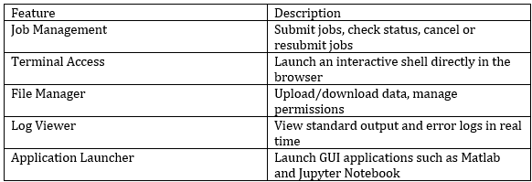
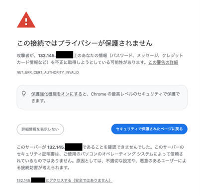
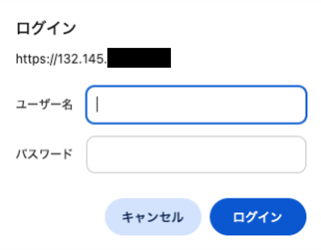
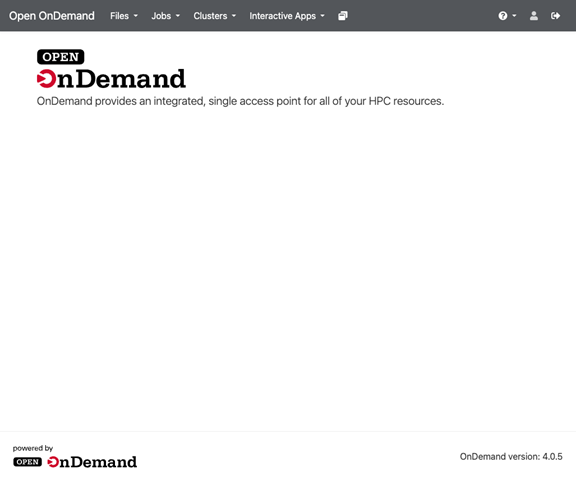

***
# Introduction

In High-Performance Computing (HPC) environments, users have traditionally relied on Linux command-line interfaces (CUI). Some commercial products and HPC cloud SaaS offerings provide GUI-based access.

This article introduces the installation procedure for OpenOnDemand, an open-source solution enabling such functionality. While the base environment here is an OCI HPC Cluster (Slurm cluster), the same steps apply to other Slurm clusters as well.

***
# What is OpenOnDemand?

OpenOnDemand (https://openondemand.org/) is an open-source web portal for HPC clusters that use job schedulers (Slurm, PBS, LSF, etc.) as their backend. Through a web browser, users can perform the following interactive operations:



These features provide intuitive and secure access to HPC clusters, which previously required CLI-only operation.

***
# What is an HPC Cluster?

An HPC Cluster is a Terraform+Ansible-based script that enables quick deployment of HPC workloads on OCI.  
OCI provides "Resource Manager," a Terraform-as-a-Service, allowing easy deployment via a web-based wizard.

**[https://github.com/oracle-quickstart/oci-hpc](https://github.com/oracle-quickstart/oci-hpc)**

***
# Deployment Steps

## Configure the HPC Cluster
Follow this reference:

**[https://qiita.com/itokazu/items/63d2e3cebdcdda5afce0](https://qiita.com/itokazu/items/63d2e3cebdcdda5afce0)**

## Access the Login Node via SSH

```sh
ssh opc@<Public IP>
```

## Enable Required Repositories

```sh
sudo dnf install epel-release
sudo yum-config-manager --enable ol8_codeready_builder
sudo yum-config-manager --enable ol8_developer_EPEL
```

## Install Prerequisite Packages

```sh
sudo dnf -y module enable ruby:3.3 nodejs:20
```

## Install OpenOnDemand 4

```sh
sudo dnf install -y https://yum.osc.edu/ondemand/4.0/ondemand-release-web-4.0-1.el8.noarch.rpm
sudo dnf install -y ondemand mod_authnz_pam
sudo systemctl enable --now httpd
```

## Enable Apache httpd PAM Authentication Module

```sh
sudo vi /etc/httpd/conf.modules.d/55-authnz_pam.conf
# LoadModule authnz_pam_module modules/mod_authnz_pam.so
↓ Change to:
LoadModule authnz_pam_module modules/mod_authnz_pam.so
```

## Create a Self-Signed TLS Certificate

```sh
PRIVATE_IP="<Private IP of Login Node>"
sudo openssl req -new -newkey rsa:4096 -nodes -x509 -sha256 -days 825   -keyout  /etc/pki/tls/private/ood-ip.key   -out     /etc/pki/tls/certs/ood-ip.crt   -subj "/CN=${IP}"   -addext "subjectAltName = IP:${PRIVATE_IP}"
```

## Add Certificate to Host’s Trusted CA Store

```sh
sudo cp /etc/pki/tls/certs/ood-self.crt /etc/pki/ca-trust/source/anchors/
sudo update-ca-trust extract
```

## Configure Apache/OOD Portal  

Replace `<Public IP of Login Node>` before running.

```sh
sudo mkdir -p /etc/ood/config

cat <<'EOF' | sudo tee /etc/ood/config/ood_portal.yml
servername: "<Public IP of Login Node>"

ssl:
  - 'SSLCertificateFile "/etc/pki/tls/certs/ood-ip.crt"'
  - 'SSLCertificateKeyFile "/etc/pki/tls/private/ood-ip.key"'

auth:
  - 'AuthType Basic'
  - 'AuthName "Open OnDemand"'
  - 'AuthBasicProvider PAM'
  - 'AuthPAMService ood'
  - 'Require valid-user'
EOF

sudo cp /etc/pam.d/sshd /etc/pam.d/ood

sudo /opt/ood/ood-portal-generator/sbin/update_ood_portal
sudo systemctl enable --now httpd
```

## Define Slurm Cluster  

Replace `<Private IP of Login Node>`.

```sh
sudo mkdir -p /etc/ood/config/clusters.d
cat <<'EOF' | sudo tee /etc/ood/config/clusters.d/myslurm.yml
---
v2:
  metadata:
    title: "OCI HPC Cluster"
  login:
    host: "<Private IP of Login Node>"
  job:
    adapter: "slurm"
    bin: "/usr/bin"
    conf: "/etc/slurm/slurm.conf"
    copy_environment: false
EOF
```

## Create Portal Users  

The HPC Cluster includes an LDAP server.

Register users in LDAP:

**[https://qiita.com/itokazu/items/25ace87c5c6851f1c11f](https://qiita.com/itokazu/items/25ace87c5c6851f1c11f)**

## Update VCN Security List  

Allow inbound connections on port 443 in the Subnet’s Security List.

Example uses `0.0.0.0/0` (all IPs), but adjust as needed.  


## Verify Login  

Access in the browser:

```sh
https://<Public IP of Login Node>
```

A warning screen appears. Click **"Proceed to 132.145.xx.xx (Not Secure)"**.



A login prompt will appear. Enter the LDAP username and password.  



Upon success, the OOD portal screen is displayed.  
 


***
# Conclusion

With these steps, OpenOnDemand is successfully installed on an OCI HPC Cluster.  
End users can manage jobs and files through a browser without relying on a login shell, enabling easier collaboration and documentation within teams.