# 0. 概要

本チュートリアルは、OCIコンソールから必要なリソースを順次OCI上に作成する方法で、 **Intel Ice Lake** プロセッサを搭載するベアメタルシェイプ **[BM.Optimized3.36](https://docs.oracle.com/ja-jp/iaas/Content/Compute/References/computeshapes.htm#bm-hpc-optimized)** を **[クラスタ・ネットワーク](../#5-1-クラスタネットワーク)** でノード間接続するHPCクラスタを構築し、そのインターコネクト性能を **[Intel MPI Benchmarks](https://github.com/intel/mpi-benchmarks)** で検証します。  
また、環境構築後により大規模な計算を実施する必要が生じたり、メンテナンスによりノードを入れ替える必要が生じることを想定し、既存の **クラスタ・ネットワーク** に計算ノードを追加する方法と、特定の計算ノードを入れ替える方法も学習します。

本チュートリアルで構築するHPCクラスタの構成を以下に示します。

[計算ノード]
- **シェイプ** ： **BM.Optimized3.36**
- ノード間接続インターコネクト ： **[クラスタ・ネットワーク](../#5-1-クラスタネットワーク)** （100 Gbps x 1）
- **イメージ** ： **Oracle Linux** 8.10 / 9.5ベースのHPC **[クラスタネットワーキングイメージ](../#5-13-クラスタネットワーキングイメージ)** （※1）

[Bastionノード]
- **シェイプ** ： **[VM.Standard.E5.Flex](https://docs.oracle.com/ja-jp/iaas/Content/Compute/References/computeshapes.htm#flexible)**
- **イメージ** ： **Oracle Linux** 8.10 / 9.5ベースのHPC **[クラスタネットワーキングイメージ](../#5-13-クラスタネットワーキングイメージ)** （※1）

※1）**[OCI HPCテクニカルTips集](../#3-oci-hpcテクニカルtips集)** の **[クラスタネットワーキングイメージの選び方](../tech-knowhow/osimage-for-cluster/)** の **[1. クラスタネットワーキングイメージ一覧](../tech-knowhow/osimage-for-cluster/#1-クラスタネットワーキングイメージ一覧)** のイメージ **No.12** / **No.13** です。

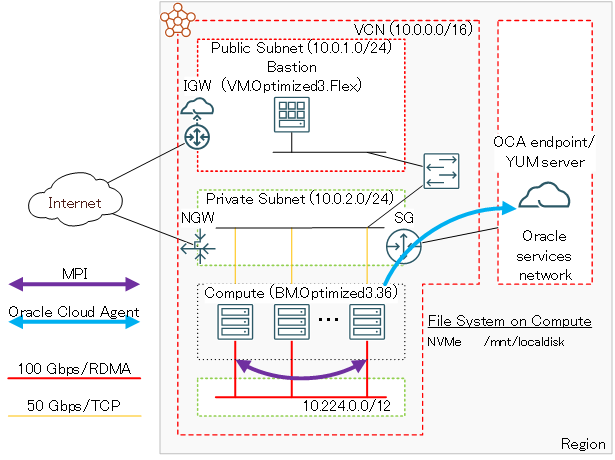

このチュートリアルで作成する環境は、ユーザ管理、ホスト名管理、ファイル共有ストレージ、プログラム開発環境、ジョブスケジューラ等、必要なソフトウェア環境をこの上に整備し、ご自身の要件に沿ったHPCクラスタを構築する際の基礎インフラストラクチャとして利用することが可能です。  
なお、これらのクラスタ管理に必要なソフトウェアの導入までを自動化する **[HPCクラスタスタック](../#5-10-hpcクラスタスタック)** も利用可能で、詳細は **[OCI HPCチュートリアル集](../#1-oci-hpcチュートリアル集)** の **[HPCクラスタを構築する(スタティッククラスタ自動構築編)](../spinup-hpc-cluster)** を参照ください。

**所要時間 :** 約2時間

**前提条件 :** **クラスタ・ネットワーク** を収容する **コンパートメント** ( **ルート・コンパートメント** でもOKです)の作成と、この **コンパートメント** に対する必要なリソース管理権限がユーザーに付与されていること。

**注意 :** 本コンテンツ内の画面ショットは、現在のOCIコンソール画面と異なっている場合があります。

# 1. HPCクラスタ作成事前作業

## 1-0. 概要

本章は、計算ノードをTCP接続する **仮想クラウド・ネットワーク** と、インターネットから直接アクセス出来ないプライベートサブネットに接続する計算ノードにログインする際の踏み台となるBastionノードを、HPCクラスタ作成前に予め用意します。

なおこの **仮想クラウド・ネットワーク** は、既存のものを使用することが可能です。  
ただしこの場合、計算ノードが接続するサブネットは、 **[クラスタ・ネットワーク](../#5-1-クラスタネットワーク)** 接続に使用する **[Oracle Cloud Agent](https://docs.oracle.com/ja-jp/iaas/Content/Compute/Tasks/manage-plugins.htm)** （以降 **OCA** と呼称します。）HPCプラグインの動作条件を満たしている必要があります。  
この詳細は、 **[OCI HPCテクニカルTips集](../#3-oci-hpcテクニカルtips集)** の **[クラスタネットワーキングイメージを使ったクラスタ・ネットワーク接続方法](../tech-knowhow/howto-connect-clusternetwork/)** の **[1-2. 接続サブネットの動作条件充足確認](../tech-knowhow/howto-connect-clusternetwork/#1-2-接続サブネットの動作条件充足確認)** を参照してください。

## 1-1. 仮想クラウド・ネットワーク作成

本章は、計算ノードをTCP接続する **仮想クラウド・ネットワーク** を作成します。

 **仮想クラウド・ネットワーク** の作成は、 **[OCIチュートリアル](https://oracle-japan.github.io/ocitutorials/)** の **[その2 - クラウドに仮想ネットワーク(VCN)を作る](https://oracle-japan.github.io/ocitutorials/beginners/creating-vcn)** の手順に従い、以下のリソースを作成します。

-  **仮想クラウド・ネットワーク** （10.0.0.0/16）
- パブリックサブネット（10.0.1.0/24）
- プライベートサブネット（10.0.2.0/24）
- **インターネット・ゲートウェイ** （パブリックサブネットにアタッチ）
- **NATゲートウェイ** （プライベートサブネットにアタッチ）
- **サービス・ゲートウェイ** （プライベートサブネットにアタッチ）
- **ルート表** x 2（パブリックサブネットとプライベートサブネットにアタッチ）
- **セキュリティリスト** x 2（パブリックサブネットとプライベートサブネットにアタッチ）

この **仮想クラウド・ネットワーク** は、 **セキュリティリスト** でインターネットとの通信に以下のアクセス制限が掛けられています。

- インターネットからのアクセス：パブリックサブネットに接続するインスタンスの宛先ポート22番（SSH）に限定
- インターネットへのアクセス：インターネット上の任意の宛先IPアドレス・ポートに制限なくアクセス可能

## 1-2. Bastionノード作成

本章は、計算ノードにログインする際の踏み台となるBastinノードを作成し、必要なセットアップ作業を実施します。

Bastionノードの作成は、 **[OCIチュートリアル](https://oracle-japan.github.io/ocitutorials/)** の **[その3 - インスタンスを作成する](https://oracle-japan.github.io/ocitutorials/beginners/creating-compute-instance)** の手順を参考に、ご自身の要件に沿ったインスタンスを先の手順で **仮想クラウド・ネットワーク** を作成した **コンパートメント** とパブリックサブネットを指定して作成します。  
本チュートリアルは、以下属性のインスタンスをBastionノードとして作成します。

- **シェイプ** ： **[VM.Standard.E5.Flex](https://docs.oracle.com/ja-jp/iaas/Content/Compute/References/computeshapes.htm#flexible)** （任意のコア数・メモリ容量）
- **イメージ** ： **Oracle Linux** 8.10 / 9.5ベースのHPC **[クラスタネットワーキングイメージ](../#5-13-クラスタネットワーキングイメージ)** （※1）
- **SSHキーの追加** ： Bastionノードにログインする際使用するSSH秘密鍵に対応する公開鍵

※1）**[OCI HPCテクニカルTips集](../#3-oci-hpcテクニカルtips集)** の **[クラスタネットワーキングイメージの選び方](../tech-knowhow/osimage-for-cluster/)** の **[1. クラスタネットワーキングイメージ一覧](../tech-knowhow/osimage-for-cluster/#1-クラスタネットワーキングイメージ一覧)** のイメージ **No.12** / **No.13** です。

次に、このBastionノード上でSSHの鍵ペアを作成します。このSSH鍵は、Bastionノードから計算ノードにログインする際に使用します。  
先のチュートリアル **インスタンスを作成する** に記載のインスタンスへの接続方法に従い、BastionノードにopcユーザでSSHログインして以下コマンドでSSH鍵ペアを作成、作成された公開鍵を後の **[クラスタ・ネットワーク](../#5-1-クラスタネットワーク)** 作成手順で指定します。

```sh
$ ssh-keygen
Generating public/private rsa key pair.
Enter file in which to save the key (/home/opc/.ssh/id_rsa): 
Enter passphrase (empty for no passphrase): 
Enter same passphrase again: 
Your identification has been saved in /home/opc/.ssh/id_rsa.
Your public key has been saved in /home/opc/.ssh/id_rsa.pub.
The key fingerprint is:
SHA256:2EvR7FXtEYAsDknJG1oREie1kv2r1PN3OYrYCP/Xlyg opc@bast
The keys randomart image is:
+---[RSA 2048]----+
|     +=*= . ..oo.|
|      *B.+ o . ..|
|     ooo* + .  ..|
|     ..+.+ .    .|
|      . S..      |
|       ....      |
|       o.+    o o|
|      . + *E.+ *.|
|       . +.=+.o o|
+----[SHA256]-----+
$ cat .ssh/id_rsa.pub 
ssh-rsa AAAAB3NzaC1yc2EAAAADAQABAAABAQD0TDo4QJPbXNRq/c5wrc+rGU/dLZdUziHPIQ7t/Wn+00rztZa/3eujw1DQvMsoUrJ+MHjE89fzZCkBS2t4KucqDfDqcrPuaKF3+LPBkgW0NdvytBcBP2J9zk15/O9tIVvsX8WBi8jgPGxnQMo4mQuwfvMh1zUF5dmvX3gXU3p+lH5akZa8sy/y16lupge7soN01cQLyZfsnH3BA7TKFyHxTe4MOSHnbv0r+6Cvyy7Url0RxCHpQhApA68KBIbfvhRHFg2WNtgggtVGWk+PGmTK7DTtYNaiwSfZkuqFdEQM1T6ofkELDruB5D1HgDi3z+mnWYlHMNHZU5GREH66acGJ opc@bast
$
```

次に、以降作成する計算ノードの名前解決をインスタンス名で行うため、 **[OCI HPCテクニカルTips集](../#3-oci-hpcテクニカルtips集)** の **[計算/GPUノードの効果的な名前解決方法](../tech-knowhow/compute-name-resolution/)** の手順を実施します。

次に、以降作成する計算ノードで実施する手順を **[pdsh](https://github.com/chaos/pdsh)** を使用して効率よく進めるため、 **[OCI HPCテクニカルTips集](../#3-oci-hpcテクニカルtips集)** の **[pdshで効率的にクラスタ管理オペレーションを実行](../tech-knowhow/cluster-with-pdsh/)** の **[1. pdshインストール・セットアップ](../tech-knowhow/cluster-with-pdsh/#1-pdshインストールセットアップ)** の手順を実施し、 **pdsh** をインストール・セットアップします。  
なおこの手順は、該当する手順を全ての計算ノードで実施する場合、必要ありません。

# 2. HPCクラスタ作成

## 2-0. 概要

本章は、 **[クラスタ・ネットワーク](../#5-1-クラスタネットワーク)** を作成することでHPCクラスタを作成します。

**クラスタ・ネットワーク** の作成は、 **[インスタンス構成](../#5-7-インスタンス構成)** を指定して行い、この **インスタンス構成** で指定している **シェイプ** のインスタンスを指定するノード数分作成し、これを **クラスタ・ネットワーク** に接続します。

また計算ノードのOSレベルのカスタマイズは、 **[cloud-init](../#5-11-cloud-init)** を使用して自動化することで、作成後の作業を軽減します。

以上よりHPCクラスタの作成は、以下の手順を経て行います。

- **[cloud-init設定ファイル（cloud-config）作成](#2-1-cloud-config作成)**
- **[インスタンス構成作成](#2-2-インスタンス構成作成)**
- **[クラスタ・ネットワーク作成](#2-3-クラスタネットワーク作成)**

## 2-1. cloud-config作成

本チュートリアルは、 **[cloud-init](../#5-11-cloud-init)** を以下の目的で使用します。

- タイムゾーンをJSTに変更
- NVMe SSDローカルディスク領域ファイルシステム作成
- firewalld停止

以下は、本チュートリアルで使用する **BM.Optimized3.36** 用の **cloud-init** 設定ファイル（以降 **cloud-config** と呼称します。）で、OCIコンソールを実行している端末上にテキストファイルで保存します。

```sh
#cloud-config
#
# Change time zone to JST
timezone: Asia/Tokyo

runcmd:
#
# Mount NVMe local storage
  - vgcreate nvme /dev/nvme0n1
  - lvcreate -l 100%FREE nvme
  - mkfs.xfs -L localscratch /dev/nvme/lvol0
  - mkdir -p /mnt/localdisk
  - echo "LABEL=localscratch /mnt/localdisk/ xfs defaults,noatime 0 0" >> /etc/fstab
  - systemctl daemon-reload
  - mount /mnt/localdisk
#
# Stop firewalld
  - systemctl disable --now firewalld
```

## 2-2. インスタンス構成作成

OCIコンソールにログインし、HPCクラスタを作成する **リージョン** を選択後、 **コンピュート** → **[インスタンス構成](../#5-7-インスタンス構成)** とメニューを辿ります。

表示される以下画面で、 **インスタンス構成の作成** ボタンをクリックします。


表示される **基本情報** 画面で、以下の情報を入力し **次** ボタンをクリックします。  
なお、ここに記載のないフィールドは、デフォルトのままとします。

1. **インスタンス構成情報** フィールド

    - **名前** ： **インスタンス構成** に付与する名前
    - **コンパートメントに作成** ： **インスタンス構成** を作成する **コンパートメント**
    - **インスタンスの作成先のコンパートメント** ： 計算ノードを作成する **コンパートメント**

    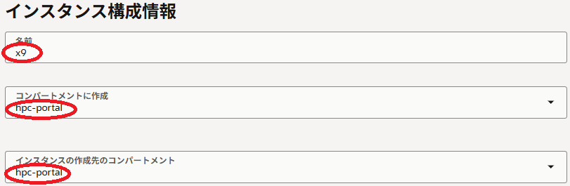

2. **配置** フィールド

    - **可用性ドメイン** ：計算ノードを作成する **可用性ドメイン**

    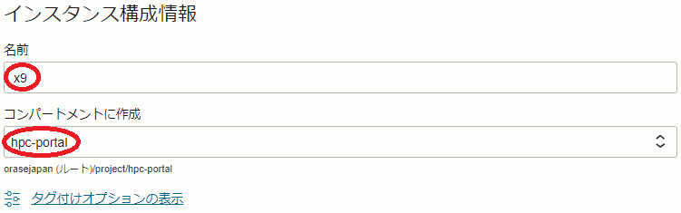

3. **イメージとシェイプ** フィールド

    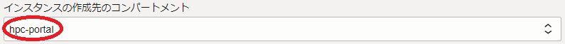

    - **イメージ** ：Oracle Linux - HPC Cluster Networking Image  
    （ **イメージの変更** ボタンをクリックして表示される以下 **イメージの選択** サイドバーで、 **Marketplace** を選択し検索フィールドに **hpc** と入力して表示される **Oracle Linux - HPC Cluster Networking Image** を選択して表示される **イメージ・ビルド** ブルダウンメニューで **Oracle-Linux-8.10-2025.06.17-0-RHCK-OFED-24.10-1.1.4.0-2025.07.19-0** / **Oracle-Linux-9.5-2025.05.19-0-RHCK-OFED-24.10-1.1.4.0-2025.07.20-0** （※3）を選択し、 **イメージの選択** ボタンをクリック。）

    

    ※3）このイメージは、 **[OCI HPCテクニカルTips集](../#3-oci-hpcテクニカルtips集)** の **[クラスタネットワーキングイメージの選び方](../tech-knowhow/osimage-for-cluster/)** の **[1. クラスタネットワーキングイメージ一覧](../tech-knowhow/osimage-for-cluster/#1-クラスタネットワーキングイメージ一覧)** のイメージ **No.12** / **No.13**です。

    - **シェイプ** ：**BM.Optimized3.36**  
        （ **シェイプの変更** ボタンをクリックして表示される以下 **すべてのシェイプの参照** サイドバーで **ベア・メタル・マシン** をクリックして表示される **BM.Optimized3.36** を選択し **シェイプの選択** ボタンをクリック。）

    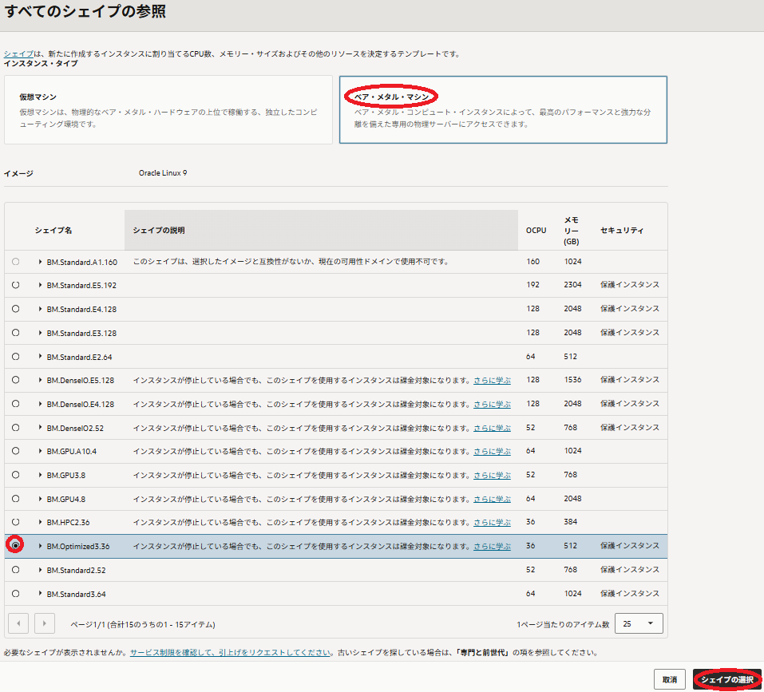

    - **cloud-initスクリプト** ：先に作成した **cloud-config** を選択  
    （ **拡張オプション** ボタンをクリックして表示される以下 **管理** フィールドの **初期化スクリプト** フィールドの **ファイルをドロップするか選択** ボタンをクリックしてファイルを選択）

    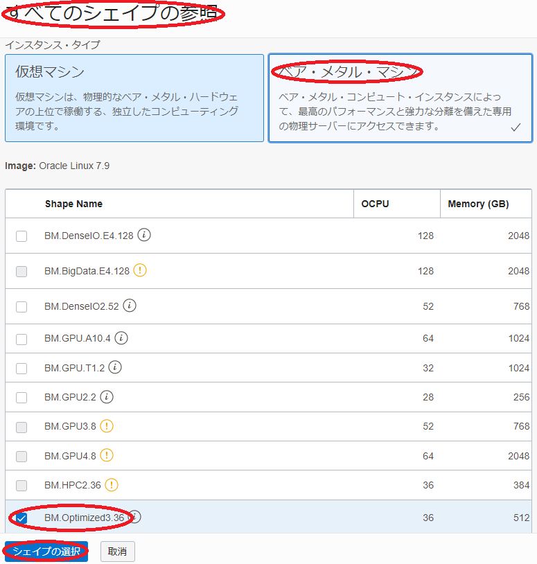

    - **Oracle Cloudエージェント** ： 以下 **OCA** プラグインを選択  
        - **Compute HPC RDMA Auto-Configuration**
        - **Compute HPC RDMA Authentication**  
    （ **拡張オプション** ボタンをクリックして表示される以下 **管理** フィールドの **Oracle Cloudエージェント** フィールドのドロップダウンメニューで選択）

    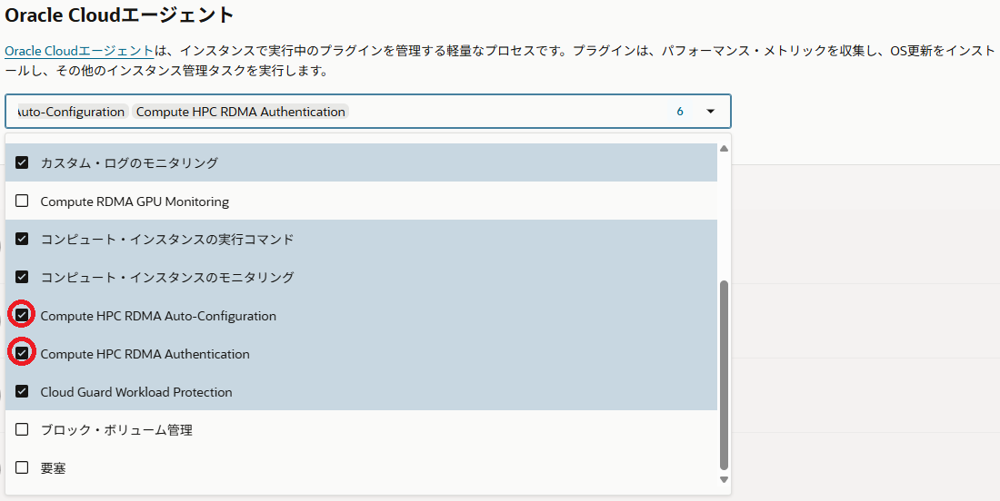

表示される **セキュリティー** 画面で、 **次** ボタンをクリックします。

表示される **ネットワーキング** 画面で、以下の情報を入力し **次** ボタンをクリックします。  
なお、ここに記載のないフィールドは、デフォルトのままとします。

1. **プライマリ・ネットワーク** フィールド

    - **仮想クラウド・ネットワーク** ： 先に作成した **仮想クラウド・ネットワーク**
    - **サブネット** ： 先に作成したプライベートサブネット

    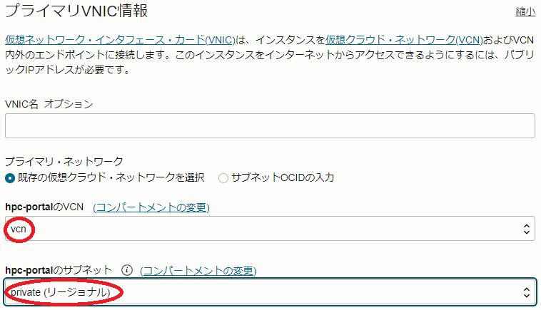

2. **SSHキーの追加** フィールド

    - **SSH公開キー** ：先にBastionノードで作成したSSH鍵ペアの公開鍵  
    （ **公開キーの貼付け** を選択することで入力フィールドを表示）  

    

表示される **ストレージ** 画面で、 **次** ボタンをクリックします。

表示される **確認** 画面で、設定した内容に間違いがないかを確認した後、 **作成** ボタンをクリックします。

## 2-3. クラスタ・ネットワーク作成

OCIコンソールにログインし、HPCクラスタを作成する **リージョン** を選択後、 **コンピュート** → **クラスタ・ネットワーク** とメニューを辿ります。

表示される以下画面で、**クラスタ・ネットワークの作成** ボタンをクリックします。


次に、表示される以下 **クラスタ・ネットワークの作成** 画面で、以下の情報を入力し **クラスタ・ネットワークの作成** ボタンをクリックします。  
なお、ここに記載のないフィールドは、デフォルトのままとします。

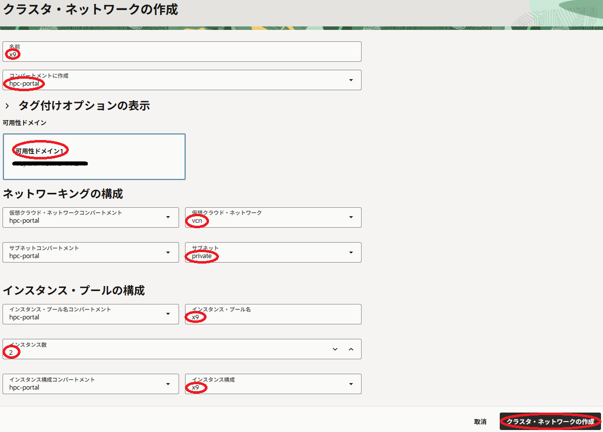

1. **名前** ： **[クラスタ・ネットワーク](../#5-1-クラスタネットワーク)** に付与する名前

2. **コンパートメントに作成** ： **クラスタ・ネットワーク** を作成する **コンパートメント**

3. **可用性ドメイン** ： **クラスタ・ネットワーク** を作成する **可用性ドメイン**

4. **ネットワーキングの構成** フィールド

    - **仮想クラウド・ネットワーク** ：先に作成した **仮想クラウドネットワーク** を選択
    - **サブネット** ：先に作成したプライベートサブネットを選択

5. **インスタンス・プールの構成** フィールド

    - **インスタンス・プール名** ：作成される **[インスタンス・プール](../#5-8-インスタンスプール)** に付与する名前（※4）
    - **インスタンス数** ：作成する計算ノードのノード数
    - **インスタンス構成** ：先に作成した **[インスタンス構成](../#5-7-インスタンス構成)**

    ※4） ここで付与した名前は、計算ノードのホスト名の接尾辞として使用されます。  
    例えば **x9** と指定した場合、計算ノードのホスト名は **inst-xxxxx-x9** となります。（ **xxxxx** はランダムな文字列）

次に、表示される以下 **クラスタ・ネットワーク** 画面で、ステータスが **プロビジョニング中** と表示されれば、 **クラスタ・ネットワーク** と計算ノードの作成が実施されています。


ステータスが **実行中** となれば、 **クラスタ・ネットワーク** と計算ノードの作成が完了しています。  
作成が完了するまでの所要時間は、計算ノードのノード数が2ノードの場合で10分程度です。

# 3. 計算ノード確認

## 3-0. 概要

本章は、以下のステップで作成された計算ノードの環境を確認します。

1. **[計算ノードログイン](#3-1-計算ノードログイン)**
2. **[cloud-init完了確認](#3-2-cloud-init完了確認)**
3. **[タイムゾーン確認](#3-3-タイムゾーン確認)**
4. **[NVMeローカルディスクファイルシステム確認](#3-4-nvmeローカルディスクファイルシステム確認)**
5. **[ファイアーウォール停止確認](#3-5-ファイアーウォール停止確認)**
6. **[クラスタ・ネットワーク接続用ネットワークインターフェース確認](#3-6-クラスタネットワーク接続用ネットワークインターフェース確認)**

## 3-1. 計算ノードログイン

計算ノードは、プライベートサブネットに接続されており、インターネットからログインすることが出来ないため、Bastionノードを経由してSSHログインします。  
Bastionノードから計算ノードへのログインは、計算ノードのインスタンス名を使用します。

計算ノードのインスタンス名は、OCIコンソールで計算ノードを作成した **リージョン** を選択後、 **コンピュート** → **インスタンス** とメニューを辿り、以下のインスタンス一覧からそのインスタンス名を確認します。  
またこの画面は、計算ノードのIPアドレスも表示しており、これを使用してBastionノードからSSHログインすることも可能です。


計算ノードへのログインは、以下のようにBastionノードからopcユーザでSSHログインします。

```sh
$ ssh inst-ofwf3-x9
```

## 3-2. cloud-init完了確認

**[cloud-init](../#5-11-cloud-init)** は、計算ノードが起動してSSHログインできる状態であっても、その処理が継続している可能性があるため、以下コマンドをBastionノードのopcユーザで実行し、そのステータスが **done** となっていることで **cloud-init** の処理完了を確認します。  
ステータスが **running** の場合は、 **cloud-init** の処理が継続中のため、処理が完了するまで待ちます。

```sh
$ pdsh -g all 'sudo cloud-init status' | dshbak -c
----------------
inst-ofwf3-x9,inst-toyke-x9
----------------
status: done
$
```

## 3-3. タイムゾーン確認

以下コマンドをBastionノードのopcユーザで実行し、タイムゾーンがJSTになっていることを確認します。

```sh
$ pdsh -g all 'date' | dshbak -c
----------------
inst-ofwf3-x9,inst-toyke-x9
----------------
Wed Oct 29 04:35:58 PM JST 2025
$
```

## 3-4. NVMeローカルディスクファイルシステム確認

以下コマンドをBastionノードのopcユーザで実行し、NVMeローカルディスク領域が **/mnt/localdisk** にマウントされていることを確認します。

```sh
$ pdsh -g all 'sudo df -h /mnt/localdisk' | dshbak -c
----------------
inst-ofwf3-x9,inst-toyke-x9
----------------
Filesystem              Size  Used Avail Use% Mounted on
/dev/mapper/nvme-lvol0  3.5T   25G  3.5T   1% /mnt/localdisk
$
```

## 3-5. ファイアーウォール停止確認

以下コマンドをBastionノードのopcユーザで実行し、ファイアーウォールが停止されていることを確認します。

```sh
$ pdsh -g all 'sudo systemctl status firewalld | grep -e Active -e disabled' | dshbak -c
----------------
inst-ofwf3-x9,inst-toyke-x9
----------------
     Loaded: loaded (/usr/lib/systemd/system/firewalld.service; disabled; preset: enabled)
     Active: inactive (dead)
$
```

## 3-6. クラスタ・ネットワーク接続用ネットワークインターフェース確認

以下コマンドをBastionノードのopcユーザで実行し、 **[クラスタ・ネットワーク](../#5-1-クラスタネットワーク)** 接続用のネットワークインターフェース（ **ens800f0np0** ）に **10.224.0.0/12** のネットワークアドレスに属するIPアドレスで4フィールド目が **仮想クラウド・ネットワーク** 接続用のネットワークインターフェース（ **ens300f0np0** ）に割り当てられたIPアドレスの4フィールド目と同じ値のものが設定されていることを確認します。（※5）

※5）このデフォルトのネットワークアドレスを変更する方法は、 **[OCI HPCテクニカルTips集](../#3-oci-hpcテクニカルtips集)** の **[クラスタネットワーキングイメージを使ったクラスタ・ネットワーク接続方法](../tech-knowhow/howto-connect-clusternetwork/)** の **[1-4. ネットワークアドレスのデフォルトからの変更](../tech-knowhow/howto-connect-clusternetwork/#1-4-ネットワークアドレスのデフォルトからの変更)** を参照してください。

```sh
$ pdsh -g all 'ip a s ens300f0np0 | grep "inet "; ip a s ens800f0np0 | grep inet' | dshbak -c
----------------
inst-toyke-x9
----------------
    inet 10.0.2.62/24 brd 10.0.2.255 scope global dynamic noprefixroute ens300f0np0
    inet 10.224.0.62/12 scope global ens800f0np0
----------------
inst-ofwf3-x9
----------------
    inet 10.0.2.168/24 brd 10.0.2.255 scope global dynamic noprefixroute ens300f0np0
    inet 10.224.0.168/12 scope global ens800f0np0
$
```

# 4. MPIプログラム実行（2ノード編）

## 4-0. 概要

本章は、計算ノードのHPC **[クラスタネットワーキングイメージ](../#5-13-クラスタネットワーキングイメージ)** に含まれる **[OpenMPI](https://www.open-mpi.org/)** と **Intel MPI Benchmark** を使用し、 **[クラスタ・ネットワーク](../#5-1-クラスタネットワーク)** のノード間インターコネクト性能を確認します。

**OpenMPI** を計算ノード間で実行するためには、mpirunを実行する計算ノード（いわゆるヘッドノード）から **OpenMPI** 実行に参加する他の全ての計算ノードに対して、パスフレーズ無しでSSH接続できる必要があります。

また **OpenMPI** の実行は、これを実行する計算ノード間で必要なポートにアクセス出来る必要があるため、先に作成したプライベートサブネットのセキュリティリストを修正する必要があります。

以上より、本章で実施する **Intel MPI Benchmark** によるMPIプログラム実行は、以下の手順を経て行います。

- **[計算ノード間SSH接続環境構築](#4-1-計算ノード間ssh接続環境構築)**
- **[プライベートサブネットセキュリティリスト修正](#4-2-プライベートサブネットセキュリティリスト修正)**
- **[Intel MPI Benchmark Ping-Pong実行](#4-3-intel-mpi-benchmark-ping-pong実行)**

## 4-1. 計算ノード間SSH接続環境構築

計算ノード間をパスフレーズ無しでSSH接続するための環境構築は、先にBastionノードで作成したSSH秘密鍵を全ての計算ノードにコピーすることでこれを実現します。

以下コマンドをBastionノードのopcユーザで実行し、BastionノードのSSH秘密鍵を全計算ノードにコピーします。

```sh
$ pdcp -g all -p ~/.ssh/id_rsa ~/.ssh/
```

次に、以下コマンドをBastionノードのopcユーザで実行し、先のSSH秘密鍵のコピーでBastionノードに作成された全計算ノードのエントリを含むknown_hostsファイルを全計算ノードにコピーします。

```sh
$ pdcp -g all -p ~/.ssh/known_hosts ~/.ssh/
```

次に、以下コマンドをBastionノードのopcユーザで実行し、後の **Intel MPI Benchmark** Ping-Pongを実行する際に使用する計算ノードのホスト名リストを全計算ノードにコピーします。  
なお、ホスト名リストを作成していない場合は、 **[OCI HPCテクニカルTips集](../#3-oci-hpcテクニカルtips集)** の **[計算/GPUノードのホスト名リスト作成方法](../tech-knowhow/compute-host-list/)** を参照してこれを作成し、Bastionノードのopcユーザのホームディレクトリにファイル名 **hostlist.txt** で配置します。

```sh
$ pdcp -g all -p ~/hostlist.txt ~/
```

## 4-2. プライベートサブネットセキュリティリスト修正

OCIコンソールにログインし、計算ノードを作成したリージョンを選択後、 **ネットワーキング** → **仮想クラウド・ネットワーク** とメニューを辿ります。

次に、表示される画面で、先に作成した **仮想クラウド・ネットワーク** をクリックします。

次に、表示される以下 **サブネット** フィールドで、先に作成したプライベートサブネットをクリックします。

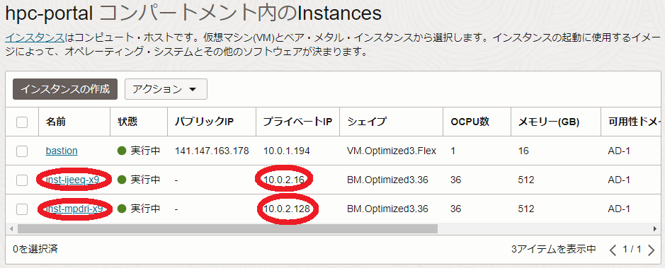

次に、表示される以下 **セキュリティ・リスト** フィールドで、プライベートサブネットに適用されている **セキュリティリスト** をクリックします。


次に、表示される以下 **イングレス・ルール** フィールドで、SSHアクセスを許可しているルールの **編集** メニューをクリックします。

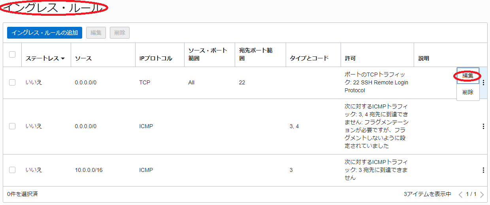

次に、表示される以下 **イングレス・ルールの編集** サイドバーで、 **IPプロトコル** フィールドを **すべてのプロトコル** に変更し、 **変更の保存** ボタンをクリックします。


次に、表示される以下 **イングレス・ルール** フィールドで、変更したルールの **IPプロトコル** が **すべてのプロトコル** に変更されていることを確認します。


## 4-3. Intel MPI Benchmark Ping-Pong実行

以下コマンドを計算ノードのうちの1ノードのopcユーザで実行し、 **Intel MPI Benchmarks** のPing-Pongを実行します。

```sh
$ source /usr/mpi/gcc/openmpi-4.1.7rc1/bin/mpivars.sh
$ mpirun -n 2 -N 1 -hostfile ~/hostlist.txt -x UCX_NET_DEVICES=mlx5_2:1 /usr/mpi/gcc/openmpi-4.1.7rc1/tests/imb/IMB-MPI1 -msglog 27:28 pingpong
#------------------------------------------------------------
#    Intel (R) MPI Benchmarks 2018, MPI-1 part    
#------------------------------------------------------------
# Date                  : Wed Oct 29 17:05:59 2025
# Machine               : x86_64
# System                : Linux
# Release               : 5.14.0-503.40.1.el9_5.x86_64
# Version               : #1 SMP PREEMPT_DYNAMIC Wed Apr 30 02:45:06 PDT 2025
# MPI Version           : 3.1
# MPI Thread Environment: 


# Calling sequence was: 

# /usr/mpi/gcc/openmpi-4.1.7rc1/tests/imb/IMB-MPI1 -msglog 27:28 pingpong

# Minimum message length in bytes:   0
# Maximum message length in bytes:   268435456
#
# MPI_Datatype                   :   MPI_BYTE 
# MPI_Datatype for reductions    :   MPI_FLOAT
# MPI_Op                         :   MPI_SUM  
#
#

# List of Benchmarks to run:

# PingPong

#---------------------------------------------------
# Benchmarking PingPong 
# #processes = 2 
#---------------------------------------------------
       #bytes #repetitions      t[usec]   Mbytes/sec
            0         1000         1.66         0.00
    134217728            1     10968.94     12236.16
    268435456            1     21931.66     12239.63


# All processes entering MPI_Finalize

$
```

# 5. 計算ノード追加

本章は、作成した **[クラスタ・ネットワーク](../#5-1-クラスタネットワーク)** に接続する計算ノードを2ノード追加して4ノードに拡張します。

この手順は、 **[OCI HPCテクニカルTips集](../#3-oci-hpcテクニカルtips集)** の **[計算/GPUノードの追加・削除・入れ替え方法](../tech-knowhow/cluster-resize/)** の **[2. ノード数を増やす](../tech-knowhow/cluster-resize/#2-ノード数を増やす)** の手順に従い、計算ノードを2ノードから4ノードに拡張します。

# 6. MPIプログラム実行（4ノード編）

## 6-0. MPIプログラム実行（4ノード編）概要

本章は、追加した2ノードを含めた計4ノードで **Intel MPI Benchmarks** のAll-Reduceを実行します。

## 6-1. 計算ノード間SSH接続環境構築

本章は、追加した2ノードを含めた4ノードの計算ノード間で、パスフレーズ無しのSSH接続ができる環境を構築します。

具体的な手順は、 **[4-1. 計算ノード間SSH接続環境構築](#4-1-計算ノード間ssh接続環境構築)** を参照ください。

## 6-2. Intel MPI Benchmarks All-Reduce実行

以下コマンドを計算ノードのうちの1ノードのopcユーザで実行し、4ノードで **Intel MPI Benchmarks** のAllreduceを実行します。

```sh
$ source /usr/mpi/gcc/openmpi-4.1.7rc1/bin/mpivars.sh
$ mpirun -n 144 -N 36 -hostfile ~/hostlist.txt -x UCX_NET_DEVICES=mlx5_2:1 -x PATH /usr/mpi/gcc/openmpi-4.1.7rc1/tests/imb/IMB-MPI1 -msglog 27:28 -npmin 144 allreduce
#------------------------------------------------------------
#    Intel (R) MPI Benchmarks 2018, MPI-1 part    
#------------------------------------------------------------
# Date                  : Wed Oct 29 17:33:15 2025
# Machine               : x86_64
# System                : Linux
# Release               : 5.14.0-503.40.1.el9_5.x86_64
# Version               : #1 SMP PREEMPT_DYNAMIC Wed Apr 30 02:45:06 PDT 2025
# MPI Version           : 3.1
# MPI Thread Environment: 


# Calling sequence was: 

# /usr/mpi/gcc/openmpi-4.1.7rc1/tests/imb/IMB-MPI1 -msglog 27:28 -npmin 144 allreduce

# Minimum message length in bytes:   0
# Maximum message length in bytes:   268435456
#
# MPI_Datatype                   :   MPI_BYTE 
# MPI_Datatype for reductions    :   MPI_FLOAT
# MPI_Op                         :   MPI_SUM  
#
#

# List of Benchmarks to run:

# Allreduce

#----------------------------------------------------------------
# Benchmarking Allreduce 
# #processes = 144 
#----------------------------------------------------------------
       #bytes #repetitions  t_min[usec]  t_max[usec]  t_avg[usec]
            0         1000         0.02         0.03         0.03
    134217728            1    147394.84    161213.00    155283.13
    268435456            1    308252.23    323720.28    313516.40


# All processes entering MPI_Finalize

$
```

# 7. 計算ノード入れ替え

本章は、構築した4ノードクラスタのうち1ノードにハードウェア障害等が発生した場合を想定し、この計算ノードを新たな計算ノードに入れ替えます。

この手順は、 **[OCI HPCテクニカルTips集](../#3-oci-hpcテクニカルtips集)** の **[計算/GPUノードの追加・削除・入れ替え方法](../tech-knowhow/cluster-resize/)** の **[3. ノードを置き換える](../tech-knowhow/cluster-resize/#3-ノードを置き換える)** の手順を実施します。

再度 **[6. MPIプログラム実行（4ノード編）](#6-mpiプログラム実行4ノード編)** に従い **Intel MPI Benchmarks** を実行、インターコネクト性能が十分出ていることを確認します。

# 8. クラスタ・ネットワークの終了

本章は、 **[クラスタ・ネットワーク](../#5-1-クラスタネットワーク)** を終了することで、作成したクラスタ・ネットワークと計算ノードを削除します。

OCIコンソールメニューから **コンピュート** → **クラスタ・ネットワーク** を選択し、表示される以下画面で作成した **クラスタ・ネットワーク** の **終了** メニューをクリックします。


表示される以下 **クラスタ・ネットワークの終了** サイドバーで、 **TERMINATE** と入力して **終了** ボタンをクリックします。

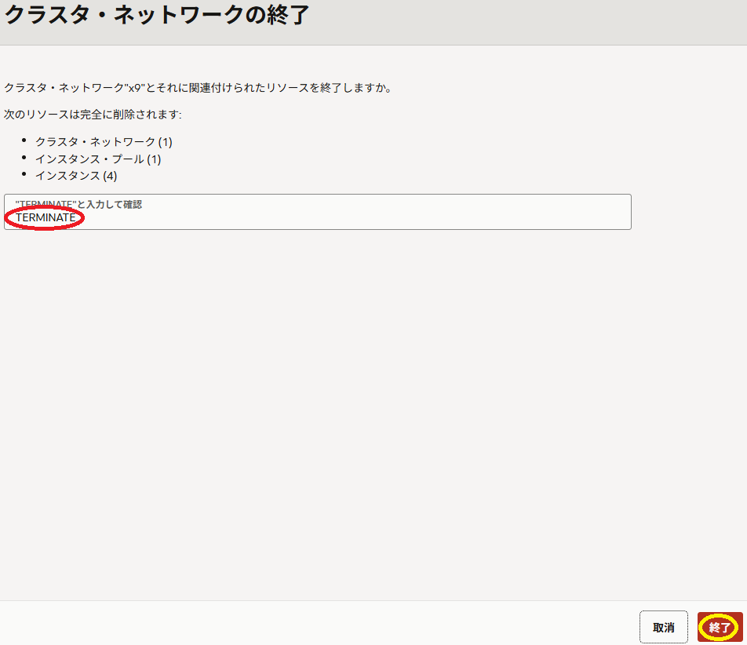

**クラスタ・ネットワーク** の **状態** が **終了済** となれば、削除が完了しています。

これで、このチュートリアルは終了です。