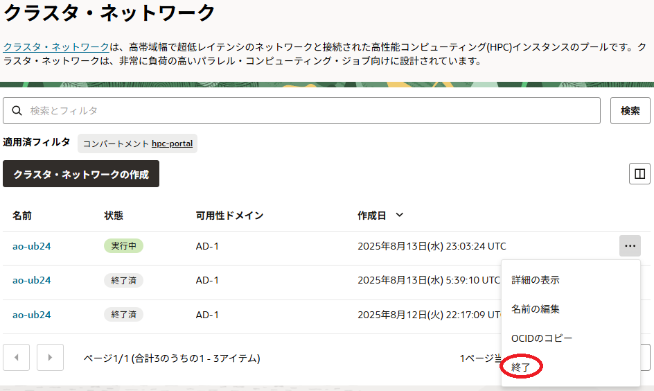

# 0. 概要

本チュートリアルは、8枚の **NVIDIA A100** GPUと16ポートの100 Gbps RDMA対応ネットワークインタフェースを搭載するベアメタルシェイプ **[BM.GPU4.8/BM.GPU.A100-v2.8](https://docs.oracle.com/ja-jp/iaas/Content/Compute/References/computeshapes.htm#bm-gpu)** と **Ubuntu** を組み合わせたGPUノードを **[クラスタ・ネットワーク](../#5-1-クラスタネットワーク)** でノード間接続するGPUクラスタを構築し、以下のGPUアプリケーション開発環境ソフトウェアのインストール・セットアップと

- **[NVIDIA Driver](https://docs.nvidia.com/datacenter/tesla/driver-installation-guide/index.html#)** : NVIDIA製GPUドライバソフトウェア
- **[NVIDIA CUDA](https://docs.nvidia.com/cuda/cuda-installation-guide-linux/contents.html)** : CUDAライブラリ
- **[NVIDIA Fabric Manager](https://docs.nvidia.com/datacenter/tesla/fabric-manager-user-guide/index.html)** : **NVSwitch** （ **BM.GPU4.8** / **BM.GPU.A100-v2.8** に搭載）管理ソフトウェア
- **[NVIDIA HPC SDK](https://developer.nvidia.com/hpc-sdk)** ： NVIDIA製GPU向けHPC/機械学習アプリケーション開発環境
- CUDA-aware MPIライブラリ： **CUDA IPC** / **GPUDirect RDMA** 対応のデバイスメモリアドレッシング可能なMPIライブラリ

以下の **クラスタ・ネットワーク** 接続に必要なソフトウェアのインストール・セットアップを行い、

- **[NVIDIA DOCA](https://docs.nvidia.com/doca/sdk/index.html)** ： **クラスタ・ネットワーク** 接続NIC（**NVIDIA Mellanox ConnectX**）ドライバーソフトウェア
- WPAサプリカント： **クラスタ・ネットワーク** 接続時の802.1X認証クライアントソフトウェア
- **[Oracle Cloud Agent](https://docs.oracle.com/ja-jp/iaas/Content/Compute/Tasks/manage-plugins.htm)** （以降 **OCA** と呼称）HPC関連プラグイン： **クラスタ・ネットワーク** 接続用エージェントソフトウェア

1ノードに搭載しきれないGPUを使用する複数のGPUノードに跨る大規模HPC/分散機械学習ワークロードのGPUアプリケーション開発・実行環境を構築します。

このGPUクラスタは、HPCワークロード向けGPUアプリケーションで近年主流となっている **CUDA IPC** / **GPUDirect RDMA** を使用するOpenACC/MPIハイブリッドプログラミングモデルや、分散機械学習ワークロード向け機械学習フレームワークで必須の **[NCCL（NVIDIA Collective Communication Library）](https://developer.nvidia.com/nccl)** を利用することが可能です。

また本チュートリアルは、構築した環境で以下のソフトウェア/サンプルプログラムを使用し、ホストメモリを介さずにノードを跨るデバイスメモリ間通信を行うGPUアプリケーションの動作確認を行います。

- OpenACC/MPIハイブリッドサンプルプログラム
- **[NCCL Tests](https://github.com/nvidia/nccl-tests)**

ここで紹介する構築手順は、 **[OCI HPCテクニカルTips集](../#3-oci-hpcテクニカルtips集)** の以下2本のコンテンツを組合せ、 **[プラットフォーム・イメージ](../#5-17-プラットフォームイメージ)** の **Ubuntu** にGPUアプリケーション開発環境ソフトウェアと **クラスタ・ネットワーク** 接続に必要なソフトウェアをインストール・セットアップします。

- **[UbuntuをOSとするHPC/機械学習ワークロード向けGPUインスタンス構築方法](../tech-knowhow/gpu-with-ubuntu/)**
- **[クラスタ・ネットワーク非対応OSイメージを使ったクラスタ・ネットワーク接続方法](../tech-knowhow/howto-create-cnenabled-osimage/)**

これらソフトウェアのインストールは、手順が多く相応の所要時間が必要なため、予め2ノードのGPUクラスタを構築してGPUノードにソフトウェアをインストールし、このGPUノードの **[カスタム・イメージ](../#5-6-カスタムイメージ)** で運用に供するGPUクラスタを構築します。

以上より、本チュートリアルのGPUクラスタ構築は、以下の手順を経て行います。

1. **[カスタム・イメージ取得用GPUクラスタ構築](#1-カスタムイメージ取得用gpuクラスタ構築)**
2. **[クラスタ・ネットワーク接続用ソフトウェアインストール](#2-クラスタネットワーク接続用ソフトウェアインストール)**
3. **[クラスタ・ネットワーク接続・確認](#3-クラスタネットワーク接続確認)**
4. **[GPUアプリケーション開発環境ソフトウェア環境構築](#4-gpuアプリケーション開発環境ソフトウェア環境構築)**
5. **[ノードを跨るデバイスメモリ間通信GPUアプリケーション動作確認](#5-ノードを跨るデバイスメモリ間通信gpuアプリケーション動作確認)**
6. **[カスタム・イメージ取得](#6-カスタムイメージ取得)**
7. **[本運用GPUクラスタ構築](#7-本運用gpuクラスタ構築)**
8. **[カスタム・イメージ取得用GPUクラスタ削除](#8-カスタムイメージ取得用gpuクラスタ削除)**

以降は、 **BM.GPU4.8** と **Ubuntu** 24.04の組合せを取り上げ、具体的な手順を解説します。  
本テクニカルTipsでは **BM.GPU4.8** を使用しますが、 **BM.GPU.A100-v2.8** の場合も同様の手順を適用することが可能です。


本チュートリアルは、以下のソフトウェアバージョンを前提とします。

- OS ： **Ubuntu** 24.04（※1）
- **NVIDIA Driver** ： 575.57.08
- **NVIDIA CUDA** ： 12.9.1
- **NVIDIA Fabric Manager** ： 575.57.08
- **NVIDIA HPC SDK** ： 25.7
- CUDA-aware MPIライブラリ ： **[OpenMPI](https://www.open-mpi.org/)** 5.0.8
- **NVIDIA DOCA** ： 3.1.0

※1） **[プラットフォーム・イメージ](../#5-17-プラットフォームイメージ)** の **[Canonical-Ubuntu-24.04-2025.07.23-0](https://docs.oracle.com/en-us/iaas/images/ubuntu-2404/canonical-ubuntu-24-04-2025-07-23-0.htm)** です。

**所要時間 :** 約5時間

**前提条件 :** GPUクラスタを収容するコンパートメント(ルート・コンパートメントでもOKです)の作成と、このコンパートメントに対する必要なリソース管理権限がユーザーに付与されていること。

**注意 :** 本コンテンツ内の画面ショットは、現在のOCIコンソール画面と異なっている場合があります。

# 1. カスタム・イメージ取得用GPUクラスタ構築

本章は、GPUアプリケーション開発環境ソフトウェアと **[クラスタ・ネットワーク](../#5-1-クラスタネットワーク)** 接続に必要なソフトウェアをインストールした **[カスタム・イメージ](../#5-6-カスタムイメージ)** を取得するための2ノードのGPUクラスタを構築します。

このGPUクラスタは、 **[OCI HPCチュートリアル集](../#1-oci-hpcチュートリアル集)** の **[GPUクラスタを構築する(基礎インフラ手動構築編)](../spinup-gpu-cluster/)** を活用し、このチュートリアルの以下の章を実施することで、その構築を行います。

- **[1. GPUクラスタ作成事前作業](../spinup-gpu-cluster/#1-gpuクラスタ作成事前作業)**
- **[2. GPUクラスタ作成](../spinup-gpu-cluster/#2-gpuクラスタ作成)**

この際、上記チュートリアルに対して、以下の点を変更して実施します。

- cloud-config適用除外  
**[2-1. cloud-config作成](../spinup-gpu-cluster/#2-1-cloud-config作成)** で作成しているcloud-configは、その処理内容をカスタム・イメージ取得用のGPUノードに適用する必要が無いため、作成しません。  
またこれに伴い、後の **[2-2. インスタンス構成作成](../spinup-gpu-cluster/#2-2-インスタンス構成作成)** の **8. 管理フィールド** で指定しているcloud-configも適用しません。

- イメージ変更  
**[2-2. インスタンス構成作成](../spinup-gpu-cluster/#2-2-インスタンス構成作成)** の **4. イメージとシェイプ フィールド** で指定するイメージは、 **Canonical Ubuntu 24.04** を指定します。  
（ **イメージの変更** ボタンをクリックして表示される以下 **イメージの選択** サイドバーで **Ubuntu** を選択し表示される **Canonical Ubuntu 24.04** を選択して表示される **イメージ・ビルド** フィールドで **2025.07.23-0** （選択できなければ最新を選択）を選択し **イメージの選択** ボタンをクリック）

  

- **OCA** 有効化のスキップ  
**[2-2. インスタンス構成作成](../spinup-gpu-cluster/#2-2-インスタンス構成作成)** の **9. Oracle Cloudエージェント フィールド** で有効化している **OCA** の **Compute HPC RDMA Auto-Configuration** と **Compute HPC RDMA Authentication** のHPC関連プラグインは、のちの手順で有効化を行うため、ここでは有効化を行いません。

# 2. クラスタ・ネットワーク接続用ソフトウェアインストール

本章は、 **[クラスタ・ネットワーク](../#5-1-クラスタネットワーク)** に接続するためのソフトウェアをインストールします。

このインストールは、 **[OCI HPCテクニカルTips集](../#3-oci-hpcテクニカルtips集)** の **[クラスタ・ネットワーク非対応OSイメージを使ったクラスタ・ネットワーク接続方法](../tech-knowhow/howto-create-cnenabled-osimage/)** の **[2. クラスタ・ネットワーク接続用ソフトウェアインストール](../tech-knowhow/howto-create-cnenabled-osimage/#2-クラスタネットワーク接続用ソフトウェアインストール)** の手順を **BM.GPU4.8** と **Ubuntu** 24.04の場合で実施します。

# 3. クラスタ・ネットワーク接続・確認

本章は、GPUノードの **[クラスタ・ネットワーク](../#5-1-クラスタネットワーク)** への接続に必要な設定とその接続確認を実施します。

この接続・確認は、 **[OCI HPCテクニカルTips集](../#3-oci-hpcテクニカルtips集)** の **[クラスタ・ネットワーク未対応OSイメージを使ったクラスタ・ネットワーク接続方法](../tech-knowhow/howto-create-cnenabled-osimage/)** の **[3. クラスタ・ネットワーク接続・確認](../tech-knowhow/howto-create-cnenabled-osimage/#3-クラスタネットワーク接続確認)** の手順を **BM.GPU4.8** と **Ubuntu** 24.04の場合で実施します。

# 4. GPUアプリケーション開発環境ソフトウェア環境構築

本章は、GPUノードにGPUアプリケーション開発環境ソフトウェアをインストール・セットアップします。

このGPUアプリケーション開発環境ソフトウェアのインストール・セットアップは、 **[OCI HPCテクニカルTips集](../#3-oci-hpcテクニカルtips集)** の **[UbuntuをOSとするHPC/機械学習ワークロード向けGPUインスタンス構築方法](../tech-knowhow/gpu-with-ubuntu/)** の **[2. NVIDIA GPU関連ソフトウェアインストール](../tech-knowhow/gpu-with-ubuntu/#2-nvidia-gpu関連ソフトウェアインストール)** と **[3. OpenMPIインストール・セットアップ](../tech-knowhow/gpu-with-ubuntu/#3-openmpiインストールセットアップ)** と **[4. 動作確認](../tech-knowhow/gpu-with-ubuntu/#4-動作確認)** を2台のGPUノードの何れにも実施します。

# 5. ノードを跨るデバイスメモリ間通信GPUアプリケーション動作確認

## 5-0. 概要

本章は、以下のソフトウェア/サンプルプログラムを使用し、ここまで構築してきたソフトウェア環境の動作確認を行います。

1. **[OpenACC/MPIハイブリッドサンプルプログラム](#5-1-openaccmpiハイブリッドサンプルプログラム)**
2. **[NCCL Tests](#5-2-nccl-tests)**

これらのソフトウェア/サンプルプログラムは、ホストメモリを介さずにノードを跨るデバイスメモリ間通信を行うアプリケーションになっています。

## 5-1. OpenACC/MPIハイブリッドサンプルプログラム

ここで使用するOpenACC/MPIハイブリッドのサンプルプログラムは、 **[東京大学 情報基盤センター](https://www.itc.u-tokyo.ac.jp/)** 様がGitHubの以下レポジトリから公開している、並列プログラミング講習会向けのものを利用させて頂くこととします。

**[https://github.com/hoshino-UTokyo/lecture_openacc_mpi](https://github.com/hoshino-UTokyo/lecture_openacc_mpi)**

以降では、既に単一GPUノードの稼働確認でクローンした **lecture_openacc_mpi/C/openacc_mpi_basic/06_gdr** ディレクトリ配下のサンプルプログラムを使用します。  
この際、 **東京大学 情報基盤センター** 様との環境の違いから、このディレクトリの **Makefile** を以下のように修正します。

```sh
$ diff Makefile_org Makefile
8c8
< CFLAGS    = -O3 -acc -Minfo=accel  -ta=tesla,cc80
---
> CFLAGS    = -O3 -acc -Minfo=accel  -gpu=cc80
$
```

次に、以下コマンドを2ノードのうちのどちらか1ノードのGPUノードのGPUクラスタ利用ユーザで実行し、このサンプルプログラムをコンパイル・実行することで、CUDA-aware **OpenMPI** の動作を確認します。  

```sh
$ cd ~/`hostname`/lecture_openacc_mpi/C/openacc_mpi_basic/06_gdr
$ module purge
$ module load nvhpc openmpi
$ make
mpicc -O3 -acc -Minfo=accel  -gpu=cc80 -c main.c
"main.c", line 57: warning: The independent loop parallelism with no parallelism level is set to seq when inferring the routine parallelism of the enclosing function [independent_loop_type]
  #pragma acc loop independent
  ^

Remark: individual warnings can be suppressed with "--diag_suppress <warning-name>"

main:
     54, Generating create(a[:16777216],b[:16777216]) [if not already present]
         Generating copyout(b[:16777216],a[:16777216]) [if not already present]
     58, Loop is parallelizable
         Generating NVIDIA GPU code
         58, #pragma acc loop gang, vector(128) /* blockIdx.x threadIdx.x */
     72, Generating implicit copy(sum) [if not already present]
         Generating copyin(b[:16777216]) [if not already present]
     76, Loop is parallelizable
         Generating NVIDIA GPU code
         76, #pragma acc loop gang, vector(128) /* blockIdx.x threadIdx.x */
             Generating reduction(+:sum)
mpicc -O3 -acc -Minfo=accel  -gpu=cc80  main.o   -o run 
$ mpirun -n 2 -N 1 -hostfile ~/hostlist.txt -x UCX_NET_DEVICES=mlx5_4:1 -x LD_LIBRARY_PATH ./run
[inst-v6xda-ao-ub24:18886] SET UCX_NET_DEVICES=mlx5_4:1
num of GPUs = 8
Rank 1: hostname = inst-s08bb-ao-ub24, GPU num = 1
Rank 0: hostname = inst-v6xda-ao-ub24, GPU num = 0
mean = 30.00
Time =    0.008 [sec]
$
```

## 5-2. NCCL Tests

**[OCI HPCパフォーマンス関連情報](../#2-oci-hpcパフォーマンス関連情報)** の **[NCCL Tests実行方法（BM.GPU4.8/BM.GPU.A100-v2.8 Ubuntu編）](../benchmark/run-nccltests-ubuntu/)** の **[2. NCCL Testsコンパイル](../benchmark/run-nccltests-ubuntu/#2-nccl-testsコンパイル)** と **[3. NCCL Tests実行](../benchmark/run-nccltests-ubuntu/#3-nccl-tests実行)** の手順に従い、2ノード16GPUの **NCCL**  **All-Reduce** 通信性能を **NCCL Tests** で計測し、期待される性能が出ることを確認します。

# 6. カスタム・イメージ取得

本章は、 **[カスタム・イメージ](../#5-6-カスタムイメージ)** 取得用2ノードGPUクラスタのGPUノードのうちどちらか一台で、 **カスタム・イメージ** を取得します。

この **カスタム・イメージ** 取得は、 **[OCI HPCテクニカルTips集](../#3-oci-hpcテクニカルtips集)** の **[クラスタ・ネットワーク未対応OSイメージを使ったクラスタ・ネットワーク接続方法](../tech-knowhow/howto-create-cnenabled-osimage/)** の **[4. カスタム・イメージ取得](../tech-knowhow/howto-create-cnenabled-osimage/#4-カスタムイメージ取得)** を **BM.GPU4.8** と **Ubuntu** の組合わせで実施します。

# 7. 本運用GPUクラスタ構築

## 7-0. 概要

本章は、先に作成した **[カスタム・イメージ](../#5-6-カスタムイメージ)** を使用し、本運用に供するGPUクラスタを以下の手順で構築します。

1. **[cloud-config作成](#7-1-cloud-config作成)**
2. **[インスタンス構成作成](#7-2-インスタンス構成作成)**
3. **[クラスタ・ネットワーク作成](#7-3-クラスタネットワーク作成)**

## 7-1. cloud-config作成

本章は、本運用に供するGPUクラスタ構築のための **[cloud-init](../#5-11-cloud-init)** 設定ファイル（cloud-config）を作成します。  

この **cloud-init** 設定ファイル作成は、 **[OCI HPCテクニカルTips集](../#3-oci-hpcテクニカルtips集)** の **[クラスタ・ネットワーク非対応OSイメージを使ったクラスタ・ネットワーク接続方法](../tech-knowhow/howto-create-cnenabled-osimage/)** の **[5. cloud-config作成](../tech-knowhow/howto-create-cnenabled-osimage/#5-cloud-config作成)** を **BM.GPU4.8** と **Ubuntu** の組合わせで実施します。

## 7-2. インスタンス構成作成

本章は、本運用に供するGPUクラスタ構築のための **[インスタンス構成](../#5-7-インスタンス構成)** を作成します。

この **インスタンス構成** 作成は、 **[OCI HPCテクニカルTips集](../#3-oci-hpcテクニカルtips集)** の **[クラスタ・ネットワーク非対応OSイメージを使ったクラスタ・ネットワーク接続方法](../tech-knowhow/howto-create-cnenabled-osimage/)** の **[6. インスタンス構成作成](../tech-knowhow/howto-create-cnenabled-osimage/#6-インスタンス構成作成)** を **BM.GPU4.8** と **Ubuntu** の組合わせで実施します。

## 7-3. クラスタ・ネットワーク作成

本章は、本運用に供するGPUクラスタ構築のための **[クラスタ・ネットワーク](../#5-1-クラスタネットワーク)** を作成します。

この **クラスタ・ネットワーク** 作成は、 **[OCI HPCテクニカルTips集](../#3-oci-hpcテクニカルtips集)** の **[クラスタ・ネットワーク非対応OSイメージを使ったクラスタ・ネットワーク接続方法](../tech-knowhow/howto-create-cnenabled-osimage/)** の **[7. クラスタ・ネットワーク作成](../tech-knowhow/howto-create-cnenabled-osimage/#7-クラスタネットワーク作成)** を **BM.GPU4.8** と **Ubuntu** の組合わせで実施します。

# 8. カスタム・イメージ取得用GPUクラスタ削除

本章は、 **[クラスタ・ネットワーク](../#5-1-クラスタネットワーク)** を終了することで、カスタム・イメージ取得用として作成した **クラスタ・ネットワーク** とGPUノードを削除します。

OCIコンソールメニューから **コンピュート** → **クラスタ・ネットワーク** を選択し、表示される以下画面で **カスタム・イメージ** 取得用に作成した **クラスタ・ネットワーク** の **終了** メニューをクリックします。



表示される以下 **クラスタ・ネットワークの終了** サイドバーで、 **TERMINATE** と入力して **終了** ボタンをクリックします。


**クラスタ・ネットワーク** の **状態** が **終了済** となれば、削除が完了しています。

<br>
<br>

以上で本チュートリアルは終了です。