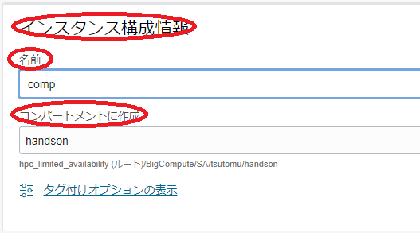
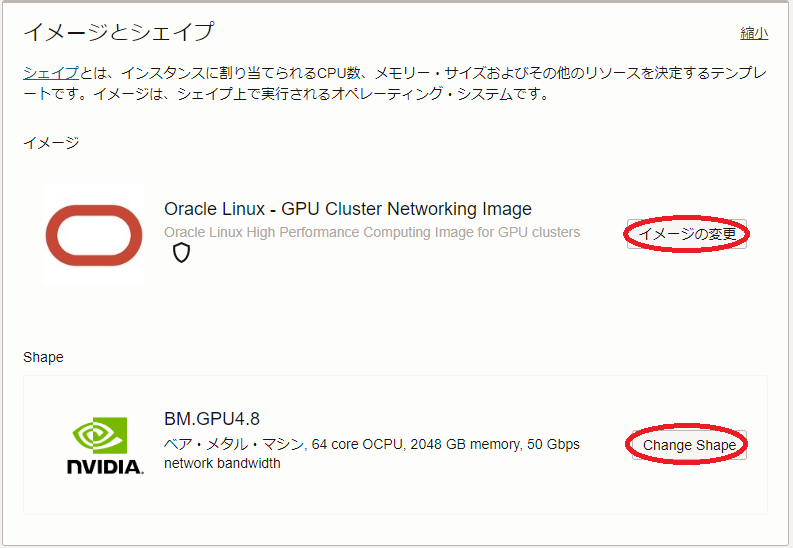

<style>
table, th, td {
    font-size: 80%;
}
</style>

# 0. 概要

本チュートリアルは、OCIコンソールから必要なリソースを順次OCI上に作成してその上でソフトウェア環境を手動で構築する方法で、8枚の **NVIDIA A100** GPUと16ポートの100 Gbps RDMA対応ネットワークインタフェースを搭載するベアメタルシェイプ **[BM.GPU4.8/BM.GPU.A100-v2.8](https://docs.oracle.com/ja-jp/iaas/Content/Compute/References/computeshapes.htm#bm-gpu)** を **[クラスタ・ネットワーク](../#5-1-クラスタネットワーク)** でノード間接続するGPUクラスタを構築し、 **[containerd](https://github.com/containerd/containerd/tree/main)** と **[NVIDIA Container Toolkit](https://docs.nvidia.com/datacenter/cloud-native/container-toolkit/latest/index.html)** を使用するコンテナ実行環境をGPUクラスタ上に構築、複数ノードに跨るGPU間の通信性能を **[NCCL（NVIDIA Collective Communication Library）](https://developer.nvidia.com/nccl)** の通信性能計測プログラム **[NCCL Tests](https://github.com/nvidia/nccl-tests)** で検証後、分散機械学習の稼働確認として **TensorFlow** の **MultiWorkerMirroredStrategy** を使用するサンプルプログラムを実行、その性能を検証します。

本チュートリアルで構築するGPUクラスタの構成を以下に示します。

[GPUノード]
- シェイプ ： **BM.GPU4.8/BM.GPU.A100-v2.8**
- ノード間接続インターコネクト ： **[クラスタ・ネットワーク](../#5-1-クラスタネットワーク)** （100 Gbps x 16）
- **イメージ** ： **Oracle Linux** 9.5ベースのGPU **[クラスタネットワーキングイメージ](../#5-13-クラスタネットワーキングイメージ)** （※1）
- コンテナランタイム ： **containerd** 2.2.0
- **NVIDIA Container Toolkit** ： 1.18.0

[Bastionノード]
- シェイプ ： **[VM.Standard.E5.Flex](https://docs.oracle.com/ja-jp/iaas/Content/Compute/References/computeshapes.htm#flexible)**
- **イメージ** ： **Oracle Linux** 9.5ベースのGPU **[クラスタネットワーキングイメージ](../#5-13-クラスタネットワーキングイメージ)** （※1）

※1） **[OCI HPCテクニカルTips集](../#3-oci-hpcテクニカルtips集)** の **[クラスタネットワーキングイメージの選び方](../tech-knowhow/osimage-for-cluster/)** の **[1. クラスタネットワーキングイメージ一覧](../tech-knowhow/osimage-for-cluster/#1-クラスタネットワーキングイメージ一覧)** のイメージ **No.15** です。  


このチュートリアルで作成する環境は、ユーザ管理、ホスト名管理、ファイル共有、プログラム開発環境、コンテナオーケストレーション等、必要なソフトウェア環境をこの上に整備し、ご自身の要件に沿ったGPUクラスタを構築する際の基礎インフラストラクチャとして利用することが可能です。  
なお、これらのクラスタ管理に必要なソフトウェアの導入までを自動化する **[HPCクラスタスタック](../#5-10-hpcクラスタスタック)** も利用可能で、詳細は **[OCI HPCチュートリアル集](../#1-oci-hpcチュートリアル集)** のカテゴリ **[機械学習環境](../#1-2-機械学習環境)** のチュートリアルでクラスタ管理機能が有りとなっているチュートリアルを参照してください。

**所要時間 :** 約2時間

**前提条件 :** GPUクラスタを収容する **コンパートメント** ( **ルート・コンパートメント** でもOKです)の作成と、このコンパートメントに対する必要なリソース管理権限がユーザーに付与されていること。

**注意 :** 本コンテンツ内の画面ショットは、現在のOCIコンソール画面と異なっている場合があります。

# 1. GPUクラスタ作成事前作業

## 1-0. 概要

本章は、GPUノードをTCP接続する **仮想クラウド・ネットワーク** と、インターネットから直接アクセス出来ないプライベートサブネットに接続するGPUノードにログインする際の踏み台となるBastionノードを、GPUクラスタ作成前に予め用意します。

なおこの **仮想クラウド・ネットワーク** は、既存のものを使用することが可能です。  
ただしこの場合、GPUノードが接続するサブネットは、 **[クラスタ・ネットワーク](../#5-1-クラスタネットワーク)** 接続に使用する **[Oracle Cloud Agent](https://docs.oracle.com/ja-jp/iaas/Content/Compute/Tasks/manage-plugins.htm)** （以降 **OCA** と呼称します。）HPCプラグインの動作条件を満たしている必要があります。  
この詳細は、 **[OCI HPCテクニカルTips集](../#3-oci-hpcテクニカルtips集)** の **[クラスタネットワーキングイメージを使ったクラスタ・ネットワーク接続方法](../tech-knowhow/howto-connect-clusternetwork/)** の **[1-2. 接続サブネットの動作条件充足確認](../tech-knowhow/howto-connect-clusternetwork/#1-2-接続サブネットの動作条件充足確認)** を参照してください。

## 1-1. 仮想クラウド・ネットワーク作成

**仮想クラウド・ネットワーク** の作成は、 **[OCIチュートリアル](https://oracle-japan.github.io/ocitutorials/)** の **[その2 - クラウドに仮想ネットワーク(VCN)を作る](https://oracle-japan.github.io/ocitutorials/beginners/creating-vcn)** の手順に従い、以下のリソースを作成します。

- **仮想クラウド・ネットワーク** （10.0.0.0/16）
- パブリックサブネット（10.0.1.0/24）
- プライベートサブネット（10.0.2.0/24）
- **インターネット・ゲートウェイ** （パブリックサブネットにアタッチ）
- **NATゲートウェイ** （プライベートサブネットにアタッチ）
- **サービス・ゲートウェイ** （プライベートサブネットにアタッチ）
- **ルート表** x 2（パブリックサブネットとプライベートサブネットにアタッチ）
- **セキュリティリスト** x 2（パブリックサブネットとプライベートサブネットにアタッチ）

作成後、 **セキュリティリスト** が以下となるように修正します。

| サブネット  | 通信方向  | ステートレス | ソース         | IPプロトコル  | ソース・ポート範囲 | 宛先ポート範囲 |
| :----: | :---: | :----: | :---------: | :------: | :-------: | :-----: |
| パブリック  | イングレス | いいえ    | 0.0.0.0/0   | TCP      | All       | 22      |
|        |       | いいえ    | 10.0.0.0/16 | 全てのプロトコル | -         | -       |
|        | イグレス  | いいえ    | 0.0.0.0/0   | 全てのプロトコル | -         | -       |
| プライベート | イングレス | いいえ    | 10.0.0.0/16 | 全てのプロトコル | -         | -       |
|        | イグレス  | いいえ    | 0.0.0.0/0   | 全てのプロトコル | -         | -       |


この **仮想クラウド・ネットワーク** は、 **セキュリティリスト** でインターネットとの通信に以下のアクセス制限が掛けられています。

- インターネットからのアクセス：パブリックサブネットに接続するインスタンスの宛先ポート22番（SSH）に限定
- インターネットへのアクセス：インターネット上の任意の宛先IPアドレス・ポートに制限なくアクセス可能

本チュートリアルで構築するコンテナランタイムは、 **10.0.2.2** を特別なIPアドレスとして内部的に使用するため、GPUノードを接続するサブネットにこのIPアドレスを含む **10.0.2.0/24** 等のCIDRレンジを使用すると、コンテナからこのサブネットへの通信が出来なくなる点に留意します。

## 1-2. Bastionノード作成

Bastionノードの作成は、 **[OCIチュートリアル](https://oracle-japan.github.io/ocitutorials/)** の  **[その3 - インスタンスを作成する](https://oracle-japan.github.io/ocitutorials/beginners/creating-compute-instance)** の手順を参考に、ご自身の要件に沿ったインスタンスを先の手順で **仮想クラウド・ネットワーク** を作成した **コンパートメント** とパブリックサブネットを指定して作成します。  
本チュートリアルは、以下属性のインスタンスをBastionノードとして作成します。

- **名前** ： bastion
- **シェイプ** ： **[VM.Standard.E5.Flex](https://docs.oracle.com/ja-jp/iaas/Content/Compute/References/computeshapes.htm#flexible)** （任意のコア数・メモリ容量）
- **イメージ** ： **Oracle Linux** 9.5ベースのGPU **[クラスタネットワーキングイメージ](../#5-13-クラスタネットワーキングイメージ)** （※2）
- **SSHキーの追加** ： Bastionノードにログインする際使用するSSH秘密鍵に対応する公開鍵

※2） **[OCI HPCテクニカルTips集](../#3-oci-hpcテクニカルtips集)** の **[クラスタネットワーキングイメージの選び方](../tech-knowhow/osimage-for-cluster/)** の **[1. クラスタネットワーキングイメージ一覧](../tech-knowhow/osimage-for-cluster/#1-クラスタネットワーキングイメージ一覧)** のイメージ **No.15** です。  

次に、作成したBastionノードにopcユーザでSSHログインして以下コマンドを実行、SSH鍵ペアを作成してこの公開鍵を **authorized_keys** に登録します。  
このSSH鍵は、BastionノードからGPUノードにログインする際や、GPUノード間のMPIプログラム実行時に使用します。

```sh
$ ssh-keygen -t rsa -N "" -f ~/.ssh/id_rsa
$ cat ~/.ssh/id_rsa.pub | tee -a ~/.ssh/authorized_keys
```

次に、以降作成するGPUノードの名前解決をインスタンス名で行うため、 **[OCI HPCテクニカルTips集](../#3-oci-hpcテクニカルtips集)** の **[計算/GPUノードの効果的な名前解決方法](../tech-knowhow/compute-name-resolution/)** の手順を実施します。

次に、以降作成するGPUノードで実施する手順を **[pdsh](https://github.com/chaos/pdsh)** を使用して効率よく進めるため、 **[OCI HPCテクニカルTips集](../#3-oci-hpcテクニカルtips集)** の **[pdshで効率的にクラスタ管理オペレーションを実行](../tech-knowhow/cluster-with-pdsh/)** の **[1. pdshインストール・セットアップ](../tech-knowhow/cluster-with-pdsh/#1-pdshインストールセットアップ)** の手順を実施し、 **pdsh** をインストール・セットアップします。  
なおこの手順は、該当する手順を全てのGPUノードで実施する場合、必要ありません。

次に、以下コマンドをopcユーザで実行し、GPUクラスタ内でホームディレクトリをNFS共有するためNFSサーバとして構成します。

```sh
$ echo "/home 10.0.0.0/16(rw,sync,no_root_squash)" | sudo tee -a /etc/exports
$ sudo systemctl enable --now nfs-server rpcbind
```

次に、以下のファイルを新規に作成後

[ **/etc/firewalld/zones/trusted.xml** ]

```sh
<?xml version="1.0" encoding="utf-8"?>
<zone target="ACCEPT">
  <short>Trusted</short>
  <description>All network connections are accepted.</description>
  <source address="10.0.0.0/16"/>
</zone>
```

opcユーザで以下コマンドを実行し、プライベートサブネットからのNFSアクセスをファイアーウォールに許可します。

```sh
$ sudo systemctl restart firewalld
```

# 2. GPUクラスタ作成

## 2-0. 概要

本章は、 **[クラスタ・ネットワーク](../#5-1-クラスタネットワーク)** を作成することでGPUクラスタを作成します。

**クラスタ・ネットワーク** の作成は、 **[インスタンス構成](../#5-7-インスタンス構成)** を指定して行い、この **インスタンス構成** で指定している **シェイプ** のインスタンスを指定するノード数分作成し、これを **クラスタ・ネットワーク** に接続します。

またGPUノードのOSレベルのカスタマイズは、 **[cloud-init](../#5-11-cloud-init)** を使用して自動化することで、作成後の作業を軽減します。

以上より、GPUクラスタの作成は、以下の手順を経て行います。

- **[cloud-init設定ファイル（cloud-config）作成](#2-1-cloud-config作成)**
- **[インスタンス構成作成](#2-2-インスタンス構成作成)**
- **[クラスタ・ネットワーク作成](#2-3-クラスタネットワーク作成)**

## 2-1. cloud-config作成

本チュートリアルは、 **cloud-init** を以下の目的で使用します。

- タイムゾーンをJSTに変更
- NVMe SSDローカルディスク領域ファイルシステム作成
- firewalld停止
- ルートファイルシステム拡張
- パブリックサブネットのドメイン名を **search** 行に追加
- BastionノードのホームディレクトリをNFSマウント

以下は、本チュートリアルで使用する **BM.GPU4.8/BM.GPU.A100-v2.8** 用の **cloud-init** 設定ファイル（以降 **cloud-config** と呼称します。）で、OCIコンソールを実行している端末上にテキストファイルで保存します。

```sh
#cloud-config
#
# Change time zone to JST
timezone: Asia/Tokyo

runcmd:
#
# NVMe local storage setting
  - vgcreate nvme /dev/nvme0n1 /dev/nvme1n1 /dev/nvme2n1 /dev/nvme3n1
  - lvcreate -l 100%FREE nvme
  - mkfs.xfs -L localscratch /dev/nvme/lvol0
  - mkdir -p /mnt/localdisk
  - echo "LABEL=localscratch /mnt/localdisk/ xfs defaults,noatime 0 0" >> /etc/fstab
  - mount /mnt/localdisk
#
# Stop firewalld
  - systemctl disable --now firewalld
#
# Expand root file system to those set by instance configuration
  - /usr/libexec/oci-growfs -y
#
# Add public subnet to DNS search
  - sed -i '/^search/s/$/ public.vcn.oraclevcn.com/g' /etc/resolv.conf
  - chattr -R +i /etc/resolv.conf
#
# NFS mount setting
  - echo "bastion:/home /home nfs defaults,vers=3 0 0" >> /etc/fstab
  - mount /home
```

## 2-2. インスタンス構成作成

OCIコンソールにログインし、GPUクラスタをデプロイするリージョンを選択後、 **コンピュート** → **[インスタンス構成](../#5-7-インスタンス構成)** とメニューを辿ります。

表示される以下画面で、**インスタンス構成の作成** ボタンをクリックします。


表示される **基本情報** 画面で、以下の情報を入力し **次** ボタンをクリックします。  
なお、ここに記載のないフィールドは、デフォルトのままとします。

1. **インスタンス構成情報** フィールド

    - **名前** ： **インスタンス構成** に付与する名前
    - **コンパートメントに作成** ： **インスタンス構成** を作成する **コンパートメント**
    - **インスタンスの作成先のコンパートメント** ： GPUノードを作成する **コンパートメント**

    

2. **配置** フィールド

    - **可用性ドメイン** ：GPUノードを作成する **可用性ドメイン**

    

3. **イメージとシェイプ** フィールド

    

    - **イメージ** ：Oracle Linux - GPU Cluster Networking Image  
    （ **イメージの変更** ボタンをクリックして表示される以下 **イメージの選択** サイドバーで、 **Marketplace** を選択し検索フィールドに **gpu** と入力して表示される **Oracle Linux - GPU Cluster Networking Image** を選択して表示される **イメージ・ビルド** ブルダウンメニューで **Oracle-Linux-9.5-2025.05.19-0-RHCK-OFED-24.10-1.1.4.0-GPU-570-OPEN-CUDA-12.8-2025.07.20-0** （※3）を選択し、 **イメージの選択** ボタンをクリック。）

    

    ※3）このイメージは、 **[OCI HPCテクニカルTips集](../#3-oci-hpcテクニカルtips集)** の **[クラスタネットワーキングイメージの選び方](../tech-knowhow/osimage-for-cluster/)** の **[1. クラスタネットワーキングイメージ一覧](../tech-knowhow/osimage-for-cluster/#1-クラスタネットワーキングイメージ一覧)** のイメージ **No.15**です。

    - **シェイプ** ：**BM.GPU4.8/BM.GPU.A100-v2.8**  
        （ **シェイプの変更** ボタンをクリックして表示される以下 **すべてのシェイプの参照** サイドバーで **ベア・メタル・マシン** をクリックして表示される **BM.GPU4.8/BM.GPU.A100-v2.8** を選択し **シェイプの選択** ボタンをクリック。）

    

    - **cloud-initスクリプト** ：先に作成した **cloud-config** を選択  
    （ **拡張オプション** ボタンをクリックして表示される以下 **管理** フィールドの **初期化スクリプト** フィールドの **ファイルをドロップするか選択** ボタンをクリックしてファイルを選択）

    

    - **Oracle Cloudエージェント** ： 以下 **OCA** プラグインを選択  
        - **Compute HPC RDMA Auto-Configuration**
        - **Compute HPC RDMA Authentication**  
    （ **拡張オプション** ボタンをクリックして表示される以下 **Oracle Cloudエージェント** フィールドのプルダウンメニューで選択）

    

表示される **セキュリティー** 画面で、 **次** ボタンをクリックします。

表示される **ネットワーキング** 画面で、以下の情報を入力し **次** ボタンをクリックします。  
なお、ここに記載のないフィールドは、デフォルトのままとします。

1. **プライマリ・ネットワーク** フィールド

    - **仮想クラウド・ネットワーク** ： 先に作成した **仮想クラウド・ネットワーク**
    - **サブネット** ： 先に作成したプライベートサブネット

    

2. **SSHキーの追加** フィールド

    - **SSH公開キー** ：先にBastionノードで作成したSSH鍵ペアの公開鍵（※4）  
    （ **公開キーの貼付け** を選択することで入力フィールドを表示）  

    ※4）このSSH公開鍵の登録は、 **/home** 領域のBasionノードからのNFSマウントが何らかの理由でうまくいかなかった場合に備えて登録します。

    

表示される **ストレージ** 画面で、以下の情報を入力し **次** ボタンをクリックします。  
なお、ここに記載のないフィールドは、デフォルトのままとします。

1. **ブート・ボリューム** フィールド

	- **ブート・ボリューム・サイズ(GB)** ： 200（※5）  
    （ **カスタム・ブート・ボリューム・サイズとパフォーマンス設定を指定します** チェックボックスをチェックすると指定可能）

	

	※5）通常GPUノードは、様々な機械学習用ソフトウェアやコンテナイメージを格納する必要があるため、少なくとも200 GBの **ブート・ボリューム** サイズとします。

表示される **確認** 画面で、設定した内容に間違いがないかを確認した後、 **作成** ボタンをクリックします。

## 2-3. クラスタ・ネットワーク作成

OCIコンソールにログインし、GPUクラスタをデプロイするリージョンを選択後、 **コンピュート** → **クラスタ・ネットワーク** とメニューを辿ります。

表示される以下画面で、**クラスタ・ネットワークの作成** ボタンをクリックします。


次に、表示される以下 **クラスタ・ネットワークの作成** 画面で、以下の情報を入力し **クラスタ・ネットワークの作成** ボタンをクリックします。  
なお、ここに記載のないフィールドは、デフォルトのままとします。


1. **名前** ： **[クラスタ・ネットワーク](../#5-1-クラスタネットワーク)** に付与する名前

2. **コンパートメントに作成** ： **クラスタ・ネットワーク** を作成する **コンパートメント**

3. **可用性ドメイン** ： **クラスタ・ネットワーク** を作成する **可用性ドメイン**

4. **ネットワーキングの構成** フィールド

    - **仮想クラウド・ネットワーク** ：先に作成した **仮想クラウドネットワーク** を選択
    - **サブネット** ：先に作成したプライベートサブネットを選択

5. **インスタンス・プールの構成** フィールド

    - **インスタンス・プール名** ：作成される **[インスタンス・プール](../#5-8-インスタンスプール)** に付与する名前（※6）
    - **インスタンス数** ：作成するGPUノードのノード数
    - **インスタンス構成** ：先に作成した **[インスタンス構成](../#5-7-インスタンス構成)**

    ※6） ここで付与した名前は、GPUノードのホスト名の接尾辞として使用されます。  
    例えば **ao** と指定した場合、GPUノードのホスト名は **inst-xxxxx-ao** となります。（ **xxxxx** はランダムな文字列）

次に、表示される以下 **クラスタ・ネットワーク** 画面で、ステータスが **プロビジョニング中** と表示されれば、 **クラスタ・ネットワーク** とGPUノードの作成が実施されています。


ステータスが **実行中** となれば、 **クラスタ・ネットワーク** とGPUノードの作成が完了しています。  
作成が完了するまでの所要時間は、GPUノードのノード数が2ノードの場合で15分程度です。

# 3. GPUノード確認

## 3-0. 概要

本章は、以下のステップで作成されたGPUノードの環境を確認します。

1. **[GPUノードログイン](#3-1-gpuノードログイン)**
2. **[cloud-init完了確認](#3-2-cloud-init完了確認)**
3. **[タイムゾーン確認](#3-3-タイムゾーン確認)**
4. **[NVMe SSDローカルディスクファイルシステム確認](#3-4-nvme-ssdローカルディスクファイルシステム確認)**
5. **[ファイアーウォール停止確認](#3-5-ファイアーウォール停止確認)**
6. **[クラスタ・ネットワーク接続用ネットワークインターフェース確認](#3-6-クラスタネットワーク接続用ネットワークインターフェース確認)**


## 3-1. GPUノードログイン

GPUノードは、プライベートサブネットに接続されており、インターネットからログインすることが出来ないため、Bastionノードを経由してSSHログインします。  
BastionノードからGPUノードへのログインは、GPUノードのインスタンス名を使用します。

GPUノードのインスタンス名は、OCIコンソールでGPUノードを作成した **リージョン** を選択後、 **コンピュート** → **インスタンス** とメニューを辿り、以下のインスタンス一覧からそのインスタンス名を確認します。  
またこの画面は、GPUノードのIPアドレスも表示しており、これを使用してBastionノードからSSHログインすることも可能です。


GPUノードへのログインは、以下のようにBastionノードからopcユーザでSSHログインします。

```sh
$ ssh -oStrictHostKeyChecking=accept-new inst-xxxxx-ao
```

## 3-2. cloud-init完了確認

**[cloud-init](../#5-11-cloud-init)** は、GPUノードが起動してSSHログインできる状態であっても、その処理が継続している可能性があるため、以下コマンドをBastionノードのopcユーザで実行し、そのステータスが **done** となっていることで **cloud-init** の処理完了を確認します。  
ステータスが **running** の場合は、 **cloud-init** の処理が継続中のため、処理が完了するまで待ちます。

```sh
$ pdsh -g all 'sudo cloud-init status' | dshbak -c
----------------
inst-ofwf3-x9,inst-toyke-x9
----------------
status: done
$
```

## 3-3. タイムゾーン確認

以下コマンドをBastionノードのopcユーザで実行し、タイムゾーンがJSTになっていることを確認します。

```sh
$ pdsh -g all 'date' | dshbak -c
----------------
inst-ofwf3-x9,inst-toyke-x9
----------------
Wed Oct 29 04:35:58 PM JST 2025
$
```

## 3-4. NVMe SSDローカルディスクファイルシステム確認

以下コマンドをBastionノードのopcユーザで実行し、NVMeローカルディスク領域が **/mnt/localdisk** にマウントされていることを確認します。

```sh
$ pdsh -g all 'sudo df -h /mnt/localdisk' | dshbak -c
----------------
inst-ygssn-ao,inst-nysmb-ao
----------------
Filesystem              Size  Used Avail Use% Mounted on
/dev/mapper/nvme-lvol0   25T  177G   25T   1% /mnt/localdisk
$
```

## 3-5. ファイアーウォール停止確認

以下コマンドをBastionノードのopcユーザで実行し、ファイアーウォールが停止されていることを確認します。

```sh
$ pdsh -g all 'sudo systemctl status firewalld | grep -e Active -e disabled' | dshbak -c
----------------
inst-ygssn-ao,inst-nysmb-ao
----------------
     Loaded: loaded (/usr/lib/systemd/system/firewalld.service; disabled; preset: enabled)
     Active: inactive (dead)
$
```

## 3-6. クラスタ・ネットワーク接続用ネットワークインターフェース確認

以下コマンドをBastionノードのopcユーザで実行し、 **[クラスタ・ネットワーク](../#5-1-クラスタネットワーク)** 接続用の16個のネットワークインターフェース（ **rdma0-15** ）に **10.224.0.0/12** のネットワークアドレスに属するIPアドレスで4フィールド目が **仮想クラウド・ネットワーク** 接続用のネットワークインターフェース（ **eth0** ）に割り当てられたIPアドレスの4フィールド目と同じ値のものが設定されていることを確認します。（※7）  
なお、このIPアドレス設定が完了するまで、GPUノードにログイン可能となってから10分程度を要します。

※7）このデフォルトのネットワークアドレスを変更する方法は、 **[OCI HPCテクニカルTips集](../#3-oci-hpcテクニカルtips集)** の **[クラスタネットワーキングイメージを使ったクラスタ・ネットワーク接続方法](../tech-knowhow/howto-connect-clusternetwork/)** の **[1-4. ネットワークアドレスのデフォルトからの変更](../tech-knowhow/howto-connect-clusternetwork/#1-4-ネットワークアドレスのデフォルトからの変更)** を参照してください。

```sh
$ pdsh -g all 'ip a s eth0 | grep "inet "; ip a | grep rdma | grep inet | sort -n -t. -k 3n,3' | dshbak -c
----------------
inst-ygssn-ao
----------------
    inet 10.0.2.194/24 brd 10.0.2.255 scope global dynamic noprefixroute eth0
    inet 10.224.0.194/12 scope global rdma0
    inet 10.224.1.194/12 scope global rdma1
    inet 10.224.2.194/12 scope global rdma2
    inet 10.224.3.194/12 scope global rdma3
    inet 10.224.4.194/12 scope global rdma4
    inet 10.224.5.194/12 scope global rdma5
    inet 10.224.6.194/12 scope global rdma6
    inet 10.224.7.194/12 scope global rdma7
    inet 10.224.8.194/12 scope global rdma8
    inet 10.224.9.194/12 scope global rdma9
    inet 10.224.10.194/12 scope global rdma10
    inet 10.224.11.194/12 scope global rdma11
    inet 10.224.12.194/12 scope global rdma12
    inet 10.224.13.194/12 scope global rdma13
    inet 10.224.14.194/12 scope global rdma14
    inet 10.224.15.194/12 scope global rdma15
----------------
inst-nysmb-ao
----------------
    inet 10.0.2.90/24 brd 10.0.2.255 scope global dynamic noprefixroute eth0
    inet 10.224.0.90/12 scope global rdma0
    inet 10.224.1.90/12 scope global rdma1
    inet 10.224.2.90/12 scope global rdma2
    inet 10.224.3.90/12 scope global rdma3
    inet 10.224.4.90/12 scope global rdma4
    inet 10.224.5.90/12 scope global rdma5
    inet 10.224.6.90/12 scope global rdma6
    inet 10.224.7.90/12 scope global rdma7
    inet 10.224.8.90/12 scope global rdma8
    inet 10.224.9.90/12 scope global rdma9
    inet 10.224.10.90/12 scope global rdma10
    inet 10.224.11.90/12 scope global rdma11
    inet 10.224.12.90/12 scope global rdma12
    inet 10.224.13.90/12 scope global rdma13
    inet 10.224.14.90/12 scope global rdma14
    inet 10.224.15.90/12 scope global rdma15
$
```

なお、後に実行する **NCCL Tests** の起動コマンドで設定している **NCCL_IB_HCA** 環境変数に指定のRDMAリンク名（ **mlx5_xx** ）は、以下のように先の **クラスタ・ネットワーク** 接続用のネットワークインターフェースに対応しています。

```sh
$ pdsh -g all 'rdma link show | grep rdma' | dshbak -c
----------------
inst-xxxxx-gpu4-ol89,inst-yyyyy-gpu4-ol89
----------------
link mlx5_6/1 state ACTIVE physical_state LINK_UP netdev rdma0 
link mlx5_7/1 state ACTIVE physical_state LINK_UP netdev rdma1 
link mlx5_8/1 state ACTIVE physical_state LINK_UP netdev rdma2 
link mlx5_9/1 state ACTIVE physical_state LINK_UP netdev rdma3 
link mlx5_0/1 state ACTIVE physical_state LINK_UP netdev rdma4 
link mlx5_1/1 state ACTIVE physical_state LINK_UP netdev rdma5 
link mlx5_2/1 state ACTIVE physical_state LINK_UP netdev rdma6 
link mlx5_3/1 state ACTIVE physical_state LINK_UP netdev rdma7 
link mlx5_14/1 state ACTIVE physical_state LINK_UP netdev rdma8 
link mlx5_15/1 state ACTIVE physical_state LINK_UP netdev rdma9 
link mlx5_16/1 state ACTIVE physical_state LINK_UP netdev rdma10 
link mlx5_17/1 state ACTIVE physical_state LINK_UP netdev rdma11 
link mlx5_10/1 state ACTIVE physical_state LINK_UP netdev rdma12 
link mlx5_11/1 state ACTIVE physical_state LINK_UP netdev rdma13 
link mlx5_12/1 state ACTIVE physical_state LINK_UP netdev rdma14 
link mlx5_13/1 state ACTIVE physical_state LINK_UP netdev rdma15 
```

# 4. コンテナ環境構築

本章は、 **containerd** と **NVIDIA Container Toolkit** を使用し、GPU利用可能なコンテナ環境を構築します。

このコンテナ環境構築は、 **[OCI HPCテクニカルTips集](../#3-oci-hpcテクニカルtips集)** の **[containerdによるコンテナ実行環境構築方法](../tech-knowhow/container-with-containerd/)** の手順を全てのGPUノードに適用することで実施します。

# 5. NCCL Tests実行

本章は、 **[NGC Catalog](https://catalog.ngc.nvidia.com/)** から提供される **[TensorFlow NGC Container](https://catalog.ngc.nvidia.com/orgs/nvidia/containers/tensorflow)** を起動し、このコンテナに含まれる **NCCL** とコンテナ上でビルドする **NCCL Tests** を使用し、コンテナ上で **NCCL** のGPU間通信性能を検証します。

この **NCCL Tests** 実行方法は、 **[OCI HPCパフォーマンス関連情報](../#2-oci-hpcパフォーマンス関連情報)** の **[NCCL Tests実行方法（BM.GPU4.8/BM.GPU.A100-v2.8 Oracle Linux編）](../benchmark/run-nccltests/)** に従い実施します。

# 6. MultiWorkerMirroredStrategyサンプルプログラム実行

本章は、 **MultiWorkerMirroredStrategy** サンプルプログラムを使用し、構築したGPUクラスタで分散機械学習プログラムを実行します。

ここで使用する **MultiWorkerMirroredStrategy** サンプルプログラムは、以下 **TensorFlow** 公式ドキュメントページのチュートリアルで使用されている、MNISTデータセットを使用した訓練を行うプログラムです。

[https://www.tensorflow.org/tutorials/distribute/multi_worker_with_keras](https://www.tensorflow.org/tutorials/distribute/multi_worker_with_keras)

マスターノードとスレーブノードで起動した双方のコンテナ上のrootユーザで、以下のプログラムを作成します。

```sh
$ cd /root
$ cat mnist.py
import os
import json
import tensorflow as tf
import numpy as np

def mnist_dataset(batch_size):
  (x_train, y_train), _ = tf.keras.datasets.mnist.load_data()
  x_train = x_train / np.float32(255)
  y_train = y_train.astype(np.int64)
  train_dataset = tf.data.Dataset.from_tensor_slices(
      (x_train, y_train)).shuffle(60000).repeat().batch(batch_size)
  return train_dataset

def build_and_compile_cnn_model():
  model = tf.keras.Sequential([
      tf.keras.layers.InputLayer(input_shape=(28, 28)),
      tf.keras.layers.Reshape(target_shape=(28, 28, 1)),
      tf.keras.layers.Conv2D(32, 3, activation='relu'),
      tf.keras.layers.Flatten(),
      tf.keras.layers.Dense(128, activation='relu'),
      tf.keras.layers.Dense(10)
  ])
  model.compile(
      loss=tf.keras.losses.SparseCategoricalCrossentropy(from_logits=True),
      optimizer=tf.keras.optimizers.SGD(learning_rate=0.001),
      metrics=['accuracy'])
  return model

per_worker_batch_size = 64
tf_config = json.loads(os.environ['TF_CONFIG'])
num_workers = len(tf_config['cluster']['worker'])

strategy = tf.distribute.MultiWorkerMirroredStrategy()

global_batch_size = per_worker_batch_size * num_workers
multi_worker_dataset = mnist_dataset(global_batch_size)

with strategy.scope():
  multi_worker_model = build_and_compile_cnn_model()

multi_worker_model.fit(multi_worker_dataset, epochs=3, steps_per_epoch=70)
```

次に、マスターノードで起動したコンテナ上のrootユーザで以下コマンドを実行し、環境変数 **TF_CONFIG** を設定・確認します。  
ここで、 **worker** セクションに指定するマスターノード（inst-xxxxx-gpu4-ol89）とスレーブノード（inst-yyyyy-gpu4-ol89）のホスト名は、自身の環境に合わせて修正します。

```sh
$ export TF_CONFIG="{\"cluster\": {\"worker\": [\"inst-xxxxx-gpu4-ol89:12345\", \"inst-yyyyy-gpu4-ol89:23456\"]}, \"task\": {\"type\": \"worker\", \"index\": 0}}"
$ echo $TF_CONFIG
{"cluster": {"worker": ["inst-xxxxx-gpu4-ol89:12345", "inst-yyyyy-gpu4-ol89:23456"]}, "task": {"type": "worker", "index": 0}}
$
```

次に、マスターノードで起動したコンテナ上のrootユーザで以下コマンドを実行します。  
この時点では、スレーブノードの実行を待っている状態で、以下の出力で停止します。

```sh
$ python mnist.py
   :
2022-12-15 08:48:49.404772: I tensorflow/core/distributed_runtime/coordination/coordination_service_agent.cc:281] Coordination agent has successfully connected.
```

次に、スレーブノードで起動したコンテナ上のrootユーザで以下コマンドを実行し、環境変数 **TF_CONFIG** を設定・確認します。

```sh
$ export TF_CONFIG="{\"cluster\": {\"worker\": [\"inst-xxxxx-gpu4-ol89:12345\", \"inst-yyyyy-gpu4-ol89:23456\"]}, \"task\": {\"type\": \"worker\", \"index\": 1}}"
$ echo $TF_CONFIG
{"cluster": {"worker": ["inst-xxxxx-gpu4-ol89:12345", "inst-yyyyy-gpu4-ol89:23456"]}, "task": {"type": "worker", "index": 1}}
$
```

次に、スレーブノードで起動したコンテナ上のrootユーザで以下のコマンドを実行します。  
これにより、待機していたマスターノードのワーカーとスレーブノードのワーカーが全16枚のGPUを使用してプログラムを実行します。

```sh
＄ python mnist.py
2022-12-19 09:38:23.383751: I tensorflow/core/platform/cpu_feature_guard.cc:194] This TensorFlow binary is optimized with oneAPI Deep Neural Network Library (oneDNN) to use the following CPU instructions in performance-critical operations:  SSE3 SSE4.1 SSE4.2 AVX
To enable them in other operations, rebuild TensorFlow with the appropriate compiler flags.
2022-12-19 09:38:26.455413: I tensorflow/core/platform/cpu_feature_guard.cc:194] This TensorFlow binary is optimized with oneAPI Deep Neural Network Library (oneDNN) to use the following CPU instructions in performance-critical operations:  SSE3 SSE4.1 SSE4.2 AVX
To enable them in other operations, rebuild TensorFlow with the appropriate compiler flags.
2022-12-19 09:38:27.647393: I tensorflow/core/common_runtime/gpu/gpu_device.cc:1637] Created device /job:localhost/replica:0/task:0/device:GPU:0 with 38139 MB memory:  -> device: 0, name: NVIDIA A100-SXM4-40GB, pci bus id: 0000:0f:00.0, compute capability: 8.0
2022-12-19 09:38:27.649632: I tensorflow/core/common_runtime/gpu/gpu_device.cc:1637] Created device /job:localhost/replica:0/task:0/device:GPU:1 with 38139 MB memory:  -> device: 1, name: NVIDIA A100-SXM4-40GB, pci bus id: 0000:15:00.0, compute capability: 8.0
2022-12-19 09:38:27.651996: I tensorflow/core/common_runtime/gpu/gpu_device.cc:1637] Created device /job:localhost/replica:0/task:0/device:GPU:2 with 38139 MB memory:  -> device: 2, name: NVIDIA A100-SXM4-40GB, pci bus id: 0000:51:00.0, compute capability: 8.0
2022-12-19 09:38:27.654473: I tensorflow/core/common_runtime/gpu/gpu_device.cc:1637] Created device /job:localhost/replica:0/task:0/device:GPU:3 with 38139 MB memory:  -> device: 3, name: NVIDIA A100-SXM4-40GB, pci bus id: 0000:54:00.0, compute capability: 8.0
2022-12-19 09:38:27.656586: I tensorflow/core/common_runtime/gpu/gpu_device.cc:1637] Created device /job:localhost/replica:0/task:0/device:GPU:4 with 38139 MB memory:  -> device: 4, name: NVIDIA A100-SXM4-40GB, pci bus id: 0000:8d:00.0, compute capability: 8.0
2022-12-19 09:38:27.658573: I tensorflow/core/common_runtime/gpu/gpu_device.cc:1637] Created device /job:localhost/replica:0/task:0/device:GPU:5 with 38139 MB memory:  -> device: 5, name: NVIDIA A100-SXM4-40GB, pci bus id: 0000:92:00.0, compute capability: 8.0
2022-12-19 09:38:27.660481: I tensorflow/core/common_runtime/gpu/gpu_device.cc:1637] Created device /job:localhost/replica:0/task:0/device:GPU:6 with 38139 MB memory:  -> device: 6, name: NVIDIA A100-SXM4-40GB, pci bus id: 0000:d6:00.0, compute capability: 8.0
2022-12-19 09:38:27.662428: I tensorflow/core/common_runtime/gpu/gpu_device.cc:1637] Created device /job:localhost/replica:0/task:0/device:GPU:7 with 38139 MB memory:  -> device: 7, name: NVIDIA A100-SXM4-40GB, pci bus id: 0000:da:00.0, compute capability: 8.0
   :
Epoch 1/3
   :
70/70 [==============================] - 7s 30ms/step - loss: 2.2694 - accuracy: 0.1422
Epoch 2/3
70/70 [==============================] - 2s 29ms/step - loss: 2.2036 - accuracy: 0.3489
Epoch 3/3
70/70 [==============================] - 2s 28ms/step - loss: 2.1268 - accuracy: 0.5488
```

# 7. GPUクラスタの削除

本章は、 **[クラスタ・ネットワーク](../#5-1-クラスタネットワーク)** を終了することで、作成した **クラスタ・ネットワーク** とGPUノードを削除します。

1. OCIコンソールメニューから **コンピュート** → **クラスタ・ネットワーク** を選択し、表示される以下画面で作成した **クラスタ・ネットワーク** の **終了** メニューをクリックします。

   

**クラスタ・ネットワーク** の **状態** が **終了済** となれば、削除が完了しています。

以上で、本チュートリアルは終了です。