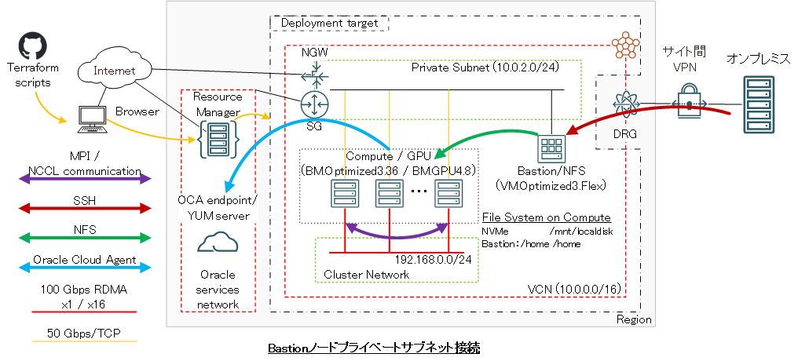
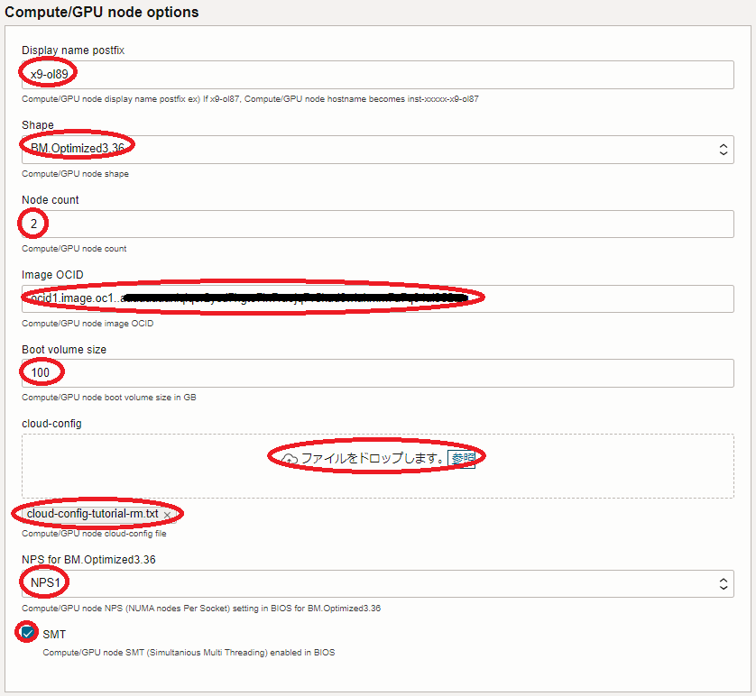

***
# 0. 概要

本チュートリアルは、HPCクラスタの計算ノードに最適なベアメタルインスタンスの **[BM.Optimized3.36 / BM.HPC.E5.144](https://docs.oracle.com/ja-jp/iaas/Content/Compute/References/computeshapes.htm#bm-hpc-optimized)** を **[クラスタ・ネットワーク](/ocitutorials/hpc/#5-1-クラスタネットワーク)** でノード間接続する、HPCワークロードを実行するためのHPCクラスタを構築する際のベースとなるインフラストラクチャを、予め用意された **[Terraform](/ocitutorials/hpc/#5-12-terraform)** スクリプトを活用して自動構築し、そのインターコネクト性能を検証します。  
この自動構築は、 **Terraform** スクリプトを **[リソース・マネージャ](/ocitutorials/hpc/#5-2-リソースマネージャ)** に読み込ませて作成する **[スタック](/ocitutorials/hpc/#5-3-スタック)** を使用する方法と、 **Terraform** 実行環境を用意して **Terraform** CLIを使用する方法から選択することが出来ます。

このチュートリアルで作成する環境は、ユーザ管理、ホスト名管理、ファイル共有ストレージ、プログラム開発環境、ジョブスケジューラ等、必要なソフトウェア環境をこの上に整備し、ご自身の要件に沿ったHPCクラスタを構築する際の基礎インフラストラクチャとして利用することが可能です。  
なお、これらのクラスタ管理に必要なソフトウェアの導入までを自動化する **[HPCクラスタスタック](/ocitutorials/hpc/#5-10-hpcクラスタスタック)** も利用可能で、詳細は **[OCI HPCチュートリアル集](/ocitutorials/hpc/#1-oci-hpcチュートリアル集)** の **[HPCクラスタを構築する(スタティッククラスタ自動構築編)](/ocitutorials/hpc/spinup-hpc-cluster)** を参照してください。

本チュートリアルで作成するHPCクラスタ構築用の **Terraform** スクリプトは、そのひな型が **GitHub** のパブリックレポジトリから公開されており、適用すると以下の処理を行います。

-  **VCN** と関連するネットワークリソース作成
- Bastionノード作成
- 計算ノード用 **[インスタンス構成](/ocitutorials/hpc/#5-7-インスタンス構成)** 作成
- **クラスタ・ネットワーク** と計算ノード作成
- HPCクラスタ内のノード間SSHアクセスに使用するSSH鍵ペア作成・配布
- 計算ノードの全ホスト名を記載したホストリストファイル作成
- 作成したBastionノード・計算ノードのホスト名・IPアドレス出力

Bastionノードは、接続するサブネットをパブリックとプライベートから選択することが可能（※1）で、以下のBastionノードへのログイン方法に合わせて選択します。

- インターネット経由ログイン -> パブリックサブネット接続
- 拠点間接続経由ログイン -> プライベートサブネット接続

※1）構築方法に **Terraform** CLIを採用する場合は、パブリックサブネット接続のみ選択可能です。

また **VCN** と関連するネットワークリソースは、既存のものを使用することも可能で、この場合はこれらが以下の条件を満たしている必要があります。

- プライベートサブネットが存在する
- パブリックサブネットが存在する（Bastionノードパブリック接続の場合）
- パブリックサブネット・プライベートサブネット間で **セキュリティ・リスト** によりアクセスが制限されていない（Bastionノードパブリック接続の場合）
- プライベートサブネットが **[Oracle Cloud Agent](https://docs.oracle.com/ja-jp/iaas/Content/Compute/Tasks/manage-plugins.htm)** HPC関連プラグインの動作条件を満たしている（※2）

※2）この詳細は、 **[OCI HPCテクニカルTips集](/ocitutorials/hpc/#3-oci-hpcテクニカルtips集)** の **[クラスタネットワーキングイメージを使ったクラスタ・ネットワーク接続方法](/ocitutorials/hpc/tech-knowhow/howto-connect-clusternetwork/)** の **[1-2. 接続サブネットの動作条件充足確認](/ocitutorials/hpc/tech-knowhow/howto-connect-clusternetwork/#1-2-接続サブネットの動作条件充足確認)** を参照してください。




Bastionノード作成は、 **[cloud-init](/ocitutorials/hpc/#5-11-cloud-init)** 設定ファイル(以降 **cloud-config** と呼称します。)を含み、 **cloud-init** がBastionノード作成時に以下の処理を行います。

- タイムゾーンをJSTに変更
- ホームディレクトリ領域のNFSエクスポート
- 計算ノードのDNS名前解決をショートホスト名で行うための **resolv.conf** 修正

また計算ノード用 **インスタンス構成** は、 **cloud-config** を含み、 **cloud-init** が計算ノード作成時に以下の処理を行います。

- タイムゾーンをJSTに変更
- NVMe SSDローカルディスク領域ファイルシステム作成
- **firewalld** 停止
- ルートファイルシステム拡張
- BastionノードのDNS名前解決をショートホスト名で行うための **resolv.conf** 修正
- Bastionノードホームディレクトリ領域のNFSマウント

**所要時間 :** 約1時間

**前提条件 :** HPCクラスタを収容するコンパートメント(ルート・コンパートメントでもOKです)の作成と、このコンパートメントに対する必要なリソース管理権限がユーザーに付与されていること。

**注意 :** 本コンテンツ内の画面ショットは、現在のOCIコンソール画面と異なっている場合があります。

***
# 1. 事前準備

## 1-0. 概要

本章は、HPCクラスタを構築する際事前に用意しておく必要のあるリソースを作成します。  
この手順は、構築手法に **[リソース・マネージャ](/ocitutorials/hpc/#5-2-リソースマネージャ)** を使用する方法を採用するか、 **[Terraform](/ocitutorials/hpc/#5-12-terraform)** CLIを使用する方法を採用するかで異なります。

1. **リソース・マネージャ** を使用する方法

    - **[構成ソース・プロバイダ](/ocitutorials/hpc/#5-14-構成ソースプロバイダ)** 作成
    - **[スタック](/ocitutorials/hpc/#5-3-スタック)** 作成

2. **Terraform** CLIを使用する方法

    - **Terraform** 実行環境構築
    - **Terraform** スクリプト作成

以降では、2つの異なる構築手法毎にその手順を解説します。

## 1-1. リソース・マネージャを使用する方法

### 1-1-1. 構成ソース・プロバイダ作成

**構成ソース・プロバイダ** の作成は、 **[ここ](/ocitutorials/hpc/#5-14-構成ソースプロバイダ)** を参照してください。

### 1-1-2. スタック作成

OCIコンソールにログインし、HPCクラスタを構築するリージョンを選択後、 **開発者サービス** → **リソース・マネージャ** → **スタック** とメニューを辿ります。

次に、表示される以下画面で、**スタックの作成** ボタンをクリックします。


次に、表示される以下 **スタック情報** 画面で、以下の情報を入力し、下部の **次** ボタンをクリックします。

- **Terraformの構成のオリジン :** ソース・コード制御システム
- **ソースコード管理タイプ :** **GitHub**
- **構成ソース・プロバイダ :** 先に作成した **[構成ソース・プロバイダ](/ocitutorials/hpc/#5-14-構成ソースプロバイダ)**
- **リポジトリ :** **tutorial_cn_rm**
- **ブランチ :** **master**
- **名前 :** スタックに付与する名前（任意）
- **説明 :** スタックに付与する説明（任意）


次に、表示される以下 **変数の構成** 画面で、各画面フィールドに以下の情報を入力し、下部の **次** ボタンをクリックします。

- **General options** フィールド

    - **Compartment :** HPCクラスタを構築する **コンパートメント**
    - **Availability Domain :** HPCクラスタを構築する **可用性ドメイン**
    - **SSH public key :** Bastionノードにログインする際使用するSSH秘密鍵に対応する公開鍵  
    （公開鍵ファイルのアップロード（ **SSHキー・ファイルの選択** ）と公開鍵のフィールドへの貼り付け（ **SSHキーの貼付け** ）が選択可能）
    - **Private bastion :** Bastionノードをプライベートサブネットに接続するかどうかを指定（デフォルト：パブリックサブネット接続）  
    （パブリックサブネットに接続する場合はチェックオフ/プライベートサブネットに接続する場合はチェック）
    - **Use existing VCN :** 既存の **VCN** を使用するかどうかを指定（デフォルト： **VCN** を新規作成）  
    （既存の **VCN** を使用する場合は、チェックすると表示される **VCN** ・パブリックサブネット・プライベートサブネットの各フィールドにOCIDを指定します。）


- **Compute/GPU node options** フィールド

    - **Display name postfix :** 計算ノードホスト名の接尾辞（※3）
    - **Shape :** **BM.Optimized3.36** / **BM.HPC.E5.144**
    - **Node count :** 計算ノードのノード数（デフォルト：2）
    - **Image OCID :** 計算ノードのイメージOCID（※4）
    - **Boot volume size :** 計算ノードのブートボリュームサイズ（デフォルト：100GB）
    - **cloud-config :** 計算ノードの **cloud-config** （※5）
    - **NPS for BM.xxxx.xx :** 計算ノードの **NPS** 設定値 (デフォルト：NPS1) （※6）
    - **SMT :** 計算ノードの **SMT** 設定値 (デフォルト：有効) （※6）



※3） 例えば **x9-ol89** と指定した場合、計算ノードのホスト名は **inst-xxxxx-x9-ol89** となります。（ **xxxxx** はランダムな文字列）  
※4）以下のOCIDを指定します。なおこのイメージは、Bastionノードにも使用されます。

| No.<br>（※7） | **Oracle Linux**<br>バージョン | OCID                                                                          |
| :---------: | :-----------------------: | :---------------------------------------------------------------------------: |
| 12          | 8.10                      | ocid1.image.oc1..aaaaaaaa45plxi2fuhmbze63ynbs3xfigb2iroqpbqxh5qbauw3pbh66ddvq |
| 1           | 8.9                       | ocid1.image.oc1..aaaaaaaaxiqlqer2ycd7hgto7in7raojq7v5kud6wlakmm7u7q64ai352tzq |
| 3           | 8.8                       | ocid1.image.oc1..aaaaaaaa2irxaj3eqti6nlggadyo2avsinc6cscxrphsldiuqebcaljlqomq |
| 2           | 7.9                       | ocid1.image.oc1..aaaaaaaano7btfbh7cvbaygka4fehemtsal7f7l2qx6oqvbwua6xnszdvaha |

※5）以下をテキストファイルとして保存し、ブラウザから読み込みます。  
なお既存の **VCN** を使用する場合は、以下の **cloud-config** 中のDNSサーチパスにパブリックサブネット名（**public.vcn.oraclevcn.com**）を追加している箇所を、既存のパブリックサブネット名に変更します。

```sh
#cloud-config
timezone: Asia/Tokyo
runcmd:
#
# Mount NVMe local storage
    - vgcreate nvme /dev/nvme0n1
    - lvcreate -l 100%FREE nvme
    - mkfs.xfs -L localscratch /dev/nvme/lvol0
    - mkdir -p /mnt/localdisk
    - echo "LABEL=localscratch /mnt/localdisk/ xfs defaults,noatime 0 0" >> /etc/fstab
    - systemctl daemon-reload
    - mount /mnt/localdisk
#
# Stop firewalld
    - systemctl disable --now firewalld
#
# Expand root file system to those set by instance configuration
    - /usr/libexec/oci-growfs -y
#
# Add public subnet to DNS search
    - sed -i '/^search/s/$/ public.vcn.oraclevcn.com/g' /etc/resolv.conf
    - chattr -R +i /etc/resolv.conf
#
# NFS mount setting
    - echo "bastion:/home /home nfs defaults,vers=3 0 0" >> /etc/fstab
    - systemctl daemon-reload
    - mount /home
```

※6）計算ノードに **BM.Optimized3.36** を使用する場合の **NPS** / **SMT** 設定値で、 **BM.HPC.E5.144** の場合は指定することが出来ません。  
 **NPS** / **SMT** 設定値の詳細は、 **[OCI HPCパフォーマンス関連情報](/ocitutorials/hpc/#2-oci-hpcパフォーマンス関連情報)** の **[パフォーマンスに関連するベア・メタル・インスタンスのBIOS設定方法](/ocitutorials/hpc/benchmark/bios-setting/)** を参照してください。  
※7）**[OCI HPCテクニカルTips集](/ocitutorials/hpc/#3-oci-hpcテクニカルtips集)** の **[クラスタネットワーキングイメージの選び方](/ocitutorials/hpc/tech-knowhow/osimage-for-cluster/)** の **[1. クラスタネットワーキングイメージ一覧](/ocitutorials/hpc/tech-knowhow/osimage-for-cluster/#1-クラスタネットワーキングイメージ一覧)** のイメージNo.です。

次に、表示される **確認** 画面で、これまでの設定項目が意図したものになっているかを確認し、以下 **作成されたスタックで適用を実行しますか。** フィールドの **適用の実行** をチェックオフし、下部の **作成** ボタンをクリックします。


ここで **適用の実行** をチェックした場合、 **作成** ボタンのクリックと同時に **スタック** の適用が開始され、HPCクラスタの構築が始まりますが、このチュートリアルでは後の章で改めて **スタック** の適用を行います。

これで、以下画面のとおりHPCクラスタ構築用 **スタック** が作成されました。


## 1-2. Terraform CLIを使用する方法

### 1-2-1. Terraform実行環境構築

本章は、 **[Terraform](/ocitutorials/hpc/#5-12-terraform)** CLIを使用してHPCクラスタのライフサイクル管理を実行する **Terraform** 実行環境を構築します。  
この実行環境は、インターネットに接続された **Linux** ・ **Windows** ・ **Mac** の何れかのOSが稼働している端末であればよく、以下のような選択肢が考えられます。

- OCI上の **Linux** が稼働するVMインスタンス
- ご自身が使用する **Windows** / **Mac** パソコン
- ご自身が使用する **Windows** / **Mac** パソコンで動作する **Linux** ゲストOS

本チュートリアルは、この **Terraform** 実行環境のOSに **Oracle Linux** 8を使用します。

**Terraform** 実行環境は、以下のステップを経て構築します。

- **Terraform** インストール
- **Terraform** 実行環境とOCI間の認証関係締結（APIキー登録）

具体的な **Terraform** 実行環境構築手順は、チュートリアル **[TerraformでOCIの構築を自動化する](https://oracle-japan.github.io/ocitutorials/intermediates/terraform/)** の **[2. Terraform環境の構築](https://oracle-japan.github.io/ocitutorials/intermediates/terraform/#2terraform%E7%92%B0%E5%A2%83%E3%81%AE%E6%A7%8B%E7%AF%89)** を参照してください。  
また、関連するOCI公式ドキュメントは、 **[ここ](https://docs.oracle.com/ja-jp/iaas/developer-tutorials/tutorials/tf-provider/01-summary.htm)** を参照してください。

### 1-2-2. Terraformスクリプト概要

本チュートリアルで使用するHPCクラスタ構築用の **[Terraform](/ocitutorials/hpc/#5-12-terraform)** スクリプトは、そのひな型を **GitHub** のパブリックレポジトリで公開しており、以下のファイル群で構成されています。

| ファイル名            | 用途                                                                                                         |
| ---------------- | ---------------------------------------------------------------------------------------------------------- |
| cn.tf            | **[インスタンス構成](/ocitutorials/hpc/#5-7-インスタンス構成)** と **[クラスタ・ネットワーク](/ocitutorials/hpc/#5-1-クラスタネットワーク)** の定義 |
| outputs.tf       | 作成したリソース情報の出力                                                                                              |
| terraform.tfvars | **Terraform** スクリプト内で使用する変数値の定義                                                                            |
| variables.tf     | **Terraform** スクリプト内で使用する変数の型の定義                                                                           |
| instance.tf      | Bastionノードの定義                                                                                              |
| provider.tf      | **テナンシ** ・ユーザ・ **リージョン** の定義                                                                               |
| vcn.tf           | **仮想クラウド・ネットワーク** と関連するネットワークリソースの定義                                                                       |

これらのうち自身の環境に合わせて修正する箇所は、基本的に **terraform.tfvars** と **provider.tf** に集約しています。

また、これらのファイルと同じディレクトリに **user_data** ディレクトリが存在し、 **cloud-config** を格納しています。  
この **cloud-config** を修正することで、構築するHPCクラスタのOSレベルのカスタマイズをご自身の環境に合わせて追加・変更することも可能です。

### 1-2-3. Terraformスクリプト作成

**[Terraform](/ocitutorials/hpc/#5-12-terraform)** スクリプトの作成は、まず以下の **GitHub** レポジトリからひな型となる **Terraform** スクリプトを **Terraform** 実行環境にダウンロードしますが、

**[https://github.com/fwiw6430/tutorial_cn](https://github.com/fwiw6430/tutorial_cn)**

これには、以下コマンドを **Terraform** 実行環境のopcユーザで実行するか、

```sh
$ sudo dnf install -y git
$ git clone https://github.com/fwiw6430/tutorial_cn
```

**GitHub** の **Terraform** スクリプトレポジトリのページからzipファイルを **Terraform** 実行環境にダウンロード・展開することで行います。  

次に、ダウンロードした **Terraform** スクリプトのうち、 **terraform.tfvars** と **provider.tf** 内の以下 **Terraform** 変数を自身の環境に合わせて修正します。  
この際、これらファイル内の **Terraform** 変数は、予めコメント（ **#** で始まる行）として埋め込まれていたり、キーワード **xxxx** で仮の値が入力されているため、コメント行を有効化して自身の値に置き換える、等の修正を行います。

[ **provider.tf** ]

| 変数名                  | 設定値                        | 確認方法                                                                                         |
| ---------------- | -------------------------- | -------------------------------------------------------------------------------------------- |
| tenancy_ocid     | 使用する **テナンシ** のOCID              | **[ここ](https://docs.oracle.com/ja-jp/iaas/Content/API/Concepts/apisigningkey.htm#five)** を参照 |
| user_ocid        | 使用するユーザのOCID               | **[ここ](https://docs.oracle.com/ja-jp/iaas/Content/API/Concepts/apisigningkey.htm#five)** を参照 |
| private_key_path | OCIに登録したAPIキーの秘密キーのパス      | -                                                                                            |
| fingerprint      | OCIに登録したAPIキーのフィンガープリント    | **[ここ](https://docs.oracle.com/ja-jp/iaas/Content/API/Concepts/apisigningkey.htm#four)** を参照 |
| region           | HPCクラスタを構築する **リージョン** 識別子 | **[ここ](https://docs.oracle.com/ja-jp/iaas/Content/General/Concepts/regions.htm)** を参照        |

[ **terraform.tfvars** ]

| 変数名                | 設定値                                                                                  | 確認方法                                                                                                                             |
| ------------------ | ------------------------------------------------------------------------------------ | :------------------------------------------------------------------------------------------------------------------------------: |
| compartment_ocid   | HPCクラスタを構築する **コンパートメント** のOCID                                                      | **[ここ](https://docs.oracle.com/ja-jp/iaas/Content/GSG/Tasks/contactingsupport_topic-Finding_the_OCID_of_a_Compartment.htm)** を<br>参照 |
| ad                 | HPCクラスタを構築する **可用性ドメイン** 識別子                                                         | （※8）                                                                                                                             |
| ssh_key            | Bastionノードログインに使用するSSH秘密鍵に対する公開鍵                                                     | -                                                                                                                                |
| exist_vcn          | 既存の **VCN** を使用するかどうかの指定（true/false）                                                 | -                                                                                                                                |
| vcn_ocid           | 既存の **VCN** を使用する場合使用する **VCN** のOCID（※12）                                           | （※13）                                                                                                                            |
| public_ocid        | 既存の **VCN** を使用する場合使用するパブリックサブネットのOCID（※12）                                          | （※13）                                                                                                                            |
| private_ocid       | 既存の **VCN** を使用する場合使用するプライベートサブネットのOCID（※12）                                         | （※13）                                                                                                                            |
| comp_shape         | 計算ノードに使用するシェイプ<br>・ **BM.Optimized3.36** / **BM.HPC.E5.144**                         | -                                                                                                                                |
| comp_image         | 計算ノードに使用するOSイメージのOCID                                                                | （※9）                                                                                                                             |
| comp_boot_vol_size | 計算ノードの **ブートボリューム** のサイズ（GB）                                                         | -                                                                                                                                |
| comp_cloud_config  | **user_data** ディレクトリに格納する計算ノード用 **cloud-config** ファイル名<br>・ **cloud-init_cnhpc.cfg** | -                                                                                                                                |
| comp_nps_x9        | 計算ノードが **BM.Optimized3.36** の場合の **NPS** BIOS設定値（※14）                                                              | （※10）                                                                                                                            |
| comp_smt           | 計算ノードが **BM.Optimized3.36** の場合の **SMT** BIOS設定値（※14）                                                               | （※10）                                                                                                                            |
| cn_display_name    | 計算ノードホスト名の接尾辞                                                                        | （※11）                                                                                                                            |
| cn_node_count      | 計算ノードのノード数                                                                           | -                                                                                                                                |

※8）OCIコンソールメニューから **コンピュート** → **インスタンス** を選択し **インスタンスの作成** ボタンをクリックし、表示される以下 **配置** フィールドで確認出来ます。


※9）コメントとして埋め込まれているOSイメージOCIDから、コメント文の記載を参考に適切なOSイメージOCIDのコメントを外して使用します。詳細は、 **[OCI HPCテクニカルTips集](/ocitutorials/hpc/#3-oci-hpcテクニカルtips集)** の **[クラスタネットワーキングイメージの選び方](/ocitutorials/hpc/tech-knowhow/osimage-for-cluster/)** の **[1. クラスタネットワーキングイメージ一覧](/ocitutorials/hpc/tech-knowhow/osimage-for-cluster/#1-クラスタネットワーキングイメージ一覧)** を参照してください。  
※10）詳細は、 **[OCI HPCパフォーマンス関連情報](/ocitutorials/hpc/#2-oci-hpcパフォーマンス関連情報)** の **[パフォーマンスに関連するベア・メタル・インスタンスのBIOS設定方法](/ocitutorials/hpc/benchmark/bios-setting/)** を参照してください。  
※11）例えば **x9-ol89** と指定した場合、計算ノードのホスト名は **inst-xxxxx-x9-ol89** となります。（ **xxxxx** はランダムな文字列）  
※12）既存の **VCN** を使用する場合のみコメントを外して指定します。  
※13）OCIコンソール上で当該 **VCN** ・サブネットの詳細画面を表示して確認します。  
※14）計算ノードに **BM.HPC.E5.144** を使用する場合は、この変数を使用しないためコメントのままとします。

***
# 2. HPCクラスタ構築

## 2-0. 概要

本章は、先に作成した **[スタック](/ocitutorials/hpc/#5-3-スタック)** / **[Terraform](/ocitutorials/hpc/#5-12-terraform)** スクリプトを使用し、HPCクラスタを構築します。

この手順は、構築手法に **[リソース・マネージャ](/ocitutorials/hpc/#5-2-リソースマネージャ)** を使用する方法を採用するか、 **Terraform** CLIを使用する方法を採用するかで異なり、以降では2つの異なる構築手法毎にその手順を解説します。

## 2-1. リソース・マネージャを使用する方法

以下 **スタックの詳細** 画面で、 **適用** ボタンをクリックします。


次に、表示される以下 **適用** サイドバーで、 **適用** ボタンをクリックします。


次に、表示される以下 **ジョブ詳細** ウィンドウで、左上のステータスが **受入れ済** → **進行中** と遷移すれば、 **スタック** の適用が実施されています。


次に、表示される以下 **ログ** フィールドで、リソースの作成状況を確認します。


この適用が完了するまでの所要時間は、計算ノードのノード数が2ノードの場合で5分程度です。

ステータスが **成功** となれば、HPCクラスタの構築が完了しており、以下のように **ログ** フィールドの最後にBastionノードと計算ノードのホスト名とIPアドレスが出力されます。

```sh
:
:
:
Outputs:

Bastion_instances_created = {
  "display_name" = "bastion"
  "private_ip" = "10.0.1.242"
  "public_ip" = "158.101.120.164"
}
Compute_in_cn_created_e5 = {
  "inst-obsxx-e5-ol81" = {
    "display_name" = "inst-obsxx-e5-ol81"
    "private_ip" = "10.0.2.27"
  }
  "inst-utyax-e5-ol81" = {
    "display_name" = "inst-utyax-e5-ol81"
    "private_ip" = "10.0.2.138"
  }
}
Compute_in_cn_created_none5 = {}
```

## 2-2. Terraform CLIを使用する方法

**Terraform** 実行環境で、以下コマンドを実行します。

```sh
$ cd tutorial_cn
$ terraform init
$ terraform apply --auto-approve
```

最後のコマンドによる **Terraform** スクリプトの適用完了までの所要時間は、計算ノードのノード数が2ノードの場合で5分程度です。

**Terraform** スクリプトの適用が正常に完了すると、以下のようにコマンド出力の最後にBastionノードと計算ノードのホスト名とIPアドレスが出力されます。

```sh
:
:
:
Outputs:

Bastion_instances_created = {
  "display_name" = "bastion"
  "private_ip" = "10.0.1.242"
  "public_ip" = "158.101.120.164"
}
Compute_in_cn_created_e5 = {
  "inst-obsxx-e5-ol81" = {
    "display_name" = "inst-obsxx-e5-ol81"
    "private_ip" = "10.0.2.27"
  }
  "inst-utyax-e5-ol81" = {
    "display_name" = "inst-utyax-e5-ol81"
    "private_ip" = "10.0.2.138"
  }
}
Compute_in_cn_created_none5 = {}
```

***
# 3. HPCクラスタ確認

## 3-0. 概要

本章は、構築されたHPCクラスタ環境を確認します。

この際、作成された計算ノードの全ホスト名を記載したホストリストファイルを使用し、BastionノードからHPCクラスタ内の全計算ノードにSSHでコマンドを発行、その環境を確認します。  
なおこのホストリストファイルは、Bastionノードと全計算ノードに **/home/opc/hostlist.txt** として存在します。

## 3-1. Bastionノードログイン

Bastionノードは、パブリックサブネット接続の場合はHPCクラスタ構築完了時に表示されるパブリックIPアドレスに対してインターネット経由SSHログインし、プライベートサブネット接続の場合はHPCクラスタ構築完了時に表示されるプライベートIPアドレスに対して拠点間接続経由SSHログインしますが、これには構築時に指定したSSH公開鍵に対応する秘密鍵を使用して以下コマンドで行います。

```sh
$ ssh -i path_to_ssh_secret_key opc@123.456.789.123
```

## 3-2. cloud-init完了確認

**[cloud-init](/ocitutorials/hpc/#5-11-cloud-init)** は、計算ノードが起動してSSHログインできる状態であっても、その処理が継続している可能性があるため、以下コマンドをBastionノードのopcユーザで実行し、そのステータスが **done** となっていることで **cloud-init** の処理完了を確認します。

```sh
$ for hname in `cat ~/hostlist.txt`; do echo $hname; ssh -oStrictHostKeyChecking=accept-new $hname "sudo cloud-init status"; done
inst-xxxxx-x9-ol8
Warning: Permanently added 'inst-xxxxx-x9-ol8,10.0.2.159' (ECDSA) to the list of known hosts.
status: done
inst-yyyyy-x9-ol8
Warning: Permanently added 'inst-yyyyy-x9-ol8,10.0.2.31' (ECDSA) to the list of known hosts.
status: done
$
```

ステータスが **running** の場合は、 **cloud-init** の処理が継続中のため、処理が完了するまで待ちます。

## 3-3. 計算ノードファイルシステム確認

計算ノードは、以下のようにルートファイルシステムがデフォルトの50 GBから指定したサイズに拡張され、NVMe SSDローカルディスクが **/mnt/localdisk** にマウントされ、Bastionノードの **/home** が **/home** としてマウントされています。

```sh
$ for hname in `cat ~/hostlist.txt`; do echo $hname; ssh $hname "df -h / /mnt/localdisk /home"; done
inst-kicav-x9-ol8
Filesystem                  Size  Used Avail Use% Mounted on
/dev/mapper/ocivolume-root   89G   15G   74G  17% /
/dev/nvme0n1p1              3.5T   25G  3.5T   1% /mnt/localdisk
bastion:/home                36G  8.5G   28G  24% /home
inst-0vdz8-x9-ol8
Filesystem                  Size  Used Avail Use% Mounted on
/dev/mapper/ocivolume-root   89G   15G   74G  17% /
/dev/nvme0n1p1              3.5T   25G  3.5T   1% /mnt/localdisk
bastion:/home                36G  8.5G   28G  24% /home
$
```

## 3-4. 計算ノードBIOS設定確認

以下コマンドをBastionノードのopcユーザで実行し、計算ノードのBIOSで指定した **NPS** と **SMT** 設定が指定したとおりになっていることを確認します。  
なお本手順は、計算ノードに使用するシェイプが **BM.HPC.E5.144** の場合はスキップします。

```sh
$ for hname in `cat ~/hostlist.txt`; do echo $hname; ssh $hname "lscpu | grep -i -e numa -e thread"; done
inst-e0tw0-x9-ol87
Thread(s) per core:  2
NUMA node(s):        2
NUMA node0 CPU(s):   0-17,36-53
NUMA node1 CPU(s):   18-35,54-71
inst-uyopv-x9-ol87
Thread(s) per core:  2
NUMA node(s):        2
NUMA node0 CPU(s):   0-17,36-53
NUMA node1 CPU(s):   18-35,54-71
$
```

## 3-5. 計算ノードクラスタ・ネットワーク接続用ネットワークインターフェース設定確認

以下コマンドをBastionノードのopcユーザで実行し、計算ノードが **[クラスタ・ネットワーク](/ocitutorials/hpc/#5-1-クラスタネットワーク)** に接続するためのネットワークインターフェース（ **rdma0** ）にIPアドレス（以下の例では10.224.0.0/12のサブネット内のIPアドレス）が設定されていることを確認します。  

```sh
$ for hname in `cat ~/hostlist.txt`; do echo $hname; ssh $hname "ip a | grep -e ens300f0np0 -e ens800f0np0 -e eth0 -e rdma0 | grep inet"; done
inst-e0tw0-x9-ol87
    inet 10.0.2.182/24 brd 10.0.2.255 scope global dynamic eth0
    inet 10.224.0.182/12 brd 10.239.255.255 scope global noprefixroute rdma0
inst-uyopv-x9-ol87
    inet 10.0.2.154/24 brd 10.0.2.255 scope global dynamic eth0
    inet 10.224.0.154/12 brd 10.239.255.255 scope global noprefixroute rdma0
$
```

***
# 4. MPIプログラム実行

本章は、計算ノードの **HPC[クラスタネットワーキングイメージ](/ocitutorials/hpc/#5-13-クラスタネットワーキングイメージ)** に含まれる **[OpenMPI](https://www.open-mpi.org/)** と **[Intel MPI Benchmarks](https://github.com/intel/mpi-benchmarks)** を使用し、 **[クラスタ・ネットワーク](/ocitutorials/hpc/#5-1-クラスタネットワーク)** のノード間インターコネクト性能を確認します。  
ここでは、 **Intel MPI Benchmarks** のPing-Pongを実行します。


以下コマンドを計算ノードのうちの1ノードのopcユーザで実行し、 **クラスタ・ネットワーク** を経由する2ノード間のPing-Pongを実行、その結果に問題が無いことを確認します。

```sh
$ /usr/mpi/gcc/openmpi-4.1.7rc1/bin/mpirun -n 2 -N 1 -hostfile ~/hostlist.txt -x UCX_NET_DEVICES=mlx5_2:1 /usr/mpi/gcc/openmpi-4.1.7rc1/tests/imb/IMB-MPI1 -msglog 27:28 pingpong
```

***
# 5. HPCクラスタ削除

## 5-0. 概要

本章は、先に作成した **[スタック](/ocitutorials/hpc/#5-3-スタック)** / **[Terraform](/ocitutorials/hpc/#5-12-terraform)** スクリプトを使用し、HPCクラスタを削除します。

この手順は、構築手法に **[リソース・マネージャ](/ocitutorials/hpc/#5-2-リソースマネージャ)** を使用する方法を採用するか、 **[Terraform](/ocitutorials/hpc/#5-12-terraform)** CLIを使用する方法を採用するかで異なり、以降では2つの異なる構築手法毎にその手順を解説します。

## 5-1. リソース・マネージャを使用する方法

以下 **スタックの詳細** 画面で、 **破棄** ボタンをクリックします。


次に、表示される以下 **破棄** サイドバーで、 **破棄** ボタンをクリックします。


次に、表示される以下 **ジョブ詳細** ウィンドウで、左上のステータスが **受入れ済** → **進行中** と遷移すれば、 **スタック** の破棄が実施されています。


表示される以下 **ログ** フィールドで、リソースの削除状況を確認します。


この破棄が完了するまでの所要時間は、計算ノードのノード数が2ノードの場合で3分程度です。

ステータスが **成功** となれば、HPCクラスタの削除が完了しています。

## 5-2. Terraform CLIの場合

**Terraform** 実行環境の **tutorial_cn** ディレクトリで以下コマンドを実行し、HPCクラスタを削除します。  
また、以下のメッセージが表示されることで正常に削除されたことを確認します。

```sh
$ terraform destroy --auto-approve
:
Destroy complete! Resources: 18 destroyed.
$
```

この破棄が完了するまでの所要時間は、計算ノードのノード数が2ノードの場合で3分程度です。

これで、このチュートリアルは終了です。