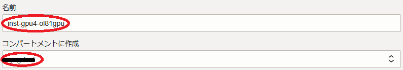
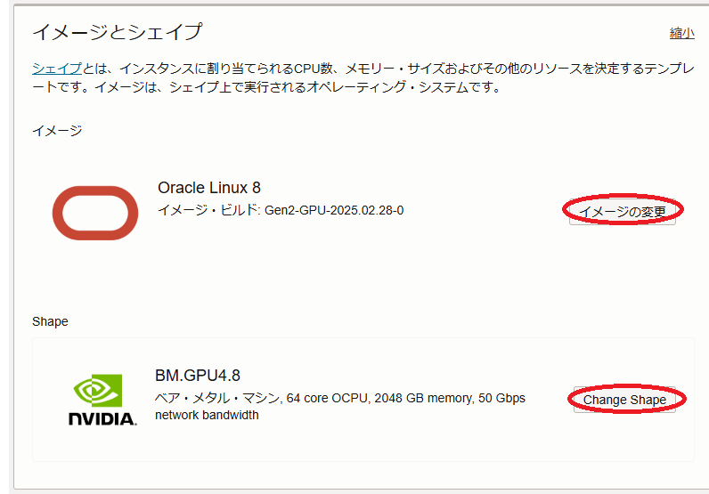
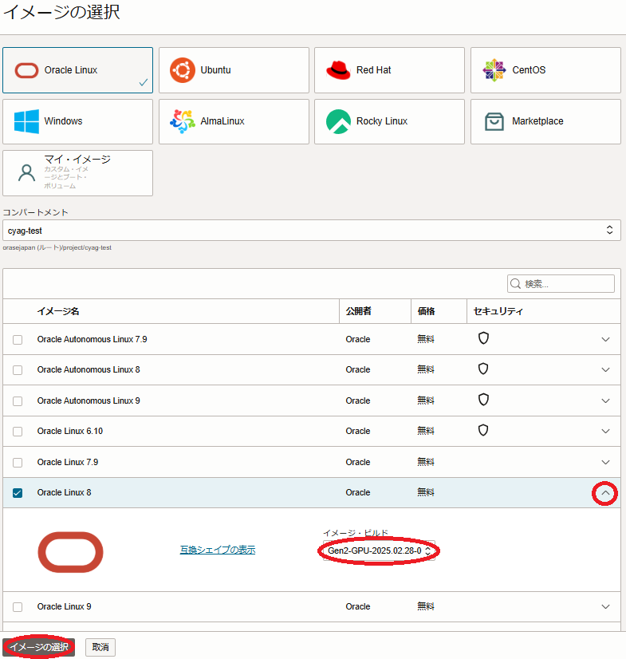
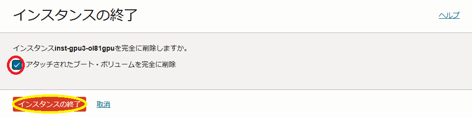

<style>
table, th, td {
    font-size: 80%;
}
</style>

# 0. 概要

本チュートリアルは、OCIコンソールから必要なリソースを順次デプロイしてソフトウェア環境を手動で構築する方法で、 **[containerd](https://github.com/containerd/containerd/tree/main)** と **[NVIDIA Container Toolkit](https://docs.nvidia.com/datacenter/cloud-native/container-toolkit/latest/index.html)** を使用する分散機械学習に対応するコンテナ実行環境を複数のNVIDIA GPUを搭載するGPUインスタンス上に構築、複数GPUに跨るGPU間の通信性能を **[NCCL（NVIDIA Collective Communication Library）](https://developer.nvidia.com/nccl)** の通信性能計測プログラム **[NCCL Tests](https://github.com/nvidia/nccl-tests)** で検証します。

本チュートリアルで構築する分散機械学習環境の構成を以下に示します。

[GPUインスタンス]

-  **シェイプ** ： **[BM.GPU4.8 / BM.GPU.A100-v2.8](https://docs.oracle.com/ja-jp/iaas/Content/Compute/References/computeshapes.htm#bm-gpu)**
- **イメージ** ： **[プラットフォーム・イメージ](../#5-17-プラットフォームイメージ)** **[Oracle-Linux-9.6-Gen2-GPU-2025.10.23-0](https://docs.oracle.com/en-us/iaas/images/oracle-linux-9x/oracle-linux-9-6-gen2-gpu-2025-10-23-0.htm)**

[Bastionノード]

-  **シェイプ**  ： **[VM.Standard.E5.Flex](https://docs.oracle.com/ja-jp/iaas/Content/Compute/References/computeshapes.htm#flexible)**
- **イメージ** ： **プラットフォーム・イメージ** **[Oracle-Linux-9.6-2025.10.23-0](https://docs.oracle.com/en-us/iaas/images/oracle-linux-9x/oracle-linux-9-6-2025-10-23-0.htm)**

[機械学習環境ソフトウェア]

- コンテナランタイム ： **containerd** 2.2.0
- **NVIDIA Container Toolkit** ： 1.18.0


**所要時間 :** 約2時間

**前提条件 :** 分散機械学習環境を収容する **コンパートメント** ( **ルート・コンパートメント** でもOKです)の作成と、このコンパートメントに対する必要なリソース管理権限がユーザーに付与されていること。

**注意 :** 本コンテンツ内の画面ショットは、現在のOCIコンソール画面と異なっている場合があります。

# 1. 事前作業

## 1-0. 概要

本章は、GPUインスタンスをTCP接続する **仮想クラウド・ネットワーク** と、インターネットから直接アクセス出来ないプライベートサブネットに接続するGPUインスタンスにログインする際の踏み台となるBastionノードを、GPUインスタンス作成前に予め用意します。

## 1-1. 仮想クラウド・ネットワーク作成

**仮想クラウド・ネットワーク** の作成は、 **[OCIチュートリアル](https://oracle-japan.github.io/ocitutorials/)** の **[その2 - クラウドに仮想ネットワーク(VCN)を作る](https://oracle-japan.github.io/ocitutorials/beginners/creating-vcn)** の手順に従い、以下のリソースを作成します。

- **仮想クラウド・ネットワーク** （10.0.0.0/16）
- パブリックサブネット（10.0.1.0/24）
- プライベートサブネット（10.0.2.0/24）
- **インターネット・ゲートウェイ** （パブリックサブネットにアタッチ）
- **NATゲートウェイ** （プライベートサブネットにアタッチ）
- **サービス・ゲートウェイ** （プライベートサブネットにアタッチ）
- **ルート表** x 2（パブリックサブネットとプライベートサブネットにアタッチ）
- **セキュリティリスト** x 2（パブリックサブネットとプライベートサブネットにアタッチ）

作成後、 **セキュリティリスト** が以下となるように修正します。

| サブネット  | 通信方向  | ステートレス | ソース         | IPプロトコル  | ソース・ポート範囲 | 宛先ポート範囲 |
| :----: | :---: | :----: | :---------: | :------: | :-------: | :-----: |
| パブリック  | イングレス | いいえ    | 0.0.0.0/0<br>（※2）   | TCP      | All       | 22      |
|        |       | いいえ    | 10.0.0.0/16 | 全てのプロトコル | -         | -       |
|        | イグレス  | いいえ    | 0.0.0.0/0   | 全てのプロトコル | -         | -       |
| プライベート | イングレス | いいえ    | 10.0.0.0/16 | 全てのプロトコル | -         | -       |
|        | イグレス  | いいえ    | 0.0.0.0/0   | 全てのプロトコル | -         | -       |


この **仮想クラウド・ネットワーク** は、 **セキュリティリスト** でインターネットとの通信に以下のアクセス制限が掛けられています。

- インターネットからのアクセス：パブリックサブネットに接続するインスタンスの宛先ポート22番（SSH）に限定
- インターネットへのアクセス：インターネット上の任意の宛先IPアドレス・ポートに制限なくアクセス可能

## 1-2. Bastionノード作成


Bastionノードの作成は、 **[OCIチュートリアル](https://oracle-japan.github.io/ocitutorials/)** の  **[その3 - インスタンスを作成する](https://oracle-japan.github.io/ocitutorials/beginners/creating-compute-instance)** の手順を参考に、ご自身の要件に沿ったインスタンスを先の手順で **仮想クラウド・ネットワーク** を作成した **コンパートメント** とパブリックサブネットを指定して作成します。  
本チュートリアルは、以下属性のインスタンスをBastionノードとして作成します。

- **シェイプ** ： **VM.Standard.E5.Flex** （任意のコア数・メモリ容量）
- **イメージ** ： **Oracle Linux** 9.6（Oracle-Linux-9.6-2025.09.16-0）
- **SSHキーの追加** ： Bastionノードにログインする際使用するSSH秘密鍵に対応する公開鍵

次に、作成したBastionノードにopcユーザでSSHログインして以下コマンドを実行してSSH鍵ペアを作成し、その公開鍵を控えます。  
このSSH鍵は、BastionノードからGPUインスタンスにログインする際に使用します。

```sh
$ ssh-keygen -t rsa -N "" -f ~/.ssh/id_rsa
Generating public/private rsa key pair.
Your identification has been saved in /home/opc/.ssh/id_rsa.
Your public key has been saved in /home/opc/.ssh/id_rsa.pub.
The key fingerprint is:
SHA256:gROjFmmm2yf3Frsg2P2T7cBzSCCEiml9BRGDnhi5qBs opc@bastion
The keys randomart image is:
+---[RSA 3072]----+
|  ..+**          |
| o.o+o.=         |
|oo*+= = .        |
|=+.= o o .       |
|o  o.   S        |
|E .oo.oo..       |
| o. o+o.==.      |
|.    . o*+.      |
|       .o+.      |
+----[SHA256]-----+
$ cat .ssh/id_rsa.pub 
ssh-rsa AAAAB3NzaC1yc2EAAAADAQABAAABgQDTkw2diccQ4mnxea/qUcClehcYfZIQhB94d2aiWUrLpD1kDQQzsc6Q8ndyOu6h7X3E0FGY2SDjDyhJRdntbOZKPkYkQrGHbhnBllFPMV4NlObkf/YX6a9bc4vrGgnayRgfj0vOZ0RKlJmkfjAR/7Cw48LzQnaDDq2HHZAo+c71WBSjLt1SsX7tXHqkzjGUv44qqEiC6qlEiZd9yevA7kR0IoN9dIWXaKnMbOVGr8DezyLsruoQxhj6bHNwXhEjlGPg8E6R35AdjGeGZOCYT2clfMu9iavuzR5dilysARq1Lxow2/MEija3/twxmzhxVbwoGTXE0sCz3SGMnHTwLGEE7Tok+i7zZMB2ySbCM42Icz3Ja2qxNxqdx9YUKZ48SgkNPrMMouZGm+lZrZf0dypQqDbUrA0uZkkTUR+RTY+V/0MmuH6eDgHQLjxzo07/+gw2BG9CMcor0fMYhEJiKUVRy2LXBIK2Zj2+Ow7zs552f7SRGWnAktU7sTU801frAjE= opc@bastion
$
```

# 2. GPUインスタンス作成

## 2-0. 概要

本章は、GPUインスタンスを作成します。

GPUインスタンスの作成は、デプロイ後のカスタマイズ作業を軽減する目的で **[cloud-init](../#5-11-cloud-init)** を使用するため、以下の手順を経て行います。

1. **[cloud-init設定ファイル作成](#2-1-cloud-init設定ファイル作成)**
2. **[GPUインスタンス作成](#2-2-GPUインスタンス作成)**

## 2-1. cloud-init設定ファイル作成

本チュートリアルは、 **[cloud-init](../#5-11-cloud-init)** を以下の目的で使用します。

- タイムゾーンをJSTに変更
- NVMe SSDローカルディスク領域ファイルシステム作成
- firewalld停止
- ルートファイルシステム拡張

以下は、本チュートリアルで使用する **cloud-init** 設定ファイル（以降 **cloud-config** と呼称します。）で、OCIコンソールを実行している端末上にテキストファイルで保存します。

```sh
#cloud-config
#
# Change time zone to JST
timezone: Asia/Tokyo

runcmd:
#
# NVMe local storage setting
  - vgcreate nvme /dev/nvme0n1 /dev/nvme1n1 /dev/nvme2n1 /dev/nvme3n1
  - lvcreate -l 100%FREE nvme
  - mkfs.xfs -L localscratch /dev/nvme/lvol0
  - mkdir -p /mnt/localdisk
  - echo "LABEL=localscratch /mnt/localdisk/ xfs defaults,noatime 0 0" >> /etc/fstab
  - systemctl daemon-reload
  - mount /mnt/localdisk
#
# Stop firewalld
  - systemctl disable --now firewalld
#
# Expand root file system to those set by instance configuration
  - /usr/libexec/oci-growfs -y
```

## 2-2. GPUインスタンス作成

OCIコンソールにログインし、GPUインスタンスをデプロイするリージョンを選択後、 **コンピュート** → **インスタンス** とメニューを辿り、表示される以下画面で **インスタンスの作成** ボタンをクリックします。


表示される **基本情報** 画面で、以下の情報を入力し **次** ボタンをクリックします。  
なお、ここに記載のないフィールドは、デフォルトのままとします。

- **名前** ： GPUインスタンスに付与する名前
- **コンパートメントに作成** ： GPUインスタンスを作成する **コンパートメント**

  

1. **配置** フィールド

    - **可用性ドメイン** ：GPUインスタンスを作成する **可用性ドメイン**

    

2. **イメージとシェイプ** フィールド

    

    - **シェイプ** ：**BM.GPU4.8 / BM.GPU.A100-v2.8**  
        （ **シェイプの変更** ボタンをクリックして表示される以下 **すべてのシェイプの参照** サイドバーで **ベア・メタル・マシン** をクリックして表示される **BM.GPU4.8 / BM.GPU.A100-v2.8** を選択し **シェイプの選択** ボタンをクリック。）

    

    - **イメージ** ：**Oracle-Linux-9.6-Gen2-GPU-2025.08.31-0**  
    （ **イメージの変更** ボタンをクリックして表示される以下 **イメージの選択** サイドバーで、 **Oracle Linux** を選択して表示される **Oracle Linux 9** を選択して表示される **互換シェイプ** ブルダウンメニューで **Oracle-Linux-9.6-Gen2-GPU-2025.08.31-0** を選択し、 **イメージの選択** ボタンをクリック。）

    

    - **cloud-initスクリプト** ：先に作成した **cloud-config** を選択  
    （ **拡張オプション** ボタンをクリックして表示される以下 **管理** フィールドの **初期化スクリプト** フィールドの **ファイルをドロップするか選択** ボタンをクリックしてファイルを選択）

    

表示される **セキュリティー** 画面で、 **次** ボタンをクリックします。

表示される **ネットワーキング** 画面で、以下の情報を入力し **次** ボタンをクリックします。  
なお、ここに記載のないフィールドは、デフォルトのままとします。

- **仮想クラウド・ネットワーク** ： 先に作成した **仮想クラウド・ネットワーク**
- **サブネット** ： 先に作成したプライベートサブネット

  

1. **SSHキーの追加** フィールド

    - **SSH公開キー** ：先にBastionノードで作成したSSH鍵ペアの公開鍵  
    （ **公開キーの貼付け** を選択することで入力フィールドを表示）  

    

表示される **ストレージ** 画面で、以下の情報を入力し **次** ボタンをクリックします。  
なお、ここに記載のないフィールドは、デフォルトのままとします。

1. **ブート・ボリューム** フィールド

    - **ブート・ボリューム・サイズ(GB)** ： 200（※3）  
    （ **カスタム・ブート・ボリューム・サイズとパフォーマンス設定を指定します** チェックボックスをチェックすると指定可能）

   

    ※3）通常GPUインスタンスは、様々な機械学習用ソフトウェアやコンテナイメージを格納する必要があるため、少なくとも200 GBの **ブート・ボリューム** サイズとします。

表示される **確認** 画面で、設定した内容に間違いがないかを確認した後、 **作成** ボタンをクリックします。

# 3. GPUインスタンス確認

## 3.0. 概要

本章は、デプロイされたGPUインスタンスにログインし、環境を確認します。

## 3.1. GPUインスタンスログイン

GPUインスタンスは、プライベートサブネットに接続されており、インターネットからログインすることが出来ないため、Bastionノードを経由してSSHログインします。  
BastionノードからGPUインスタンスへのログインは、GPUインスタンスのIPアドレスを使用します。

GPUインスタンスのIPアドレスは、OCIコンソールでGPUインスタンスをデプロイしたリージョンを選択後、 **コンピュート** → **インスタンス** とメニューを辿り、以下のインスタンス一覧からそのIPアドレスを確認します。


GPUインスタンスへのログインは、以下のようにBastionノードからopcユーザでSSHログインします。

```sh
$ ssh -oStrictHostKeyChecking=accept-new 10.0.2.144
```

## 3.2. cloud-init完了確認

**[cloud-init](../#5-11-cloud-init)** は、GPUインスタンスが起動してSSHログインできる状態であってもその処理が継続している可能性があるため、以下コマンドでそのステータスを表示し、 **done** となっていることで **cloud-init** の処理完了を確認します。  
ステータスが **running** の場合は、 **cloud-init** の処理が継続中のため、処理が完了するまで待ちます。

```sh
$ cloud-init status
status: done
$
```

## 3-3. タイムゾーン確認

以下コマンドをGPUインスタンスのopcユーザで実行し、タイムゾーンがJSTになっていることを確認します。

```sh
$ date
Wed Nov  5 03:23:35 PM JST 2025
$
```

## 3-4. ファイルシステム確認

以下コマンドをGPUインスタンスのopcユーザで実行し、ルートファイルシステムが指定のサイズとなっていること、NVMe SSDローカルディスク領域ファイルシステムがマウントされていることを確認します。

```sh
$ df -h / /mnt/localdisk
Filesystem                  Size  Used Avail Use% Mounted on
/dev/mapper/ocivolume-root  183G   24G  160G  13% /
/dev/mapper/nvme-lvol0       25T  177G   25T   1% /mnt/localdisk
$
```

## 3-5. ファイアーウォール停止確認

以下コマンドをGPUインスタンスのopcユーザで実行し、ファイアーウォールが停止されていることを確認します。

```sh
$ sudo systemctl status firewalld | grep -e Active -e disabled
     Loaded: loaded (/usr/lib/systemd/system/firewalld.service; disabled; preset: enabled)
     Active: inactive (dead)
$
```

# 4. コンテナ環境構築

本章は、 **containerd** と **NVIDIA Container Toolkit** を使用し、GPU利用可能なコンテナ環境を構築します。

このコンテナ環境構築は、 **[OCI HPCテクニカルTips集](../#3-oci-hpcテクニカルtips集)** の **[containerdによるコンテナ実行環境構築方法](../tech-knowhow/container-with-containerd/)** の手順をGPUインスタンスに適用することで実施します。

# 5. NCCL Tests実行

本章は、 **[NGC Catalog](https://catalog.ngc.nvidia.com/)** から提供される **[TensorFlow NGC Container](https://catalog.ngc.nvidia.com/orgs/nvidia/containers/tensorflow)** を起動し、このコンテナに含まれる **NCCL** とコンテナ上でビルドする **NCCL Tests** を使用し、コンテナ上で **NCCL** のGPU間通信性能を検証します。

この **NCCL Tests** 実行方法は、 **[OCI HPCパフォーマンス関連情報](../#2-oci-hpcパフォーマンス関連情報)** の **[NCCL Tests実行方法（BM.GPU4.8/BM.GPU.A100-v2.8 Oracle Linux編）](../benchmark/run-nccltests/)** を単一GPUインスタンス向けの手順のみ適用することで実施します。

# 6. GPUインスタンス削除

本章は、GPUインスタンスを削除します。

OCIコンソールメニューから **コンピュート** → **インスタンス** を選択し、表示される以下画面で作成したGPUインスタンスの **終了** メニューをクリックします。


次に、表示される以下 **インスタンスの終了** 画面で、 **アタッチされたブート・ボリュームを完全に削除** チェックボックスをチェックし、 **インスタンスの終了** ボタンをクリックします。



GPUインスタンスの **状態** が **終了済** となれば、削除が完了しています。

以上で、本チュートリアルは終了です。