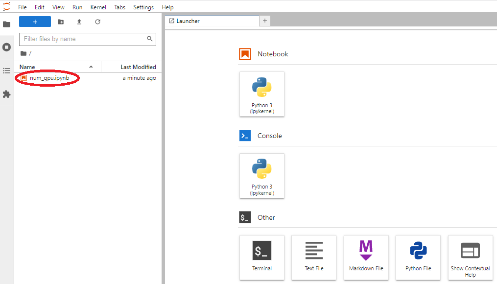
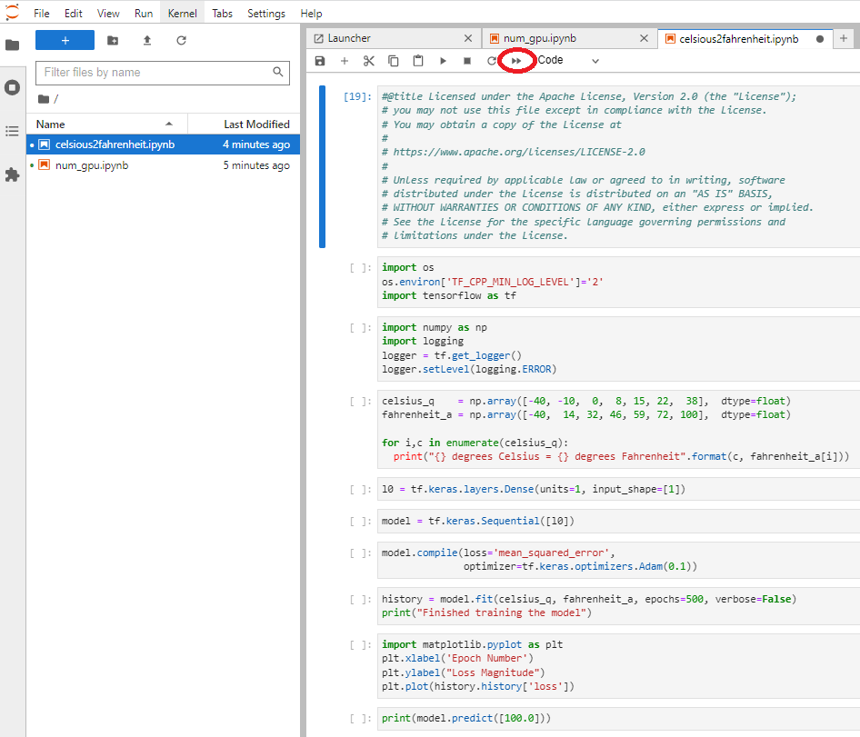
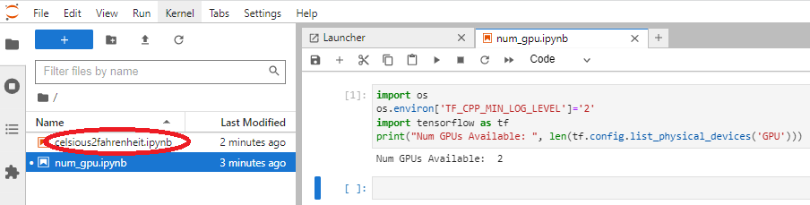

# 0. 概要

本チュートリアルは、 **[NVIDIA Driver](https://docs.nvidia.com/datacenter/tesla/driver-installation-guide/index.html#)** や **[NVIDIA CUDA](https://docs.nvidia.com/cuda/cuda-installation-guide-linux/contents.html)** がインストールされたGPUシェイプ向け **[プラットフォーム・イメージ](../../#5-17-プラットフォームイメージ)** と以下GPUシェイプの組み合わせでGPUインスタンスを作成し、この上に機械学習環境を構築して **[TensorFlow](https://www.tensorflow.org/)** を利用するサンプル機械学習プログラムを **[JupyterLab](https://jupyter.org/)** から実行します。

- VM.GPU.A10.1 (NVIDIA A10 24 GB x 1)
- VM.GPU.A10.2 (NVIDIA A10 24 GB x 2)
- BM.GPU4.8 (NVIDIA A100 40 GB x 8)
- BM.GPU.A100-v2.8 (NVIDIA A100 80 GB x 8)
- BM.GPU.A10.4 (NVIDIA A10 24 GB x 4)

これらのシェイプの詳細は、 **[ここ](https://docs.oracle.com/ja-jp/iaas/Content/Compute/References/computeshapes.htm)** を参照してください。


この機械学習環境は、以下2種類の構築方法を解説し、自身の機械学習ワークロードの要件に合わせて選択します。

- Python仮想環境を使用する構築方法  
Pythonの **[venv](https://docs.python.org/3/library/venv.html)** を使用し、OSに含まれるPythonに影響を与えることなく **TensorFlow** や **JupyterLab** をインストールし、Python仮想環境上に機械学習環境を構築します。
- コンテナを使用する構築方法  
コンテナランタイムの **[containerd](https://github.com/containerd/containerd/tree/main)** と **[NVIDIA Container Toolkit](https://docs.nvidia.com/datacenter/cloud-native/container-toolkit/latest/index.html)** を使用してGPU利用可能なコンテナ実行環境を構築し、 **TensorFlow** や **JupyterLab** が既にインストールされた機械学習ワークロード向けコンテナを **[NGC Catalog](https://catalog.ngc.nvidia.com/)** 等のコンテナレポジトリからプル・起動し、コンテナ上に機械学習環境を構築します。

またこの機械学習環境は、マルチGPUを搭載するGPUシェイプを利用することで、複数のGPUに跨る分散トレーニングが可能になります。  
このチュートリアルの後半では、マルチGPUを搭載する機械学習環境で、サンプル機械学習プログラムを **[Distributed TensorFlow](https://www.tensorflow.org/guide/distributed_training)** を使用する分散トレーニングモデルに修正、これを複数のGPUに跨って実行します。

**所要時間 :** 約1時間

**前提条件 :** 機械学習環境を構築するインスタンスを収容するコンパートメント(ルート・コンパートメントでもOKです)の作成と、このコンパートメントに対する必要なリソース管理権限がユーザーに付与されていること。

**注意 :** 本コンテンツ内の画面ショットは、現在のOCIコンソール画面と異なっている場合があります。

# 1. GPUインスタンス作成

本章は、後に機械学習環境を構築するGPUインスタンスを作成します。

GPUインスタンスの作成は、 **[OCIチュートリアル](https://oracle-japan.github.io/ocitutorials/)** の **[その3 - インスタンスを作成する](https://oracle-japan.github.io/ocitutorials/beginners/creating-compute-instance)** の手順を参考に、ご自身の要件に沿ったインスタンスをGPUインスタンスを収容する **コンパートメント** とパブリックサブネットを指定して作成します。  
本チュートリアルは、以下属性のインスタンスを例として作成します。

- **シェイプ** ： **[VM.GPU.A10.2](https://docs.oracle.com/ja-jp/iaas/Content/Compute/References/computeshapes.htm#vm-gpu)**
- **イメージ** ： **プラットフォーム・イメージ** **[Oracle-Linux-9.6-Gen2-GPU-2025.10.23-0](https://docs.oracle.com/en-us/iaas/images/oracle-linux-9x/oracle-linux-9-6-gen2-gpu-2025-10-23-0.htm)**
- **サブネット** ： パブリックサブネット
- **SSHキーの追加** ： GPUインスタンスにログインする際使用するSSH秘密鍵に対応する公開鍵
- **ブート・ボリューム・サイズ(GB)** ： 200（※1）  
    （以下の **カスタム・ブート・ボリューム・サイズとパフォーマンス設定を指定します** チェックボックスをチェックすると指定可能）

   

   ※1）通常GPUインスタンスは、様々な機械学習用ソフトウェアやコンテナイメージを格納する必要があるため、少なくとも200 GBの **ブート・ボリューム** サイズとします。

次に、作成したGPUインスタンスにopcユーザでSSHログインして以下コマンドを実行し、ルートファイルシステムをインスタンス作成時に指定したサイズに拡張します。

```sh
$ df -h /
Filesystem                  Size  Used Avail Use% Mounted on
/dev/mapper/ocivolume-root   30G   23G  7.5G  75% /
$ sudo /usr/libexec/oci-growfs -y
Volume Group: ocivolume
:
Logical volume /dev/ocivolume/root extended successfully.
$ df -h /
Filesystem                  Size  Used Avail Use% Mounted on
/dev/mapper/ocivolume-root  183G   24G  160G  13% /
$
```

次に、GPUインスタンスのopcユーザで以下コマンドを実行し、搭載しているGPUを認識していることを確認します。

```sh
$ nvidia-smi
Mon Dec  1 16:55:56 2025       
+-----------------------------------------------------------------------------------------+
| NVIDIA-SMI 580.95.05              Driver Version: 580.95.05      CUDA Version: 13.0     |
+-----------------------------------------+------------------------+----------------------+
| GPU  Name                 Persistence-M | Bus-Id          Disp.A | Volatile Uncorr. ECC |
| Fan  Temp   Perf          Pwr:Usage/Cap |           Memory-Usage | GPU-Util  Compute M. |
|                                         |                        |               MIG M. |
|=========================================+========================+======================|
|   0  NVIDIA A10                     Off |   00000000:00:04.0 Off |                    0 |
|  0%   23C    P8             10W /  150W |       0MiB /  23028MiB |      0%      Default |
|                                         |                        |                  N/A |
+-----------------------------------------+------------------------+----------------------+
|   1  NVIDIA A10                     Off |   00000000:00:05.0 Off |                    0 |
|  0%   23C    P8             10W /  150W |       0MiB /  23028MiB |      0%      Default |
|                                         |                        |                  N/A |
+-----------------------------------------+------------------------+----------------------+

+-----------------------------------------------------------------------------------------+
| Processes:                                                                              |
|  GPU   GI   CI              PID   Type   Process name                        GPU Memory |
|        ID   ID                                                               Usage      |
|=========================================================================================|
|  No running processes found                                                             |
+-----------------------------------------------------------------------------------------+
$
```

# 3. Python仮想環境を使用する機械学習環境構築

## 3-0. 概要

本章は、GPUインスタンス上のPython仮想環境に機械学習環境を構築する方法を解説します。

以降では、以下の順に解説を進めます。

1. **[Python仮想環境構築](#3-1-python仮想環境構築)**
2. **[TenforFlow・JupyterLab稼働確認](#3-2-tenforflowjupyterlab稼働確認)**
3. **[単一GPUを使用する機械学習プログラム実行](#3-3-単一gpuを使用する機械学習プログラム実行)**
4. **[複数GPUを使用する分散機械学習プログラム実行](#3-4-複数gpuを使用する分散機械学習プログラム実行)**

## 3-1. Python仮想環境構築

以下コマンドをGPUインスタンスのopcユーザで実行し、Python 3.12の仮想環境を作成するために必要なRPMパッケージをインストールします。

```sh
$ sudo dnf install -y python3.12 python3.12-pip python3.12-setuptools python3.12-wheel
```

次に、以下コマンドを自身の端末で実行し、この端末の8888番ポートをGPUインスタンスの8888番ポート( **JupyterLab** がアクセスを待ち受けるポート)に転送するSSHポートフォワードを作成し、GPUインスタンスの機械学習ワークロード実行ユーザにログインします。  
なお、 **path_to_ssh_secret_key** （GPUインスタンス作成時に指定したSSH公開鍵に対応するSSH秘密鍵へのパス）と **user_name** （GPUインスタンス上の機械学習ワークロード実行ユーザ名）とGPUインスタンスのパブリックIPアドレスは、自身のものに置き換えます。

```sh
$ ssh -i path_to_ssh_secret_key -L 8888:localhost:8888 user_name@123.456.789.123
```

次に、以下コマンドをGPUインスタンスの機械学習ワークロード実行ユーザで実行し、Python 3.12のPython仮想環境を作成します。  
なお **project_name** と **venv_name** は、自身の環境に置き換えます。

```sh
$ mkdir -p ~/project_name && cd ~/project_name
$ python3.12 -m venv venv_name
$ source venv_name/bin/activate
((venv_name) ) $
```

次に、以下コマンドをGPUインスタンスの機械学習ワークロード実行ユーザで実行し、Python 3.12のPython仮想環境に **TensorFlow** 、 **JupyterLab** 、及び **Matplotlib** をインストールします。

```sh
((venv_name) ) $ pip install --upgrade pip
((venv_name) ) $ pip install tensorflow[and-cuda] jupyterlab matplotlib
```

次に、以下コマンドをGPUインスタンスの機械学習ワークロード実行ユーザで実行し、 **JupyterLab** にログインする際のパスワードを初期化します。

```sh
((venv_name) ) $ jupyter lab password
Enter password: <-- パスワード入力
Verify password:  <-- パスワード入力
[JupyterPasswordApp] Wrote hashed password to /mnt/home/usera/.jupyter/jupyter_server_config.json
((venv_name) ) $
```

次に、以下コマンドをGPUインスタンスの機械学習ワークロード実行ユーザで実行し、Python 3.12のPython仮想環境を終了します。

```sh
((venv_name) ) $ deactivate
$
```

次に、以下2個のファイルをカレントディレクトリにそれぞれファイル名 **num_gpu.ipynb** （※2）と **celsious2fahrenheit.ipynb** （※3）で作成します。  

※2）**TensorFlow** が認識するGPUの枚数を確認するPythonプログラムを含む、 **JupyterLab** に読み込ませるJSON形式のファイルです。  
※3）既知の摂氏・華氏対応データからその変換式を学習して未知の摂氏表記温度から対応する華氏を予測するPythonプログラムを含む、 **JupyterLab** に読み込ませるJSON形式のファイルです。このファイルは、 **[ここ](https://github.com/justingrammens/machine_learning/blob/master/celsius_to_fahrenheit.ipynb)** のGitHubから公開されているものを元に、一部改変を加えて作成しています。

```json
{
   "cells": [
   {
      "cell_type": "code",
      "execution_count": null,
      "metadata": {},
      "outputs": [],
      "source": [
      "import os\n",
      "os.environ['TF_CPP_MIN_LOG_LEVEL']='2'\n",
      "import tensorflow as tf\n",
      "print(\"Num GPUs Available: \", len(tf.config.list_physical_devices('GPU')))"
      ]
   }
   ],
   "metadata": {
   "kernelspec": {
      "display_name": "Python 3",
      "language": "python",
      "name": "python3"
   },
   "language_info": {
      "codemirror_mode": {
      "name": "ipython",
      "version": 3
      },
      "file_extension": ".py",
      "mimetype": "text/x-python",
      "name": "python",
      "nbconvert_exporter": "python",
      "pygments_lexer": "ipython3",
      "version": "3.6.8"
   }
   },
   "nbformat": 4,
   "nbformat_minor": 4
}
```

```json
{
 "cells": [
  {
   "cell_type": "code",
   "execution_count": null,
   "metadata": {},
   "outputs": [],
   "source": [
    "import os\n",
    "os.environ['TF_CPP_MIN_LOG_LEVEL']='2'\n",
    "import tensorflow as tf"
   ]
  },
  {
   "cell_type": "code",
   "execution_count": null,
   "metadata": {},
   "outputs": [],
   "source": [
    "import numpy as np\n",
    "import logging\n",
    "logger = tf.get_logger()\n",
    "logger.setLevel(logging.ERROR)"
   ]
  },
  {
   "cell_type": "code",
   "execution_count": null,
   "metadata": {},
   "outputs": [],
   "source": [
    "celsius_q    = np.array([-40, -10,  0,  8, 15, 22,  38,  45],  dtype=float)\n",
    "fahrenheit_a = np.array([-40,  14, 32, 46, 59, 72, 100, 113],  dtype=float)\n",
    "\n",
    "for i,c in enumerate(celsius_q):\n",
    "  print(\"{} degrees Celsius = {} degrees Fahrenheit\".format(c, fahrenheit_a[i]))"
   ]
  },
  {
   "cell_type": "code",
   "execution_count": null,
   "metadata": {},
   "outputs": [],
   "source": [
    "model = tf.keras.Sequential([\n",
    "  tf.keras.Input(shape=[1]),\n",
    "  tf.keras.layers.Dense(units=1)\n",
    "])\n",
    "model.compile(loss='mean_squared_error', optimizer=tf.keras.optimizers.Adam(0.1))\n",
    "history = model.fit(celsius_q, fahrenheit_a, epochs=500, verbose=False)"
   ]
  },
  {
   "cell_type": "code",
   "execution_count": null,
   "metadata": {},
   "outputs": [],
   "source": [
    "print(\"Finished training the model\")"
   ]
  },
  {
   "cell_type": "code",
   "execution_count": null,
   "metadata": {},
   "outputs": [],
   "source": [
    "import matplotlib.pyplot as plt\n",
    "plt.xlabel('Epoch Number')\n",
    "plt.ylabel(\"Loss Magnitude\")\n",
    "plt.plot(history.history['loss'])"
   ]
  },
  {
   "cell_type": "code",
   "execution_count": null,
   "metadata": {},
   "outputs": [],
   "source": [
    "temp_c = 100.0\n",
    "prediction_input = np.array([temp_c], dtype=float)\n",
    "print(model.predict(prediction_input))"
   ]
  }
 ],
 "metadata": {
  "kernelspec": {
   "display_name": "Python 3 (ipykernel)",
   "language": "python",
   "name": "python3"
  },
  "language_info": {
   "codemirror_mode": {
    "name": "ipython",
    "version": 3
   },
   "file_extension": ".py",
   "mimetype": "text/x-python",
   "name": "python",
   "nbconvert_exporter": "python",
   "pygments_lexer": "ipython3",
   "version": "3.12.11"
  }
 },
 "nbformat": 4,
 "nbformat_minor": 4
}
```

## 3-2. TenforFlow・JupyterLab稼働確認

以下コマンドをGPUインスタンスの機械学習ワークロード実行ユーザで実行し、Python 3.12のPython仮想環境上で **JupyterLab** を起動します。  
なお **project_name** と **venv_name** は、自身の環境に置き換えます。

```sh
$ cd ~/project_name
$ python3.12 -m venv venv_name
$ source venv_name/bin/activate
((venv_name) ) $ jupyter-lab
```

次に、自身の端末で起動するブラウザのアドレスに **http://localhost:8888** を指定して **JupyterLab** にアクセスし、表示される以下画面の **Password** フィールドに先に登録したパスワードを入力して **Log in** ボタンをクリックし、 **JupyterLab** にログインします。


次に、以下ブラウザ画面に表示される、先に作成した稼働確認プログラム **num_gpu.ipynb** をダブルクリックし、



表示される以下ブラウザ画面の **Run this cell and advance** ボタンをクリックして稼働確認プログラムを実行、"Num GPUs Available:"の値が使用するGPUシェイプに搭載されるGPU枚数に一致することを確認します。



次に、 **JupyterLab** にアクセスしているブラウザを終了後、 **JupyterLab** を起動したターミナルで以下のようにCtrl-Cを入力して **JupyterLab** を終了し、Python仮想環境を終了します。

```sh
Cntr-C <--- 入力
    0 active kernels
    Jupyter Server 2.17.0 is running at:
    http://localhost:8888/lab
        http://127.0.0.1:8888/lab
Shut down this Jupyter server (y/[n])? y <--- 入力
[C 2025-12-01 21:22:19.829 ServerApp] Shutdown confirmed
[I 2025-12-01 21:22:19.837 ServerApp] Shutting down 4 extensions
((venv_name) ) $ deactivate
$
```

## 3-3. 単一GPUを使用する機械学習プログラム実行

以下コマンドをGPUインスタンスの機械学習ワークロード実行ユーザで実行し、Python 3.12のPython仮想環境上で **JupyterLab** を起動します。  
なお **project_name** と **venv_name** は、自身の環境に置き換えます。

```sh
$ cd ~/project_name
$ python3.12 -m venv venv_name
$ source venv_name/bin/activate
((venv_name) ) $ jupyter-lab
```

次に、自身の端末で起動するブラウザのアドレスに **http://localhost:8888** を指定して **JupyterLab** にアクセスし、以下画面に表示される、先に作成したサンプル機械学習プログラム **celsious2fahrenheit.ipynb** をダブルクリックします。


次に、表示される以下ブラウザ画面の **Restart the kernel and run all cells** ボタンをクリックします。


次に、表示される以下ブラウザ画面の **Restart** ボタンをクリックしてサンプル機械学習プログラムを実行し、


実行した結果が表示される以下ブラウザ画面で、100度（摂氏）に対応する華氏の予測値が変換式（f=1.8c+32）から計算される212度（華氏）に近い値であることを確認します。



次に、 **JupyterLab** にアクセスしているブラウザを終了後、 **JupyterLab** を起動したターミナルで以下のようにCtrl-Cを入力して **JupyterLab** を終了し、Python 3.12のPython仮想環境を終了します。

```sh
Cntr-C <--- 入力
    0 active kernels
    Jupyter Server 2.17.0 is running at:
    http://localhost:8888/lab
        http://127.0.0.1:8888/lab
Shut down this Jupyter server (y/[n])? y <--- 入力
[C 2025-12-01 21:22:19.829 ServerApp] Shutdown confirmed
[I 2025-12-01 21:22:19.837 ServerApp] Shutting down 4 extensions
((venv_name) ) $ deactivate
((venv_name) ) $
```

## 3-4. 複数GPUを使用する分散機械学習プログラム実行

以下コマンドをGPUインスタンスの機械学習ワークロード実行ユーザで実行し、Python 3.12のPython仮想環境上で **JupyterLab** を起動します。  
なお **project_name** と **venv_name** は、自身の環境に置き換えます。

```sh
$ cd ~/project_name
$ python3.12 -m venv venv_name
$ source venv_name/bin/activate
((venv_name) ) $ jupyter-lab
```

次に、自身の端末で起動するブラウザのアドレスに **http://localhost:8888** を指定して **JupyterLab** にアクセスし、以下画面に表示される、先に作成したサンプル機械学習プログラム **celsious2fahrenheit.ipynb** をダブルクリックします。


次に、表示される以下ブラウザ画面の1番目のセルの **Insert a cell below** ボタンをクリックして1番目と2番目のセルの間に新たなセルを作成します。


次に、以下のコードを

```python
#tf.debugging.set_log_device_placement(True)
mirrored_strategy = tf.distribute.MirroredStrategy()
```

以下のように新しく作成したセルに挿入します。  
このコードは、 **TensorFlow** のMirroedStrategy作成を行います。


次に、4番目のセルを以下のコード（※4）に置き換え、  

```python
with mirrored_strategy.scope():
  model = tf.keras.Sequential([
    tf.keras.Input(shape=[1]),
    tf.keras.layers.Dense(units=1)
  ])
  model.compile(loss='mean_squared_error', optimizer=tf.keras.optimizers.Adam(0.1))
  history = model.fit(celsius_q, fahrenheit_a, epochs=500, verbose=False)
```

※4）このコードは、レイヤー定義・レイヤーアセンブル・モデルコンパイル・モデルトレーニングをMirroedStrategyのスコープ内に移動し、分散トレーニングモデルを定義・実行しています。

以下ブラウザ画面の **Restart the kernel and run all cells** ボタンをクリックします。


次に、表示される以下ブラウザ画面の **Restart** ボタンをクリックし、修正後のサンプル機械学習プログラムを実行、その結果を確認します。


次に、 **JupyterLab** にアクセスしているブラウザを終了後、 **JupyterLab** を起動したターミナルで以下のようにCtrl-Cを入力して **JupyterLab** を終了し、Python 3.12のPython仮想環境を終了します。

```sh
Cntr-C <--- 入力
    0 active kernels
    Jupyter Server 2.17.0 is running at:
    http://localhost:8888/lab
        http://127.0.0.1:8888/lab
Shut down this Jupyter server (y/[n])? y <--- 入力
[C 2025-12-01 21:22:19.829 ServerApp] Shutdown confirmed
[I 2025-12-01 21:22:19.837 ServerApp] Shutting down 4 extensions
((venv_name) ) $ deactivate
((venv_name) ) $
```

# 4. コンテナを使用する機械学習環境構築

## 4-0. 概要

本章は、GPUインスタンス上に **containerd** と **[NVIDIA Container Toolkit](https://docs.nvidia.com/datacenter/cloud-native/container-toolkit/latest/index.html)** を使用してGPU利用可能なコンテナ実行環境を構築し、コンテナ上に機械学習環境を構築する方法を解説します。

以降では、以下の順に解説を進めます。

1. **[コンテナ環境構築](#4-1-コンテナ環境構築)**
2. **[TenforFlow・JupyterLab稼働確認](#4-2-tenforflowjupyterlab稼働確認)**
3. **[単一GPUを使用する機械学習プログラム実行](#4-3-単一gpuを使用する機械学習プログラム実行)**
4. **[複数GPUを使用する分散機械学習プログラム実行](#4-4-複数gpuを使用する分散機械学習プログラム実行)**

## 4-1. コンテナ環境構築

コンテナ環境構築は、 **[OCI HPCテクニカルTips集](../#3-oci-hpcテクニカルtips集)** の **[containerdによるコンテナ実行環境構築方法](../tech-knowhow/container-with-containerd/)** の手順を、 **単一GPUインスタンスに閉じたコンテナ利用** の範囲でGPUインスタンスに適用することで実施します。

次に、以下コマンドを自身の端末で実行し、この端末の8888番ポートをGPUインスタンスの8888番ポート( **JupyterLab** がアクセスを待ち受けるポート)に転送するSSHポートフォワードを作成し、GPUインスタンスの機械学習ワークロード実行ユーザにログインします。  
なお、 **path_to_ssh_secret_key** （GPUインスタンス作成時に指定したSSH公開鍵に対応するSSH秘密鍵へのパス）と **user_name** （GPUインスタンス上の機械学習ワークロード実行ユーザ名）とGPUインスタンスのパブリックIPアドレスは、自身のものに置き換えます。

```sh
$ ssh -i path_to_ssh_secret_key -L 8888:localhost:8888 user_name@123.456.789.123
```

次に、以下コマンドをGPUインスタンスの機械学習ワークロード実行ユーザで実行し、 **[NGC Catalog](https://catalog.ngc.nvidia.com/)** から **[TensorFlow NGC Container](https://catalog.ngc.nvidia.com/orgs/nvidia/containers/tensorflow)** をホストネットワークモードで起動します。  
本コンテナのサイズは、約14 GBです。

```sh
$ nerdctl run -it --rm --gpus all --network=host --ipc=host --ulimit memlock=-1 --ulimit stack=67108864 --shm-size=1g -v ~:/root -v /sys:/sys:ro nvcr.io/nvidia/tensorflow:25.02-tf2-py3
```

次に、以下コマンドをGPUインスタンスで起動したコンテナ上のrootユーザで実行し、 **JupyterLab** にログインする際のパスワードを初期化します。

```sh
$ jupyter lab password
Enter password: <-- パスワード入力
Verify password:  <-- パスワード入力
[JupyterPasswordApp] Wrote hashed password to /root/.jupyter/jupyter_server_config.json
$
```

次に、以下2個のファイルをGPUインスタンスで起動したコンテナ上のカレントディレクトリにそれぞれファイル名 **num_gpu.ipynb** （※5）と **celsious2fahrenheit.ipynb** （※6）で作成します。  

※5）**TensorFlow** が認識するGPUの枚数を確認するPythonプログラムを含む、 **JupyterLab** に読み込ませるJSON形式のファイルです。  
※6）既知の摂氏・華氏対応データからその変換式を学習して未知の摂氏表記温度から対応する華氏を予測するPythonプログラムを含む、 **JupyterLab** に読み込ませるJSON形式のファイルです。このファイルは、 **[ここ](https://github.com/justingrammens/machine_learning/blob/master/celsius_to_fahrenheit.ipynb)** のGitHubから公開されているものを元に、一部改変を加えて作成しています。


```json
{
   "cells": [
   {
      "cell_type": "code",
      "execution_count": null,
      "metadata": {},
      "outputs": [],
      "source": [
      "import os\n",
      "os.environ['TF_CPP_MIN_LOG_LEVEL']='2'\n",
      "import tensorflow as tf\n",
      "print(\"Num GPUs Available: \", len(tf.config.list_physical_devices('GPU')))"
      ]
   }
   ],
   "metadata": {
   "kernelspec": {
      "display_name": "Python 3",
      "language": "python",
      "name": "python3"
   },
   "language_info": {
      "codemirror_mode": {
      "name": "ipython",
      "version": 3
      },
      "file_extension": ".py",
      "mimetype": "text/x-python",
      "name": "python",
      "nbconvert_exporter": "python",
      "pygments_lexer": "ipython3",
      "version": "3.6.8"
   }
   },
   "nbformat": 4,
   "nbformat_minor": 4
}
```

```json
{
 "cells": [
  {
   "cell_type": "code",
   "execution_count": null,
   "metadata": {},
   "outputs": [],
   "source": [
    "import os\n",
    "os.environ['TF_CPP_MIN_LOG_LEVEL']='2'\n",
    "import tensorflow as tf"
   ]
  },
  {
   "cell_type": "code",
   "execution_count": null,
   "metadata": {},
   "outputs": [],
   "source": [
    "import numpy as np\n",
    "import logging\n",
    "logger = tf.get_logger()\n",
    "logger.setLevel(logging.ERROR)"
   ]
  },
  {
   "cell_type": "code",
   "execution_count": null,
   "metadata": {},
   "outputs": [],
   "source": [
    "celsius_q    = np.array([-40, -10,  0,  8, 15, 22,  38,  45],  dtype=float)\n",
    "fahrenheit_a = np.array([-40,  14, 32, 46, 59, 72, 100, 113],  dtype=float)\n",
    "\n",
    "for i,c in enumerate(celsius_q):\n",
    "  print(\"{} degrees Celsius = {} degrees Fahrenheit\".format(c, fahrenheit_a[i]))"
   ]
  },
  {
   "cell_type": "code",
   "execution_count": null,
   "metadata": {},
   "outputs": [],
   "source": [
    "model = tf.keras.Sequential([\n",
    "  tf.keras.Input(shape=[1]),\n",
    "  tf.keras.layers.Dense(units=1)\n",
    "])\n",
    "model.compile(loss='mean_squared_error', optimizer=tf.keras.optimizers.Adam(0.1))\n",
    "history = model.fit(celsius_q, fahrenheit_a, epochs=500, verbose=False)"
   ]
  },
  {
   "cell_type": "code",
   "execution_count": null,
   "metadata": {},
   "outputs": [],
   "source": [
    "print(\"Finished training the model\")"
   ]
  },
  {
   "cell_type": "code",
   "execution_count": null,
   "metadata": {},
   "outputs": [],
   "source": [
    "temp_c = 100.0\n",
    "prediction_input = np.array([temp_c], dtype=float)\n",
    "print(model.predict(prediction_input))"
   ]
  }
 ],
 "metadata": {
  "kernelspec": {
   "display_name": "Python 3 (ipykernel)",
   "language": "python",
   "name": "python3"
  },
  "language_info": {
   "codemirror_mode": {
    "name": "ipython",
    "version": 3
   },
   "file_extension": ".py",
   "mimetype": "text/x-python",
   "name": "python",
   "nbconvert_exporter": "python",
   "pygments_lexer": "ipython3",
   "version": "3.12.3"
  }
 },
 "nbformat": 4,
 "nbformat_minor": 4
}
```

## 4-2. TenforFlow・JupyterLab稼働確認

以下コマンドをGPUインスタンスで起動したコンテナ上のrootユーザで実行し、 **JupyterLab** を起動します。

```sh
$ jupyter-lab
```

次に、自身の端末で起動するブラウザのアドレスに **http://localhost:8888** を指定して **JupyterLab** にアクセスし、表示される以下画面の **Password** フィールドに先に登録したパスワードを入力して **Log in** ボタンをクリックし、 **JupyterLab** にログインします。


次に、以下ブラウザ画面に表示される、先に作成した稼働確認プログラム **num_gpu.ipynb** をダブルクリックし、


表示される以下ブラウザ画面の **Run this cell and advance** ボタンをクリックして稼働確認プログラムを実行、"Num GPUs Available:"の値が使用するGPUシェイプに搭載されるGPU枚数に一致することを確認します。


次に、 **JupyterLab** にアクセスしているブラウザを終了後、 **JupyterLab** を起動したターミナルで以下のようにCtrl-Cを入力して **JupyterLab** を終了します。

```sh
Cntr-C <--- 入力
[I 2025-12-03 03:41:45.764 ServerApp] interrupted
[I 2025-12-03 03:41:45.764 ServerApp] Serving notebooks from local directory: /workspace
    1 active kernel
    Jupyter Server 2.15.0 is running at:
    http://hostname:8888/lab
        http://127.0.0.1:8888/lab
Shut down this Jupyter server (y/[n])? y <--- 入力
[C 2025-12-03 03:41:46.994 ServerApp] Shutdown confirmed
[I 2025-12-03 03:41:46.995 ServerApp] Shutting down 8 extensions
[I 2025-12-03 03:41:46.995 ServerApp] Shutting down 1 kernel
[I 2025-12-03 03:41:46.995 ServerApp] Kernel shutdown: 57087af1-c391-49fb-95b6-459af6ce8614
$
```

## 4-3. 単一GPUを使用する機械学習プログラム実行

以下コマンドをGPUインスタンスで起動したコンテナ上のrootユーザで実行し、 **JupyterLab** を起動します。

```sh
$ jupyter-lab
```

次に、自身の端末で起動するブラウザのアドレスに **http://localhost:8888** を指定して **JupyterLab** にアクセスし、以下画面に表示される、先に作成したサンプル機械学習プログラム **celsious2fahrenheit.ipynb** をダブルクリックします。


次に、表示される以下ブラウザ画面の **Restart the kernel and run all cells** ボタンをクリックします。


次に、表示される以下ブラウザ画面の **Restart** ボタンをクリックして機械学習プログラムを実行し、


実行した結果が表示される以下ブラウザ画面で、100度（摂氏）に対応する華氏の予測値が変換式（f=1.8c+32）から計算される212度（華氏）に近い値であることを確認します。


次に、 **JupyterLab** にアクセスしているブラウザを終了後、 **JupyterLab** を起動したターミナルで以下のようにCtrl-Cを入力して **JupyterLab** を終了します。

```sh
Cntr-C <--- 入力
[I 2025-12-03 03:41:45.764 ServerApp] interrupted
[I 2025-12-03 03:41:45.764 ServerApp] Serving notebooks from local directory: /workspace
    1 active kernel
    Jupyter Server 2.15.0 is running at:
    http://hostname:8888/lab
        http://127.0.0.1:8888/lab
Shut down this Jupyter server (y/[n])? y <--- 入力
[C 2025-12-03 03:41:46.994 ServerApp] Shutdown confirmed
[I 2025-12-03 03:41:46.995 ServerApp] Shutting down 8 extensions
[I 2025-12-03 03:41:46.995 ServerApp] Shutting down 1 kernel
[I 2025-12-03 03:41:46.995 ServerApp] Kernel shutdown: 57087af1-c391-49fb-95b6-459af6ce8614
$
```

## 4-4. 複数GPUを使用する分散機械学習プログラム実行

以下コマンドをGPUインスタンスで起動したコンテナ上のrootユーザで実行し、 **JupyterLab** を起動します。

```sh
$ jupyter-lab
```

次に、自身の端末で起動するブラウザのアドレスに **http://localhost:8888** を指定して **JupyterLab** にアクセスし、以下画面に表示される、先に作成したサンプル機械学習プログラム **celsious2fahrenheit.ipynb** をダブルクリックします。


次に、表示される以下ブラウザ画面の1番目のセルの **Insert a cell below** ボタンをクリックして1番目と2番目のセルの間に新たなセルを作成します。


次に、以下のコードを

```python
#tf.debugging.set_log_device_placement(True)
mirrored_strategy = tf.distribute.MirroredStrategy()
```

以下のように新しく作成したセルに挿入します。  
このコードは、 **TensorFlow** のMirroedStrategy作成を行います。


次に、4番目のセルを以下のコード（※7）に置き換え、  

```python
with mirrored_strategy.scope():
  model = tf.keras.Sequential([
    tf.keras.Input(shape=[1]),
    tf.keras.layers.Dense(units=1)
  ])
  model.compile(loss='mean_squared_error', optimizer=tf.keras.optimizers.Adam(0.1))
  history = model.fit(celsius_q, fahrenheit_a, epochs=500, verbose=False)
```
※7）このコードは、レイヤー定義・レイヤーアセンブル・モデルコンパイル・モデルトレーニングをMirroedStrategyのスコープ内に移動し、分散トレーニングモデルを定義・実行しています。

以下ブラウザ画面の **Restart the kernel and run all cells** ボタンをクリックします。


次に、表示される以下ブラウザ画面の **Restart** ボタンをクリックし、修正後のサンプル機械学習プログラムを実行、その結果を確認します。


次に、 **JupyterLab** にアクセスしているブラウザを終了後、 **JupyterLab** を起動したターミナルで以下のようにCtrl-Cを入力して **JupyterLab** を終了します。

```sh
Cntr-C <--- 入力
[I 2025-12-03 03:41:45.764 ServerApp] interrupted
[I 2025-12-03 03:41:45.764 ServerApp] Serving notebooks from local directory: /workspace
    1 active kernel
    Jupyter Server 2.15.0 is running at:
    http://hostname:8888/lab
        http://127.0.0.1:8888/lab
Shut down this Jupyter server (y/[n])? y <--- 入力
[C 2025-12-03 03:41:46.994 ServerApp] Shutdown confirmed
[I 2025-12-03 03:41:46.995 ServerApp] Shutting down 8 extensions
[I 2025-12-03 03:41:46.995 ServerApp] Shutting down 1 kernel
[I 2025-12-03 03:41:46.995 ServerApp] Kernel shutdown: 57087af1-c391-49fb-95b6-459af6ce8614
$
```