# 0. 概要

**ブロック・ボリューム** は、以下の特徴からHPCクラスタやGPUクラスタのファイル共有ストレージとして使用するNFSサーバのストレージに最適なサービスです。

- 同一 **可用性ドメイン** 内の異なる **フォルト・ドメイン** に複数のレプリカを持ち高い可用性を実現
- ディスク装置にNVMe SSDを採用することで高いスループットとIOPSを実現

また、ベア・メタル・シェイプ **[BM.Standard.E6.256](https://docs.oracle.com/ja-jp/iaas/Content/Compute/References/computeshapes.htm#bm-standard)** は、200 GbpsのTCP/IP接続用ポートを1個搭載し、全二重通信の2系統のラインをそれぞれiSCSI接続の **ブロック・ボリューム** アクセス用途とNFSクライアントへのNFSサービス用途にフル活用することで、10GB/sを超えるスループットを持つコストパフォーマンスの高いNFSサーバ用インスタンスとして利用することが可能です。

OCIは、NFSのマネージドサービスである **ファイル・ストレージ** も提供していますが、本チュートリアルのように **ブロック・ボリューム** とベア・メタル・シェイプ **BM.Standard.E6.256** を使用してNFSでサービスするファイル共有ストレージ（以降ブロック・ボリュームNFSサーバと呼称）を構築することで、 **ファイル・ストレージ** よりも格段にコストパフォーマンスを引き上げることが出来ます。  
**ファイル・ストレージ** とブロック・ボリュームNFSサーバの比較詳細は、 **[OCI HPCテクニカルTips集](/ocitutorials/hpc/#3-oci-hpcテクニカルtips集)** の **[HPC/GPUクラスタ向けファイル共有ストレージの最適な構築手法](/ocitutorials/hpc/tech-knowhow/howto-configure-sharedstorage/)** を参照してください。

本チュートリアルは、 **GitHub** のパブリックレポジトリ（ **[tutorial_bvnfs_e6](https://github.com/fwiw6430/tutorial_bvnfs_e6)** ）から公開されている **[Terraform](/ocitutorials/hpc/#5-12-terraform)** スクリプトを **[リソース・マネージャ](/ocitutorials/hpc/#5-2-リソースマネージャ)** に読み込ませて作成する **[スタック](/ocitutorials/hpc/#5-3-スタック)** を使用し、以下構成のNFSでサービスするファイル共有ストレージを自動構築（図中の **Deployment target** 範囲）した後、NFSファイルシステム性能をNFSクライアントから実行する **IOR** と **mdtest** で検証します。  
この **IOR** と **mdtest** の検証結果は、 **[OCI HPCテクニカルTips集](/ocitutorials/hpc/#3-oci-hpcテクニカルtips集)** の **[HPC/GPUクラスタ向けファイル共有ストレージの最適な構築手法](/ocitutorials/hpc/tech-knowhow/howto-configure-sharedstorage/)** の **[2-1. コストパフォーマンスによる比較](/ocitutorials/hpc/tech-knowhow/howto-configure-sharedstorage/#2-1-コストパフォーマンスによる比較)** を参照してください。

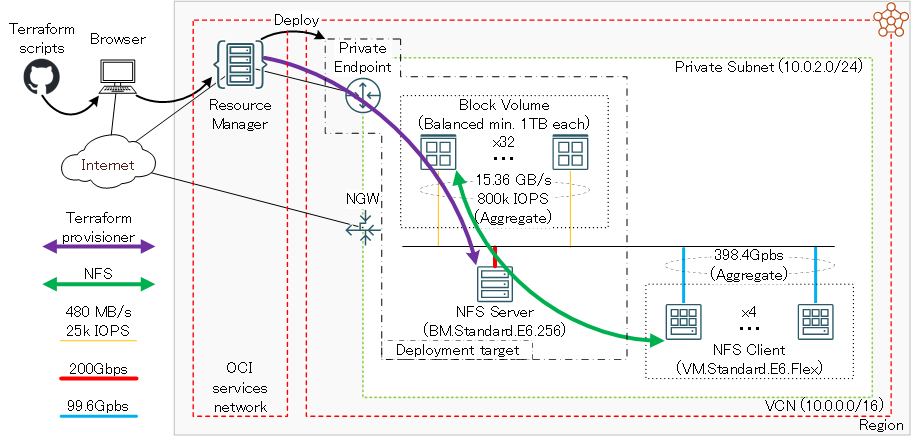

|               | 構成                                               | 用途                                                     |
| :-----------: | :----------------------------------------------: | :----------------------------------------------------: |
| ストレージ         | **ブロック・ボリューム**<br>Min. 1 TB Balanced x 32        | ファイル共有ストレージ<br>ファイル格納領域                                |
| NFSサーバ        | **BM.Standard.E6.256** x 1<br>**Oracle Linux** 8.10 | NFSサーバ                                                 |
| プライベートエンドポイント | **リソース・マネージャ**<br>プライベートエンドポイント x 1              | NFSサーバ構築スクリプトを配布・起動する<br>**Terraform** プロビジョナー用エンドポイント |
| NFSクライアント     | **[VM.Standard.E6.Flex](https://docs.oracle.com/ja-jp/iaas/Content/Compute/References/computeshapes.htm#flexible)** x 4<br>**Oracle Linux** 9.5 | ファイルシステムベンチマーク用<br>NFSクライアント                           |

本チュートリアルで作成するブロック・ボリュームNFSサーバ構築用の **スタック** は、適用すると以下の処理を行います。

-  **仮想クラウド・ネットワーク** と関連するネットワークリソースの作成（※1）
- **ブロック・ボリューム** の作成
- NFSサーバ用インスタンスの作成
- 作成した **ブロック・ボリューム** をNFSサーバにアタッチ
- **Terraform** プロビジョナーでNFSサーバにSSHアクセスする際に使用するSSH鍵ペア作成・配布
- **Terraform** のfileプロビジョナーでNFSサーバにNFSサーバ構成用スクリプト（※2）を配布
- **Terraform** のremote-execプロビジョナーでNFSサーバ上でNFSサーバ構成用スクリプト（※2）を実行
- 構築したNFSサーバのホスト名・IPアドレス出力

※1）既存の **仮想クラウド・ネットワーク** を活用することも可能で、この場合はこの **仮想クラウド・ネットワーク** が以下の条件を満たしているている必要があります。

- NFSサーバ・NFSクライアント間接続とNFSサーバ・ **ブロック・ボリューム** 間iSCSI接続用のプライベートサブネットが存在する
- **NATゲートウェイ** と **サービス・ゲートウェイ** が存在する
- プライベートサブネットに **NATゲートウェイ** と **サービス・ゲートウェイ** へのルーティングを適切に設定した **ルート・テーブル** が紐づいている

※2）このスクリプト（ **nfssrv_configure.sh** ）は、NFSサーバのopcユーザのホームディレクトリに配置され、以下の処理を行います。

- **ブロック・ボリューム** のストレージに
  - ボリュームグループを作成
  - 論理ボリュームをストライブ幅32（**ブロック・ボリューム** 数32に対応）で作成
  - XFSファイルシステムを作成
- 作成したXFSファイルシステムを **/mnt/bv** にマウント
- NFSサービスを以下の設定で起動
  - スレッド数256
  - **/mnt/bv** をworld writableでエクスポート
- **Oracle Linux** のカーネルを **RedHat Compatible Kernel** （以降 **RHCK** と呼称します。）に変更

またこの **スタック** は、 **[cloud-init](/ocitutorials/hpc/#5-11-cloud-init)** 設定ファイル( **cloud-config** )を含み、 **cloud-init** がNFSサーバの作成時に以下の処理を行います。

- タイムゾーンをJSTに変更
- **firewalld** 停止
- **SELinux** 無効化

**所要時間 :** 約1時間

**前提条件 :** ブロック・ボリュームNFSサーバを収容するコンパートメント(ルート・コンパートメントでもOKです)の作成と、このコンパートメントに対する必要なリソース管理権限がユーザーに付与されていること。

**注意 :** 本コンテンツ内の画面ショットは、現在のOCIコンソール画面と異なっている場合があります。

***
# 1. 事前準備

## 1-0. 概要

本章は、ブロック・ボリュームNFSサーバを構築するにあたり事前に必要な以下リソースを作成します。

- **[構成ソース・プロバイダ](/ocitutorials/hpc/#5-14-構成ソースプロバイダ)**
- **IAMポリシー**
- **[スタック](/ocitutorials/hpc/#5-3-スタック)**

## 1-1. 構成ソース・プロバイダ作成

本章は、ひな型となる **[Terraform](/ocitutorials/hpc/#5-12-terraform)** スクリプトを **GitHub** パブリックレポジトリから取り込むための **[構成ソース・プロバイダ](/ocitutorials/hpc/#5-14-構成ソースプロバイダ)** を作成します。

**構成ソース・プロバイダ** の作成は、 **[ここ](/ocitutorials/hpc/#5-14-構成ソースプロバイダ)** を参照してください。

## 1-2. IAMポリシー作成

本章は、 **[スタック](/ocitutorials/hpc/#5-3-スタック)** からブロック・ボリュームNFSサーバを作成するために必要な **IAMポリシー** を作成します。

OCIコンソールにログインし、 **アイデンティティとセキュリティ** → **ポリシー** とメニューを辿ります。

次に、表示される以下 **xxxxコンパートメント内のポリシー** 画面で、 **ポリシーの作成** ボタンをクリックします。  
この際、 **コンパートメント** プルダウンメニューがブロック・ボリュームNFSサーバを作成する **コンパートメント** と異なる場合は、これを修正します。

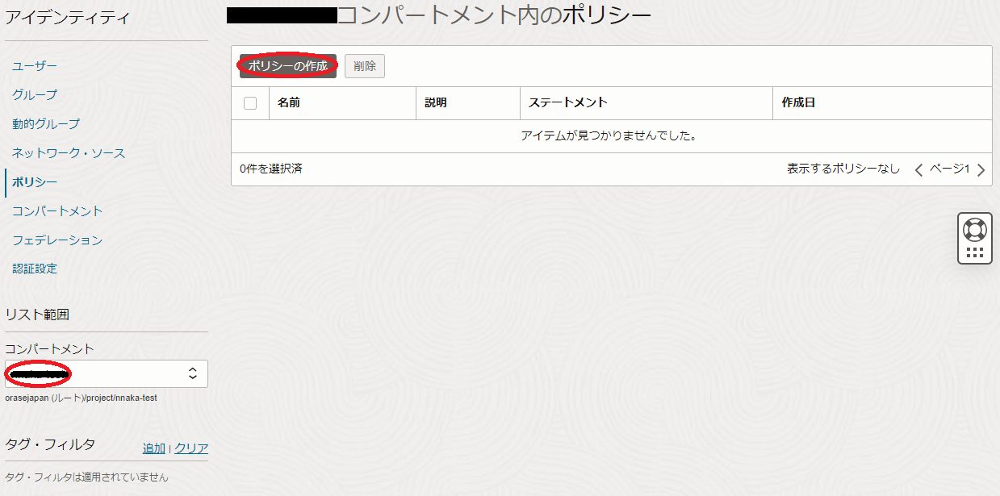

次に、表示される以下 **ポリシーの作成** 画面で、各フィールドに以下の情報を入力し **作成** ボタンをクリックします。なお、ここに記載のないフィールドは、デフォルトのままとします。

- **名前** ： **IAMポリシー** に付与する名前
- **説明** ： **IAMポリシー** に付与する説明（用途等）
- **ポリシー・ビルダー** ： 作成する **IAMポリシー** を指定する以下構文（ **手動エディタの表示** ボタンをクリックして表示）

```sh
allow service compute_management to use tag-namespace in compartment compartment_name
allow service compute_management to manage compute-management-family in compartment compartment_name
allow service compute_management to read app-catalog-listing in compartment compartment_name
allow group group_name to manage all-resources in compartment compartment_name
```

※4）**コンパートメント** 名は、自身のものに置き換えます。  
※5）4行目の **グループ** 名は、自身のものに置き換えます。  

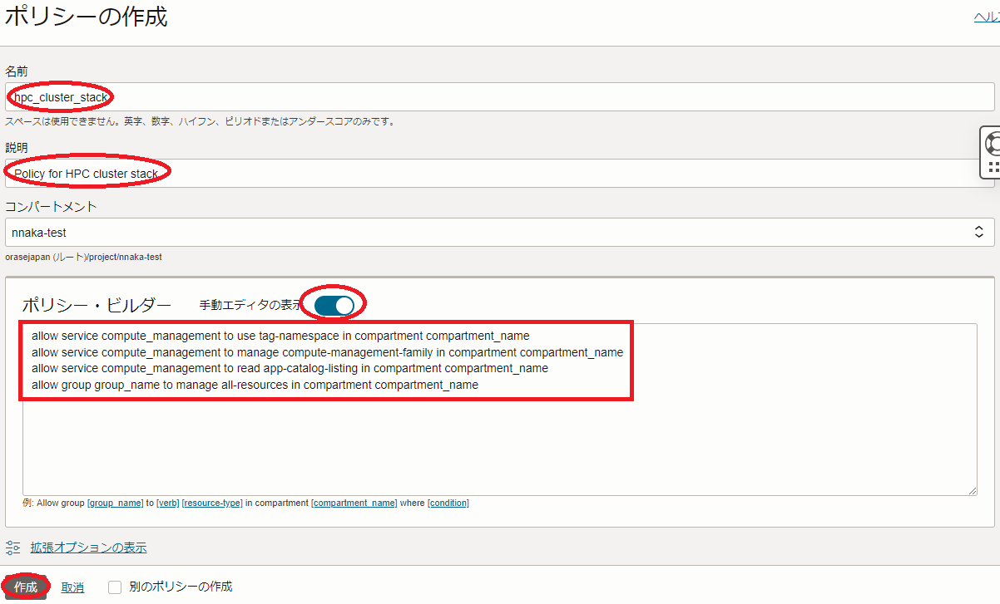

## 1-3. スタック作成

本章は、ブロック・ボリュームNFSサーバを構築するための **[スタック](/ocitutorials/hpc/#5-3-スタック)** を作成します。

OCIコンソールにログインし、ブロック・ボリュームNFSサーバを作成するリージョンを選択後、 **開発者サービス** → **リソース・マネージャ** → **スタック** とメニューを辿ります。

次に、表示される以下画面で、**スタックの作成** ボタンをクリックします。

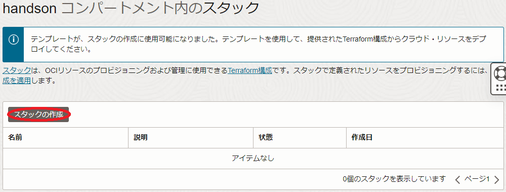

次に、表示される以下 **スタック情報** 画面で、以下の情報を入力し、下部の **次** ボタンをクリックします。

- **Terraformの構成のオリジン :** ソース・コード制御システム
- **ソースコード管理タイプ :** **GitHub**
- **構成ソース・プロバイダ :** 先に作成した **[構成ソース・プロバイダ](/ocitutorials/hpc/#5-14-構成ソースプロバイダ)**
- **リポジトリ :** **tutorial_bvnfs_e6**
- **ブランチ :** **master**
- **名前 :** スタックに付与する名前（任意）
- **説明 :** スタックに付与する説明（任意）

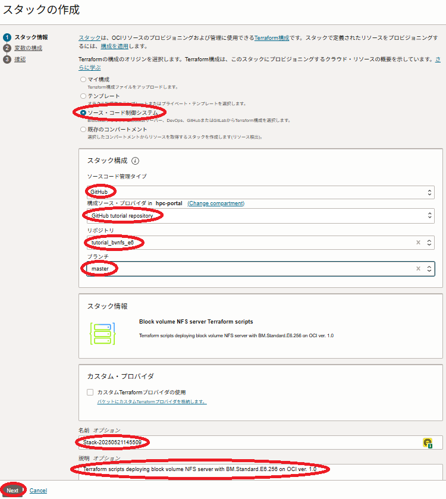

次に、表示される **変数の構成** 画面で、各画面フィールドに以下の情報を入力し、下部の **次** ボタンをクリックします。

- **General options** フィールド
  - **Compartment :** ブロック・ボリュームNFSサーバを作成する **コンパートメント**
  - **Availability Domain :** ブロック・ボリュームNFSサーバを作成する **可用性ドメイン**
  - **SSH public key :** NFSサーバにログインする際使用するSSH秘密鍵に対応する公開鍵  
  （公開鍵ファイルのアップロード（ **SSHキー・ファイルの選択** ）と公開鍵のフィールドへの貼り付け（ **SSHキーの貼付け** ）が選択可能）
  - **Use existing VCN :** 既存の **仮想クラウド・ネットワーク** を使用するかどうかを指定（デフォルト： **仮想クラウド・ネットワーク** を新規作成）  
  （既存の **仮想クラウド・ネットワーク** を使用する場合は、チェックすると表示されるVCN・Storageサブネット・NFSサブネットの各フィールドにOCIDを指定します。）

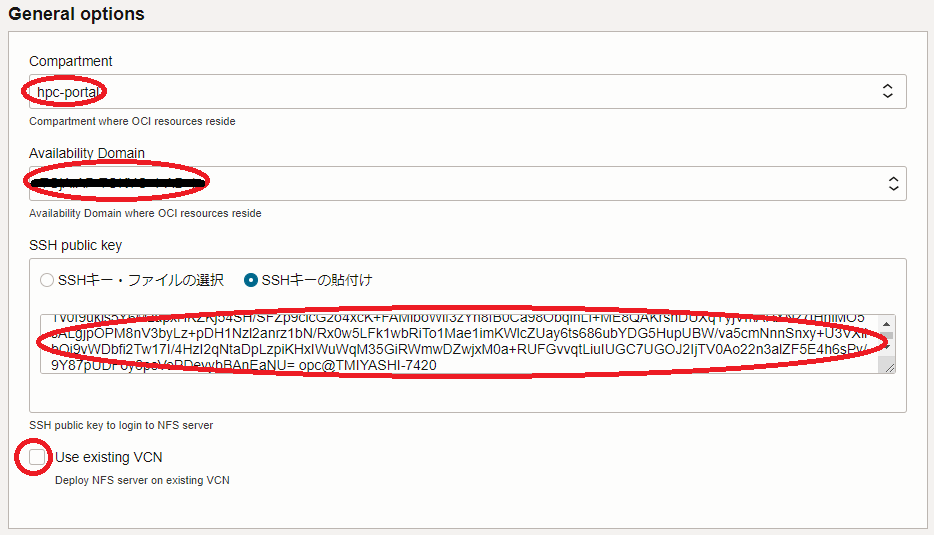

- **Block volume options** フィールド
  - **Block volume total size :** **ブロック・ボリューム** の総容量（最低：32,000GB）


次に、表示される **確認** 画面で、これまでの設定項目が意図したものになっているかを確認し、以下 **作成されたスタックで適用を実行しますか。** フィールドの **適用の実行** をチェックオフし、下部の **作成** ボタンをクリックします。


ここで **適用の実行** をチェックした場合、 **作成** ボタンのクリックと同時に **スタック** の適用が開始され、ブロック・ボリュームNFSサーバの構築が始まりますが、このチュートリアルでは後の章で改めて **スタック** の適用を行います。

これで、以下画面のとおりブロック・ボリュームNFSサーバ構築用 **スタック** が作成されました。

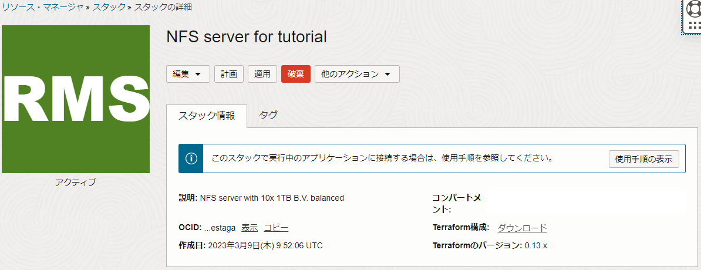

***
# 2.ブロック・ボリュームNFSサーバ構築

本章は、先に作成した **[スタック](/ocitutorials/hpc/#5-3-スタック)** を使用し、ブロック・ボリュームNFSサーバを構築します。

以下 **スタックの詳細** 画面で、 **適用** ボタンをクリックします。

   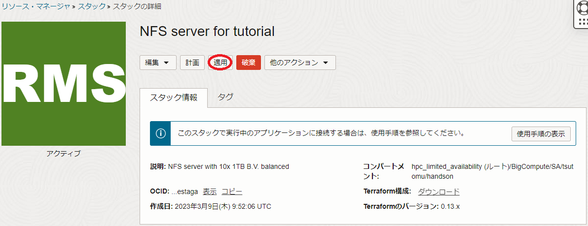

次に、表示される以下 **適用** サイドバーで、 **適用** ボタンをクリックします。

   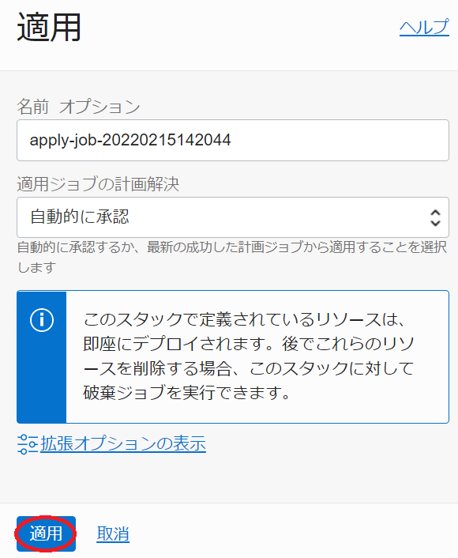

次に、表示される以下 **ジョブ詳細** ウィンドウで、左上のステータスが **受入れ済** → **進行中** と遷移すれば、 **スタック** の適用が実施されています。


表示される以下 **ログ** フィールドで、リソースの作成状況を確認します。


この適用が完了するまでの所要時間は、10分程度です。

ステータスが **成功** となれば、ブロック・ボリュームNFSサーバの作成が完了しており、以下のように **ログ** フィールドの最後にNFSサーバのホスト名とIPアドレスが出力されます。

```sh
Outputs:
NFS_server_instances_created = {
  "display_name" = "nfs-srv"
  "private_ip  " = "10.0.3.206"
}
```

***
# 3. ブロック・ボリュームNFSサーバ確認

## 3-0. 概要

本章は、作成されたブロック・ボリュームNFSサーバ環境を確認します。

## 3-1. NFSサーバログイン

NFSサーバは、プライベートサブネットに接続されているため、パブリックサブネットに接続されているBastionノードや、プライベートサブネットに接続するインスタンスへのSSH接続を提供する **要塞** を使用し、構築時に指定したSSH公開鍵に対応する秘密鍵を使用してopcユーザでSSHログインします。

## 3-2. cloud-init完了確認

**[cloud-init](/ocitutorials/hpc/#5-11-cloud-init)** は、NFSサーバが起動してSSHログインできる状態であっても、その処理が継続している可能性があるため、以下コマンドをNFSサーバのopcユーザで実行し、そのステータスが **done** となっていることで **cloud-init** の処理完了を確認します。

```sh
$ cloud-init status
status: done
$
```

ステータスが **running** の場合は、 **cloud-init** の処理が継続中のため、処理が完了するまで待ちます。


## 3-3. NFSサーバOS再起動

以下コマンドをNFSサーバのopcユーザで実行し、OSを再起動します。

```sh
$ sudo shutdown -r now
```

## 3-4. NFSサーバファイルシステム確認

以下コマンドをNFSサーバのopcユーザで実行し、 **ブロック・ボリューム** 上に作成したファイルシステムが **/mnt/bv** にマウントされ、そのサイズが指定したものになっていることを確認します。

```sh
$ df -h /mnt/bv
Filesystem         Size  Used Avail Use% Mounted on
/dev/mapper/bv-bv  xxxT  xxxG  xxxT   x% /mnt/bv
$
```

## 3-5. NFSサーバNFSサービス確認

以下コマンドをNFSサーバのopcユーザで実行し、NFSサービスが起動しており **ブロック・ボリューム** 上に作成したファイルシステム（ **/mnt/bv** ）がエクスポートされていることを確認します。

```sh
$ systemctl status nfs-server.service
● nfs-server.service - NFS server and services
     Loaded: loaded (/usr/lib/systemd/system/nfs-server.service; enabled; preset: disabled)
    Drop-In: /run/systemd/generator/nfs-server.service.d
             └─order-with-mounts.conf
     Active: active (exited) since Thu 2024-10-03 12:22:18 JST; 2h 29min ago
       Docs: man:rpc.nfsd(8)
             man:exportfs(8)
   Main PID: 18857 (code=exited, status=0/SUCCESS)
        CPU: 29ms

Oct 03 12:22:18 nfs-srv systemd[1]: Starting NFS server and services...
Oct 03 12:22:18 nfs-srv exportfs[18779]: exportfs: No host name given with /mnt/bv (rw,sync,no_root_squa>
Oct 03 12:22:18 nfs-srv systemd[1]: Finished NFS server and services.
$ sudo exportfs
/mnt/bv       	<world>
$
```

## 3-6. NFSサーバLinuxカーネル確認

以下コマンドをNFSサーバのopcユーザで実行し、Linuxカーネルが **RHCK** になっていることを確認します。

```sh
$ uname -r
4.18.0-553.47.1.el8_10.x86_64
$
```

***
# 4. NFSクライアント設定

本章は、NFSサーバでエクスポートしている **/mnt/bv** をNFSクライアントでマウントします。

以下コマンドをNFSクライアントのopcユーザで実行し、NFSサーバでエクスポートされている **/mnt/bv** を **/mnt/nfs** としてNFSマウントします。  
なお、コマンド中の **nfs_server_ip** は、自身のNFSサーバのNFSプライベートサブネット側のIPアドレスにに置き換えます。

```sh
$ echo "nfs_server_ip:/mnt/bv /mnt/nfs nfs vers=3,defaults,noatime,nodiratime,bg,timeo=100,ac,actimeo=120,nocto,rsize=1048576,wsize=1048576,nolock,local_lock=none,proto=tcp,sec=sys,_netdev 0 0" | sudo tee -a /etc/fstab
$ sudo systemctl daemon-reload
$ sudo mkdir -p /mnt/nfs
$ sudo mount /mnt/nfs
```

***
# 5. ファイルシステムベンチマーク

## 5-0. ファイルシステムベンチマーク概要

本章は、ファイルシステムベンチマークツールである **IOR** と **mdtest** をNFSクライアントからNFSファイルシステム領域に対して実行し、その性能を検証します。

**IOR** と **mdtest**は、複数のNFSクライアントからベンチマークを実行する際のNFSクライアント間通信にMPIを使用します。ここでは、 **[OpenMPI](https://www.open-mpi.org/)** を使用します。

またここで使用する **IOR** と **mdtest** は、 **[IO500](https://io500.org/)** に含まれるものを使用します。

以上より、本章で実施するファイルシステムベンチマークは、以下の手順を経て行います。

- NFSクライアント用インスタンス作成
- **OpenMPI** インストール
- **IO500** インストール
- ファイルシステムベンチマーク実行

## 5-1. NFSクライアント用インスタンス作成

NFSクライアントとして使用する以下のインスタンスを作成します。

- シェイプ ： **VM.Standard.E6.Flex** （100コア、1.1TBメモリ）
- OS ： **[プラットフォーム・イメージ](/ocitutorials/hpc/#5-17-プラットフォームイメージ)** **[Oracle-Linux-9.5-2025.04.16-0](https://docs.oracle.com/en-us/iaas/images/oracle-linux-9x/oracle-linux-9-5-2025-04-16-0.htm)**
- インスタンス数 ：4
- 接続サブネット ：プライベートサブネット

次に、これら4ノードのNFSクライアントで、 **[4. NFSクライアント設定](#4-nfsクライアント設定)** の手順に従い、ブロック・ボリュームNFSサーバのストレージをNFSマウントします。

## 5-2. OpenMPIインストール

**[OCI HPCテクニカルTips集](/ocitutorials/hpc/#3-oci-hpcテクニカルtips集)** の **[Oracle Linuxプラットフォーム・イメージベースのHPCワークロード実行環境構築方法](/ocitutorials/hpc/tech-knowhow/build-oraclelinux-hpcenv/)** に従い、4ノードのNFSクライアントに **OpenMPI** をインストールします。

次に、NFSクライアントのうちのどれか1ノードにopcユーザでSSHログインし、以下のように4ノードのNFSクライアントのホスト名を含むファイルを **/mnt/nfs/io500** ディレクトリに作成、これを使用してOpenMPIの稼働確認を行います。

```sh
$ pwd
/mnt/nfs/io500
$ cat ./hostlist.txt 
inst-mf3vw-nfscli
inst-ph77v-nfscli
inst-lbjs1-nfscli
inst-2cxtz-nfscli
$ for hname in `cat ./hostlist.txt`; do ssh -oStrictHostKeyChecking=accept-new $hname hostname; done
$ mpirun -n 4 -N 1 -hostfile ./hostlist.txt /bin/hostname
inst-mf3vw-nfscli
inst-ph77v-nfscli
inst-2cxtz-nfscli
inst-lbjs1-nfscli
$
```

## 5-3. IO500インストール

以下コマンドをNFSクライアントのうちのどれか1ノードのopcユーザで実行し、IO500を **/mnt/nfs/io500/io500** ディレクトリににインストールします。

```sh
$ pwd
/mnt/nfs/io500
$ git clone https://github.com/IO500/io500.git -b io500-isc24
$ cd ./io500 && ./prepare.sh
```

なお、最後のコマンドが以下のメッセージでエラーするため、

```sh
ar: ./lz4/lib/*.o: No such file or directory
```

インストールスクリプトを以下のように修正し、

```sh
$ diff build/pfind/compile.sh_org build/pfind/compile.sh
25c25
<   FILES+=./lz4/lib/*.o
---
>   FILES+=./lz4/lib/*.a
$
```

再度以下のコマンドを実行してインストールを完了します。

```sh
$ ./prepare.sh
```

## 5-4. ファイルシステムベンチマーク実行

**IOR** と **mdtest** を実行する以下のスクリプトを **/mnt/nfs/io500/io500_easy.sh** として作成し、これに実行権を与えます。

```sh
#!/bin/bash
MPI_HOSTFILE=/mnt/nfs/io500/hostlist.txt
IO500_BIN_PATH=/mnt/nfs/io500/io500/bin
IO500_DATA_DIR=/mnt/nfs/io500/datafiles
# Set the number of times to repeat each test for mdtest and ior
rep_count=3
# Set MPI parameter from arguments
if [[ "$1" =~ ^[0-9]+$ && "$2" =~ ^[0-9]+$ ]]; then
  num_proc_total=$1
  num_proc_pnode=$2
else
  echo "Specify num. of MPI total processes as 1st argument and num. of processes per node as 2nd argument."
  exit 1
fi
# mdtest easy write
for i in `seq 1 $rep_count`
do
  name="try"$i
  echo "### Starting mdtest easy write $name"
  mkdir -p $IO500_DATA_DIR/$name/mdt_easy
  date '+%Y/%m/%d %T'
  mpiexec --mca btl_base_warn_component_unused 0 --mca pml ob1 -np $num_proc_total -npernode $num_proc_pnode -hostfile $MPI_HOSTFILE $IO500_BIN_PATH/mdtest -Y -C -F -P -d $IO500_DATA_DIR/$name/mdt_easy -n 1000000 -u -L -a POSIX -x $IO500_DATA_DIR/$name/mdt_easy-stonewall -N 1 -W 300
done
# IOR easy write
for i in `seq 1 $rep_count`
do
  name="try"$i
  echo
  echo
  echo "### Starting IOR easy write $name"
  mkdir -p $IO500_DATA_DIR/$name/ior_easy
  date '+%Y/%m/%d %T'
  mpiexec --mca btl_base_warn_component_unused 0 --mca pml ob1 -np $num_proc_total -npernode $num_proc_pnode -hostfile $MPI_HOSTFILE $IO500_BIN_PATH/ior -w  -a POSIX -t 2m -v -b 9920000m -F -i 1 -C -Q 1 -g -G 27 -k -e -o $IO500_DATA_DIR/$name/ior_easy -O stoneWallingStatusFile=$IO500_DATA_DIR/$name/stonewall -O stoneWallingWearOut=1 -D 300
done
# IOR easy read
for i in `seq 1 $rep_count`
do
  name="try"$i
  echo
  echo
  echo "### Starting IOR easy read $name"
  date '+%Y/%m/%d %T'
  mpiexec --mca btl_base_warn_component_unused 0 --mca pml ob1 -np $num_proc_total -npernode $num_proc_pnode -hostfile $MPI_HOSTFILE $IO500_BIN_PATH/ior -r -R  -a POSIX -t 2m -v -b 9920000m -F -i 1 -C -Q 1 -g -G 27 -k -e -o $IO500_DATA_DIR/$name/ior_easy -O stoneWallingStatusFile=$IO500_DATA_DIR/$name/stonewall
done
# mdtest easy stat
for i in `seq 1 $rep_count`
do
  name="try"$i
  echo
  echo
  echo "### Starting mdtest easy stat $name"
  date '+%Y/%m/%d %T'
  mpiexec --mca btl_base_warn_component_unused 0 --mca pml ob1 -np $num_proc_total -npernode $num_proc_pnode -hostfile $MPI_HOSTFILE $IO500_BIN_PATH/mdtest -T -F -P -d $IO500_DATA_DIR/$name/mdt_easy -n 1000000 -u -L -a POSIX -x $IO500_DATA_DIR/$name/mdt_easy-stonewall -N 1
done
# mdtest easy delete
for i in `seq 1 $rep_count`
do
  name="try"$i
  echo
  echo
  echo "### Starting mdtest easy delete $name"
  date '+%Y/%m/%d %T'
  mpiexec --mca btl_base_warn_component_unused 0 --mca pml ob1 -np $num_proc_total -npernode $num_proc_pnode -hostfile $MPI_HOSTFILE $IO500_BIN_PATH/mdtest -r -F -P -d $IO500_DATA_DIR/$name/mdt_easy -n 1000000 -u -L -a POSIX -x $IO500_DATA_DIR/$name/mdt_easy-stonewall -N 1
done
date '+%Y/%m/%d %T'
```

このスクリプトは、 **mdtest** のcreate, stat, deleteと **IOR** のwrite, readを各3回実行し、NFSファイルシステムのメタデータ性能とスループット性能を計測します。

次に、以下コマンドをNFSクライアントのうちの1ノードのopcユーザで実行し、スクリプトの出力から性能値を確認します。  
この実行に要する時間は、一時間程度です。

```sh
$ /mnt/nfs/io500/io500_easy.sh 256 64
```

***
# 6. スタックの破棄

本章は、 **[スタック](/ocitutorials/hpc/#5-3-スタック)** を破棄することで、構築したブロック・ボリュームNFSサーバ環境を削除します。

以降の手順を実施すると、本チュートリアルで作成したOCI上のリソースをすべて削除することになるため、 **ブロック・ボリューム上に作成したファイルが全て消失** します。

以下 **スタックの詳細** 画面で、 **破棄** ボタンをクリックします。

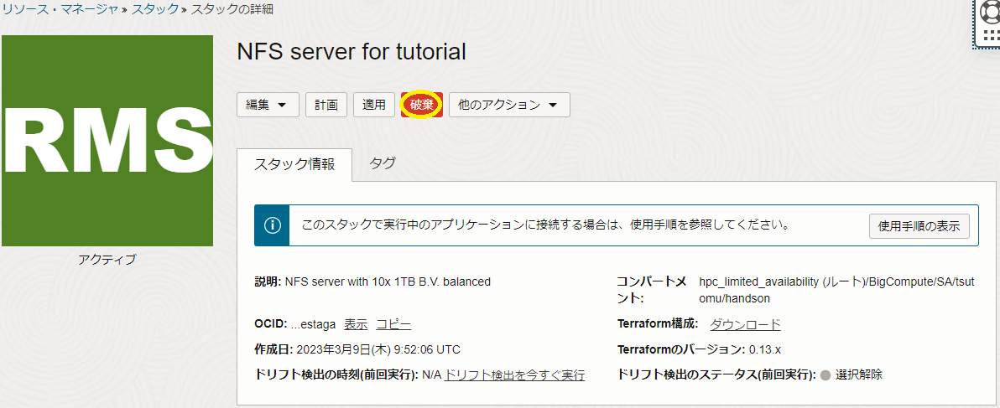

次に、表示される以下 **破棄** サイドバーで、 **破棄** ボタンをクリックします。


次に、表示される以下 **ジョブ詳細** ウィンドウで、左上のステータスが **受入れ済** → **進行中** と遷移すれば、 **スタック** の破棄が実施されています。

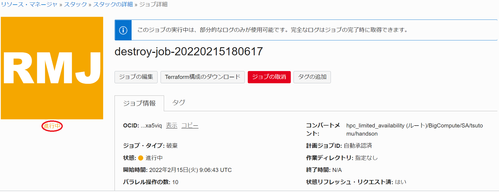

表示される以下 **ログ** フィールドで、リソースの削除状況を確認します。


この破棄が完了するまでの所要時間は、5分程度です。

ステータスが **成功** となれば、ブロック・ボリュームNFSサーバ環境の削除が完了しています。

これで、このチュートリアルは終了です。