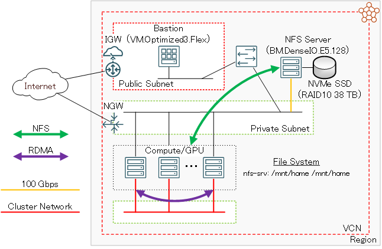

***
# 0. 概要

**[BM.DenseIO.E5.128](https://docs.oracle.com/ja-jp/iaas/Content/Compute/References/computeshapes.htm#bm-dense)** は、6.8 TBのNVMe SSDを12台ローカル接続し、ストレージに高いスループットとIOPSを要求する様々なワークロード用途に最適なベア・メタル・シェイプです。

また **BM.DenseIO.E5.128** は、100 GbpsのTCP/IP接続用ポートを1個搭載し、NVMe SSDローカルディスクに構築するストレージを外部にサービスする際、100 Gbpsの帯域を全てクライアントへのサービスに割当てることで、ストレージとのアクセスにiSCSI接続によるネットワーク帯域を消費する **ブロック・ボリューム** を使用する場合と比較し、高速なストレージサービスサーバとして利用することが出来ます。

これに対して **BM.DenseIO.E5.128** のNVMe SSDローカルディスクを使用するストレージサービスは、 **ブロック・ボリューム** を使用する場合と比較し、以下の点を考慮する必要があります。（※1）

※1）この比較詳細は、 **[OCI HPCテクニカルTips集](/ocitutorials/hpc/#3-oci-hpcテクニカルtips集)** の **[HPC/GPUクラスタ向けファイル共有ストレージの最適な構築手法](/ocitutorials/hpc/tech-knowhow/howto-configure-sharedstorage/)** を参照してください。

1. NVMe SSDローカルディスク上のデータ保護を自身で行う必要がある
2. ベア・メタル・インスタンスの故障でNVMe SSDローカルディスク上のデータを消失するリスクがある
3. データ格納容量が最大で38 TB程度（RAID10でファイルシステムを構成した場合）に限定され拡張出来ない

本チュートリアルは、これらの考慮点に対して以下のアプローチを取り、

1. ソフトウェアRAIDによるRAID10で最低限の可用性を確保
2. NVMe SSDローカルディスク上のファイルを定期的に他の長期保存ストレージにバックアップ（対象を短期保存データに限定）（※2）
3. **2.** のアプローチでバックアップの後ファイルを削除して空き容量を確保

※2）このバックアップ環境の構築は、 **[OCI HPCチュートリアル集](/ocitutorials/hpc/#1-oci-hpcチュートリアル集)** の **[ベア・メタル・インスタンスNFSサーバ向けバックアップサーバを構築する](/ocitutorials/hpc/spinup-backup-server/)** を参照してください。

以下構成の短期保存データの格納を目的とするNFSでサービスする高速なファイル共有ストレージ（以降”DenceIO NFSサーバ”と呼称）を構築します。

- NFSサーバ
   - シェイプ ： **BM.DenseIO.E5.128**
   - OS ： **Oracle Linux** 9.4（Oracle-Linux-9.4-2024.07.31-0 UEK）
- ソフトウェアRAID・NFS ： OS付属のものを利用
- RAID構成
   - RAIDレベル ： RAID10
   - Placement ： f2
   - Stripe width ： 6
   - Chunk size / Stripe unit ： 512 KB
- ファイルシステム容量 ： 38 TB
- 起動nfsdスレッド数 ： 128



本チュートリアルで構築するDenceIO NFSサーバは、以下の条件でファイルシステムベンチマークを実行し検証しています。

- ベンチマークツール ： **[IO500](https://io500.org/)** ISC20に含まれる **IOR** と **mdtest**
- NFSクライアント
   - シェイプ ： **VM.Standard2.24**
   - OS ： **Oracle Linux** 8.10（Oracle-Linux-8.10-2024.06.30-0 UEK）
   - ノード数 ： 8
- **IOR** / **mdtest** 実行時MPIプロセス数 ： 128（ノード当たり16）

この **IOR** と **mdtest** の検証結果は、 **[OCI HPCテクニカルTips集](/ocitutorials/hpc/#3-oci-hpcテクニカルtips集)** の **[HPC/GPUクラスタ向けファイル共有ストレージの最適な構築手法](/ocitutorials/hpc/tech-knowhow/howto-configure-sharedstorage/)** の **[2-1. コストパフォーマンスによる比較](/ocitutorials/hpc/tech-knowhow/howto-configure-sharedstorage/#2-1-コストパフォーマンスによる比較)** を参照してください。

**所要時間 :** 約1時間

**前提条件 :** DenceIO NFSサーバを収容するコンパートメント(ルート・コンパートメントでもOKです)の作成と、このコンパートメントに対する必要なリソース管理権限がユーザーに付与されていること。

**注意 :** 本コンテンツ内の画面ショットは、現在のOCIコンソール画面と異なっている場合があります。

***
# 1. 事前作業

## 1-0. 概要

本章は、NFSサーバと計算/GPUノードをTCP接続する **仮想クラウド・ネットワーク** と、通常インターネットから直接アクセス出来ないプライベートサブネットに接続するNFSサーバと計算/GPUノードにログインする際の踏み台となるBastionノードを予め用意します。

## 1-1. 仮想クラウド・ネットワーク作成

本章は、NFSサーバと計算/GPUノードを接続する **仮想クラウド・ネットワーク** を作成します。

**仮想クラウド・ネットワーク** の作成は、 **[OCIチュートリアル](https://oracle-japan.github.io/ocitutorials/)** の **[その2 - クラウドに仮想ネットワーク(VCN)を作る](https://oracle-japan.github.io/ocitutorials/beginners/creating-vcn)** の手順通りに実行し、以下のリソースを作成します。

- **仮想クラウド・ネットワーク** （10.0.0.0/16）
- パブリックサブネット
- プライベートサブネット
- **インターネット・ゲートウェイ** （パブリックサブネットにアタッチ）
- **NATゲートウェイ** （プライベートサブネットにアタッチ）
- **サービス・ゲートウェイ** （プライベートサブネットにアタッチ）
- **ルート表** x 2（パブリックサブネットとプライベートサブネットにアタッチ）
- **セキュリティリスト** x 2（パブリックサブネットとプライベートサブネットにアタッチ）

この **仮想クラウド・ネットワーク** は、 **セキュリティリスト** で以下のアクセス制限が掛けられています。

- インターネットからのアクセス：パブリックサブネットに接続されるインスタンスの22番ポート（SSH）に限定
- インターネットへのアクセス：インターネット上の任意のIPアドレス・ポートに制限なくアクセス可能

## 1-2. Bastionノード作成

本章は、NFSサーバにログインする際の踏み台となるBastinノードを作成します。

Bastionノードの作成は、 **[OCIチュートリアル](https://oracle-japan.github.io/ocitutorials/)** の  **[その3 - インスタンスを作成する](https://oracle-japan.github.io/ocitutorials/beginners/creating-compute-instance)** の手順を参考に、自身の要件に沿ったインスタンスを先の手順で **仮想クラウド・ネットワーク** を作成した **コンパートメント** とパブリックサブネットを指定して作成します。  
本チュートリアルは、以下属性のインスタンスをBastionノードとして作成します。

- **イメージ** ： **Oracle Linux** 8.10
- **シェイプ** ： **VM.Optimized3.Flex** （任意のコア数・メモリ容量）
- **SSHキーの追加** ： Bastionノードにログインする際使用するSSH秘密鍵に対応する公開鍵

次に、このBastionノード上でSSHの鍵ペアを作成します。このSSH鍵は、BastionノードからNFSサーバにログインする際に使用します。  
先のチュートリアル **インスタンスを作成する** に記載のインスタンスへの接続方法に従い、BastionノードにopcユーザでSSHログインして以下コマンドでSSH鍵ペアを作成、作成された公開鍵を後のNFSサーバ用インスタンス作成手順で指定します。

```sh
$ ssh-keygen
Generating public/private rsa key pair.
Enter file in which to save the key (/home/opc/.ssh/id_rsa): 
Enter passphrase (empty for no passphrase): 
Enter same passphrase again: 
Your identification has been saved in /home/opc/.ssh/id_rsa.
Your public key has been saved in /home/opc/.ssh/id_rsa.pub.
The key fingerprint is:
SHA256:2EvR7FXtEYAsDknJG1oREie1kv2r1PN3OYrYCP/Xlyg opc@bast
The keys randomart image is:
+---[RSA 2048]----+
|     +=*= . ..oo.|
|      *B.+ o . ..|
|     ooo* + .  ..|
|     ..+.+ .    .|
|      . S..      |
|       ....      |
|       o.+    o o|
|      . + *E.+ *.|
|       . +.=+.o o|
+----[SHA256]-----+
$ cat .ssh/id_rsa.pub 
ssh-rsa AAAAB3NzaC1yc2EAAAADAQABAAABAQD0TDo4QJPbXNRq/c5wrc+rGU/dLZdUziHPIQ7t/Wn+00rztZa/3eujw1DQvMsoUrJ+MHjE89fzZCkBS2t4KucqDfDqcrPuaKF3+LPBkgW0NdvytBcBP2J9zk15/O9tIVvsX8WBi8jgPGxnQMo4mQuwfvMh1zUF5dmvX3gXU3p+lH5akZa8sy/y16lupge7soN01cQLyZfsnH3BA7TKFyHxTe4MOSHnbv0r+6Cvyy7Url0RxCHpQhApA68KBIbfvhRHFg2WNtgggtVGWk+PGmTK7DTtYNaiwSfZkuqFdEQM1T6ofkELDruB5D1HgDi3z+mnWYlHMNHZU5GREH66acGJ opc@bast
$
```

次に、以降作成するNFSサーバの名前解決をインスタンス名で行うため、 **[OCI HPCテクニカルTips集](/ocitutorials/hpc/#3-oci-hpcテクニカルtips集)** の **[計算ノードの効果的な名前解決方法](/ocitutorials/hpc/tech-knowhow/compute-name-resolution/)** の手順を実施します。

***
# 2. 計算/GPUノード作成

本章は、DenceIO NFSサーバのNFSクライアントとなる計算/GPUノードを作成します。

この構築手順は、 **[OCI HPCチュートリアル集](/ocitutorials/hpc/#1-oci-hpcチュートリアル集)** の **[HPCクラスタ](/ocitutorials/hpc/#1-1-hpcクラスタ)** カテゴリや **[機械学習環境](/ocitutorials/hpc/#1-2-機械学習環境)** カテゴリの各チュートリアルを参照してください。

***
# 3. DenceIO NFSサーバ環境構築

## 3-0. 概要

本章は、DenceIO NFSサーバ環境を構築します。

この構築は、以下の手順を経て行います。

- NFSサーバインスタンス作成
- NVMe SSDローカルディスク領域ファイルシステム作成
- NFSサーバ環境構築
- NFSクライアントでのファイルシステムマウント

## 3-1. NFSサーバインスタンス作成

本章は、NFSサーバインスタンスを作成します。

NFSサーバインスタンスの作成は、 **[OCIチュートリアル](https://oracle-japan.github.io/ocitutorials/)** の  **[その3 - インスタンスを作成する](https://oracle-japan.github.io/ocitutorials/beginners/creating-compute-instance)** の手順を参考に、以下属性のインスタンスを先の手順で **仮想クラウド・ネットワーク** を作成した **コンパートメント** とプライベートサブネットを指定して作成します。

- **名前** ： インスタンスの名前（イニシャルホスト名）（本チュートリアルでは **nfs-srv**）
- **イメージ** ： **Oracle Linux** 9 (2024.07.31-0)
- **シェイプ** ： **BM.DenseIO.E5.128**
- **SSHキーの追加** ： **[1-2. Bastionノード作成](#1-2-bastionノード作成)** で作成したSSH鍵公開鍵

NFSサーバインスタンスが **実行中** となったら、先に作成したBastionノードからopcユーザでSSHログインします。

次に、以下コマンドをopcユーザで実行し、12台のNVMe SSDローカルディスクが接続されていることを確認します。

```sh
$ lsblk | grep ^nvme | sort -k 1.5,1.6 -n
nvme0n1            259:7    0  6.2T  0 disk   
nvme1n1            259:2    0  6.2T  0 disk   
nvme2n1            259:4    0  6.2T  0 disk   
nvme3n1            259:6    0  6.2T  0 disk   
nvme4n1            259:3    0  6.2T  0 disk   
nvme5n1            259:1    0  6.2T  0 disk   
nvme6n1            259:10   0  6.2T  0 disk   
nvme7n1            259:11   0  6.2T  0 disk   
nvme8n1            259:9    0  6.2T  0 disk   
nvme9n1            259:0    0  6.2T  0 disk   
nvme10n1           259:5    0  6.2T  0 disk   
nvme11n1           259:8    0  6.2T  0 disk   
$
```

## 3-2. NVMe SSDローカルディスク領域ファイルシステム作成

本章は、NFSサーバインスタンスでNVMe SSDローカルディスクにファイルシステムを作成します。

以下コマンドをopcユーザで実行し、NVMe SSDローカルディスクにRAID10のファイルシステムを作成しこれを **/mnt/nvme_raid** にマウントします。

```sh
$ sudo mdadm --create /dev/md0 --raid-devices=12 --level=10 --chunk=8M --layout=f2 --assume-clean /dev/nvme0n1 /dev/nvme1n1 /dev/nvme2n1 /dev/nvme3n1 /dev/nvme4n1 /dev/nvme5n1 /dev/nvme6n1 /dev/nvme7n1 /dev/nvme8n1 /dev/nvme9n1 /dev/nvme10n1 /dev/nvme11n1
$ sudo pvcreate /dev/md0
$ sudo vgcreate nvme /dev/md0
$ sudo lvcreate -y -l 100%FREE -n nvme_raid nvme
$ sudo mkfs.xfs -d su=8m,sw=6 -L nvme_raid /dev/nvme/nvme_raid
$ echo "LABEL=nvme_raid /mnt/nvme_raid/ xfs defaults,noatime 0 0" | sudo tee -a /etc/fstab
$ sudo systemctl daemon-reload
$ sudo mkdir -p /mnt/nvme_raid
$ sudo mount /mnt/nvme_raid
```

次に、以下コマンドをopcユーザで実行し、マウントしたファイルシステムを確認します。

```sh
$ df -h /mnt/nvme_raid
Filesystem                  Size  Used Avail Use% Mounted on
/dev/mapper/nvme-nvme_raid   38T  266G   37T   1% /mnt/nvme_raid
$
```

## 3-3. NFSサーバ環境構築

本章は、NFSサーバインスタンスでNFSサーバ環境を構築します。

以下コマンドをNFSサーバインスタンスのopcユーザで実行し、NFSサーバを起動してNVMe SSDローカルディスクに作成したファイルシステムがエクスポートされていることを確認します。

```sh
$ echo "/mnt/nvme_raid 10.0.0.0/16(rw,sync,no_root_squash)" | sudo tee -a /etc/exports
/mnt/nvme_raid 10.0.0.0/16(rw,sync,no_root_squash)
$ sudo sed -i 's/# threads=8/threads=128/g' /etc/nfs.conf
$ sudo systemctl enable --now nfs-server rpcbind
Created symlink /etc/systemd/system/multi-user.target.wants/nfs-server.service → /usr/lib/systemd/system/nfs-server.service.
$ sudo exportfs 
/mnt/nvme_raid	10.0.0.0/16
$
```

## 3-4. NFSクライアントでのファイルシステムマウント

本章は、DenceIO NFSサーバのNFSクライアントとなる計算/GPUノードで、当該領域をNFSマウントします。

以下コマンドを計算/GPUノードのopcユーザで実行し、DenceIO NFSサーバ領域をNFSマウントします。

```sh
$ echo "nfs-srv:/mnt/nvme_raid /mnt/nvme_raid nfs vers=3,defaults,noatime,nodiratime,bg,timeo=100,ac,actimeo=120,nocto,rsize=1048576,wsize=1048576,nolock,local_lock=none,proto=tcp,sec=sys,_netdev 0 0" | sudo tee -a /etc/fstab
$ sudo systemctl daemon-reload
$ sudo mkdir -p /mnt/nvme_raid
$ sudo mount /mnt/nvme_raid
```

次に、以下コマンドを計算/GPUノードのopcユーザで実行し、マウントしたファイルシステムを確認します。

```sh
$ df -h /mnt/nvme_raid
Filesystem                  Size  Used Avail Use% Mounted on
/dev/mapper/nvme-nvme_raid   38T  266G   37T   1% /mnt/nvme_raid
$
```

これで、このチュートリアルは終了です。

