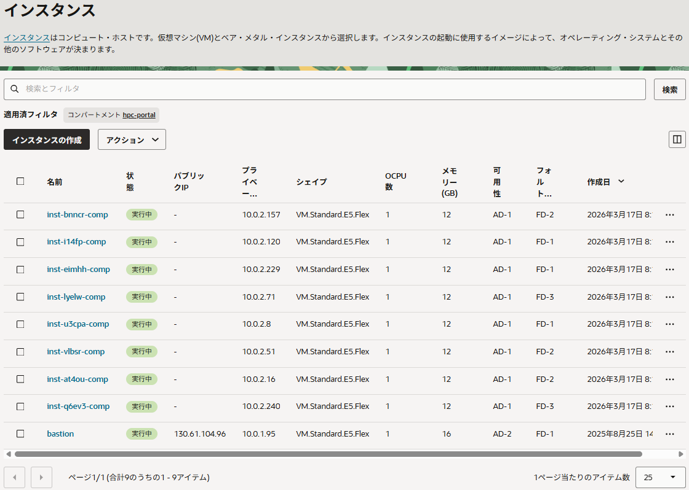
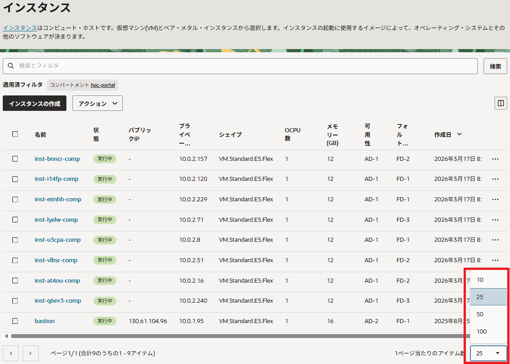
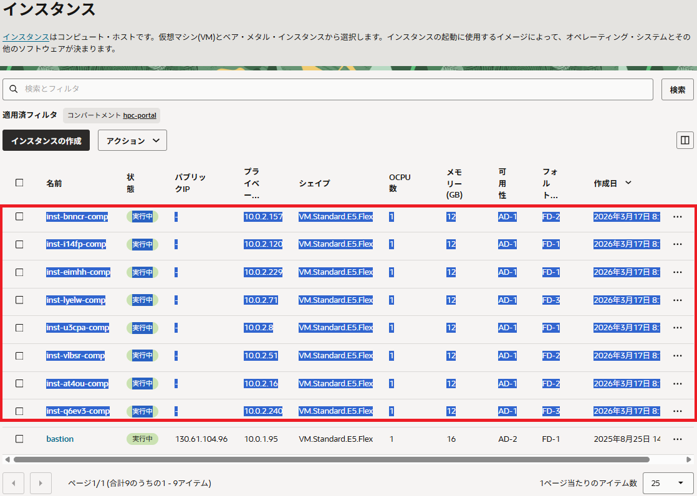
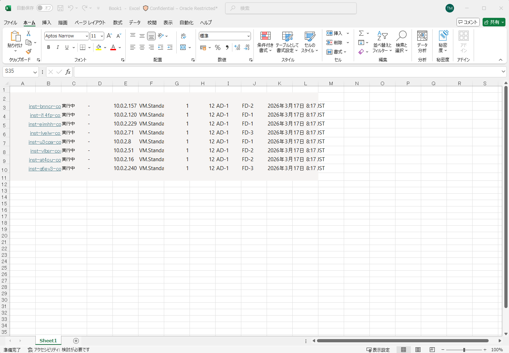
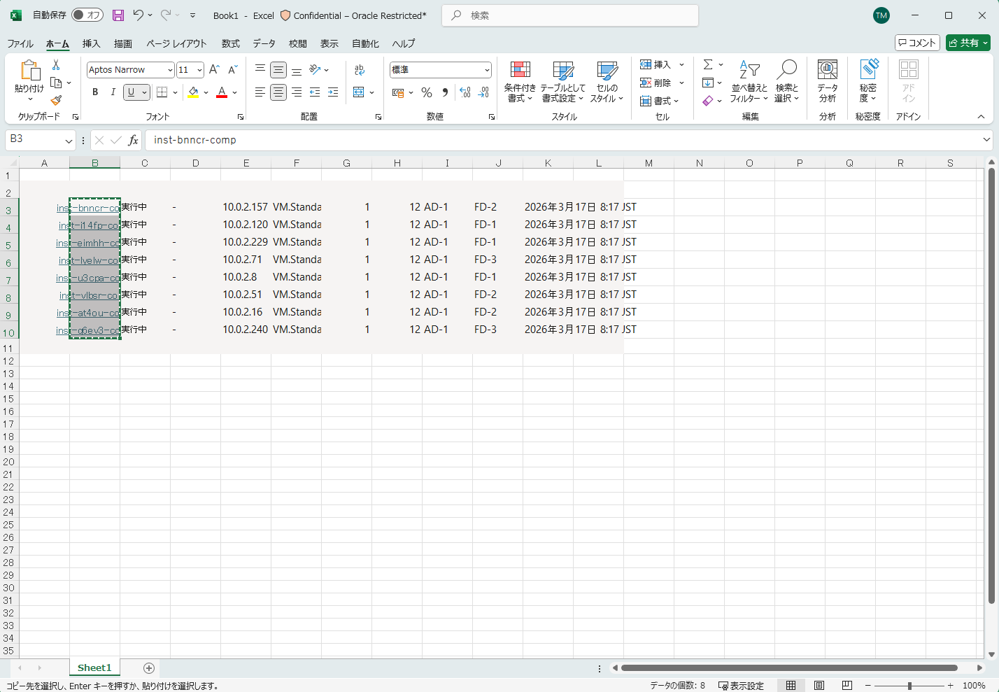
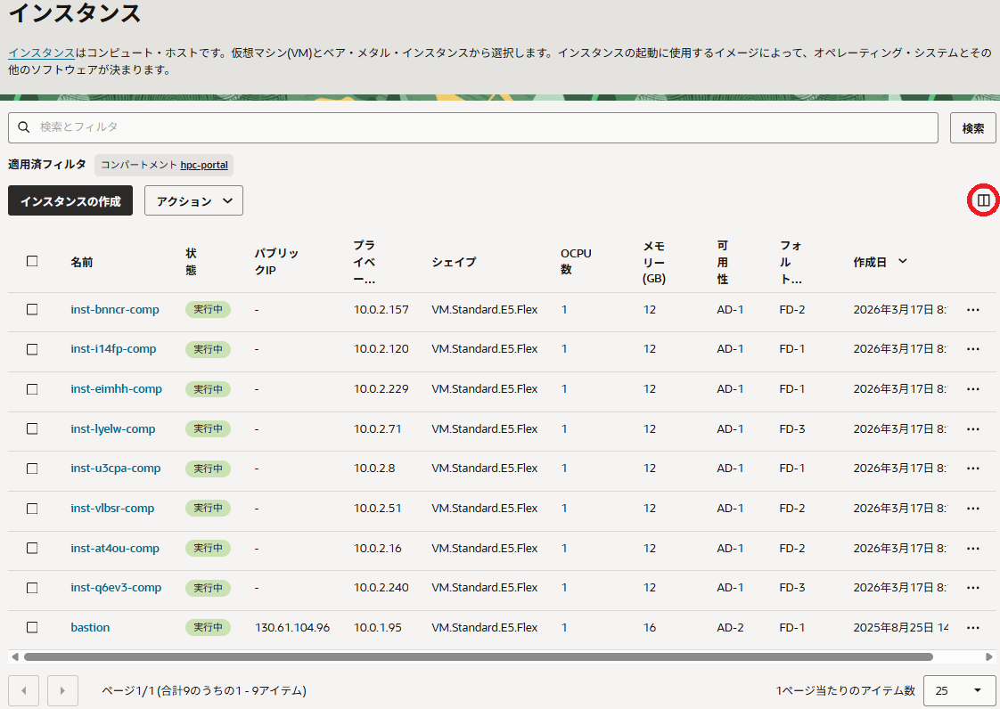
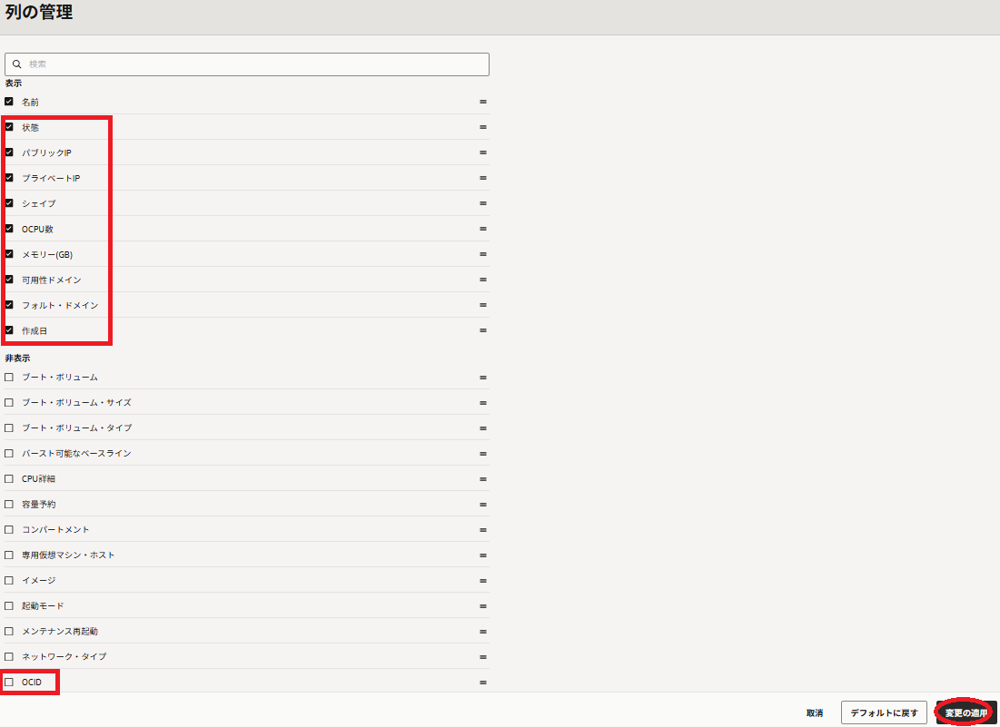
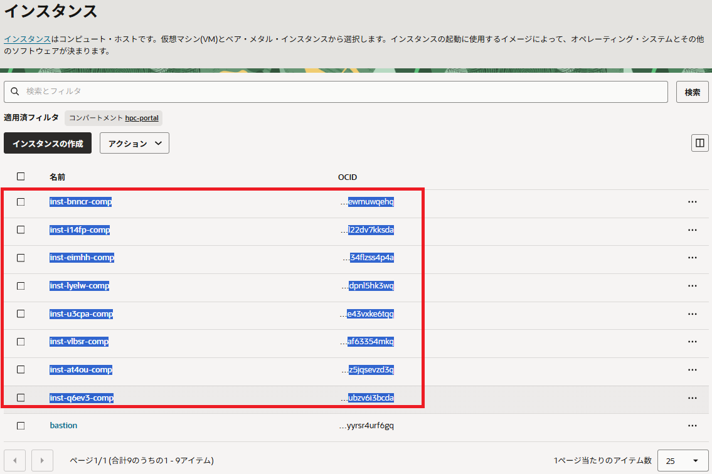
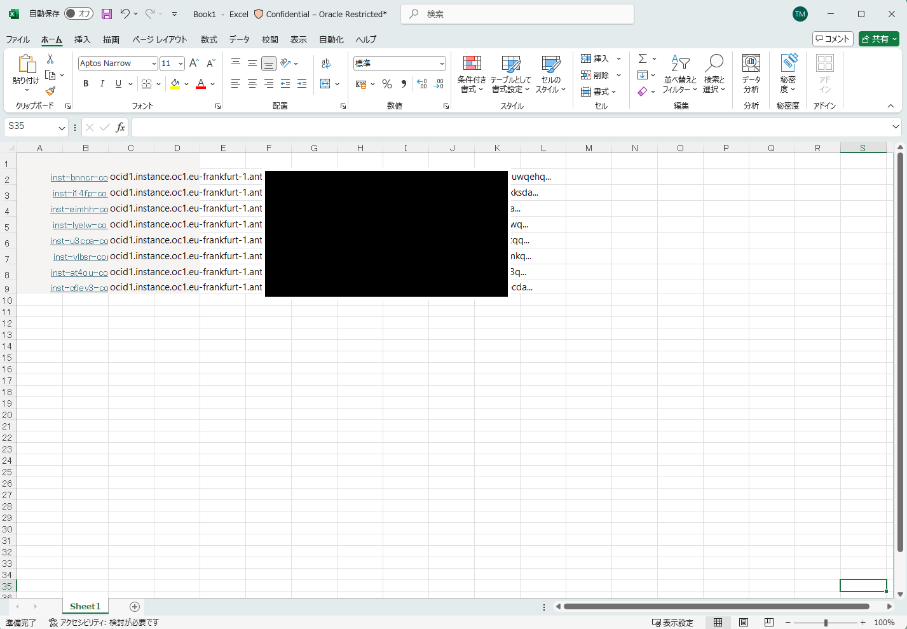
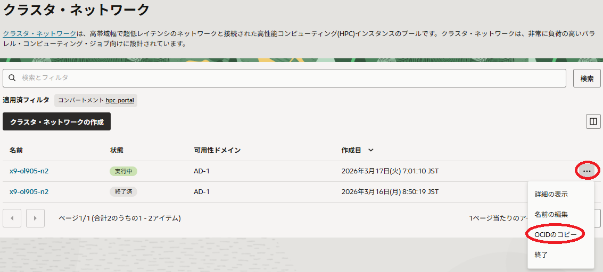

**注意 :** 本コンテンツ内の画面ショットは、現在の **OCI** コンソール画面と異なっている場合があります。

# 0. 概要

HPC/GPUクラスタを構築・運用する際、全ての計算/GPUノードに対して同じコマンドを実行したりジョブスケジューラに全てのノードを一括登録するといったOSレベルのオペレーションや、全ての計算/GPUノードに対して **[Oracle Cloud Agent](https://docs.oracle.com/ja-jp/iaas/Content/Compute/Tasks/manage-plugins.htm)** （以降 **OCA** と呼称）のプラグインを有効/無効化するといったOCIレベルのオペレーションを実施する場面が頻繁に発生します。

このようなオペレーションは、全ての計算/GPUノードのホスト名や **OCID** を1行に1ノード分記載した、以下のようなホストリストをテキストファイルで予め作成しておくことで、効率よく実施することが可能になります。

```sh
inst-hyqxm-comp
inst-ihmnl-comp
inst-hrsmf-comp
inst-afnzx-comp
```

例えば、以下のようにこのホスト名のホストリストを使用することで、全ての計算/GPUノードのOSバージョンを確認することが可能です。

```sh
$ for hname in `cat ./hostlist.txt`; do echo $hname; ssh -oStrictHostKeyChecking=accept-new $hname "grep -i pretty /etc/os-release"; done
inst-xrvfj-x9-ol905-n2
Warning: Permanently added 'inst-xrvfj-x9-ol905-n2' (ED25519) to the list of known hosts.
PRETTY_NAME="Oracle Linux Server 9.5"
inst-vyrts-x9-ol905-n2
Warning: Permanently added 'inst-vyrts-x9-ol905-n2' (ED25519) to the list of known hosts.
PRETTY_NAME="Oracle Linux Server 9.5"
$
```

また **[pdsh](https://github.com/chaos/pdsh)** をインストールしたクラスタ管理ノードであれば、このホスト名のホストリストを使用して上記と同じオペレーションを以下のように実施することが可能です。（※1）

```sh
$ pdsh -w ^/home/opc/hostlist.txt "grep -i pretty /etc/os-release" | dshbak -c
----------------
inst-vyrts-x9-ol905-n2,inst-xrvfj-x9-ol905-n2
----------------
PRETTY_NAME="Oracle Linux Server 9.5"
$
```

※1）この詳細は、 **[OCI HPCテクニカルTips集](../../#3-oci-hpcテクニカルtips集)** の **[pdshで効率的にクラスタ管理オペレーションを実行](../../tech-knowhow/cluster-with-pdsh/)** を参照して下さい。

またMPIプログラムを実行する際も、起動コマンド（ **mpirun** 等）への実行ノード指示（ **--hostfile** オプション）にこのホスト名のホストリストを使用することが出来ます。

また **OCID** のホストリストは、以下のように **OCA** のプラグインを一括で有効/無効化する際に使用することが出来ます。　　
ここでは、 **[クラスタ・ネットワーク](../../#5-1-クラスタネットワーク)** 対応シェイプのインスタンス作成時デフォルトの **OCA** プラグインの状態で、HPC関連の2個のプラグインのみを有効化しています。

```sh
$ cat update_agent_config.json 
{
  "pluginsConfig": [
    {
      "name": "Compute Instance Monitoring",
      "desiredState": "DISABLED"
    },
    {
      "name": "Custom Logs Monitoring",
      "desiredState": "DISABLED"
    },
    {
      "name": "Compute Instance Run Command",
      "desiredState": "DISABLED"
    },
    {
      "name": "Compute HPC RDMA Authentication",
      "desiredState": "ENABLED"
    },
    {
      "name": "Compute HPC RDMA Auto-Configuration",
      "desiredState": "ENABLED"
    }
  ]
}
$ for id in `cat ./ocid.txt`; do oci compute instance update --force --region ap-osaka-1 --instance-id $id --agent-config file://update_agent_config.json; done
:
$
```


このホスト名や **OCID** のホストリストは、以下のような方法で効率的に作成することが可能です。

1. **OCI** コンソールを使用する方法  
この方法は、 **OCI** コンソールの **インスタンス** 画面に表示される計算/GPUノードのインスタンス名や **OCID** を使用し、ホストリストを作成する方法です。  
この **インスタンス** 画面は、1ページに100インスタンスまでしか表示できないため、100ノードを超える場合は複数ページにわたってコピー・ペーストを行う必要があり、後述の **OCI CLI** を使用する方法が効率的にホストリストを作成できます。

2. **OCI CLI** を使用する方法  
この方法は、 **OCI CLI** の **[クラスタ・ネットワーク](../../#5-1-クラスタネットワーク)** に含まれるインスタンスをリストする機能を使用し、ホストリストを作成する方法です。  
**OCI CLI** は、これを利用可能にするための事前準備が必要なため、ノード数が少ないケースでは前述の **OCIコンソールを使用する方法** が手軽にホストリストを作成出来ます。

以上を踏まえて本テクニカルTipsは、 **[クラスタ・ネットワーク](../../#5-1-クラスタネットワーク)** から作成された計算/GPUノードのホスト名/ **OCID** からなるホストリストの効率的な作成方法を、 **OCI** コンソールと **OCI CLI** を使用する方法に分けて解説します。

なお、 **[OCI HPCチュートリアル集](../../#1-oci-hpcチュートリアル集)** の **[HPCクラスタを構築する(基礎インフラ自動構築編)](../../spinup-hpc-cluster-withterraform/)** や **[GPUクラスタを構築する(基礎インフラ自動構築編)](../../spinup-gpu-cluster-withterraform/)** にしたがってクラスタを構築する場合は、ホスト名のホストリストが **/home/opc/hostlist.txt** として作成されるため、改めて作成する必要はありません。

# 1. OCIコンソールを使用する方法

## 1.0 概要

本章は、 **OCI** コンソールを使用してホストリストを作成する方法を、ホスト名と **OCID** の場合に分けて解説します。

ホスト名と **OCID** に共通の手順として、以下を実施します。

**OCI** コンソールにログインし、HPC/GPUノードを作成した **リージョン** を選択後、 **コンピュート** → **インスタンス** とメニューを辿り、以下のインスタンス画面を表示します。



ここで、インスタンス画面がデフォルトで表示するインスタンス数は最大25のため、対象の **インスタンス** が全て表示されない場合は、以下画面の **1ページ当たりのアイテム数** プルダウンメニューを適切に設定します。



## 1-1. ホスト名のホストリストを作成

インスタンス画面の対象となる **インスタンス** の箇所を以下のように選択し、クリップボードにコピーします。  
この際、以下の赤枠の範囲を指定して選択するのがコツで、特に左上の頂点の位置によりこの範囲が狭いと、後のエクセルへの貼り付けの際に最上位のインスタンス位置がずれてしまうことがあります。



次に、エクセルで空白のシートを作成し、以下のようにクリップボードを貼り付けます。



次に、以下のようにホスト名が入力されたセルを選択してクリップボードに貼り付けます。



以上で、ホスト名のホストリストがクリップボードに格納されました。

## 1-2. OCIDのホストリストを作成

インスタンス画面の以下 **列の管理** ボタンをクリックし、



表示される以下 **列の管理** サイドバーで、 **名前** 以外のチェックボックスを全てクリックしてこれらを非表示に設定し、 **OCID** のチェックボックスをクリックしてこれを表示に設定し、 **変更の適用** ボタンをクリックします。



次に、インスタンス画面の対象となる **インスタンス** の箇所を以下のように選択し、クリップボードにコピーします。  
この際、以下の赤枠の範囲を指定して選択するのがコツで、特に左上の頂点の位置によりこの範囲が狭いと、後のエクセルへの貼り付けの際に最上位のインスタンス位置がずれてしまうことがあります。



次に、エクセルで空白のシートを作成し、以下のようにクリップボードを貼り付けます。



次に、以下のように **OCID** が入力されたセルを選択してクリップボードに貼り付けます。


ここで、クリップボードに張り付けられたデータは、以下のように先頭に **...** が挿入され、最後の行に空行が含まれるため、Linux環境であれば以下のコマンドでこれを修正します。

```
$ cat ocid_tmp.txt 
...ocid1.instance.oc1.eu-frankfurt-1.a...ehq
...ocid1.instance.oc1.eu-frankfurt-1.a...sda
...ocid1.instance.oc1.eu-frankfurt-1.a...p4a
...ocid1.instance.oc1.eu-frankfurt-1.a...3wq
...ocid1.instance.oc1.eu-frankfurt-1.a...tqq
...ocid1.instance.oc1.eu-frankfurt-1.a...4mkq
...ocid1.instance.oc1.eu-frankfurt-1.a...d3q

$ sed 's/^...//g' ocid_tmp.txt | grep -v "^$" > ocid.txt 
$ cat ocid.txt 
ocid1.instance.oc1.eu-frankfurt-1.a...ehq
ocid1.instance.oc1.eu-frankfurt-1.a...sda
ocid1.instance.oc1.eu-frankfurt-1.a...p4a
ocid1.instance.oc1.eu-frankfurt-1.a...3wq
ocid1.instance.oc1.eu-frankfurt-1.a...tqq
ocid1.instance.oc1.eu-frankfurt-1.a...4mkq
ocid1.instance.oc1.eu-frankfurt-1.a...d3q
$ 
```

# 2. OCI CLIを使用する方法

## 2.0 概要

本章は、 **OCI CLI** を使用してホストリストを作成する方法を、ホスト名と **OCID** の場合に分けて解説します。

ホスト名と **OCID** に共通の手順として、以下の **OCI** 公式マニュアルに従い **OCI CLI** をインストール・セットアップします。

**[https://docs.oracle.com/ja-jp/iaas/Content/API/SDKDocs/cliinstall.htm](https://docs.oracle.com/ja-jp/iaas/Content/API/SDKDocs/cliinstall.htm)**

ここで、作成するホストリストは通常HPC/GPUクラスタを管理する役割を担う管理ノードで使用するため、 **OCI CLI** のインストール・セットアップもこの管理ノードに対して実施します。

次に、 **OCI** コンソールにログインし、HPC/GPUノードを作成した **リージョン** を選択後、 **コンピュート** → **クラスタ・ネットワーク** とメニューを辿ります。

次に、表示される以下クラスタ・ネットワーク画面で、対象の **[クラスタ・ネットワーク](../../#5-1-クラスタネットワーク)** の **OCIDのコピー** メニューをクリックし、 **OCID** をクリップボードにコピーします。



## 2-1. ホスト名のホストリストを作成

以下コマンドを管理ノードの **OCI CLI** をセットアップしたユーザで実行し、ホスト名のホストリストを出力します。  
この際、 **region_name** は **クラスタ・ネットワーク** の存在する **リージョン** のリージョン識別子（ **ap-osaka-1** 等です。）に、 **cn_ocid** は先にクリップボードにコピーした **クラスタ・ネットワーク** の **OCID** に、 **comp_ocid** は **クラスタ・ネットワーク** の存在する **コンパートメント** の **OCID** に置き換えます。

```sh
$ oci compute-management cluster-network list-instances --all --region region_name --cluster-network-id cn_ocid -c comp_ocid | jq -r '.data[]."display-name"'
inst-bnncr-comp
inst-i14fp-comp
inst-at4ou-comp
inst-vlbsr-comp
inst-q6ev3-comp
inst-eimhh-comp
inst-u3cpa-comp
inst-lyelw-comp
$
```

## 2-2. OCIDのホストリストを作成

以下コマンドを管理ノードの **OCI CLI** をセットアップしたユーザで実行し、 **OCID** のホストリストを出力します。  
この際、 **region_name** は **クラスタ・ネットワーク** の存在する **リージョン** のリージョン識別子（ **ap-osaka-1** 等です。）に、 **cn_ocid** は先にクリップボードにコピーした **クラスタ・ネットワーク** の **OCID** に、 **comp_ocid** は **クラスタ・ネットワーク** の存在する **コンパートメント** の **OCID** に置き換えます。

```sh
$ oci compute-management cluster-network list-instances --all --region region_name --cluster-network-id cn_ocid -c comp_ocid | jq -r '.data[]."id"'
ocid1.instance.oc1.eu-frankfurt-1.a...ehq
ocid1.instance.oc1.eu-frankfurt-1.a...sda
ocid1.instance.oc1.eu-frankfurt-1.a...p4a
ocid1.instance.oc1.eu-frankfurt-1.a...3wq
ocid1.instance.oc1.eu-frankfurt-1.a...tqq
ocid1.instance.oc1.eu-frankfurt-1.a...4mkq
ocid1.instance.oc1.eu-frankfurt-1.a...d3q
$
```