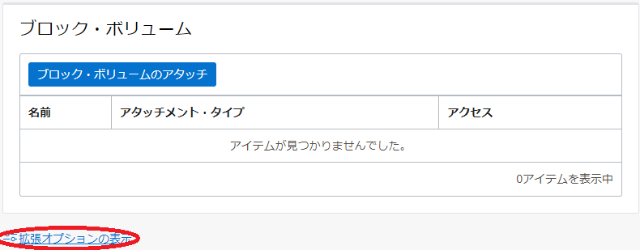
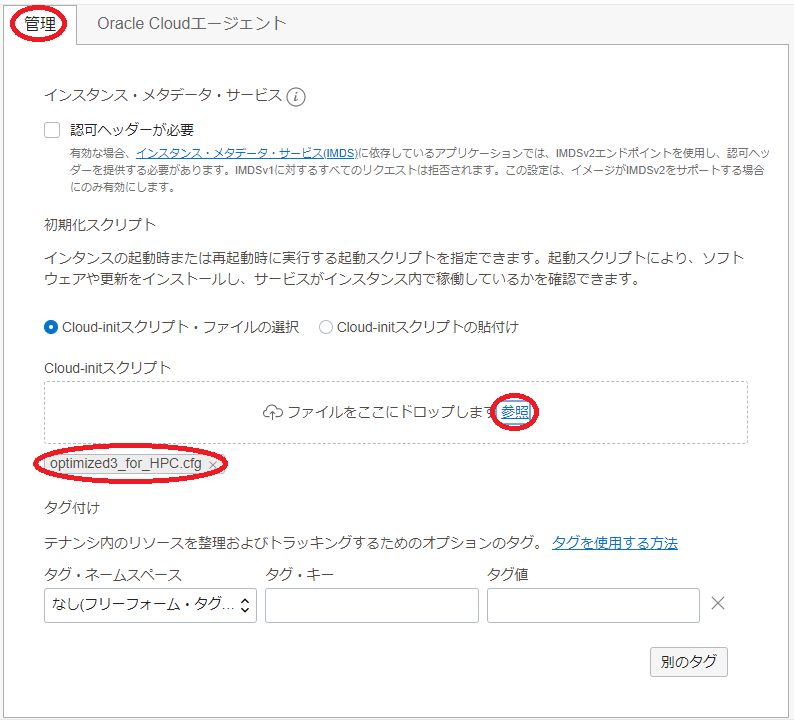
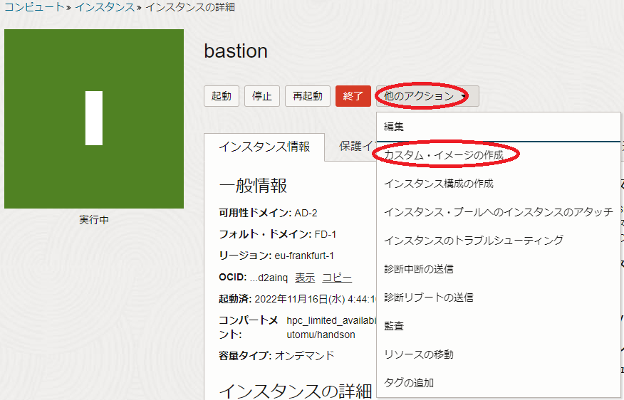
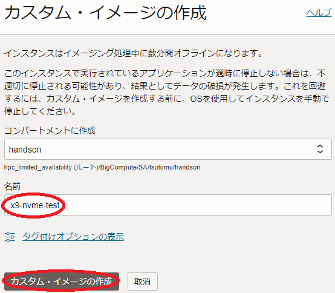
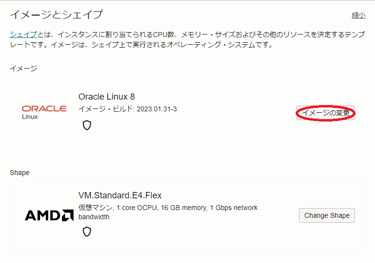
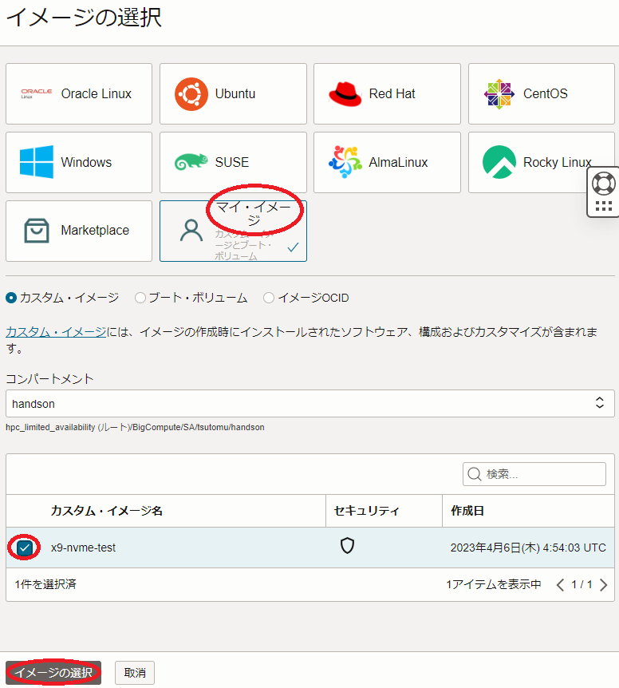

<style>
table, th, td {
    font-size: 80%;
}
</style>

**注意 :** 本コンテンツ内の画面ショットは、現在のOCIコンソール画面と異なっている場合があります。

# 0. 概要

HPC/GPUクラスタの計算/GPUノードは、ノード数が時には数百ノードになることもあり、これらのOSに自身の環境に合わせたカスタマイズを加える際、どのような手法を採用するのが最も効果的かという観点で考慮する必要があります。

これらのカスタマイズを加えるための代表的な選択肢は、以下が挙げられます。

- Ansible

  RedHat社が開発するオープンソースの構成管理ツールで、YAML形式で記述されたPlaybookの情報を元に、ターゲットノードの構成管理を管理ノードからSSHで実行します。  
  Playbookは、条件分岐や反復処理を記述することが可能で、cloud-initやカスタム・イメージと比較して複雑な構成管理処理を実現することが可能です。


- **[cloud-init](../../#5-11-cloud-init)**
- **[カスタム・イメージ](../../#5-6-カスタムイメージ)** 

下表は、これらの選択肢をいくつかの評価基準から比較しており、これらの特徴をふまえて自身のOSカスタマイズ要件にあった手法を選定します。

|              | Ansible | cloud-init | カスタム・イメージ | 備考                                                                                                           |
| ------------ | ------- | ---------- | --------- | ------------------------------------------------------------------------------------------------------------ |
| 難易度          | 高（※1）       | 中（※2）          | 低         | ※1） 管理ノード構築要<br>　　Playbook・インベントリファイル等構文習得要<br>※2） cloud-config構文習得要                            |
| カスタマイズ柔軟性   | 高（※3）       | 中（※4）          | 低（※5）         | ※3） 条件分岐や反復を使用した柔軟なカスタマイズ可<br>※4） 様々なモジュールを使用した柔軟なカスタマイズ可<br>※5） 作成時に適用されているカスタマイズに限定 |
| デプロイ時カスタマイズ | 必要      | 必要         | 不要（※6）        | ※6） カスタマイズ適用済のためデプロイ時間短縮可                                                                     |

以上を踏まえて次章以降は、 **cloud-init** と **カスタム・イメージ** を使用する計算/GPUノードのOSカスタマイズの手順を解説します。  
なおAnsibleは、オープンソースでインターネットから様々な情報を入手することが可能なため、ここでは解説しません。

# 1. cloud-initを使用したOSカスタマイズ

## 1-0. 概要

**[cloud-init](../../#5-11-cloud-init)** を使用した計算/GPUノードのOSカスタマイズは、以下の手順で実施します。

- **cloud-init** 設定ファイル（cloud-config）作成
- cloud-configを指定した **[インスタンス構成](../../#5-7-インスタンス構成)** 作成
- **インスタンス構成** を指定した **[クラスタ・ネットワーク](../../#5-1-クラスタネットワーク)** 作成
- **cloud-init** 完了確認

## 1-1. cloud-conifg作成

本章は、OSカスタマイズの内容に沿った **[cloud-init](../../#5-11-cloud-init)** 設定ファイル（cloud-config）を作成します。

以下は、 **[BM.Optimized3.36](https://docs.oracle.com/ja-jp/iaas/Content/Compute/References/computeshapes.htm#bm-hpc-optimized)** 向けに以下のカスタマイズを適用するためのcloud-config例で、OCIコンソールを実行している端末上にテキストファイルで保存します。

- タイムゾーンをJSTに変更
- NVMe SSDローカルディスク領域ファイルシステム作成
- firewalld停止

```sh
#cloud-config
#
# Change time zone to JST
timezone: Asia/Tokyo

runcmd:
#
# Mount NVMe local storage
  - vgcreate nvme /dev/nvme0n1
  - lvcreate -l 100%FREE nvme
  - mkfs.xfs -L localscratch /dev/nvme/lvol0
  - mkdir -p /mnt/localdisk
  - echo "LABEL=localscratch /mnt/localdisk/ xfs defaults,noatime 0 0" >> /etc/fstab
  - systemctl daemon-reload
  - mount /mnt/localdisk
#
# Stop firewalld
  - systemctl disable --now firewalld
```

## 1-2. インスタンス構成作成

本章は、先に作成したcloud-configを使用して **[インスタンス構成](../../#5-7-インスタンス構成)** を作成します。

**インスタンス構成** を作成する際のcloud-config指定は、OCIコンソールのインスタンス構成作成画面で以下 **拡張オプションの表示** ボタンを選択し、
   
   

表示される以下 **管理** フィールドで **cloud-initスクリプト** フィールドに作成したcloud-configを選択（ **参照** ボタンでファイルを選択）します。

   

## 1-3. クラスタ・ネットワーク作成

本章は、先に作成した **[インスタンス構成](../../#5-7-インスタンス構成)** を使用して **[クラスタ・ネットワーク](../../#5-1-クラスタネットワーク)** を作成します。

**クラスタ・ネットワーク** を作成する際の **インスタンス構成** 指定は、OCIコンソールの **クラスタ・ネットワーク** 作成画面で表示される以下 **[インスタンス・プール](../../#5-8-インスタンスプール) の構成** フィールドで、 **インスタンス構成** メニューに先に作成した **インスタンス構成** を選択します。

   

## 1-4. cloud-init完了確認

**[cloud-init](../../#5-11-cloud-init)** は、適用したインスタンスが起動してSSHログインできる状態であっても、その処理が継続している可能性があるため、以下コマンドを当該インスタンスのopcユーザで実行し、ステータスが **done** となっていることで **cloud-init** の処理完了を確認します。

ステータスが **running** の場合は、 **cloud-init** の処理が継続中のため、処理が完了するまで待ちます。

```sh
$ cloud-init status
status: done
$
```

# 2. カスタム・イメージを使用したOSカスタマイズ

## 2-0. 概要

**[カスタム・イメージ](../../#5-6-カスタムイメージ)** を使用した計算/GPUノードのOSカスタマイズは、以下の手順で実施します。

- **カスタム・イメージ** 作成用インスタンス起動
- **カスタマイズ** 適用
- **カスタム・イメージ** 使用時問題となる設定修正
- **カスタム・イメージ** 取得
- **カスタム・イメージ** を指定した **[インスタンス構成](../../#5-7-インスタンス構成)** 作成
- **インスタンス構成** を指定した **[クラスタ・ネットワーク](../../#5-1-クラスタネットワーク)** 作成

## 2-1. カスタム・イメージ作成用インスタンス起動・カスタマイズ適用

本章は、 **[カスタム・イメージ](../../#5-6-カスタムイメージ)** を作成するためのインスタンスを起動します。

通常 **カスタム・イメージ** を作成する場合、組み込むカスタマイズの内容が正しく動作しているかを確認する必要があるため、最終的に構築するHPC/GPUクラスタの規模のみを縮小した同一構成のものを使用します。  
例えば、16ノードのクラスタ構築に使用する **カスタムイメージ** であれば、同じシェイプとOSを使用した2ノードのクラスタをデプロイします。  
この手順は、 **[OCI HPCチュートリアル集](../../#1-oci-hpcチュートリアル集)** の **[HPCクラスタを構築する(基礎インフラ手動構築編)](../../spinup-cluster-network/)** や **[GPUクラスタを構築する(基礎インフラ手動構築編)](../../spinup-gpu-cluster/)** が参考になります。

このクラスタがデプロイ出来たら、必要なカスタマイズを適用してその動作を確認します。

## 2-2. カスタム・イメージ使用時問題となる設定修正

本章は、 **[カスタム・イメージ](../../#5-6-カスタムイメージ)** を使用してクラスタをデプロイする際に問題となる設定を、 **カスタム・イメージ** 取得前に除去します。

問題となる設定で代表的なものは、以下です。

- **[クラスタ・ネットワーク](../../#5-1-クラスタネットワーク)** 用ネットワークインターフェース設定  
**クラスタ・ネットワーク** のネットワークインターフェース設定は、 **カスタム・イメージ** 取得インスタンスの静的IPアドレスを含んでおり、そのまま **カスタム・イメージ** を取得すると、これを使用してデプロイしたインスタンスで全て同じIPアドレスが設定され、 **クラスタ・ネットワーク** に接続することが出来ません。  
このため、 **カスタム・イメージ** 取得前に **/etc/sysconfig/network-scripts** ディレクトリに存在する **クラスタ・ネットワーク** のネットワークインターフェース設定ファイル（ **ifcfg-ens800f0np0** や **ifcfg-rdma0** 等）を削除します。  
なおこの問題は、 **Oracle Linux** バージョン9では発生しないため、本修正を実施する必要はありません。

なお、 **カスタム・イメージ** によるクラスタデプロイ時にここで削除した設定を適用し直すには、 **クラスタ・ネットワーク** 用ネットワークインターフェース設定の場合は **Oracle Cloud Agent** を使用します。

## 2-3. カスタム・イメージ取得

本章は、 **[カスタム・イメージ](../../#5-6-カスタムイメージ)** 取得用インスタンスで **カスタム・イメージ** を取得します。

**カスタム・イメージ** の取得は、当該インスタンスの以下 **インスタンスの詳細** ページで **他のアクション** プルダウンメニューから **カスタム・イメージの作成** メニューを選択し、

   

表示される以下画面で **名前** フィールドに **カスタム・イメージ** に付与する名前を指定し、 **カスタム・イメージの作成** ボタンをクリックします。

   

なお、 **カスタム・イメージ** 取得中は、当該インスタンスが停止します。

## 2-4. インスタンス構成作成

本章は、先に作成した **[カスタム・イメージ](../../#5-6-カスタムイメージ)** を使用して **[インスタンス構成](../../#5-7-インスタンス構成)** を作成します。

**インスタンス構成** を作成する際の **カスタム・イメージ** 指定は、OCIコンソールの **インスタンス構成** 作成画面の以下 **イメージとシェイプ** フィールドで **イメージの変更** ボタンをクリックし、

   

表示される以下 **イメージの選択** サイドバーで **マイ・イメージ** を選択し表示される先に作成した **カスタム・イメージ** を選択し **イメージの選択** ボタンをクリックします。

   

## 2-5. クラスタ・ネットワーク作成

本章は、先に作成した **[インスタンス構成](../../#5-7-インスタンス構成)** を使用して **[クラスタ・ネットワーク](../../#5-1-クラスタネットワーク)** を作成します。

**クラスタ・ネットワーク** を作成する際の **インスタンス構成** 指定は、OCIコンソールの **クラスタ・ネットワーク** 作成画面で表示される以下 **[インスタンス・プール](../../#5-8-インスタンスプール) の構成** フィールドで、 **インスタンス構成** メニューに先に作成した **インスタンス構成** を選択します。

   
