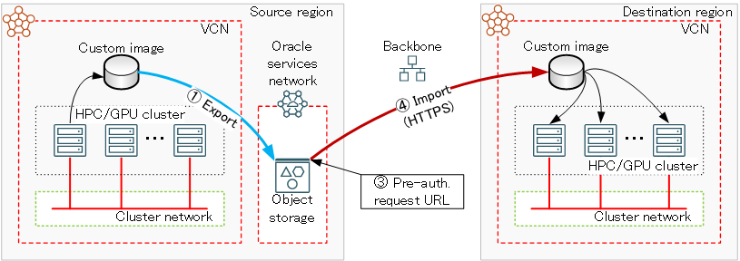

# 0. 概要

**[カスタム・イメージ](../../#5-6-カスタムイメージ)** は、HPC/GPUクラスタ構築には欠かせないサービスですが、HPC/機械学習ワークロード実行環境をリージョン間で移動・複製する必要がある場合にこれをコピーするためには、以下の一連の手順を実施する必要があります。

1. **[カスタム・イメージのオブジェクト・ストレージへのエクスポート](#1-カスタムイメージのオブジェクトストレージへのエクスポート)**
2. **[カスタム・イメージエクスポート結果確認](#2-カスタムイメージエクスポート結果確認)**
3. **[オブジェクト・ストレージ上のカスタム・イメージオブジェクトに事前承認済リクエスト作成](#3-オブジェクトストレージ上のカスタムイメージオブジェクトに事前承認済リクエスト作成)**
4. **[事前承認済リクエストURLを指定したカスタム・イメージのインポート](#4-事前承認済リクエストurlを指定したカスタムイメージのインポート)**
5. **[カスタム・イメージインポート結果確認](#5-カスタムイメージインポート結果確認)**



ここで手順 **1.** と **4.** は、その完了に数十分程度必要なことから、定期的に手順 **2.** と **5.** を実行して状態をチェックしながら進める必要があり、これらの手順をOCIコンソールのGUIから実行しようとすると、作業効率が良くありません。

これに対し **OCI CLI** は、前述の手順 **1.** や **3.** の状態チェックを含めてすべての手順をCLIで完結することで、シェルスクリプト化による自動化を含めてリージョン間の **カスタム・イメージ** コピーを効率的に実施することが可能です。

以上より本テクニカルTipsは、既に **OCI CLI** が利用可能な環境が用意されていることを前提に（※1）、前述の手順 **1.** ～ **5.** を実行するための **OCI CLI** コマンドの利用方法を解説します。

※1） **OCI CLI** 利用環境は、以下の公式マニュアルに従いインストール・セットアップします。

**[https://docs.oracle.com/ja-jp/iaas/Content/API/SDKDocs/cliinstall.htm](https://docs.oracle.com/ja-jp/iaas/Content/API/SDKDocs/cliinstall.htm)**

# 1. カスタム・イメージのオブジェクト・ストレージへのエクスポート

以下コマンドを **OCI CLI** 実行環境から実行し、コピー元の **[カスタム・イメージ](../../#5-6-カスタムイメージ)** をエクスポートします。

```sh
$ oci compute image export to-object --region region_name --bucket-name bucket_name --image-id customimg_ocid --name object_name --namespace os_namespace
```

ここで各オプションの指定値は、下表に従い自身の値に置き換えます。

|キーワード|指定値|例|
|:-:|:-:|:-:|
|region_name|エクスポートする **カスタム・イメージ** が存在する **リージョン** 名|ap-tokyo-1|
|bucket_name|エクスポートする **カスタム・イメージ** を収容する<br> **オブジェクト・ストレージ** バケット名|custom_image|
|customimg_ocid|エクスポートする **カスタム・イメージ** のOCID|ocid1.image.oc1.ap-tokyo-1.xxxx|
|object_name| **オブジェクト・ストレージ** にエクスポートする<br> **カスタム・イメージ** のオブジェクト名（※2）|ub24-ompi-omb|
|os_namespace| **オブジェクト・ストレージ・ネームスペース** 名（※3）|company_a|

※2）既に同名のオブジェクトが存在する場合、これを上書きします。  
※3）通常テナンシー名と同じです。

なおこのコマンドは、以下のJSON形式の結果を即座に返し、エクスポートが完了する前に終了します。

```sh
{
  "data": {
    "agent-features": null,
    "base-image-id": "ocid1.image.oc1.ap-tokyo-1.yyyy",
    "billable-size-in-gbs": null,
    "compartment-id": "ocid1.compartment.oc1..xxxx",
    "create-image-allowed": true,
    "defined-tags": {},
    "display-name": "ub24-ompi-omb",
    "freeform-tags": {},
    "id": "ocid1.image.oc1.ap-tokyo-1.xxxx",
    "launch-mode": "PARAVIRTUALIZED",
    "launch-options": {
      "boot-volume-type": "ISCSI",
      "firmware": "UEFI_64",
      "is-consistent-volume-naming-enabled": true,
      "is-pv-encryption-in-transit-enabled": false,
      "network-type": "PARAVIRTUALIZED",
      "remote-data-volume-type": "ISCSI"
    },
    "lifecycle-state": "EXPORTING",
    "listing-type": null,
    "operating-system": "Canonical Ubuntu",
    "operating-system-version": "24.04",
    "size-in-mbs": 204800,
    "time-created": "2025-09-24T08:16:37.978000+00:00"
  },
  "etag": "xxxx",
  "opc-work-request-id": "ocid1.coreservicesworkrequest.oc1.ap-tokyo-1.xxxx"
}
```

# 2. カスタム・イメージエクスポート結果確認

以下コマンドを **OCI CLI** 実行環境から実行し、エクスポートした **[カスタム・イメージ](../../#5-6-カスタムイメージ)** のオブジェクトが存在するかを以て、エクスポートの状態を確認します。  
これは、 **カスタム・イメージ** のエクスポートが完了するまで当該オブジェクトが作成されないことに基づいているため、エクスポート開始前に同名のオブジェクトが存在する場合は、これを削除しておきます。

```sh
$ oci os object list --region region_name --bucket-name bucket_name --query 'data[?name==`object_name`].name | [0]' --raw-output
```

ここで各オプションの指定値は、下表に従い自身の値に置き換えます。

|キーワード|指定値|例|
|:-:|:-:|:-:|
|region_name|エクスポートする **カスタム・イメージ** が存在する **リージョン** 名|ap-tokyo-1|
|bucket_name|エクスポートする **カスタム・イメージ** を収容する<br> **オブジェクト・ストレージ** バケット名|custom_image|
|object_name| **オブジェクト・ストレージ** にエクスポートする<br> **カスタム・イメージ** のオブジェクト名|ub24-ompi-omb|

エクスポートが実行中の場合は、以下のように標準エラー出力にエラーメッセージが出力され、

```sh
Query returned empty result, no output to show.
```

エクスポートが完了している場合は、以下のように標準出力にそのオブジェクト名が表示されます。

```sh
ub24-ompi-omb
```

# 3. オブジェクト・ストレージ上のカスタム・イメージオブジェクトに事前承認済リクエスト作成

以下コマンドを **OCI CLI** 実行環境から実行し、エクスポートした **[カスタム・イメージ](../../#5-6-カスタムイメージ)** のオブジェクトに対する **事前承認済リクエスト** を作成し、そのURLを取得します。  
ここでは、読み取り専用で有効期限が現時点から1日の **事前承認済リクエスト** を作成しています。

```sh
$ ext=`date -u -d '+1 day' '+%Y-%m-%d %H:%M'` oci os preauth-request create --region region_name --access-type ObjectRead --bucket-name bucket_name --name pauth_name --time-expires "${ext}" --object-name object_name | jq -r '.data."full-path"'
```

ここで各オプションの指定値は、下表に従い自身の値に置き換えます。

|キーワード|指定値|例|
|:-:|:-:|:-:|
|region_name|エクスポートする **カスタム・イメージ** が存在する **リージョン** 名|ap-tokyo-1|
|bucket_name|エクスポートする **カスタム・イメージ** を収容する<br> **オブジェクト・ストレージ** バケット名|custom_image|
|pauth_name| **事前承認済リクエスト** に付与する名称|object-ci|
|object_name| **オブジェクト・ストレージ** にエクスポートする<br> **カスタム・イメージ** のオブジェクト名|ub24-ompi-omb|

正常に **事前承認済リクエスト** が作成されると、以下のようにそのURLが表示されるので、これを後のインポートに備えて控えます。

```sh
https://company_a.objectstorage.ap-tokyo-1.oci.customer-oci.com/p/xxxx/n/company_a/b/custom_image/o/ub24-ompi-omb

```

# 4. 事前承認済リクエストURLを指定したカスタム・イメージのインポート

以下コマンドを **OCI CLI** 実行環境から実行し、 **[カスタム・イメージ](../../#5-6-カスタムイメージ)** をコピー先の **リージョン** にインポートし、そのOCIDを取得します。

```sh
$ oci compute image import from-object-uri --region region_name --compartment-id comp_ocid --uri preauth_url --display-name customimg_name | jq -r '.data.id'
```

ここで各オプションの指定値は、下表に従い自身の値に置き換えます。

|キーワード|指定値|例|
|:-:|:-:|:-:|
|region_name| **カスタム・イメージ** をインポートする **リージョン** 名|ap-osaka-1|
|comp_ocid| **カスタム・イメージ** をインポートする **コンパートメント** のOCID|ocid1.compartment.oc1..xxxx|
|preauth_url|先に作成した **事前承認済リクエスト** のURL|https://.../ub24-ompi-omb|
|customimg_name| インポートする **カスタム・イメージ** に付与する名称|ub24-ompi-omb|

このインポートコマンドは、インポートする **カスタム・イメージ** のOCIDを以下のように標準出力に出力するので、これを後のインポート結果確認に備えて控えます。

```sh
ocid1.image.oc1.ap-osaka-1.xxxx
```

# 5. カスタム・イメージインポート結果確認

以下コマンドを **OCI CLI** 実行環境から実行し、インポートした **[カスタム・イメージ](../../#5-6-カスタムイメージ)** の状態を取得することで、インポートの状態を確認します。

```sh
$ oci compute image get --region region_name --image-id customimg_ocid --query 'data."lifecycle-state"' --raw-output
```

ここで各オプションの指定値は、下表に従い自身の値に置き換えます。

|キーワード|指定値|例|
|:-:|:-:|:-:|
|region_name|エクスポートする **カスタム・イメージ** が存在する **リージョン** 名|ap-tokyo-1|
|customimg_ocid| インポートしている **カスタム・イメージ** のOCID|ocid1.image.oc1.ap-osaka-1.xxxx|

このコマンドは、インポート中の場合 **IMPORTING** と出力し、インポートが完了している場合は **AVAILABLE** と出力します。