# 0. 概要

オープンソースのCFDソフトウェアである **[OpenFOAM](https://www.openfoam.com/)** は、プリ処理・解析処理・ポスト処理の全てのCFD解析フローを様々なオープンソースのソフトウェア群と連携して実行することが可能で、自身の解析用途に合わせた最適な流体解析シミュレーションを無償のソフトウェアで完結することが可能です。  
この際、外部のソフトウェアと連携して **OpenFOAM** を利用するためには、ビルド時にこれを意識した構築手順を踏む必要があります。

本テクニカルTipsは、以下の外部ソフトウェアと連係動作する **OpenFOAM** 実行環境を構築します。

- **[PETSc](https://www.mcs.anl.gov/petsc/)**  
偏微分方程式で記述された問題をMPIで並列計算するための数値計算ライブラリ
- **[FFTW](http://www.fftw.org/)**  
高速フーリエ変換ライブラリ
- **[ParaView](http://www.paraview.org/)**  
計算結果の可視化ツール
- **[VTK](https://vtk.org/)**  
**ParaView** がモデルの描画を行う際に使用する可視化ツールキット
- **[ParaView Catalyst](https://www.paraview.org/insitu/)**  
**ParaView** でin-situシミュレーションを行うためのツールキット
- **[MESA](https://www.mesa3d.org/)**  
**ParaView** でOff-screenレンダリングを行うためのグラフィックライブラリ
- **[METIS](https://github.com/KarypisLab/METIS)**  
メッシュを並列計算用に領域分割するツール
- **[SCOTCH](https://www.labri.fr/perso/pelegrin/scotch/)**  
メッシュを並列計算用に領域分割するツール
- **[KaHIP ](https://kahip.github.io/)**  
メッシュを並列計算用に領域分割するツール
- **[CGAL](https://www.cgal.org/)**  
幾何形状を取り扱うライブラリー
- **[ADIOS2](https://github.com/ornladios/ADIOS2)**  
大規模データを効率よく可視化・解析するためのフレームワーク

また本テクニカルTipsは、 **OpenFOAM** に同梱されるチュートリアルを使用し、構築した環境でプリ処理・解析処理・ポスト処理のCFD解析フローを実行する手順を解説します。  
この際、 **OpenFOAM** が提供するツール・ソルバーによるプリ・解析処理を **[クラスタ・ネットワーク](../../#5-1-クラスタネットワーク)** 対応のベアメタルシェイプ **[BM.Optimized3.36](https://docs.oracle.com/ja-jp/iaas/Content/Compute/References/computeshapes.htm#bm-hpc-optimized)** で作成する計算ノードで、 **ParaView** によるポスト処理を **[VM.Standard.E5.Flex](https://docs.oracle.com/ja-jp/iaas/Content/Compute/References/computeshapes.htm#flexible)** で作成するフロントエンド用途のBastionノードで実行し、解析処理がノード内に収まるワークロードを想定する計算ノード1ノードの小規模構成と、複数ノードに跨るワークロードを想定する **[クラスタ・ネットワーク](../../#5-1-クラスタネットワーク)** で接続された2ノード以上の計算ノードを持つ大規模構成から選択し、自身のワークロードに合わせて環境を構築します。  
また計算ノードで実行するプリ処理と解析処理は、インタラクティブ実行と **[Slurm](https://slurm.schedmd.com/)** 環境でのバッチ実行を念頭に置いて、以下4パターンを解説します。

- 非並列実行（小規模構成・大規模構成の何れでも可能）
- ノード内並列実行（小規模構成・大規模構成の何れでも可能）
- ノード間並列実行（大規模構成で可能）
- ノード間並列実行でローカルディスクを活用（※1）（大規模構成で可能）

※1） **BM.Optimized3.36** が内蔵するNVMe SSDローカルディスクをデータ領域として使用する方法で、他のファイル共有ストレージを使用する方法と比較して、高並列実行の場合や計算結果の出力頻度が高い場合にスケーラビリティを改善出来る場合があります。

構築する環境は、以下の環境を前提とします。

- 計算ノード
    - シェイプ ： **BM.Optimized3.36**
    - イメージ： **Oracle Linux** 9.05ベースのHPC **[クラスタネットワーキングイメージ](../../#5-13-クラスタネットワーキングイメージ)** （※2）
    - NVMe SSDローカルディスクマウントポイント ： **/mnt/localdisk** （※3）
- Bastionノード
    - シェイプ ： **VM.Standard.E5.Flex**
    - イメージ： **Oracle Linux** 9.05ベースのHPC **[クラスタネットワーキングイメージ](../../#5-13-クラスタネットワーキングイメージ)** （※2）
- ファイル共有ストレージ ： **ブロック・ボリューム** NFSサーバ / **ファイル・ストレージ** （※4）でBastionノードと全計算ノードのCFD解析ユーザのホームディレクトリをNFSでファイル共有
- **OpenFOAM** ： v2512
- **ParaView** ： 6.0.1

※2）**[OCI HPCテクニカルTips集](../../#3-oci-hpcテクニカルtips集)** の **[クラスタネットワーキングイメージの選び方](../../tech-knowhow/osimage-for-cluster/)** の **[1. クラスタネットワーキングイメージ一覧](../../tech-knowhow/osimage-for-cluster/#1-クラスタネットワーキングイメージ一覧)** のイメージ **No.13** です。  
※3）このファイルシステム作成方法は、 **[OCI HPCテクニカルTips集](../../#3-oci-hpcテクニカルtips集)** の **[ベアメタルインスタンスのNVMe SSDローカルディスク領域ファイルシステム作成方法](../../tech-knowhow/nvme-filesystem/)** を参照してください。また、CFD解析ユーザをオーナーとするディレクトリ **/mnt/localdisk/openfoam** が全ての計算ノードで予め作成されているものとします。  
※4）詳細は、 **[OCI HPCテクニカルTips集](../../#3-oci-hpcテクニカルtips集)** の **[HPC/GPUクラスタ向けファイル共有ストレージの最適な構築手法](../../tech-knowhow/howto-configure-sharedstorage/)** を参照してください。  

なお、ポスト処理に使用するX11ベースの **ParaView** は、これが動作するBastionノードでGNOMEデスクトップとVNCサーバを起動し、VNCクライアントをインストールした自身の端末からVNC接続して操作します。

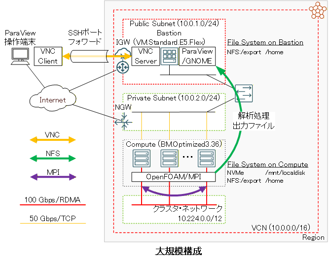

以降では、以下の順に **OpenFOAM** のインストール・利用方法を解説します。

1. **[HPCクラスタ構築](#1-hpcクラスタ構築)**
2. **[OpenFOAMインストール](#2-openfoamインストール)**
3. **[VNC接続環境構築](#3-vnc接続環境構築)**
4. **[CFD解析フロー実行](#4-cfd解析フロー実行)**

# 1. HPCクラスタ構築

本章は、本テクニカルTipsで使用するHPCクラスタを構築します。

この構築は、 **[OCI HPCチュートリアル集](../../#1-oci-hpcチュートリアル集)** の **[HPCクラスタを構築する(基礎インフラ手動構築編)](../../spinup-cluster-network/)** の手順に従う等で実施します。  
なお小規模構成の場合は、 **[クラスタ・ネットワーク](../../#5-1-クラスタネットワーク)** の代わりに単一の計算ノードを作成します。

この際、計算ノードとBastionノードを以下のように構成します。

- 計算ノード **ブート・ボリューム** サイズ ： 100GB以上（インストールするソフトウェアの容量確保のため）
- Bastionノード **ブート・ボリューム** サイズ ： 100GB以上（インストールするソフトウェアの容量確保のため）
- 計算ノードSMT : 無効（※5）

※5）SMTを無効化する方法は、 **[OCI HPCパフォーマンス関連情報](../../#2-oci-hpcパフォーマンス関連情報)** の **[パフォーマンスに関連するベアメタルインスタンスのBIOS設定方法](../../benchmark/bios-setting/)** を参照してください。

なお、バッチ実行の場合の **Slurm** 環境は、 **[OCI HPCテクニカルTips集](../../#3-oci-hpcテクニカルtips集)** の **[Slurmによるリソース管理・ジョブ管理システム構築方法](../../tech-knowhow/setup-slurm-cluster/)** に従って構築されたものとし、このテクニカルTipsの **[2. 環境構築](../../tech-knowhow/setup-slurm-cluster/#2-環境構築)** の計算ノードに対する手順を実施することで、計算ノードを **Slurm** 環境に登録します。

# 2. OpenFOAMインストール

## 2-0. 概要

本章は、 **OpenFOAM** のインストールを以下の順に実施します。

1. **[OpenMPIインストール](#2-1-openmpiインストール)**
2. **[インストール事前準備](#2-2-インストール事前準備)**
3. **[PETScインストール](#2-3-petscインストール)**
4. **[VTKインストール](#2-4-vtkインストール)**
5. **[ParaViewインストール](#2-5-paraviewインストール)**
6. **[OpenFOAMインストール](#2-6-openfoamインストール)**

これらの手順は、Bastionノードと全ての計算ノードで実施します。  
なお、バッチ実行の場合の **Slurm** 環境に於けるSlurmクライアントも、これらの手順を実施します。

## 2-1. OpenMPIインストール

**[OpenMPI](https://www.open-mpi.org/)** のインストールは、 **[OCI HPCテクニカルTips集](../../#3-oci-hpcテクニカルtips集)** の **[Slurm環境での利用を前提とするUCX通信フレームワークベースのOpenMPI構築方法](../../tech-knowhow/build-openmpi/)** の **[1. インストール・セットアップ](../../tech-knowhow/build-openmpi/#1-インストールセットアップ)** の手順に従い実施します。

## 2-2. インストール事前準備

以下コマンドをopcユーザで実行し、前提RPMパッケージをインストールします。

```sh
$ sudo yum-config-manager --enable ol9_codeready_builder
$ sudo dnf install -y blas blas-devel lapack lapack-devel fftw qt5 qt5-qtbase-devel qt5-qttools-devel qt5-qtsvg-devel gmp-c++ gmp-devel mpfr-devel mesa-libGL-devel libXcursor-devel
```

次に、以下コマンドをrootユーザで実行し、 **OpenFOAM** と外部ツールをダウンロード・展開します。

```sh
$ mkdir /opt/OpenFOAM && cd /opt/OpenFOAM
$ wget https://dl.openfoam.com/source/v2512/OpenFOAM-v2512.tgz && tar --no-same-owner -xvf ./OpenFOAM-v2512.tgz
$ wget https://dl.openfoam.com/source/v2512/ThirdParty-v2512.tar.gz && tar --no-same-owner -xvf ./ThirdParty-v2512.tar.gz
$ module load openmpi
$ source /opt/OpenFOAM/OpenFOAM-v2512/etc/bashrc
$ cd $WM_THIRD_PARTY_DIR
$ mkdir sources/metis && wget -P sources/metis https://github.com/xijunke/METIS-1/raw/master/metis-5.1.0.tar.gz && tar -C sources/metis -xvf sources/metis/metis-5.1.0.tar.gz
$ mkdir sources/petsc && wget -P sources/petsc https://web.cels.anl.gov/projects/petsc/download/release-snapshots/petsc-lite-3.24.3.tar.gz && tar -C sources/petsc -xvf sources/petsc/petsc-lite-3.24.3.tar.gz
$ mkdir sources/vtk && wget -P sources/vtk https://www.vtk.org/files/release/9.5/VTK-9.5.2.tar.gz && tar -C sources/vtk -xvf sources/vtk/VTK-9.5.2.tar.gz
```

次に、以下コマンドをrootユーザで実行し、 **OpenFOAM** インストールの事前チェックを実行、その結果を確認します。

```sh
$ foamSystemCheck

Checking basic system...
-------------------------------------------------------------------------------
Shell:       bash
Host:        frend
OS:          Linux version 5.14.0-503.40.1.el9_5.x86_64

System check: PASS
==================
Can continue to OpenFOAM installation.

$
```

## 2-3. PETScインストール

以下コマンドをrootユーザで実行し、 **PETSc** をインストールします。  
この際、以下コマンド出力で正しくインストールされたことを確認します。

```sh
$ sed -i 's/petsc-3.21.2/petsc-3.24.3/g' $WM_PROJECT_DIR/etc/config.sh/petsc
$ wmRefresh
$ ./makePETSC | tee ./makePETSC.log
    :
    :
    :
Installed: petsc-3.24.3   <--- この出力
$
```

## 2-4. VTKインストール

以下コマンドをrootユーザで実行し、 **VTK** をインストールします。  
この際、以下コマンド出力で正しくインストールされたことを確認します。

```sh
$ ./makeVTK -mpi -DVTK_USE_MPI=ON -DVTK_MODULE_ENABLE_VTK_ParallelMPI=YES -DVTK_USE_RENDERING=YES -DVTK_MODULE_ENABLE_VTK_RenderingParallel=YES -DVTK_MODULE_ENABLE_VTK_RenderingParallel:STRING=YES -DVTK_MODULE_ENABLE_VTK_RenderingExternal:STRING=YES -mesa-include /usr/include/GL -mesa-lib /usr/lib64/libGLX_mesa.so.0 9.5.2 | tee ./makeVTK.log
    :
    :
    :
Installation complete for vtk-9.5.2 as   <--- この出力
    VTK_DIR=/opt/OpenFOAM/ThirdParty-v2512/platforms/linux64Gcc/VTK-9.5.2
====

Done
$
```

## 2-5. ParaViewインストール

以下コマンドをrootユーザで実行し、 **ParaView** をインストールします。  
この際、以下コマンド出力で正しくインストールされたことを確認します。  
本手順は、 **BM.Optimized3.36** で10分程度を要します。

```sh
$ export PATH=/usr/lib64/qt5/bin:$PATH
$ ./makeParaView -qt -mpi -python3 | tee ./makeParaView.log
    :
    :
    :
====
Installation complete for paraview-6.0.1 with qt-5.15.9   <--- この出力
    ParaView_DIR=/opt/OpenFOAM/ThirdParty-v2512/platforms/linux64Gcc/ParaView-6.0.1

You may need to update the OpenFOAM environment by running:
    wmRefresh
====

Done
$
```

## 2-6. OpenFOAMインストール

以下コマンドをrootユーザで実行し、 **OpenFOAM** をインストールします。  
この際、最後に実行するコマンドの出力を注意深く確認し、 **[0. 概要](#0-概要)** にリストアップされている外部ツールが **OpenFOAM** に組み込まれたことを確認します。なおこのコマンド出力は、カレントディレクトリにファイル名 **log.linux64GccDPInt32Opt** としても出力されます。  
本手順は、 **BM.Optimized3.36** で30分程度を要します。

```sh
$ export VTK_DIR=$WM_THIRD_PARTY_DIR/platforms/linux64Gcc/VTK-9.5.2
$ export ParaView_DIR=$WM_THIRD_PARTY_DIR/platforms/linux64Gcc/ParaView-6.0.1
$ cd $WM_PROJECT_DIR && ./Allwmake -j -s -q -l
```

次に、以下コマンドをrootユーザで実行し、 **OpenFOAM** のインストールをテストします。

```sh
$ foamInstallationTest
    :
    :
    :
Summary
-------------------------------------------------------------------------------
Base configuration ok.
Critical systems ok.

Done

$
```

# 3. VNC接続環境構築

本章は、BastionノードとParaView操作端末で以下の作業を実施し、ParaView操作端末からBastionノードにVNC接続します。

1. GNOMEデスクトップインストール・セットアップ（Bastionノード）
2. VNCサーバインストール・セットアップ（Bastionノード）
3. SSHポートフォワードセッション確立（ParaView操作端末）
4. VNC接続（ParaView操作端末）

本テクニカルTipsは、VNCサーバに **[TigerVNC](https://tigervnc.org/)** 、VNCクライアントにWindowsで動作する **[UltraVNC](https://uvnc.com/)** を使用します。

以下コマンドをBastionノードのopcユーザで実行し、GNOMEデスクトップをインストール・セットアップし、OS再起動でこれを有効化します。  
本手順は、再起動が完了してログインできるまでに30分程度を要します。

```sh
$ sudo dnf groupinstall -y "Server with GUI"
$ sudo systemctl set-default graphical
$ sudo sed -i 's/^#WaylandEnable=false/WaylandEnable=false/g' /etc/gdm/custom.conf
$ sudo shutdown -r now
```

次に、以下コマンドをBastionノードのopcユーザで実行し、 **TigerVNC** をインストールします。  

```sh
$ sudo dnf install -y tigervnc-server tigervnc-server-module
```

次に、以下コマンドをBastionノードのopcユーザで実行し、 **TigerVNC** にユーザを登録します。  
このユーザは、VNC接続時に使用するユーザであり、CFD解析ユーザでもあります。  
ここでは、 **usera** を1番で登録しており、このユーザをOSのユーザとして予め登録しインターネット経由でSSHログインできるようにしておきます。

```sh
$ echo :1=usera | sudo tee -a /etc/tigervnc/vncserver.users
```

次に、以下コマンドをBastionノードのopcユーザで実行し、VNC接続時の解像度を設定します。  

```sh
$ echo geometry=1280x1024 | sudo tee -a /etc/tigervnc/vncserver-config-defaults
```

次に、Bastionノードの **TigerVNC** のsystemd設定ファイルを以下のように修正し、 **[Service]** セクションに設定を追加します。  

```sh
$ diff /usr/lib/systemd/system/vncserver@.service_org /usr/lib/systemd/system/vncserver@.service
41a42
> Restart=on-success
$
```

次に、以下コマンドをBastionノードのopcユーザで実行し、 **TigerVNC** を起動します。  
なお、systemdサービスを起動する際のサービス名に含まれる番号は、先に作成したVNC接続ユーザ登録時に指定した番号に一致させます。この番号をユーザ登録時の番号に合わせることで、複数のVNCユーザ向けのサービスを起動することが可能です。

```sh
$ sudo systemctl daemon-reload
$ sudo systemctl enable --now vncserver@:1.service
```

次に、以下コマンドをParaView操作端末で実行し、ParaView操作端末の5901番ポートからBastionノードの5901番ポートにインターネット経由でSSHポートフォワードセッションを確立、その後このユーザのVNC接続パスワードを設定します。  
なおこのポート番号の1桁目は、先に登録したVNCユーザの番号に一致します。（例：2番のユーザ用ポート番号は、5902番です。）

```sh
$ ssh -L 5901:localhost:5901 usera@xxx.yyy.zzz.www
$ vncpasswd 
Password:   <--- VNC接続に使用するパスワードを入力
Verify:   <--- VNC接続に使用するパスワードを再入力
Would you like to enter a view-only password (y/n)? n   <--- "n" を入力
A view-only password is not used
$
```

次に、以下のようにParaView操作端末でVNCクライアントを起動し、接続先に **localhost:5901** を指定して接続します。

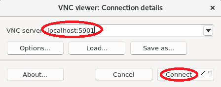

次に、以下画面で先の手順 **3.** で設定したVNC接続用パスワードを入力してログインを完了すると、

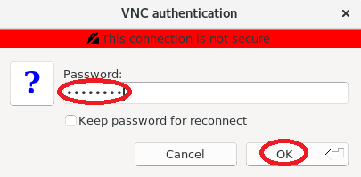

以下画面のようにGNOMEデスクトップへのログインが完了します。


次に、以下GNOMEデスクトップ画面で、GNOMEの設定画面を表示するボタンをクリックします。

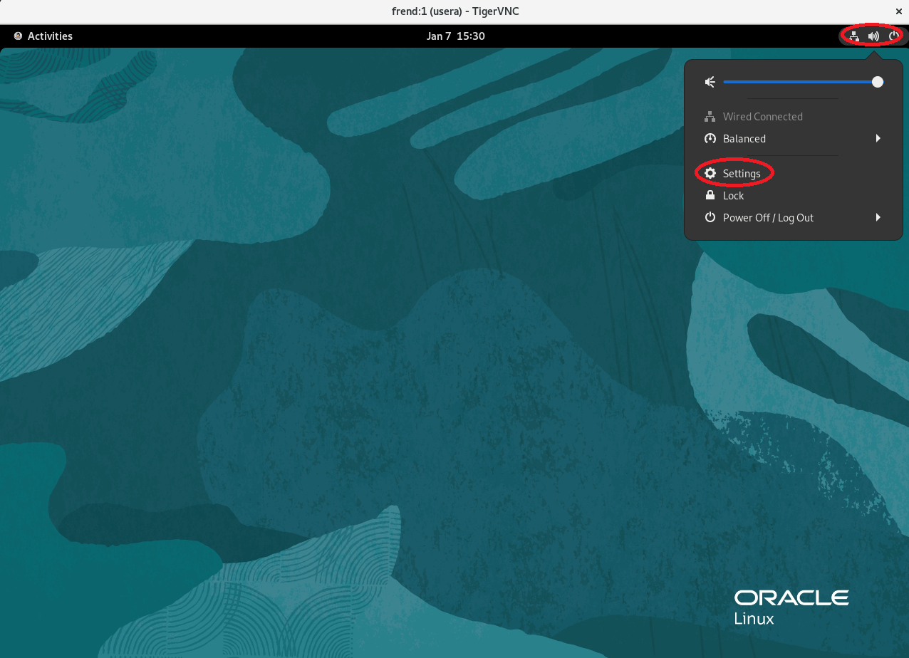

次に、表示される以下GNOME設定画面で、 **Privacy** メニューをクリックします。

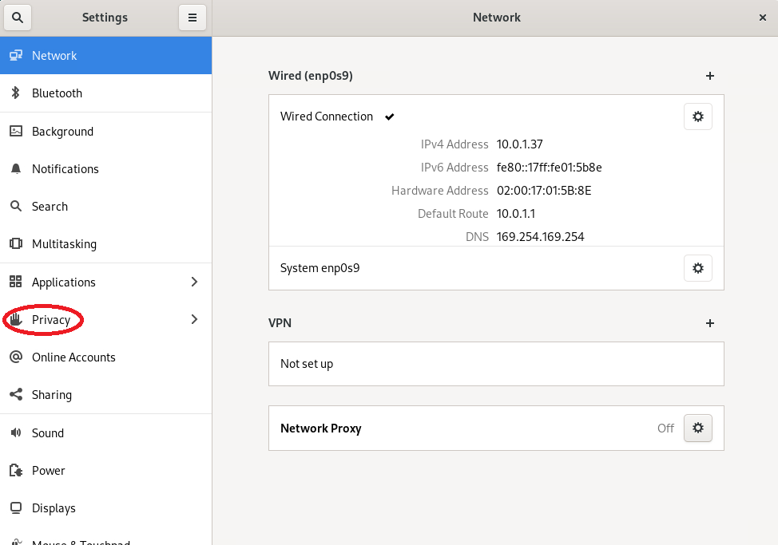

次に、表示される以下GNOME設定画面で、 **Screen Lock** メニューをクリックします。

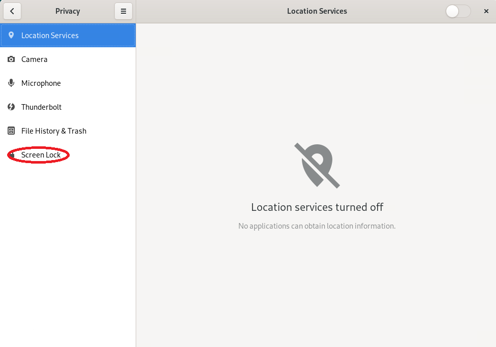

次に、表示される以下GNOME設定画面で、 **Automatic Screen Lock** を **OFF** に設定します。

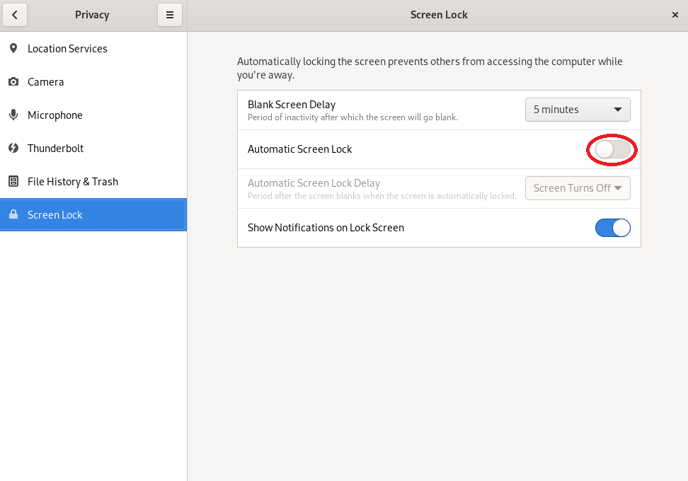

この設定は、GNOMEデスクトップのログインに使用するユーザがパスワード認証を無効にしている場合、スクリーンロックがかかった際ロックを解除出来なくなることを防止します。

# 4. CFD解析フロー実行

## 4-0. 概要

本章は、 **OpenFOAM** に同梱されるチュートリアルのうちバックステップ乱流シミュレーション（**incompressible/simpleFoam/pitzDaily**）とオートバイ走行時乱流シミュレーション（**incompressible/simpleFoam/motorBike**）を使用し、計算ノードでプリ処理・解析処理を、Bastionノードでポスト処理を実行します。  
この際計算ノードで実施するプリ処理・解析処理は、計算ノードにログインしてインタラクティブに実行する方法と、 **Slurm** 環境でバッチジョブとして実行する方法に分けて解説します。

本章の作業は、CFD解析ユーザで実施します。

## 4-1. 事前準備

本章は、インタラクティブ・バッチの何れの実行方法にも共通する事前準備を行います。

Bastionノードを経由して計算ノードのうちの1ノード（バッチジョブの場合はSlurmクライアント）にCFD解析ユーザでSSHログインします。

次に、以下コマンドを実行して **OpenMPI** と **OpenFOAM** の環境設定を読み込みます。

```sh
$ module load openmpi
$ source /opt/OpenFOAM/OpenFOAM-v2512/etc/bashrc
```

次に、以下コマンドを実行して **OpenFOAM** に同梱されているチュートリアルのうち **pitzDaily** と **motorBike** のディレクトリを作業ディレクトリにコピーします。

```sh
$ mkdir -p $FOAM_RUN
$ run
$ cp -pR $FOAM_TUTORIALS/incompressible/simpleFoam/pitzDaily .
$ cp -pR $FOAM_TUTORIALS/incompressible/simpleFoam/motorBike .
```

次に、バッチ実行の際に使用する、ヘッドノードとその他ノードのNVMe SSDローカルディスクのデータを同期させるスクリプト **rsync_inneed.sh** を以下の内容で作成し、

```sh
#!/bin/bash
head_node=`echo $1 | cut -d, -f 1`
child_lst=`echo $1 | cut -d, -f 2-`
my_hostname=`hostname`
proc_pernode=$2
cur_mpirank=$2
for node in `echo $child_lst | sed 's/,/ /g'`
do
  if [ $node == $my_hostname ]
  then
    sta_mpirank=$cur_mpirank
    end_mpirank=$(expr $cur_mpirank + $proc_pernode - 1)
    break
  else
    cur_mpirank=$(expr $cur_mpirank + $proc_pernode)
  fi
done
incl_opt="--include=\"/*\""
for mpirank in `seq $sta_mpirank $end_mpirank`
do
  incl_opt=$incl_opt" --include=\"processor"$mpirank"/**\""
done
rsync_cmd="rsync -au -e \"ssh -o StrictHostKeyChecking=no\" $incl_opt --exclude=\"*\" $3 $head_node:$3"
eval $rsync_cmd
```

これを以下のディレクトリに配置して実行権を付与します。

```sh
$ run
$ chmod 755 rsync_inneed.sh
$ ls -l rsync_inneed.sh
-rwxr-xr-x 1 usera usera 653 Jan  8 18:33 rsync_inneed.sh
$
```

## 4-2. プリ処理・解析処理のインタラクティブ実行

### 4-2-0. 概要

本章は、 **[4-1. 事前準備](#4-1-事前準備)** を行った計算ノードでインタラクティブにプリ処理・解析処理を実行します。  
この際の解析処理は、以下3種類の方法を解説します。

1. **[1コアを使用する非並列実行](#4-2-1-1コアを使用する非並列実行)**
2. **[1ノード32コアを使用するノード内並列実行](#4-2-2-1ノード32コアを使用するノード内並列実行)**
3. **[4ノード128コアを使用するノード間並列実行](#4-2-3-4ノード128コアを使用するノード間並列実行)**

本章のインタラクティブ実行は、バックステップ乱流シミュレーション（**incompressible/simpleFoam/pitzDaily**）を使用して解説します。

### 4-2-1. 1コアを使用する非並列実行

以下コマンドを実行し、メッシュを生成するプリ処理を実行します。

```sh
$ run
$ cd ./pitzDaily
$ blockMesh
```

次に、以下コマンドを実行して解析処理を実行します。

```sh
$ simpleFoam
```

### 4-2-2. 1ノード32コアを使用するノード内並列実行

以下コマンドを実行し、プリ処理のうちメッシュの生成を実行します。

```sh
$ run
$ cd ./pitzDaily
$ blockMesh
```

次に、以下コマンドを実行してメッシュの領域分割方法を指示するファイルを他のチュートリアルからコピーします。

```sh
$ cp $FOAM_TUTORIALS/incompressible/simpleFoam/pitzDailyExptInlet/system/decomposeParDict ./system/
```

次に、コピーしたファイルを以下のように修正します。

```sh
$ diff system/decomposeParDict_org system/decomposeParDict
17c17
< numberOfSubdomains 4;
---
> numberOfSubdomains 32;
23c23
<     n           (2 2 1);
---
>     n           (8 4 1);
$
```

次に、先に生成したメッシュを32個の領域に分割してプリ処理を完了します。

```sh
$ decomposePar
    :
    :
    :
Processor 31: field transfer

End

$
```

次に、以下コマンドを実行して **BM.Optimized3.36** に搭載する32コアを使用するノード内並列の解析処理を実行します。

```sh
$ mpirun -n 32 simpleFoam -parallel
```

次に、以下コマンドを実行して各プロセスが作成した解析結果を統合します。

```sh
$ reconstructPar
```

### 4-2-3. 4ノード128コアを使用するノード間並列実行

以下コマンドを実行し、プリ処理を実行します。

```sh
$ run
$ cd ./pitzDaily
$ blockMesh
```

次に、以下コマンドを実行してメッシュの領域分割方法を指示するファイルを他のチュートリアルからコピーします。

```sh
$ cp $FOAM_TUTORIALS/incompressible/simpleFoam/pitzDailyExptInlet/system/decomposeParDict ./system/
```

次に、コピーしたファイルを以下のように修正して先に生成したメッシュを128個の領域に分割します。

```sh
$ diff system/decomposeParDict_org system/decomposeParDict
17c17
< numberOfSubdomains 4;
---
> numberOfSubdomains 128;
23c23
<     n           (2 2 1);
---
>     n           (16 8 1);
$ decomposePar
    :
    :
    :
Processor 127: field transfer

End

$
```

次に、以下コマンドを実行して4ノードの **BM.Optimized3.36** に搭載する128コアを使用するノード間並列の解析処理を実行します。

```sh
$ mpirun -n 128 -N 32 -hostfile ~/hostlist.txt -x UCX_NET_DEVICES=mlx5_2:1 bash -c "module load openmpi; source /opt/OpenFOAM/OpenFOAM-v2512/etc/bashrc; simpleFoam -parallel"
```

次に、以下コマンドを実行して計算結果を統合します。

```sh
$ reconstructPar
```

## 4-3. プリ処理・解析処理のバッチ実行

### 4-3-0. 概要

本章は、 **OpenFOAM** にチュートリアルとして付属しているバックステップ乱流シミュレーション（**incompressible/simpleFoam/pitzDaily**）とオートバイ走行時乱流シミュレーション（**incompressible/simpleFoam/motorBike**）を使用し、これらをバッチジョブとして実行する手順を解説します。  
この際、並列化に対応している解析ステップは、 **BM.Optimized3.36** の4ノード128コアを使用するノード間並列で実行し、NVMe SSDローカルディスクをストレージ領域に活用します。

これらの処理は、共有ストレージとNMVe SSDローカルディスクの間でrsyncを使用してデータを同期しながら以下のステップで実行し、ストレージ領域へのアクセスに高速なNMVe SSDローカルディスクを極力使用するよう配慮します。

1. ヘッドノードで "共有ストレージ -> NVMe SSDローカルディスク" 方向のデータ同期
2. ヘッドノードのNVMe SSDローカルディスク上でプリ処理
3. "ヘッドノードのNVMe SSDローカルディスク -> その他ノードのNVMe SSDローカルディスク" 方向のデータ同期（※7）
4. 各ノードのNVMe SSDローカルディスクを使用して並列実行で解析処理
5. "その他ノードのNVMe SSDローカルディスク -> ヘッドノードのNVMe SSDローカルディスク" 方向のデータ同期（※7）（※8）
6. ヘッドノードのNVMe SSDローカルディスク上で解析結果統合処理
7. ヘッドノードで "NVMe SSDローカルディスク -> 共有ストレージ" 方向のデータ同期（※9）

※7）この同期は、その他ノードのノード数（本テクニカルTipsでは3ノード）分だけ同時に実行することで、所要時間の短縮を図ります。  
※8）この同期は、128個のMPIプロセスが解析結果を格納する **processorxx** ディレクトリとその配下のファイルのうち、当該ノード上で計算されたもののみ同期させるため、事前に用意したスクリプト **rsync_inneed.sh** を使用します。  
※9）この同期は、128個のMPIプロセスが解析結果を格納する **processorxx** ディレクトリとその配下のファイルを除外し、ポスト処理に必要なファイルだけを同期することで、所要時間を短縮します。

このように、ストレージ領域にNVMe SSDローカルディスクを活用することで、共有ストレージ（ **ファイル・ストレージ** サービスを使用した場合）のみを使用する場合と比較して、特に大規模並列実行のケースやシミュレーション結果の書き込み頻度が高いケースで、シミュレーション所要時間を短縮することが可能になります。

なお、ヘッドノードとその他ノードのNVMe SSDローカルディスクのデータ同期をその他ノードのノード数分だけ同時実行する際 **[pdsh](https://github.com/chaos/pdsh)** を使用するため、 **[OCI HPCテクニカルTips集](../../#3-oci-hpcテクニカルtips集)** の **[pdshで効率的にクラスタ管理オペレーションを実行](../../tech-knowhow/cluster-with-pdsh/)** の **[1. pdshインストール・セットアップ](../../tech-knowhow/cluster-with-pdsh/#1-pdshインストールセットアップ)** の手順を実施し、予め全ての計算ノードに **pdsh** をインストール・セットアップします。

### 4-3.1. バックステップ乱流シミュレーションのバッチ実行

以降の手順は、Slurmクライアントで実行します。

以下コマンドを実行し、メッシュの領域分割方法を指示するファイルを他のチュートリアルからコピーします。

```sh
$ run
$ cd ./pitzDaily
$ cp $FOAM_TUTORIALS/incompressible/simpleFoam/pitzDailyExptInlet/system/decomposeParDict ./system/
```

次に、コピーしたファイルを以下のように修正します。

```sh
$ diff system/decomposeParDict_org system/decomposeParDict
17c17
< numberOfSubdomains 4;
---
> numberOfSubdomains 128;
23c23
<     n           (2 2 1);
---
>     n           (16 8 1);
24a25,101
> 
> distributed  yes;
> roots
>     127
>     (
>        "/mnt/localdisk/openfoam"
>        "/mnt/localdisk/openfoam"
    :
    :  127行続きます
    :
>        "/mnt/localdisk/openfoam"
>     );
$
```

次に、以下のジョブスクリプトをファイル名 **submit_pitzDaily.sbatch** で作成します。

```sh
#!/bin/bash
#SBATCH -p sltest
#SBATCH -n 128
#SBATCH -N 4
#SBATCH --ntasks-per-node=32
#SBATCH -J pitzDaily
#SBATCH -o pitzDaily_out.%J
#SBATCH -e pitzDaily_err.%J

# Change the following variables according to your environment
model_dir="pitzDaily"
local_disk="/mnt/localdisk/openfoam"

# Set file/directroy variables
shared_dir=$FOAM_RUN/$model_dir/
local_dir=$local_disk/$model_dir/
rsync_script=$FOAM_RUN"/rsync_inneed.sh" 

# Set OCI specific environment variables
export UCX_NET_DEVICES=mlx5_2:1

# Get job infomation
head_node=`hostname`
proc_pernode=$(expr $SLURM_NTASKS / $SLURM_JOB_NUM_NODES)
child_node_list=`echo $SLURM_JOB_NODELIST | cut -d, -f 2-`

# Copy model files from shared storage to NVMe local disk on head node
rsync -a --delete $shared_dir $local_dir

# Pre-process on head node NVMe local disk
cd $local_dir
blockMesh
decomposePar

# Concurrently sync model files on head node NVMe local disk with others
pdsh_cmd="PDSH_SSH_ARGS_APPEND=\"-o StrictHostKeyChecking=no\" pdsh -w $child_node_list 'rsync -a --delete -e \"ssh -o StrictHostKeyChecking=no\" $head_node:$local_dir $local_dir'"
eval $pdsh_cmd

# Run solver in parallel
srun --cpu-bind=verbose,cores simpleFoam -parallel

# Concurrently sync model files on other node NVMe local disk with head node's
pdsh_cmd="PDSH_SSH_ARGS_APPEND=\"-o StrictHostKeyChecking=no\" pdsh -w $child_node_list '$rsync_script $SLURM_JOB_NODELIST $proc_pernode $local_dir'"
eval $pdsh_cmd

# Reconstruct decomposed partitions on head node NVMe local disk
reconstructPar

# Sync model files necessary for post process on head node NVMe local disk with shared storage
rsync -a --delete --exclude='processor*/' $local_dir $shared_dir
```

次に、以下コマンドを実行し、バッチジョブを投入します。

```sh
$ sbatch submit_pitzDaily.sbatch
```

ジョブの標準出力・標準エラー出力は、ジョブを投入したディレクトリにファイル名 **pitzDaily_out.xxx** と **pitzDaily_err.xxx** で出力されます。

### 4-3.2. オートバイ走行時乱流シミュレーションのバッチ実行

以降の手順は、Slurmクライアントで実行します。

以下コマンドを実行し、メッシュの領域分割方法を指示するファイルを他のチュートリアルからコピーします。

```sh
$ run
$ cd ./motorBike
$ cp $FOAM_TUTORIALS/incompressible/simpleFoam/pitzDailyExptInlet/system/decomposeParDict ./system/decomposeParDict_nvme.128
```

次に、コピーしたファイルを以下のように修正します。

```sh
$ diff system/decomposeParDict_nvme.128_org system/decomposeParDict_nvme.128
17c17
< numberOfSubdomains 4;
---
> numberOfSubdomains 128;
23c23
<     n           (2 2 1);
---
>     n           (16 8 1);
24a25,101
> 
> distributed  yes;
> roots
>     127
>     (
>        "/mnt/localdisk/openfoam"
>        "/mnt/localdisk/openfoam"
    :
    :  127行続きます
    :
>        "/mnt/localdisk/openfoam"
>     );
$
```

次に、以下のジョブスクリプトをファイル名 **submit_motorBike.sbatch** で作成します。

```sh
#!/bin/bash
#SBATCH -p sltest
#SBATCH -n 128
#SBATCH -N 4
#SBATCH --ntasks-per-node=32
#SBATCH -J motorBike
#SBATCH -o motorBike_out.%J
#SBATCH -e motorBike_err.%J
 
# Change the following variables according to your environment
model_dir="motorBike"
local_disk="/mnt/localdisk/openfoam"

# Set file/directroy variables
shared_dir=$FOAM_RUN/$model_dir/
local_dir=$local_disk/$model_dir/
decompDict="-decomposeParDict system/decomposeParDict_nvme.128"
rsync_script=$FOAM_RUN"/rsync_inneed.sh" 

# Set OCI specific environment variables
export UCX_NET_DEVICES=mlx5_2:1
 
# Read tutorial run functions
. ${WM_PROJECT_DIR:?}/bin/tools/RunFunctions

# Get job infomation
head_node=`hostname`
proc_pernode=$(expr $SLURM_NTASKS / $SLURM_JOB_NUM_NODES)
child_node_list=`echo $SLURM_JOB_NODELIST | cut -d, -f 2-`

# Copy motorbike surface from resources directory to shared storage
cd $shared_dir
mkdir -p constant/triSurface && cp -f "$FOAM_TUTORIALS"/resources/geometry/motorBike.obj.gz constant/triSurface/

# Copy model files from shared storage to NVMe local disk on head node
rsync -a --delete $shared_dir $local_dir

# Pre-process on head node NVMe local disk
cd $local_dir
runApplication surfaceFeatureExtract
runApplication blockMesh
runApplication $decompDict decomposePar

# Concurrently sync model files on head node NVMe local disk with others
pdsh_cmd="pdsh -w $child_node_list 'rsync -a --delete $head_node:$local_dir $local_dir'"
eval $pdsh_cmd

# Pre-process stage 2 in parallel
srun --cpu-bind=verbose,cores snappyHexMesh -parallel $decompDict -overwrite
srun --cpu-bind=verbose,cores topoSet -parallel $decompDict
srun -n $SLURM_JOB_NUM_NODES --ntasks-per-node=1 bash -c ". ${WM_PROJECT_DIR:?}/bin/tools/RunFunctions; restore0Dir -processor"
srun --cpu-bind=verbose,cores patchSummary -parallel $decompDict
srun --cpu-bind=verbose,cores potentialFoam -parallel $decompDict -writephi
srun --cpu-bind=verbose,cores checkMesh -parallel $decompDict -writeFields '(nonOrthoAngle)' -constant

# Run solver in parallel
srun --cpu-bind=verbose,cores simpleFoam -parallel $decompDict

# Concurrently sync model files on other node NVMe local disk with head node's
pdsh_cmd="pdsh -w $child_node_list '$rsync_script $SLURM_JOB_NODELIST $proc_pernode $local_dir'"
eval $pdsh_cmd

# Reconstruct decomposed partitions on head node NVMe local disk
runApplication reconstructParMesh -constant
runApplication reconstructPar

# Sync model files necessary for post process on head node NVMe local disk with shared storage
rsync -a --delete --exclude='processor*/' $local_dir $shared_dir
```

次に、以下コマンドを実行し、バッチジョブを投入します。

```sh
$ sbatch submit_motorBike.sbatch
```

ジョブの標準出力・標準エラー出力は、ジョブを投入したディレクトリにファイル名 **motorBike_out.xxx** と **motorBike_err.xxx** で出力されます。

## 4-4. ポスト処理

本章は、ポスト処理をBastionノードで実行します。  
ここでは、バックステップ乱流シミュレーションの結果を使用し、ポスト処理の手順を解説します。

先にBastionノードにVNC接続したGNOMEデスクトップ画面で、以下のメニューを辿り、

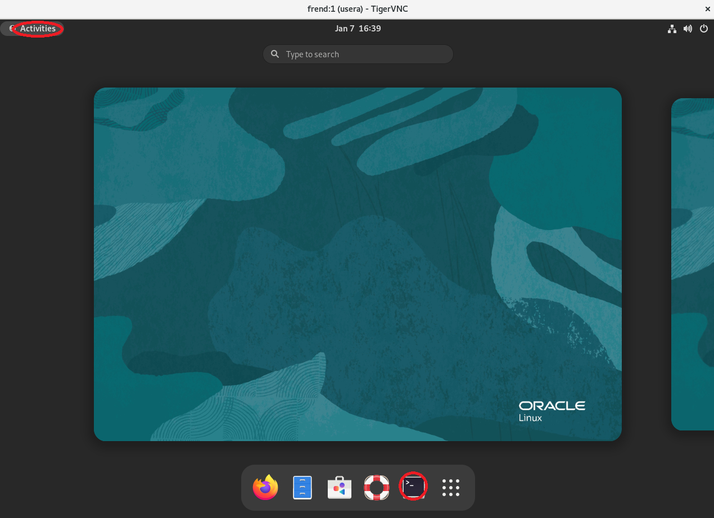

以下のようターミナルを開きます。

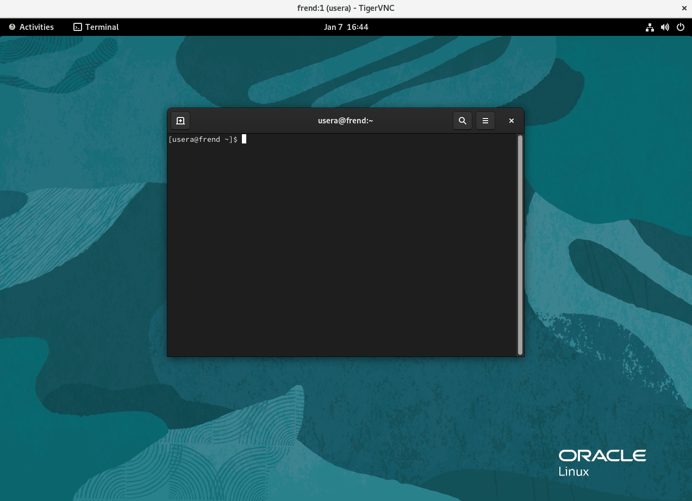

次に、開いたターミナルで以下コマンドを実行し、 **ParaView** を起動します。

```sh
$ module load openmpi
$ source /opt/OpenFOAM/OpenFOAM-v2512/etc/bashrc
$ run
$ cd ./pitzDaily 
$ touch para.foam
$ paraview
```

次に、以下 **ParaView** 画面で、 **Open** ボタンをクリックします。

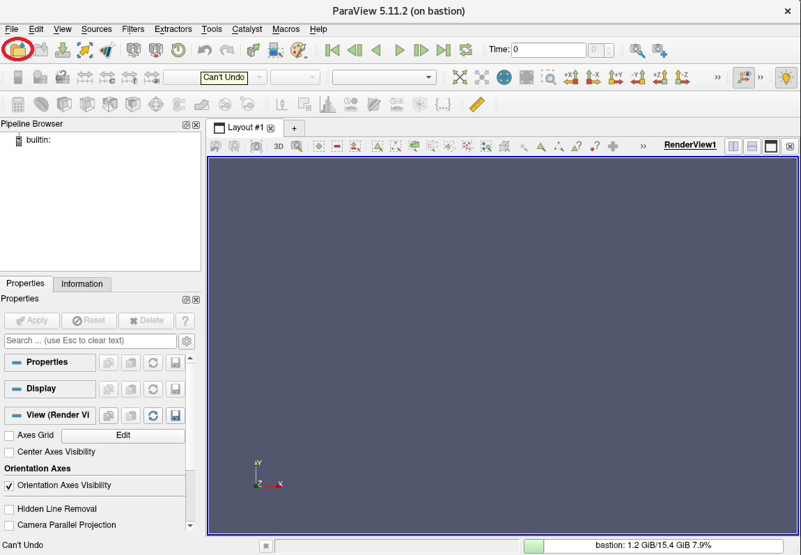

次に、以下 **Open File** 画面で、先に作成したファイル（ **para.foam** ）を選択し、 **OK** ボタンをクリックします。


次に、以下 **ParaView** 画面で、 **Apply** ボタンをクリックします。

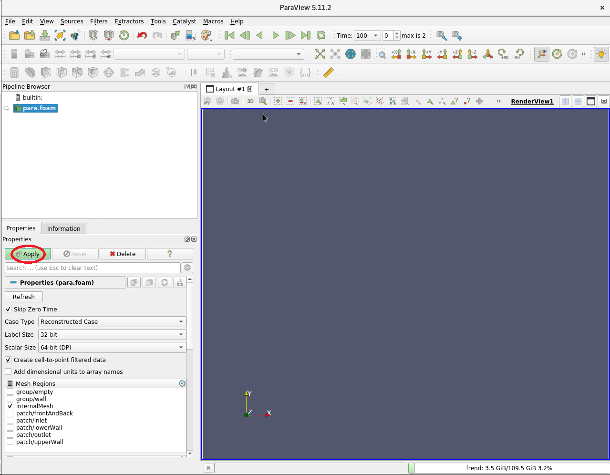

次に、以下 **ParaView** 画面で、メニューから速度を選択します。

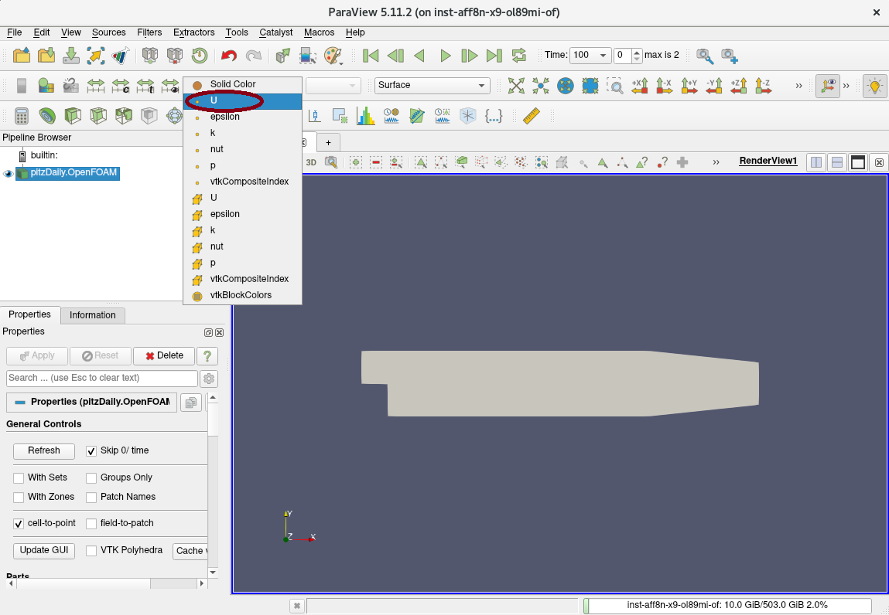

次に、以下 **ParaView** 画面で、再生ボタンをクリックしてシミュレーション結果を再生します。

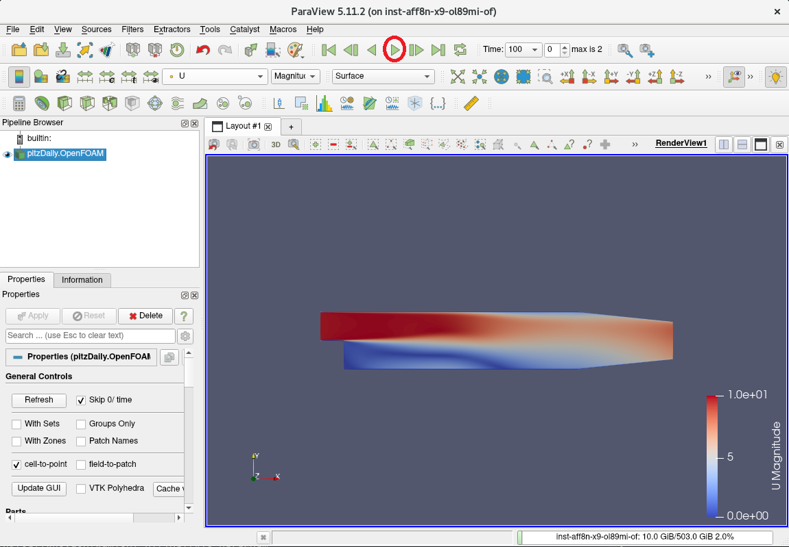

次に、以下 **ParaView** 画面で、シミュレーション時間が進むことを確認します。

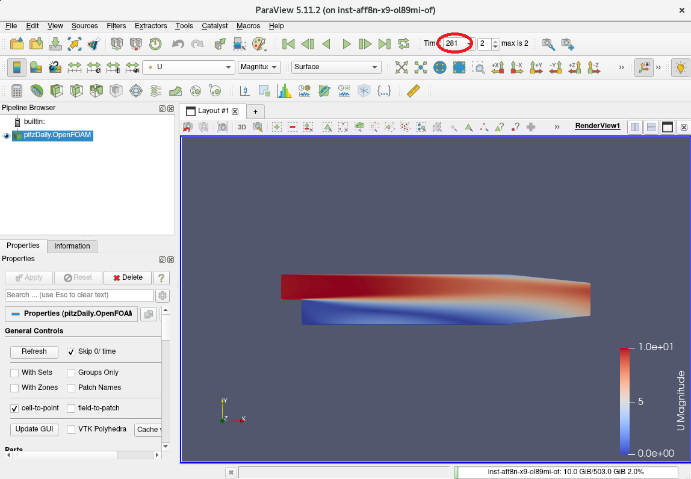