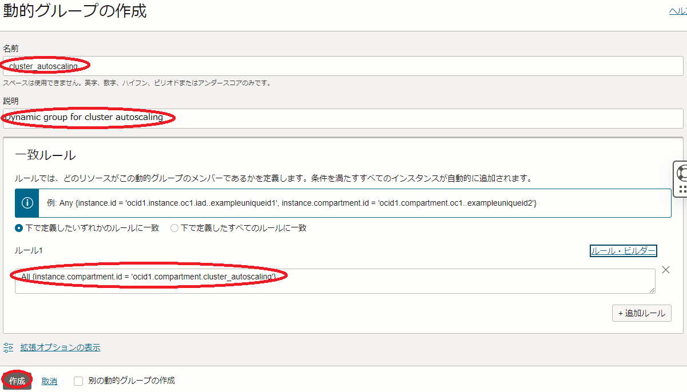
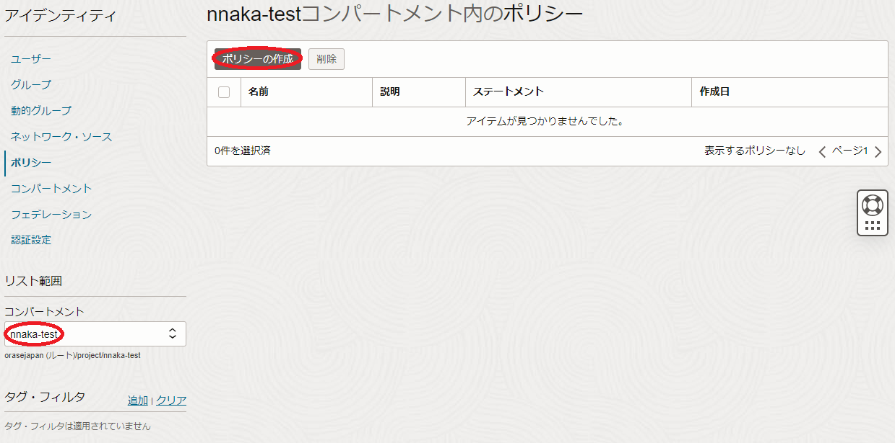
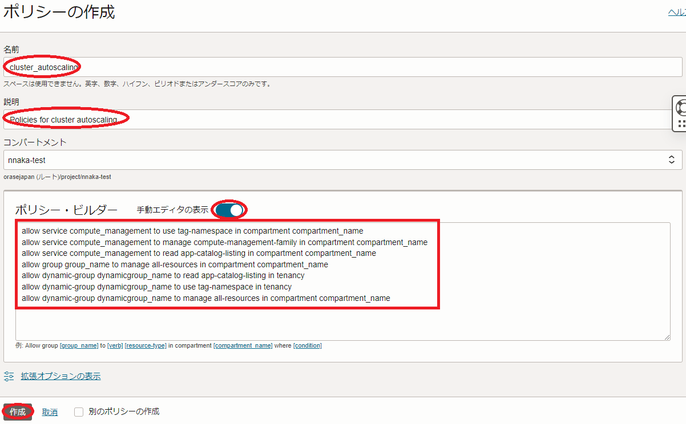

**注意 :** 本コンテンツ内の画面ショットは、現在のOCIコンソール画面と異なっている場合があります。

***
# 0. 概要

HPC/GPUクラスタを動的に作成・終了させるソフトウェア（以降"オンデマンドクラスタ管理ソフトウェア"と呼称）でオンデマンドクラスタを実現する場合、動的に管理するOCIサービス（ **[クラスタ・ネットワーク](../../#5-1-クラスタネットワーク)** やインスタンス）に対する **IAM** 認証・認可をオンデマンドクラスタ管理ソフトウェアに付与する必要がありますが、オンデマンドクラスタ管理ソフトウェアが動作するインスタンス（以降"クラスタ管理ノード"と呼称）を **[インスタンス・プリンシパル](../../#5-15-インスタンスプリンシパル)** 認証に組み込むことで、これを実現することが可能です。  
具体的には、以下の手順を実行します。

- クラスタ管理ノードを含む **[動的グループ](../../#5-16-動的グループ)** を作成
- 作成した **動的グループ** に対する **IAMポリシー** を作成

オンデマンドクラスタ管理ソフトウェアは、 **[Terraform](../../#5-12-terraform)** CLIや **OCI CLI** からこの **インスタンス・プリンシパル** 認証を利用し、HPC/GPUクラスタのライフサイクル管理を行います。

なお、この **インスタンス・プリンシパル** 認証を利用するオンデマンドクラスタを実現する手法は、 **[OCI HPCチュートリアル集](../../#1-oci-hpcチュートリアル集)** の **[HPCクラスタを構築する(オンデマンドクラスタ自動構築編)](../../spinup-hpc-cluster-withautoscaling)** や **[GPUクラスタを構築する(オンデマンドクラスタ自動構築編)](../../spinup-gpu-cluster-withautoscaling/)** でも使われています。

またこの **インスタンス・プリンシパル** 認証は、ベア・メタル・インスタンスNFSサーバのファイル共有ストレージに格納するファイルを **オブジェクト・ストレージ** にバックアップするバックアップサーバを構築する（※1）際にも使用し、バックアップサーバで動作する **[Rclone](https://rclone.org/)** が **オブジェクト・ストレージ** にアクセスする際のIAM認証・認可を付与します。  
なお、このユースケースで本テクニカルTipsを使用する場合は、クラスタ管理ノードと呼称している箇所をバックアップサーバと読みかえて下さい。

※1）この構築手法は、 **[OCI HPCチュートリアル集](../../#1-oci-hpcチュートリアル集)** の **[ベア・メタル・インスタンスNFSサーバ向けバックアップサーバを構築する](../../spinup-backup-server)** を参照してください。

以降では、上記に沿った具体的な **インスタンス・プリンシパル** 認証の設定手順と、オンデマンドクラスタ管理ソフトウェアからの利用を想定した **Terraform** CLIと **OCI CLI** でこの **インスタンス・プリンシパル** 認証を利用する方法を解説します。

***
# 1. インスタンス・プリンシパル認証設定

## 1-0. 概要

本章は、以下のステップでクラスタ管理ノードを **[インスタンス・プリンシパル](../../#5-15-インスタンスプリンシパル)** 認証に組み込みます。

- **[動的グループ](../../#5-16-動的グループ)** 作成
- IAMポリシー作成

## 1-1. 動的グループ作成

OCIコンソールにログインし、 **アイデンティティとセキュリティ** → **ドメイン** とメニューを辿ります。

次に、表示される以下 **xxxx（ルート）コンパートメント内のドメイン** 画面で、 **インスタンス・プリンシパル** 認証を設定する **アイデンティティ・ドメイン** を選択します。（複数の **アイデンティティ・ドメイン** を運用していなければ、通常"Default"です。）


次に、表示される画面左側の **動的グループ** メニューを選択します。

次に、表示される以下 **Defaultドメイン内の動的グループ** 画面で、 **動的グループの作成** ボタンをクリックします。  


次に、表示される以下 **動的グループの作成** 画面で、各フィールドに以下の情報を入力し **作成** ボタンをクリックします。  
なお、ここに記載のないフィールドは、デフォルトのままとします。

- **名前** ： **動的グループ** に付与する名前
- **説明** ： **動的グループ** に付与する説明
- **ルール1** ： **動的グループ** に含めるクラスタ管理ノード用インスタンスが存在するコンパートメントのOCIDを指定する以下構文

    ```sh
    Any {instance.compartment.id = 'compartment_ocid'}
    ```



## 1-2. IAMポリシー作成

OCIコンソールにログインし、 **アイデンティティとセキュリティ** → **ポリシー** とメニューを辿ります。

次に、表示される以下 **xxxxコンパートメント内のポリシー** 画面で、 **ポリシーの作成** ボタンをクリックします。  
この際、 **コンパートメント** プルダウンメニューがクラスタ管理ノード用インスタンスの存在する **コンパートメント** と異なる場合は、これを修正します。



次に、表示される以下 **ポリシーの作成** 画面で、各フィールドに以下の情報を入力し **作成** ボタンをクリックします。  
なお、ここに記載のないフィールドは、デフォルトのままとします。

- **名前** ： **IAMポリシー** に付与する名前
- **説明** ： **IAMポリシー** に付与する説明（用途等）
- **ポリシー・ビルダー** ： 作成する **IAMポリシー** を指定する以下構文（ **手動エディタの表示** ボタンをクリックして表示）

    ```sh
    allow service compute_management to use tag-namespace in compartment compartment_name
    allow service compute_management to manage compute-management-family in compartment compartment_name
    allow service compute_management to read app-catalog-listing in compartment compartment_name
    allow group group_name to manage all-resources in compartment compartment_name
    allow dynamic-group dynamicgroup_name to read app-catalog-listing in tenancy
    allow dynamic-group dynamicgroup_name to use tag-namespace in tenancy
    allow dynamic-group dynamicgroup_name to manage all-resources in compartment compartment_name
    ```
    ※1）1-4行目と7行目の **コンパートメント** 名は、自身のものに置き換えます。  
    ※2）4行目の **グループ** 名は、自身のものに置き換えます。  
    ※3）5-7行目の **動的グループ** 名は、先に作成したものに置き換えます。  
    ※4）最初の4行のポリシーは、  **[クラスタ・ネットワーク](../../#5-1-クラスタネットワーク)** を伴うリソースを  **[Terraform](../../#5-12-terraform)** CLIから利用する場合に必要です。  
    ※5）最後の3行のポリシーは、クラスタ管理ノードに必要なリソース管理権限を付与します。  



***
# 2. Terraform CLIからのインスタンス・プリンシパル認証利用方法

本章は、先に設定した **[インスタンス・プリンシパル](../../#5-15-インスタンスプリンシパル)** 認証を **[Terraform](../../#5-12-terraform)** CLIから利用する方法を解説します。

**Terraform** CLIから **インスタンス・プリンシパル** 認証を利用する場合は、 **Terraform** スクリプト中のプロバイダ定義を以下のように指定します。

```sh
provider "oci" {
  auth = "InstancePrincipal"  
  region = "region_name"
}
```
※6）region属性の値は、使用するリージョンの値に置き換えます。

なおこのプロバイダ定義は、 **[OCI HPCチュートリアル集](../../#1-oci-hpcチュートリアル集)** の **[HPCクラスタを構築する(オンデマンドクラスタ自動構築編)](../../spinup-hpc-cluster-withautoscaling)** や **[GPUクラスタを構築する(オンデマンドクラスタ自動構築編)](../../spinup-gpu-cluster-withautoscaling/)** で使用している  **[HPCクラスタスタック](../../#5-10-hpcクラスタスタック)** の **[クラスタオートスケーリング](../../#5-9-クラスタオートスケーリング)** 機能を **インスタンス・プリンシパル** 認証と共に構成した場合、改めて設定する必要はありません。

***
# 3. OCI CLIからのインスタンス・プリンシパル認証利用方法

本章は、先に設定した **[インスタンス・プリンシパル](../../#5-15-インスタンスプリンシパル)** 認証を **OCI CLI** から利用する方法を解説します。

**OCI CLI** から **インスタンス・プリンシパル** 認証を利用する場合は、以下のように **OCI CLI** コマンドの"--auth"オプションに"instance_principal"を指定します。

```sh
$ oci iam region list --auth instance_principal
```