**注意 :** 本コンテンツ内の画面ショットは、現在のOCIコンソール画面と異なっている場合があります。

***
# 0. 概要

本テクニカルTipsで構築するHPC/GPUクラスタのログ監視フレームワークは、以下のサブシステムから構成されます。  
これらのサブシステムのOSは、 **Oracle Linux** 8を前提に解説します。

- Grafanaサーバ（1ノード）  
**[OCIロギング](https://docs.oracle.com/ja-jp/iaas/Content/Logging/home.htm)** から計算/GPUノードの監視対象ログを収集し、ウェブブラウザに対してこれを表示します。  
本テクニカルTipsでは、インターネットに接続するログ監視端末からSSHのポートフォワードで **[Grafana](https://grafana.com/)** のGUIにアクセスするため、パブリックサブネットに接続します。
- ログサーバ（1ノード）  
ログクライアントから監視対象ログを収集し、 **OCIロギング** にこれを送信します。  
本テクニカルTipsでは、インターネットからの不正アクセスを防止するため、ログクライアントとTCP/IP接続可能なプライベートサブネットに接続します。  
この際、ログサーバから **OCIロギング** にログデータを送信する経路として、このプライベートサブネットに **サービス・ゲートウェイ** を適切な **ルート表** と共に作成しておく必要があります。これらのリソースは、ウィザードで **仮想クラウド・ネットワーク** を作成した場合、自動的に作成されます。（※1）

    ※1）この詳細は、 **[OCIチュートリアル](https://oracle-japan.github.io/ocitutorials/)** の **[その2 - クラウドに仮想ネットワーク(VCN)を作る](https://oracle-japan.github.io/ocitutorials/beginners/creating-vcn)** を参照ください。

- ログクライアント（1ノード以上の任意のノード数）  
HPC/GPUクラスタに於ける計算/GPUノードに相当し、監視対象のログをログサーバに送信します。  
本テクニカルTipsでは、計算/GPUノードがログクライアントになることを想定し、ログサーバとTCP/IP接続可能なプライベートサブネットに接続します。


またこのログ監視フレームワークは、以下のOCIサービスやソフトウェアを組合せて実現します。

- **OCIロギング**  
OCIリソースから生成されるあらゆるログをスケーラブルに扱うことを可能にする、マネージドログサービスです。  
本テクニカルTipsでは、インスタンス上のログファイルを **[カスタム・ログ](https://docs.oracle.com/ja-jp/iaas/Content/Logging/Concepts/custom_logs.htm)** として取り込んで使用します。
- **[統合モニタリング・エージェント](https://docs.oracle.com/ja-jp/iaas/Content/Logging/Concepts/agent_management.htm)**  
インスタンス上の任意のログを **カスタム・ログ** として **OCIロギング** に送信する **[Oracle Cloud Agent](https://docs.oracle.com/ja-jp/iaas/Content/Compute/Tasks/manage-plugins.htm)** のプラグインで、ログサーバで動作します。
- **Grafana** with **OCI Logs** plugin  
**OCIロギング** からログを読み込むための **[OCI Logs](https://grafana.com/grafana/plugins/oci-logs-datasource/)** プラグインをインストールした **Grafana** で、Grafanaサーバで動作します。  
本テクニカルTipsで使用するバージョンは、 **Grafana** が **9.2.10** で **OCI Logs** プラグインが **4.0.0** です。
- **[rsyslog](https://www.rsyslog.com/)**  
主要なLinuxディストリビューションで動作し、IPネットワーク上で高速・セキュアにログを転送するオープンソースソフトウェアのログ管理ソフトウェアで、 **rsyslog** サーバとして構成されたものがログサーバで、 **rsyslog** クライアントとして構成されたものがログクライアントで動作します。

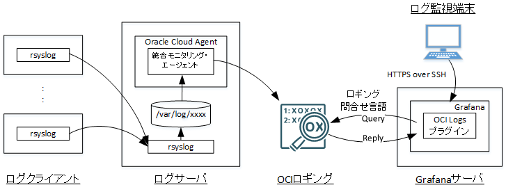

ログサーバは、ここで動作する **統合モニタリング・エージェント** が **OCIロギング** にログを注入するため、 **[インスタンス・プリンシパル](/ocitutorials/hpc/#5-15-インスタンスプリンシパル)** 認証で必要な権限を付与しておく必要があります。  
またGrafanaサーバは、ここで動作する **Grafana** の **OCI Logs** プラグインが **OCIロギング** からログを読み込むため、やはり **[インスタンス・プリンシパル](/ocitutorials/hpc/#5-15-インスタンスプリンシパル)** 認証で必要な権限を付与しておく必要があります。

以上より本ログ監視フレームワークの構築は、以下の手順に沿って行います。

1. **rsyslog** 設定
2. **インスタンス・プリンシパル** 認証設定
3. **統合モニタリング・エージェント** 設定
4. **OCIロギング** リソース作成
5. **Grafana** インストール・設定

本テクニカルTipsで構築するログ監視フレームワークは、HPC/GPUクラスタ内で発生するログを **Grafana** のあらゆる機能を駆使して監視することが出来ますが、代表的な監視方法は対象のログ発生件数を以下のように時系列グラフで確認することです。

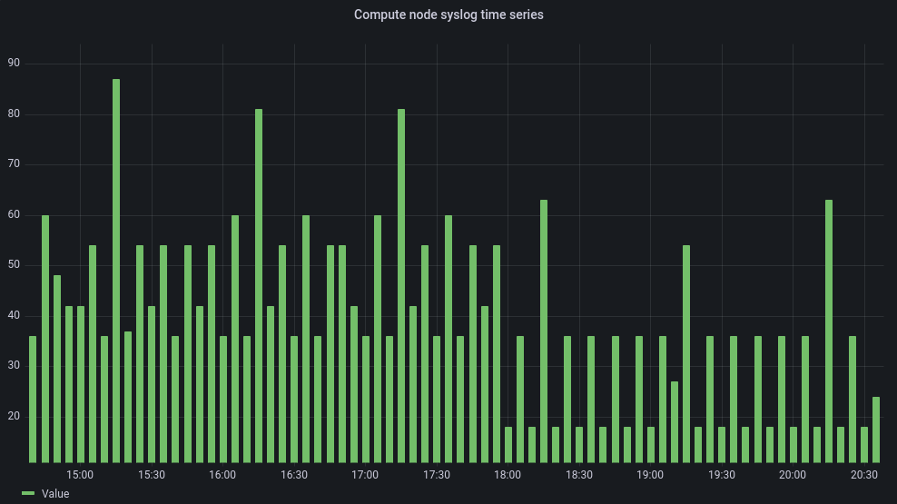

また、 **Grafana** に表示する監視対象ログの選別は、以下の2段階で行うことが可能で、この選別方法も解説します。

- ログクライアントからログサーバに転送する段階でSyslogのファシリティとプライオリティで選別
- Grafanaサーバから **OCIロギング** に問い合わせる **ロギング問合せ言語** で選別

以降では、Grafanaサーバ・ログサーバ・ログクライアントとなるインスタンスが既にデプロイされていることを前提とし、前述の手順に沿ってOCIサービスやこれらインスタンスへのソフトウェアのインストール・設定を実施、その後前述のログ監視を **Grafana** に設定する方法を解説します。

***
# 1. rsyslog設定

## 1-0. 概要

本章は、ログサーバとログクライアントで **rsyslog** の設定を行います。

本テクニカルTipsでは、ログクライアントで発生するファシリティが **authpriv** となる任意のプライオリティのsyslogをログサーバのUDPポート514番に送信し、これをログサーバ上のログファイル **/var/log/secure** に格納します。  
このため、このログクライアント・ログサーバ間通信を許可するよう、 **セキュリティー・リスト** やログサーバのファイアーウォールを予め適切に設定しておきます。

## 1-1. ログサーバのrsyslog設定

本章は、ログクライアントから送信されるsyslogを受信するため、ログサーバの **rsyslog** を設定します。

1. **/etc/rsyslog.conf** を以下のように修正します。

    ```sh
    $ diff rsyslog.conf_org rsyslog.conf
    19,20c19,20
    < #module(load="imudp") # needs to be done just once
    < #input(type="imudp" port="514")
    ---
    > module(load="imudp") # needs to be done just once
    > input(type="imudp" port="514")
    $
    ```

2. opcユーザで以下コマンドを実行し、先の設定ファイル修正を反映します。

    ```sh
    $ sudo systemctl restart rsyslog.service
    ```

## 1-2. ログクライアントのrsyslog設定

本章は、ログサーバにsyslogを送信するため、ログクライアントの **rsyslog** を設定します。

1. **/etc/rsyslog.conf** を以下のように修正します。

    ```sh
    $ sudo diff /etc/rsyslog.conf_org /etc/rsyslog.conf
    49c49
    < authpriv.*                                              /var/log/secure
    ---
    > authpriv.*                                              @logserver_ip:514
    $
    ```
    ※2）ログサーバのIPアドレスは、自身の環境に合わせて置き換えます。  
    ※3）選別するログのファシリティとプライオリティを変更する場合は、修正行の第一フィールドを変更します。

2. opcユーザで以下コマンドを実行し、先の設定ファイル修正を反映します。

    ```sh
    $ sudo systemctl restart rsyslog.service
    ```

***
# 2. インスタンス・プリンシパル認証設定

## 2-0. 概要

本章は、ログサーバで動作する **統合モニタリング・エージェント** が **OCIロギング** にログを注入し、Grafanaサーバで動作する **Grafana** の **OCI Logs** プラグインが **OCIロギング** からログを読み込むため、 **[動的グループ](/ocitutorials/hpc/#5-16-動的グループ)** と **IAMポリシー** を作成して **[インスタンス・プリンシパル](/ocitutorials/hpc/#5-15-インスタンスプリンシパル)** 認証を設定します。

## 2-1. 動的グループ作成

本章は、ログサーバとGrafanaサーバを含む **[動的グループ](/ocitutorials/hpc/#5-16-動的グループ)** を作成します。

1. OCIコンソールにログインし、 **アイデンティティとセキュリティ** → **ドメイン** とメニューを辿ります。

2. 表示される以下 **xxxx（ルート）コンパートメント内のドメイン** 画面で、 **インスタンス・プリンシパル** 認証を設定する **アイデンティティ・ドメイン** を選択します。（複数の **アイデンティティ・ドメイン** を運用していなければ、通常"Default"です。）

    

3. 表示される画面左側の **動的グループ** メニューを選択します。

4. 表示される以下 **Defaultドメイン内の動的グループ** 画面で、 **動的グループの作成** ボタンをクリックします。  

    

5. 表示される以下 **動的グループの作成** 画面で、各フィールドに以下の情報を入力し **作成** ボタンをクリックします。  
なお、ここに記載のないフィールドは、デフォルトのままとします。

    - **名前** ： **動的グループ** に付与する名前
    - **説明** ： **動的グループ** に付与する説明（用途等）
    - **ルール1** ： **動的グループ** に含めるログサーバのインスタンスのOCIDを指定する以下構文

      ```sh
      Any {instance.id = 'log_server_ocid'}
      ```
    - **ルール2** ： **動的グループ** に含めるGrafanaサーバのインスタンスのOCIDを指定する以下構文

      ```sh
      Any {instance.id = 'grafana_server_ocid'}
      ```

   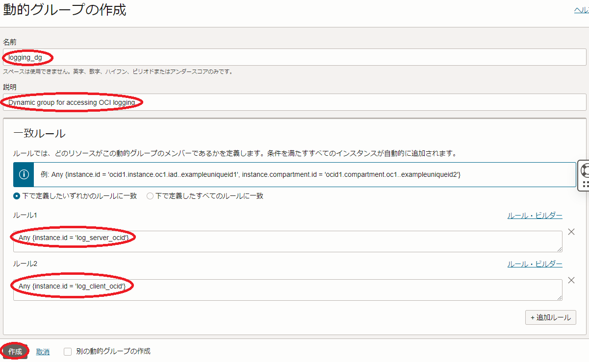

## 2-2. IAMポリシー作成

本章は、作成した **[動的グループ](/ocitutorials/hpc/#5-16-動的グループ)** に対する **IAMポリシー** を作成します。

1. OCIコンソールにログインし、 **アイデンティティとセキュリティ** → **ポリシー** とメニューを辿ります。

2. 表示される以下 **xxxxコンパートメント内のポリシー** 画面で、 **ポリシーの作成** ボタンをクリックします。  
この際、 **コンパートメント** プルダウンメニューで **ルート・コンパートメント** を指定します。

    

3. 表示される以下 **ポリシーの作成** 画面で、各フィールドに以下の情報を入力し **作成** ボタンをクリックします。  
なお、ここに記載のないフィールドは、デフォルトのままとします。

    - **名前** ： **IAMポリシー** に付与する名前
    - **説明** ： **IAMポリシー** に付与する説明（用途等）
    - **ポリシー・ビルダー** ： 作成する **IAMポリシー** を指定する以下構文  
    （ **手動エディタの表示** ボタンをクリックして表示）

      ```sh
      allow dynamic-group dynamicgroup_name to read compartments in tenancy
      allow dynamic-group dynamicgroup_name to read audit-events in tenancy
      allow dynamic-group dynamicgroup_name to read log-groups in tenancy
      allow dynamic-group dynamicgroup_name to read log-content in tenancy
      allow dynamic-group dynamicgroup_name to manage all-resources in compartment id comp_ocid_log_reside
      ```

      ※4）**動的グループ** 名は、先に作成したものに置き換えます。  
      ※5）5行目の **コンパートメント** OCIDは、後に作成する **OCIロギング** 関連リソースを格納する **コンパートメント** のOCIDに置き換えます。  
      ※6）最初の4行のポリシーは、Grafanaサーバの **OCI Logs** プラグインが **OCIロギング** からログを読み込むために必要です。  
      ※7）5行目のポリシーは、ログサーバの **統合モニタリング・エージェント** が **OCIロギング** にログを注入するために必要です。  

   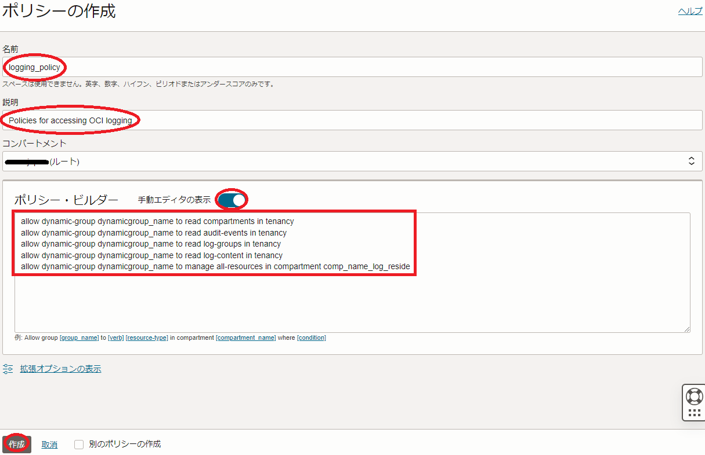

***
# 3. 統合モニタリング・エージェント設定

## 3-0. 概要

本章は、ログサーバで **統合モニタリング・エージェント** を有効化します。

また、Grafanaサーバで **統合モニタリング・エージェント** が有効になっている場合は、これを無効化します。  
これは、後の **[インスタンス・プリンシパル](/ocitutorials/hpc/#5-15-インスタンスプリンシパル)** 認証設定で **[動的グループ](/ocitutorials/hpc/#5-16-動的グループ)** にGrafanaサーバを含めるため、 **統合モニタリング・エージェント** が動作しているとGrafanaサーバのログも **OCIロギング** に注入されてしまうので、これを防止するために必要です。

## 3-1. ログサーバの統合モニタリング・エージェント有効化

本章は、ログサーバの **統合モニタリング・エージェント** を有効化します。  
なお、 **Oracle Cloud Agent** がインストールされていない場合は、 **[ここ](https://docs.oracle.com/ja-jp/iaas/Content/Compute/Tasks/manage-plugins.htm#install-agent)** の手順でインストールします。

OCIコンソールにログインし、以下ログサーバの **インスタンスの詳細** 画面で **Oracle Cloudエージェント** タブをクリックし、 **カスタム・ログのモニタリング** プラグインを **有効** にします。

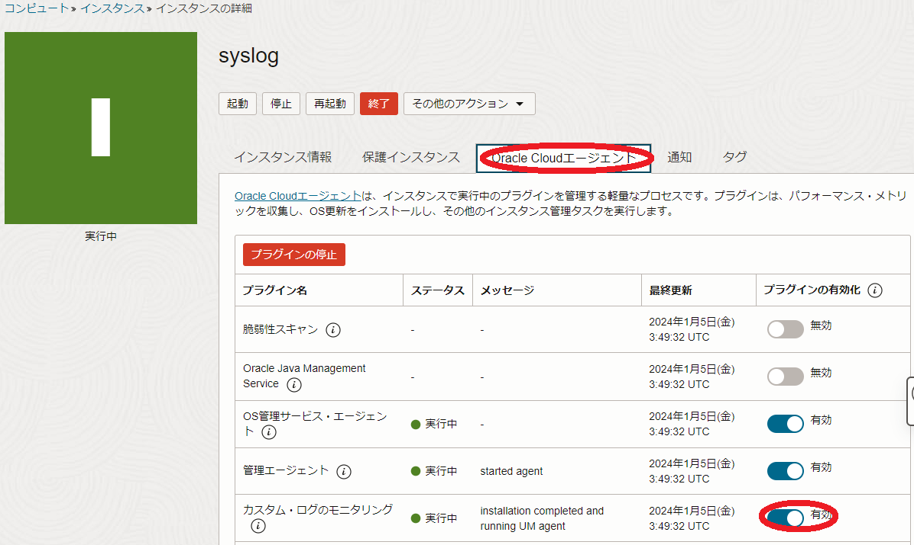

以下画面のように、 **カスタム・ログのモニタリング** プラグインのステータスが **実行中** となれば、有効化が完了しています。  
ステータスが **実行中** となるまで、10分程度の時間を要します。

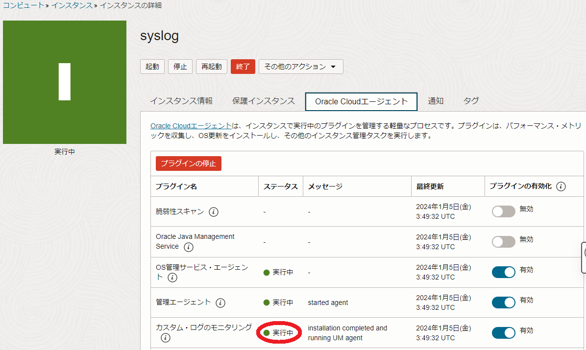

なお、既にプラグインが **有効** となっている場合は、本手順をスキップしますが、この場合先の **[インスタンス・プリンシパル](/ocitutorials/hpc/#5-15-インスタンスプリンシパル)** 認証の設定を有効化するため、ログサーバのopcユーザで以下コマンドを実行し、 **OCA** を再起動します。

```sh
$ sudo systemctl restart oracle-cloud-agent
```

## 3-2. Grafanaサーバの統合モニタリング・エージェント無効化

本章は、Grafanaサーバの **統合モニタリング・エージェント** を無効化します。

1. OCIコンソールにログインし、以下Grafanaサーバの **インスタンスの詳細** 画面で **Oracle Cloudエージェント** タブをクリックし、 **カスタム・ログのモニタリング** プラグインを **無効** にします。  
なお、既にプラグインが **無効** になっている場合は、本手順をスキップします。

    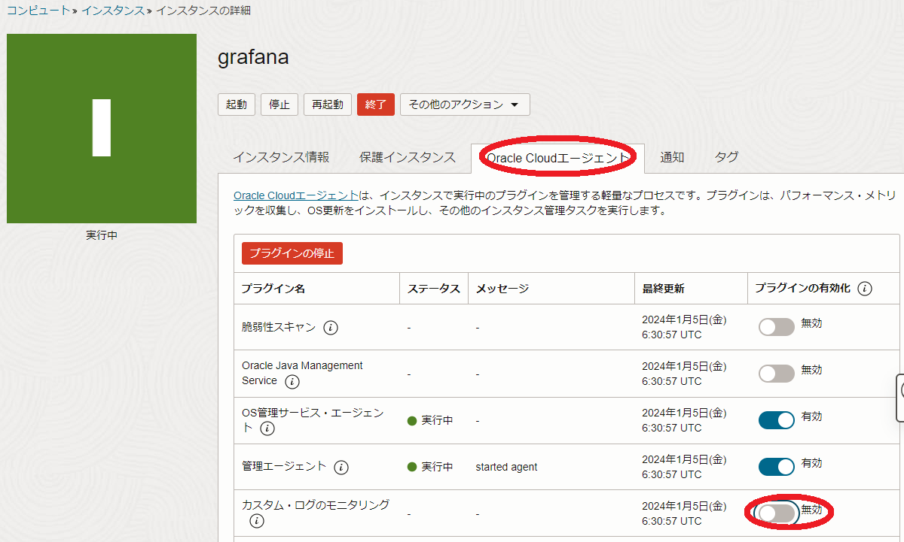

2. Grafanaサーバのopcユーザで以下コマンドを実行し、 **統合モニタリング・エージェント** 関連のSystemdサービスを停止します。

    ```sh
    $ sudo systemctl disable --now unified-monitoring-agent.service
    $ sudo systemctl disable --now unified-monitoring-agent_config_downloader.timer
    $ sudo systemctl disable --now unified-monitoring-agent_config_downloader.service
    $ sudo systemctl disable --now unified-monitoring-agent_restarter.path
    ```

***
# 4. OCIロギングリソース作成

本章は、以下の **OCIロギング** 関連リソースを作成し、ログクライアントとログサーバのSyslogが **OCIロギング** に取り込まれることを確認します。

- **カスタム・ログ**
- **ログ・グループ**
- **エージェント構成**

1. OCIコンソールにログインし、 **監視および管理** → **ログ** とメニューを辿ります。

2. 表示される以下 **xxxxコンパートメント内のログ** 画面で、左下の **コンパートメント** プルダウンメニューで **OCIロギング** 関連リソースを作成する **コンパートメント** を指定し、 **カスタム・ログの作成** ボタンをクリックします。  

    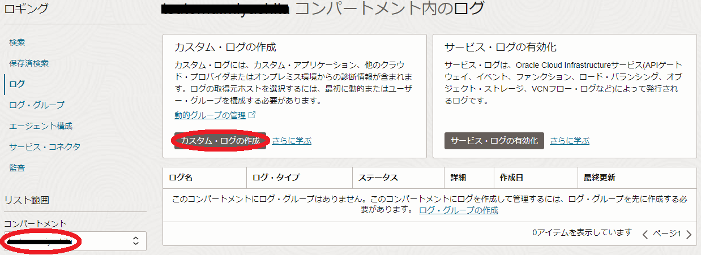

3. 表示される以下 **カスタム・ログの作成** 画面で、 **新規グループの作成** ボタンをクリックします。  

    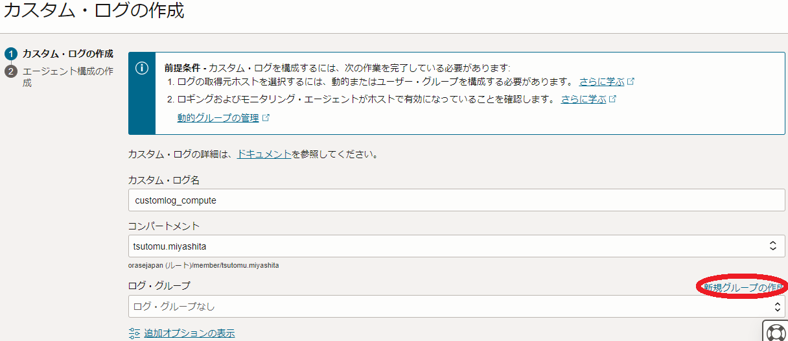

4. 表示される以下 **ログ・グループの作成** サイドバーで、各フィールドに以下の情報を入力し **作成** ボタンをクリックします。  
なお、ここに記載のないフィールドは、デフォルトのままとします。

    - **名前** ： **ログ・グループ** に付与する名前

    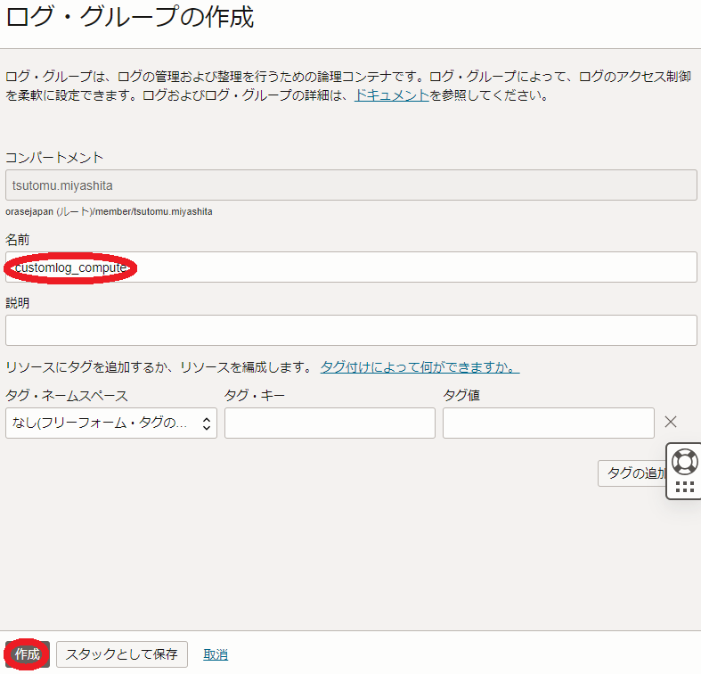

5. 表示される以下 **カスタム・ログの作成** 画面で、各フィールドに以下の情報を入力し **カスタム・ログの作成** ボタンをクリックします。  
なお、ここに記載のないフィールドは、デフォルトのままとします。

    - **カスタム・ログ名** ： **カスタム・ログ** に付与する名前

    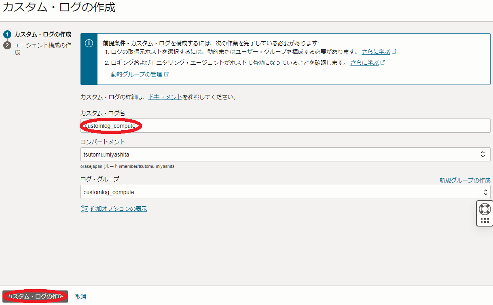

    ※8）ここで作成する **カスタム・ログ** の保持期限はデフォルトで1か月のため、これを変更する場合は **追加オプションの表示** ボタンをクリックして変更します。

6. 表示される以下 **エージェント構成の作成** 画面で、各フィールドに以下の情報を入力し **エージェント構成の作成** ボタンをクリックします。  
なお、ここに記載のないフィールドは、デフォルトのままとします。

    - **構成名** ： **エージェント構成** に付与する名前
    - **説明** ： **エージェント構成** に付与する説明（用途等）
    - **グループ** ： 先に作成した **[動的グループ](/ocitutorials/hpc/#5-16-動的グループ)**
    - **入力タイプ** ： **ログ・パス**
    - **名前の入力** ： **ログ入力** の名前
    - **ファイル・パス** ： ログサーバ上の **OCIロギング** に注入するログファイルのパス（ここでは **/var/log/secure**）
    - **パーサー** ： **SYSLOG**（※9）

    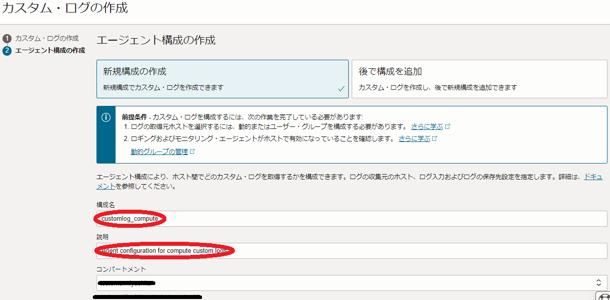  
    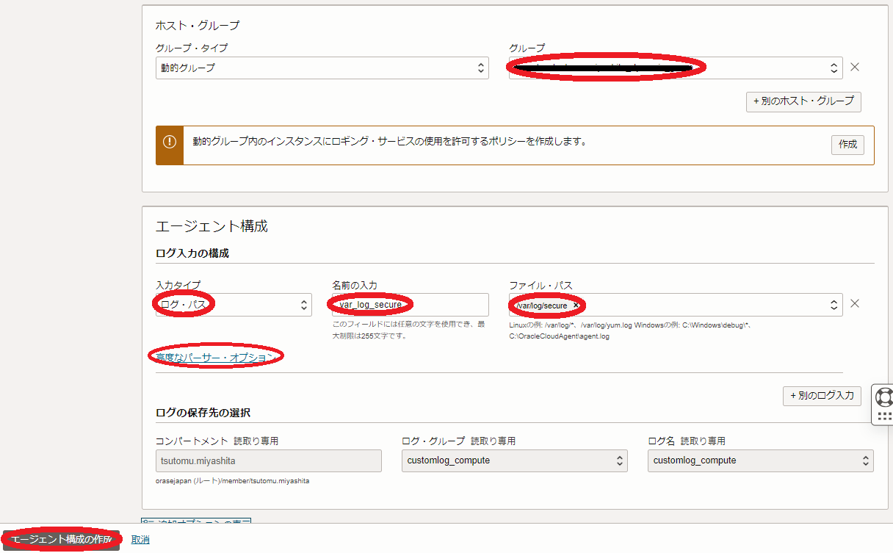

    ※9）**高度なパーサー・オプション** ボタンをクリックして表示される以下 **高度なパーサー・オプション** サイドバーで **パーサー** プルダウンメニューの **SYSLOG** を選択して **変更の保存** ボタンをクリック

    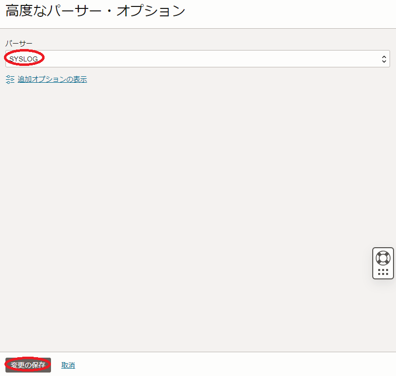

7. OCIコンソールで **監視および管理** → **ログ・グループ** とメニューを辿り、先に作成した **ログ・グループ** を選択します。

8. 表示される **ログ・グループの探索** フィールドで、以下のようにログクライアントとログサーバのSyslogが表示されることを確認します。  
なお、 **OCIロギング** にログが取り込まれるまでに10分程度の時間を要するため、適切な時間経過後にブラウザのリロードボタンでログが取り込まれることを確認します。

    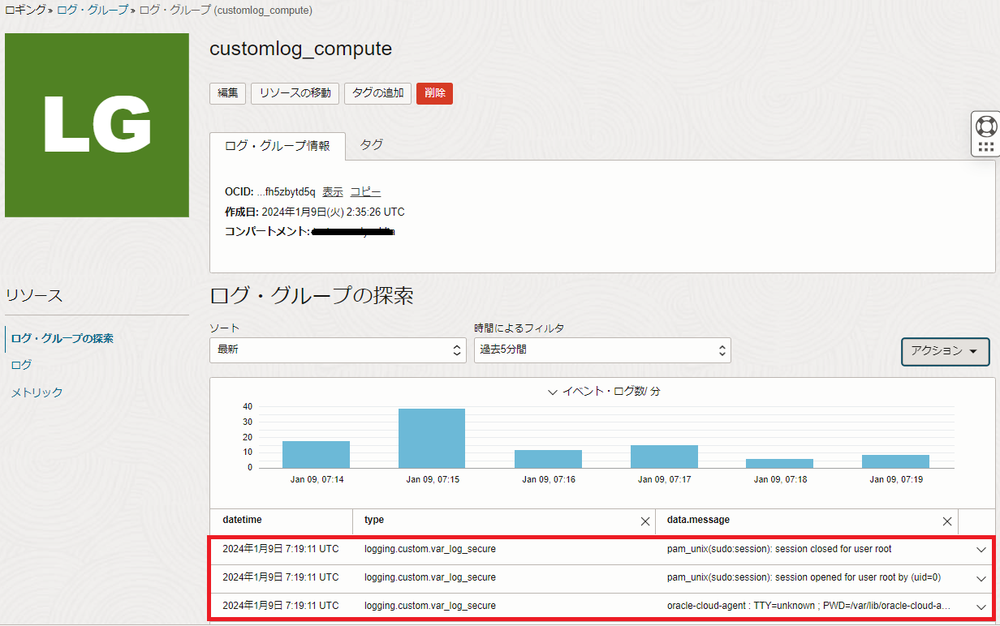

***
# 5. Grafanaインストール・設定

本章は、Grafanaサーバで **Grafana** のインストールとその設定を行い、ログ監視端末のブラウザから **Grafana** にアクセスしてその稼働を確認します。

1. opcユーザで以下コマンドを実行し、 **Grafana** と **OCI Logs** プラグインをインストール・起動します。

    ```sh
    $ sudo dnf install -y grafana
    $ sudo grafana-cli plugins install oci-logs-datasource
    $ sudo systemctl enable --now grafana-server
    ```

2. ログ監視端末で以下コマンドを実行し、Grafanaサーバの **Grafana** にアクセスするためのSSHポートフォワードを作成します。

    ```sh
    $ ssh opc@grafana_ip -L 3000:localhost:3000
    ```
    ※10）GrafanaサーバのIPアドレスは、自身の環境に合わせて置き換えます。

3. ログ監視端末のブラウザのアドレスバーに以下を入力し、 **Grafana** にアクセスします。

    ```sh
    http://localhost:3000/
    ```

    以下ログイン画面が表示されたら、ユーザ名 **admin** 初期パスワード **admin** でログインし、パスワードを変更します。

    

4. 以下画面の **Data sources** メニューをクリックします。

    

5. 以下画面の **Add data source** ボタンをクリックします。

    

6. 以下画面のサーチフィールドに **oracle** と入力し、表示される **Oracle Cloud Infrastructure Logs** ボタンをクリックします。

    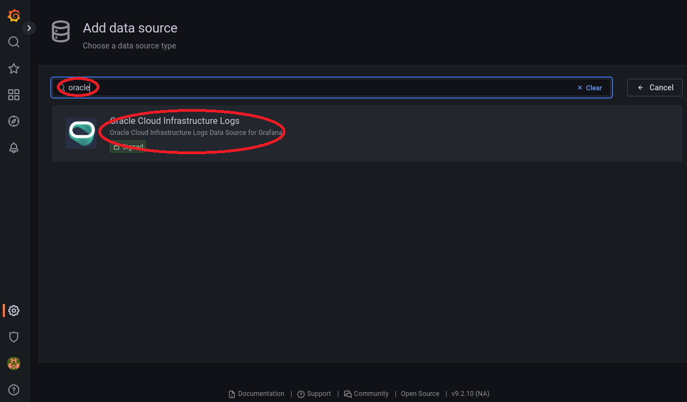

7. 以下画面の **Authentication Provider** プルダウンメニューで **OCI Instance** を選択し、 **Save & test** ボタンをクリックし、

    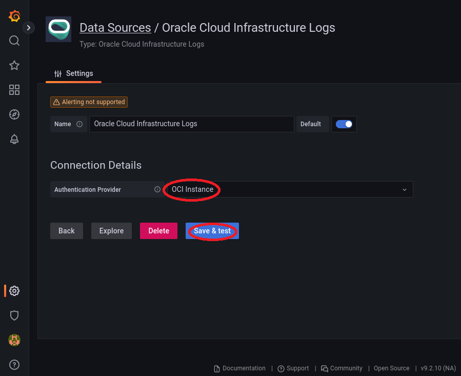

    以下画面のように **Success** と表示されれば、 **OCI Logs** プラグインが **OCIロギング** にアクセス可能であることを確認することが出来ます。

    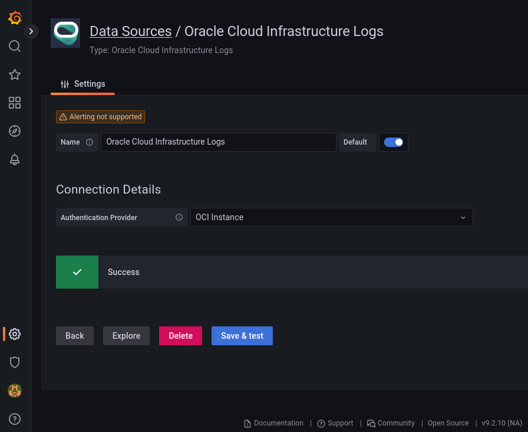

***
# 6. ログ監視機能設定

本章は、 **Grafana** のダッシュボードにログ発生件数を時系列グラフとして表示するパネルを作成します。

1. ログ監視端末のブラウザで **Grafana** にログインし、以下画面の **New dashboard** メニューをクリックします。

    

2. 以下画面の **Add a new panel** ボタンをクリックします。

    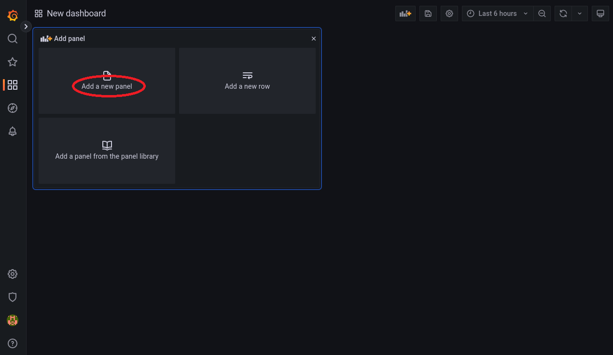

3. 以下画面で、各フィールドに以下の情報を入力して **Query** ボタンをクリックし、

    - **REGION** プルダウンメニュー： **OCIロギング** 関連リソースを作成した **リージョン**
    - **Enter a Cloud Logging query** フィールド： 以下 **ロギング問合せ言語** 文

        ```sh
        search "compartment_ocid/loggroup_name" | summarize count() as cnt by rounddown(datetime,  '1m') as interval
        ```
      ※11）**コンパートメント** のOCIDと **ログ・グループ** 名は、自身のものに置き換えます。  

    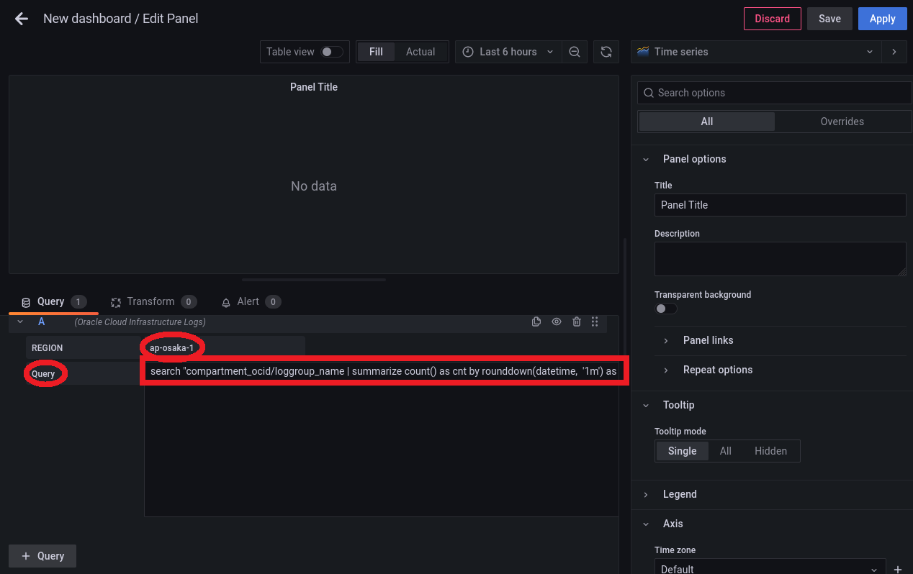

    以下画面のように、指定した **ログ・グループ** のログが **Grafana** に取り込まれてログ発生件数の時系列グラフが表示されることを確認します。

    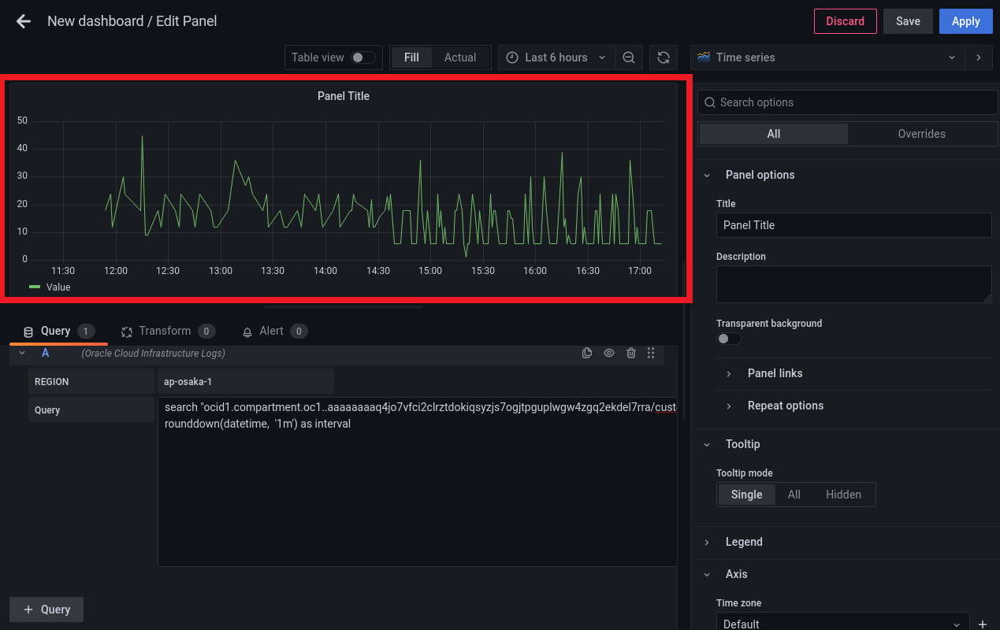

4. 以下画面で、 **Graph styles** フィールドを以下のように設定し、時系列グラフを完成します。

    - **Style** ボタン： **Bars**
    - **Full opacity** フィールド： 100

    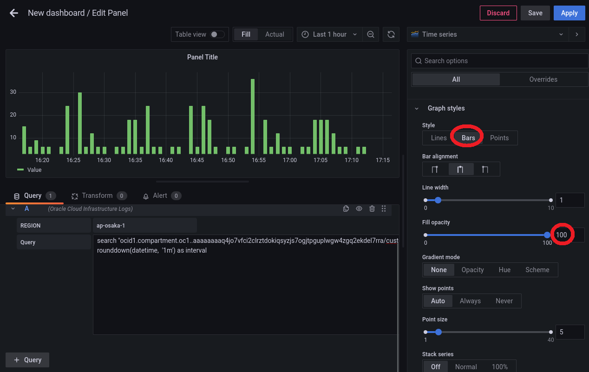

先の時系列グラフは、ログクライアントとログサーバの全てのログ発生件数を表示していますが、先の **ロギング問合せ言語** 文にフィルターを追加することで、特定の条件を満たすログを抽出することが可能です。  
このフィルターは、search文とsummarize文の間に **|** でフィルター構文を挟み込むことで、これを実現します。

例1） 対象のログをホスト名が **comp** で始まるインスタンスが出力したものに限定

```sh
search "compartment_ocid/loggroup_name" | where data.host = 'comp*' | summarize count() as cnt by rounddown(datetime,  '1m') as interval
```

例2） 対象のログをsshdが出力した **session opened for user opc** というメッセージを含むものに限定

```sh
search "compartment_ocid/loggroup_name" | where data.ident = 'sshd' | where data.message = '*session opened for user opc*' | summarize count() as cnt by rounddown(datetime,  '1m') as interval
```

また先の時系列グラフは、ログ発生件数を1分の時間間隔で集計していますが、 **rounddown** 関数の第2引数を変更することで、任意の時間間隔を設定することができます。

例3） ログ発生件数を集計する時間間隔を5分に指定

```sh
search "compartment_ocid/loggroup_name" | summarize count() as cnt by rounddown(datetime,  '5m') as interval
```

**ロギング問合せ言語** のOCI公式ドキュメントは、 **[ここ](https://docs.oracle.com/ja-jp/iaas/Content/Logging/Reference/query_language_specification.htm)** を参照ください。