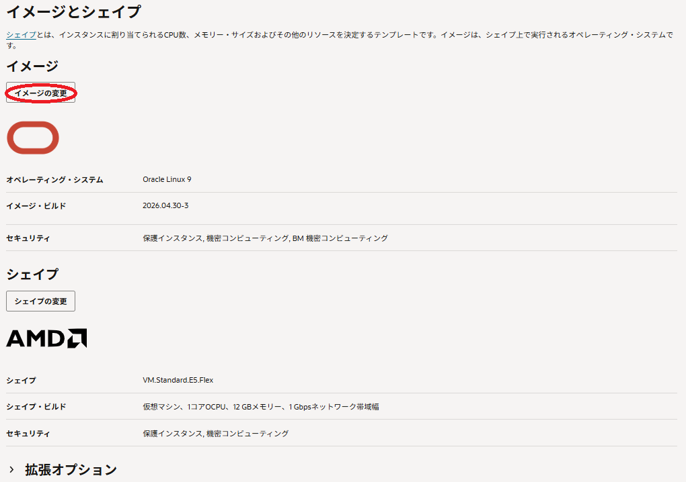
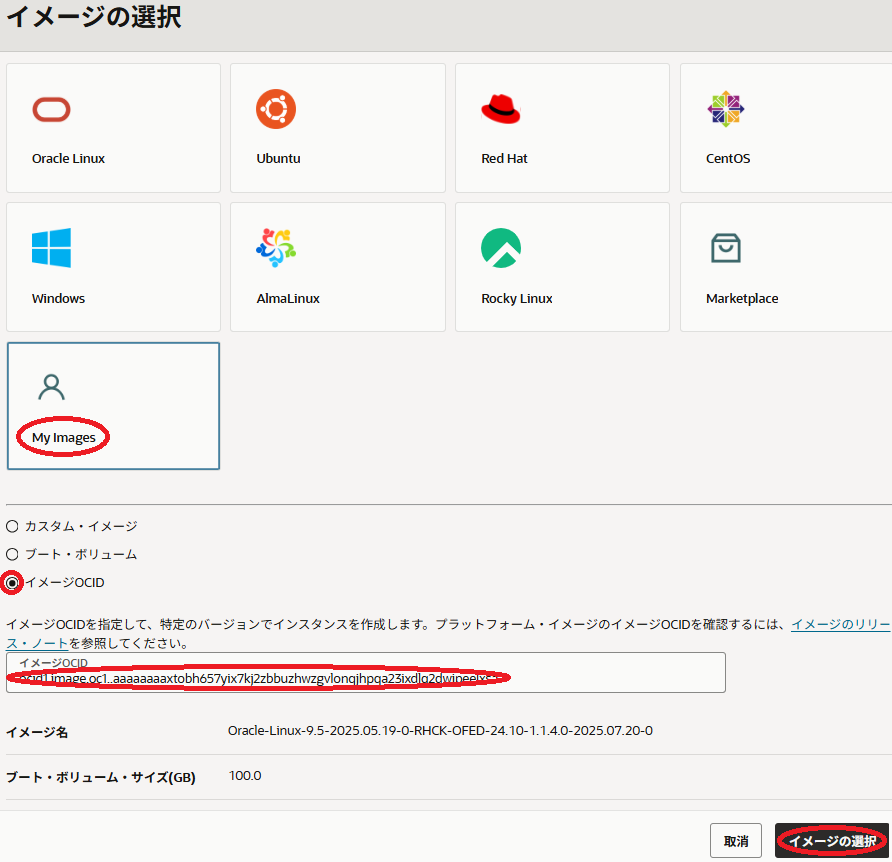
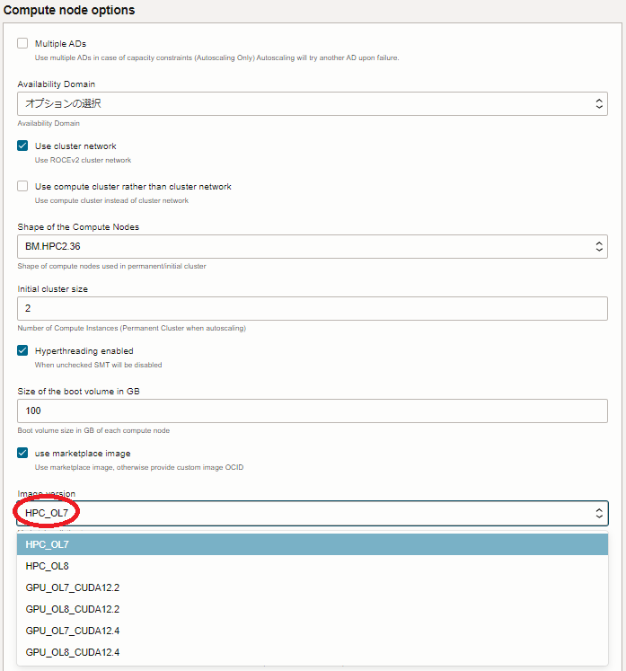

# 0. 概要

**[クラスタネットワーキングイメージ](../../#5-13-クラスタネットワーキングイメージ)** は、ベースOSに **Oracle Linux** を採用し、 **[クラスタ・ネットワーク](../../#5-1-クラスタネットワーク)** への接続に必要な以下のソフトウェアが予めインストールされています。

- **[Mellanox OFED](https://docs.nvidia.com/networking/display/mlnxofedv24100700)** / **[NVIDIA DOCA](https://docs.nvidia.com/doca/sdk/index.html)**  
**クラスタ・ネットワーク** にインスタンスを接続するNIC（**NVIDIA Mellanox ConnectX**）のドライバーソフトウェアです。
- **[wpa_supplicant](https://en.wikipedia.org/wiki/Wpa_supplicant)**  
インスタンスが **クラスタ・ネットワーク** に接続する際行われる802.1X認証（※1）のクライアントソフトウェアです。
- 802.1X認証関連ユーティリティソフトウェア  
インスタンスが **クラスタ・ネットワーク** に接続する際行われる802.1X認証に必要な機能を提供するユーティリティソフトウェアです。
- **クラスタ・ネットワーク** 設定ユーティリティソフトウェア  
**クラスタ・ネットワーク** 接続用ネットワークインターフェース作成等の機能を提供するユーティリティソフトウェアです。

※1）802.1X認証の仕組みは、 **[ここ](https://www.infraexpert.com/study/wireless14.html)** のサイトが参考になります。  

また **クラスタネットワーキングイメージ** は、以下の観点で異なる用途のものが用意されています。

- 802.1X認証関連ユーティリティソフトウェアと **クラスタ・ネットワーク** 設定ユーティリティソフトウェアの提供方法  
**[Oracle Cloud Agent](https://docs.oracle.com/ja-jp/iaas/Content/Compute/Tasks/manage-plugins.htm)** （以降 **OCA** と呼称）HPCプラグインとして提供するか、個別のRPMパッケージとして提供するかによる違いです。  
- 対象のシェイプ  
HPCシェイプ（※2）用（HPC **クラスタネットワーキングイメージ** ）か、GPUシェイプ（※3）用（GPU **クラスタネットワーキングイメージ** ）かの違いで、GPU **クラスタネットワーキングイメージ** はNVIDIA GPUドライバがインストールされています。  
- ベースOSの **Oracle Linux** バージョン  
バージョン8系か、バージョン9系かによる違いです。  

※2）**[BM.HPC2.36](https://docs.oracle.com/ja-jp/iaas/Content/Compute/References/computeshapes.htm#previous-generation-shapes__previous-generation-bm)** と **[BM.Optimized3.36](https://docs.oracle.com/ja-jp/iaas/Content/Compute/References/computeshapes.htm#bm-hpc-optimized)**  
※3）**[BM.GPU4.8](https://docs.oracle.com/ja-jp/iaas/Content/Compute/References/computeshapes.htm#bm-gpu)** と **[BM.GPU.A100-v2.8](https://docs.oracle.com/ja-jp/iaas/Content/Compute/References/computeshapes.htm#bm-gpu)** 

以降では、用途毎に用意している **クラスタネットワーキングイメージ** の一覧と、選択した **クラスタネットワーキングイメージ** をインスタンス作成時に指定する方法を解説します。

**注意 :** 本コンテンツ内の画面ショットは、現在のOCIコンソール画面と異なっている場合があります。

# 1. クラスタネットワーキングイメージ一覧

本章は、前章で説明した用途毎に用意している **[クラスタネットワーキングイメージ](../../#5-13-クラスタネットワーキングイメージ)** の一覧を下表にまとめます。

| No. | 対象シェイプ | **Oracle Linux** バージョン | ユーティリティ 提供方法      | OFED バージョン | GPU/CUDA バージョン |
| :-: | :----: | :-----------------------: | :------------------: | :-----------: | :---------------: |
| 5   | HPC    | 8.7                       | 個別RPM                | 5.4           | -                 |
| 12  |        | 8.10                      | **OCA** HPC プラグイン | 24.10         | -                 |
| 13  |        | 9.5                       | **OCA** HPC プラグイン | 24.10         | -                 |
| 14  | GPU    | 8.10                      | **OCA** HPC プラグイン | 24.10         | 570/12.8          |
| 15  |        | 9.5                       | **OCA** HPC プラグイン | 24.10         | 570/12.8          |

| No. | イメージOCID                                                                      |
| :-: | :---------------------------------------------------------------------------: |
| 5   | ocid1.image.oc1..aaaaaaaaceagnur6krcfous5gxp2iwkv2teiqijbntbpwc4b3alxkzyqi25a |
| 12  | ocid1.image.oc1..aaaaaaaa45plxi2fuhmbze63ynbs3xfigb2iroqpbqxh5qbauw3pbh66ddvq |
| 13  | ocid1.image.oc1..aaaaaaaaxtobh657yix7kj2zbbuzhwzgvlonqjhpqa23ixdlq2dwipeelxsa |
| 14  | ocid1.image.oc1..aaaaaaaas3btftybuhx6gm4o7t2t4bs776pn5dcpk4kgmtbzvynzjkhxoi2q |
| 15  | ocid1.image.oc1..aaaaaaaaevo5a2g6zd524mlu5aopkzxem6farzeilzqwcaax6nnpaflr2ipq |

# 2. クラスタネットワーキングイメージ指定方法

## 2-0. 概要

本章は、 **[1. クラスタネットワーキングイメージ一覧](#1-クラスタネットワーキングイメージ一覧)** で選択した **[クラスタネットワーキングイメージ](../../#5-13-クラスタネットワーキングイメージ)** をインスタンス作成時にどのように指定するかを解説します。

**[クラスタ・ネットワーク](../../#5-1-クラスタネットワーク)** に接続するインスタンスの作成方法は、主に以下3種類が存在します。

- OCIコンソールを使用する方法
- **[HPCクラスタスタック](../../#5-10-hpcクラスタスタック)** を使用する方法
-  **[Terraform](../../#5-12-terraform)** スクリプトを使用する方法

以降は、選択した **クラスタネットワーキングイメージ** をどのように指定するか、これらの作成方法毎に解説します。

## 2-1. OCIコンソールを使用する方法

OCIコンソールを使用して **[クラスタ・ネットワーク](../../#5-1-クラスタネットワーク)** に接続するインスタンスを作成する場合、 **[インスタンス構成](../../#5-7-インスタンス構成)** を予め作成しますが、この **インスタンス構成** 作成時の以下 **イメージとシェイプ** フィールドで **イメージの変更** ボタンをクリックし、

表示される以下 **イメージの選択** サイドバーで、 **My Images** を選択して表示される **イメージOCID** を選択して表示される **イメージOCID** フィールドに使用する **クラスタネットワーキングイメージ** のOCIDを **[1. クラスタネットワーキングイメージ一覧](#1-クラスタネットワーキングイメージ一覧)** の **イメージOCID** 列を参照して入力し、 **イメージの選択** ボタンをクリックします。

## 2-2. HPCクラスタスタックを使用する方法

**[HPCクラスタスタック](../../#5-10-hpcクラスタスタック)** を使用して **[クラスタ・ネットワーク](../../#5-1-クラスタネットワーク)** に接続するインスタンスを作成する場合、 **[スタック](../../#5-3-スタック)** メニュー中の以下 **Compute node options** フィールドの **Image version** プルダウンメニューで適切な **[クラスタネットワーキングイメージ](../../#5-13-クラスタネットワーキングイメージ)** を選択します。  
なお、本テクニカルTipsが前提とする **HPCクラスタスタック** は、バージョン **2.10.4.1** です。

各選択肢は、以下の **クラスタネットワーキングイメージ** に対応しています。

| メニュー名         | 前章一覧表中のNo. |
| :-----------: | :--------: |
| HPC_OL8       | 12         |
| GPU_OL8_NV550 | 7          |

なお、個別RPMを使用する **クラスタネットワーキングイメージ** は、現在最新の **HPCクラスタスタック** では使用することが出来ません。

## 2-3. Terraformスクリプトを使用する方法

 **[Terraform](../../#5-12-terraform)** スクリプトを使用して **[クラスタ・ネットワーク](../../#5-1-クラスタネットワーク)** に接続するインスタンスを作成する場合、 **Terraform** スクリプト内に **[1. クラスタネットワーキングイメージ一覧](#1-クラスタネットワーキングイメージ一覧)** の **イメージOCID** 列のイメージOCIDを指定します。