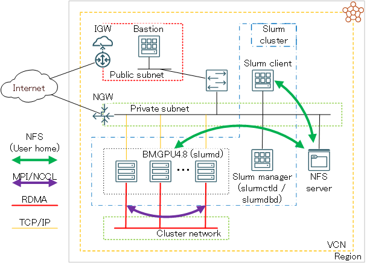

<style>
table, th, td {
    font-size: 80%;
}
</style>

# 0. 概要

本テクニカルTipsは、HPC/機械学習ワークロードを実行するためのGPUノード/クラスタに於ける高価なGPUリソースの有効活用を念頭に、現在GPU関連ソフトウェア開発で主に利用されている **Ubuntu** をOSとする、NVIDIA製GPUを複数搭載するベアメタルインスタンスのGPUリソース管理やジョブ管理を **[Slurm](https://slurm.schedmd.com/)** で行う環境の構築方法を解説します。

なお、GPUを搭載しない計算ノード/HPCクラスタのリソース管理・ジョブ管理を **Slurm** で行う環境の構築方法は、 **[OCI HPCテクニカルTips集](../../#3-oci-hpcテクニカルtips集)** の **[Slurmによるリソース管理・ジョブ管理システム構築方法](../setup-slurm-cluster/)** を参照してください。

# 1. 前提システム

本章は、本テクニカルTipsで解説する **Slurm** 環境構築手順の前提となるシステムを解説します。  
本テクニカルTipsは、このシステムが予め構築されている前提で、ここに **Slurm** 環境を構築する手順を解説します。

前提システムは、以下4種類のサブシステムから構成されます。  
また、必要に応じてこれらのサブシステムにログインするための踏み台となる、パブリックサブネットに接続するBastionノードを用意します。

| サブシステム          | 使用するシェイプ                    | OS                       | ノード数 | 接続<br>サブネット | 役割                                                                      |
| :-------------: | :-------------------------: | :----------------------: | :--: | :---------: | :---------------------------------------------------------------------: |
| Slurm<br>マネージャ  | 任意の仮想マシン<br>                | **Ubuntu** 24.04<br>（※1） | 1    | プライベート      | ・ **slurmctld** と **slurmdbd** が<br>稼働するSlurm管理ノード                      |
| Slurm<br>クライアント | 任意の仮想マシン<br>                | **Ubuntu** 24.04<br>（※1） | 1    | プライベート      | ・アプリケーション開発用<br>フロントエンドノード<br>・ **Slurm** にジョブを投入する<br>ジョブサブミッションクライアント |
| GPUノード          | 複数GPUを搭載する<br>ベアメタルシェイプ（※2） | **Ubuntu** 24.04<br>（※1） | 任意のノード数    | プライベート      | ・ **slurmd** が稼働するジョブ実行ノード                                              |
| NFSサーバ          | -<br>（※3）                   | -                        | 1    | プライベート      | ・ジョブ投入ユーザのホームディレクトリを<br>NFSでサービス（※4）                                    |



※1） **[プラットフォーム・イメージ](../../#5-17-プラットフォームイメージ)** の **[Canonical-Ubuntu-24.04-2025.07.23-0](https://docs.oracle.com/en-us/iaas/images/ubuntu-2404/canonical-ubuntu-24-04-2025-07-23-0.htm)** です。Slurmマネージャは、Slurmクライアントでビルドする **Ubuntu** 用debパッケージから **Slurm** をインストールするため、Slurmクライアントは、GPUノードのアプリケーション開発環境の役割を担うため、これらにGPUノードと同じOSを採用します。  
※2）本テクニカルTipsは、8枚の **NVIDIA A100** GPUを搭載するベアメタルシェイプ **[BM.GPU4.8](https://docs.oracle.com/ja-jp/iaas/Content/Compute/References/computeshapes.htm#bm-gpu)** を使用します。  
※3）**ファイル・ストレージ** やベア・メタル・インスタンスNFSサーバ等、任意の手法で構築されたNFSサーバです。NFSでサービスするファイル共有ストレージ構築方法は、 **[OCI HPCテクニカルTips集](../../#3-oci-hpcテクニカルtips集)** の **[HPC/GPUクラスタ向けファイル共有ストレージの最適な構築手法](../howto-configure-sharedstorage/)** を参照してください。  
※4）NFSサーバがサービスするジョブ投入ユーザのホームディレクトリは、SlurmクライアントとGPUノードでNFSマウントします。  

GPUノードとSlurmクライアントは、 **[OCI HPCテクニカルTips集](../../#3-oci-hpcテクニカルtips集)** の **[UbuntuをOSとするHPC/機械学習ワークロード向けGPUインスタンス構築方法](../gpu-with-ubuntu/)** の手順に従い、インスタンスの作成とGPU関連ソフトウェアをインストールします。  
ここでSlurmクライアントは、GPUを搭載しない仮想マシンのため、以下ソフトウェアのインストール・セットアップの手順と、動作確認をスキップします。

- **[NVIDIA Fabric Manager](https://docs.nvidia.com/datacenter/tesla/fabric-manager-user-guide/index.html)**
- **[gdrcopy](https://github.com/NVIDIA/gdrcopy)**

本テクニカルTipsの各サブシステムのホスト名は、以下とします。  
以降の章では、これらのホスト名を自身の環境に置き換えて使用して下さい。

| サブシステム      | ホスト名         |
| :---------: | :----------: |
| Slurmマネージャ  | slurm-srv-ub |
| Slurmクライアント | slurm-cli-ub |
| GPUノード      | inst-ao-ub   |

また、各サブシステムのセキュリティーに関するOS設定は、 **iptables** と **AppArmor** を永続的に停止します。

# 2. 環境構築

## 2-0. 概要
本章は、既に作成されている **[1. 前提システム](#1-前提システム)** で解説したシステム上で、 **Slurm** 環境を構築します。

**Slurm** のインストールは、多数のGPUノードに効率よくインストールする必要から、checkinstallで作成するdebパッケージによるインストール方法を採用します。

本テクニカルTipsで使用する **Slurm** は、バージョン **25.05.3** を前提とし、 **Slurm** のプロセス間通信の認証に **[munge](https://dun.github.io/munge/)** 、ジョブのアカウンティング情報格納用RDBMSに **[MariaDB](https://mariadb.org/)** を使用します。  
また、 **[OpenMPI](https://www.open-mpi.org/)** のMPI並列アプリケーションを **[PMIx](https://pmix.github.io/)** の大規模並列ジョブに対する利点を生かして実行することを念頭に（※5）、 **PMIx** と **[UCX](https://openucx.org/)** を取り込んだ **Slurm** 環境を構築します。

※5）この詳細は、 **[OCI HPCテクニカルTips集](../../#3-oci-hpcテクニカルtips集)** の **[Slurmによるリソース管理・ジョブ管理システム構築方法](../setup-slurm-cluster/)** の **[0. 概要](../setup-slurm-cluster/#0-概要)** を参照してください。

以上より、本章で解説する環境構築は、以下の手順に沿って行います。

1. **[mungeインストール・セットアップ](#2-1-munge-インストールセットアップ)**
2. **[MariaDBインストール・セットアップ](#2-2-mariadb-インストールセットアップ)**
3. **[OpenPMIxインストール](#2-4-openpmixインストール)**
5. **[OpenUCXインストール](#2-5-openucxインストール)**
6. **[Slurm debパッケージ作成](#2-6-slurm-rpmパッケージ作成)**
7. **[Slurm debパッケージインストール・セットアップ](#2-7-slurm-rpmパッケージインストールセットアップ)**
8. **[Slurm設定ファイル作成](#2-8-slurm設定ファイル作成)**
9. **[Slurmサービス起動](#2-9-slurmサービス起動)**
10. **[Slurm利用に必要な環境変数設定](#2-10-slurm利用に必要な環境変数設定)**

なお、各ソフトウェアと **Slurm** サービスは、以下のサブシステムにインストールします。

|                    | Slurmマネージャ | Slurmクライアント | GPUノード |
| :----------------: | :--------: | :---------: | :---: |
| **munge**          | 〇          | 〇           | 〇     |
| **MariaDB**        | 〇          | -           | -     |
| **OpenPMIx**       | 〇          | 〇（※6）       | 〇（※6） |
| **OpenUCX**        | 〇          | 〇（※6）       | 〇（※6） |
| **Slurm** debパッケージ | 〇          | 〇           | 〇     |

※6）**[1. 前提システム](#1-前提システム)** の構築手順により既にインストールされています。

## 2-1. munge インストール・セットアップ

本章は、Slurmマネージャ、Slurmクライアント、及び全てのGPUノードに **munge** をインストール・セットアップします。

以下コマンドを対象となる全ノードのubuntuユーザで実行し、 **munge** プロセス起動ユーザを作成します。

```sh
$ sudo useradd -m -d /var/lib/munge -s /sbin/nologin -u 5001 munge
```

次に、以下コマンドを対象となる全ノードのubuntuユーザで実行し、 **munge** をインストールします。

```sh
$ sudo apt update
$ sudo apt install -y munge libmunge2 libmunge-dev
```

次に、Slurmマネージャの **munge** キーファイル（ **/etc/munge/munge.key** ）を、Slurmクライアントと全てのGPUノードに同一パス・ファイル名でコピーします。  
この際、ファイルのオーナーとパーミッションがSlurmマネージャのキーファイルと同じとなるよう配慮します。

次に、以下コマンドをSlurmクライアントとGPUノードのubuntuユーザで実行し、 **munge** サービスを再起動します。

```sh
$ sudo systemctl restart munge.service
```

次に、以下コマンドを対象となる全ノードのubuntuユーザで実行し、 **munge** が全てのノードで正常に動作していることを確認します。

```sh
$ munge -n | unmunge | grep STATUS
STATUS:           Success (0)
$
```

## 2-2. MariaDB インストール・セットアップ

本章は、Slurmマネージャに **MariaDB** をインストール・セットアップします。

以下コマンドをubuntuユーザで実行し、 **MariaDB** をインストールします。

```sh
$ sudo apt install -y mariadb-server libmariadb-dev
```

次に、 **MariaDB** の設定ファイル（ **/etc/mysql/mariadb.conf.d/50-server.cnf** ）の[mysqld]フィールドに以下の記述を追加します。

```sh
$ sudo diff /etc/mysql/mariadb.conf.d/50-server.cnf_org /etc/mysql/mariadb.conf.d/50-server.cnf
106a107,108
> innodb_buffer_pool_size=4096M
> innodb_lock_wait_timeout=900
$
```

次に、以下コマンドをubuntuユーザで実行し、 **MariaDB** サービスを再起動します。

```sh
$ sudo systemctl restart mariadb
```

次に、 **MariaDB** のデータベースに以下の登録を行うため、

- データベース（slurm_acct_db）
- ユーザ（slurm）
- ユーザ（slurm）のパスワード
- ユーザ（slurm）に対するデータベース（slurm_acct_db）への全権限付与

以下コマンドをubuntuユーザで実行します。  
なお、 **MariaDB** に対して入力するコマンドは、 **MariaDB** のプロンプト（ **MariaDB [(none)]>** ）に続く文字列です。  
なお、コマンド中の **passcord** は、自身の設定するパスワードに置き換えます。

```sh
$ sudo mysql
Welcome to the MariaDB monitor.  Commands end with ; or \g.
Your MariaDB connection id is 8
Server version: 10.3.39-MariaDB MariaDB Server

Copyright (c) 2000, 2018, Oracle, MariaDB Corporation Ab and others.

Type 'help;' or '\h' for help. Type '\c' to clear the current input statement.

MariaDB [(none)]> create database slurm_acct_db;
Query OK, 1 row affected (0.000 sec)

MariaDB [(none)]> create user 'slurm'@'localhost' identified by 'SLURM';
Query OK, 0 rows affected (0.000 sec)

MariaDB [(none)]> set password for slurm@localhost = password('passcord');
Query OK, 0 rows affected (0.000 sec)

MariaDB [(none)]> grant all on slurm_acct_db.* TO 'slurm'@'localhost';
Query OK, 0 rows affected (0.000 sec)

MariaDB [(none)]> FLUSH PRIVILEGES;
Query OK, 0 rows affected (0.000 sec)

MariaDB [(none)]> exit
Bye
$
```

次に、以下コマンドをubuntuユーザで実行し、先に登録したデータベースとユーザが正しく登録されていることを確認します。  
なお、コマンド中の **passcord** は、自身の設定したパスワードに置き換えます。

```sh
$ mysql --user=slurm --password=passcord slurm_acct_db -e 'show databases;'
+--------------------+
| Database           |
+--------------------+
| information_schema |
| slurm_acct_db      |
+--------------------+
$
```

## 2-3. OpenPMIxインストール

本章は、Slurmマネージャに **OpenPMIx** をインストールします。

以下コマンドをubuntuユーザで実行し、 **OpenPMIx** を **/opt** ディレクトリにインストールします。  
なお、makeコマンドの並列数は当該ノードのコア数に合わせて調整します。

```sh
$ sudo apt install -y build-essential gcc g++ make libtool pkg-config
$ mkdir ~/`hostname` && cd ~/`hostname` && wget https://github.com/libevent/libevent/releases/download/release-2.1.12-stable/libevent-2.1.12-stable.tar.gz
$ tar -xvf ./libevent-2.1.12-stable.tar.gz
$ cd libevent-2.1.12-stable && ./configure --prefix=/opt/libevent
$ make -j 16 && sudo make install
$ cd ~/`hostname` && wget https://download.open-mpi.org/release/hwloc/v2.12/hwloc-2.12.2.tar.gz
$ tar -xvf ./hwloc-2.12.2.tar.gz
$ cd hwloc-2.12.2 && ./configure --prefix=/opt/hwloc
$ make -j 16 && sudo make install
$ cd ~/`hostname` && wget https://github.com/openpmix/openpmix/releases/download/v5.0.8/pmix-5.0.8.tar.gz
$ tar -xvf ./pmix-5.0.8.tar.gz
$ cd pmix-5.0.8 && ./configure --prefix=/opt/pmix --with-libevent=/opt/libevent --with-hwloc=/opt/hwloc
$ make -j 16 && sudo make install
```

## 2-5. OpenUCXインストール

本章は、Slurmマネージャに **OpenUCX** をインストールします。

以下コマンドをSlurmマネージャのubuntuユーザで実行し、 **OpenUCX** を **/opt** ディレクトリにインストールします。  
なお、makeコマンドの並列数は当該ノードのコア数に合わせて調整します。

```sh
$ cd ~/`hostname` && wget https://github.com/openucx/ucx/releases/download/v1.19.0/ucx-1.19.0.tar.gz
$ tar -xvf ./ucx-1.19.0.tar.gz
$ cd ucx-1.19.0 && ./contrib/configure-release --prefix=/opt/ucx
$ make -j 16 && sudo make install
```

## 2-6. Slurm RPMパッケージ作成

本章は、Slurmクライアントでdebパッケージを作成します。

以下コマンドをSlurmクライアントのubuntuユーザで実行し、前提パッケージをインストールします。

```sh
$ sudo apt install -y checkinstall libmariadb-dev libdbus-1-dev
```

次に、以下コマンドをSlurmクライアントのubuntuユーザで実行し、 **Slurm** のdebパッケージを作成します。

```sh
$ mkdir ~/`hostname` && cd ~/`hostname` && wget https://download.schedmd.com/slurm/slurm-25.05.3.tar.bz2
$ tar -xvf ./slurm-25.05.3.tar.bz2
$ cd slurm-25.05.3 && ./configure --prefix=/opt/slurm --sysconfdir=/opt/slurm/etc --disable-debug --with-pmix=/opt/pmix --with-ucx=/opt/ucx --with-systemdsystemunitdir=/lib/systemd/system
$ make -j 16
$ sudo checkinstall -y --install=no --fstrans=no
```

作成されたパッケージは、カレントディレクトリに以下のように配置されるので、これを他のサブシステムにコピーします。

```sh
$ ls *.deb
slurm_25.05.3-1_amd64.deb
$
```

## 2-7. Slurm RPMパッケージインストール・セットアップ

本章は、先に作成した **Slurm** のdebパッケージをSlurmマネージャ、Slurmクライアント、及び全てのGPUノードにインストールし、必要なセットアップ作業を実施します。

以下コマンドをSlurmマネージャ、Slurmクライアント、及び全てのGPUノードのubuntuユーザで **Slurm** のdebパッケージをコピーしたディレクトリで実行し、 **Slurm** をインストールします。

```sh
$ sudo apt install -y ./slurm_25.05.3-1_amd64.deb
```

次に、以下コマンドをSlurmマネージャのubuntuユーザで実行し、Slurmマネージャ向けの **Slurm** のセットアップを行います。

```sh
$ sudo useradd -m -d /var/lib/slurm -s /bin/bash -u 5000 slurm
$ sudo mkdir /var/spool/slurmctld && sudo chown slurm:slurm /var/spool/slurmctld
$ sudo mkdir /var/spool/slurmd && sudo chown slurm:slurm /var/spool/slurmd
$ sudo mkdir /var/log/slurm && sudo chown slurm:slurm /var/log/slurm
$ sudo mkdir /opt/slurm/etc && sudo chown slurm:slurm /opt/slurm/etc
$ sudo su - slurm
$ echo "export PATH=/opt/slurm/sbin:/opt/slurm/bin:\$PATH" | tee -a ~/.bash_profile
```

次に、以下コマンドを全てのGPUノードのubuntuユーザで実行し、GPUノード向けの **Slurm** のセットアップを行います。

```sh
$ sudo useradd -m -d /var/lib/slurm -s /bin/bash -u 5000 slurm
$ sudo mkdir /var/spool/slurmd && sudo chown slurm:slurm /var/spool/slurmd
$ sudo mkdir /var/log/slurm && sudo chown slurm:slurm /var/log/slurm
$ sudo mkdir /opt/slurm/etc && sudo chown slurm:slurm /opt/slurm/etc
```

次に、以下コマンドをSlurmクライアントのubuntuユーザで実行し、Slurmクライアント向けの **Slurm** のセットアップを行います。

```sh
$ sudo useradd -m -d /var/lib/slurm -s /bin/bash -u 5000 slurm
$ sudo mkdir /opt/slurm/etc && sudo chown slurm:slurm /opt/slurm/etc
```

## 2-8. Slurm設定ファイル作成

本章は、以下3種類の **Slurm** 設定ファイルを作成し、これらを各サブシステムの **/opt/slurm/etc** ディレクトリに配布します。  
この際、これらファイルのオーナーユーザ・オーナーグループを **slurm** とします。  
また、 **slurmdbd.conf** のパーミッションを **600** に設定します。

- **slurm.conf**（全てのサブシステム）
- **slurmdbd.conf**（Slurmマネージャ）
- **mpi.conf**（Slurmマネージャ）
- **cgroup.conf**（Slurmマネージャ・GPUノード）
- **gres.conf**（GPUノード）

[ **slurm.conf** ]
```sh
ClusterName=sltest
SlurmctldHost=slurm-srv-ub
AuthType=auth/munge
PluginDir=/opt/slurm/lib/slurm
SchedulerType=sched/backfill
SlurmUser=slurm
SlurmctldPort=7002
SlurmctldTimeout=300
SlurmdPort=7003
SlurmdSpoolDir=/var/spool/slurmd
SlurmdTimeout=300
SlurmctldLogFile=/var/log/slurm/slurmctld.log
SlurmdLogFile=/var/log/slurm/slurmd.log
SlurmdDebug=3
StateSaveLocation=/var/spool/slurmd
SwitchType=switch/none
AccountingStorageType=accounting_storage/slurmdbd
AccountingStorageHost=slurm-srv-ub
AccountingStoragePort=7004
MpiDefault=pmix
#
# For per-GPU scheduling
AccountingStorageTRES=gres/gpu
DebugFlags=CPU_Bind,gres
GresTypes=gpu
JobAcctGatherType=jobacct_gather/cgroup
SelectType=select/cons_tres
TaskPlugin=task/cgroup,task/affinity
#
# GPU node specifications
NodeName=inst-ao-ub Gres=gpu:nvidia_a100-sxm4-40gb:8 CPUs=128 Boards=1 SocketsPerBoard=2 CoresPerSocket=32 ThreadsPerCore=2 RealMemory=2000000 TmpDisk=10000 State=UNKNOWN
PartitionName=sltest Nodes=ALL Default=YES MaxTime=INFINITE State=UP
```

なお、 **SlurmctldHost** 、 **AccountingStorageHost** 、及び **NodeName** の設定値は、自身の環境に合わせて修正します。

[ **slurmdbd.conf** ]
```sh
ArchiveEvents=yes
ArchiveJobs=yes
ArchiveResvs=yes
ArchiveSteps=no
ArchiveSuspend=no
ArchiveTXN=no
ArchiveUsage=no
AuthType=auth/munge
AuthInfo=/var/run/munge/munge.socket.2
DbdHost=slurm-srv-ub
DbdPort=7004
DebugLevel=info
PurgeEventAfter=1month
PurgeJobAfter=12month
PurgeResvAfter=1month
PurgeStepAfter=1month
PurgeSuspendAfter=1month
PurgeTXNAfter=12month
PurgeUsageAfter=24month
LogFile=/var/log/slurm/slurmdbd.log
PidFile=/var/run/slurmdbd/slurmdbd.pid
SlurmUser=slurm
StorageType=accounting_storage/mysql
StorageUser=slurm
StoragePass=passcord
StorageLoc=slurm_acct_db
```

なお、 **DbdHost** と **StoragePass** の設定値は、自身の環境に合わせて修正します。

[ **mpi.conf** ]
```sh
PMIxDirectConn=true
PMIxDirectConnEarly=true
PMIxDirectConnUCX=true
PMIxNetDevicesUCX=mlx5_4:1
```

[ **cgroup.conf** ]
```sh
ConstrainCores=yes 
ConstrainDevices=yes
ConstrainRAMSpace=yes
```

[ **gres.conf** ]
```sh
NodeName=inst-ao-ub Name=gpu Type=nvidia_a100-sxm4-40gb File=/dev/nvidia[0-7]
```

## 2-9. Slurmサービス起動

本章は、 **Slurm** の各systemdサービスを対象のサブシステムで起動します。

以下コマンドをSlurmマネージャのubuntuユーザで実行し、 **slurmdbd** と **slurmctld** を起動します。

```sh
$ sudo systemctl enable --now slurmdbd
$ sudo systemctl enable --now slurmctld
```

次に、以下コマンドを全てのGPUノードのubuntuユーザで実行し、 **slurmd** を起動します。

```sh
$ sudo systemctl enable --now slurmd
```

次に、以下コマンドをSlurmマネージャのslurmユーザで実行し、全てのGPUノードがアイドルになっていることを確認します。

```sh
$ sinfo
PARTITION AVAIL  TIMELIMIT  NODES  STATE NODELIST
sltest*      up   infinite      1   idle inst-ao-ub
$
```

次に、以下コマンドをSlurmマネージャのslurmユーザで実行し、 **PMIx** が利用可能になっていることを確認します。

```sh
$ srun --mpi=list
MPI plugin types are...
	none
	pmix
	pmi2
	cray_shasta
specific pmix plugin versions available: pmix_v5
$
```

## 2-10. Slurm利用に必要な環境変数設定

以下コマンドをSlurmクライアントの **Slurm** 利用ユーザで実行し、 **Slurm** を利用するための環境変数を設定します。

```sh
$ echo "export PATH=/opt/slurm/sbin:/opt/slurm/bin:\$PATH" | tee -a ~/.bashrc
```

# 3. 稼働確認

本章は、構築した **Slurm** 環境の稼働確認を以下の方針で行います。

- GPUリソース管理が想定通りに行われているかを **nvidia-smi** コマンドで確認
- ノード内GPUデバイスメモリ間レイテンシを **OSU Micro-Benchmarks** で確認
- ノード内GPUデバイスメモリ間帯域幅を **OSU Micro-Benchmarks** で確認
- 使用したGPUリソースがジョブアカウンティング情報に記録されていることを確認

なお、 **[OSU Micro-Benchmarks](https://mvapich.cse.ohio-state.edu/benchmarks/)** をSlurmクライアントとGPUノードに予めインストール・セットアップしておきます。  
この手順は、 **[OCI HPCパフォーマンス関連情報](../../#2-oci-hpcパフォーマンス関連情報)** の **[OSU Micro-Benchmarks実行方法（BM.GPU4.8/BM.GPU.A100-v2.8編）](../../benchmark/run-omb-gpu/)** の **[1. OSU Micro-Benchmarksインストール・セットアップ](../../benchmark/run-omb-gpu/#1-osu-micro-benchmarksインストールセットアップ)** を参照してください。

以下コマンドをSlurmクライアントの **Slurm** 利用ユーザで実行し、 **Slurm** が割り当てるGPU数が **--gres** オプションの指定通りとなっていることを確認します。

```sh
$ srun -p sltest -n 1 --gres=gpu:nvidia_a100-sxm4-40gb:1 nvidia-smi | grep SXM
|   0  NVIDIA A100-SXM4-40GB          On  |   00000000:51:00.0 Off |                    0 |
$ srun -p sltest -n 1 --gres=gpu:nvidia_a100-sxm4-40gb:2 nvidia-smi | grep SXM
|   0  NVIDIA A100-SXM4-40GB          On  |   00000000:51:00.0 Off |                    0 |
|   1  NVIDIA A100-SXM4-40GB          On  |   00000000:54:00.0 Off |                    0 |
$ srun -p sltest -n 1 --gres=gpu:nvidia_a100-sxm4-40gb:4 nvidia-smi | grep SXM
|   0  NVIDIA A100-SXM4-40GB          On  |   00000000:0F:00.0 Off |                    0 |
|   1  NVIDIA A100-SXM4-40GB          On  |   00000000:15:00.0 Off |                    0 |
|   2  NVIDIA A100-SXM4-40GB          On  |   00000000:51:00.0 Off |                    0 |
|   3  NVIDIA A100-SXM4-40GB          On  |   00000000:54:00.0 Off |                    0 |
$ srun -p sltest -n 1 --gres=gpu:nvidia_a100-sxm4-40gb:8 nvidia-smi | grep SXM
|   0  NVIDIA A100-SXM4-40GB          On  |   00000000:0F:00.0 Off |                    0 |
|   1  NVIDIA A100-SXM4-40GB          On  |   00000000:15:00.0 Off |                    0 |
|   2  NVIDIA A100-SXM4-40GB          On  |   00000000:51:00.0 Off |                    0 |
|   3  NVIDIA A100-SXM4-40GB          On  |   00000000:54:00.0 Off |                    0 |
|   4  NVIDIA A100-SXM4-40GB          On  |   00000000:8D:00.0 Off |                    0 |
|   5  NVIDIA A100-SXM4-40GB          On  |   00000000:92:00.0 Off |                    0 |
|   6  NVIDIA A100-SXM4-40GB          On  |   00000000:D6:00.0 Off |                    0 |
|   7  NVIDIA A100-SXM4-40GB          On  |   00000000:DA:00.0 Off |                    0 |
$
```

次に、以下コマンドをSlurmクライアントの **Slurm** 利用ユーザで実行し、GPUデバイスメモリ間のレイテンシを確認します。

```sh
$ module load nvhpc openmpi omb
$ srun -p sltest -n 2 --gres=gpu:nvidia_a100-sxm4-40gb:2 osu_latency -x 1000 -i 10000 -m 1:1 -d cuda D D

# OSU MPI-CUDA Latency Test v7.5
# Datatype: MPI_CHAR.
# Size       Avg Latency(us)
1                       2.75
$
```

次に、以下コマンドをSlurmクライアントの **Slurm** 利用ユーザで実行し、GPUデバイスメモリ間の帯域幅を確認します。

```sh
$ srun -p sltest -n 2 --gres=gpu:nvidia_a100-sxm4-40gb:2 osu_bw -x 10 -i 10 -m 268435456:268435456 -d cuda D D

# OSU MPI-CUDA Bandwidth Test v7.5
# Datatype: MPI_CHAR.
# Size      Bandwidth (MB/s)
268435456          279575.44
$
```

次に、以下コマンドをSlurmクライアントの **Slurm** 利用ユーザで実行し、実行したジョブが使用したGPUリソースをジョブのアカウンティング情報から取得できることを確認します。  
なお、ユーザ名とジョブIDは自身の環境のものに置き換えます。

```sh
$ sacct -u user_name -o JobID,JobName,State | tail -2
89               osu_bw  COMPLETED 
89.0             osu_bw  COMPLETED 
$ sacct -j 89 -o JobID,AllocTRES%50
JobID                                                 AllocTRES 
------------ -------------------------------------------------- 
89               billing=2,cpu=2,gres/gpu=2,mem=2000000M,node=1 
89.0                       cpu=2,gres/gpu=2,mem=2000000M,node=1
$
```