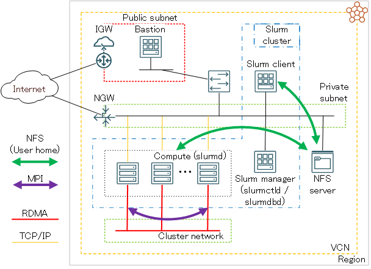

<style>
table, th, td {
    font-size: 80%;
}
</style>

# 0. 概要

**[Slurm](https://slurm.schedmd.com/)** は、超大規模並列アプリケーションの運用を想定して開発されているジョブスケジューラで、この際に問題となる初期化処理（MPIの場合 **MPI_Init** ）時間の増大等の大規模並列ジョブ特有の問題に対し、プラグインとして取り込む **[PMIx](https://pmix.github.io/)** の以下機能（※1）で、これらの問題に対処しています。

- Direct-connect
- Direct-connect UCX
- Direct-connect early wireup

※1）これら機能の詳細は、SC17で発表された以下のスライドで紹介されています。  
**[https://slurm.schedmd.com/SC17/Mellanox_Slurm_pmix_UCX_backend_v4.pdf](https://slurm.schedmd.com/SC17/Mellanox_Slurm_pmix_UCX_backend_v4.pdf)**

ここでMPIのオープンソース実装である **[OpenMPI](https://www.open-mpi.org/)** は、 **PMIx** をプラグインとして取り込んだ **Slurm** 環境で **Slurm** が提供するジョブ実行コマンド **srun** を使用してそのアプリケーションを実行する場合、 **[PRRTE](https://docs.prrte.org/en/latest/)** を使用する起動方法（ **mpirun** / **mpiexec** を起動コマンドに使用する方法）に対して、先の **PMIx** の初期化処理を含む以下の利点を享受することが出来ます。

- 高並列アプリケーションを高速に起動することが可能
- プロセスバインディングや終了処理等のプロセス管理を **Slurm** に統合することが可能
- 精度の高いアカウンティング情報を **Slurm** に提供することが可能
- **Slurm** クラスタ内のSSHパスフレーズ無しアクセス設定が不要

以上の利点を享受するべく本テクニカルTipsは、 **OpenMPI** のMPI並列アプリケーションを **PMIx** の大規模並列ジョブに対する利点を生かして実行することを念頭に、 **PMIx** と **[UCX](https://openucx.org/)** を取り込んだ **Slurm** 環境を構築し、初期化処理時間の効果を検証すべく、 **[OSU Micro-Benchmarks](https://mvapich.cse.ohio-state.edu/benchmarks/)** で2ノード間のレイテンシと4ノード間のMPI_Init所要時間に着目して比較・検証を実施します。

なお、 **Ubuntu** をOSとするNVIDIA製GPUを複数搭載するベアメタルインスタンスのGPUリソース管理やジョブ管理を **Slurm** で行う環境の構築方法は、 **[OCI HPCテクニカルTips集](../../#3-oci-hpcテクニカルtips集)** の **[Slurmによるリソース管理・ジョブ管理システム構築方法(Ubuntu OS編)](../setup-slurm-cluster-withubuntu/)** を参照してください。

# 1. 前提システム

本章は、本テクニカルTipsで解説する **Slurm** 環境構築手順の前提となるシステムを解説します。  
本テクニカルTipsは、このシステムが予め構築されている前提で、ここに **Slurm** 環境を構築する手順を解説します。

前提システムは、以下4種類のサブシステムから構成されます。  
また、必要に応じてこれらのサブシステムにログインするための踏み台となる、パブリックサブネットに接続するBastionノードを用意します。

| サブシステム          | 使用するシェイプ                                                                    | OS                           | ノード数           | 接続<br>サブネット                | 役割                                                           |
| :-------------: | :-------------------------------------------------------------------------: | :--------------------------: | :------------: | :------------------------: | :----------------------------------------------------------: |
| Slurm<br>マネージャ  | 任意の仮想マシン<br>                                                            | **Oracle Linux** 9.5<br>（※5）         | 1              | プライベート                     | ・ **slurmctld** と **slurmdbd** が<br>稼働するSlurm管理ノード                 |
| Slurm<br>クライアント | 任意の仮想マシン<br>                                                            | **Oracle Linux** 9.5<br>（※5） | 1              | プライベート                     | ・アプリケーション開発用<br>フロントエンドノード<br>・ **Slurm** にジョブを投入する<br>ジョブサブミッションクライアント |
| 計算ノード           | **[クラスタ・ネットワーク](../../#5-1-クラスタネットワーク)** 対応<br>ベアメタルシェイプ（※2） | **Oracle Linux** 9.5<br>（※5） | 2ノード以上<br>（※2） | プライベート<br> **クラスタ・ネットワーク** | ・ **slurmd** が稼働するジョブ実行ノード                                     |
| NFSサーバ          | -<br>（※3）                                                                   | -                            | 1              | プライベート                     | ・ジョブ投入ユーザのホームディレクトリを<br>NFSでサービス（※4）                              |



※2）本テクニカルTipsは、 **クラスタ・ネットワーク** に接続された4ノードの **[BM.Optimized3.36](https://docs.oracle.com/ja-jp/iaas/Content/Compute/References/computeshapes.htm#bm-hpc-optimized)** を、 **[OCI HPCパフォーマンス関連情報](../../#2-oci-hpcパフォーマンス関連情報)** の **[パフォーマンスに関連するベアメタルインスタンスのBIOS設定方法](../../benchmark/bios-setting/)** の手順に従い、 **Simultanious Multi Threading** （以降 **SMT** と呼称）を無効化して使用します。  
※3）**ファイル・ストレージ** やベア・メタル・インスタンスNFSサーバ等、任意の手法で構築されたNFSサーバです。NFSでサービスするファイル共有ストレージ構築方法は、 **[OCI HPCテクニカルTips集](../../#3-oci-hpcテクニカルtips集)** の **[HPC/GPUクラスタ向けファイル共有ストレージの最適な構築手法](../../tech-knowhow/howto-configure-sharedstorage/)** を参照してください。  
※4）NFSサーバがサービスするジョブ投入ユーザのホームディレクトリは、Slurmクライアントと計算ノードでNFSマウントします。  
※5）**Oracle Linux** 9.5ベースのHPC **[クラスタネットワーキングイメージ](../../#5-13-クラスタネットワーキングイメージ)** で、 **[OCI HPCテクニカルTips集](../../#3-oci-hpcテクニカルtips集)** の **[クラスタネットワーキングイメージの選び方](../../tech-knowhow/osimage-for-cluster/)** の **[1. クラスタネットワーキングイメージ一覧](../../tech-knowhow/osimage-for-cluster/#1-クラスタネットワーキングイメージ一覧)** のイメージ **No.13** です。Slurmマネージャは、計算ノードにインストールする **Slurm** のRPMをビルドするため、Slurmクライアントは、計算ノードのアプリケーション開発環境の役割を担うため、計算ノードと同じOSを採用します。

Slurmクライアントは、 **[OCI HPCテクニカルTips集](../../#3-oci-hpcテクニカルtips集)** の **[Slurm環境での利用を前提とするUCX通信フレームワークベースのOpenMPI構築方法（Oracle Linux 9編）](../build-openmpi-ol9/)** の手順に従い、 **OpenMPI** をインストールします。

計算ノードは、 **[OCI HPCチュートリアル集](../../#1-oci-hpcチュートリアル集)** の **[HPCクラスタを構築する(基礎インフラ手動構築編)](../../spinup-cluster-network/)** の手順に従う等で **[クラスタ・ネットワーク](../../#5-1-クラスタネットワーク)** に接続するHPCクラスタを構築し、 **[OCI HPCテクニカルTips集](../../#3-oci-hpcテクニカルtips集)** の **[Slurm環境での利用を前提とするUCX通信フレームワークベースのOpenMPI構築方法（Oracle Linux 9編）](../build-openmpi-ol9/)** の手順に従い、 **OpenMPI** を計算ノードにインストールします。

またSlurmクライアントと計算ノードは、**[OCI HPCパフォーマンス関連情報](../../#2-oci-hpcパフォーマンス関連情報)** の **[OSU Micro-Benchmarks実行方法（BM.Optimized3.36編）](../../benchmark/run-omb-hpc/)** の **[2. OSU Micro-Benchmarksインストール・セットアップ](../../benchmark/run-omb-hpc/#2-osu-micro-benchmarksインストールセットアップ)** の手順に従い、 **[3. 稼働確認](#3-稼働確認)** で使用する **OSU Micro-Benchmarks** をインストールします。

本テクニカルTipsの各サブシステムのホスト名は、以下とします。  
以降の章では、これらのホスト名を自身の環境に置き換えて使用して下さい。

| サブシステム      | ホスト名        |
| :---------: | :---------: |
| Slurmマネージャ  | slurm-srv   |
| Slurmクライアント | slurm-cli   |
| 計算ノード       | inst-aaaaa-x9<br>inst-bbbbb-x9<br>inst-ccccc-x9<br>inst-ddddd-x9 |

また、各サブシステムのセキュリティーに関するOS設定は、 **firewalld** を停止し、 **SELinux** をDisabledにします。

# 2. 環境構築

## 2-0. 概要

本章は、既に作成されている **[1. 前提システム](#1-前提システム)** で解説したシステム上で、 **Slurm** 環境を構築します。

**Slurm** のインストールは、多数の計算ノードに効率よくインストールする必要から、rpmbuildで作成するRPMパッケージによるインストール方法を採用します。

本テクニカルTipsは、各ソフトウェアに以下を使用します。

- **Slurm** ： 25.05.3
- **PMIx** ： **[OpenPMIx](https://openpmix.github.io/)** 5.0.8
- **UCX** ： **[OpenUCX](https://openucx.readthedocs.io/en/master/index.html#)** 1.19.0

また、 **Slurm** のプロセス間通信の認証に **[munge](https://dun.github.io/munge/)** 、ジョブのアカウンティング情報格納用RDBMSに **[MariaDB](https://mariadb.org/)** を使用します。

以上より、本章で解説する環境構築は、以下の手順に沿って行います。

1. **[mungeインストール・セットアップ](#2-1-munge-インストールセットアップ)**
2. **[MariaDBインストール・セットアップ](#2-2-mariadb-インストールセットアップ)**
3. **[OpenPMIxインストール](#2-3-openpmixインストール)**
4. **[OpenUCXインストール](#2-4-openucxインストール)**
5. **[Slurm RPMパッケージ作成](#2-5-slurm-rpmパッケージ作成)**
6. **[Slurm RPMパッケージインストール・セットアップ](#2-6-slurm-rpmパッケージインストールセットアップ)**
7. **[Slurm設定ファイル作成](#2-7-slurm設定ファイル作成)**
8. **[Slurmサービス起動](#2-8-slurmサービス起動)**
9. **[Slurm利用に必要な環境変数設定](#2-9-slurm利用に必要な環境変数設定)**

なお、各ソフトウェアと **Slurm** サービスは、以下のサブシステムにインストールします。

|                          | Slurmマネージャ | Slurmクライアント | 計算ノード |
| :----------------------: | :--------: | :---------: | :---: |
| **munge**                | 〇          | 〇           | 〇     |
| **MariaDB**              | 〇          | -           | -     |
| **OpenPMIx**             | 〇          | 〇（※6）       | 〇（※6） |
| **OpenUCX**              | 〇          | 〇（※6）       | 〇（※6） |
| **slurmctld**            | 〇          | -           | -     |
| **slurmdbd**             | 〇          | -           | -     |
| **slurmd**               | -          | -           | 〇     |
| **Slurm**<br>クライアントパッケージ | 〇          | 〇           | 〇     |

※6）**[1. 前提システム](#1-前提システム)** の構築手順により既にインストールされています。

## 2-1. munge インストール・セットアップ

本章は、Slurmマネージャ、Slurmクライアント、及び全ての計算ノードに **munge** をインストール・セットアップします。

以下コマンドを対象となる全ノードのopcユーザで実行し、 **munge** プロセス起動ユーザを作成します。

```sh
$ sudo useradd -m -d /var/lib/munge -s /sbin/nologin -u 5001 munge
```

次に、以下コマンドを対象となる全ノードのopcユーザで実行し、 **munge** をインストールします。

```sh
$ sudo yum-config-manager --enable ol9_codeready_builder
$ sudo dnf install -y munge munge-libs
```

次に、以下コマンドをSlurmマネージャのopcユーザで実行し、 **munge** キーファイル（ **munge.key** ）を作成します。

```sh
$ sudo /usr/sbin/create-munge-key
Generating a pseudo-random key using /dev/urandom completed.
$ sudo ls -la /etc/munge
total 16
drwx------.   2 munge munge   23 Nov 24 14:34 .
drwxr-xr-x. 115 root  root  8192 Nov 24 14:33 ..
-r--------.   1 munge munge 1024 Nov 24 14:34 munge.key
$ 
```

次に、先にSlurmマネージャで作成した **munge** キーファイルを、Slurmクライアントと全ての計算ノードに同一パス・ファイル名でコピーします。  
この際、ファイルのオーナーとパーミッションがSlurmマネージャのキーファイルと同じとなるよう配慮します。

次に、以下コマンドを対象となる全ノードのopcユーザで実行し、 **munge** サービスを起動します。

```sh
$ sudo systemctl enable --now munge.service
```

次に、以下コマンドを対象となる全ノードのopcユーザで実行し、 **munge** が全てのノードで正常に動作していることを確認します。

```sh
$ munge -n | unmunge | grep STATUS
STATUS:           Success (0)
$
```

## 2-2. MariaDB インストール・セットアップ

本章は、Slurmマネージャに **MariaDB** をインストール・セットアップします。

以下コマンドをopcユーザで実行し、 **MariaDB** をインストールします。

```sh
$ sudo dnf install -y mariadb-server
```

次に、 **MariaDB** の設定ファイル（ **mariadb-server.cnf** ）の **[mysqld]** フィールドに以下の記述を追加します。

```sh
$ sudo diff /etc/my.cnf.d/mariadb-server.cnf_org  /etc/my.cnf.d/mariadb-server.cnf
21a22,23
> innodb_buffer_pool_size=4096M
> innodb_lock_wait_timeout=900
$
```

次に、以下コマンドをopcユーザで実行し、 **MariaDB** サービスを起動します。

```sh
$ sudo systemctl enable --now mariadb
```

次に、 **MariaDB** のデータベースに以下の登録を行うため、

- データベース（slurm_acct_db）
- ユーザ（slurm）
- ユーザ（slurm）のパスワード
- ユーザ（slurm）に対するデータベース（slurm_acct_db）への全権限付与

以下コマンドをopcユーザで実行します。  
なお、 **MariaDB** に対して入力するコマンドは、 **MariaDB** のプロンプト（ **MariaDB [(none)]>** ）に続く文字列です。  
また、コマンド中の **passcord** は、自身の設定するパスワードに置き換えます。

```sh
$ sudo mysql
Welcome to the MariaDB monitor.  Commands end with ; or \g.
Your MariaDB connection id is 8
Server version: 10.3.39-MariaDB MariaDB Server

Copyright (c) 2000, 2018, Oracle, MariaDB Corporation Ab and others.

Type 'help;' or '\h' for help. Type '\c' to clear the current input statement.

MariaDB [(none)]> create database slurm_acct_db;
Query OK, 1 row affected (0.000 sec)

MariaDB [(none)]> create user 'slurm'@'localhost' identified by 'SLURM';
Query OK, 0 rows affected (0.000 sec)

MariaDB [(none)]> set password for slurm@localhost = password('passcord');
Query OK, 0 rows affected (0.000 sec)

MariaDB [(none)]> grant all on slurm_acct_db.* TO 'slurm'@'localhost';
Query OK, 0 rows affected (0.000 sec)

MariaDB [(none)]> FLUSH PRIVILEGES;
Query OK, 0 rows affected (0.000 sec)

MariaDB [(none)]> exit
Bye
$
```

次に、以下コマンドをopcユーザで実行し、先に登録したデータベースとユーザが正しく登録されていることを確認します。  
なお、コマンド中の **passcord** は、自身の設定したパスワードに置き換えます。

```sh
$ mysql --user=slurm --password=passcord slurm_acct_db -e 'show databases;'
+--------------------+
| Database           |
+--------------------+
| information_schema |
| slurm_acct_db      |
+--------------------+
$
```


## 2-3. OpenPMIxインストール

本章は、Slurmマネージャに **OpenPMIx** をインストールします。

以下コマンドをSlurmマネージャのopcユーザで実行し、 **OpenPMIx** を **/opt** ディレクトリにインストールします。  
なお、makeコマンドの並列数は当該ノードのコア数に合わせて調整します。

```sh
$ sudo dnf install -y ncurses-devel openssl-devel gcc-c++ gcc-gfortran
$ mkdir ~/`hostname` && cd ~/`hostname` &&  wget https://github.com/libevent/libevent/releases/download/release-2.1.12-stable/libevent-2.1.12-stable.tar.gz
$ tar -xvf ./libevent-2.1.12-stable.tar.gz
$ cd libevent-2.1.12-stable && ./configure --prefix=/opt/libevent
$ make -j 16 && sudo make install
$ cd ~/`hostname` && wget https://download.open-mpi.org/release/hwloc/v2.12/hwloc-2.12.2.tar.gz
$ tar -xvf ./hwloc-2.12.2.tar.gz
$ cd hwloc-2.12.2 && ./configure --prefix=/opt/hwloc
$ make -j 16 && sudo make install
$ cd ~/`hostname` && wget https://github.com/openpmix/openpmix/releases/download/v5.0.8/pmix-5.0.8.tar.gz
$ tar -xvf ./pmix-5.0.8.tar.gz
$ cd pmix-5.0.8 && ./configure --prefix=/opt/pmix --with-libevent=/opt/libevent --with-hwloc=/opt/hwloc
$ make -j 16 && sudo make install
```

## 2-4. OpenUCXインストール

本章は、Slurmマネージャに **OpenUCX** をインストールします。

以下コマンドをSlurmマネージャのopcユーザで実行し、 **OpenUCX** を **/opt** ディレクトリにインストールします。  
なお、makeコマンドの並列数は当該ノードのコア数に合わせて調整します。

```sh
$ cd ~/`hostname` && wget https://github.com/openucx/ucx/releases/download/v1.19.0/ucx-1.19.0.tar.gz
$ tar -xvf ./ucx-1.19.0.tar.gz
$ cd ucx-1.19.0 && ./contrib/configure-release --prefix=/opt/ucx
$ make -j 16 && sudo make install
```

## 2-5. Slurm RPMパッケージ作成

本章は、SlurmマネージャでRPMパッケージを作成します。

以下コマンドをSlurmマネージャのopcユーザで実行し、前提RPMパッケージをインストールします。

```sh
$ sudo yum-config-manager --enable ol9_codeready_builder
$ sudo dnf install -y mariadb-devel munge-devel pam-devel readline-devel dbus-devel
```

次に、以下コマンドをSlurmマネージャのopcユーザで実行し、 **Slurm** RPMパッケージを作成します。

```sh
$ cd ~/`hostname` && wget https://download.schedmd.com/slurm/slurm-25.05.3.tar.bz2
$ rpmbuild --define '_prefix /opt/slurm' --define '_slurm_sysconfdir /opt/slurm/etc' --define '_with_pmix --with-pmix=/opt/pmix' --define '_with_ucx --with-ucx=/opt/ucx' -ta ./slurm-25.05.3.tar.bz2
```

作成されたパッケージは、以下のディレクトリに配置されるので、これらの全ファイルを他のサブシステムにコピーします。

```sh
$ ls -1 ~/rpmbuild/RPMS/x86_64/
slurm-25.05.3-1.el9.x86_64.rpm
slurm-contribs-25.05.3-1.el9.x86_64.rpm
slurm-devel-25.05.3-1.el9.x86_64.rpm
slurm-example-configs-25.05.3-1.el9.x86_64.rpm
slurm-libpmi-25.05.3-1.el9.x86_64.rpm
slurm-openlava-25.05.3-1.el9.x86_64.rpm
slurm-pam_slurm-25.05.3-1.el9.x86_64.rpm
slurm-perlapi-25.05.3-1.el9.x86_64.rpm
slurm-sackd-25.05.3-1.el9.x86_64.rpm
slurm-slurmctld-25.05.3-1.el9.x86_64.rpm
slurm-slurmd-25.05.3-1.el9.x86_64.rpm
slurm-slurmdbd-25.05.3-1.el9.x86_64.rpm
slurm-torque-25.05.3-1.el9.x86_64.rpm
$
```

## 2-6. Slurm RPMパッケージインストール・セットアップ

本章は、先に作成した **Slurm** RPMパッケージを各サブシステムにインストールし、必要なセットアップ作業を実施します。

以下コマンドをSlurmマネージャのopcユーザで実行し、Slurmマネージャに必要な **Slurm** RPMパッケージのインストール・セットアップを行います。

```sh
$ cd ~/rpmbuild/RPMS/x86_64/ && sudo rpm -ivh ./slurm-25.05.3-1.el9.x86_64.rpm ./slurm-slurmctld-25.05.3-1.el9.x86_64.rpm ./slurm-slurmdbd-25.05.3-1.el9.x86_64.rpm ./slurm-perlapi-25.05.3-1.el9.x86_64.rpm
$ sudo useradd -m -d /var/lib/slurm -s /bin/bash -u 5000 slurm
$ sudo mkdir /var/spool/slurmctld && sudo chown slurm:slurm /var/spool/slurmctld
$ sudo mkdir /var/spool/slurmd && sudo chown slurm:slurm /var/spool/slurmd
$ sudo mkdir /var/log/slurm && sudo chown slurm:slurm /var/log/slurm
$ sudo mkdir /opt/slurm/etc && sudo chown slurm:slurm /opt/slurm/etc
$ sudo su - slurm
$ echo "export PATH=/opt/slurm/sbin:/opt/slurm/bin:\$PATH" | tee -a ~/.bashrc
```

次に、以下コマンドを全ての計算ノードのopcユーザで **Slurm** RPMパッケージをコピーしたディレクトリで実行し、計算ノードに必要な **Slurm** RPMパッケージのインストール・セットアップを行います。

```sh
$ sudo yum-config-manager --enable ol9_codeready_builder
$ sudo dnf install -y mariadb-devel
$ sudo rpm -ivh ./slurm-25.05.3-1.el9.x86_64.rpm ./slurm-slurmd-25.05.3-1.el9.x86_64.rpm ./slurm-perlapi-25.05.3-1.el9.x86_64.rpm
$ sudo useradd -m -d /var/lib/slurm -s /bin/bash -u 5000 slurm
$ sudo mkdir /var/spool/slurmd && sudo chown slurm:slurm /var/spool/slurmd
$ sudo mkdir /var/log/slurm && sudo chown slurm:slurm /var/log/slurm
$ sudo mkdir /opt/slurm/etc && sudo chown slurm:slurm /opt/slurm/etc
```

次に、以下コマンドをSlurmクライアントのopcユーザで **Slurm** RPMパッケージをコピーしたディレクトリで実行し、Slurmクライアントに必要な **Slurm** RPMパッケージのインストール・セットアップを行います。

```sh
$ sudo yum-config-manager --enable ol9_codeready_builder
$ sudo dnf install -y mariadb-devel
$ sudo rpm -ivh ./slurm-25.05.3-1.el9.x86_64.rpm ./slurm-perlapi-25.05.3-1.el9.x86_64.rpm
$ sudo useradd -m -d /var/lib/slurm -s /bin/bash -u 5000 slurm
$ sudo mkdir /opt/slurm/etc && sudo chown slurm:slurm /opt/slurm/etc
```

## 2-7. Slurm設定ファイル作成

本章は、以下3種類の **Slurm** 設定ファイルを作成し、これらを各サブシステムの **/opt/slurm/etc** ディレクトリに配布します。  
この際、これらファイルのオーナーユーザ・オーナーグループを **slurm** とします。  
また、 **slurmdbd.conf** のパーミッションを **600** に設定します。

- **slurm.conf**（全てのサブシステム）
- **slurmdbd.conf**（Slurmマネージャ）
- **mpi.conf**（Slurmマネージャ）

[ **slurm.conf** ]
```sh
ClusterName=sltest
SlurmctldHost=slurm-srv
AuthType=auth/munge
PluginDir=/opt/slurm/lib64/slurm
SchedulerType=sched/backfill
SelectType=select/linear
SlurmUser=slurm
SlurmctldPort=7002
SlurmctldTimeout=300
SlurmdPort=7003
SlurmdSpoolDir=/var/spool/slurmd
SlurmdTimeout=300
SlurmctldLogFile=/var/log/slurm/slurmctld.log
SlurmdLogFile=/var/log/slurm/slurmd.log
SlurmdDebug=3
StateSaveLocation=/var/spool/slurmd
SwitchType=switch/none
AccountingStorageType=accounting_storage/slurmdbd
AccountingStorageHost=slurm-srv
AccountingStoragePort=7004
MpiDefault=pmix
NodeName=inst-aaaaa-x9,inst-bbbbb-x9,inst-ccccc-x9,inst-ddddd-x9 CPUs=36 Boards=1 SocketsPerBoard=2 CoresPerSocket=18 ThreadsPerCore=1 RealMemory=500000 TmpDisk=10000 State=UNKNOWN
PartitionName=sltest Nodes=ALL Default=YES MaxTime=INFINITE State=UP
TaskPlugin=task/affinity
```

なお、 **SlurmctldHost** 、 **AccountingStorageHost** 、及び **NodeName** の設定値は、自身の環境に合わせて修正します。

[ **slurmdbd.conf** ]
```sh
ArchiveEvents=yes
ArchiveJobs=yes
ArchiveResvs=yes
ArchiveSteps=no
ArchiveSuspend=no
ArchiveTXN=no
ArchiveUsage=no
AuthType=auth/munge
AuthInfo=/var/run/munge/munge.socket.2
DbdHost=slurm-srv
DbdPort=7004
DebugLevel=info
PurgeEventAfter=1month
PurgeJobAfter=12month
PurgeResvAfter=1month
PurgeStepAfter=1month
PurgeSuspendAfter=1month
PurgeTXNAfter=12month
PurgeUsageAfter=24month
LogFile=/var/log/slurm/slurmdbd.log
PidFile=/var/run/slurmdbd/slurmdbd.pid
SlurmUser=slurm
StorageType=accounting_storage/mysql
StorageUser=slurm
StoragePass=passcord
StorageLoc=slurm_acct_db
```

なお、 **DbdHost** と **StoragePass** の設定値は、自身の環境に合わせて修正します。

[ **mpi.conf** ]

```sh
PMIxDirectConnEarly=true
PMIxDirectConnUCX=true
```

## 2-8. Slurmサービス起動

本章は、 **Slurm** の各systemdサービスを対象のサブシステムで起動します。

以下コマンドを全ての計算ノードのopcユーザで実行し、 **slurmd** を起動します。

```sh
$ sudo systemctl enable --now slurmd
```

次に、以下コマンドをSlurmマネージャのopcユーザで実行し、 **slurmdbd** と **slurmctld** を起動します。

```sh
$ sudo systemctl enable --now slurmdbd
$ sudo systemctl enable --now slurmctld
```

次に、以下コマンドをSlurmマネージャのslurmユーザで実行し、全ての計算ノードがアイドルになっていることを確認します。

```sh
$ sinfo
PARTITION AVAIL  TIMELIMIT  NODES  STATE NODELIST
sltest*      up   infinite      4   idle inst-aaaaa-x9,inst-bbbbb-x9,inst-ccccc-x9,inst-ddddd-x9
$
```

次に、以下コマンドをSlurmマネージャのslurmユーザで実行し、 **PMIx** が利用可能になっていることを確認します。

```sh
$ srun --mpi=list
MPI plugin types are...
	none
	cray_shasta
	pmi2
	pmix
specific pmix plugin versions available: pmix_v5
$
```

## 2-9. Slurm利用に必要な環境変数設定

以下コマンドをSlurmクライアントのジョブ投入ユーザで実行し、 **Slurm** を利用するための環境変数を設定します。

```sh
$ echo "export PATH=/opt/slurm/sbin:/opt/slurm/bin:\$PATH" | tee -a ~/.bashrc
```

# 3. 稼働確認

本章は、構築した **Slurm** 環境の稼働確認と **PMIx** の効果を確認するため、 **OSU Micro-Benchmarks** で2ノード間のレイテンシと4ノード間のMPI_Init所要時間をバッチジョブとインタラクティブで計測し、その結果を比較します。  
またこのバッチジョブがアカウンティング情報に記録されていることを確認します。

以下のスクリプトをファイル名 **srun.sh** で作成します。

```sh
#!/bin/bash
#SBATCH -p sltest
#SBATCH -n 144
#SBATCH -N 4
#SBATCH -J srun
#SBATCH -o stdout.%J
#SBATCH -e stderr.%J

module load openmpi omb
export UCX_NET_DEVICES=mlx5_2:1

echo "Start osu_latency"
srun -n 2 -N 2 osu_latency -x 1000 -i 10000 -m 1:1
echo
echo "Start osu_init"
srun osu_init
```

次に、以下コマンドをSlurmクライアントのジョブ投入ユーザで実行し、バッチジョブの投入とその結果確認を行います。

```sh
$ sbatch srun.sh
Submitted batch job 3
$ cat stdout.3
Start osu_latency

# OSU MPI Latency Test v7.5
# Datatype: MPI_CHAR.
# Size       Avg Latency(us)
1                       1.51

Start osu_init
# OSU MPI Init Test v7.5
nprocs: 144, min: 2032 ms, max: 2054 ms, avg: 2048 ms
$
```

次に、以下のコマンドを計算ノードのうちの1ノードでジョブ投入ユーザで実行し、インタラクティブに **mpirun** で起動する場合の結果を確認します。

```sh
$ module load openmpi omb
$ mpirun -n 2 -N 1 -hostfile ~/hostlist.txt -x UCX_NET_DEVICES=mlx5_2:1 -x PATH osu_latency -x 1000 -i 10000 -m 1:1
[inst-xsyjo-x9-ol905:263038] SET UCX_NET_DEVICES=mlx5_2:1

# OSU MPI Latency Test v7.5
# Datatype: MPI_CHAR.
# Size       Avg Latency(us)
1                       1.67
$ mpirun -n 144 -N 36 -hostfile ~/hostlist.txt -x UCX_NET_DEVICES=mlx5_2:1 -x PATH osu_init
[inst-ntoae-x9-ol810:52203] SET UCX_NET_DEVICES=mlx5_2:1
# OSU MPI Init Test v7.5
nprocs: 144, min: 2163 ms, max: 2215 ms, avg: 2182 ms
$
```

この結果より、2ノード間のレイテンシが約 **0.2 μ秒** 改善されていることがわかります。  
4ノード間のMPI_Init所要時間は、目立った差異が見られませんが、16ノード576MPIプロセスでその差を比較した場合は、以下のように **20パーセント** 程度の性能向上が見られます。

|          | 4ノード間のMPI_Init所要時間 |
| :------: | ------------------: |
| バッチジョブ   | 3,878 ms           |
| インタラクティブ | 4,981 ms           |

次に、以下コマンドをSlurmクライアントのジョブ投入ユーザで実行し、終了したジョブのアカウンティング情報を取得できることを確認します。

```sh
$ sacct -j 3 -o JobID,User,AllocCPUS,Start,End
JobID             User  AllocCPUS               Start                 End 
------------ --------- ---------- ------------------- ------------------- 
3                usera         72 2024-06-19T21:18:21 2024-06-19T21:18:23 
3.batch                        36 2024-06-19T21:18:21 2024-06-19T21:18:23 
3.0                            72 2024-06-19T21:18:22 2024-06-19T21:18:23 
$
```