<style>
table, th, td {
    font-size: 80%;
}
</style>

# 0. 概要

**[サイト間VPN](https://docs.oracle.com/ja-jp/iaas/Content/Network/Tasks/managingIPsec.htm)** は、IPSecのトンネルモードを使用するOCIのマネージドVPN接続サービスで、オンプレミスのネットワークとOCIの **仮想クラウド・ネットワーク** をIP層で拠点間接続するため、以下のような利用形態をセキュアでシームレスに実現することが可能です。

1. OCI側計算ノードでオンプレミス側ライセンスサーバ管理のアプリケーションライセンスを取得
2. オンプレミス側端末からOCI側ログインノードにログインしインタラクティブ処理を実行
3. オンプレミス側端末からOCI側ログインノードにシミュレーション入力データを転送
4. OCI側ログインノードからオンプレミス側端末にシミュレーション出力データを転送

また **サイト間VPN** は、サービス自体は無償のサービスでパブリックインターネットを拠点間接続回線に利用するため、OCIからオンプレミスに向けた転送データ量が少ない利用形態 **1.** から **3.** のケースでは、他の有料専用線サービスと比較し、価格を抑えた拠点間接続が可能です。  
また **サイト間VPN** を介する拠点間の通信帯域は、使用するインターネット接続回線に十分な余力がある場合サービス自体の性能上限として250Mbps程度を期待することが出来るため（詳細は、 **[ここ](https://blogs.oracle.com/cloud-infrastructure/post/interconnecting-clouds-with-oracle-cloud-infrastructure)** を参照してください。）、高い通信帯域を必要としない前述の利用形態 **1.** や **2.** のケースではパフォーマンス的にも十分な拠点間接続方法であると言えます。  
また **サイト間VPN** を使用する拠点間接続の冗長性は、以下の観点で考慮する必要がありますが、本テクニカルTipsの手順で作成する拠点間接続は、観点 **1.** のみ実施（以降の **[2-6. IPSec接続作成](#2-6-ipsec接続作成)** で作成する2個のトンネルがそれぞれVPNヘッドエンドを持ちます。）されています。観点 **2.** と **3.** の冗長化が必要な場合は、 **[ここ](https://speakerdeck.com/ocise/ociji-shu-zi-liao-wai-bu-jie-sok-vpnjie-sok-xiang-xi?slide=11)** の情報が参考になります。

1. OCI側VPNヘッドエンドの冗長化
2. オンプレミス側VPN接続機器の冗長化
3. オンプレミス側インターネット接続回線の冗長化

ここで **サイト間VPN** によるオンプレミスとOCIの拠点間接続は、いくつかの接続形態が用意されており、オンプレミス側の現状や各接続形態の特徴を考慮し、接続作業の第一ステップとしてどの接続形態を採用するかを決定する必要があります。

また本テクニカルTipsは、拠点間が想定通り接続されていることを確認するため、オンプレミス側のプライベートネットワークに接続するライセンスサーバ相当のインスタンスとOCI側のプライベートサブネットに接続する計算ノード相当のインスタンス間でpingとSSHによる疎通確認を行います。

以上より、次章以降では以下の順に解説を進めます。

1. **[接続形態の決定](#1-接続形態の決定)**
2. **[拠点間接続の作成](#2-拠点間接続の作成)**
3. **[ライセンスサーバ・計算ノード間疎通確認](#3-ライセンスサーバ計算ノード間疎通確認)**

**注意 :** 本コンテンツ内の画面ショットは、現在のOCIコンソール画面と異なっている場合があります。

# 1. 接続形態の決定

## 1-0. 概要

本章は、以下の観点からオンプレミスとOCIの拠点間接続形態を決定します。

[観点]

1. オンプレミス側VPN接続機器に何を使用するか  
オンプレミス側のVPN接続機器にVPNアプライアンス製品を使用するかIPSecのソフトウェア実装を使用するかを決定します。
2. オンプレミス側VPN接続機器をどのネットワークに接続するか  
オンプレミス側VPN接続機器をパブリックネットワークに接続するかプライベートネットワークに接続するかを決定します。
3. オンプレミスとOCIのルーティング情報をどのように交換するか  
オンプレミスとOCIのルーティング情報を静的ルーティング・BGP動的ルーティングのどちらで交換するかを決定します。

ここで、 **観点1** と観点 **観点2** の組み合わせを考慮すると、以下3種類の接続形態が存在します。

[接続形態]

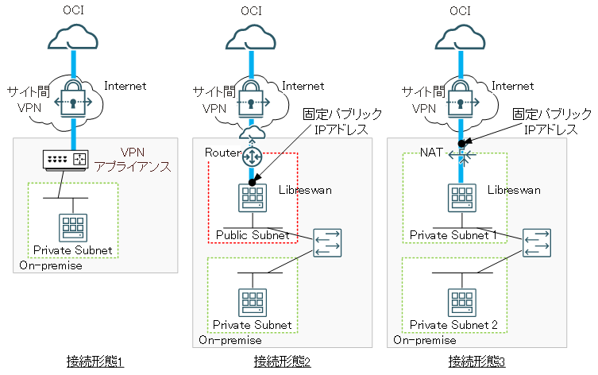

また、この3種類の接続形態に **観点3** が加わり、最終的には以下6種類の接続形態が存在します。

- **接続形態1** - 静的ルーティング
- **接続形態1** - BGP動的ルーティング
- **接続形態2** - 静的ルーティング
- **接続形態2** - BGP動的ルーティング
- **接続形態3** - 静的ルーティング
- **接続形態3** - BGP動的ルーティング

以降は、 **観点1** から **観点3** を順に考察し、これら6種類から最適な接続形態を選択する方法を解説します。

接続形態が確定したら、 **[2. 拠点間接続の作成](#2-拠点間接続の作成)** に進み、各接続形態毎に用意されている手順にしたがい拠点間を接続します。

## 1-1. オンプレミス側VPN接続機器の決定

**サイト間VPN** と接続するオンプレミス側のVPN接続機器は、以下の選択肢があります。

[選択肢]

1. VPNアプライアンス製品（※1）を使用する
2. サーバ上で動作するIPSec実装（※2）/BGP実装を使用する（※3）

※1） **サイト間VPN** サービスで検証された **[ここ](https://docs.oracle.com/ja-jp/iaas/Content/Network/Reference/CPElist.htm)** に記載のVPNアプライアンス製品から選択します。  
※2） **サイト間VPN** サービスで検証された **[Libreswan](https://libreswan.org/)** か **[strongSwan](https://www.strongswan.org/)** から選択します。  
※3）本テクニカルTipsは、それぞれで以下のオープンソースのソフトウェア実装で解説します。

| ルーティング | IPSec実装            | BGP実装                                              |
| :----: | :----------------: | :------------------------------------------------: |
| 静的     | **Libreswan** 4.15 | -                                                  |
| BGP動的  | **Libreswan** 4.15 | **[FRR（FRRouting）](https://frrouting.org/)** 8.5.3 |
|        |                    |                                                    |

このため、 **サイト間VPN** サービスで検証されたVPNアプライアンス製品が既にオンプレミスで稼働している場合は **選択肢1** を採用し、それ以外は **選択肢2** を採用します。

ここで、 **選択肢1** を採用すると **接続形態1** となり、 **[1-3. オンプレミス・OCI間ルーティン情報交換方式の決定](#1-3-オンプレミスoci間ルーティン情報交換方式の決定)** に進みます。  
また **選択肢2** を採用する場合は、 **[1-2. オンプレミス側VPN接続機器のネットワーク接続形態の決定](#1-2-オンプレミス側vpn接続機器のネットワーク接続形態の決定)** に進み、 **接続形態2** と **接続形態3** のどちらを採用するかを判断します。

## 1-2. オンプレミス側VPN接続機器のネットワーク接続形態の決定

**選択肢2** のオンプレミス側VPN接続機器は、パブリックサブネットに接続する **接続形態2** とプライベートサブネットに接続する **接続形態3** から選択することが可能で、以下の各接続形態の必要条件を自身のオンプレミス環境に照らし合わせて判断します。

| 接続形態 | 必要条件                                                                                                                                                           |
| :--: | -------------------------------------------------------------------------------------------------------------------------------------------------------------- |
| 2    | ・VPN接続機器をパブリックサブネットに接続<br>・このパブリックサブネットを拠点間通信対象のプライベートサブネットとルーティング<br>・VPN接続機器に固定パブリックIPアドレスを付与                                                            |
| 3    | ・VPN接続機器をNAT経由IPSecで外部アクセス可能なプライベートサブネットに接続<br>・このプライベートサブネットを拠点間通信対象のプライベートサブネットとルーティング<br>・NATのインターネット側パブリックIPアドレスが自明<br>・NATのインターネット側パブリックIPアドレスが固定 |

 **接続形態2** と **接続形態3** のどちらを採用するかを決定したら、 **[1-3. オンプレミス・OCI間ルーティン情報交換方式の決定](#1-3-オンプレミスoci間ルーティン情報交換方式の決定)** に進みます。

## 1-3. オンプレミス・OCI間ルーティン情報交換方式の決定

ルーティング情報交換方式は、静的ルーティングとBGP動的ルーティングが選択でき、以下の利点・欠点を考慮して決定します。

|       | 利点                              | 欠点                                  |
| :---: | ------------------------------- | ----------------------------------- |
| 静的    | ・BGP動的と比較して初期構築手順が簡素            | ・オンプレミス側ルーティング情報変更時OCI側の設定変更が必要 |
| BGP<br>動的 | ・オンプレミス側ルーティング情報変更時OCI側の対応不要 | ・静的と比較して初期構築手順が煩雑                   |

# 2. 拠点間接続の作成

## 2-0. 概要

本章は、 **[1. 接続形態の決定](#1-接続形態の決定)** で確定した接続形態毎に用意された手順にしたがい、拠点間接続を作成します。

本テクニカルTipsは、検証に使用できるリソースの制約から、VPN接続機器に **選択肢2** のサーバ上で動作するIPSec/BGP実装を使用し、これをオンプレミスのネットワークに模したOCIの **仮想クラウド・ネットワーク** （以降"左側サイト"と呼称）に作成、左側サイトとは異なるリージョンに作成する **仮想クラウド・ネットワーク** （以降"右側サイト"と呼称）を **サイト間VPN** で拠点間接続する手順を解説します。  
このため、本テクニカルTipsの左側サイトに関連する手順をオンプレミスのネットワークに置き換え、またVPN接続機器の **選択肢2** に関連する手順を **選択肢1** のVPNアプライアンス製品のものに置き換えることで、自身の環境に合わせた拠点間接続構築手順とします。

以下は、本テクニカルTipsで想定する各接続形態ごとのシステム構成図です。

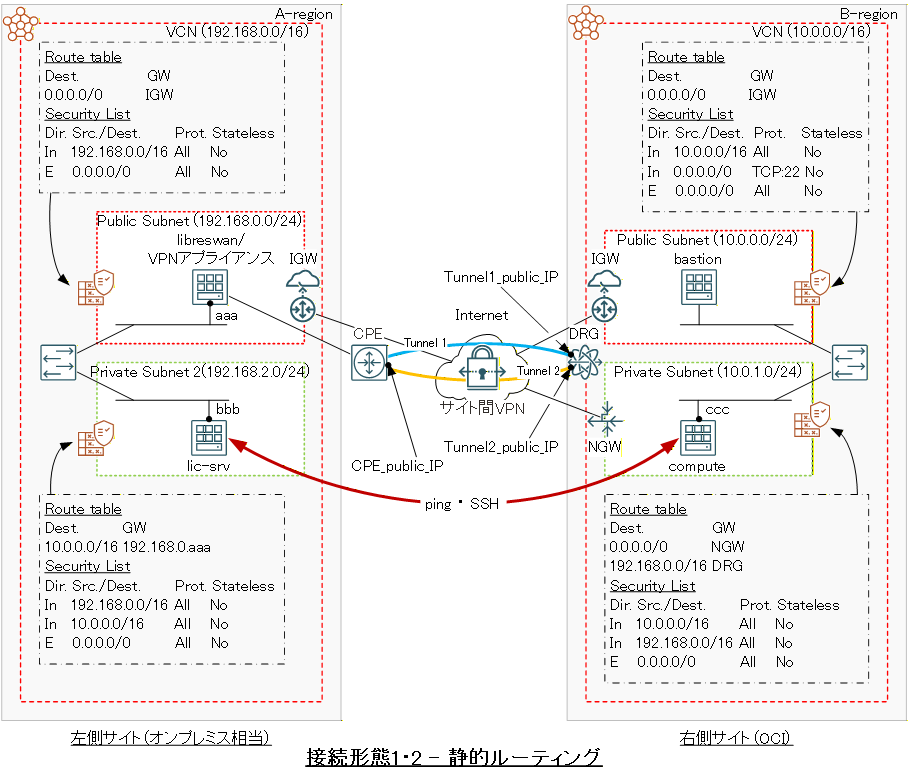
<br>
<br>
<br>
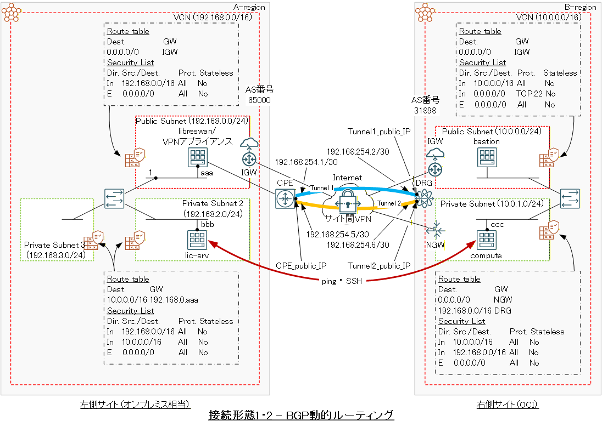
<br>
<br>
<br>
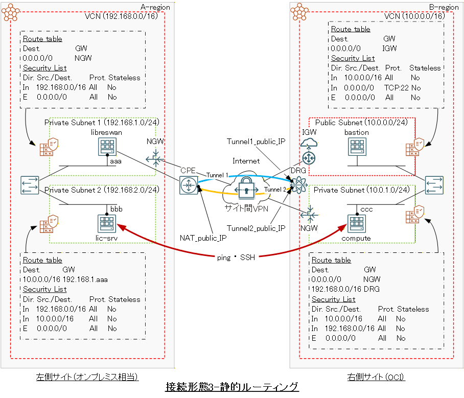
<br>
<br>
<br>
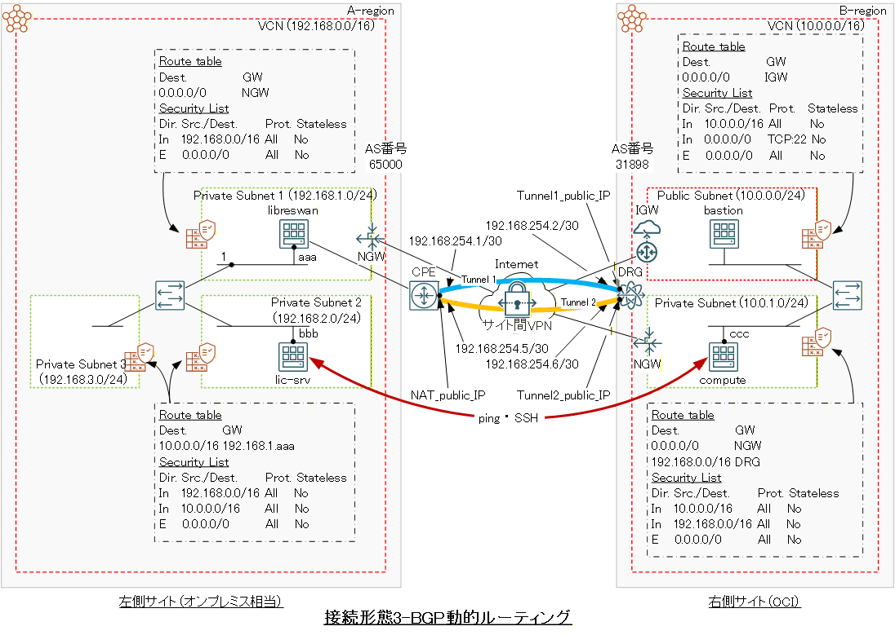

記載されるネットワークアドレス等は、自身の環境のものに読みかえてご利用ください。

次章以降では、以下の順に解説を進めます。  
括弧内の記述は、対象の手順をどちらのサイトで実施するかを示しています。

1. **[左側サイト用ネットワーク関連リソース作成](#2-1-左側サイト用ネットワーク関連リソース作成)** （左側サイト）
2. **[右側サイト用仮想クラウド・ネットワークと関連リソース作成](#2-2-右側サイト用仮想クラウドネットワークと関連リソース作成)** （右側サイト）
3. **[疎通確認用インスタンス作成](#2-3-疎通確認用インスタンス作成)** （左側サイト・右側サイト）
4. **[Libreswan用インスタンス作成](#2-4-libreswan用インスタンス作成)** （左側サイト）
5. **[拠点間接続関連OCIリソース作成](#2-5-拠点間接続関連ociリソース作成)** （右側サイト）
6. **[IPSec接続作成](#2-6-ipsec接続作成)** （右側サイト）
7. **[VPN接続機器セットアップ](#2-7-vpn接続機器セットアップ)** （左側サイト）

なお **接続形態1** を採用する場合は、 **手順4** をスキップします。

## 2-1. 左側サイト用ネットワーク関連リソース作成

以下の左側サイト用ネットワーク関連リソースを作成します。  
ここで本テクニカルTipsの左側サイトのネットワーク関連リソースは、右側サイトと同一テナンシーの異なるリージョンに作成する **仮想クラウド・ネットワーク** と関連するリソースでこれを模しており、適宜オンプレミスのネットワークでの手順に置き換えて作成します。

1. **仮想クラウド・ネットワーク** （192.168.0.0/16）
2. パブリックサブネット（192.168.0.0/24）（ **接続形態2** ）
3. プライベートサブネット1（192.168.1.0/24）（ **接続形態3** ）
4. プライベートサブネット2-3（192.168.2-3.0/24）
5. **インターネット・ゲートウェイ** （ **接続形態2** ）
6. **NATゲートウェイ** （ **接続形態3** ）
7. パブリックサブネット用 **ルート表** （ **接続形態1** ・ **接続形態2** ）
8. プライベートサブネット用 **ルート表**
9. パブリックサブネット用 **セキュリティ・リスト** （ **接続形態1** ・ **接続形態2** ）
10. プライベートサブネット用 **セキュリティ・リスト**

**ルート表** に含める **ルート・ルール** と **セキュリティ・リスト** は、下表のとおりです。

[ **接続形態1** ・ **接続形態2** ]

| 対象サブネット   | Destination | Gateway            | Purpose                  |
| :-------: | :---------: | :----------------: | ------------------------ |
| パブリック     | 0.0.0.0/0   | **インターネット・ゲートウェイ** | 右側サイトとのトラフィック            |
| プライベート2・3 | 10.0.0.0/16 | 192.168.0.aaa （※4）  | 右側サイトとのトラフィック |

| 対象サブネット   | Direction | Source/<br>Destination | Protocol | Stateless  | Purpose                                         |
| :-------: | :-------: | :--------------------: | :------: | :--------: | ----------------------------------------------- |
| パブリック     | Ingress   | 192.168.0.0/16         | All      | No         | 左側サイトからのアクセス                         |
|           | Egress    | 0.0.0.0/0              | All      | No<br>（※5） | 左側サイトへのアクセス<br>右側サイトへのアクセス           |
| プライベート2・3 | Ingress   | 192.168.0.0/16         | All      | No         | 左側サイトからのアクセス                          |
|           | Ingress   | 10.0.0.0/16            | All      | No         | 右側サイトからのアクセス                         |
|           | Egress    | 0.0.0.0/0              | All      | No         | 左側サイトへのアクセス<br>右側サイトへのサクセス |

※4）VPN接続機器のプライベートIPアドレスです。 **接続形態2** の場合は、 **[2-4. Libreswan用インスタンス作成](#2-4-libreswan用インスタンス作成)** でインスタンスを作成してIPアドレスを確定した後この **ルート・ルール** を作成します。  
※5）**IPSec接続** 作成時VPN接続機器が **ステートフル・エグレス** ルールで右側サイトからのアクセスを受け入れるために必要です。

[ **接続形態3** ]

| 対象サブネット | Destination | Gateway            | Purpose                  |
| :-----: | :---------: | :----------------: | ------------------------ |
| プライベート1   | 0.0.0.0/0   | **NATゲートウェイ** | 右側サイトとのトラフィック            |
| プライベート2・3  | 10.0.0.0/16 | 192.168.1.aaa （※6）  | 右側サイトとのトラフィック |

| 対象サブネット   | Direction | Source/<br>Destination | Protocol | Stateless  | Purpose                                         |
| :-------: | :-------: | :--------------------: | :------: | :--------: | ----------------------------------------------- |
| プライベート1     | Ingress   | 192.168.0.0/16         | All      | No         | 左側サイトからのアクセス                         |
|           | Egress    | 0.0.0.0/0              | All      | No<br>（※7） | 左側サイトへのアクセス<br>右側サイトへのアクセス           |
| プライベート2・3 | Ingress   | 192.168.0.0/16         | All      | No         | 左側サイトからのアクセス                          |
|           | Ingress   | 10.0.0.0/16            | All      | No         | 右側サイトからのアクセス                         |
|           | Egress    | 0.0.0.0/0              | All      | No         | 左側サイトへのアクセス<br>右側サイトへのサクセス |

※6）Libreswan用インスタンスのプライベートIPアドレスです。 **[2-4. Libreswan用インスタンス作成](#2-4-libreswan用インスタンス作成)** でインスタンスを作成してIPアドレスを確定した後この **ルート・ルール** を作成します。    
※7）**IPSec接続** 作成時 **Libreswan** が **ステートフル・エグレス** ルールで右側サイトからのアクセスを受け入れるために必要です。

## 2-2. 右側サイト用仮想クラウド・ネットワークと関連リソース作成

以下の右側サイト用 **仮想クラウド・ネットワーク** と関連リソースを作成します。  
本テクニカルTipsで使用しているCIDRレンジやIPアドレスは、自身の環境にあわせて読みかえてください。

1. **仮想クラウド・ネットワーク** （10.0.0.0/16（※8））
2. パブリックサブネット（10.0.0.0/24）
3. プライベートサブネット（10.0.1.0/24）
4. **インターネット・ゲートウェイ**
5. **NATゲートウェイ**
6. パブリックサブネット用 **ルート表**
7. プライベートサブネット用 **ルート表**
8. パブリックサブネット用 **セキュリティ・リスト**
9. プライベートサブネット用 **セキュリティ・リスト**

※8）左側サイトのサブネットと重複が無いCIDRレンジを選定します。

**ルート表** に含める **ルート・ルール** と **セキュリティ・リスト** は、下表のとおりです。

| 対象サブネット | Destination    | Gateway            | Purpose                  |
| :-----: | :------------: | :----------------: | ------------------------ |
| パブリック   | 0.0.0.0/0      | **インターネット・ゲートウェイ** |    インターネットとのトラフィック |
| プライベート  | 0.0.0.0/0      | **NATゲートウェイ**      | インターネットとのトラフィック          |
|         | 192.168.0.0/16 |  **動的ルーティング・ゲートウェイ**<br>（※9）            | 左側サイトとのトラフィック |

| 対象サブネット | Direction | Source/<br>Destination | Protocol | Stateless | Purpose                                         |
| :-----------: | :---------: | :------------------: | :--------: | :---------: | ----------------------------------------------- |
| パブリック      | Ingress   | 10.0.0.0/16        | All      | No        | 右側サイトからのアクセス                         |
|             | Ingress   | 0.0.0.0/0          | TCP:22   | No        | インターネットからのSSHアクセス                               |
|             | Egress    | 0.0.0.0/0          | All      | No        | 右側サイトへのアクセス<br>インターネットへのアクセス         |
| プライベート      | Ingress   | 10.0.0.0/16        | All      | No        | 右側サイトからのアクセス                          |
|             | Ingress   | 192.168.0.0/16     | All      | No        | 左側サイトからのアクセス                         |
|             | Egress    | 0.0.0.0/0          | All      | No        | 右側サイトへのアクセス<br>左側サイトへのサクセス |

※9）**[2-5-1. 動的ルーティング・ゲートウェイ作成](#2-5-1-動的ルーティングゲートウェイ作成)** で **動的ルーティング・ゲートウェイ** を作成後この **ルート・ルール** を追加します。

これらのリソース作成方法は、 **[OCIチュートリアル](https://oracle-japan.github.io/ocitutorials/)** の **[その2 - クラウドに仮想ネットワーク(VCN)を作る](https://oracle-japan.github.io/ocitutorials/beginners/creating-vcn)** を参照してください。

## 2-3. 疎通確認用インスタンス作成

拠点間接続の疎通確認に使用する下表のインスタンスを作成します。

| インスタンス    | 用途                 | 作成するサイト | 接続するサブネット | firewalld停止 |
| :-------: | :----------------: | :-------: | :-------: | :---------: |
| lic-srv   | ライセンスサーバ相当 | 左側        | プライベート2    | 適用          |
| bastion   | computeインスタンスへの踏み台 | 右側        | パブリック     | 未適用         |
| compute   | 計算ノード相当            | 右側        | プライベート    | 適用          |

## 2-4. Libreswan用インスタンス作成

### 2-4-0 概要

本章は、Libreswan用のインスタンスを作成し、作成したインスタンスをレイヤー3ルータとして機能させるための以下設定をOSに適用します。

- ソース/宛先チェックのスキップ（※10）
- パケット転送を許可するためのカーネルパラメータ設定追加
- 接続する右側サイトのサブネットアドレスからのアクセスをfirewalldに許可

※10）デフォルトで許可されていない **VNIC** のパケット転送設定を変更し、これを許可します。このソース/宛先チェックのスキップは、OCIのインスタンスを使用する場合の手順のため、オンプレミスで使用するサーバでの手順に置き換えて実施します。

### 2-4-1 インスタンス作成

以下属性のインスタンスをLibreswan用インスタンスとして作成します。

- **シェイプ** ： 任意の **仮想マシン**
- **イメージ** ： **Oracle Linux** 9.7

### 2-4-2. ルータとして機能させるための設定

OCIコンソールにログインし、Libreswan用インスタンスの以下 **ネットワーキング** タブをクリックし、

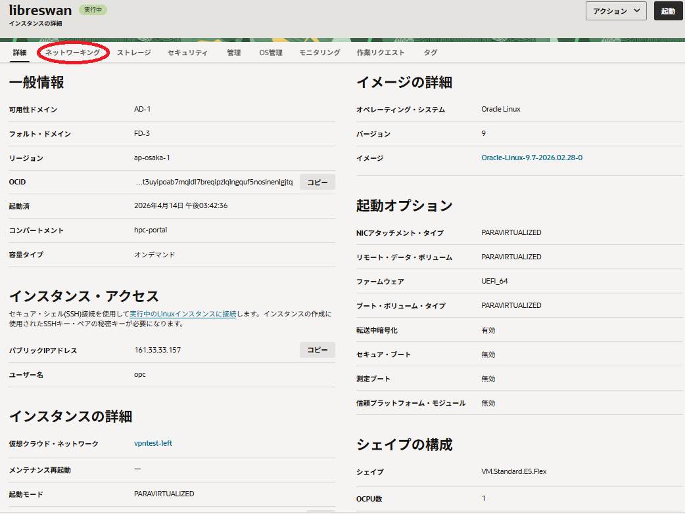

表示される以下画面の **アタッチされたVNIC** フィールドの **プライマリVNIC** の **VNICの編集** メニューをクリックし、

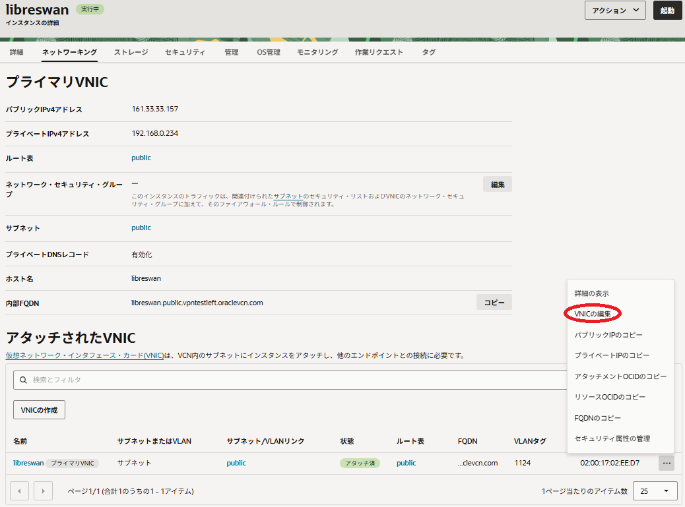

表示される以下 **VNICの編集** サイドバーで、 **ソース/宛先チェックのスキップ** チェックボックスをチェックし、 **変更の保存** ボタンをクリックします。

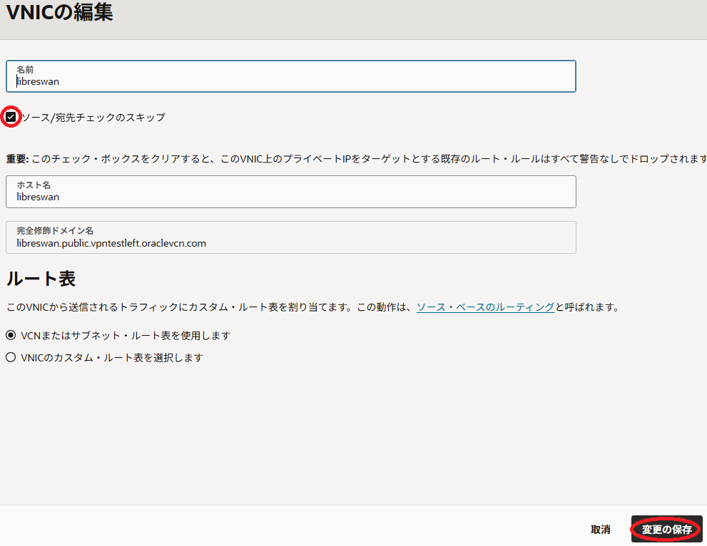

次に、Libreswan用インスタンスにログインし、 **/etc/sysctl.conf** に以下の行を追加します。  
なお、設定ファイル中のネットワークインターフェース名（enp0s5）は、実際のインターフェース名に置き換えます。

```sh
$ diff /etc/sysctl.conf_org /etc/sysctl.conf
13a14,23
> net.ipv4.ip_forward = 1
> net.ipv4.conf.all.accept_redirects = 0
> net.ipv4.conf.all.send_redirects = 0
> net.ipv4.conf.default.send_redirects = 0
> net.ipv4.conf.enp0s5.send_redirects = 0
> net.ipv4.conf.default.accept_redirects = 0
> net.ipv4.conf.enp0s5.accept_redirects = 0
> net.ipv4.conf.all.rp_filter = 0
> net.ipv4.conf.default.rp_filter = 0
> net.ipv4.conf.enp0s5.rp_filter = 0
$
```

次に、Libreswan用インスタンスのopcユーザで以下コマンドを実行し、先の変更を有効化します。

```sh
$ sudo sysctl -p
```

次に、Libreswan用インスタンスのopcユーザで以下コマンドを実行し、拠点間接続で接続する右側サイトのサブネットアドレス（ここではプライベートサブネットの **10.0.1.0/24**）からのアクセスをfirewalldに許可し、その設定を確認します。  
なお本手順は、 **接続形態3** であればプライベートサブネット接続であることを理由に、firewalldを停止することでも代用可能です。

```sh
$ sudo firewall-cmd --permanent --add-service="ipsec"
success
$ sudo firewall-cmd --permanent --zone=trusted --add-source=192.168.0.0/16
success
$ sudo firewall-cmd --reload
success
$ sudo firewall-cmd --zone=trusted --list-all
trusted (active)
  target: ACCEPT
  icmp-block-inversion: no
  interfaces: 
  sources: 192.168.0.0/16
  services: 
  ports: 
  protocols: 
  forward: yes
  masquerade: no
  forward-ports: 
  source-ports: 
  icmp-blocks: 
  rich rules: 
$ 
```

## 2-5. 拠点間接続関連OCIリソース作成

### 2-5-0. 概要

本章は、以下の拠点間接続に関連するOCIリソースを右側サイトに作成します。

- **動的ルーティング・ゲートウェイ**
- **VCNアタッチメント**
- **顧客構内機器**

### 2-5-1. 動的ルーティング・ゲートウェイ作成

OCIコンソールにログインし、右側サイトを作成する **リージョン** を選択後、 **ネットワーキング** → **仮想クラウド・ネットワーク** → **顧客接続性** → **動的ルーティング・ゲートウェイ** とメニューを辿り、表示される以下 **動的ルーティング・ゲートウェイ** 画面で **動的ルーティング・ゲートウェイの作成** ボタンをクリックします。

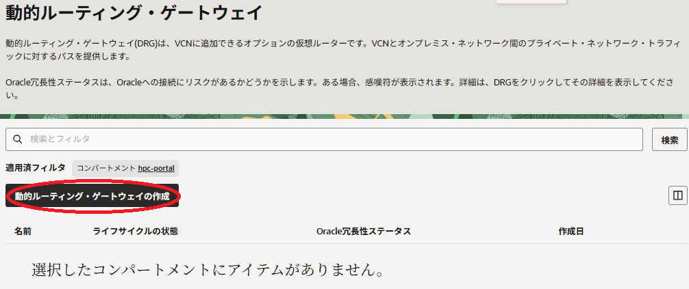

表示される以下 **動的ルーティング・ゲートウェイの作成** サイドバーで、 **名前** フィールドを入力して **動的ルーティング・ゲートウェイの作成** ボタンをクリックします。

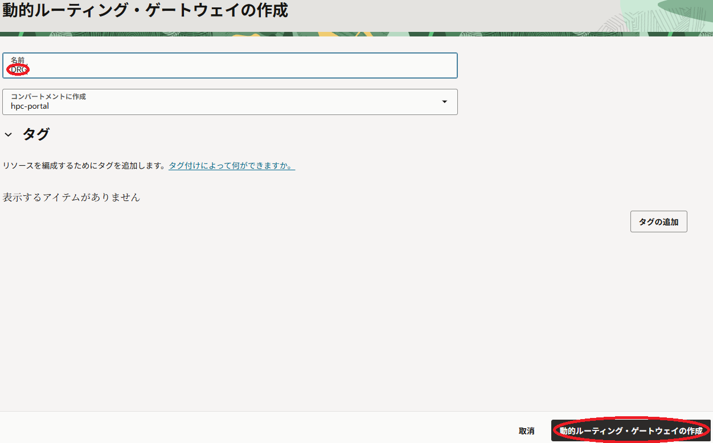

### 2-5-2. VCNアタッチメント作成

作成した **動的ルーティング・ゲートウェイ** の以下 **アタッチメント** タブの **VCNアタッチメント** フィールドで、 **仮想クラウド・ネットワーク・アタッチメントの作成** ボタンをクリックします。

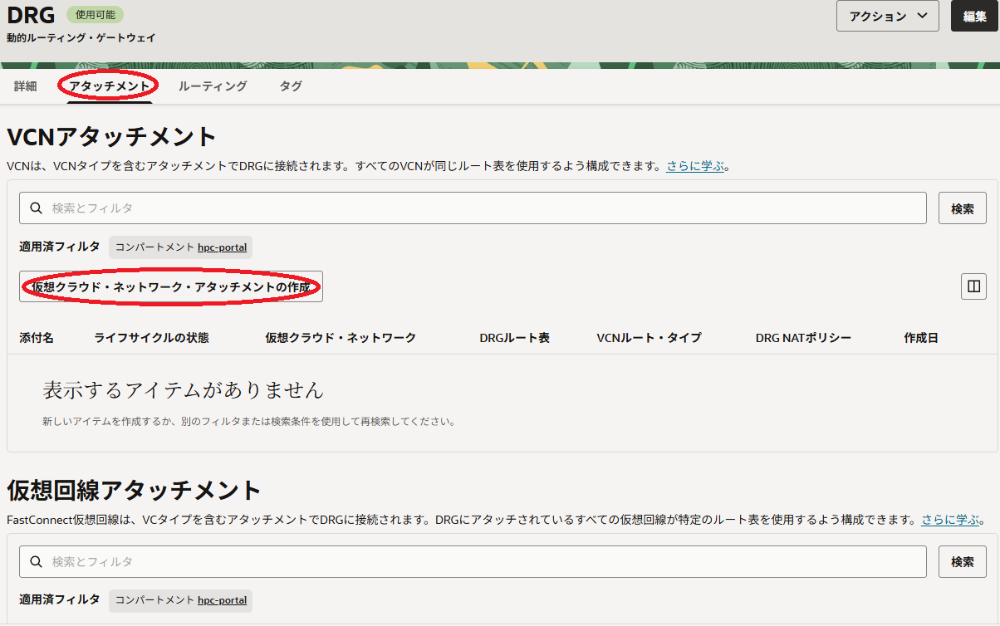

次に、表示される以下 **VCNアタッチメント作成** 画面で、 **添付名** フィールドに **VCNアタッチメント** に付与する名称を入力して **仮想クラウド・ネットワーク** プルダウンメニューに先に作成した右側サイトの **仮想クラウド・ネットワーク** を選択し、 **VCNアタッチメントの作成** ボタンをクリックします。

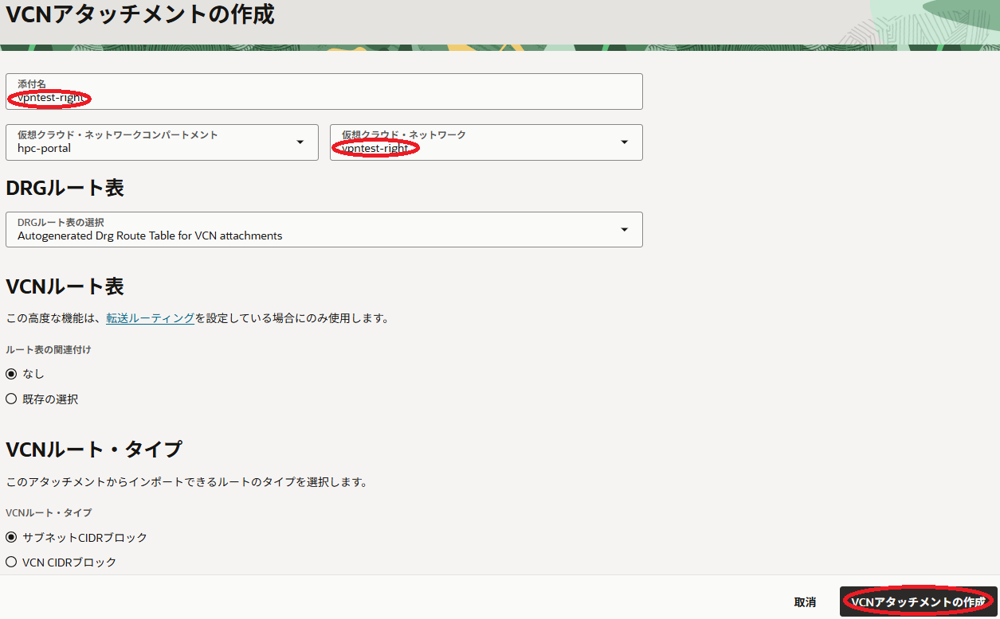

**VCNアタッチメント** の作成が完了すると、 **[2-2. 右側サイト用仮想クラウド・ネットワークと関連リソース作成](#2-2-右側サイト用仮想クラウドネットワークと関連リソース作成)** で作成したプライベートサブネット用 **ルート表** に作成した **動的ルーティング・ゲートウェイ** をゲートウェイとする **ルート・ルール** の追加が可能になります。

### 2-5-3. 顧客構内機器作成

OCIコンソールにログインし、右側サイトを作成する **リージョン** を選択後、 **ネットワーキング** → **仮想クラウド・ネットワーク** → **顧客接続性** → **顧客構内機器** とメニューを辿り、表示される以下 **顧客構内機器** 画面で **CPEの作成** ボタンをクリックします。

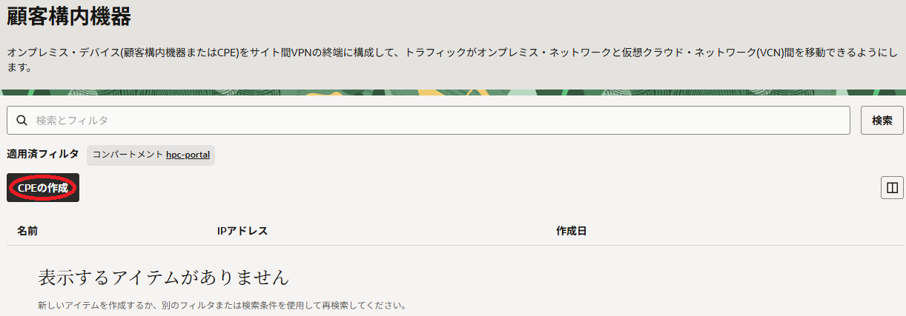

表示される以下 **CPEの作成** 画面で、以下の情報を入力し **CPEの作成** ボタンをクリックします。  
なお、ここに記載のないフィールドは、デフォルトのままとします。

- **名前** ：**顧客構内機器** に付与する名前
- **IPアドレス** ：左側サイトがIPSec接続に使用するパブリックIPアドレス（※12）
- **ベンダー** ：**Libreswan**（※13）
- **プラットフォームバージョン** ：**3.18 or later**（※13）

※12） **接続形態1** と **接続形態2** の場合はVPN接続機器に割り当てられるパブリックIPアドレス、 **接続形態3** の場合は **NATゲートウェイ** に割り当てられるパブリックIPアドレスを指定します。  
※13） **接続形態1** の場合は利用するVPNアプライアンス製品に合わせて選択します。

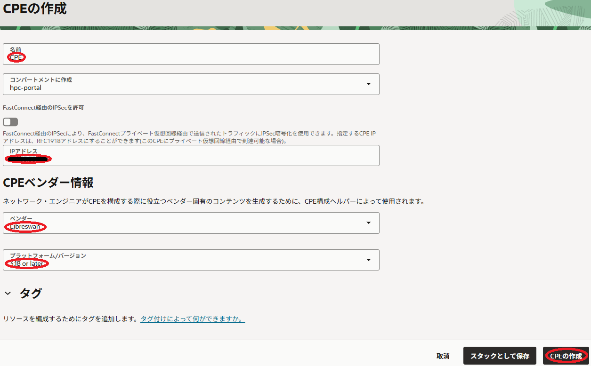

## 2-6. IPSec接続作成

### 2-6-0. 概要

本章は、 **IPSec接続** を作成します。  

**IPSec接続** の作成手順は、 **接続形態3** かそれ以外で異なり、また静的ルーティングかBGP動的ルーティングかで異なるため、自身の要件に合わせて下表からどのパターンに該当するかを決定し、その手順に従います。

| パターン | 接続形態  | ルーティング |
| :--: | :---: | :----: |
| 1    | 1または2 | 静的     |
| 2    |       | BGP動的  |
| 3    | 3     | 静的     |
| 4    |       | BGP動的  |

### 2-6-1. パターン1の場合

OCIコンソールにログインし、右側サイトを作成する **リージョン** を選択後、 **ネットワーキング** → **仮想クラウド・ネットワーク** → **顧客接続性** → **サイト間VPN** とメニューを辿り、表示される以下 **サイト間VPN** 画面で **IPSec接続の作成** ボタンをクリックします。

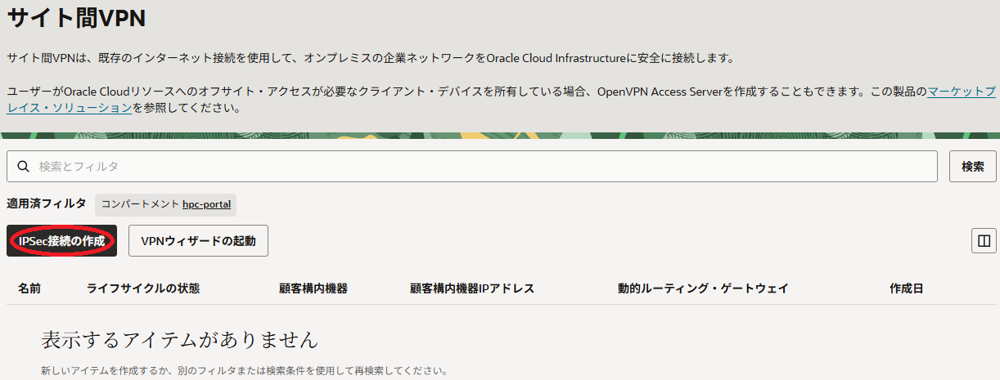

表示される以下 **IPSec接続の作成** 画面で、以下の情報を入力し **IPSec接続の作成** ボタンをクリックします。  
なお、ここに記載のないフィールドは、デフォルトのままとします。

- **名前** ：**IPSec接続** に付与する名前
- **顧客構内機器** ：先に作成した **顧客構内機器**
- **動的ルーティング・ゲートウェイ** ：先に作成した **動的ルーティング・ゲートウェイ**
- **オンプレミス・ネットワークへの静的ルート** ： **192.168.2.0/24**（※14）
- **トンネル1** の **ルーティング・タイプ** ： **静的ルーティング**
- **Tunnel 2** の **ルーティング・タイプ** ： **静的ルーティング**

※14）作成する **IPSec接続** を介して通信する左側サイトのサブネット（ここではプライベートサブネットの **192.168.2.0/24**）を指定します。複数のサブネットを指定することが可能です。

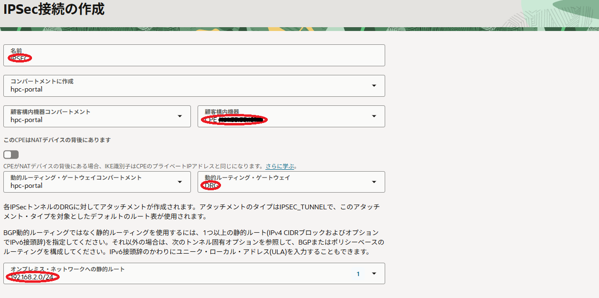  
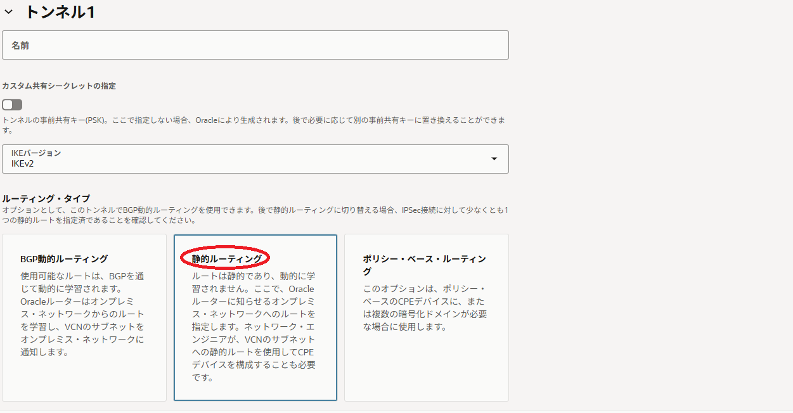  
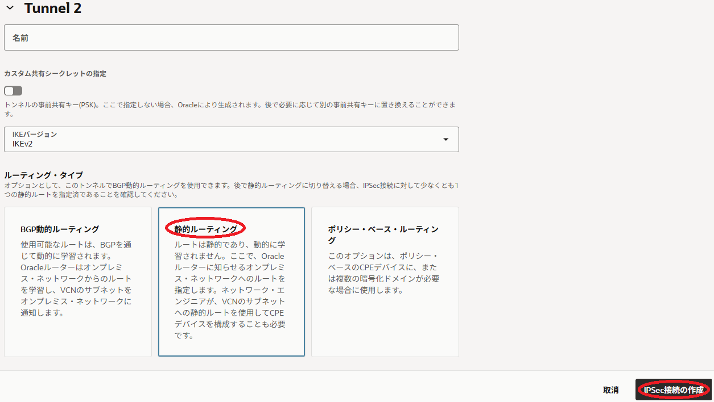

表示される画面の以下 **トンネル** タブで、 **名前** 列の末尾が1と2になっているトンネル1とトンネル2が作成され、 **ライフサイクルの状態** 列が何れも **プロビジョニング中** で **IPSecステータス** 列が何れも **停止** となっていることを確認します。  
**ライフサイクルの状態** 列は、しばらくすると **使用可能** に遷移します。  
また **IPSecステータス** 列は、 **[2-7. VPN接続機器セットアップ](#2-7-vpn接続機器セットアップ)** の手順が完了すると **稼働中** に遷移します。  
また、 **Oracle VPN IPアドレス** 列の各トンネルのパブリックIPアドレスを後の手順のために記録します。

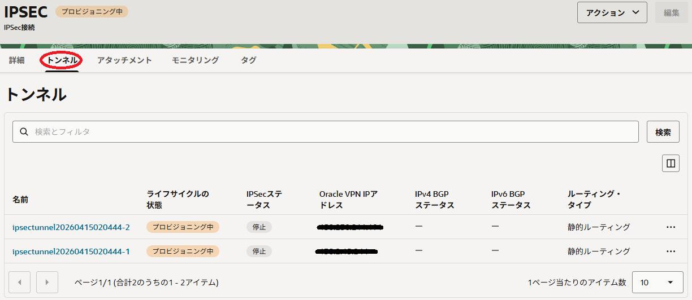

次に、トンネル1の **名前** 列をクリックし、表示される以下画面の **トンネル情報** フィールドの **共有シークレット** フィールドの **表示** ボタンをクリックし、表示されるトンネル1の共有シークレットを記録します。

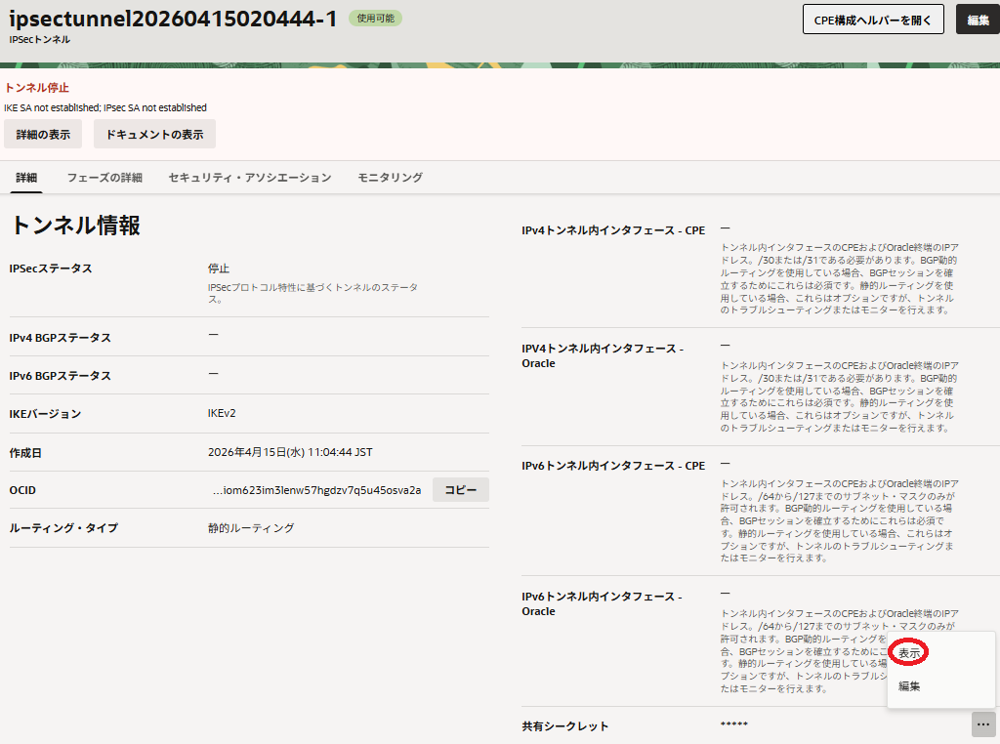

同様に、トンネル2の共有シークレットを記録します。

### 2-6-2. パターン2の場合

OCIコンソールにログインし、右側サイトを作成する **リージョン** を選択後、 **ネットワーキング** → **仮想クラウド・ネットワーク** → **顧客接続性** → **サイト間VPN** とメニューを辿り、表示される以下 **サイト間VPN** 画面で **IPSec接続の作成** ボタンをクリックします。


表示される以下 **IPSec接続の作成** 画面で、以下の情報を入力し **IPSec接続の作成** ボタンをクリックします。  
なお、ここに記載のないフィールドは、デフォルトのままとします。

- **名前** ：**IPSec接続** に付与する名前
- **顧客構内機器** ：先に作成した **顧客構内機器**
- **動的ルーティング・ゲートウェイ** ：先に作成した **動的ルーティング・ゲートウェイ**
- **トンネル1** の **BGP ASN** ：左側サイトのAS番号（※15）
- **トンネル1** の **IPv4トンネル内インタフェース - CPE** ： **IPSec接続** のトンネル1内のBGPピア接続に使用する **CPE** 側のIPアドレス（※16）
- **トンネル1** の **IPv4トンネル内インタフェース - Oracle** ： **IPSec接続** のトンネル1内のBGPピア接続に使用する **動的ルーティング・ゲートウェイ** 側のIPアドレス（※16）
- **Tunnel 2** の **BGP ASN** ：左側サイトのAS番号（※15）
- **Tunnel 2** の **IPv4トンネル内インタフェース - CPE** ： **IPSec接続** のトンネル2内のBGPピア接続に使用する **CPE** 側のIPアドレス（※16）
- **Tunnel 2** の **IPv4トンネル内インタフェース - Oracle** ： **IPSec接続** のトンネル2内のBGPピア接続に使用する **動的ルーティング・ゲートウェイ** 側のIPアドレス（※16）

※15）本テクニカルTipsでは、プライベートAS番号である **65000** を使用しますが、自身の環境に合わせて変更します。  
※16）30ビットか31ビットのサブネットマスクを持つ同一セグメント内の任意のIPアドレスが使用できますが、特に理由が無ければ以下を指定します。

| トンネル | CPE側IPアドレス  | 動的ルーティング・ゲートウェイ側<br>IPアドレス |
| :--: | :--------------: | :--------------------------: |
| 1    | 192.168.254.1/30 | 192.168.254.2/30             |
| 2    | 192.168.254.5/30 | 192.168.254.6/30             |

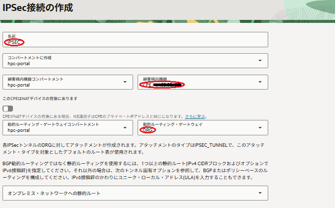  
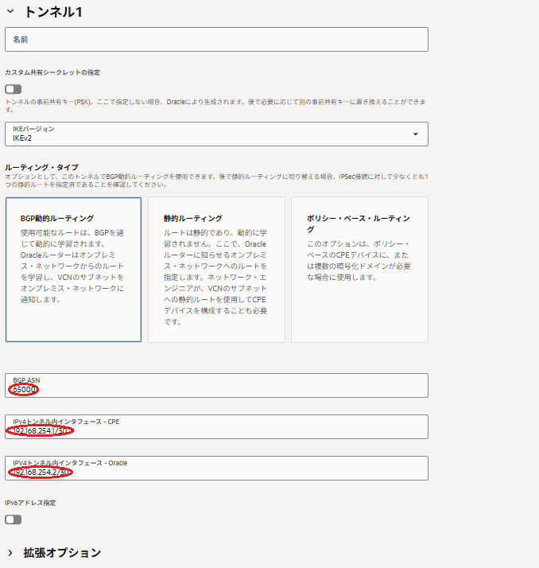  
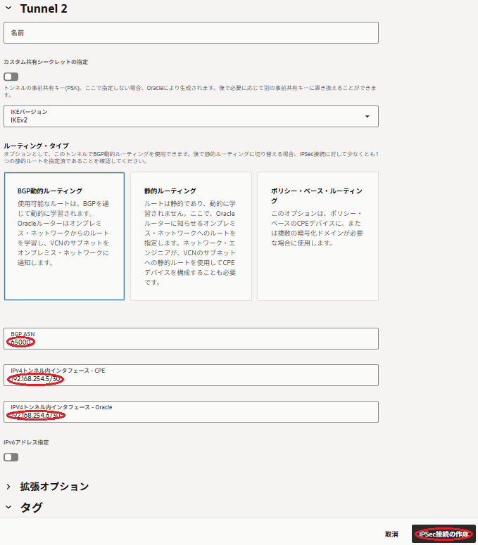  

表示される画面の以下 **トンネル** タブで、 **名前** 列の末尾が1と2になっているトンネル1とトンネル2が作成され、 **ライフサイクルの状態** 列が何れも **プロビジョニング中** で **IPSecステータス** 列と **IPv4 BGPステータス** 列が何れも **停止** となっていることを確認します。  
この **IPSecステータス** 列と **IPv4 BGPステータス** 列は、 **[2-7. VPN接続機器セットアップ](#2-7-vpn接続機器セットアップ)** の手順が完了すると、 **稼働中** になります。  
また、 **Oracle VPN IPアドレス** 列の各トンネルのパブリックIPアドレスを後の手順のために記録します。

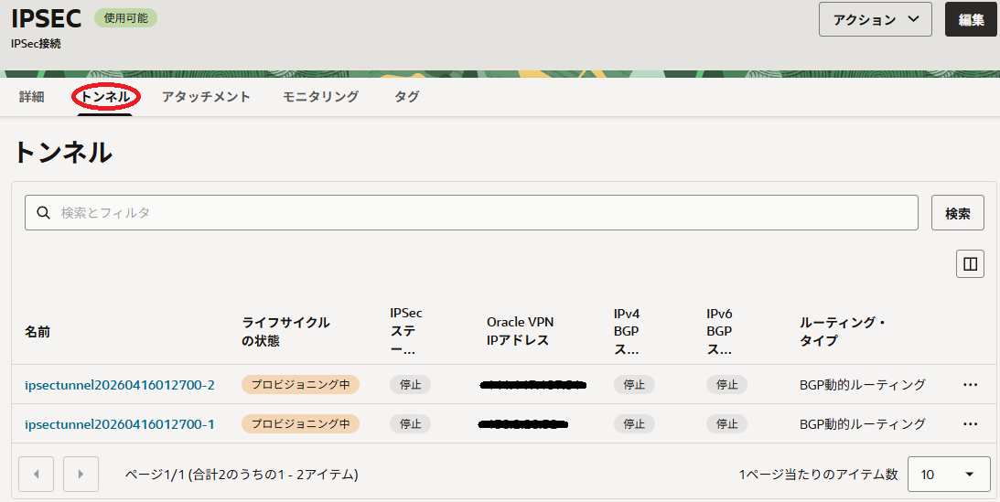

次に、トンネル1の **名前** 列をクリックし、表示される以下画面の **トンネル情報** フィールドの **共有シークレット** フィールドの **表示** メニューをクリックし、表示されるトンネル1の共有シークレットを記録します。

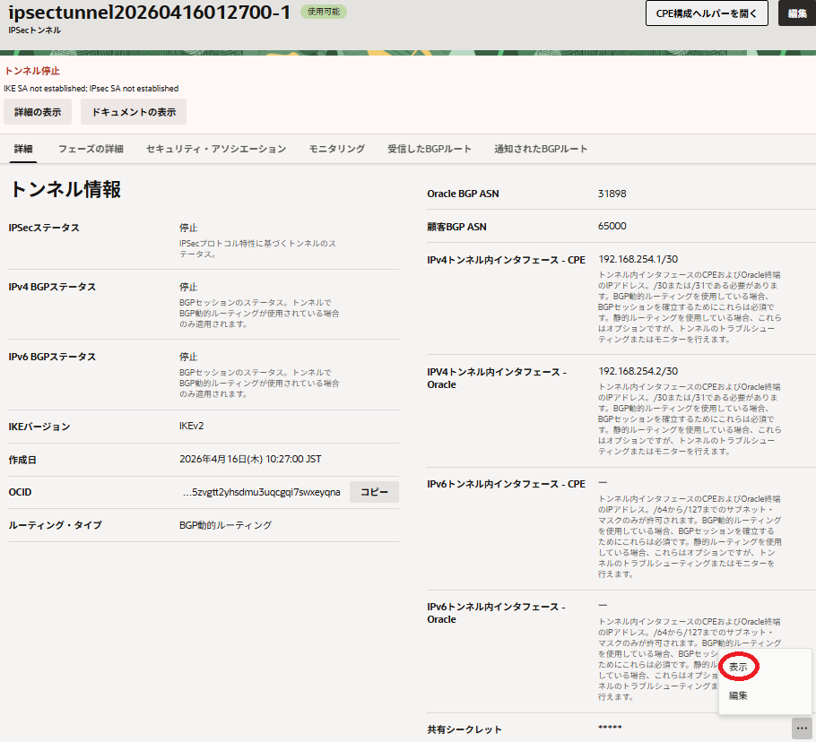

同様に、トンネル2の共有シークレットを記録します。

### 2-6-3. パターン3の場合

OCIコンソールにログインし、右側サイトを作成する **リージョン** を選択後、 **ネットワーキング** → **仮想クラウド・ネットワーク** → **顧客接続性** → **サイト間VPN** とメニューを辿り、表示される以下 **サイト間VPN** 画面で **IPSec接続の作成** ボタンをクリックします。


表示される以下 **IPSec接続の作成** 画面で、以下の情報を入力し **IPSec接続の作成** ボタンをクリックします。  
なお、ここに記載のないフィールドは、デフォルトのままとします。

- **名前** ：**IPSec接続** に付与する名前
- **顧客構内機器** ：先に作成した **顧客構内機器**
- **このCPEはNATデバイスの背後にあります** ：チェック
- **CPE IKE識別子** ：LibreswanインスタンスのプライベートIPアドレス
- **動的ルーティング・ゲートウェイ** ：先に作成した **動的ルーティング・ゲートウェイ**
- **オンプレミス・ネットワークへの静的ルート** ：**192.168.2.0/24**（※18）
- **トンネル1** の **ルーティング・タイプ** ：**静的ルーティング**
- **Tunnel 2** の **ルーティング・タイプ** ：**静的ルーティング**

※18）作成する **IPSec接続** を介して通信する左側サイトのサブネット（ここではプライベートサブネットの **192.168.2.0/24**）を指定します。複数のサブネットを指定することが可能です。

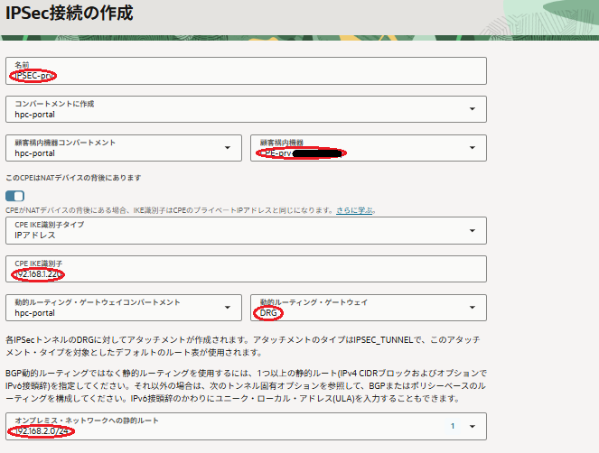  
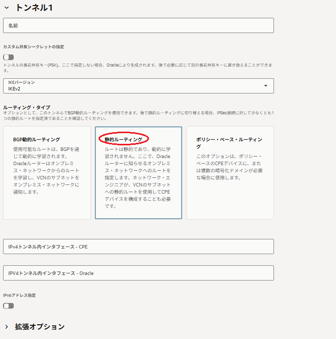  
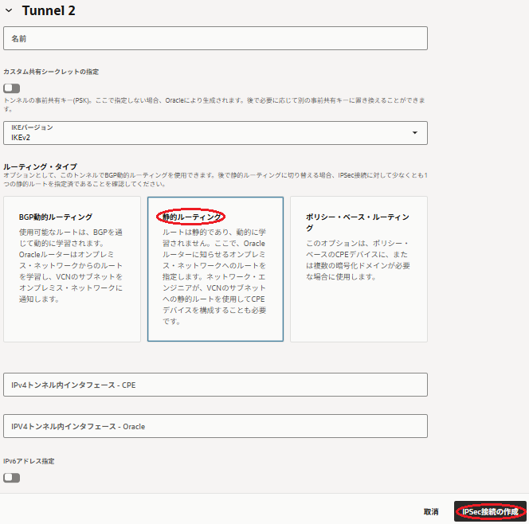

表示される画面の以下 **トンネル** タブで、 **名前** 列の末尾が1と2になっているトンネル1とトンネル2が作成され、 **ライフサイクルの状態** 列が何れも **プロビジョニング中** で **IPSecステータス** 列が何れも **停止** となっていることを確認します。  
**ライフサイクルの状態** 列は、しばらくすると **使用可能** に遷移します。  
また **IPSecステータス** 列は、 **[2-7. VPN接続機器セットアップ](#2-7-vpn接続機器セットアップ)** の手順が完了すると **稼働中** に遷移します。  
また、 **Oracle VPN IPアドレス** 列の各トンネルのパブリックIPアドレスを後の手順のために記録します。

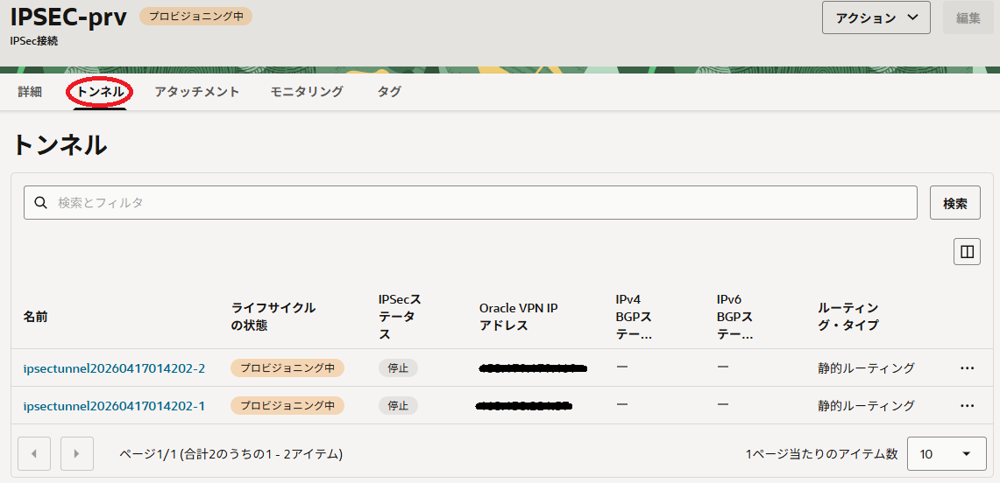

次に、トンネル1の **名前** 列をクリックし、表示される以下画面の **トンネル情報** フィールドの **共有シークレット** フィールドの **表示** ボタンをクリックし、表示されるトンネル1の共有シークレットを記録します。


同様に、トンネル2の共有シークレットを記録します。

### 2-6-4. パターン4の場合

OCIコンソールにログインし、右側サイトを作成する **リージョン** を選択後、 **ネットワーキング** → **仮想クラウド・ネットワーク** → **顧客接続性** → **サイト間VPN** とメニューを辿り、表示される以下 **サイト間VPN** 画面で **IPSec接続の作成** ボタンをクリックします。


表示される以下 **IPSec接続の作成** 画面で、以下の情報を入力し **IPSec接続の作成** ボタンをクリックします。  
なお、ここに記載のないフィールドは、デフォルトのままとします。

- **名前** ：**IPSec接続** に付与する名前
- **顧客構内機器** ：先に作成した **顧客構内機器**
- **このCPEはNATデバイスの背後にあります** ：チェック
- **CPE IKE識別子** ：LibreswanインスタンスのプライベートIPアドレス
- **動的ルーティング・ゲートウェイ** ：先に作成した **動的ルーティング・ゲートウェイ**
- **トンネル1** の **BGP ASN** ：左側サイトのAS番号（※19）
- **トンネル1** の **IPv4トンネル内インタフェース - CPE** ： **IPSec接続** のトンネル1内のBGPピア接続に使用する **CPE** 側のIPアドレス（※20）
- **トンネル1** の **IPv4トンネル内インタフェース - Oracle** ： **IPSec接続** のトンネル1内のBGPピア接続に使用する **動的ルーティング・ゲートウェイ** 側のIPアドレス（※20）
- **Tunnel 2** の **BGP ASN** ：左側サイトのAS番号（※19）
- **Tunnel 2** の **IPv4トンネル内インタフェース - CPE** ： **IPSec接続** のトンネル2内のBGPピア接続に使用する **CPE** 側のIPアドレス（※20）
- **Tunnel 2** の **IPv4トンネル内インタフェース - Oracle** ： **IPSec接続** のトンネル2内のBGPピア接続に使用する **動的ルーティング・ゲートウェイ** 側のIPアドレス（※20）

※19）本テクニカルTipsでは、プライベートAS番号である **65000** を使用しますが、自身の環境に合わせて変更します。  
※20）30ビットか31ビットのサブネットマスクを持つ同一セグメント内の任意のIPアドレスが使用できますが、特に理由が無ければ以下を指定します。

| トンネル | CPE側IPアドレス  | 動的ルーティング・ゲートウェイ側<br>IPアドレス |
| :--: | :--------------: | :--------------------------: |
| 1    | 192.168.254.1/30 | 192.168.254.2/30             |
| 2    | 192.168.254.5/30 | 192.168.254.6/30             |

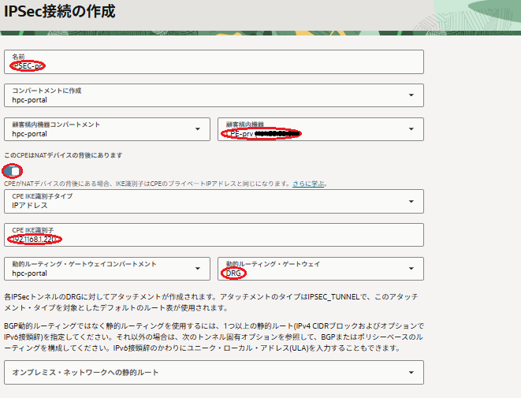  
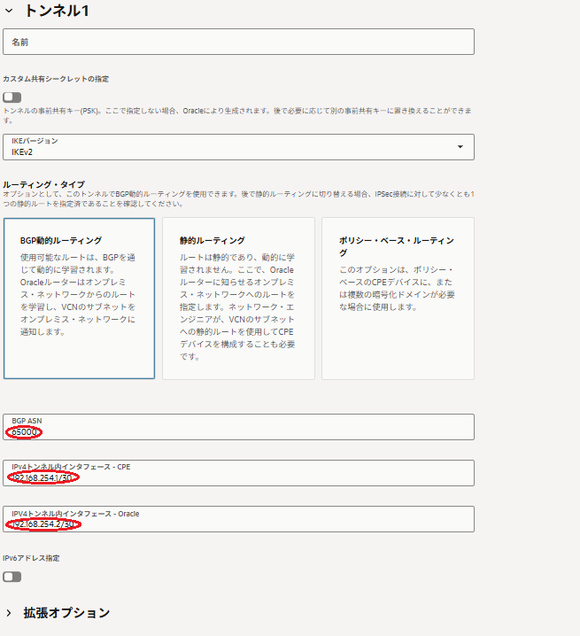  
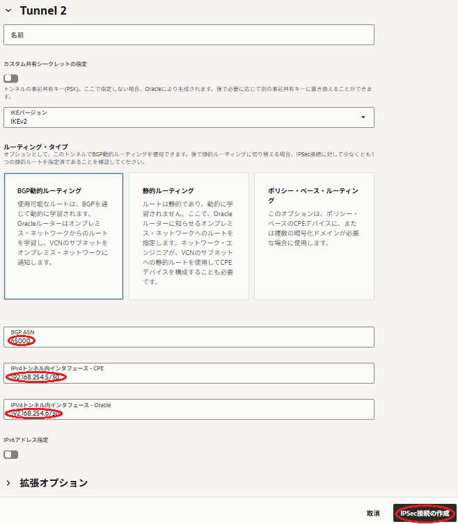  

表示される画面の以下 **トンネル** タブで、 **名前** 列の末尾が1と2になっているトンネル1とトンネル2が作成され、 **ライフサイクルの状態** 列が何れも **プロビジョニング中** で **IPSecステータス** 列と **IPv4 BGPステータス** 列が何れも **停止** となっていることを確認します。  
この **IPSecステータス** 列と **IPv4 BGPステータス** 列は、 **[2-7. VPN接続機器セットアップ](#2-7-vpn接続機器セットアップ)** の手順が完了すると、 **稼働中** になります。  
また、 **Oracle VPN IPアドレス** 列の各トンネルのパブリックIPアドレスを後の手順のために記録します。


次に、トンネル1の **名前** 列をクリックし、表示される以下画面の **トンネル情報** フィールドの **共有シークレット** フィールドの **表示** メニューをクリックし、表示されるトンネル1の共有シークレットを記録します。


同様に、トンネル2の共有シークレットを記録します。

## 2-7. VPN接続機器セットアップ

### 2-7-0. 概要

本章は、VPN接続機器をセットアップします。  

VPN接続機器のセットアップ手順は、 **接続形態1** かそれ以外で異なり、また静的ルーティングかBGP動的ルーティングかで異なるため、自身の要件に合わせて下表からどのパターンに該当するかを決定し、その手順に従います。

| パターン | 接続形態  | ルーティング       |
| :--: | :---: | :----------: |
| 1    | 1     | 静的 または BGP動的 |
| 2    | 2または3 | 静的           |
| 3    |       | BGP動的        |

### 2-7-1. パターン1の場合

VPNアプライアンス製品の接続手順は、以下の情報を参考に実施します。

- **[CPE構成ヘルパー](https://docs.oracle.com/ja-jp/iaas/Content/Network/Tasks/CPEconfigurationhelper.htm)**  
VPNアプライアンス製品を構成するために必要な、 **[2-6. IPSec接続作成](#2-6-ipsec接続作成)** で作成したIPSec接続情報をOCIコンソールから収集するヘルパーツールです。   
利用方法は、 **[CPE構成ヘルパー利用方法](#cpe構成ヘルパー利用方法)** を参照してください。
- 各VPNアプライアンス製品毎に用意されているOCIドキュメント  
**[ここ](https://docs.oracle.com/ja-jp/iaas/Content/Network/Reference/CPElist.htm)** の該当するVPNアプライアンス製品の構成列とビデオ列の情報を参照してください。

### 2-7-2. パターン2の場合

Libreswan用インスタンスのopcユーザで以下コマンドを実行し、 **Libreswan** をインストールします。

```sh
$ sudo dnf install -y libreswan
```

次に、以下2個の **Libreswan** 設定ファイルを作成します。

[/etc/ipsec.d/oci-ipsec.conf]

```sh
conn oracle-tunnel-1
    left=%defaultroute
    leftid=CPE_IP
    right=Tunnel1_public_IP
    authby=secret
    leftsubnet=192.168.2.0/24
    rightsubnet=10.0.1.0/24
    auto=start
    mark=5/0xffffffff # Needs to be unique across all tunnels
    vti-interface=vti01
    vti-routing=no
    ikev2=insist # To use IKEv2, change to ikev2=insist
    ike=aes_cbc256-sha2_256-ecp384
    phase2alg=aes_gcm256;modp1536
    encapsulation=yes
    ikelifetime=28800s
    salifetime=3600s
conn oracle-tunnel-2
    left=%defaultroute
    leftid=CPE_IP
    right=Tunnel2_public_IP
    authby=secret
    leftsubnet=192.168.2.0/24
    rightsubnet=10.0.1.0/24
    auto=start
    mark=6/0xffffffff # Needs to be unique across all tunnels
    vti-interface=vti02
    vti-routing=no
    ikev2=insist # To use IKEv2, change to ikev2=insist
    ike=aes_cbc256-sha2_256-ecp384
    phase2alg=aes_gcm256;modp1536
    encapsulation=yes
    ikelifetime=28800s
    salifetime=3600s
```

※22）下表を参考に、設定ファイル中の設定値を自身の環境に合わせて修正します。

| 変数名         | 設定値                                   |
| :---------: | ------------------------------------- |
| leftid      | Libreswan用インスタンスの<br>・パブリックIPアドレス（ **接続形態2** ）<br>・プライベートIPアドレス（ **接続形態3** ）      |
| right       | **IPSec接続** の各トンネルに割り当てられたパブリックIPアドレス |
| leftsubnet  | 拠点間接続で接続する左側サイトのサブネットアドレス             |
| rightsubnet | 拠点間接続で接続する右側サイトのサブネットアドレス             |

[/etc/ipsec.d/oci-ipsec.secrets]

```sh
CPE_IP Tunnel1_public_IP: PSK "Shared_secret_tunnel1"
CPE_IP Tunnel2_public_IP: PSK "Shared_secret_tunnel2"
```

※23）下表を参考に、設定ファイル中の設定値を自身の環境に合わせて修正します。

|     | 1列目                                                                          | 2列目                                       | 4列目                         |
| :-: | ---------------------------------------------------------------------------- | :---------------------------------------: | :-------------------------: |
| 1行目 | Libreswan用インスタンスの<br>・パブリックIPアドレス（ **接続形態2** ）<br>・プライベートIPアドレス（ **接続形態3** ） | **IPSec接続** のトンネル1に<br>割り当てられたパブリックIPアドレス | **IPSec接続** のトンネル1用共有シークレット |
| 2行目 | Libreswan用インスタンスの<br>・パブリックIPアドレス（ **接続形態2** ）<br>・プライベートIPアドレス（ **接続形態3** ） | **IPSec接続** のトンネル2に<br>割り当てられたパブリックIPアドレス | **IPSec接続** のトンネル2用共有シークレット |

次に、 **Libreswan** をSystemdサービスに登録している設定ファイルを以下のように修正し、この修正を反映します。  
なお、ここで追加している行に含まれるサブネットは、拠点間接続で左側サイトから通信したい右側サイトのサブネット（ここではプライベートサブネットの **10.0.1.0/24**）を指定します。

```sh
$ diff /usr/lib/systemd/system/ipsec.service_org /usr/lib/systemd/system/ipsec.service
33a34
> ExecStartPost=/bin/bash -c 'sleep 30; ip route add 10.0.1.0/24 nexthop dev vti01 nexthop dev vti02'
37a39
> ExecStopPost=/bin/bash -c 'ip route del 10.0.1.0/24'
$ sudo systemctl daemon-reload
$
```

次に、Libreswan用インスタンスのopcユーザで以下コマンドを実行し、 **Libreswan** を起動して拠点間接続が2本確立されていることを確認します。

```sh
$ sudo systemctl enable --now ipsec.service
Created symlink /etc/systemd/system/multi-user.target.wants/ipsec.service → /usr/lib/systemd/system/ipsec.service.
$ sudo ipsec status | grep active
000 Total IPsec connections: loaded 2, active 2
$
```

また、 **[2-6. IPSec接続作成](#2-6-ipsec接続作成)** で確認した **IPSecステータス** 列が **稼働中** となっていることを確認します。

### 2-7-3. パターン3の場合

Libreswan用インスタンスのopcユーザで以下コマンドを実行し、 **Libreswan** をインストールします。

```sh
$ sudo dnf install -y libreswan
```

次に、以下2個の **Libreswan** 設定ファイルを作成します。

[/etc/ipsec.d/oci-ipsec.conf]

```sh
conn oracle-tunnel-1
     left=%defaultroute
     leftid=CPE_IP
     right=Tunnel1_public_IP
     authby=secret
     leftsubnet=0.0.0.0/0
     rightsubnet=0.0.0.0/0
     auto=start
     mark=5/0xffffffff
     vti-interface=vti01
     vti-routing=no
     leftvti=192.168.254.1/30
     ikev2=insist
     ike=aes_cbc256-sha2_256-ecp384
     phase2alg=aes_gcm256;modp1536
     encapsulation=yes
     ikelifetime=28800s
     salifetime=3600s
conn oracle-tunnel-2
     left=%defaultroute
     leftid=CPE_IP
     right=Tunnel2_public_IP
     authby=secret
     leftsubnet=0.0.0.0/0
     rightsubnet=0.0.0.0/0
     auto=start
     mark=6/0xffffffff
     vti-interface=vti02
     vti-routing=no
     leftvti=192.168.254.5/30
     ikev2=insist
     ike=aes_cbc256-sha2_256-ecp384
     phase2alg=aes_gcm256;modp1536
     encapsulation=yes
     ikelifetime=28800s
     salifetime=3600s
```

※24）下表を参考に、設定ファイル中の設定値を自身の環境に合わせて修正します。

| 変数名         | 設定値                                                              |
| :---------: | ---------------------------------------------------------------- |
| leftid      | Libreswan用インスタンスの<br>・パブリックIPアドレス（ **接続形態2** ）<br>・プライベートIPアドレス（ **接続形態3** ） |
| right       | **IPSec接続** の各トンネルに割り当てられたパブリックIPアドレス                            |
| leftvti     | **IPSec接続** の各トンネルのBGPピア接続に使用する **CPE** 側のIPアドレス（※25）            |

※25）本テクニカルTipsでは、以下を設定します。
    
| トンネル | IPアドレス             |
| :--: | :----------------: |
| 1    | 192.168.254.1/30 |
| 2    | 192.168.254.5/30 |

[/etc/ipsec.d/oci-ipsec.secrets]

```sh
CPE_IP Tunnel1_public_IP: PSK "Shared_secret_tunnel1"
CPE_IP Tunnel2_public_IP: PSK "Shared_secret_tunnel2"
```

※26）下表を参考に、設定ファイル中の設定値を自身の環境に合わせて修正します。

|     | 1列目                                                              | 2列目                                       | 4列目                         |
| :-: | ---------------------------------------------------------------- | :---------------------------------------: | :-------------------------: |
| 1行目 | Libreswan用インスタンスの<br>・パブリックIPアドレス（ **接続形態2** ）<br>・プライベートIPアドレス（ **接続形態3** ） | **IPSec接続** のトンネル1に<br>割り当てられたパブリックIPアドレス | **IPSec接続** のトンネル1用共有シークレット |
| 2行目 | Libreswan用インスタンスの<br>・パブリックIPアドレス（ **接続形態2** ）<br>・プライベートIPアドレス（ **接続形態3** ） | **IPSec接続** のトンネル2に<br>割り当てられたパブリックIPアドレス | **IPSec接続** のトンネル2用共有シークレット |

次に、Libreswan用インスタンスのopcユーザで以下コマンドを実行し、 **Libreswan** を起動して拠点間接続が2本確立されていることを確認します。

```sh
$ sudo systemctl enable --now ipsec.service
Created symlink /etc/systemd/system/multi-user.target.wants/ipsec.service → /usr/lib/systemd/system/ipsec.service.
$ sudo ipsec status | grep active
000 Total IPsec connections: loaded 2, active 2
$
```

また、 **[2-6. IPSec接続作成](#2-6-ipsec接続作成)** で確認した **IPSecステータス** 列が **稼働中** となっていることを確認します。

次に、Libreswan用インスタンスのopcユーザで以下コマンドを実行し、 **FRR** をインストールします。

```sh
$ sudo dnf install -y frr
```

次に、Libreswan用インスタンスのopcユーザで以下コマンドを実行し、BGPのデーモンプロセスが起動するように **FRR** 設定ファイルを修正します。

```sh
$ sudo sed -i 's/^bgpd=no/bgpd=yes/' /etc/frr/daemons
```

次に、 **Libreswan** の設定ファイル **/etc/frr/frr.conf** の行末に以下の設定を追加します。

```sh
!
ip prefix-list BGP-OUT permit 192.168.2.0/24
ip prefix-list BGP-OUT permit 192.168.3.0/24
!
route-map BGP-ADVERTISE-OUT permit 10
 match ip address prefix-list BGP-OUT
!
route-map ALLOW-ALL permit 100
!
router bgp 65000
 neighbor 192.168.254.2 remote-as 31898
 neighbor 192.168.254.6 remote-as 31898
 address-family ipv4 unicast
  network 192.168.2.0/24
  network 192.168.3.0/24
  neighbor 192.168.254.2 next-hop-self
  neighbor 192.168.254.2 soft-reconfiguration inbound
  neighbor 192.168.254.2 route-map ALLOW-ALL in
  neighbor 192.168.254.2 route-map BGP-ADVERTISE-OUT out
  neighbor 192.168.254.6 next-hop-self
  neighbor 192.168.254.6 soft-reconfiguration inbound
  neighbor 192.168.254.6 route-map ALLOW-ALL in
  neighbor 192.168.254.6 route-map BGP-ADVERTISE-OUT out
 exit-address-family
!
ip route 192.168.2.0/24 192.168.xxx.1
ip route 192.168.3.0/24 192.168.xxx.1
```

ここで、下表を参考に追加する行の設定値を自身の環境に合わせて修正します。

| 行       | フィールド | 設定値                                                                |
| :-----: | :---: | ------------------------------------------------------------------ |
| 2 - 3 | 5     | BGPで右側サイトに配布する左側サイトのサブネット（※28）                                           |
| 10       | 3     | 左側サイトのAS番号（※29）                                                    |
| 11       | 2     | **IPSec接続** のトンネル1内のBGPピア接続に使用する **動的ルーティング・ゲートウェイ** 側のIPアドレス（※30） |
| 12       | 2     | **IPSec接続** のトンネル2内のBGPピア接続に使用する **動的ルーティング・ゲートウェイ** 側のIPアドレス（※31） |
| 14 - 15   | 2     | BGPで右側サイトに配布する左側サイトのサブネット（※28）                                           |
| 16 - 19  | 2     | **IPSec接続** のトンネル1内のBGPピア接続に使用する **動的ルーティング・ゲートウェイ** 側のIPアドレス（※30） |
| 20 - 23 | 2     | **IPSec接続** のトンネル2内のBGPピア接続に使用する **動的ルーティング・ゲートウェイ** 側のIPアドレス（※31） |
| 26 - 27 | 3     | BGPで右側サイトに配布する左側サイトのサブネット（※28）     
| 26 - 27 | 4     | 3フィールド目のサブネットにアクセスする際のゲートウェイ（※32）     

※28）本テクニカルTipsでは、左側サイトのプライベートサブネット **192.168.2.0/24** と **192.168.3.0/24** を指定します。配布するサブネットは、この行を増やすことで追加することが出来ます。  
※29）本テクニカルTipsでは、プライベートAS番号である **65000** を指定しますが、自身の環境に合わせて変更します。  
※30）本テクニカルTipsでは、 **192.168.254.2** を指定します。  
※31）本テクニカルTipsでは、 **192.168.254.6** を指定します。  
※32）本テクニカルTipsでは、Libreswan用インスタンスから見た3フィールド目のサブネットに接続する際のゲートウェイである **192.168.0.1** （ **接続形態2** ） / **192.168.1.1** （ **接続形態3** ）を指定します。

次に、Libreswan用インスタンスのopcユーザで以下コマンドを実行し、 **FRR** を起動します。

```sh
$ sudo systemctl enable --now frr.service
```

次に、Libreswan用インスタンスのopcユーザで以下コマンドを実行し、コマンド出力の **Up/Down** 列に時間が表示されていることをもって、オンプレミスとOCIのBGPピア接続が確立されていることを確認します。

```sh
$ sudo vtysh -c "show bgp summary"

IPv4 Unicast Summary (VRF default):
BGP router identifier 192.168.254.5, local AS number 65000 vrf-id 0
BGP table version 4
RIB entries 7, using 1344 bytes of memory
Peers 2, using 1449 KiB of memory

Neighbor        V         AS   MsgRcvd   MsgSent   TblVer  InQ OutQ  Up/Down State/PfxRcd   PfxSnt Desc
192.168.254.2   4      31898         3         3        0    0    0 00:00:07            2        2 N/A
192.168.254.6   4      31898         3         3        0    0    0 00:00:07            2        2 N/A

Total number of neighbors 2
$
```


次に、Libreswan用インスタンスのopcユーザで以下コマンドを実行し、左側サイトのルート情報が広報されて右側サイトのルート情報を受信していることを確認します。  
なお、BGPピア接続に使用する **動的ルーティング・ゲートウェイ** 側のIPアドレスは、自身の環境に置き換えて実行します。

```sh
$ sudo vtysh -c "show bgp ipv4 neighbor 192.168.254.2 advertised-routes"
BGP table version is 4, local router ID is 192.168.254.5, vrf id 0
Default local pref 100, local AS 65000
Status codes:  s suppressed, d damped, h history, * valid, > best, = multipath,
               i internal, r RIB-failure, S Stale, R Removed
Nexthop codes: @NNN nexthop's vrf id, < announce-nh-self
Origin codes:  i - IGP, e - EGP, ? - incomplete
RPKI validation codes: V valid, I invalid, N Not found

    Network          Next Hop            Metric LocPrf Weight Path
 *> 192.168.2.0/24   0.0.0.0                  0         32768 i
 *> 192.168.3.0/24   0.0.0.0                  0         32768 i

Total number of prefixes 2
$ sudo vtysh -c "show bgp ipv4 neighbor 192.168.254.2 received-routes"
BGP table version is 4, local router ID is 192.168.254.5, vrf id 0
Default local pref 100, local AS 65000
Status codes:  s suppressed, d damped, h history, * valid, > best, = multipath,
               i internal, r RIB-failure, S Stale, R Removed
Nexthop codes: @NNN nexthop's vrf id, < announce-nh-self
Origin codes:  i - IGP, e - EGP, ? - incomplete
RPKI validation codes: V valid, I invalid, N Not found

    Network          Next Hop            Metric LocPrf Weight Path
 *> 10.0.0.0/24      192.168.254.2                          0 31898 i
 *> 10.0.1.0/24      192.168.254.2                          0 31898 i

Total number of prefixes 2
$
```

次に、OCIコンソールにログインし、右側サイトを作成する **リージョン** を選択後、 **ネットワーキング** → **顧客接続性** → **サイト間VPN** メニューをクリックします。

表示される以下 **サイト間VPN** 画面で、先に作成した **IPSec接続** をクリックします。

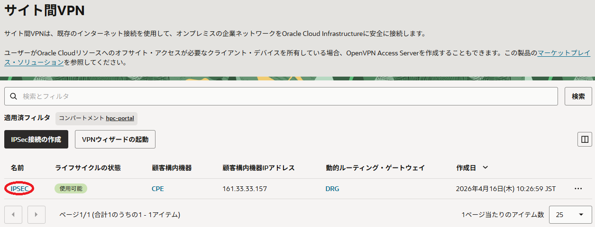

表示される画面の以下 **トンネル** タブで、トンネル1をクリックします。

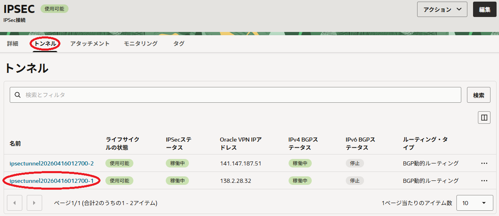

表示される画面の以下 **受信したBGPルート** タブで、左側サイトのプライベートサブネットへのルート（ここでは **192.168.2.0/24** と **192.168.3.0/24** ）を受信していることを確認します。

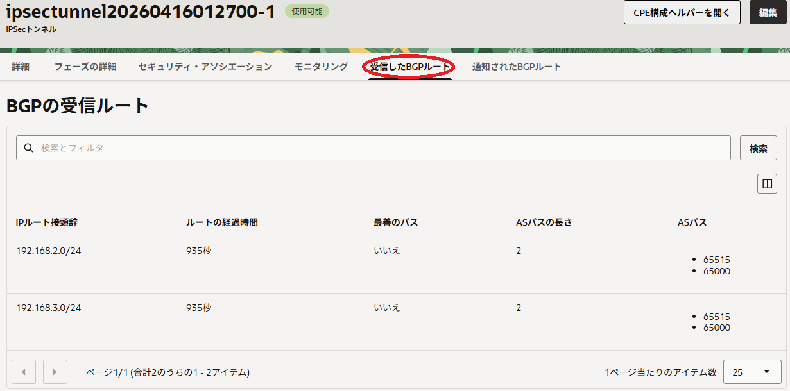

同様に **通知されたBGPルート** タブで、右側サイトのプライベートサブネットへのルート（ここでは **10.0.0.0/24** と **10.0.1.0/24** ）を通知していることを確認します。

# 3. ライセンスサーバ・計算ノード間疎通確認

## 3-0. 概要

本章は、左側サイトのライセンスサーバに相当するインスタンスの **lic-srv** と右側サイトの計算ノードに相当するインスタンスの **compute** を使用し、これらインスタンス間のpingとSSHによる疎通を確認、拠点間が想定通り接続されていることを検証します。

## 3-1. ライセンスサーバ -> 計算ノード方向疎通確認  

インスタンス **lic-srv** のopcユーザで以下コマンドを実行し、疎通を確認します。  
ここでIPアドレスは、自身のインスタンス **compute** のIPアドレスに置き換えて実行します。

```sh
$ ping -c 1 10.0.1.ccc
PING 10.0.1.ccc (10.0.1.ccc) 56(84) bytes of data.
64 bytes from 10.0.1.ccc: icmp_seq=1 ttl=60 time=163 ms

--- 10.0.1.ccc ping statistics ---
1 packets transmitted, 1 received, 0% packet loss, time 0ms
rtt min/avg/max/mdev = 163.047/163.047/163.047/0.000 ms
$ ssh 10.0.1.ccc hostname
compute
$
```

## 3-2. 計算ノード -> ライセンスサーバ方向疎通確認  

インスタンス **compute** のopcユーザで以下コマンドを実行し、疎通を確認します。  
ここでIPアドレスは、自身のインスタンス **lic-srv** のIPアドレスに置き換えて実行します。

```sh
$ ping -c 1 192.168.2.bbb
PING 192.168.2.bbb (192.168.2.bbb) 56(84) bytes of data.
64 bytes from 192.168.2.bbb: icmp_seq=1 ttl=61 time=168 ms

--- 192.168.2.bbb ping statistics ---
1 packets transmitted, 1 received, 0% packet loss, time 0ms
rtt min/avg/max/mdev = 168.001/168.001/168.001/0.000 ms
$ ssh 192.168.2.bbb hostname
lic-srv
$
```

# 参考情報

## CPE構成ヘルパー利用方法

本章は、VPNアプライアンス製品を構成するために必要な **IPSec接続** 情報をOCIコンソールから収集する、 **CPE構成ヘルパー** の利用方法を解説します。

ここでは、 **[2-5-3. 顧客構内機器作成](#2-5-3-顧客構内機器作成)** で作成する **顧客構内機器** が以下の場合を例に記載します。

- ベンダー： Juniper
- プラットフォーム/バージョン： MX Series - JunOS 15.1 or later

OCIコンソールにログインし、右側サイトを作成する **リージョン** を選択後、 **ネットワーキング** → **顧客接続性** → **サイト間VPN** メニューをクリックします。

表示される以下 **サイト間VPN** 画面で、先に作成した **IPSec接続** をクリックします。


表示される以下画面で、 **CPE構成ヘルパーを開く** メニューをクリックします。

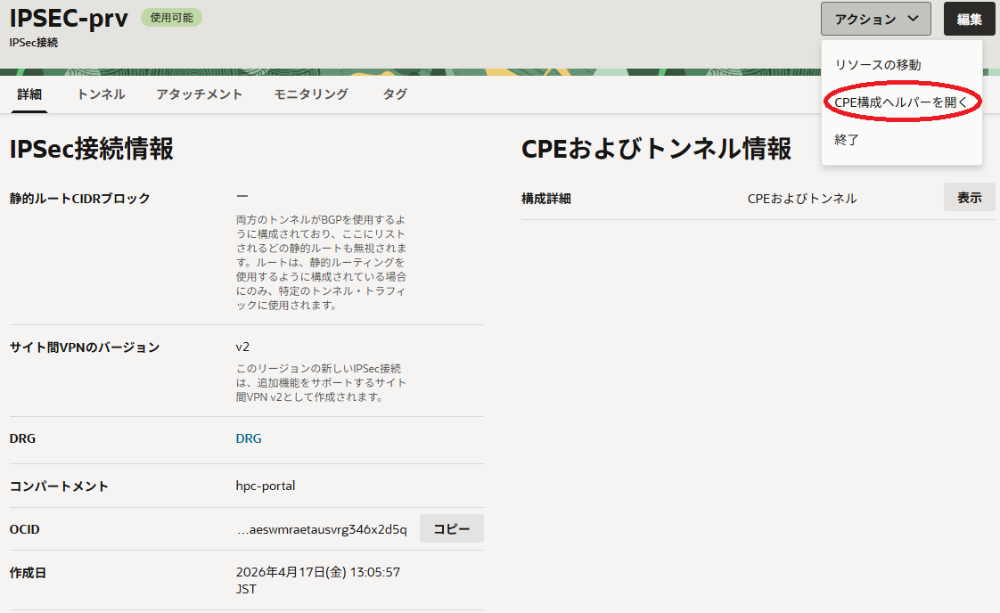

表示される以下 **CPE構成ヘルパー** サイドバーで、 **コンテンツの作成** ボタンをクリックします。

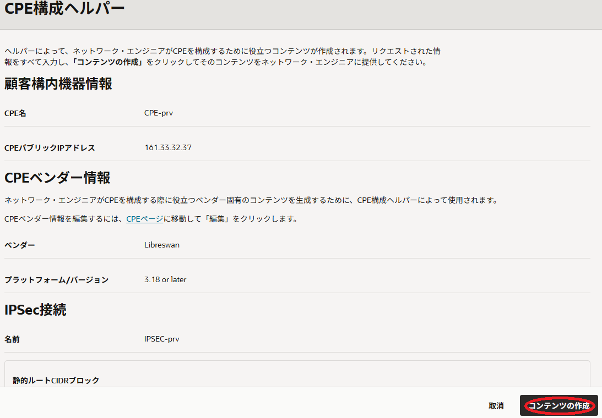

表示される以下 **CPE構成ヘルパー** サイドバーで、 **構成のダウンロード** ボタンをクリックし、構成情報が記載されたテキストファイルをダウンロードします。

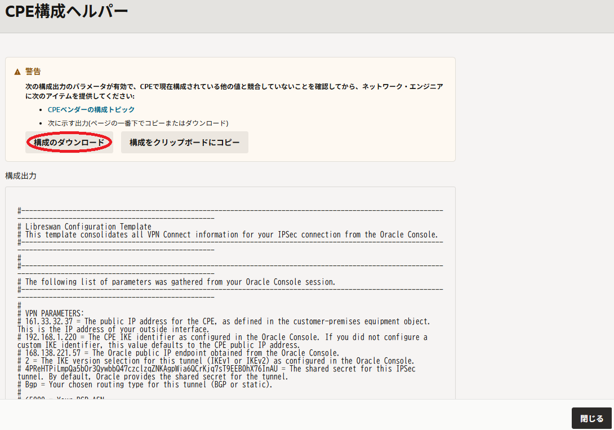
