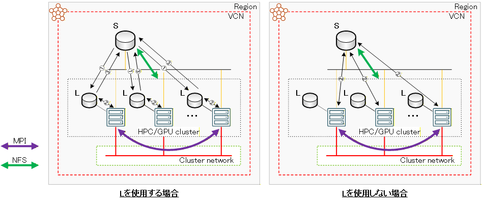
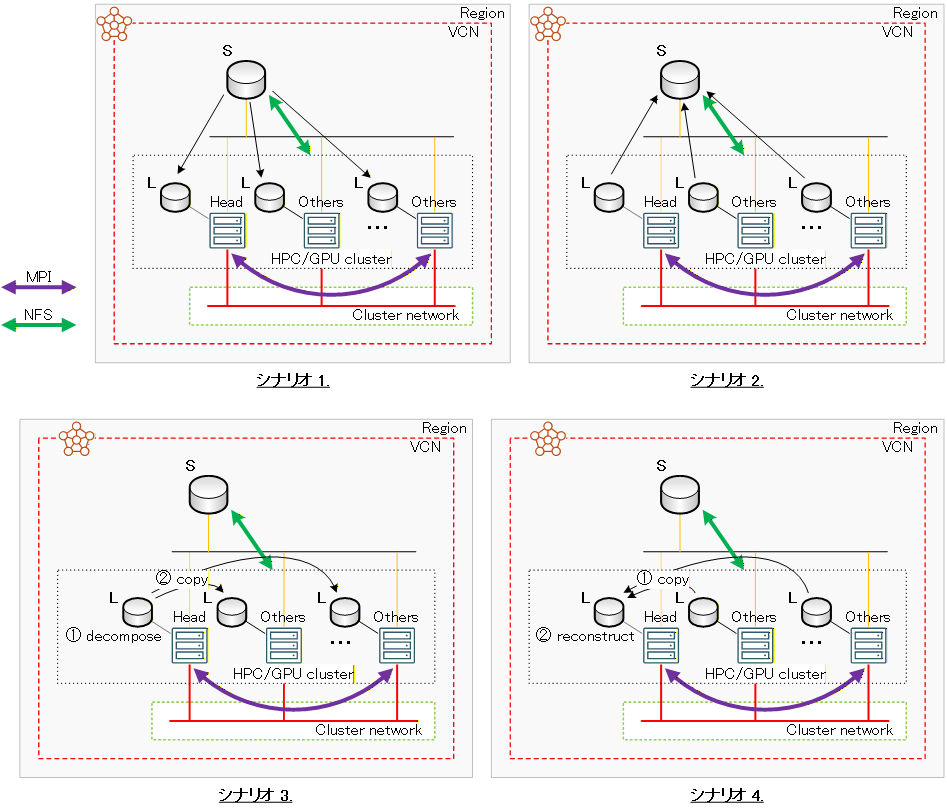

# 0. 概要

以下のHPC/機械学習ワークロード向けシェイプは、帯域幅とIOPSに優れるNVMe SSDローカルディスクを搭載しており、これをストレージ領域として活用することで、実行するアプリケーションの所要時間短縮によるシミュレーションのコスト低減が可能です。

- **[BM.Optimized3.36](https://docs.oracle.com/ja-jp/iaas/Content/Compute/References/computeshapes.htm#bm-hpc-optimized)** ： NVMe SSD 3.84 TBドライブ x 1
- **[BM.HPC.E5.144](https://docs.oracle.com/ja-jp/iaas/Content/Compute/References/computeshapes.htm#bm-hpc-optimized)** ： NVMe SSD 3.84 TBドライブ x 1
- **[BM.GPU4.8/BM.GPU.A100-v2.8](https://docs.oracle.com/ja-jp/iaas/Content/Compute/References/computeshapes.htm#bm-gpu)** ： NVMe SSD 6.8 TBドライブ x 4
- **[BM.GPU.H100.8](https://docs.oracle.com/ja-jp/iaas/Content/Compute/References/computeshapes.htm#bm-gpu)** ： NVMe SSD 3.84 TBドライブ x 16

ただこのようなアプリケーションのスループット向上を目的とする場合、単純にストレージ領域にNVMe SSDローカルディスクを使用すれば性能が向上するわけではありません。

通常アプリケーションを実行する際、アプリケーション開始時に読み込む入力データとアプリケーション終了時に書き出す出力データは、HPC/GPUクラスタ内で共有されているファイル共有ストレージに格納する必要があり、NVMe SSDローカルディスクをストレージ領域に使用する場合、ファイル共有ストレージ（以降 **S** と呼称します。）・NVMe SSDローカルディスク（以降 **L** と呼称します。）間のデータコピーが発生するため、以下の考慮が必要になります。

1. **[データコピーコストとアプリケーション高速化のトレードオフ](#1-データコピーコストとアプリケーション高速化のトレードオフ)**  
**S** ・ **L** 間のデータコピーのコストと **L** を使用することによるアプリケーション高速化の効果を比較・検討し、ストレージ領域に **L** を使用するかどうかを決定します。

2. **[マルチノード並列に於けるデータコピー並列化によるコスト削減](#2-マルチノード並列に於けるデータコピー並列化によるコスト削減)**  
マルチノードジョブに於ける **S** ・ **L** 間のデータコピーは、アプリケーション実行のためのスクリプトからrsync等で起動する場合、そのままではノード数分のデータコピーをシーケンシャルに実施することになり、その間全計算/GPUノードがデータコピー終了を待たされることになります。  
そこで、全計算/GPUノードでコンカレントにデータコピーを行い、コスト低減を行います。

3. **[メッシュ分割・マージ処理に於けるNVMe SSDローカルディスク利用の検証](#3-メッシュ分割マージ処理に於けるnvme-ssdローカルディスク利用の検証)**  
アプリケーションの並列実行に伴い必要なメッシュ分割とマージ処理は、ストレージ領域に大きな負荷をかけるため、 **L** を利用することによる高速化が可能です。  
ただこの場合、通常これらの処理が非並列で行われるため、ノード単価の高い計算/GPUノードで実行する有効性を検証し、ストレージ領域に **L** を使用するかどうかを決定します。

以降では、以上3点の観点からアプリケーション実行時にNVMe SSDローカルディスクをどのように活用すればよいかを考察します。

# 1. データコピーコストとアプリケーション高速化のトレードオフ

本章は、アプリケーションのストレージ領域に **L** を使用するために発生する、通常アプリケーション開始時と終了時に発生する **S** ・ **L** 間データコピーの所要時間と、ソルバー実行等の計算処理中にアクセスするストレージ領域に **L** を使用することによる高速化で短縮される所要時間を比較することで、ストレージ領域に **L** を使用することの有効性を考察します。

ストレージ領域に **L** を使用する場合、以下のステップを経てアプリケーションが実行されます。

1. 入力データを **S** から **L** にコピー（ **T1** ）
2. ストレージ領域に **L** を使用して計算処理を実行（ **T2L** ）
3. 出力データを **L** から **S** にコピー（ **T3** ）

次に、ストレージ領域に **L** を使用しない場合、前述の **1.** と **2.** のステップが不要となり、以下の1ステップでアプリケーションが実行されます。

2. ストレージ領域に **S** を使用して計算処理を実行（ **T2S** ）

ここで **Tx** は、その工程の所要時間を表し、以降の解説で引用します。



この際、ストレージ領域の性能差により **T2L** < **T2S** となるため、以下の不等式が成立すれば、 **L** を使用することでアプリケーションの高速化が可能と判断できます。

**T1** + **T2L** + **T3** < **T2S**

# 2. マルチノード並列に於けるデータコピー並列化によるコスト削減

本章は、 **[1. データコピーコストとアプリケーション高速化のトレードオフ](#1-データコピーコストとアプリケーション高速化のトレードオフ)** の検証で **L** を使用することによる高速化が可能と判断したマルチノード並列アプリケーションに於いて、その入出力データのコピーをアプリケーション実行ノードで並列に実行し、コストを削減する方法を考察します。

マルチノード並列アプリケーションに於けるストレージ領域間のデータコピーは、ヘッドノードで実行されるジョブスクリプトから起動する場合、そのままではノード数分のデータコピーを順次実行することになり、全計算/GPUノードがデータコピー完了まで計算開始を待たされることになりますが、これを全ノードで並列に行うことで、大幅にアプリケーション実行コストを削減することが出来ます。  
本テクニカルTipsでは、 **[pdsh](https://github.com/chaos/pdsh)** とrsyncを組み合わせてこれを実現する手法を検証します。

**pdsh** は、本来クラスタ管理の効率化を目的として開発されたオープンソースのツールですが、マルチスレッド化されているため複数ノードに対して高速・並列にコマンドを実行することが可能なため、ヘッドノードで実行されるジョブスクリプトから **pdsh** コマンドで全計算/GPUノードに並列にrsyncコマンドを起動し、本章が想定している並列データコピーを実現することが出来ます。（※1）

※1） **pdsh** の詳細とそのインストール方法は、 **[OCI HPCテクニカルTips集](../#3-oci-hpcテクニカルtips集)** の **[pdshで効率的にクラスタ管理オペレーションを実行](../../tech-knowhow/cluster-with-pdsh/)** を参照して下さい。

この並列データコピーは、以下シナリオでの適用が考えられます。

1. アプリケーション開始時の入力データの <u>**S** → 全ノード **L**</u> 方向のコピー
2. アプリケーション終了時の出力データの <u>全ノード **L** → **S**</u> 方向のコピー
3. ヘッドノードでメッシュ分割を行う場合のメッシュ分割後入力データの <u>ヘッドノード **L** → その他ノード **L**</u> 方向のコピー
4. ヘッドノードでマージ処理を行う場合のマージ処理前出力データの <u>その他ノード **L** → ヘッドノード **L**</u> 方向のコピー（※2）

※2）この並列データコピーは、同一ディレクトリに対して複数のその他ノードがrsyncで同期することによるヘッドノード上での競合を避けるため、その他ノードの自身が計算したマージ処理前出力データを格納するディレクトリのみをその対象とする必要があり、これを実現する以下スクリプトを **pdsh** から起動する方法を採用します。このスクリプトは、 **[OpenFOAM](https://www.openfoam.com/)** での利用を想定したスクリプトで、各MPIプロセスが **prosessorx** ディレクトリ以下に自身の計算結果を格納するため、この配下のみをコピーします。

[rsync_inneed.sh]
```sh
#!/bin/bash
# Usage  : rsync_inneed.sh node_list proc_pernode source_dir dest_dir
# Example: rsync_inneed.sh head,other1,other2,other3 36 /mnt/localdisk/case1 /mnt/home/usera/case1
my_hostname=`hostname`
proc_pernode=$2
cur_mpirank=0
for node in `echo $1 | sed 's/,/ /g'`
do
  if [ $node == $my_hostname ]
  then
    sta_mpirank=$cur_mpirank
    end_mpirank=$(expr $cur_mpirank + $proc_pernode - 1)
    break
  else
    cur_mpirank=$(expr $cur_mpirank + $proc_pernode)
  fi
done
incl_opt="--include=\"/*\""
for mpirank in `seq $sta_mpirank $end_mpirank`
do
  incl_opt=$incl_opt" --include=\"processor"$mpirank"/**\""
done
rsync_cmd="rsync -au -e \"ssh -o StrictHostKeyChecking=no\" $incl_opt --exclude=\"*\" ${3}/ $4"
eval $rsync_cmd
```



これら並列データコピーのジョブスクリプトからの起動方法は、 **[Slurm](https://slurm.schedmd.com/)** 環境でバッチジョブとして実行する場合、シナリオ毎に以下のようになります。

[シナリオ 1. / 2.]
```sh
pdsh -w ${SLURM_JOB_NODELIST} 'rsync -a --delete /source_dir /dest_dir'
```

[シナリオ 3.]
```sh
head_node=`hostname`
child_node_list=`echo ${SLURM_JOB_NODELIST} | cut -d, -f 2-`
pdsh -w ${child_node_list} 'rsync -a --delete ${head_node}:/source_dir /dest_dir'
```

[シナリオ 4.]
```sh
head_node=`hostname`
proc_pernode=$(expr ${SLURM_NTASKS} / ${SLURM_JOB_NUM_NODES})
child_node_list=`echo ${SLURM_JOB_NODELIST} | cut -d, -f 2-`
pdsh -w ${child_node_list} 'rsync_inneed.sh ${SLURM_JOB_NODELIST} ${proc_pernode} /source_dir /dest_dir'
```

# 3. メッシュ分割・マージ処理に於けるNVMe SSDローカルディスク利用の検証

## 3-0. 概要

本章は、アプリケーションの並列実行に伴い発生する、計算開始前の並列数に合わせた計算領域のメッシュ分割（※3）と計算終了後の各並列計算プロセスが出力した結果をマージする処理（※4）について、通常これらの処理がストレージ領域に大きな負荷をかけることから、 **S** と比較して性能の高い **L** を利用することの有効性を考察します。

※3） **OpenFOAM** で言うところの **decomposePar** による処理です。  
※4） **OpenFOAM** で言うところの **reconstructParMesh** と **reconstructPar** による処理です。

## 3-1. メッシュ分割の検証

メッシュ分割に **L** を利用することの有効性を判断する際、以下の点を考慮します。

1. メッシュ分割を非並列で実行する
2. メッシュ分割により入力データのファイル容量とファイル数は増加する
3. メッシュ分割に **L** を利用しない場合これを1コアの仮想マシンで実行することが可能
4. 1コアの仮想マシンのコストはHPC/GPUクラスタのコストと比較して十分小さく無視できる

以上の考慮点から、以下2通りのメッシュ分割手順が考えられます。

- **L** を利用する
    - メッシュ分割前の入力データを **S** からヘッドノードの **L** にコピー（ **T1** ）
    - ヘッドノードの **L** 上でメッシュ分割（ **T2** ）
    - メッシュ分割後の入力データをヘッドノードの **L** からその他ノードの **L** にコピー（ **T3** ）
    - 全ノードの **L** を利用して計算処理を実行
- **L** を利用しない
    - 1コアの仮想マシンの **S** 上でメッシュ分割
    - メッシュ分割後の入力データを **S** から全ノードの **L** にコピー（ **T4** ）
    - 全ノードの **L** を利用して計算処理を実行

ここで **Tx** は、その工程の所要時間を表し、以降の解説で引用します。

この際、考慮点 **2.** から **T1** や **T3** のコピー時間は **T4** のコピー時間より短くなるため、以下の不等式が成立すれば、メッシュ分割に **L** を利用することが有効であると判断できます。

**T1** + **T2** + **T3** < **T4**

## 3-2. マージ処理の検証

マージ処理に **L** を利用することの有効性を判断する際、以下の点を考慮します。

1. マージ処理を非並列で実行する
2. マージ処理により出力データのファイル容量とファイル数は減少する（※5）
3. マージ処理に **L** を利用しない場合これを1コアの仮想マシンで実行することが可能
4. 1コアの仮想マシンのコストはHPC/GPUクラスタのコストと比較して十分小さく無視できる

※5）マージ処理により各並列処理プロセスの出力データからポスト処理に必要な出力データが生成されると、各並列処理プロセスの出力データが不要となるためです。このため、この不要なデータをコピー対象から除外することで、データコピーの所要時間短縮が可能です。

以上の考慮点から、以下2通りのマージ処理手順が考えられます。

- **L** を利用する
    - **L** を利用して計算処理を実行（ **T5** ）
    - マージ処理前の出力データをその他ノードの **L** からヘッドノードの **L** にコピー（ **T6** ）
    - ヘッドノードの **L** 上でマージ処理（ **T7** ）
    - マージ処理後の出力データをヘッドノードの **L** から **S** にコピー（ **T8** ）
- **L** を利用しない（タイプ1）
    - **L** を利用して計算処理を実行（ **T5** ）
    - マージ処理前の出力データを全ノードの **L** から **S** にコピー（ **T9** ）
    - 1コアの仮想マシンの **S** 上でマージ処理
- **L** を利用しない（タイプ2）
    - **S** を利用して計算処理を実行（ **T10** ）
    - 1コアの仮想マシンの **S** 上でマージ処理

ここで **Tx** は、その工程の所要時間を表し、以降の解説で引用します。

この際、考慮点 **2.** とストレージ領域の性能差から **T6** や **T8** のコピー時間は **T9** のコピー時間より短くなり、ストレージ領域の性能差から **T5** の計算処理時間は **T10** の計算処理時間より短くなるため、以下の不等式が何れも成立すれば、マージ処理に **L** を利用することが有効であると判断できます。

**T6** + **T7** + **T8** < **T9**  
**T5** + **T6** + **T7** + **T8** < **T10**