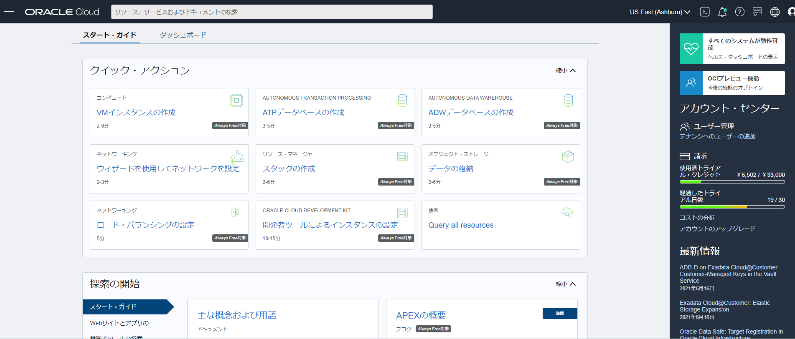
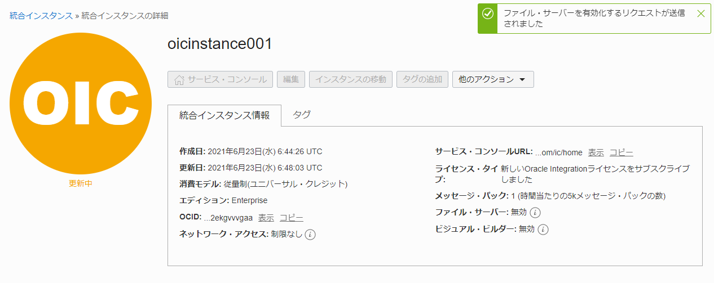
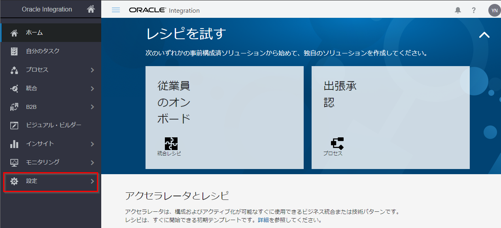
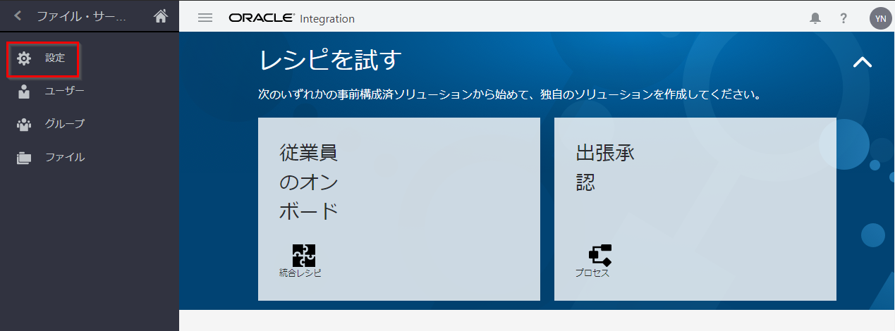
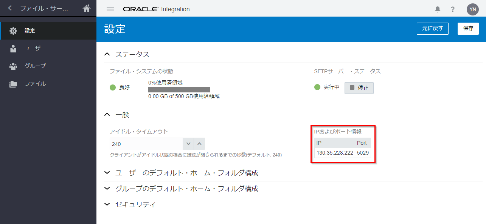
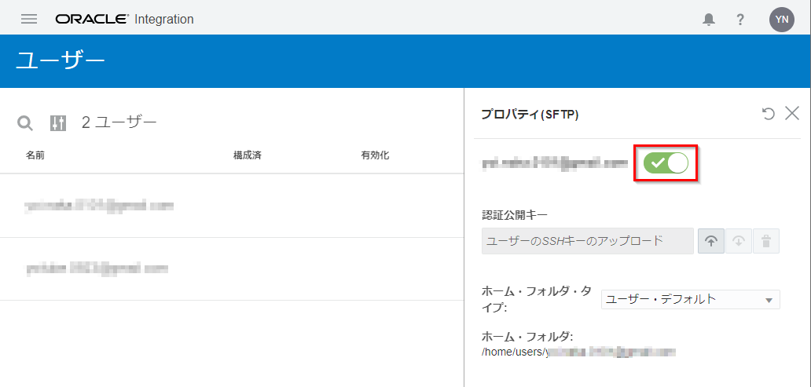

このチュートリアルは、Oracle Integration Cloud が提供する SFTP に対応したファイル・サーバーを有効化する手順について説明します。

前提条件
--------

このチュートリアルでは、Oracle Integration Cloud のインスタンスがすでに作成されていることを前提としています。 Oracle Integration Cloud のインスタンスをまだ作成していない場合は、次のページを参考に作成してください。

- [OIC インスタンスを作成する](../integration-for-commons)が実施済みであること

ファイル・サーバーの有効化
--------

Oracle Integration Cloud が提供している File Server は、インスタンスの作成直後は有効化されていません。 OCI コンソールを使用して、管理者が明示的に有効にする必要があります。

OCI コンソールにログインします。 サブスクライブしているリージョンの URL を使用します。

リージョン|URL
-|-
Tokyoリージョン|https://console.ap-tokyo-1.oraclecloud.com/
Osaka リージョン|https://console.ap-osaka-1.oraclecloud.com/
Phoenixリージョン|https://console.us-phoenix-1.oraclecloud.com/
Ashburnリージョン|https://console.us-ashburn-1.oraclecloud.com/
Frankfurtリージョン|https://console.eu-frankfurt-1.oraclecloud.com/



OCI コンソールの画面左上にあるハンバーガー・メニューをクリックし、 「開発者サービス」 カテゴリにある 「アプリケーション統合」 をクリックします。


OCI コンソールの画面左側のリストから、Oracle Integration Cloud のインスタンスを作成したコンパートメントを選択し、ファイル・サーバーを有効化するOracle Integration Cloudのインスタンスをクリックします。


Oracle Integration Cloud インスタンスの詳細ページが表示されます。 「統合インスタンス情報」 のボックスで、 「ファイル・サーバー」 の 「有効化」 リンクをクリックします。


ファイル・サーバーを有効化してもよいかを確認するメッセージ・ボックスが表示されます。 「有効化」 ボタンをクリックします。


ファイル・サーバーを有効化する処理が開始されたことを表すメッセージが表示されます。 また、Oracle Integration Cloud のインスタンスのステータスが 「更新中」 に変更されます。



ファイル・サーバーの有効化処理が終了すると、「統合インスタンス情報」 の 「ファイル・サーバー」 が 「有効」 と表示されます。 また、Oracle Integration Cloud のインスタンスのステータスは 「アクティブ」 に変更されます。


ファイル・サーバーの動作環境の確認
--------

ファイル・サーバーが有効化されたら、動作環境を確認します。

Oracle Integration Cloud のサービス・コンソールにログインします。 OCI コンソールで Oracle Integration Cloud インスタンスの詳細ページを開いている場合は、 「サービス・コンソール」 ボタンをクリックします。


画面左上のハンバーガ・メニュー・アイコンをクリックします。 画面左側に表示されるナビゲーション・ペインで、「設定」 をクリックします。



「設定」 メニューから 「ファイル・サーバー」 を選択します。


「ファイル・サーバー」 メニューから 「設定」 を選択します。



Integration Cloud のファイル・サーバーに関する設定が表示されます。 「一般」 セクションの 「IPおよびポート情報」 で、ファイル・サーバーが稼働している IP アドレスとポート番号を確認することができます。



ファイル・サーバーにアクセスするユーザーの有効化
--------

Oracle Integration Cloud のファイル・サーバーにアクセスするユーザーは、明示的に有効にする必要があります。

### (オプション)公開鍵認証のための鍵ペアの作成

Oracle Integration Cloud が提供するファイル・サーバーは、初期状態では、次の2種類の認証方式が使用できます:

- パスワード認証

パスワード認証は、Oracle Integration Cloud のサービス・コンソールにログインする時と同じユーザー名とパスワードを使用してファイル・サーバーにログインします。

- 公開鍵認証

公開鍵認証を使用するためには、ssh-kegen ツールを使用して、鍵ペアを作成します。 Windows 10 では PowerShell、 macOS ではターミナルを起動して、次のようなコマンドを実行します。

```
ssh-keygen -t rsa -b 2048 -C "OIC File Server" -f id_rsa_oic
```
コマンドを実行すると、パスフレーズの入力を促されるので、必要に応じて指定してください（パスフレーズが不要な場合は、そのまま Enter キーを押します）。

これによって、次の２つのファイルが生成されます:

key|value
-|-
id_rsa_oic|非公開鍵ファイル
id_rsa_oic.pub|公開鍵ファイル

### ユーザーの有効化

Oracle Integration Cloud のサービス・コンソールにログインします。 すでにファイル・サーバーの 「設定」 ページを開いている場合は、ナビゲーション・ペインで 「ユーザー」 をクリックします。「ホーム」 から遷移する場合は、ナビゲーション・ペインで 「設定」 → 「ファイル・サーバー」 → 「ユーザー」 をクリックしてください。

「ユーザー」 ページが表示され、 Oracle Integration Cloud にアクセス可能なユーザーの一覧が表示されます。


アクセスを有効化したいユーザーにマウス・ポインタを合わせると表示される、鉛筆のアイコン（「構成」 アイコン）をクリックします。


画面の右側に、選択したユーザーの SFTP アクセスのプロパティが表示されます。 画面右上のスイッチがオンになっていることを確認します。



【このステップはオプションです】 公開鍵認証のための鍵ペアを生成済みの場合は、 「認証公開キー」 のアップロード・アイコンをクリックして、公開鍵ファイル（*.pub ファイル）をアップロードします。

プロパティの画面の右上にある閉じるアイコンをクリックします。 「ユーザー」 画面で、選択したユーザーが構成済みと表示され、ホーム・フォルダが設定されていることを確認します。


動作確認
--------

SFTP のクライアント・ツール（FileZillaなど）または、Windows の PowerShell や macOS のターミナルを使用して、Oracle Integration Cloud のファイル・サーバーにアクセスしてみましょう。

CLI ツールを使用してファイル・サーバーにアクセスする場合は、次のように入力します。

ユーザー名/パスワードを使用する場合:
```
sftp -P <ポート番号> <ユーザー名>@<IPアドレス>
```

公開鍵認証を使用する場合:
```
sftp -P <ポート番号> -i <非公開鍵ファイル> <ユーザー名>@<IPアドレス>
```
