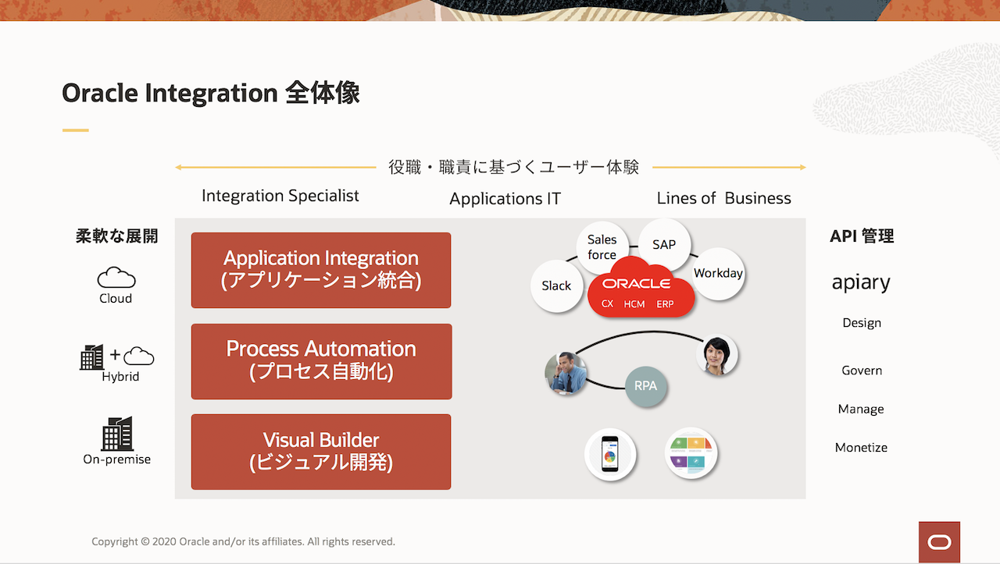
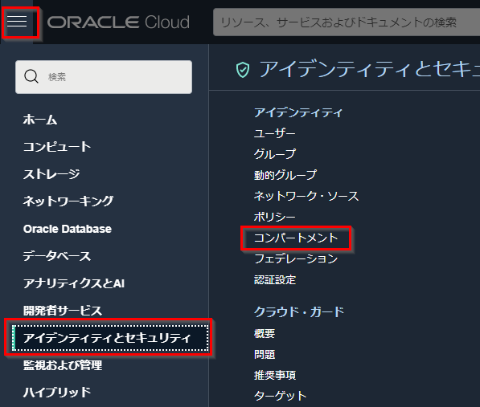
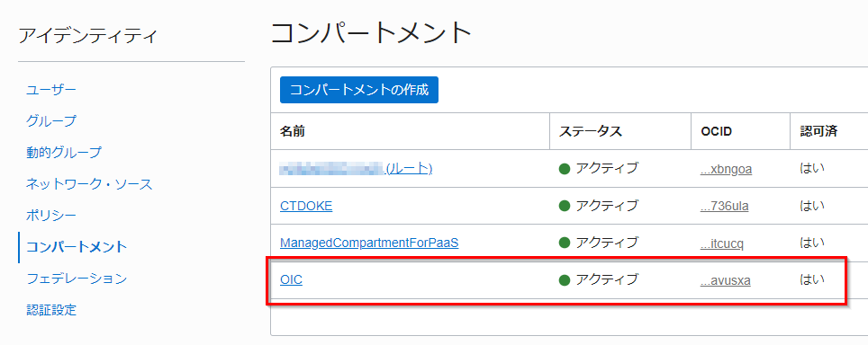
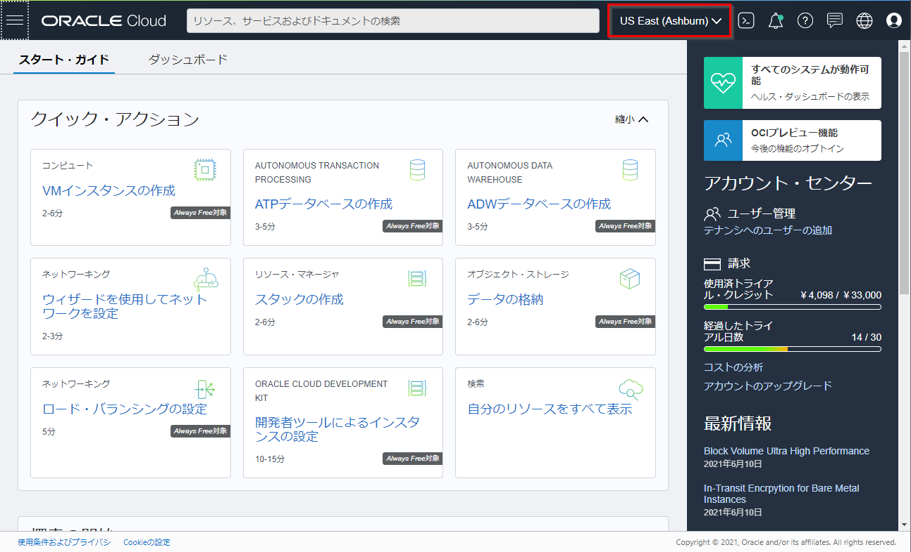
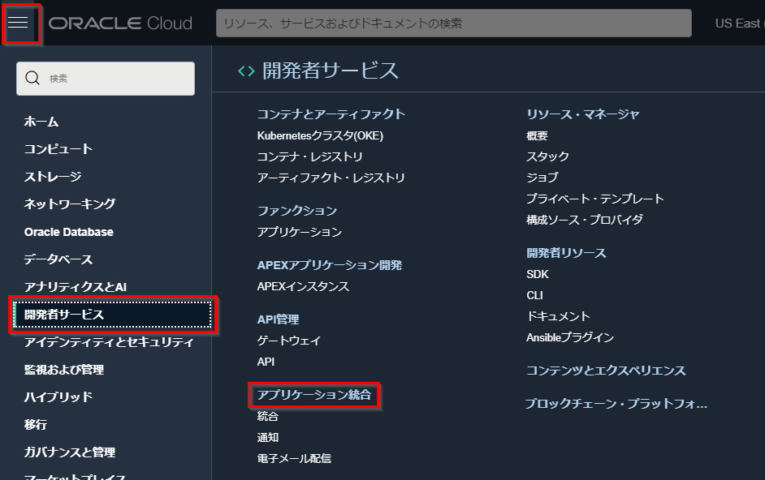
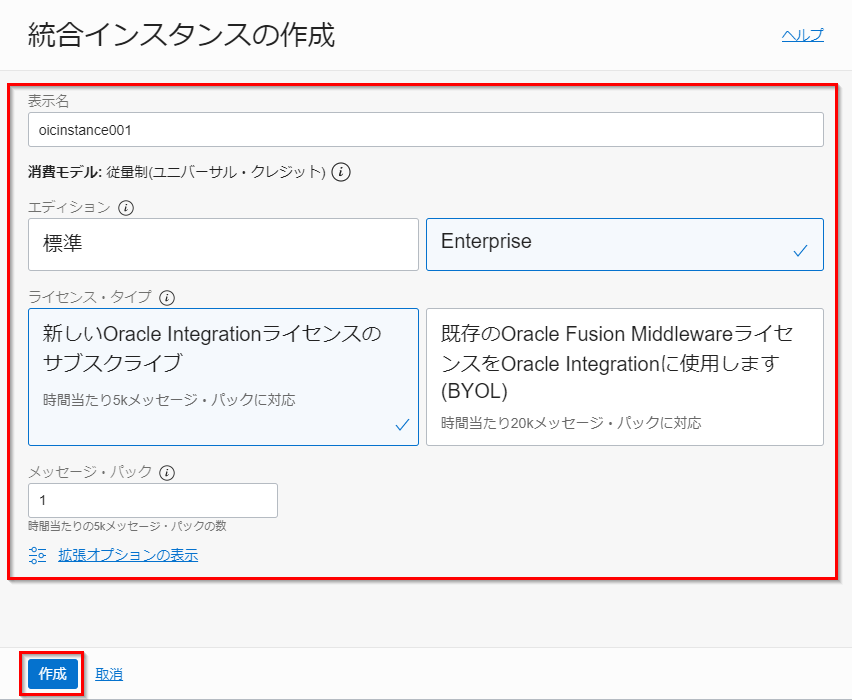
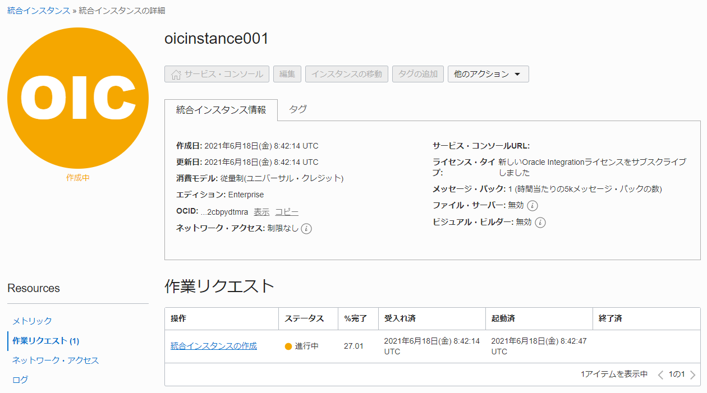
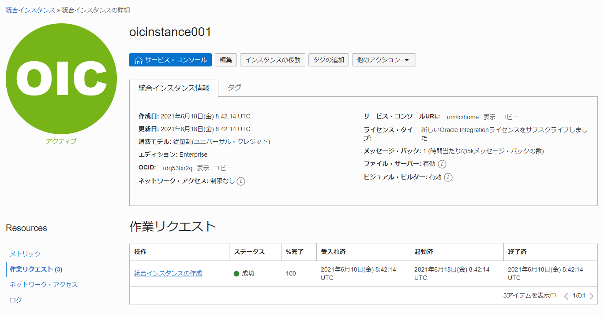
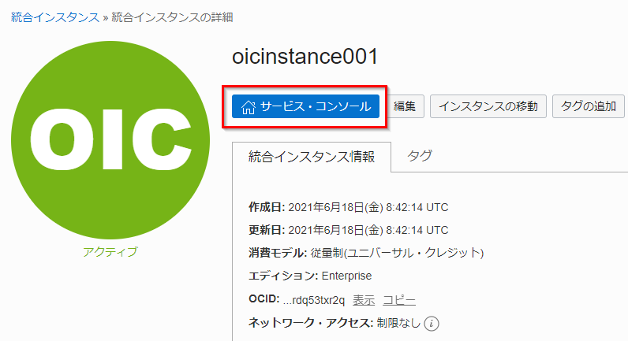

Oracle Integration(OIC) を使い始めるための準備作業として、OIC インスタンスの作成が必要になります。このハンズオンでは OIC インスタンスの作成方法を ステップ・バイ・ステップで紹介します。

OIC インスタンスの作成前に確認すること
--------

OIC インスタンスを作成する前の確認事項について説明します。

### 1. Oracle Cloud アカウントの準備

Oracle Cloud のアカウントを準備します。無料のトライアル環境（フリートライアル）と有料のクラウド・アカウントのご利用が可能です。

無料のトライアル環境の取得には認証用のSMSを受け取ることができる携帯電話と、有効なクレジットカードの登録が必要です。詳細は下記URLのページをご確認ください。

[Oracle Cloud 無料トライアルを申し込む](https://www.oracle.com/jp/cloud/free/)

トライアル環境のサインアップ手順はこちらをご確認ください。

[Oracle Cloud 無料トライアル・サインアップガイド(PDF)](https://faq.oracle.co.jp/app/answers/detail/a_id/6492)   
[Oracle Cloud 無料トライアルに関するよくある質問(FAQ)](https://www.oracle.com/jp/cloud/free/faq.html)

### 2. 作成可能なリージョンの確認

OIC インスタンスを作成可能なリージョンを確認します。詳細は[こちらのマニュアル](https://docs.oracle.com/en/cloud/paas/integration-cloud/oracle-integration-oci/availability.html)をご確認ください。

### 3. 制限事項の確認

クラウド・アカウントの発行時期により、作成可能な OIC インスタンスの種類が異なります。[こちらのマニュアル](https://docs.oracle.com/en/cloud/paas/integration-cloud/oracle-integration-oci/restrictions.html)に、OCI コンソールから作成する OIC Generation 2 インスタンスの作成条件が記載されています。

### 4. エディションの確認 (Standard or Enterprise)

OIC は、2つのエディション(Standard / Enterprise) が利用できます。それぞれのエディションで利用できる機能などは[こちらのマニュアル](https://docs.oracle.com/en/cloud/paas/integration-cloud/oracle-integration-oci/oracle-integration-editions.html)に記載されています。

### 5. OIC インスタンス作成を実行するユーザーの確認

OIC インスタンスの作成を実行するユーザーは、以下の条件の通りです。
- 該当するIdentity Domain内のユーザーであること
- 該当するIdentity DomainのAdministratorsグループに所属していること

OIC インスタンスを作成する
--------

### 1. サービス概要
Oracle Integrationは、アプリケーションの統合、プロセスの自動化およびビジュアル・アプリケーションの作成を可能にする完全に管理されたサービスです。 OIC は大きく3つの機能を提供します。

- アプリケーション統合: 統合を使用して、クラウドおよびオンプレミスのアプリケーション間の接続を設計、監視、および管理を実現
- プロセス自動化: プロセス・アプリケーションを作成して、ビジネス・ワークフローの自動化と可視化を実現
- ビジュアル開発: カスタムWebアプリケーションおよびモバイル・アプリケーションの迅速な開発を支援するローコード開発プラットフォーム

### 2. 準備
#### 2.1 OCI コンソールにサインイン
OICインスタンスは、Oracle Cloud Infrastructure コンソール（以降OCIコンソール）から作成します。ここでは、OIC インスタンスを作成するユーザーを利用し、OCI コンソールにアクセスします。

詳細は<a href="https://docs.oracle.com/ja-jp/iaas/integration/doc/signing-console-cloud-accounts-that-use-identity-domains.html" target="_blank" rel="noopener noreferrer">こちら</a>をご確認ください。

#### 2.2 コンパートメントの作成
OIC インスタンスは、基礎となるインフラストラクチャとしてOracle Cloud Infrastructure (OCI) を使用します。OIC インスタンスを作成するには、まず専用のコンパートメントを準備します。

ルート・コンパートメントに OIC インスタンスを作成する場合は、この手順をスキップすることができます。 
OCI コンソールの左上のメニューをクリックし、`アイデンティティ`と`セキュリティ`→`コンパートメント`を選択します。

`コンパートメントの作成`をクリックします。

名前と説明を入力し、`作成`をクリックします。ここでは以下の通りに入力します。

key|value
-|-
名前|OIC
説明|OIC
親コンパートメント|ルートコンパートメント「テナント名(ルート)」が選択されていることを確認

OIC コンパートメントが作成されることを確認します。

#### 2.3 アイデンティティ・ドメインを使用するクラウド・アカウントでのユーザー、グループおよびポリシーの設定   

クラウド・アカウントの作成前にアイデンティティ・ドメインを使用するように更新されたリージョン内のクラウド・アカウントの場合、ユーザーおよびグループはOracle Cloud Infrastructure Identity and Access Management (IAM)でのみ設定されます。   
アイデンティティ・ドメインでは、次の図に示すように、ロールがドメイン内のOracle Cloud Infrastructure IAMグループに割り当てられます。

#### 2.3.1 アイデンティティ・ドメインでのIAMグループの作成   

アイデンティティ・ドメインに、インスタンス管理者や読取り専用グループなどのグループを作成します。   

詳細は<a href="https://docs.oracle.com/ja-jp/iaas/integration/doc/henosis-creating-iam-group-identity-domain.html" target="_blank" rel="noopener noreferrer">こちら</a>をご確認ください。

#### 2.3.2 アイデンティティ・ドメインでのIAMポリシーの作成   

指定されたテナンシまたはコンパートメント内のOracle Integrationインスタンスと連携する権限をドメイン・グループのユーザーに付与するポリシーを作成します。   

詳細は<a href="https://docs.oracle.com/ja-jp/iaas/integration/doc/henosis-creating-iam-policy-identity-domain.html" target="_blank" rel="noopener noreferrer">こちら</a>をご確認ください。

#### 2.3.3 アイデンティティ・ドメインでのユーザーの作成   

Oracle Cloud Infrastructureアイデンティティ・ドメイン内のグループに割り当てるユーザーを作成します。   

詳細は<a href="https://docs.oracle.com/ja-jp/iaas/integration/doc/henosis-creating-user-identity-domain.html" target="_blank" rel="noopener noreferrer">こちら</a>をご確認ください。

以上で、OIC インスタンスの管理とOICインスタンスの利用ユーザーの管理の両方が、OCI コンソールから操作できるようになりました。

### 3. 作成

#### 3.1 OICインスタンスの作成

OCI コンソールを開きます。
OIC インスタンスを作成するリージョンを選択します。ここでは US East (Ashburn) を選択します。

OIC インスタンスが作成可能なリージョンを選択してください。詳細は[こちらのマニュアル](https://docs.oracle.com/en/cloud/paas/integration-cloud/oracle-integration-oci/availability.html)をご参照ください。
左上のナビゲーションメニュー→`開発者サービス`→`アプリケーション統合`を選択します。

コンパートメントを選択し、`統合インスタンスの作成`をクリックします。ここでは前の手順で作成した OIC コンパートメントを選択します。

以下の内容を入力し、`作成`をクリックします。

key|value
-|-
表示名|oicinstance001
エディション|Enterprise
ライセンス・タイプ|新しいOracle Integrationライセンスのサブスクライブ
メッセージ・パック|1


入力項目|説明
-|-
表示名|OICインスタンスの表示名。OIC インスタンスにアクセスする際のURLに含まれます。
エディション|標準 or ENTERPRISEより選択。エディションごとに利用できる機能の違いは、[こちらのマニュアル](https://docs.oracle.com/en/cloud/paas/integration-cloud/oracle-integration-oci/oracle-integration-editions.html)をご参照ください。
ライセンス・タイプ|新しいOICライセンスのサブスクライブ or 既存のFMW ライセンスをOICに使用します(BYOL) より選択
メッセージ・パック|メッセージパック数を選択。ライセンスタイプにより、1パックあたりのメッセージ数が異なります。


OIC インスタンス作成が開始されます。プロビジョニング中のインスタンス名をクリックします。

プロビジョニング中の OIC インスタンスの詳細が確認できます。インスタンスが作成中であることを確認します。
また、作業リクエストのステータスが進行中で、%完了が 0 より大きい数値となっていることを確認します。

しばらくすると、OIC インスタンスの作成が完了します。作業リクエストのステータスが`成功`で、%完了が `100` であることを確認します。

OIC インスタンスの作成が正常に行われた場合、通常10-20分程度で完了します。作業リクエストのステータスが「受け入れ済」、%完了が「0」のまま進まずに待機中状態が続く場合は、弊社サポートサービスへのお問い合わせ（サービス・リクエストの起票）をお願いいたします。

#### 3.1 アイデンティティ・ドメインのグループへのOracle Integrationロールの割当て   

Oracle Integrationインスタンスの作成後、Oracle Integrationロールをユーザーのグループに割り当てて、Oracle Integrationインスタンスの機能の使用を許可します。   

詳細は<a href="https://docs.oracle.com/ja-jp/iaas/integration/doc/henosis-assigning-oic-roles-groups-identity-domain.html" target="_blank" rel="noopener noreferrer">こちら</a>をご確認ください。

#### 3.2 確認
インスタンスがアクティブであることを確認し、`サービス・コンソール`をクリックします。

OIC インスタンスのユーザーインタフェースが開きます。

以上で、このチュートリアルは終了です。お疲れさまでした。
