Oracle Integration(OIC) を使い始めるための準備作業として、OIC インスタンスの作成が必要になります。このハンズオンでは OIC インスタンスの作成方法を ステップ・バイ・ステップで紹介します。

アイデンティティ・ドメインを使用した手順は[こちら](../integration-for-commons-1-instance-id)をご確認ください。

## OIC インスタンスの作成前に確認すること

OIC インスタンスを作成する前の確認事項について説明します。

### 1. Oracle Cloud アカウントの準備

Oracle Cloud のアカウントを準備します。無料のトライアル環境（フリートライアル）と有料のクラウド・アカウントのご利用が可能です。

無料のトライアル環境の取得には認証用の SMS を受け取ることができる携帯電話と、有効なクレジットカードの登録が必要です。詳細は下記 URL のページをご確認ください。

[Oracle Cloud 無料トライアルを申し込む](https://www.oracle.com/jp/cloud/free/)

トライアル環境のサインアップ手順はこちらをご確認ください。

[Oracle Cloud 無料トライアル・サインアップガイド(PDF)](https://faq.oracle.co.jp/app/answers/detail/a_id/6492)
[Oracle Cloud 無料トライアルに関するよくある質問(FAQ)](https://www.oracle.com/jp/cloud/free/faq.html)

### 2. 作成可能なリージョンの確認

OIC インスタンスを作成可能なリージョンを確認します。詳細は[こちらのマニュアル](https://docs.oracle.com/en/cloud/paas/integration-cloud/oracle-integration-oci/availability.html)をご確認ください。

### 3. 制限事項の確認

クラウド・アカウントの発行時期により、作成可能な OIC インスタンスの種類が異なります。[こちらのマニュアル](https://docs.oracle.com/en/cloud/paas/integration-cloud/oracle-integration-oci/restrictions.html)に、OCI コンソールから作成する OIC Generation 2 インスタンスの作成条件が記載されています。

### 4. エディションの確認 (Standard or Enterprise)

OIC は、2 つのエディション(Standard / Enterprise) が利用できます。それぞれのエディションで利用できる機能などは[こちらのマニュアル](https://docs.oracle.com/en/cloud/paas/integration-cloud/oracle-integration-oci/oracle-integration-editions.html)に記載されています。

### 5. OIC インスタンス作成を実行するユーザーの確認

OIC インスタンスの作成を実行するユーザーは、以下の条件の通りです。

- Oracle Identity Cloud Service のフェデレーテッド・ユーザー (IDCS ユーザー) であること
- IDCS で管理される OCI_Administrators グループに所属していること

## OIC インスタンスを作成する

### 1. サービス概要

Oracle Integration は、アプリケーションの統合、プロセスの自動化およびビジュアル・アプリケーションの作成を可能にする完全に管理されたサービスです。 OIC は大きく 3 つの機能を提供します。

- アプリケーション統合: 統合を使用して、クラウドおよびオンプレミスのアプリケーション間の接続を設計、監視、および管理を実現
- プロセス自動化: プロセス・アプリケーションを作成して、ビジネス・ワークフローの自動化と可視化を実現
- ビジュアル開発: カスタム Web アプリケーションおよびモバイル・アプリケーションの迅速な開発を支援するローコード開発プラットフォーム

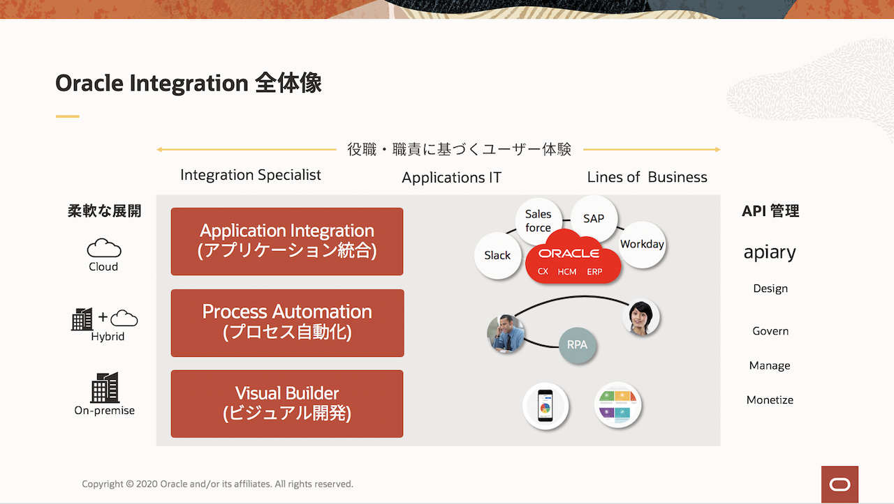

### 2. 準備

#### 2.1 OCI コンソールに IDCS ユーザーでサインイン

OIC インスタンスは、Oracle Cloud Infrastructure コンソール（以降 OCI コンソール）から作成します。ここでは、OIC インスタンスを作成するユーザーを利用し、OCI コンソールにアクセスします。

以下 URL のどれかをクリックし、ブラウザで OCI コンソール にアクセスします。


リージョン|URL
-|-
Tokyo リージョン|https://console.ap-tokyo-1.oraclecloud.com/
Osaka リージョン|https://console.ap-osaka-1.oraclecloud.com/
Phoenix リージョン|https://console.us-phoenix-1.oraclecloud.com/
Ashburn リージョン|https://console.us-ashburn-1.oraclecloud.com/
Frankfurt リージョン|https://console.eu-frankfurt-1.oraclecloud.com/

ログイン用の URL は各リージョン毎に用意されていますが、どのエンドポイントからも世界中の OCI コンソールにアクセス可能です。



Cloud Tenant を入力し、`Continue`をクリックします。
Cloud Tenant には、Oracle Cloud 契約時、もしくはトライアル環境を申し込んだ際に払い出される一意の ID（クラウド・アカウント）を入力します。

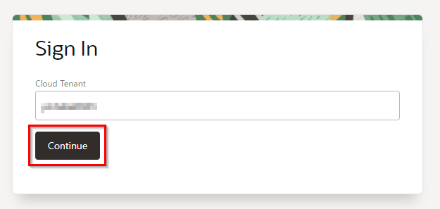

左側の Single Sign-On (SSO) の下の`Continue`をクリックします。
左側の Single Sign-On (SSO) は、IDCS で認証されます。ここでサイン・インできれば、作成前に確認することの 4.に記載される「IDCS ユーザーであること」は OK となります。

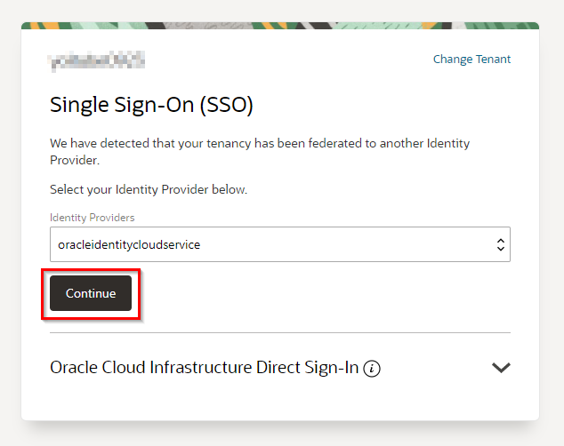

ユーザー名とパスワードを入力し、`サイン・イン`をクリックします。

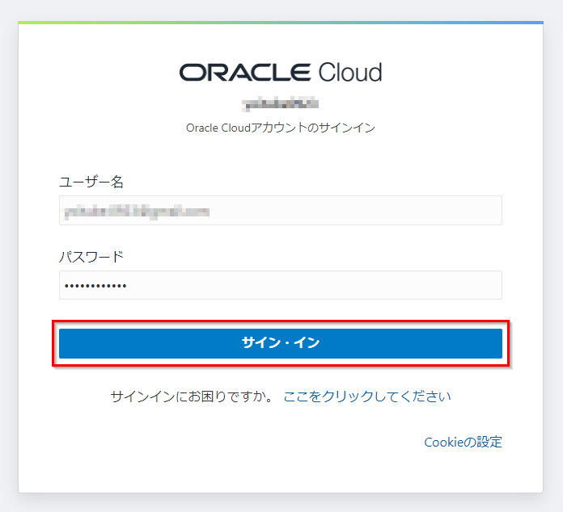

OCI コンソールが表示されます。

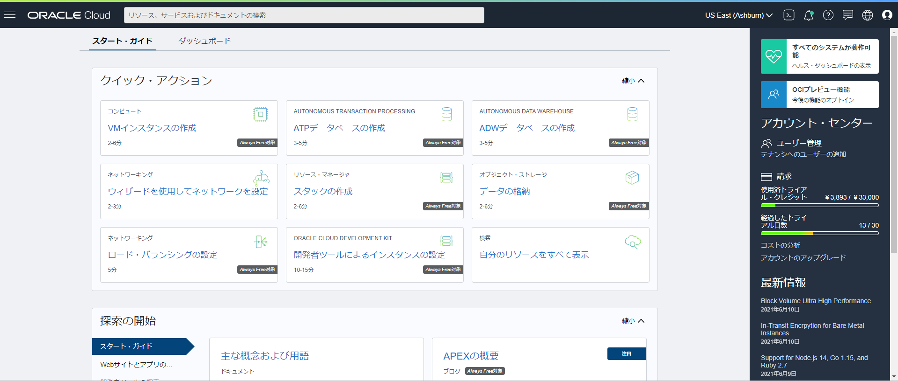

#### 2.2 コンパートメントの作成

OIC インスタンスは、基礎となるインフラストラクチャとして Oracle Cloud Infrastructure (OCI) を使用します。OIC インスタンスを作成するには、まず専用のコンパートメントを準備します。

ルート・コンパートメントに OIC インスタンスを作成する場合は、この手順をスキップすることができます。
OCI コンソールの左上のメニューをクリックし、`アイデンティティ`と`セキュリティ`→`コンパートメント`を選択します。

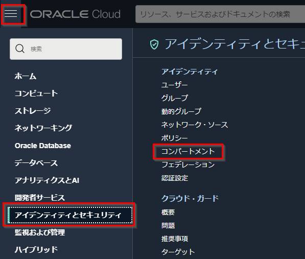

`コンパートメントの作成`をクリックします。

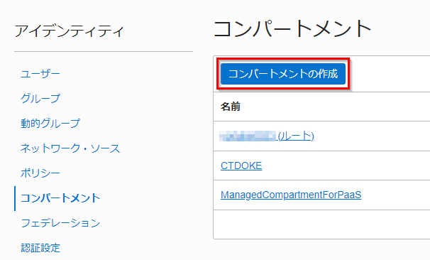

名前と説明を入力し、`作成`をクリックします。ここでは以下の通りに入力します。

| key                | value                                                                  |
| ------------------ | ---------------------------------------------------------------------- |
| 名前               | OIC                                                                    |
| 説明               | OIC                                                                    |
| 親コンパートメント | ルートコンパートメント「テナント名(ルート)」が選択されていることを確認 |

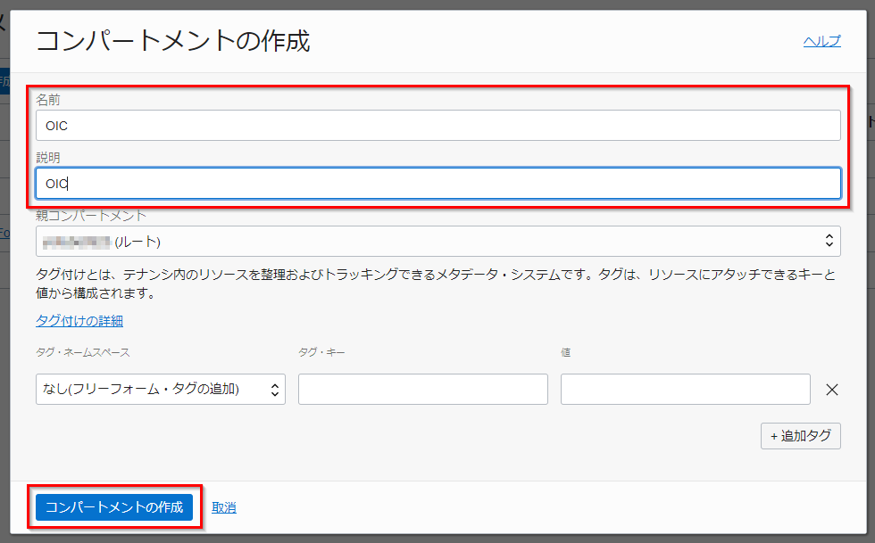

OIC コンパートメントが作成されることを確認します。

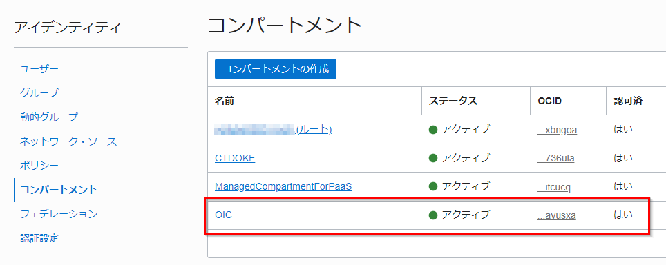

#### 2.3 1 つのコンソールで OIC インスタンスの作成と管理に対するアクセスを構成

OIC インスタンスは、Oracle Cloud Infrastructure Identity and Access Management (OCI IAM) と Oracle Identity Cloud Service (IDCS) の両方を利用します。

OCI IAM サービスのポリシーを使用して、OIC インスタンスの作成や管理などの権限を制御します。
IDCS を使用して、OIC を利用するユーザーの作成および管理をします。

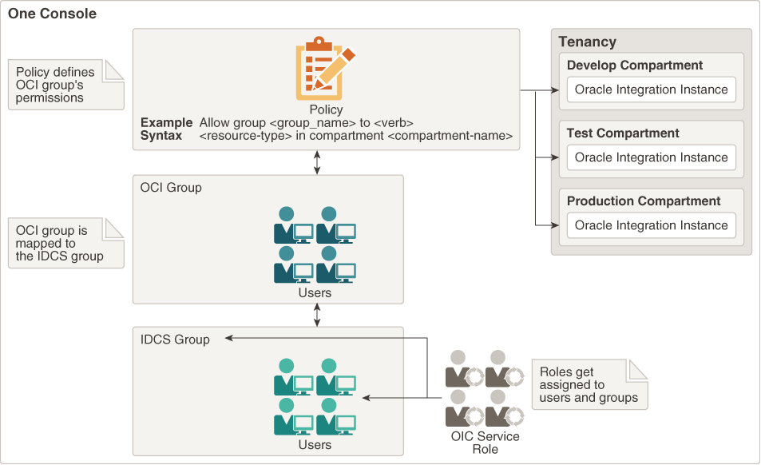

ここでは、以下の表に示す OIC インスタンスの作成及び管理を実行するグループを作成し、そこに管理ユーザーを割り当てます。

これにより、OIC インスタンスの管理と、OIC の利用ユーザーの管理の両方を、OCI コンソールのみで実現できるようにします。

| IDCS グループ           | OCI グループ           |
| ----------------------- | ---------------------- |
| idcs-integration-admins | oci-integration-admins |

#### 2.3.1 IDCS グループの作成

OCI コンソールを開きます。
左上のナビゲーションメニュー →`アイデンティティ`→`フェデレーション`をクリックします。

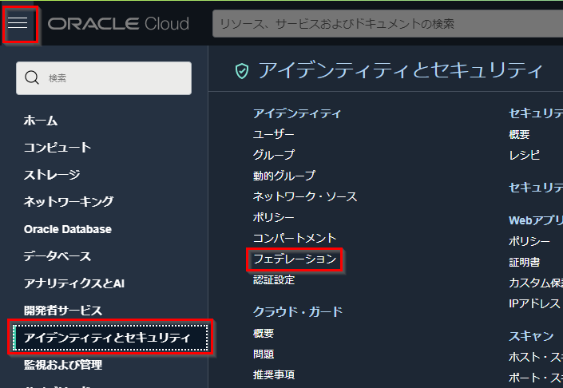

`OracleIdentityCloudService`をクリックします。

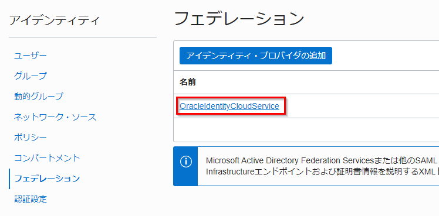

左下のリソースオプション配下の`グループ`をクリックします。

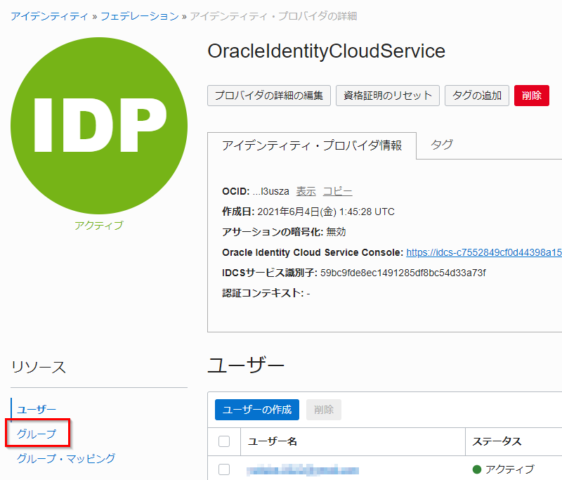

`IDCSグループの作成`をクリックします。

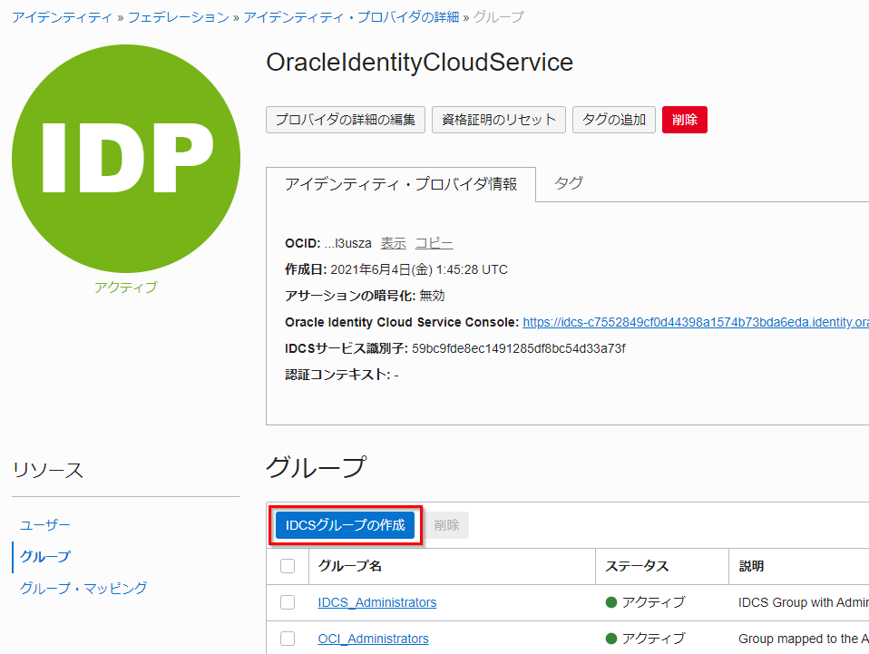

名前と説明を入力し、`作成`をクリックします。ここでは以下の通りに入力します。

| key  | value                    |
| ---- | ------------------------ |
| 名前 | idcs-integration-admins  |
| 説明 | IDCS group for OIC admin |

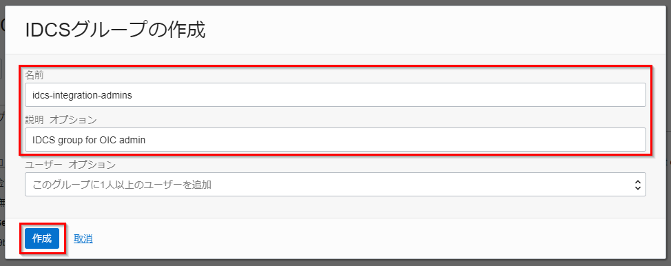

idcs-integration-admins グループが作成されることを確認します。

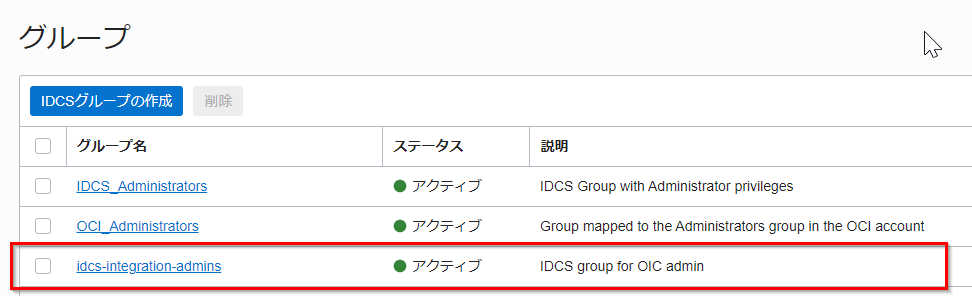

#### 2.3.2 OCI グループの作成

OCI コンソールの左上のナビゲーションメニュー →`アイデンティティ`→`グループ`をクリックします。

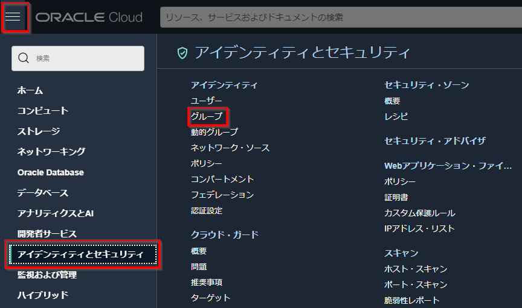

`グループの作成`をクリックします。

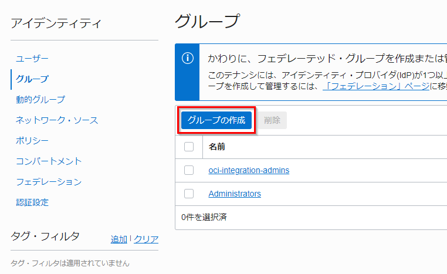

名前と説明を入力し、`作成`をクリックします。ここでは以下の通りに入力します。

| key  | value                   |
| ---- | ----------------------- |
| 名前 | oci-integration-admins  |
| 説明 | OCI group for OIC admin |

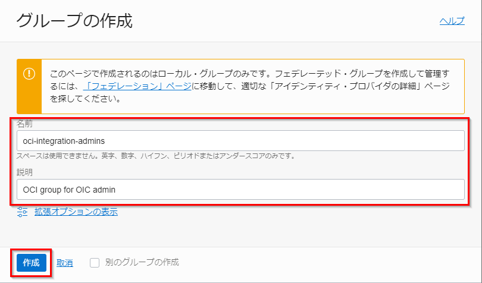

oci-integration-admins グループが作成されることを確認します。

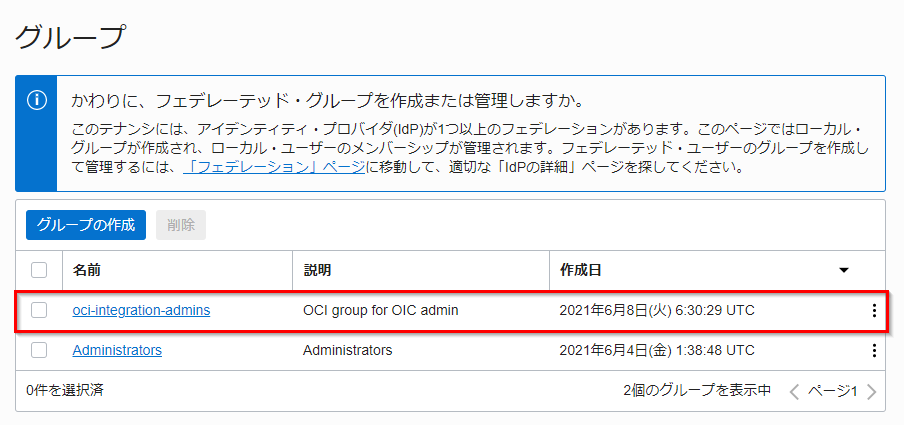

#### 2.3.3 IDCS グループと OCI グループのマッピング

OCI コンソールの左上のナビゲーションメニュー →`アイデンティティ`→`フェデレーション`をクリックします。

`OracleIdentityCloudService`をクリックします。

左下のリソースオプション配下の`グループ・マッピング`をクリックします。

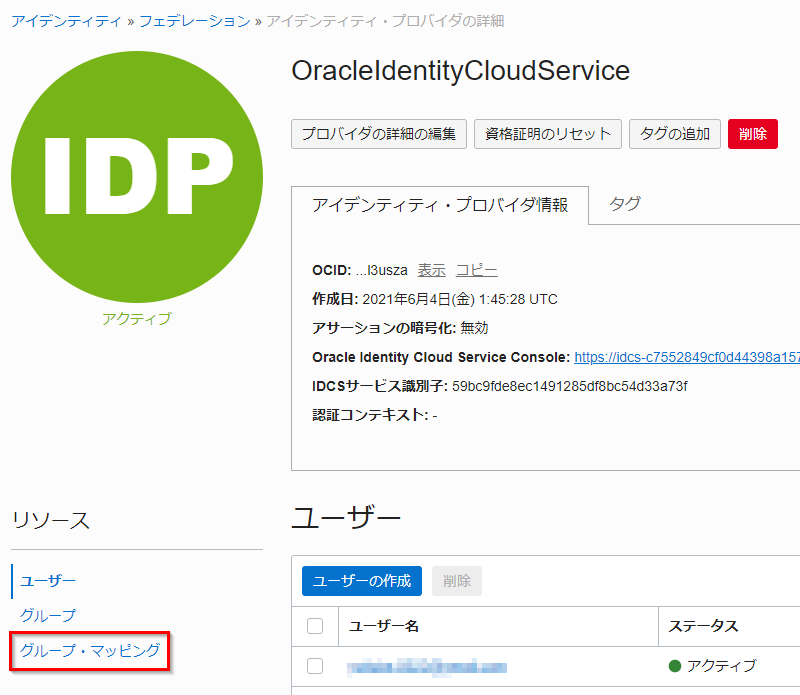

`マッピングの追加`をクリックします。

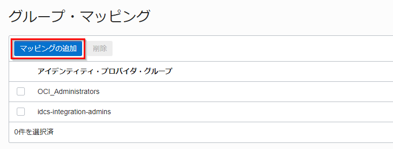

アイデンティティ・プロバイダ・グループより idcs-integration-admins を、OCI グループから oci-integration-admins をそれぞれ選択し、`送信`をクリックします。

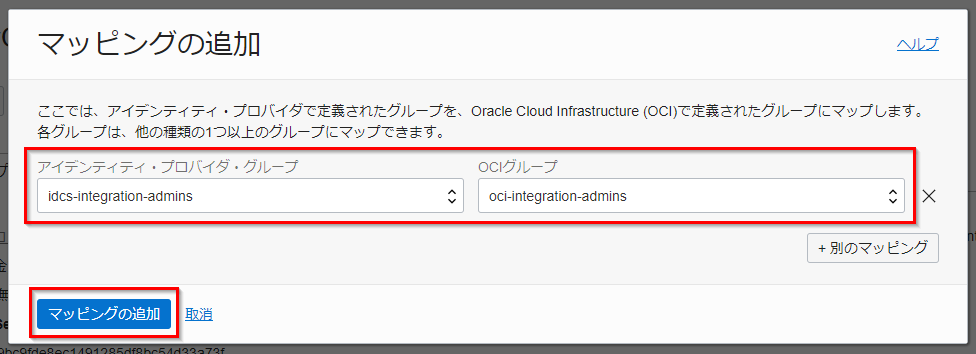

グループ・マッピングが作成されることを確認します。
これにより、 IDCS グループの idcs-integration-admins に所属する IDCS ユーザーは、自動的に OCI グループの oci-integration-admins に所属することとなります。

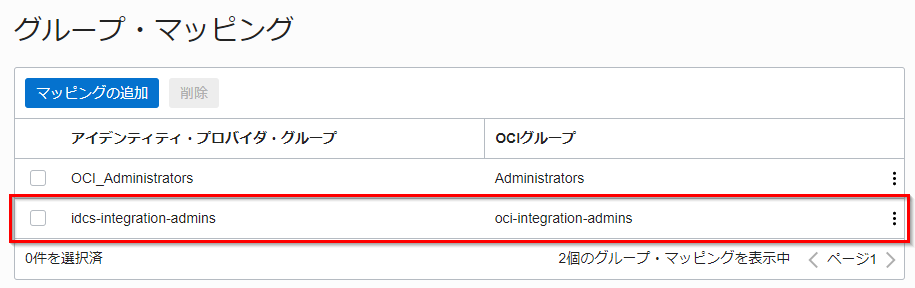

#### 2.3.4 OCI ポリシーの作成

OCI コンソールの左上のナビゲーションメニュー →`アイデンティティ`→`ポリシー`をクリックします。

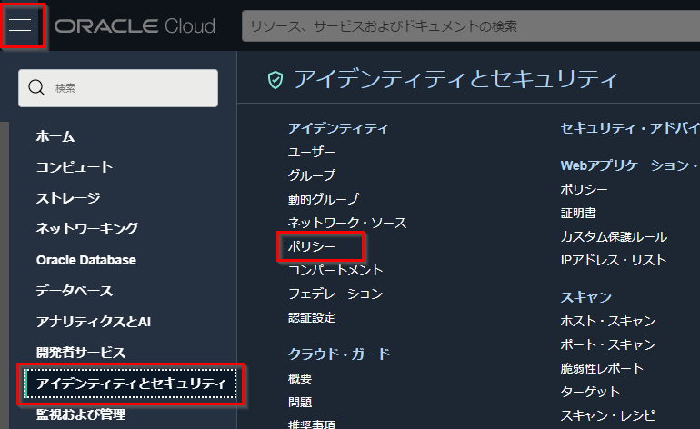

`ポリシーの作成`をクリックします。

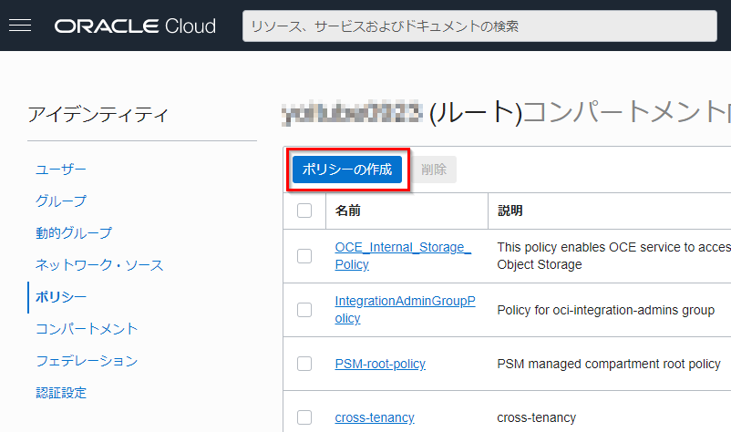

ポリシー・ビルダーにある`手動エディタの表示`をオンにします。

名前、説明、ポリシー・ビルダーを入力し、`作成`をクリックします。ここでは以下の通りに入力します。

| key                | value                                                                                |
| ------------------ | ------------------------------------------------------------------------------------ |
| 名前               | IntegrationAdminGroupPolicy                                                          |
| 説明               | Policy for oci-integration-admins group                                              |
| ポリシー・ビルダー | allow group oci-integration-admins to manage integration-instance in compartment OIC |

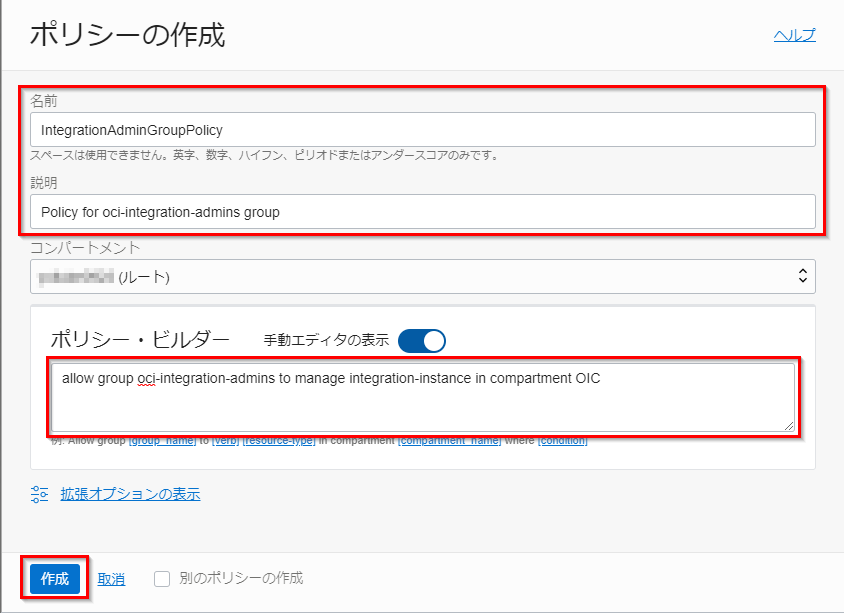

ポリシー・ステートメントの意味は「oci-integration-admins グループに所属するユーザーに対して、OIC コンパートメント内の OIC インスタンスを管理することを許可」です。
ポリシーが作成されることを確認します。

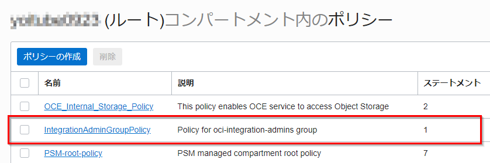

#### 2.3.5 ユーザーを IDCS グループに追加

OCI コンソールの左上のナビゲーションメニュー →`アイデンティティ`→`フェデレーション`をクリックします。

`OracleIdentityCloudService`をクリックします。

左下のリソースオプション配下の`グループ`をクリックします。

`idcs-integration-admins`をクリックします。

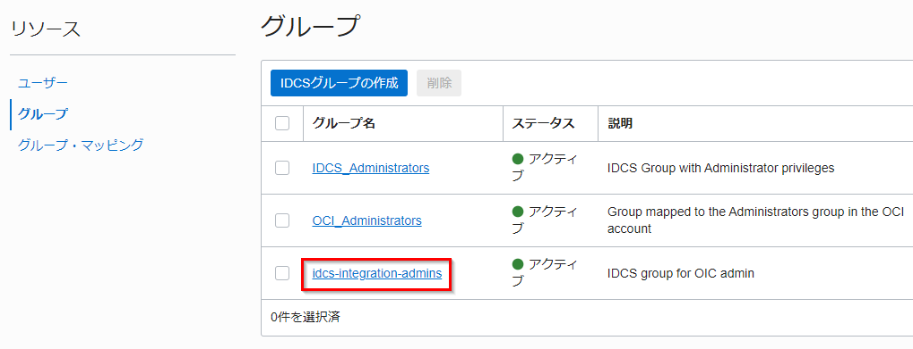

`IDCSユーザーの追加`をクリックします。

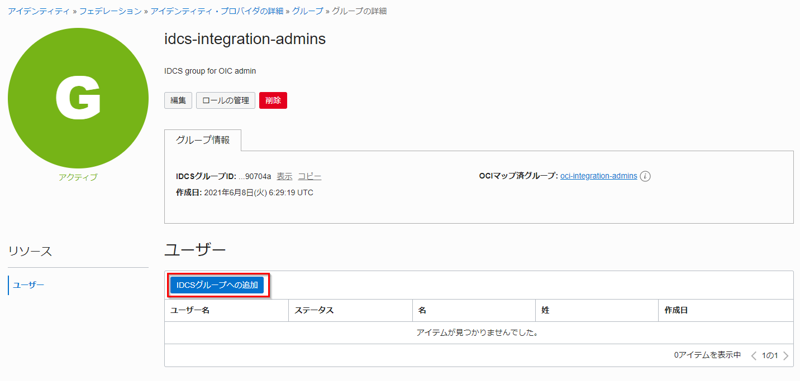

プルダウンから追加ユーザーを選択し、`追加`をクリックします。

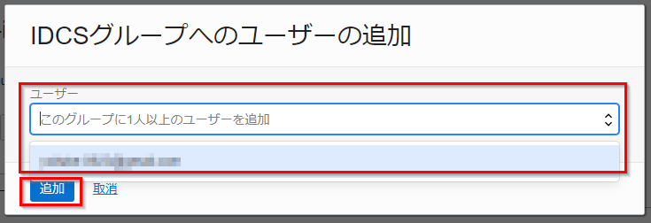

IDCS グループにユーザーが追加されることを確認します。

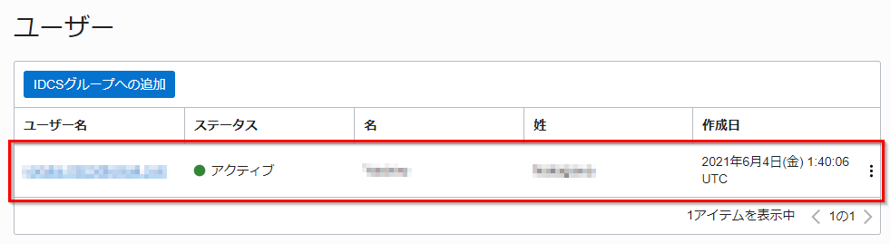

#### 2.3.6 IDCS グループに OIC インスタンスの作成権限を付与

idcs-integration-admins グループを開いたまま、`ロールの管理`をクリックします。

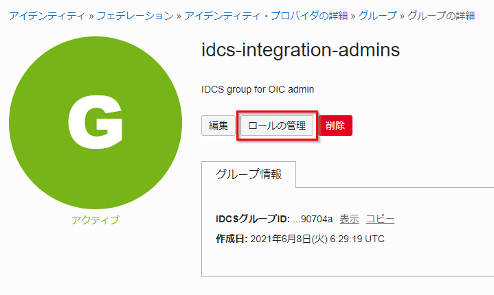

`INTEGRATIONAUTO`を探し、右端のメニューをクリック →`サービス・アクセスの管理`をクリックします。

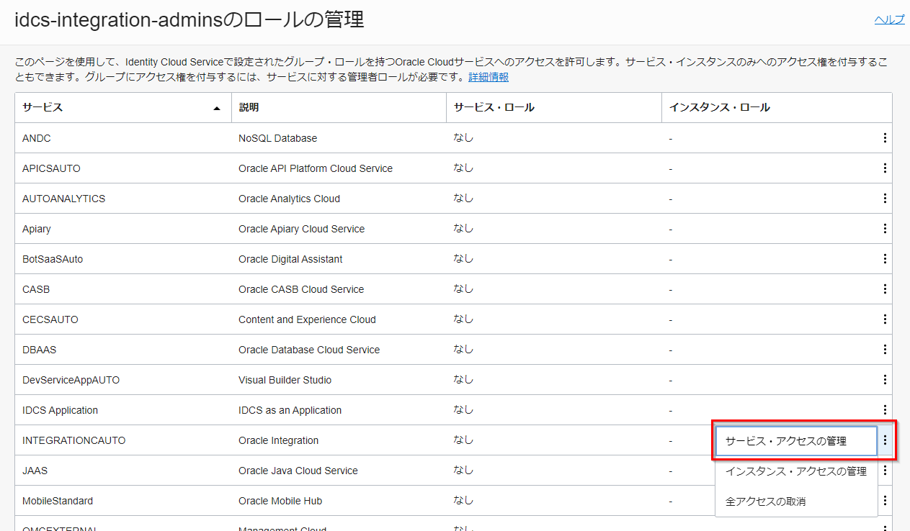

`AUTONOMOUS_INTEGRATIONCLOUD_ENTITLEMENT_ADMINISTRATOR`を選択し、`ロール選択`の保存をクリックします。

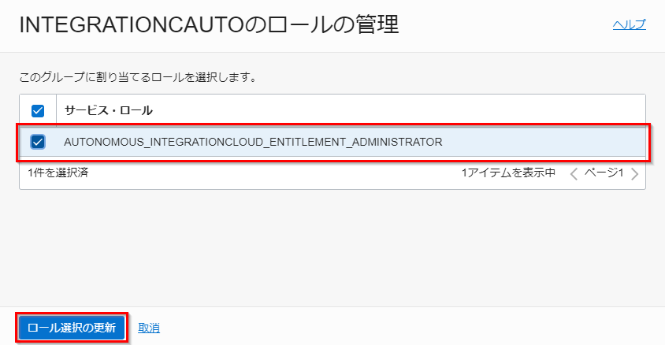

`AUTONOMOUS_INTEGRATIONCLOUD_ENTITLEMENT_ADMINISTRATOR`が選択されていることを確認し、`サービス・ロール設定の適用`をクリックします。

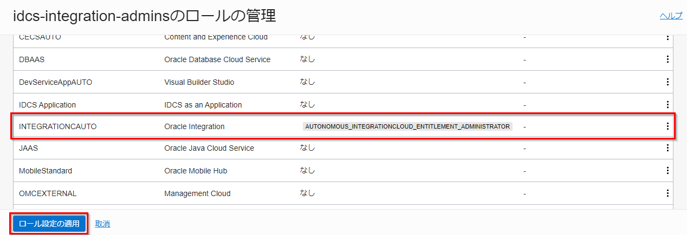

`閉じる`をクリックします。

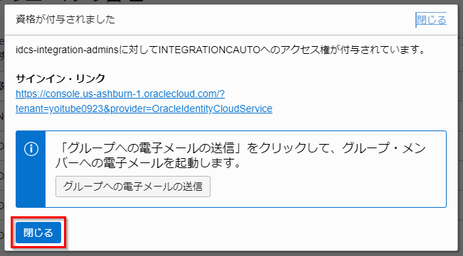

以上で、idcs-integration-admins グループに所属する IDCS ユーザーが、OIC インスタンスの管理と OIC インスタンスの利用ユーザーの管理の両方が、OCI コンソールから操作できるようになりました。

### 3. 作成

#### 3.1 OIC インスタンスの作成

OCI コンソールを開きます。
OIC インスタンスを作成するリージョンを選択します。ここでは US East (Ashburn) を選択

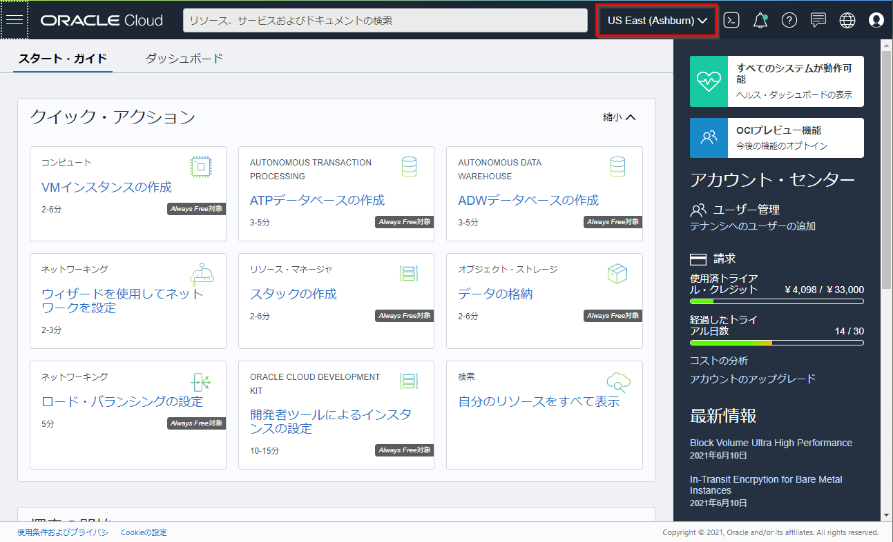

OIC インスタンスが作成可能なリージョンを選択してください。詳細は[こちらのマニュアル](https://docs.oracle.com/en/cloud/paas/integration-cloud/oracle-integration-oci/availability.html)をご参照ください。
左上のナビゲーションメニュー →`開発者サービス`→`アプリケーション統合`を選択します。

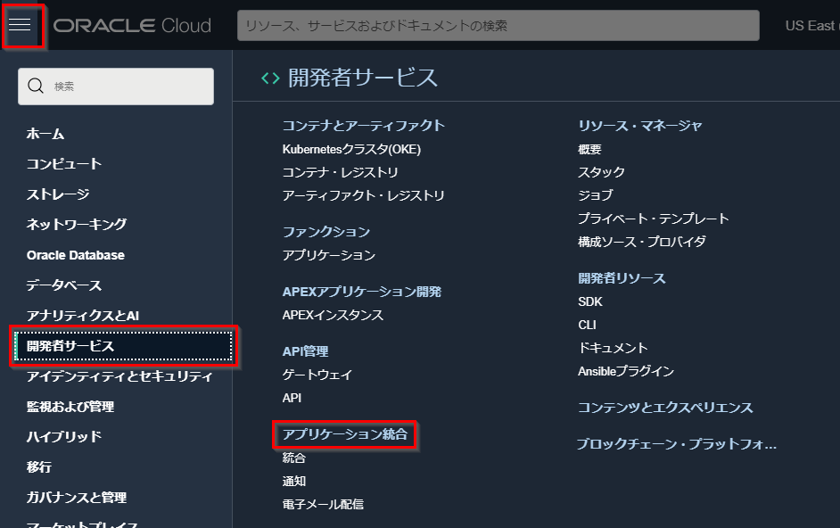

コンパートメントを選択し、`統合インスタンスの作成`をクリックします。ここでは前の手順で作成した OIC コンパートメントを選択します。

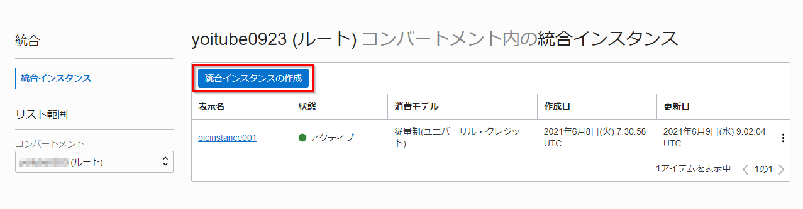

以下の内容を入力し、`作成`をクリックします。

| key                | value                                                |
| ------------------ | ---------------------------------------------------- |
| 表示名             | oicinstance001                                       |
| エディション       | Enterprise                                           |
| ライセンス・タイプ | 新しい Oracle Integration ライセンスのサブスクライブ |
| メッセージ・パック | 1                                                    |

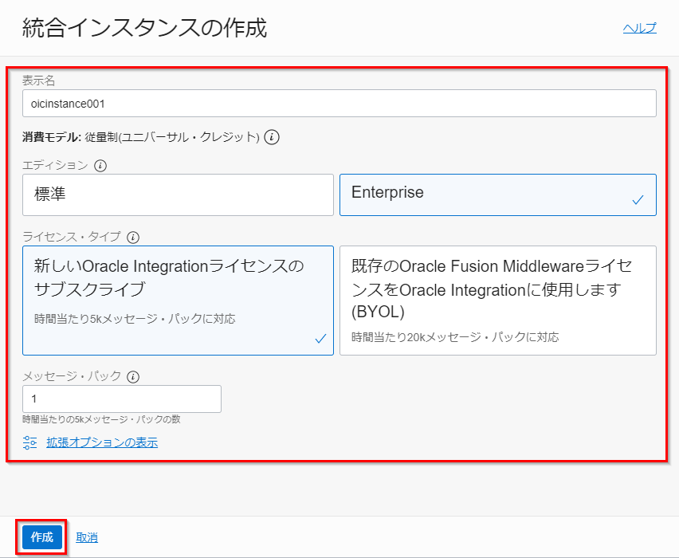



| 入力項目           | 説明                                                                                                                                                                                                                           |
| ------------------ | ------------------------------------------------------------------------------------------------------------------------------------------------------------------------------------------------------------------------------ |
| 表示名             | OIC インスタンスの表示名。OIC インスタンスにアクセスする際の URL に含まれます。                                                                                                                                                |
| エディション       | 標準 or ENTERPRISE より選択。エディションごとに利用できる機能の違いは、[こちらのマニュアル](https://docs.oracle.com/en/cloud/paas/integration-cloud/oracle-integration-oci/oracle-integration-editions.html)をご参照ください。 |
| ライセンス・タイプ | 新しい OIC ライセンスのサブスクライブ or 既存の FMW ライセンスを OIC に使用します(BYOL) より選択                                                                                                                               |
| メッセージ・パック | メッセージパック数を選択。ライセンスタイプにより、1 パックあたりのメッセージ数が異なります。                                                                                                                                   |



OIC インスタンス作成が開始されます。プロビジョニング中のインスタンス名をクリックします。

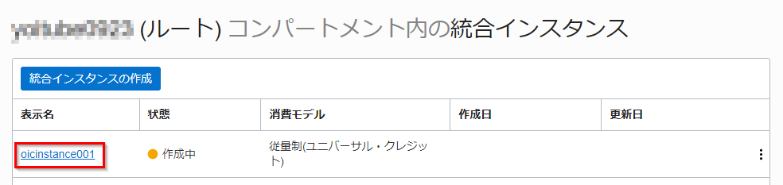

プロビジョニング中の OIC インスタンスの詳細が確認できます。インスタンスが作成中であることを確認します。
また、作業リクエストのステータスが進行中で、%完了が 0 より大きい数値となっていることを確認します。

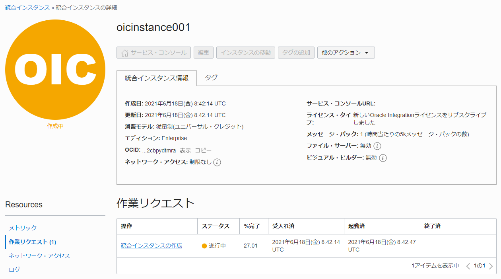

しばらくすると、OIC インスタンスの作成が完了します。作業リクエストのステータスが`成功`で、%完了が `100` であることを確認します。

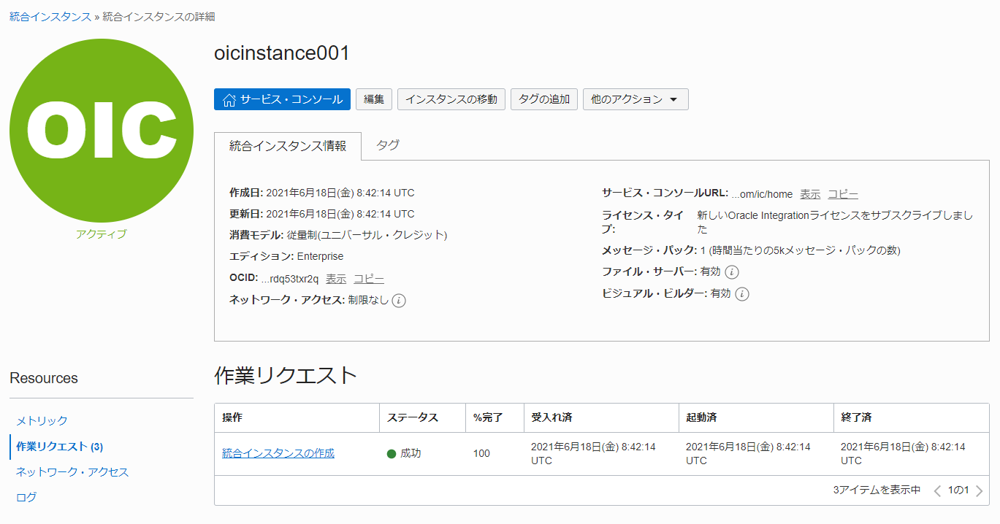

OIC インスタンスの作成が正常に行われた場合、通常 10-20 分程度で完了します。作業リクエストのステータスが「受け入れ済」、%完了が「0」のまま進まずに待機中状態が続く場合は、弊社サポートサービスへのお問い合わせ（サービス・リクエストの起票）をお願いいたします。

#### 3.2 確認

インスタンスがアクティブであることを確認し、`サービス・コンソール`をクリックします。

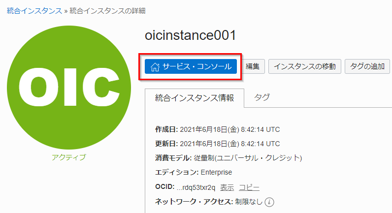

OIC インスタンスのユーザーインタフェースが開きます。

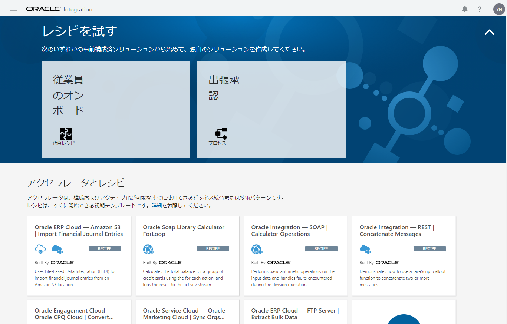

以上で、このチュートリアルは終了です。お疲れさまでした。
