OCI Process Automation(OPA) の機能を利用して、作成編で作成したワークフローを実行する手順を紹介するチュートリアルです。

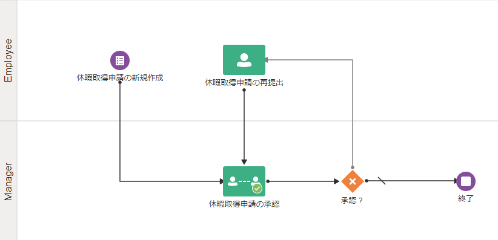

前提条件
--------

- [OPA インスタンスの作成](https://docs.oracle.com/ja-jp/iaas/process-automation/oci-process-automation/provision-process-automation-instance.html) が完了していること または Oracle Integration 3 Enterprise Edition インスタンスを作成し、[OPA を有効化](https://docs.oracle.com/ja-jp/iaas/process-automation/oci-process-automation/enable-process-automation-oracle-integration-3.html)していること(OPAはOIC3 Enterprise Editionにも含まれています)

- [アクセスの管理とロールの割当](https://docs.oracle.com/ja-jp/iaas/process-automation/oci-process-automation/manage-access-and-assign-roles.html)が完了していること

- [Oracle Cloud Infrastructure Process Automation で簡単なワークフローを作成してみよう(作成編)](../opa-for-beginners-1-designer/)が完了していること

OPA workspaceでワークフローを実行する   
--------

OPA ではワークフローをdesignの画面で作成し、workspaceの画面で申請、承認などを実行します。

### OPA workspaceにアクセスする   
Web ブラウザを開き、提供された OPA workspaceのURLを入力します。もしくはOPAのdesign画面から左のメニューで「workspace」をクリックして遷移します。

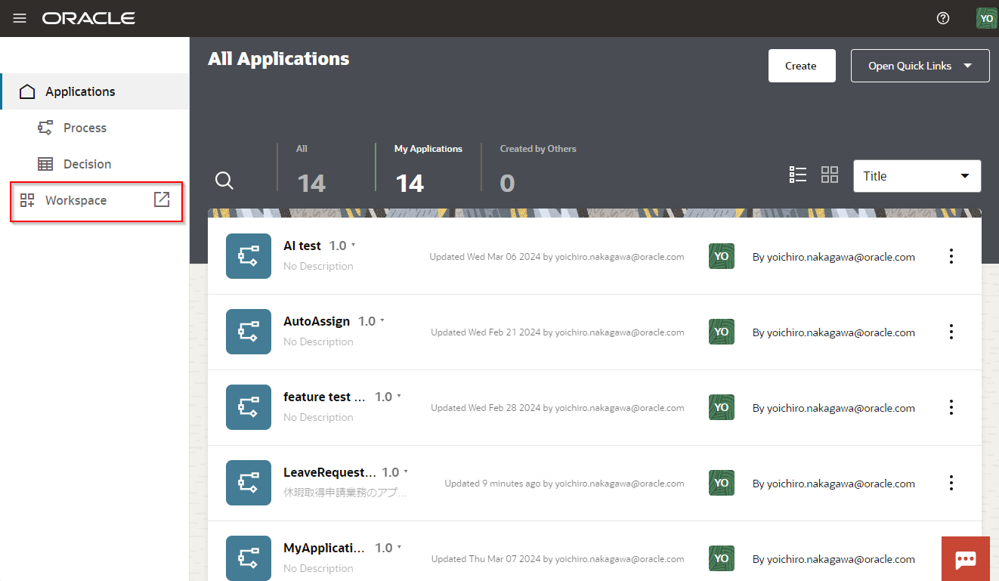


画面を開く際、OCIにログインしていない場合はログインしてください。


OIC workspaceのホーム画面が開きます。
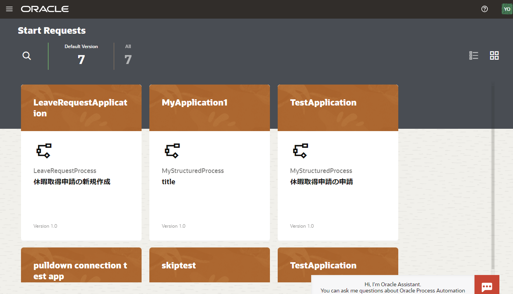

### プロセス・アプリケーションの申請を開始する

Start Requestsの画面ではアクティベートされたプロセス・アプリケーションが一覧で表示されています。   
その中から[Oracle Cloud Infrastructure Process Automation で簡単なワークフローを作成してみよう(作成編)](../opa-for-beginners-1-designer/)で作成したアプリケーションを探してクリックします。手順の通りであればLeaveRequestApplicationの名前のアプリケーションです。

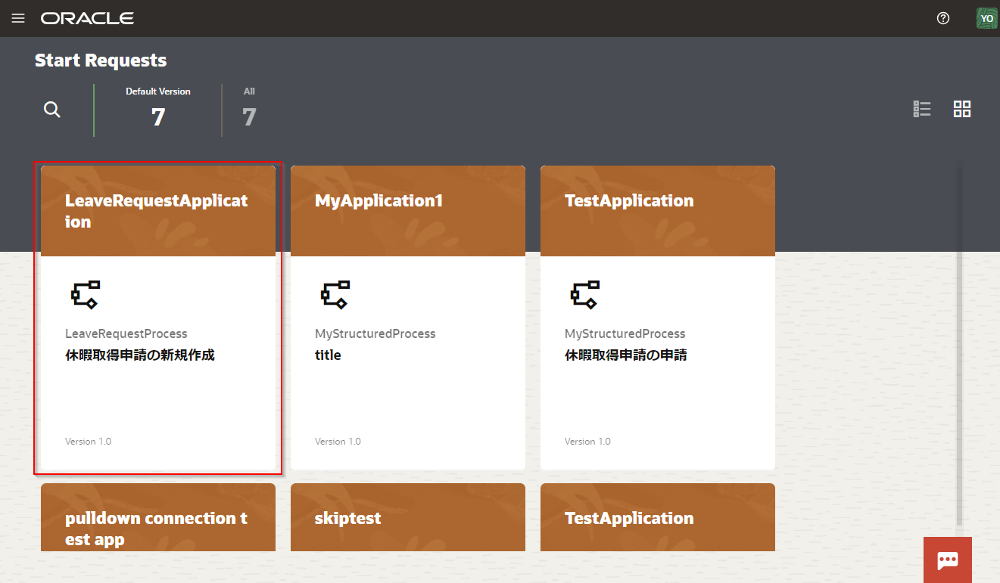

任意の項目を入力して「Submit」をクリックします。

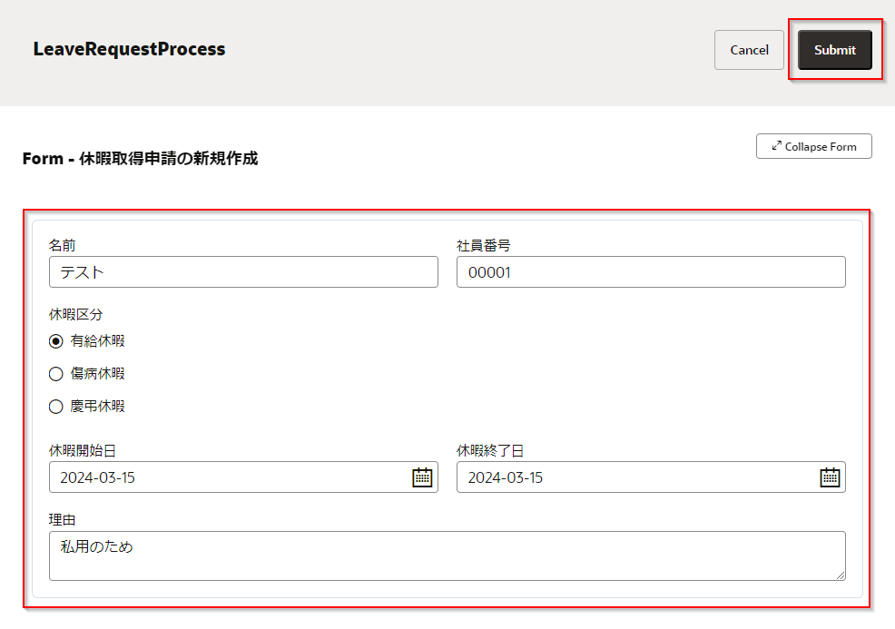

これで申請が完了しました。

### 申請の状況を確認する

次に申請したアプリケーションの状況を確認します。

左上のメニューから「Tracking」をクリックします。

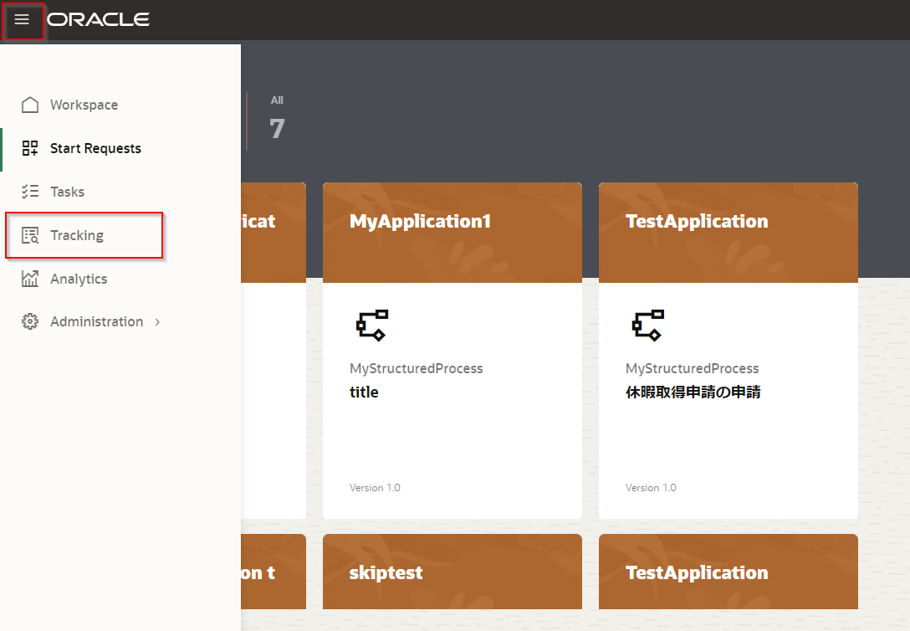

先ほど開始した申請が表示されるのでクリックして詳細を開きます。

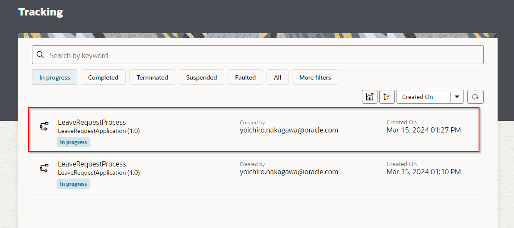

ここでは申請の状況が確認できます。Auditをクリックするとどこまで申請が進んでいるか確認することができます。

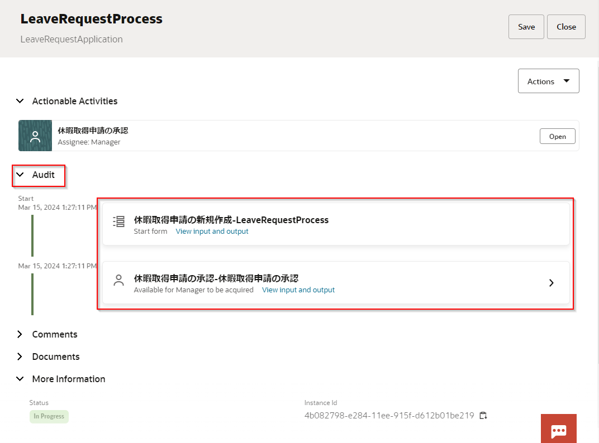

また、進行中のタスクではアサインされているロールやユーザーを確認することができます。

「View input and output」を押すと申請や承認時に入力された値を確認することができます。

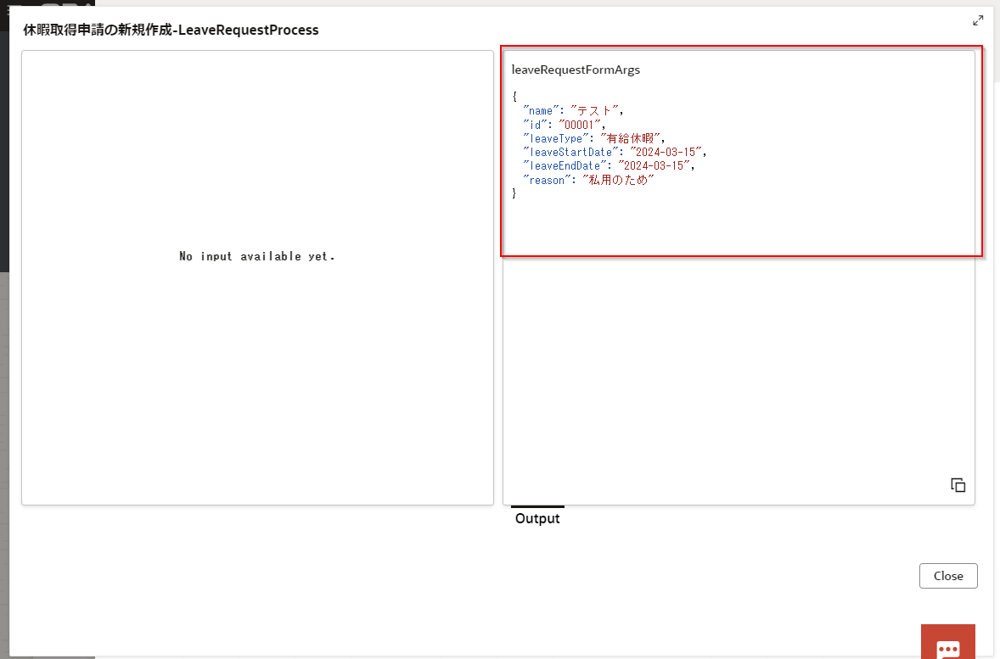

申請・承認時にコメントのやり取りが必要な場合は「Comment」の機能を使ってコメントのやり取りをすることができます。

ドキュメントを添付する機能もあります。

また、Trackingの画面からは以下の操作を実行することもできます。

操作|説明
-|-
Terminate|強制的にプロセスを終了します。Terminate状態は、プロセスに関連付けられたすべてのタスクが正常に完了することなく、プロセスが突然停止されたことを示します。
Suspend|一時停止状態にする操作です。プロセスは、ユーザーアクションまたは REST API によって手動で一時停止できます。一時停止状態では承認、拒否などの操作を進めることができません。ユーザーは、一時停止状態にあるプロセスを終了または再開できます。再開されると、一時停止されたプロセスはアクティブ状態に移行します。
Alter Flow|フローを強制的に任意のタスクまで進めたり戻したりする操作です。

### 申請を拒否する

先ほど申請を開始したので、今は承認のタスクに進んでいます。

次は自分が割り当てられているタスクを確認し、処理します。   
こちらの手順では最初に拒否の動作を確認した後、再申請で承認する手順を実行します。

左上のメニューから「Tasks」をクリックします。

「Team Task」のタブをクリックすると、先ほど申請したプロセス・アプリケーションが表示されます。
クリックして詳細を開きます。


タスクが個人単位でアサインされている場合、My tasksに表示されます。タスクにアサインしているのがRoleの場合はTeam tasksにタスクが表示されます。今回の場合はApproveというRoleをタスクに割り当てているのでTeam tasksからタスクが確認できます。 


詳細が開かれます。   
Trakingの画面と同様のコメントやドキュメントの添付などはこちらの詳細画面からも実施できます。   
詳細画面から「拒否」をクリックします。

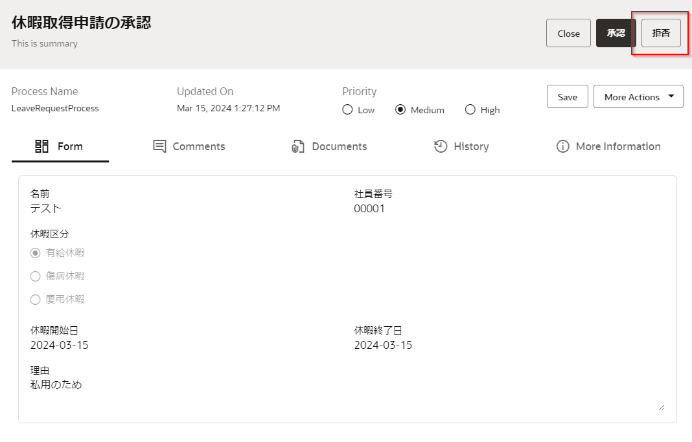

また、承認、拒否の他に以下の操作を実行することができます。

操作|説明
-|-
Withdraw|このタスクをスキップします。
Escalate|他のユーザー、グループにタスクをエスカレートします。エスカレートされたタスクはステータスがエスカレートになります。この機能は主にタスクの重要度を上げる際に使用し、タスクが一定期間処理されなかった場合に自動的にタスクを他のメンバーに割り当てるということも可能です。
Claim|複数のユーザー、グループが割り当てられている場合にタスクを占有します。占有されたタスクはMy tasks空のみ確認でき、Team tasksに表示されなくなります。
Reassagin|他のユーザー、グループにタスクを再アサインします。

### 申請を再提出する

先ほど申請は拒否されたので、今は再申請のタスクに進んでいます。

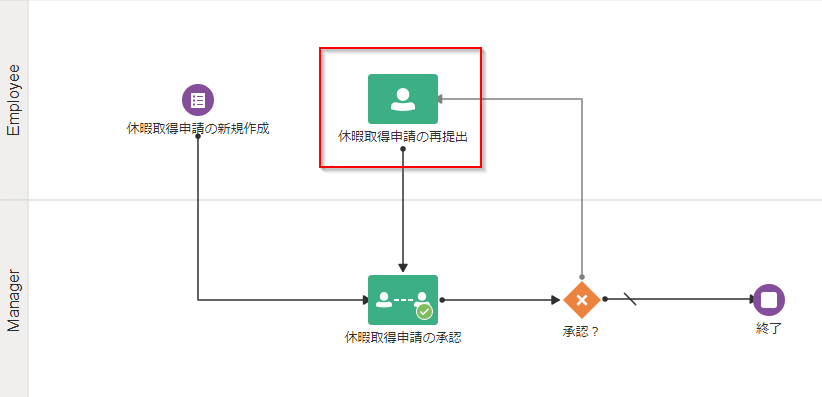

次は再申請します。   
左のメニューから「Tasks」－「Team Tasks」を選択し、先ほど拒否をしたプロセスが「休暇取得申請の再提出を入力」という名前で表示されます。   
クリックして開きます。

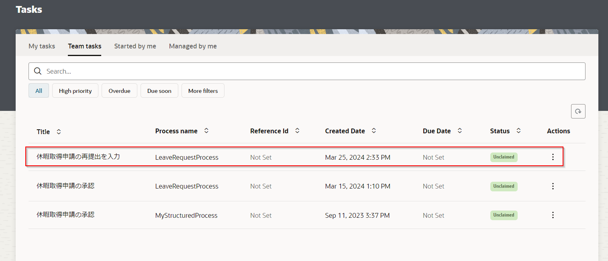

適当な項目を変更し、「送信」をクリックします。

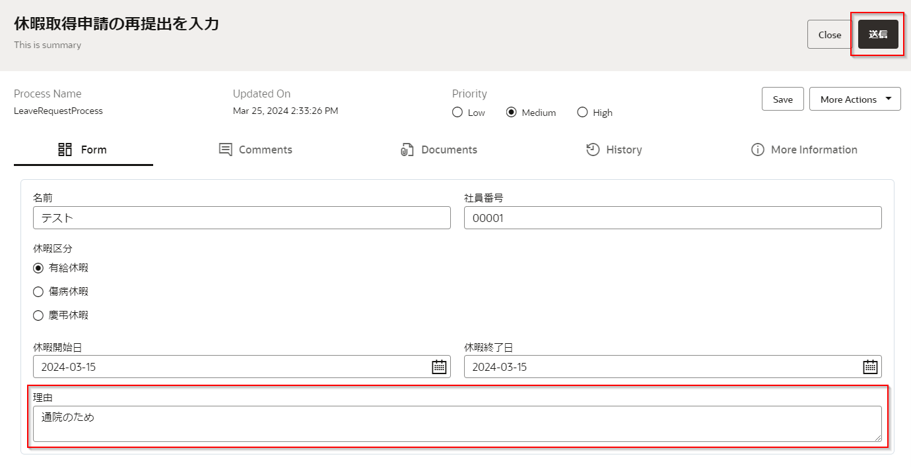

### 申請を承認する

先ほど申請を再提出したので、今は再度承認のタスクに進んでいます。

今度は申請を承認します。   
Task一覧の画面を表示し、「休暇取得申請の承認」をクリックします。

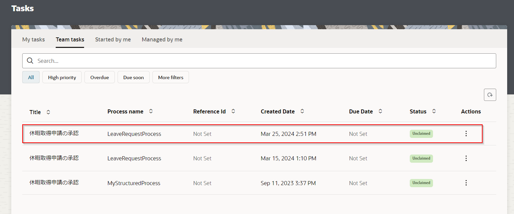

先ほど編集した内容が反映されていることを確認し、「承認」をクリックします。

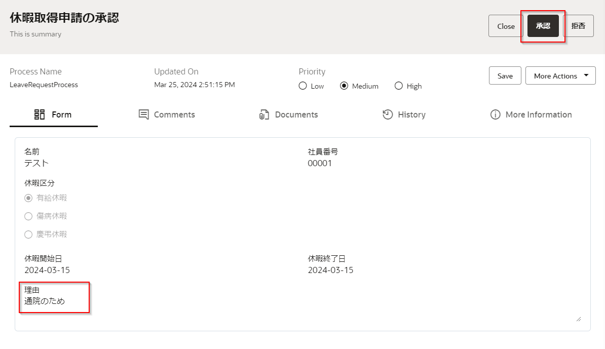

### 終了したプロセス・アプリケーションを確認する

承認が完了したのでプロセス・アプリケーションは既に終了しています。

最後に終了したプロセスを確認します。
左のメニューから「Tracking」をクリックします。

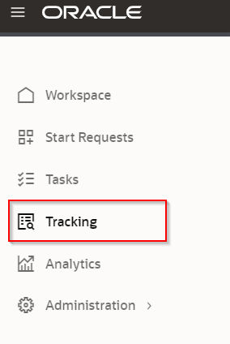

Completedをクリックすると、既に終了したプロセスを確認することができます。   
先ほど承認されたプロセスが表示されるのでクリックして開きます。

Auditを開いてどのような処理が実行されたか確認します。   
今回は申請→拒否→再申請→承認というルートで実行されたことがわかります。

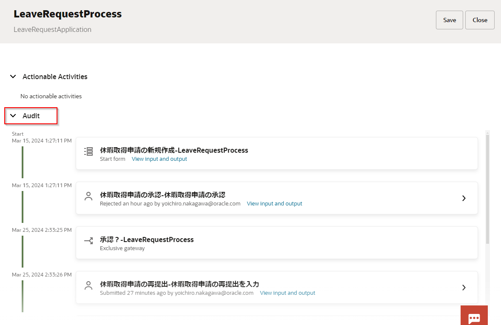

添付されたドキュメントやコメントもこちらから確認することができます。

以上でこのチュートリアルは終了です。
