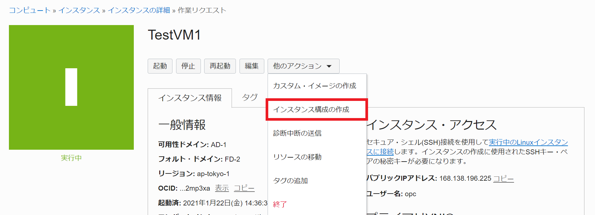
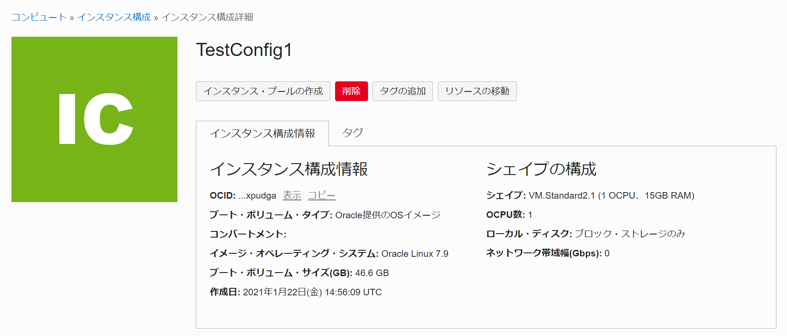
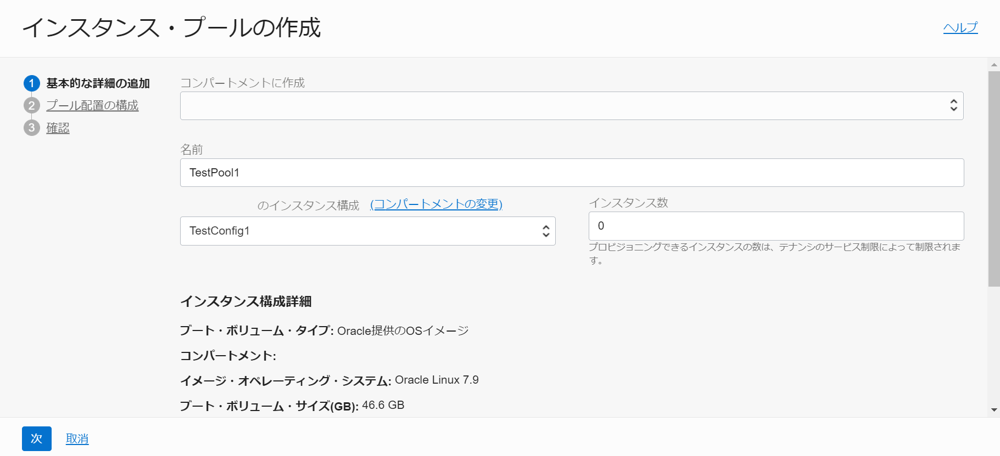
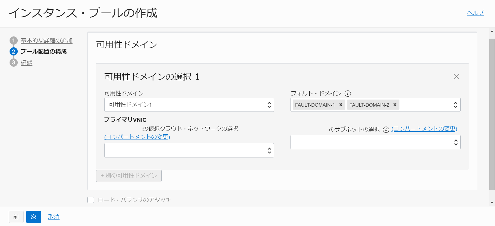
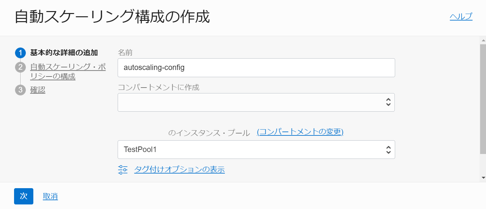
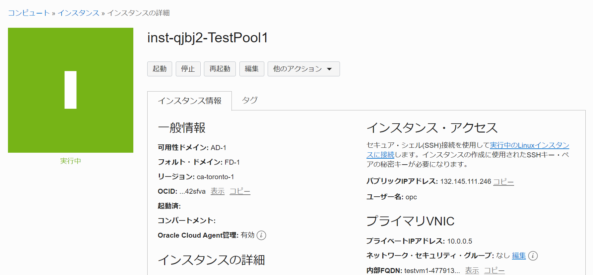
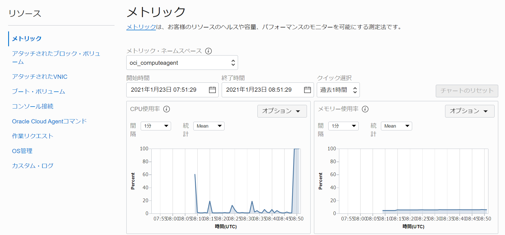
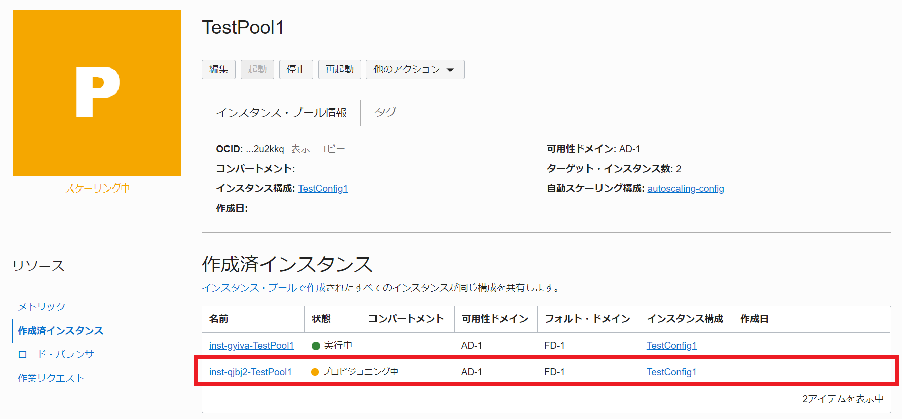
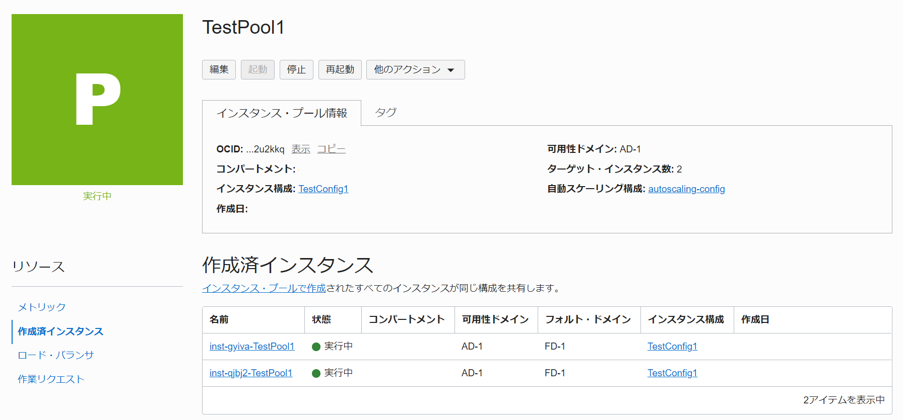
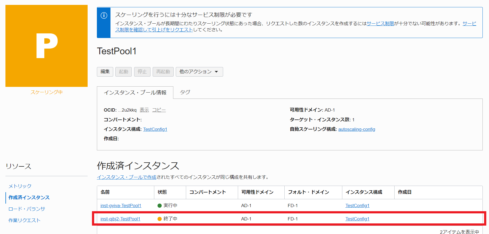

**チュートリアル一覧に戻る :** [Oracle Cloud Infrastructure チュートリアル](../..)

アプリケーションの負荷に応じて自動的にコンピュート・リソースの増減ができれば、必要な時に必要な分だけのリソースを確保し、コストの最適化にもつながります。これを実現するための手法として、OCIではインスタンス・プールのオートスケーリング設定によって、負荷に応じてインスタンス・プール内のインスタンス数を増減させることが可能です。

このチュートリアルでは、オートスケーリングの設定を行って、実際にインスタンス数がどのように変化するかを確認します。

**所要時間 :** 約30分

**前提条件 :**

1. [その3 - インスタンスを作成する](/ocitutorials/beginners/creating-compute-instance) を通じてコンピュート・インスタンスの作成が完了していること

**注意 :** チュートリアル内の画面ショットについては Oracle Cloud Infrastructure の現在のコンソール画面と異なっている場合があります

今回の設定作業手順の流れは以下の図の1～4です。


**目次：**

* [1. ベースになるインスタンスの作成](#anchor1)
* [2. インスタンス・コンフィグレーションの作成](#anchor2)
* [3. インスタンス・プールの作成](#anchor3)
* [4. オートスケーリングの設定](#anchor4)
* [5. CPU負荷をかけてインスタンス増減を確認](#anchor5)


<a id="anchor1"></a>

# 1. ベースになるインスタンスの作成

まずは、オートスケーリングの設定を行うインスタンス・プールのもとになるインスタンスを作成します。今回は、[その3 - インスタンスを作成する](/ocitutorials/beginners/creating-compute-instance)  で作成したコンピュート・インスタンスを使用します。


<a id="anchor2"></a>

# 2. インスタンス・コンフィグレーションの作成

ベースになるインスタンスからインスタンス構成 (=インスタンス・コンフィグレーション) を生成します。インスタンス構成とは、インスタンス起動を行うための「イメージ、シェイプ、メタデータ情報（sshキー、起動時スクリプトなど）、関連リソース（ブロック・ボリューム、ネットワーク構成）」をひとまとめにした構成情報の定義です。


1. コンソールメニューから **`Compute`** → **`Instances`** を選択し、作成したインスタンスのインスタンス **”TestVM1”** リンクをクリックするか、右側の トリコロン から **インスタンスの詳細の表示** を選択し、インスタンス詳細画面を開きます。

   

   

2. **他のアクション** から **インスタンス構成の作成** を選択します。

   

   

3. **名前**に任意の名前を入力し、**インスタンス構成の作成** をクリックします。
   　

   

4. インスタンス構成ができました。
   


<a id="anchor3"></a>

# 3. インスタンス・プールの作成

作成したインスタンス構成をもとに、インスタンス・プールを作成します。インスタンス・プールを作成すると、インスタンス構成で定義された構成のインスタンスが、設定したインスタンス数で自動的に起動してくるようになります。今回はまずサイズを「0」で作成し、あとのステップでこの数を増やしていく(スケーリングしていく) ようにします。


1. 作成されたインスタンス構成の画面から **インスタンス・プールの作成** をクリックします。

2. **”インスタンス・プールの作成”** 画面にて、下記の情報を入力します。

   1. **基本的な詳細の追加**

      - コンパートメントに作成 - 任意
      - 名前 - 任意
      - **[コンパートメント名]** のインスタンス構成 - 手順2で作成したインスタンス構成
      - インスタンス数 - 0

      

   2. **プール配置の構成**

      - 可用性ドメインの選択

        - 可用性ドメイン - 可用性ドメイン1

          >**Note**
          >
          >複数ドメインを持つリージョンの場合、複数指定することが可能です。

        - フォルト・ドメイン - 任意のフォルト・ドメインを設定

          >**Note**
          >
          >容量に基づいてフォルト・ドメイン全体にインスタンスを分散するように最善を尽くす場合は、このボックスを空白のままにします。
          >
          >プール内のインスタンスを1つ以上のフォルト・ドメインに均等に分散する必要がある場合は、インスタンスを配置するフォルト・ドメインを選択します。ただし、選択したフォルト・ドメインに十分な容量がない場合、プールは正常に起動またはスケーリングされません。詳細は、[高可用性のためのフォルト・ドメイン間でのインスタンスの分散](https://docs.oracle.com/ja-jp/iaas/Content/Compute/Tasks/creatinginstancepool.htm#faultdomains)を参照してください。

        -  **[コンパートメント名]** の仮想クラウド・ネットワークの選択 - 任意のVCN名を選択

        -  **[コンパートメント名]** のサブネットの選択 - 任意のパブリック・サブネット名を選択

        - ロード・バランサのアタッチ - 今回はチェックを入れない

          > **TIPS**
          >
          > 既存のロードバランサーがある場合は、ここでロードバランサーにアタッチすることも可能です。アタッチすると、作成されたインスタンスは自動的にロードバランサーのバックエンドに追加されます。

      

   3. **確認**  
      入力内容を確認し、**`作成`** ボタンをクリックします。

   

3. インスタンス・プールができました。

   


<a id="anchor4"></a>

# 4. オートスケーリングの設定

作成したインスタンス・プールにオートスケーリングの設定を行います。今回は、インスタンス・プール内の平均CPU使用率が70%を上回ったら1インスタンス増やす、30%未満になったら1インスタンス減らす、というポリシーを設定します。スケーリングするインスタンス数は、最小1インスタンス、最大4インスタンスに設定します。


1. 作成したインスタンス・プールの画面から、**他のアクション** → **自動スケーリング構成の作成** をクリックします。

2. 自動スケーリング構成の作成 ウィンドウで、下記の情報を入力します。
   - **基本的な詳細の追加**

     - 名前 - 任意
     - コンパートメントに作成 - 任意
     -  **[コンパートメント名]** のインスタンス・プール - 手順3で作成したインスタンス・プール

     

   - **自動スケーリング・ポリシーの構成**

     - ”メトリックベースの自動スケーリング” を選択

       >**TIPS**
       >
       >スケジュールベースの自動スケーリング を選択することで、特定の時間を契機にスケールアウト/スケールインさせることも可能です。

       

     - 自動スケーリング・ポリシー名 - 任意

     - クールダウン(秒) - 300 (初期値のまま)

     - パフォーマンス・メトリック - ”CPU使用率” を選択

       

     - スケールアウト・ルール

       - スケールアウト演算子 - ”次より多い (>) ” を選択 (初期値のまま)
       - しきい値パーセンテージ - 70
       - 追加するインスタンスの数 - 1

       

     - スケールイン・ルール

       - スケールイン演算子 - ”次より小さい (<) ” を選択 (初期値のまま)
       - しきい値パーセンテージ - 30
       - 削除するインスタンスの数 - 1

       

     - スケーリング制限

       - インスタンスの最小数 - 1
       - インスタンスの最大数 - 4
       - インスタンスの初期数 - 1

       

   - **確認**

     入力内容を確認し、**`作成`** ボタンをクリックします。

   

3. 自動スケーリング構成が作成できました
   
   
   
   
4. 自動スケーリング構成 の画面から、インスタンス・プール名のリンクをクリックし（本チュートリアルの例では**TestPool1**）、インスタンス・プールの画面を表示します。初期インスタンス数 - 1、最小インスタンス数 - 1 に設定したため、自動的に1つめのインスタンスがプロビジョニングされていることがわかります。

   


<a id="anchor5"></a>

# 5. CPU負荷をかけてインスタンス増減を確認

起動してきたインスタンスにOS上からCPU負荷をかけてCPU使用率が閾値（ここでは70%）を上回るように設定し、実際にインスタンスが1つ増えるかどうかを確認します。

また、インスタンスの増加が確認できたら、負荷を止めてCPU使用率を閾値（ここでは30%）未満にし、インスタンスが1つ減る様子を確認します。


1. インスタンス・プール画面の 作成済インスタンス のリスト上で、作成されたインスタンスのステータスが実行中 になったらインスタンスの起動が完了しています。インスタンスの名前のリンクをクリックして作成されたインスタンスの情報を表示します。
   

2. インスタンスのパブリックIPアドレスを確認し、このアドレスを使用して Tera Term などのターミナルからsshでログインします。
   - ユーザー名 - **opc**
   - RSA鍵 - インスタンス構成の元となるインスタンスに設定された 公開鍵 に対応する 秘密鍵 を指定（[その3 - インスタンスを作成する](/ocitutorials/beginners/creating-compute-instance) ) で取得した秘密鍵と同じものを使用）

3. インスタンスのCPU負荷をあげるために、Linuxのstressコマンドで負荷をかけます。
   [応用編その１ - モニタリング機能でOCIのリソースを監視する](/ocitutorials/intermediates/monitoring-resources/)がすでに完了している場合、以下の手順3までを省くことができます。
         
   1. stressパッケージをインストールする準備をします。stressパッケージを含むEPELリポジトリが有効になっているかを以下のコマンドで確認します。 
      ```
      sudo yum repolist all | grep -i epel
      ```   
   1. Oracle Linux 7.9イメージで作成されたインスタンスであれば、図のように「ol7_developer_EPEL」リポジトリが表示されます。ステータスが非有効（「disabled」）になっている場合、yum-config-managerコマンドで有効（「enabled」）に変更します。  
      <br>
      
      ```
      sudo yum-config-manager --enable ol7_developer_EPEL
      ```

   1. 以下のコマンドを入力し、stressをインストールします。  
      ```shell
      sudo yum -y install stress
      ```
   1. stressコマンドでCPUに負荷をかけます。VM.Standard2.1のシェイプであれば、下記コマンドでCPU負荷が100%になります。 
      ```shell
      stress -c 2 &
      ```   
   1. topコマンドでCPU負荷が約100%になっていることを確認します。Ctrl + C で終了します。   
      ```shell
      top -c
      ```   
      


4. OCIコンソール上からもCPU使用率の状況を確認します。コンピュート・インスタンスの画面左下にある **リソース** メニュー から、**メトリック** を選択します。**クイック選択** を**過去1時間** に設定すると、直近1時間のメトリックを表示できます。

   

   

5. この状態で、クールダウン期間で指定した300秒が過ぎると、スケーリング動作を確認することができます。再度、作成したインスタンス・プールの画面を表示します。ステータスが **SCALING** 中の状態となり、新規のインスタンスがプロビジョニングされていく様子が確認できます。

   


1. インスタンスの起動が完了すると、再びインスタンス・プールのステータスは **実行中** 状態に戻ります。この時点で、インスタンス・プール内の平均CPU使用率は50%となっているため、これ以上のインスタンス数増加はありません。

   

2. インスタンスのCPU負荷を下げます。ssh接続したターミナルから以下のコマンドを入力し、プロセスをkillします。CPU使用率は約0%に戻ります。

   ```shell
   pkill stress
   ```

3. 300秒が経過すると、自動で1インスタンスが削除され、インスタンス・プール内には1インスタンスのみ残ります。

   

   >**Note**
   >
   >インスタンス・プールがスケール・インされるとき、インスタンスは次の順序で終了します。  
   >インスタンス数のバランスが可用性ドメイン間で調整されてから、フォルト・ドメイン間で調整されます。最後に、フォルト・ドメイン内の一番古いインスタンスが最初に終了されます。


以上がインスタンス・プールのオートスケーリング設定による動作です。


**チュートリアル一覧に戻る :** [Oracle Cloud Infrastructure チュートリアル](../..)