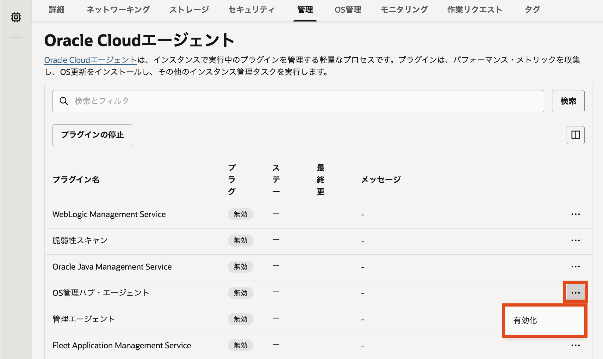
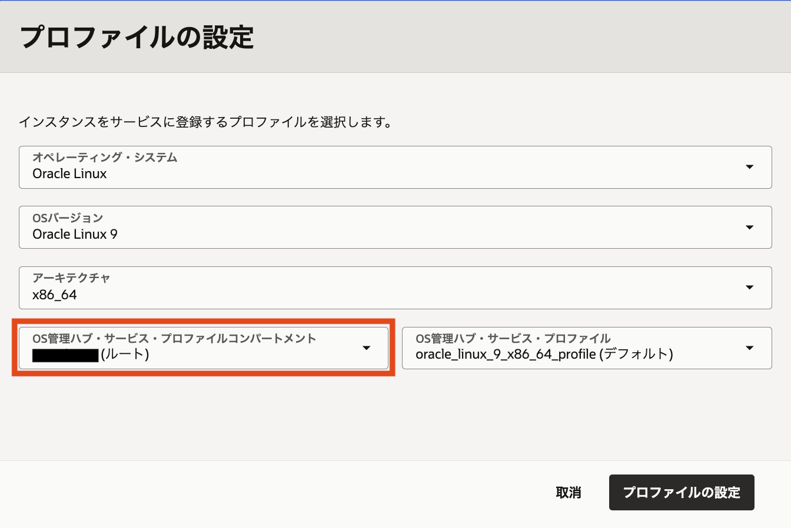
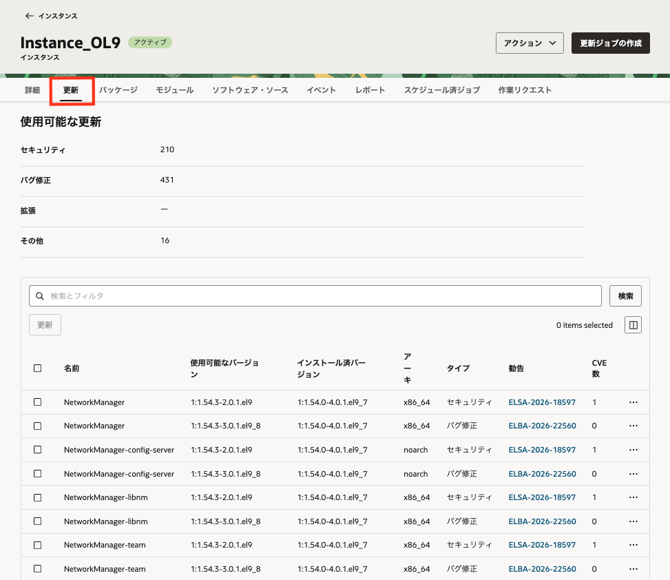
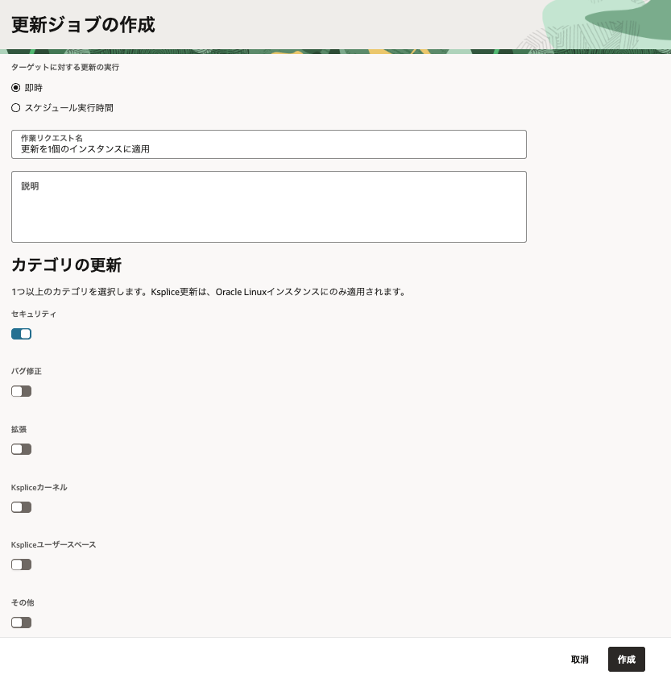
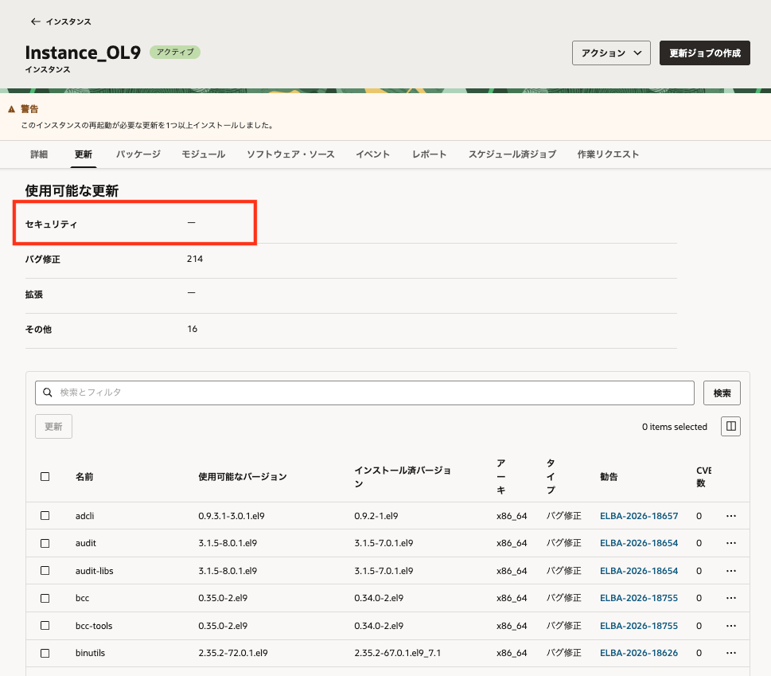

**応用編のチュートリアル一覧に戻る :** [OCI応用編](./..)

OCI上でコンピュート・インスタンスを運用する場合、OS以上のレイヤーはユーザーの管理範囲です。つまり、OSの更新やセキュリティ・パッチの適用はユーザー側で実施する必要があります。個別にOSへログインしてパッチ適用を行うとなると、インスタンスの数が増えるにつれて運用が大きな負担になります。

OS管理ハブ（OS Management Hub）は、OCI上のインスタンスやオンプレミス環境などのOSのパッチ適用を一元的に管理し、可視化、自動化するためのサービスです。
このチュートリアルでは、OS管理ハブを使ってOCIコンソールからコンピュート・インスタンスのOSのパッケージ更新やセキュリティ・パッチの適用を行います。


**所要時間 :** 約30分

**前提条件 :**

1. [クラウドに仮想ネットワーク(VCN)を作る - Oracle Cloud Infrastructureを使ってみよう(その2)](https://oracle-japan.github.io/ocitutorials/beginners/creating-vcn/) を通じて、VCNの作成が完了していること
OS管理ハブを使用するにはインターネット・ゲートウェイ、NATゲートウェイもしくはサービス・ゲートウェイのいずれかが必要となります。上記チュートリアル以外の手順で作成したVCNを使用する場合は、インスタンスからOracle Services NetworkにあるOCIサービスのAPIエンドポイントへの通信経路が確保されていることをご確認ください。
2. [インスタンスを作成する - Oracle Cloud Infrastructureを使ってみよう(その3)](https://oracle-japan.github.io/ocitutorials/beginners/creating-compute-instance/) を通じて、Oracle Linuxのコンピュート・インスタンスの作成が完了している必要があります。

**目次 :**

1. [IAMポリシーの設定](#1-IAMポリシーの設定)
2. [インスタンスの登録](#2-インスタンスの登録)
3. [更新状況の確認](#3-更新状況の確認)
4. [更新ジョブの作成と実行](#4-更新ジョブの作成と実行)
5. [ジョブ結果の確認](#5-ジョブ結果の確認)

# 1. IAMポリシーの設定

まずIAMの権限設定を行います。OS管理ハブを利用するためには、次の2種類の権限が必要になります。

- 管理対象インスタンスがOS管理ハブのリソースを使用する権限
- 操作ユーザーがOS管理ハブのリソースを操作する権限（Administratorsグループに所属しているユーザーで作業する場合は、操作ユーザー向けの権限は追加不要です。）

## 1-1. インスタンス用の動的グループの作成

OS管理ハブに登録するインスタンスにIAMポリシーを適用するため、対象インスタンスを動的グループに含めます。

1. コンソールメニューから **アイデンティティとセキュリティ** → **ドメイン** を選択します。
2. コンパートメントに **ルート・コンパートメント** を選択し、 **default** ドメインの詳細画面を表示します。
3. **動的グループ** のタブに移動して **動的グループの作成** をクリックします。
4. 以下を参考に入力します。

   - **名前** - Tutorial_OSMH_DynamicGroup
   - **説明** - OS管理ハブに登録するインスタンスの動的グループ
   - **一致ルール** - 下で定義したいずれかのルールに一致
   - **ルール1** - 下記（OCID部分は実際の値を入力）
      ```
      instance.compartment.id = '<インスタンスが所属するコンパートメントのOCID>'
      ```

## 1-2. IAMポリシーの作成

次に、操作ユーザーと動的グループに対するポリシーを作成します。

1. コンソールメニューから **アイデンティティとセキュリティ** → **ポリシー** を選択します。
2. **ポリシーの作成** をクリックします。
3. 以下を参考に入力します。

   - **名前** - Tutorial_OSMH_Policy
   - **説明** - OS管理ハブ・チュートリアル用
   - **コンパートメント** - ルート・コンパートメント
   - **ポリシー・ビルダー** - 手動エディタの表示

      `<コンパートメント名>` には、管理対象にするインスタンスとOS管理ハブのリソースを配置するコンパートメント名を指定します。ルート・コンパートメント直下にないコンパートメントを指定する場合は`<ルート・コンパートメント:コンパートメントA:コンパートメントB>`という書き方でパスを記載してください。

      `<テナンシOCID>` には、テナンシ（ルート・コンパートメント）のOCIDを指定します。

      ```
      Allow dynamic-group Tutorial_OSMH_DynamicGroup to {OSMH_MANAGED_INSTANCE_ACCESS} in compartment <コンパートメント名> where request.principal.id = target.managed-instance.id
      Allow group <グループ名> to manage osmh-family in compartment <コンパートメント名>
      Allow group <グループ名> to read osmh-profiles in tenancy
      Allow group <グループ名> to read osmh-software-sources in tenancy
      ```

4. **作成** をクリックします。


このチュートリアルでは **サービス提供プロファイル** というルート・コンパートメントに存在するリソースを使用するために、ルート・コンパートメントのOS管理ハブのリソースにアクセスするポリシーが必要になります。<br>
本チュートリアルでは紹介しませんが、サービス提供プロファイルを使用しないで、プロファイルを作成して使用する方法を用いるときには、ルート・コンパートメントのリソースへのアクセス権は必須ではありません。



# 2. インスタンスの登録

次に、Oracle LinuxインスタンスをOS管理ハブの管理対象として登録します。インスタンスの登録は、コンピュート・インスタンスの詳細画面から **OS管理ハブ・エージェント** プラグインを有効化し、プロファイルを選択して行います。

## 2-1. インスタンスを登録する

1. コンソールメニューから **コンピュート** → **インスタンス** を選択します。
2. 対象のインスタンス名をクリックし、インスタンスの詳細画面を開きます。
3. **管理** タブをクリックし、**Oracle Cloudエージェント** セクションを表示します。
4. **OS管理ハブ・エージェント** の行のアクション・メニューから **有効化** をクリックします。
   
5. 表示されるプロファイルの選択画面で、**コンパートメントをルートコンパートメントに変更する**と作成済みのサービス提供プロファイルが表示されるので、そのプロファイルを使用します。以下のように選択されていることを確認したら、**プロファイルの設定** をクリックします。

   - **オペレーティング・システム** - Oracle Linux（自動で選択される）
   - **OSバージョン** - Oracle Linux 9（自動で選択される）
   - **アーキテクチャ** - x86_64（自動で選択される）
   - **OS管理ハブ・サービス・プロファイル・コンパートメント** - ルート・コンパートメント
   - **OS管理ハブ・サービス・プロファイル** - 表示されるデフォルトのもの
      - Oracle Linux 9の場合は `oracle_linux_9_x86_64_profile（デフォルト）` というプロファイルが表示される

   

6. プラグインの表示が **有効** に変更されたことを確認し、インスタンスが登録されるまでしばらく待ちます。場合によっては10分程度かかることがあります。

## 2-2. 登録状態を確認する

1. コンソールメニューから **監視および管理** → **OS管理ハブ** → **インスタンス** を選択します。
2. 対象インスタンスが配置されているコンパートメントを選択します。
3. 登録したインスタンスが一覧に表示され、ステータスが **アクティブ** になっていることを確認します。


時間が経ってもインスタンスが表示されない場合は、登録に問題が発生している可能性があります。<br>
対象インスタンスの **管理** タブから、プラグインのエラーメッセージを確認して、ポリシーやネットワークが正しく設定されているか見直してください。


# 3. 更新状況の確認

登録したインスタンスで利用可能な更新を確認します。

1. **OS管理ハブ** → **インスタンス** の一覧から、登録したインスタンス名をクリックします。
2. **更新** タブをクリックします。
3. 利用可能な更新が表示されることを確認します。
   

# 4. 更新ジョブの作成と実行

OS管理ハブから更新ジョブを作成し、登録済みインスタンスに対してパッチ適用を実行します。

1. **OS管理ハブ** → **インスタンス** の一覧から、登録したインスタンス名をクリックします。
2. 画面右上の **更新ジョブの作成** をクリックします。
3. スケジュールを指定します。

   - **ターゲットに対する更新の実行** - 即時
   - **作業リクエスト名** - デフォルトのまま
   - **説明** - 空欄のまま
   - **カテゴリの更新** - **セキュリティ** をチェック

4. **作成** をクリックします。


5. 更新ジョブが作成され、実行が開始されます。ジョブの進捗は **作業リクエスト** タブから確認することができます。

# 5. ジョブ結果の確認

作成した更新ジョブの実行結果を確認します。

1. 登録したインスタンスの詳細画面を開きます。
2. 利用可能な更新件数が減っていることを確認します。<br>
   今回はセキュリティに限定して更新を行ったため、**セキュリティ** の更新が全て適用されたことが確認できます。

   

   
   上の画像のように「再起動が必要」と表示されている場合、**アクション** から **再起動** を選択して、再起動ジョブを実行することもできます。<br>
   また、再起動の回数を減らすソリューションとしてKspliceでの更新ジョブを実行することも可能です。
   

ここまでで、OS管理ハブを使用してLinuxインスタンスへのパッケージ更新を実施できました。個別のインスタンスにログインして更新コマンドを実行することなく、OCIコンソールから更新状況を確認して更新ジョブを実行することができました。

以上で、OS管理ハブを使用したインスタンスの登録と更新ジョブの実行は完了です。


# 6. 補足: その他の構成

OS管理ハブは本チュートリアルで紹介した他にも、グループ、動的セットのような管理機能を使用したり、ソフトウェア・ソースを選択・作成したり、またOracle Linux以外のOSのインスタンスを登録したりすることも可能です。詳細については [OCI活用資料集の資料](https://oracle-japan.github.io/ocidocs/services/compute/osmh/) をご覧ください。