**チュートリアル一覧に戻る :**  [Oracle Cloud Infrastructure チュートリアル](../..)

クラウド上で仮想デスクトップの環境が必要なケースはありませんか？PCなどのローカル端末にデータを配置せず、リモートからOCIにアクセスして作業したい、オフィス以外からでも社内システムにアクセスしたい、そのような要件がある場合にOCIのセキュア・デスクトップのサービスが活用できます。

OCI上で仮想デスクトップ環境を迅速にデプロイできて、ローカル端末にデータを持たせないことでセキュリティを確保できます。

このチュートリアルではOracle Linuxのデスクトップ環境を作ってアクセスします。（Windows OSを利用する場合はWindowsライセンスの持ち込みが必要です。）

セキュア・デスクトップのサービス概要については以下の資料もご参照ください。

- [**Speaker Deck：OCI セキュア・デスクトップ 概要**](https://speakerdeck.com/ocise/oci-sekiyuadesukutotupu-gai-yao)

**所要時間：**　約2時間  

**前提条件：**

1. [その2 - クラウドに仮想ネットワーク(VCN)を作る を通じて仮想クラウド・ネットワーク(VCN)の作成](https://oracle-japan.github.io/ocitutorials/beginners/creating-vcn/)が完了していること

**注意**: 

1. チュートリアル内の画面ショットについてはOracle Cloud Infrastructureの現在のコンソール画面と異なっている場合があります

**目次 :**

1. [OCI セキュア・デスクトップの構成概要](#anchor1)
2. [事前準備](#anchor2)
3. [デスクトップ・イメージの準備](#anchor3)
4. [デスクトップ・プールの作成](#anchor4)
5. [ユーザーからのデスクトップへのアクセス（ブラウザ利用）](#anchor5)
6. [ユーザーからのデスクトップへのアクセス（デスクトップ・クライアント利用）](#anchor6)
7. [デスクトップの休止の確認](#anchor7)

 

# 1.　OCI セキュア・デスクトップの構成概要

環境構築にあたって理解しておくべきアーキテクチャと構成要素を整理しておきます。

- デスクトップ管理者があらかじめ「デスクトップ・プール」を定義して仮想デスクトップ環境を準備します。
  - デスクトップ・プール：デスクトップ・イメージやシェイプ、デスクトップの数、ネットワークなどを定義したリソース。
    - デスクトップ・イメージ： デスクトップの実体となるコンピュート・インスタンスを起動するイメージ
  - 各デスクトップ・ユーザーがデスクトップを起動すると、デスクトップ・プールの設定に従ってお客様テナンシ内のプライベートなネットワークの中にデスクトップ用のコンピュート・インスタンスが起動されます。
  - デスクトップは各ユーザーごとに永続化されます。（ブロック・ボリュームにデータを永続保持）
  - データはお客様テナンシの中に存在しているためセキュアに利用できます。
- デスクトップ・ユーザーはブラウザ経由でエンドユーザ用のWebアプリケーションのURLにアクセスし、利用可能なデスクトップを選択して起動します。
  - デスクトップ・ユーザーの認証はOCIテナンシのIAM認証を利用します。権限を付与されているデスクトップ・プールにアクセスすることが可能です。
  - 各ユーザーごとに個別のデスクトップが起動され、他人のデスクトップにはアクセスできないようになっています。

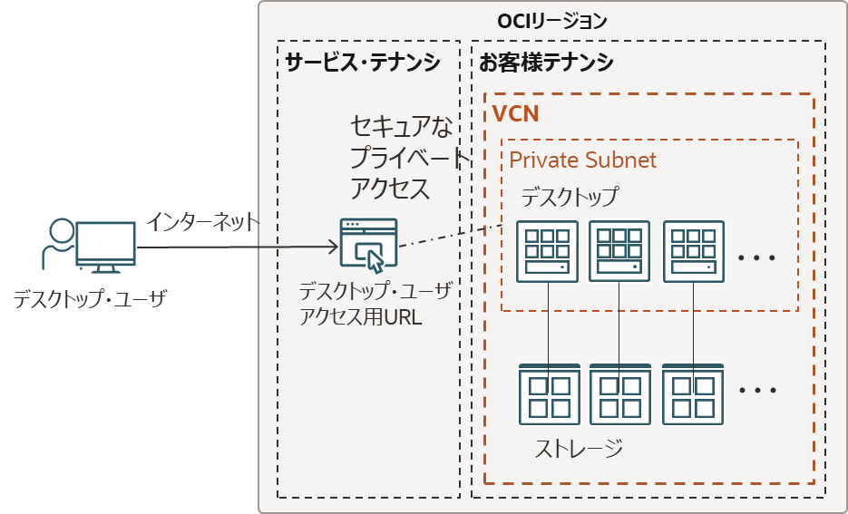

それではこれらの環境を作っていきましょう。

# 2. 事前設定

利用するための事前準備は、ドキュメントの以下の章に記載されているので、こちらに従って実施していきます。

- [テナンシの設定](https://docs.oracle.com/ja-jp/iaas/secure-desktops/setup-tenancy.htm)
- [管理者の最初のステップ](https://docs.oracle.com/ja-jp/iaas/secure-desktops/admin-first-steps.htm)

いくつかの事前準備がありますが、すべて手動で実行するのは煩雑なので、自動化するための[リソース・マネージャー・スタック](https://marketplace.oracle.com/listings/oci-secure-desktops-resource-manager-stack/ocid1.mktpublisting.oc1.iad.amaaaaaaxqqtfyaawrufkwjhrvwtmumf6ratcl35nv24qo4stlgs5was34ha)がMarketplaceで用意されています。こちらを使うと手動でのポリシー作成などが不要なので簡単です。

- ORMスタックの利用方法について：サポートサイトのドキュメント [OCI Secure Desktops: How To Configure Tenancy Using ORM Stack (KB48885)](https://support.oracle.com/knowledgefs/?docId=KB48885) 

ORMスタックで作成できるリソースは以下の通りです。

- 動的グループ、ポリシー　←セットアップ・タイプ「Setup Tenancy」で作成可能
- ネットワーク・リソース　←セットアップ・タイプ「Setup Region」で実施可能
- カスタムイメージのインポート　←セットアップ・タイプ「Setup Region」で実施可能

今回は、 Setup Tenancy を使って動的グループとポリシーの作成を行います。

## 1. 動的グループ、IAMポリシーの作成

事前要件セットアップ用のORMスタックはマーケットプレイスで提供されています。

1. パブリックのマーケットプレイスの[OCI Secure Desktops Resource Manager Stack のURL](https://marketplace.oracle.com/listings/oci-secure-desktops-resource-manager-stack/ocid1.mktpublisting.oc1.iad.amaaaaaaxqqtfyaawrufkwjhrvwtmumf6ratcl35nv24qo4stlgs5was34ha) をひらき、`Get App`をクリック。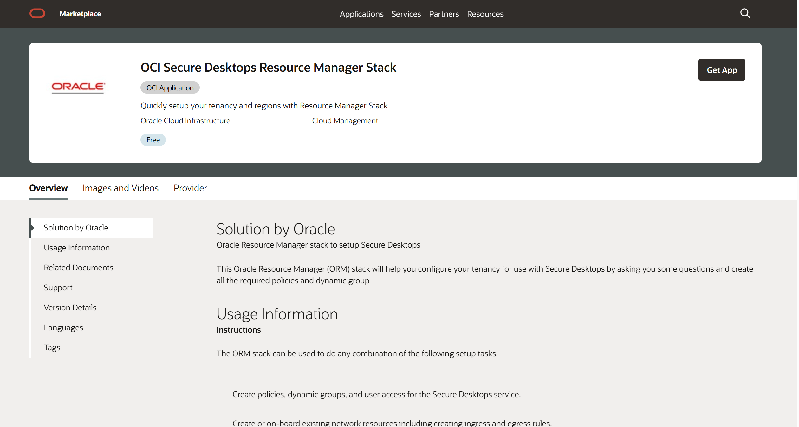

2. OCIのテナンシの認証を行うと、OCIコンソール上のリソース・マネージャの該当のアプリケーションのページが開く。（OCIコンソールのマーケットプレイスのページ→`すべてのアプリケーション`→`OCI Secure Desktops Resource Manager Stack`を検索しても同様のページにたどり着けます。）`スタックの起動`ボタンをクリック。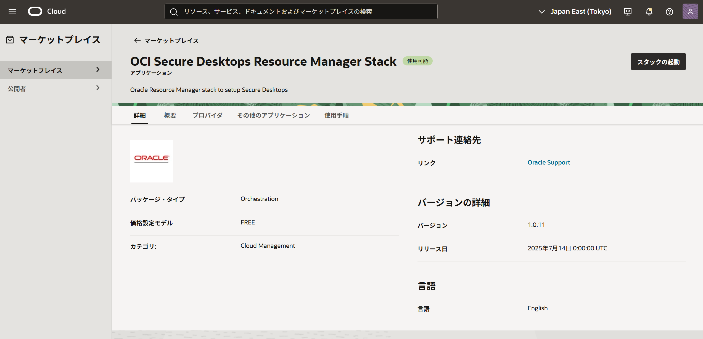

3. terms and conditionsに同意するチェックを入れて、右下の`スタックの起動`をクリック。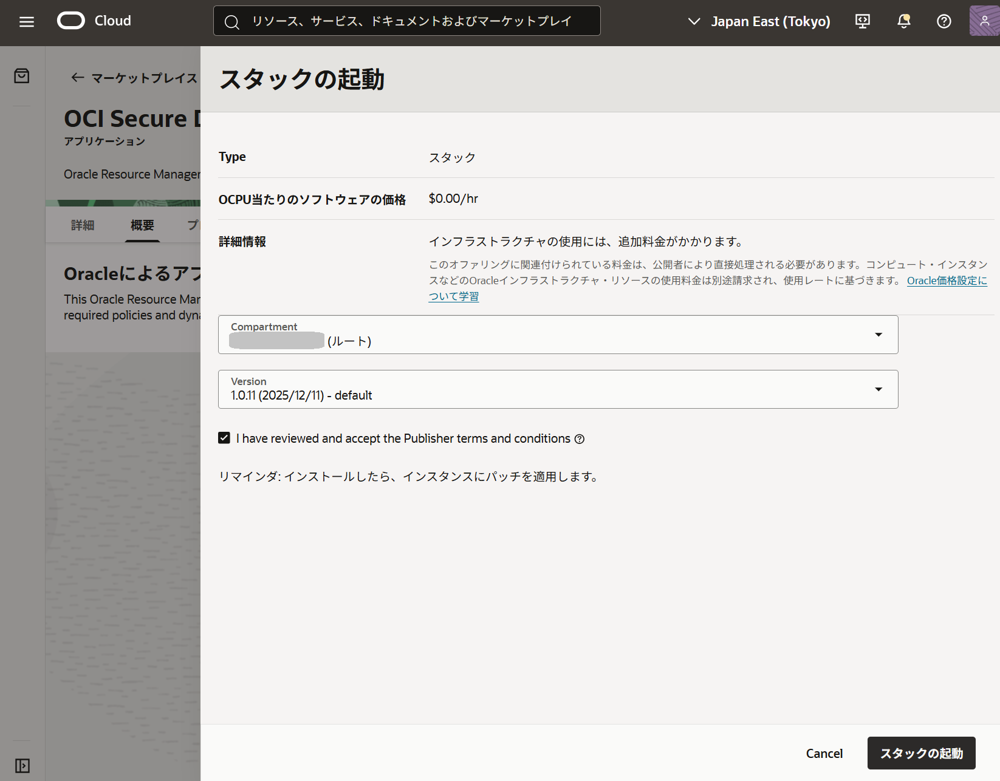

4. スタックの作成ウィザードが開く。スタック情報のページは特に何も入力せず、左下の`Next`ボタンをクリック。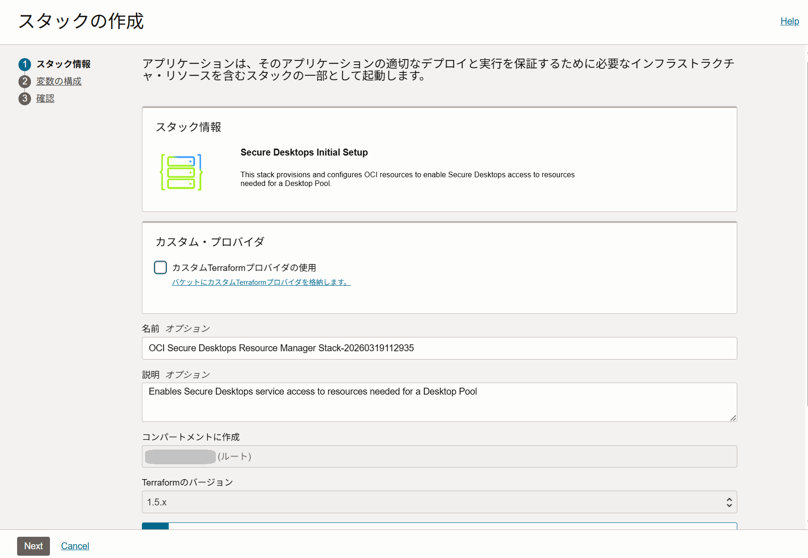

5. 「変数の構成」ページで以下の項目を入力して、`Next`をクリック

   - **Secure Desktops Setup Stack Template**

     - **Setup Type**：`Setup Tenancy`を選択

   - **Identity Domain and User Groups**

     - **Use non-default identity domain**：今回はdefaultなのでチェックは入れない。（defaultアイデンティティ・ドメイン以外の場合はチェックを入れて、適切なアイデンティティ・ドメインを選択。）

     - **Desktop Administrator Group**：管理ユーザーが所属するグループを選択。ここではすべて管理者ユーザーで操作していくので`Administrators`グループを選択。

     - **Desktop User Group**：デスクトップ・ユーザーが所属するグループを選択。ここではすべて管理者ユーザーで操作していくので`Administrators`グループを選択。

       **注）このチュートリアルでは簡易的に全てAdministratorsグループ所属のユーザーで操作することを前提としていますが、実際に利用される場合は管理者/利用者の区分に応じた適切なグループを事前に作成して権限設定してください。**

   - **Dynamic Group and Resource Compartments**

     - **Dynamic Group Name**：スタックによって作成される動的グループ名を入力。ここでは`SecureDesktop_DynamicGroup`。

     - **Desktop Pool Network Compartment**：デスクトッププールが利用するネットワークのリソースが配置されるコンパートメント名。ここでは`handson`を選択。

     - **Configure Policy for Private Access**：今回はチェックを入れない。

     - **Image Compartment**：イメージを配置するコンパートメント名。ここでは`handson`を選択。

     - **Number of Desktop Compartments**：デスクトップ用コンパートメントの数。ここでは`1`。

     - **Desktop Compartment 1**：デスクトップのリソースを配置するコンパートメント名。ここでは`handson`を選択。

     - **Limit desktop pools to selected desktop compartments**：今回はチェックを入れない。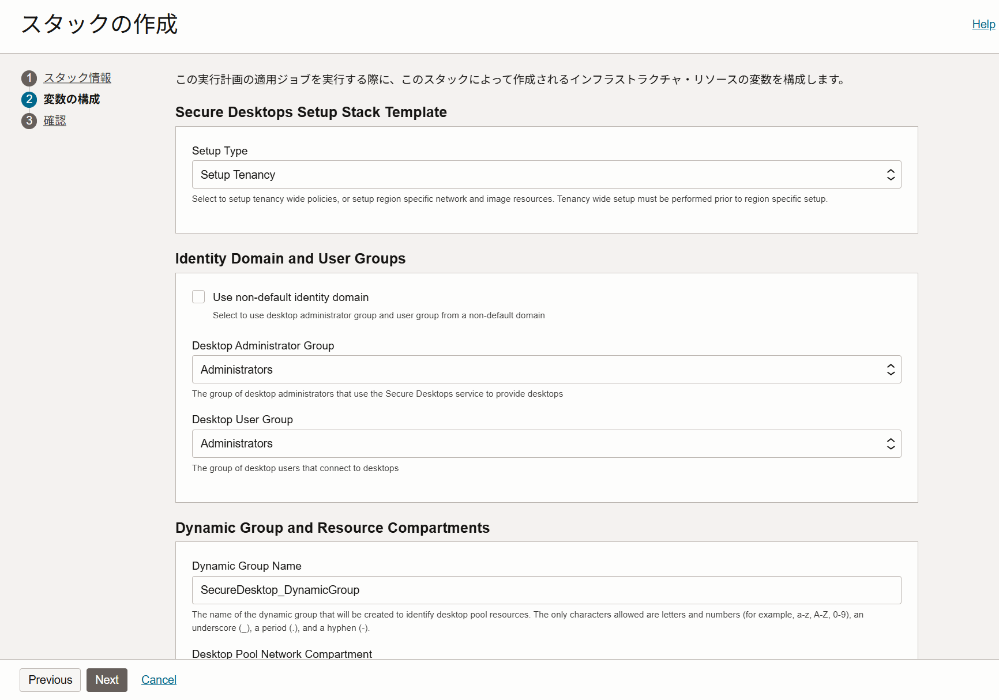

       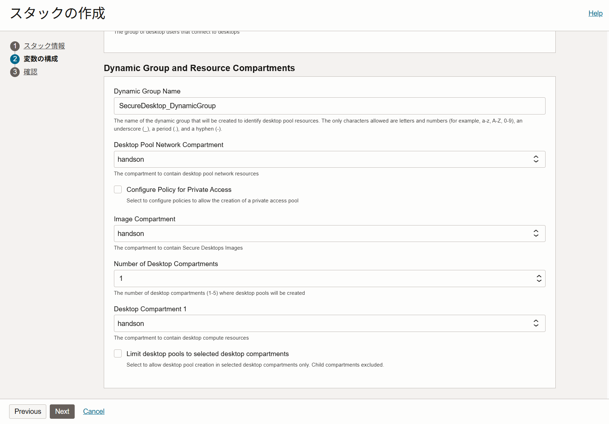

6. 作成される内容を確認し、問題がなければ左下の`作成`ボタンをクリック。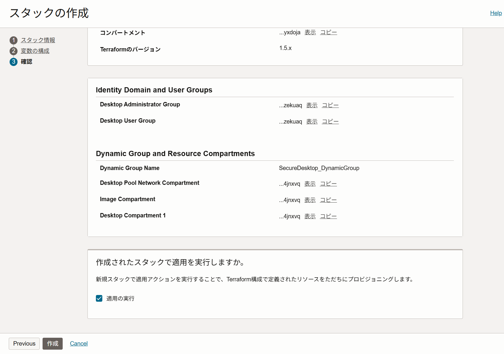

7. 自動的にリソースマネージャのジョブのページに遷移し、スタックの適用が行われる。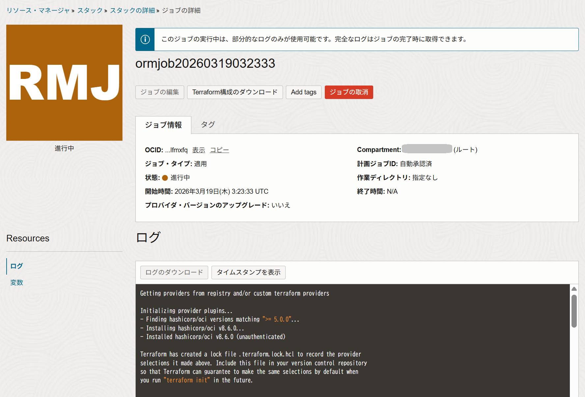

8. 少し待って、ジョブが「成功」と表示されれば完了。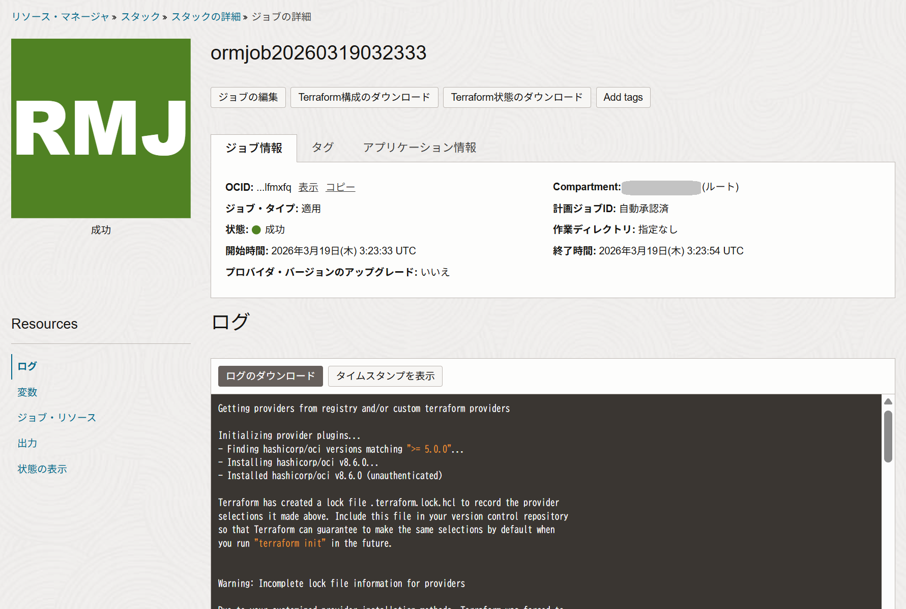

9. メニュー`アイデンティティとセキュリティ`→`ポリシー`のページをひらくと、rootコンパートメントにポリシーが作成されたことがわかる。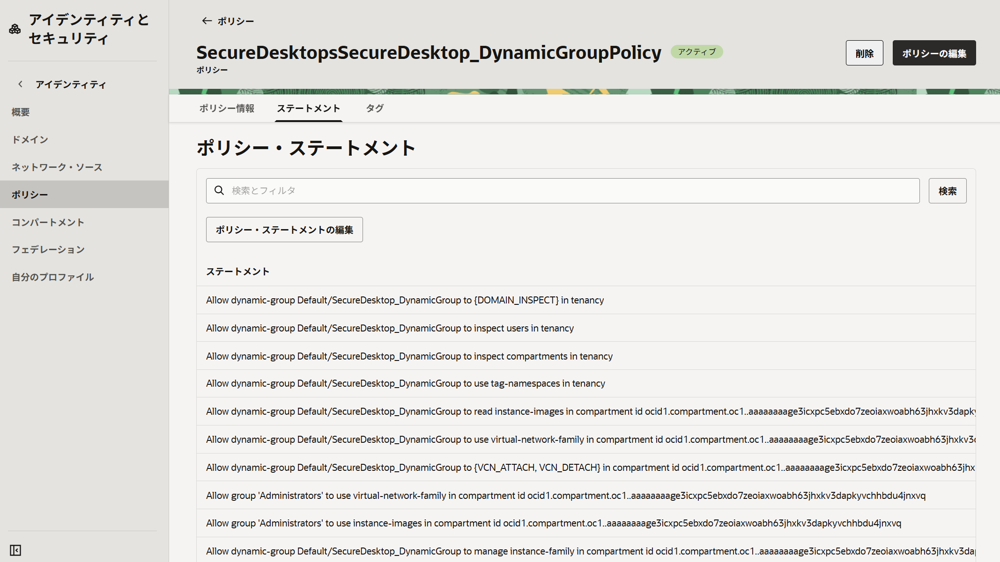

## 2. ネットワークの準備

デスクトップ・プール内に起動してくるコンピュート・インスタンスが配置されるVCNとサブネットを用意します。今回は、あらかじめ　[その2 - クラウドに仮想ネットワーク(VCN)を作る を通じて仮想クラウド・ネットワーク(VCN)の作成](https://oracle-japan.github.io/ocitutorials/beginners/creating-vcn/)　で作成したVCNとサブネットを使いますので作成は不要です。

また、デスクトップ・プールを起動すると、自動的にセキュア・デスクトップが動作するために必要なセキュリティ・ルールが設定されたNSGが作成されます。それ以外のセキュリティ・ルールを追加したい場合は自作のNSGを追加することもできます。

## 3.ストレージ・ボリューム

特に事前作成は必要ありません。ストレージを追加したい場合は、このあとのデスクトップ・プールで各デスクトップ用のストレージを何GBのサイズに設定するかだけ決めておきます。今回は最小サイズである50GBのボリュームをアタッチすることにします。

# 3. デスクトップ・イメージの準備

デスクトップを起動する際に利用するゴールデン・イメージを作成します。これは通常のコンピュート・サービスのカスタム・イメージと同じ仕組みを使います。ただし、セキュア・デスクトップで利用するカスタム・イメージには専用のタグを付与する必要があります。

今回は下記ドキュメントのページで提供されている、Oracle提供のセキュア・デスクトップ用に事前構成済のOracle Linux 8 イメージを使っていきます。

- **参考ドキュメント：[サポートされているイメージ](https://docs.oracle.com/ja-jp/iaas/secure-desktops/supported-images.htm)**

>**`Note`**  
>
>- Windows 10/11を利用する場合はOracleからOSライセンスの提供は行われていないため、お客様にてOSライセンス持ち込み(BYOL)が必要です。
>- Oracleから提供されているセキュア・デスクトップ用Windowsイメージを利用するためには、以下のドキュメントを参照してサポート・リクエストを起票して入手する必要があります。
>   - https://docs.oracle.com/ja-jp/iaas/secure-desktops/supported-images.htm
>   - [KB172258 ](https://support.oracle.com/support/?kmContentId=10213132)[：](https://support.oracle.com/support/?kmContentId=10213132)[OCI Secure Desktops: How to Use a Pre-Authenticated Request (PAR) to create a Secure Desktops pool using Windows](https://support.oracle.com/support/?kmContentId=10213132)
> - 手動でWindowsイメージを作成する手順は以下のドキュメントを参照してください。
>   - https://docs.oracle.com/ja-jp/iaas/secure-desktops/windows-image.htm 
>
>- イメージ・ビルダーやレディネス・チェッカーを利用してWindowsイメージを準備することも可能です。イメージ・ビルダーについては以下のサポート・ドキュメントを参照してください。 
>   - [KB91837](https://support.oracle.com/support/?kmContentId=3004854)[：](https://support.oracle.com/support/?kmContentId=3004854)[OCI Secure Desktops: How To Create a Windows Image For Use With OCI Secure Desktops Using the OCI Secure Desktops Image Builder](https://support.oracle.com/support/?kmContentId=3004854)
>   - [KB100881](https://support.oracle.com/support/?kmContentId=3010275)[：](https://support.oracle.com/support/?kmContentId=3010275)[OCI Secure Desktops: How To Confirm Compliance Using The OCI Secure Desktops Image Readiness Checker](https://support.oracle.com/support/?kmContentId=3010275)

1. メニューの `コンピュート` → `カスタム・イメージ` を開く
2. `イメージのインポート` ボタンをクリックしてウィザードに以下を入力し、左下の `イメージのインポート` をクリック。
   - **名前**：任意の名前
   - **オペレーティング・システム**：Oracle Linux
   - **オブジェクト・ストレージURLからインポート**：下記ドキュメントページに記載されているOracle Linux 8 のイメージのURLを張り付ける。イメージが更新される場合もあるので、実施する際に直接以下のマニュアルを参照して最新のURLを確認すること。
     - [https://docs.oracle.com/ja-jp/iaas/secure-desktops/supported-images.htm](https://docs.oracle.com/ja-jp/iaas/secure-desktops/supported-images.htm)
   - **イメージ・タイプ**：OCI

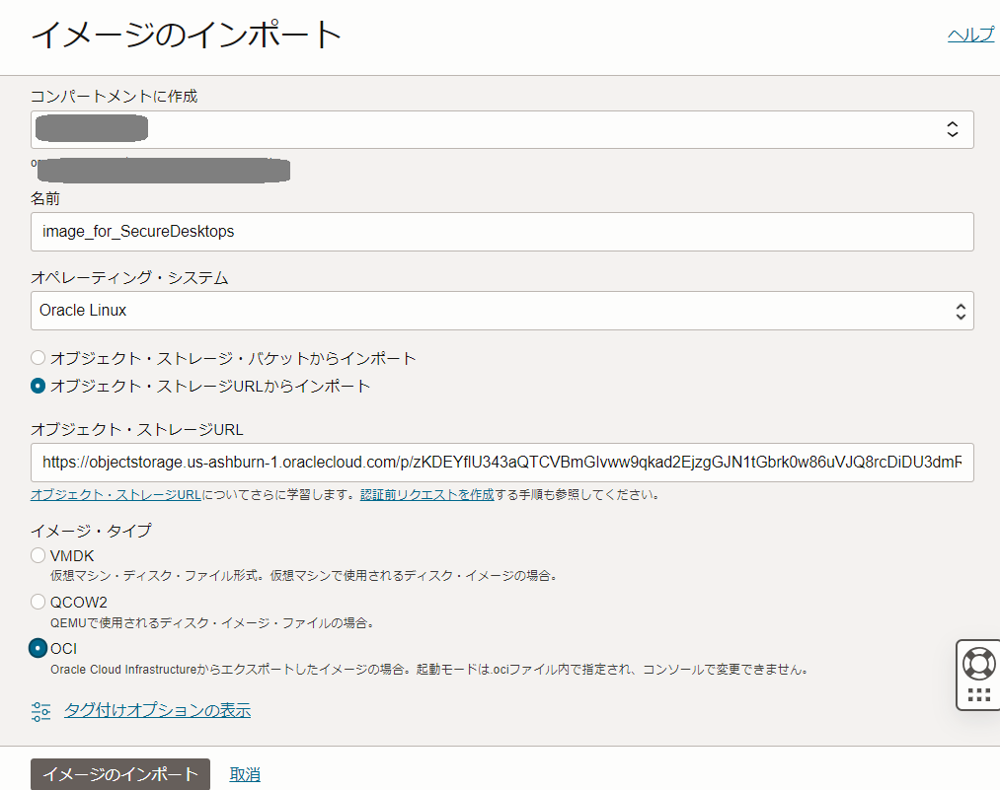

3. インポートにはしばらく時間がかかるので、カスタム・イメージが使用可能になるまで待ちます。

4. `カスタム・イメージの詳細画面` → `その他のアクション → タグの追加` をクリックして、以下3つの**フリーフォーム・タグ**を追加します。これを行うことにより、このあとのデスクトップ・プール作成時にこのイメージを選択できるようになります。
   
   - **oci:desktops:is_desktop_image： true**
   
   - **oci:desktops:image_os_type： Oracle Linux**
   
   - **oci:desktops:image_version：1**
   
   
     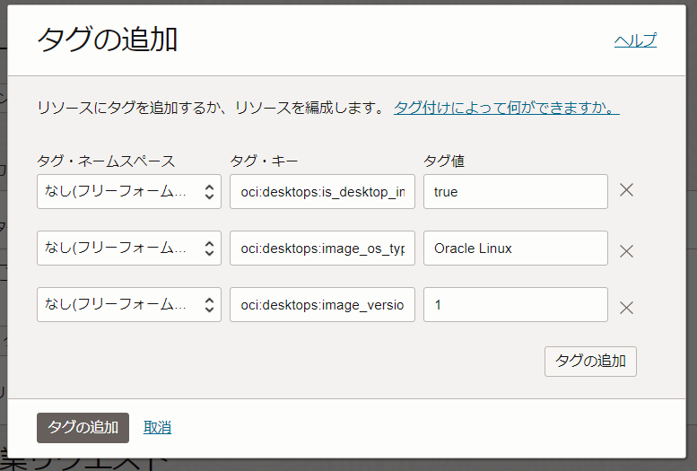

以上でイメージの準備は完了です。

# 4. デスクトップ・プールの作成

続いて、デスクトップ・プールを作っていきます。起動するデスクトップの定義情報を設定する部分です。

1. メニューの `コンピュート` → `セキュア・デスクトップ` → `デスクトップ・プール` を開く。

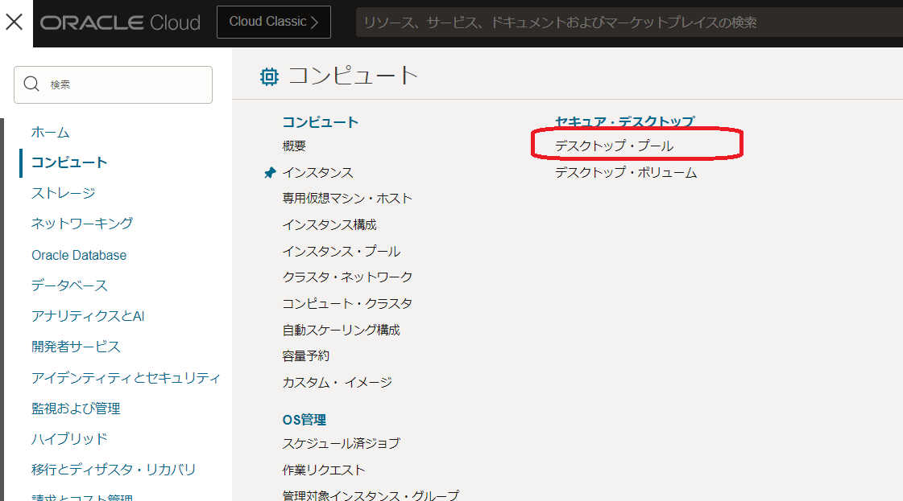

2. `デスクトップ・プールの作成` をクリックして、以下の情報を入力。

   - **名前**：任意

   - **説明**：任意

   - **プール開始時間、プール停止時間（オプション）**：今回は特に設定しません。プール作成後最初の利用開始時間やプールを以後使用しないという利用終了時間を管理者側で制御したい場合に設定できます。

   - **管理者連絡先詳細（オプション）**：今回は特に設定しません。デスクトップ・ユーザからの連絡を受ける連絡先です。

   - **管理者権限**：デフォルトは無効です。今回は有効化にチェックを入れておきます。

     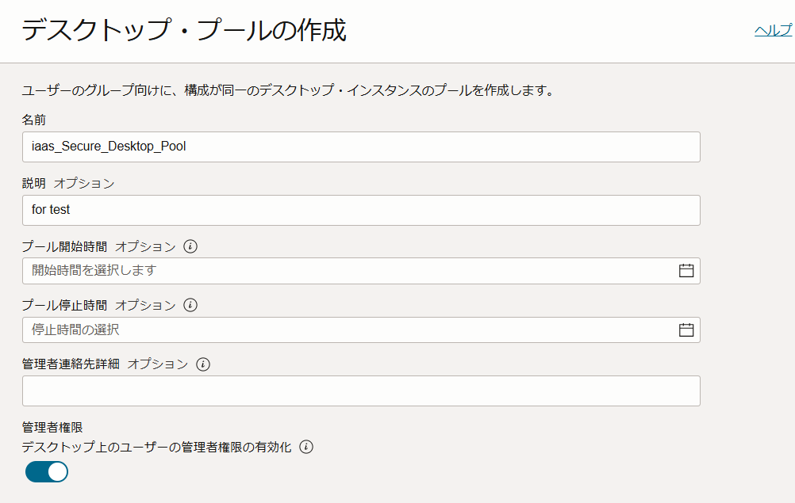

     - **プールサイズ**

       - **最大サイズ**：このデスクトップ・プールで起動できるデスクトップの最大数です。今回は最小の **10**に設定します。
       - **スタンバイ・サイズ**：ユーザーが初回アクセスした際に迅速に利用できるようにあらかじめスタンバイ状態にしておくデスクトップの数です。今回は **1** に設定します。

     - **配置**：選択肢はAD1のみです。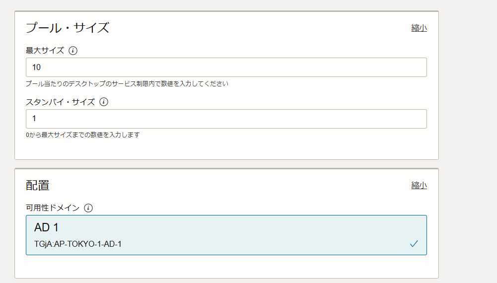

     - イメージとシェイプ

       - **イメージ**：**先ほど作成したイメージを選択。**

       - **Use dedicated virtual machine host**：専用仮想マシンホストを利用する場合に有効化しますが、今回はデフォルトの無効のままで問題ありません。

       - **Desktop virtual machine shape type**： **Flexible** を選択

         - **デスクトップ・シェイプ**：**VM.Standard.E5.Flex** を選択
         - **Desktop system resource configuration**：**カスタム**を選択 
           - **OCPUの数**：1
           - **メモリー量(GB)**：4
           - **ベースラインのOCPU使用量/OCPU**：100%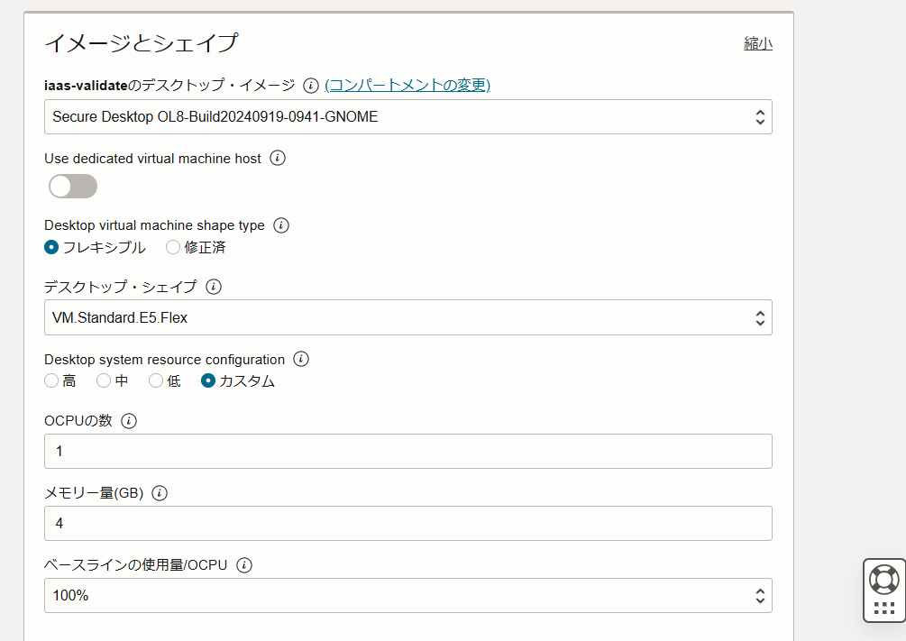

       - **ストレージ**

         - **デスクトップ・ストレージの有効化**：チェックを入れる
         - **Desktop storage volume size(GB)**：50 GB（デフォルト）
         - **バックアップ・ポリシー**：ポリシーなし（デフォルト）

       - **Desktop pool network**：デスクトップ・プールが起動されるネットワークを選択します。

         - **仮想クラウド・ネットワーク**：あらかじめ作成済みのVCNを選択

         - **サブネット**：VCN内の**プライベート・サブネット**を選択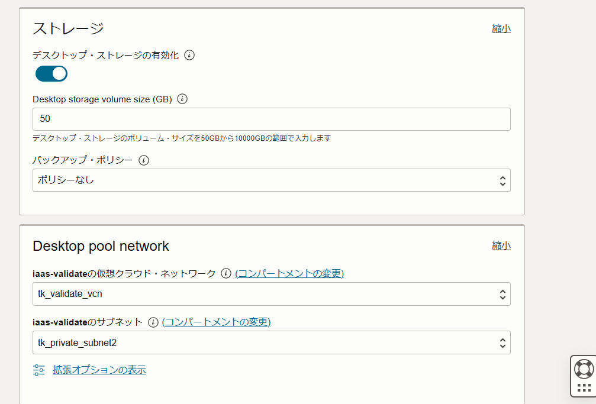

         - **Private access network**：ローカル端末から専用線などのプライベート・ネットワーク経由で利用する場合に構成しますが、今回はインターネット経由で利用するので構成しません。

           - **プライベート・エンドポイント・アクセスのみ**：無効のまま（デフォルト）

         - **デバイス・アクセス・ポリシー**

           - **クリップボード・アクセス**：完全（デフォルト）
           - **音声アクセス**：完全（デフォルト）
           - **ドライブ・マッピング・アクセス**：読取り/書込み（デフォルト）

           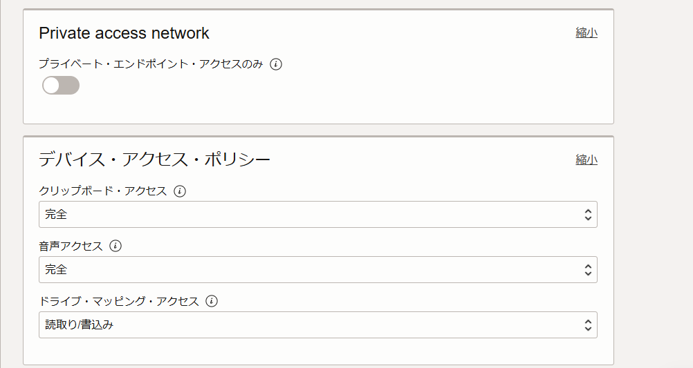

           - **Desktop Management Policy**：デスクトップの起動停止のスケジューリングもしくはデスクトップのアクティビティの状況によって休止状態にするかを設定できます。今回は、15分なにも操作がなければセッションを切断し、さらにセッション切断後60分アクティビティがなければデスクトップを停止させるように設定します。
             - **Action on inactivity**：切断
             - **Grace period for inactivity（in minutes）**：15
             - **Action on disconnect**：停止
             - **Grace period for disconnect（in minutes）**：60
               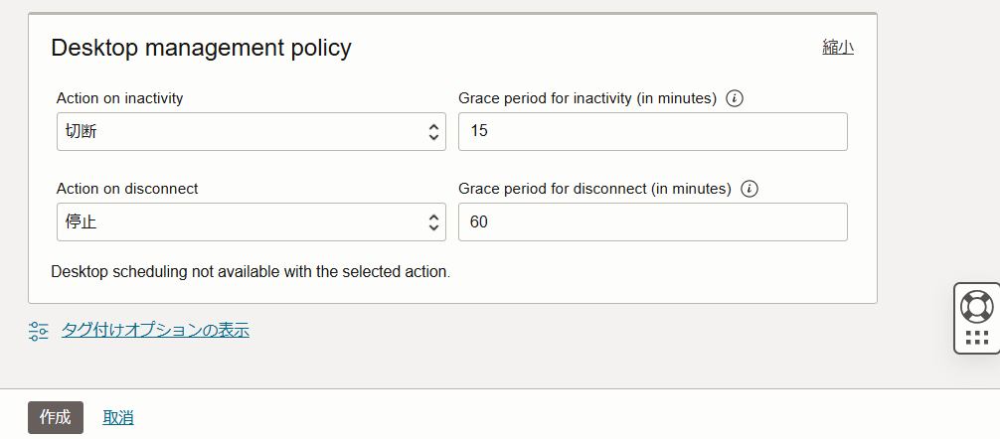

3. デスクトップ・プールの画面が開き、**作成中（CREATING）** の状態になっているので完了までしばらく待ちます。進捗状況は作業リクエストから確認できます。
   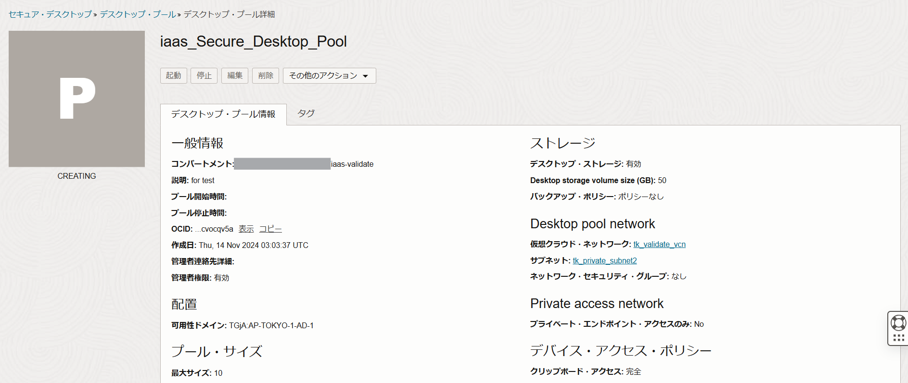

4. ステータスが **ACTIVE** になればデスクトップ・プールの作成は完了です。
   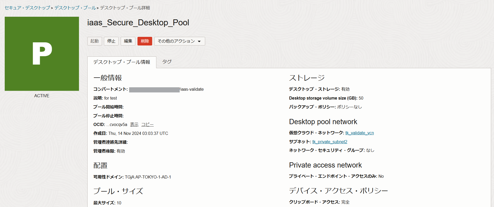

5. 画面下のほうの **デスクトップ** のところを見ると、どのユーザーにも紐づかないデスクトップが1つ作成されていることがわかります。これは、デスクトップのスタンバイを1に設定したので、スタンバイ用のデスクトップが1つ起動されている状態です。

   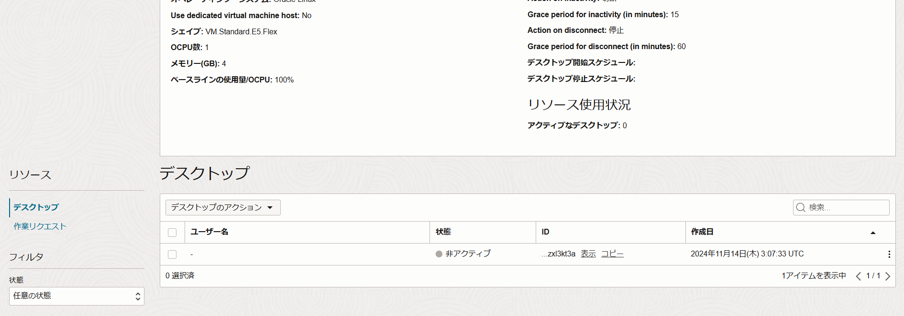

デスクトップ・プールが完成したので、これで管理者側の構築作業は終了です。あとはエンドユーザとして実際にデスクトップにアクセスして使ってみましょう。

# 5. ユーザーからのデスクトップへのアクセス（ブラウザ利用） 

デスクトップを利用するエンドユーザーは、適切なIAMグループに所属しているユーザーである必要があります。ただし、通常のOCIコンソールを利用する必要はありません。デスクトップアクセス用の以下のURLから利用できます。通常は管理者からこのURLをエンドユーザに通知します。

​	[https://published.desktops.ap-tokyo-1.oci.oraclecloud.com/client](https://published.desktops.ap-tokyo-1.oci.oraclecloud.com/client)（Tokyoリージョンの場合）

また、利用するブラウザでポップアップ・ブロックが設定されている場合は解除しておいてください。

1. ブラウザから上記URLにアクセスし、テナンシ名、ユーザー名、パスワードを入力してログイン。必要に応じてMFAでの認証を実施。

2. このようなクライアント用ページが開くので、割り当て済デスクトップのロードが終わるまで**しばらく待ちます**。
   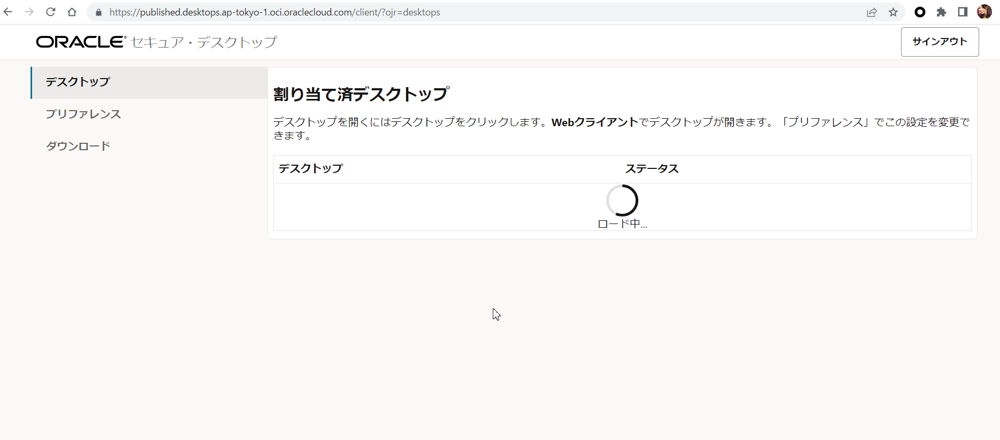

3. ロードが終わると先ほど作成したデスクトップ・プールの名前が表示され、ステータスが使用可能となりました。**デスクトップ・プールの名前をクリック**します。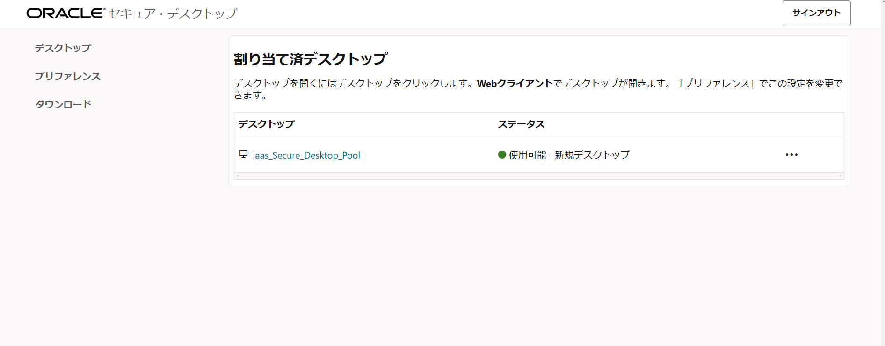
   
4. このようなポップアップが開きますので、**何もせずに待ちます**。特に初回アクセス時には新規デスクトップを起動していますのでしばらく時間がかかります。（ポップアップは閉じても問題はありません。）
   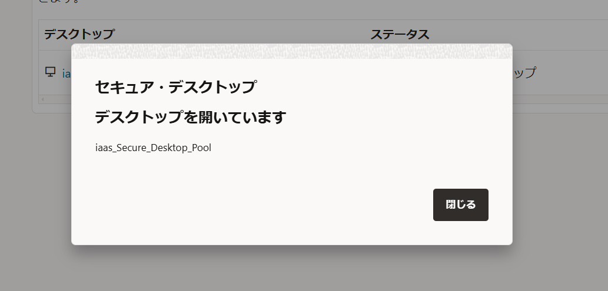

5. しばらく待つと、別タブでこのようなLoading画面が開いてきます。
   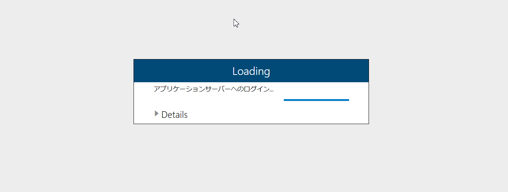

6. もしブラウザからクリップボードアクセスの許可を求められた場合は許可します。
   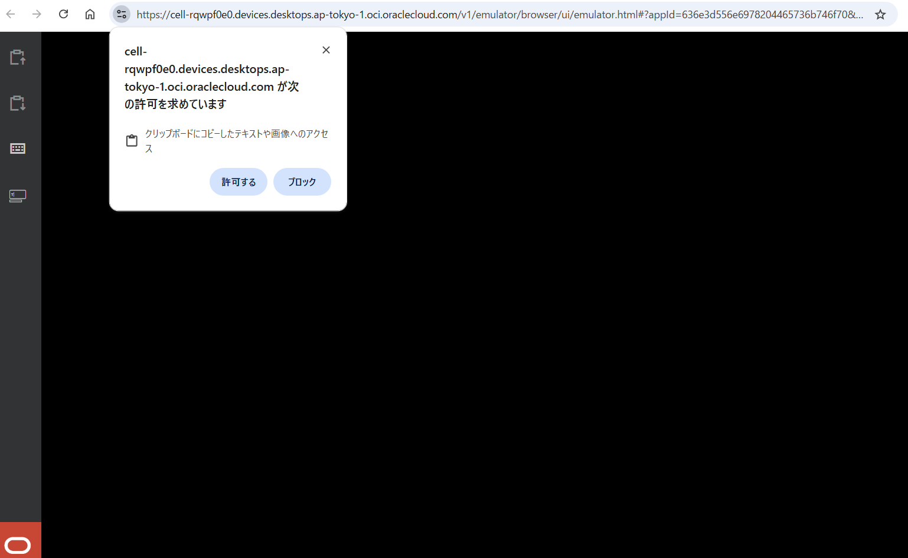

7. gnomeのwelcome画面になっているので、ウィザードに従って、言語設定、キーボード設定、などを行ってください。
   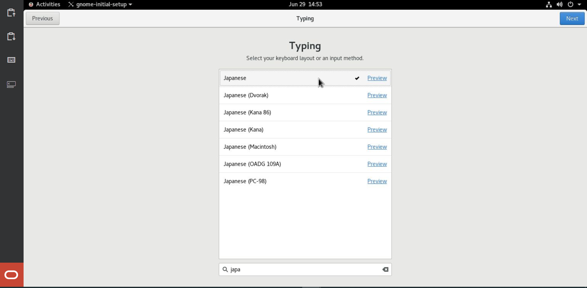

8. デスクトップが利用可能になります。
   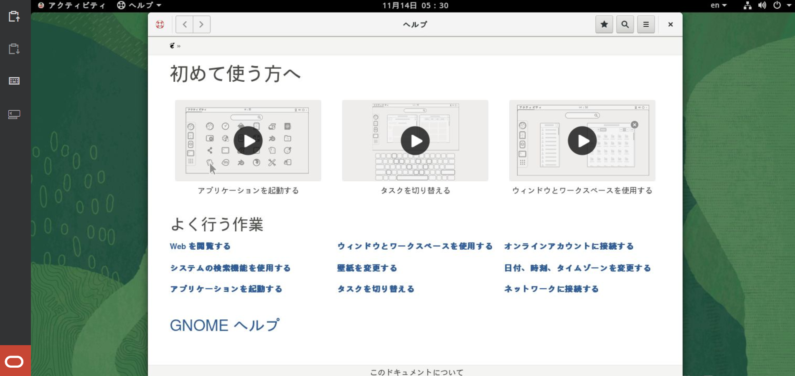

自由にデスクトップを利用してみましょう。

これでユーザに対してインスタンスが割り当て済みとなったので、二回目以降のアクセスはより迅速にデスクトップにアクセスすることが可能です。

# 6. ユーザーからのデスクトップへのアクセス（デスクトップ・クライアント利用）

ブラウザ内のみで操作するのではなくOracle Secure Global Desktop Clientというクライアント・ソフトウェアをインストールして利用することもできます。できることが少し異なります。

1. メニュー`プリファレンス` で 優先クライアントとして「**インストール済クライアント**」を選択する。
   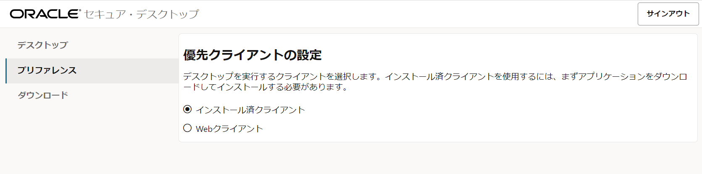

2. `ダウンロード` メニューからクライアント・ソフトウェアであるOracle Secure Global Desktop Clientをダウンロードしてインストール。利用しているローカル端末のOSに応じて適切なものを選択すること。

   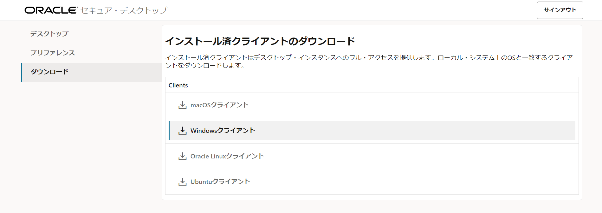
   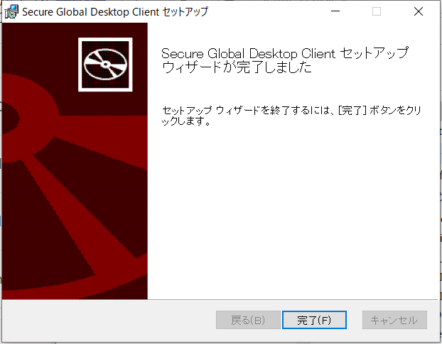

3. 先ほどと同様に割り当て済デスクトップから対象のデスクトップ・プール名をクリックする。
   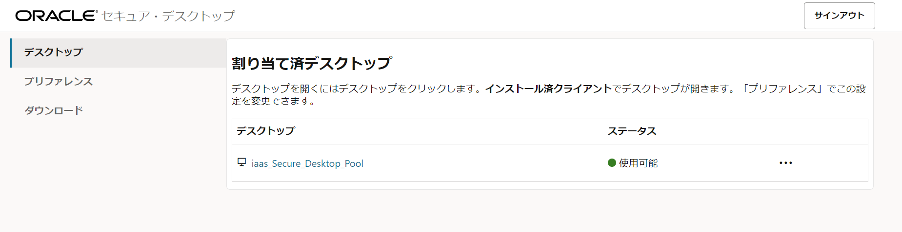

4. ブラウザからアプリケーションの起動について確認を求められた場合は許可してアプリケーションを開く。（優先クライアントをインストール済クライアントに設定している場合は自動的にさきほどインストールしたアプリケーションが起動し、デスクトップ・クライアントからデスクトップが開かれる。）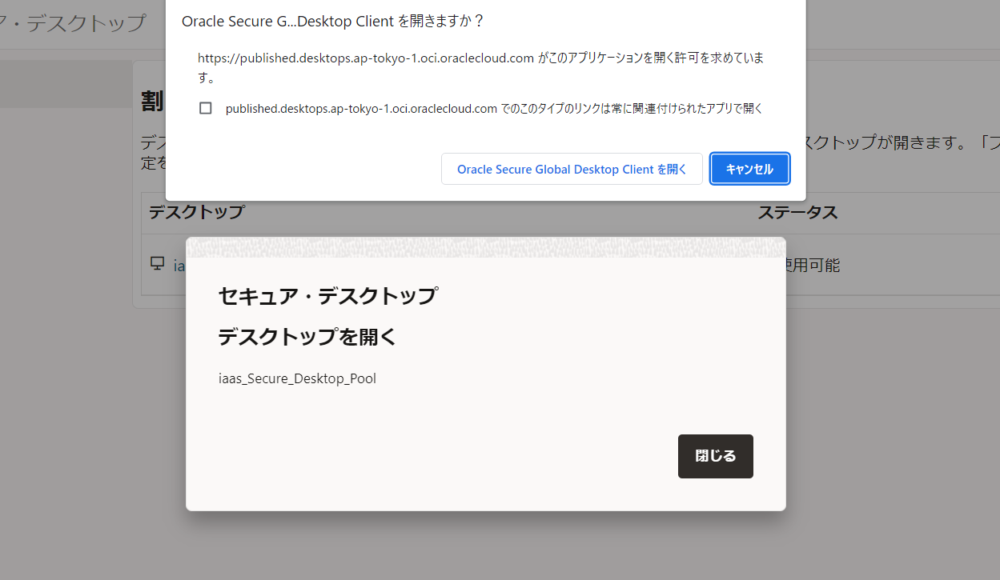

5. ブラウザで表示していたのと同じデスクトップが、自動的にデスクトップ・クライアントのウィンドウとして開かれます。

   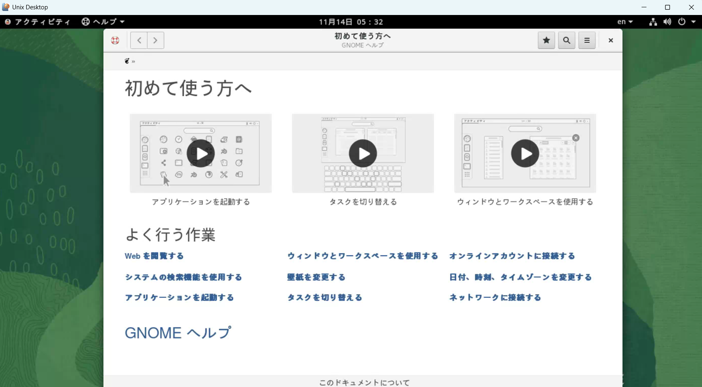

   

   自由にデスクトップの操作をしてみましょう。

   デスクトップ・クライアントの場合、ブラウザ・アクセスとは異なり、オーディオ（in / out）が利用できたり、ローカル端末のドライブ・マッピングが可能なので、ローカル端末上のファイルをデスクトップ上のフォルダから開いたり、ドラッグ・アンド・ドロップでコピーしたりもしやすいです。

# 7. デスクトップの休止の確認

デスクトップ・プール作成時に、デスクトップ上の操作が15分なければ自動的にセッションを切断、セッションが切断されてからアクティビティがなければ（再度デスクトップにアクセスすることがなければ）60分の猶予期間を経てからデスクトップを停止する設定をしました。

この切断と休止の動作を確認してみます。

1. デスクトップを起動し、なにもせずにそのまま15分間放置します。ブラウザやインストール済クライアントのウィンドウ内でマウスやキーボードなどの操作を行わないようにしてください。
2. 15分経つと、自動的にセッションが切断されることが確認できます。
3. さらに60分間デスクトップにアクセスしないでおくと、デスクトップが休止します。OCIコンソールのデスクトップ・プールの画面を開き、画面下部のデスクトップのセクションを確認すると、ユーザーに割り当てられているデスクトップが非アクティブになっていることが確認できます。非アクティブになっている間はコンピュートのVMインスタンスの課金が停止している状態です。再度ユーザーがデスクトップにアクセスすれば自動的に停止前の状態を保持して起動してきます。
   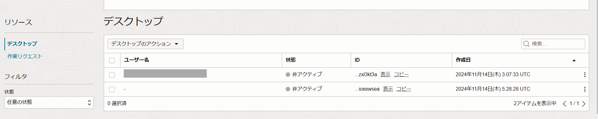

以上で、セキュア・デスクトップのチュートリアルは終了です。
