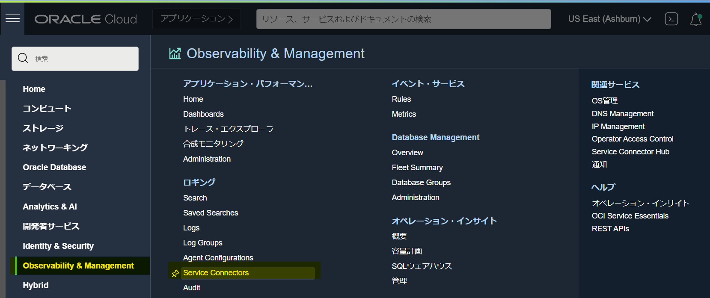
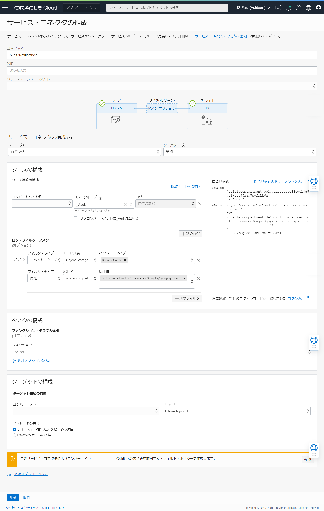
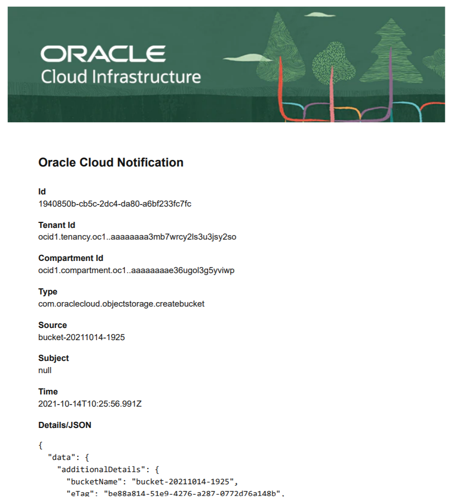
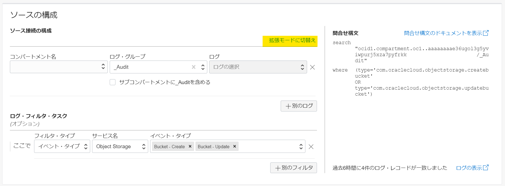

**チュートリアル一覧に戻る :** [Oracle Cloud Infrastructure チュートリアル](../..)

**監査 (Audit)** サービス とは、テナンシ内のアクティビティを、ログとして自動的に記録してくれるサービスです。具体的には、Oracle Cloud Infrastructureコンソール、コマンドライン・インタフェース(CLI)、ソフトウェア開発キット(SDK)、ユーザー独自のクライアント、または 他のOracle Cloud Infrastructureサービスによって行われるAPIコール が記録されます。

監査ログは そのままではただ蓄積されるだけですが、サービス間連携を担う「サービス・コネクタ・ハブ」を使用し、「通知」サービスと組み合わせることで、**「特定の操作が行われた場合に検知してメールで通知させる」** といった応用が可能です。


この章では、監査ログを サービス・コネクタ・ハブ、および 通知サービス と連携させ、テナンシ内の特定コンパートメントで「**バケットが作成された場合に通知する**」という設定を行っていきたいと思います。

巻末にはその他の監視内容についても、いくつかのサンプルを記載していますので、参考にしてください。


**所要時間 :** 約20分

**前提条件 :** 

- チュートリアル : [モニタリング機能でOCIのリソースを監視する](/ocitutorials/intermediates/monitoring-resources/) の「4. アラームの通知先の作成」を完了し、Eメールを受信可能な **トピック** 及び **サブスクリプション** が 登録済みであること。

**注意 :** チュートリアル内の画面ショットについては Oracle Cloud Infrastructure の現在のコンソール画面と異なっている場合があります。


# 1. サービス・コネクタ・ハブの作成

監査サービスは、テナンシ開設時にデフォルトで有効化されているため、特に事前準備は必要ありません。

まずは、サービス・コネクタ・ハブから作成していきましょう。


1. ナビゲーション・メニュー（ **三** のアイコン）より、**Observability & Management** → **Service Connectors** をクリックし、サービス・コネクタの一覧画面を表示します。

   

2. 「**サービス・コネクタの作成**」ボタンをクリックします。

   

3. 下記を参考に、サービス・コネクタの作成画面にて必要事項を入力し、左下の **作成** ボタンをクリックします。

   - **コネクタ名** - 任意 (例：Audit2Notifications)

   - **説明**（オプション） - 任意

   - **リソース・コンパートメント** - 任意

   <font color="DimGray">**サービス・コネクタの構成**</font>

   - **ソース** - リストから [ロギング] を選択
   - **ターゲット** - リストから [通知] を選択

   <font color="DimGray">**ソースの構成**</font>

   - <font color="DimGray">**ソース接続の構成**</font>

     - **コンパートメント名** - 任意
     - **ログ・グループ** - リストから [_Audit] を選択
       - **サブコンパートメントに_Auditを含める** - 任意
         ※サブコンパートメントを含む監査ログの監視をしたい場合には、チェックを有効化
     - **ログ** - 設定なし (非活性項目)

   - <font color="DimGray">**ログ・フィルタ・タスク**</font>

     - **フィルタ・タイプ** - リストから [イベント・タイプ] を選択
     - **サービス名** - リストから [Object Storage] を選択 (または直接入力も可)
     - **イベント・タイプ** - リストから [Bucket - Create] を選択 (または直接入力も可)

     「**＋別のフィルタ**」をクリックし、下記条件を追加します。

     - **フィルタ・タイプ** - リストから [属性] を選択
     - **属性名** - リストから [oracle.compartmentId] を選択 (または直接入力も可)
     - **イベント・タイプ** - リストから対象のコンパートメントIDを選択 (または直接入力も可)

     >***Note***
     >
     >コンパートメントのIDは、ナビゲーション・メニュー → Identity & Security → コンパートメント をクリックし、コンパートメントの一覧画面から、対象のコンパートメントの「OCID」列で確認できます。

   <font color="DimGray">**タスクの構成**</font>

   - **タスクの選択** - 未選択

     ※ファンクション・サービスを選択し、組み合わせることで、ソースから受けたデータを処理することも可能です。

   <font color="DimGray">**ターゲットの構成**</font>

   - <font color="DimGray">**ターゲット接続の構成**</font>
     - **コンパートメント** - 事前に作成したトピックが含まれるコンパートメントを選択
     - **トピック** - 事前に作成したトピックを選択
     - **メッセージの書式** - [フォーマットされたメッセージの送信] を選択

   最後に、「**このサービス・コネクタによるコンパートメント XXXX の通知への書込みを許可するデフォルト・ポリシーを作成します。** 」という注意書きが表示されるので、「作成」をクリックします。

   これにより、サービス・コネクタ から 通知サービスへの書込み許可を行うポリシーが自動的に追加されます。

   

これで、サービス・コネクタ・ハブの作成は完了です。


# 2. メール通知されることを確認

次に、実際に対象のコンパートメント上でバケットを作成し、メールで通知されることを確認していきます。

1. チュートリアル : [その7 - オブジェクト・ストレージを使う](/ocitutorials/beginners/object-storage/) の「1. コンソール画面の確認とバケットの作成」を参考に、オブジェクト・ストレージを作成します。

   この際、バケットを作成するコンパートメントは、サービス・コネクタ・ハブの ログ・フィルタ で選択したコンパートメントを選択してください。

2. 数分待ちます。

3. メールを受信したことを確認します。サービス・コネクタ・ハブの作成時に「フォーマットされたメッセージの送信」を選択したことにより、HTML形式の見やすいレイアウトで 通知されています。

   - **件名**：OCI Service Connector Hub Notification: com.oraclecloud.objectstorage.createbucket
   - **送信元**：noreply@notification.us-ashburn-1.oci.oraclecloud.com (リージョンによってドメインは異なります)

   


サービス・コネクタ・ハブと通知の設定が正しくできていることがわかりました。
通知を停止したい場合には、作成したサービス・コネクタ・ハブ自体を削除しても良いですし、一時的にオフにする場合には、サービス・コネクタ・ハブの詳細画面にて、「**非アクティブ化**」を選択することで、停止することができます。


# 3. [応用編] 拡張モードを使用したログ・フィルタ・タスクの設定

手順1. サービス・コネクタ・ハブの作成 では触れていませんでしたが、実は、サービス・コネクタ・ハブの「ソースの構成」を設定する方法には２つあります。 

手順1 で実施した「**基本モード**」を使用して設定する他に、「**拡張モード**」と言われる、問合せ構文を使用した 設定を行うことで、より詳細なフィルタリングをすることが可能です。


拡張モードに切り替えるには、**ソースの構成** で、[**拡張モードに切替え**] をクリックします。




拡張モードでは **問合せコード・エディタ** に問合せ構文を直接入力し、設定していきます。
問合せ構文の詳細については Oracle Cloud Infrastructure ドキュメント：[サービス・コネクタ・ハブの問合せ参照](https://docs.oracle.com/ja-jp/iaas/Content/service-connector-hub/queryreference.htm) を参照してください。


ここでは、サンプルとして いくつかのユースケース と それに応じた問合せ構文を記載しています。設定の参考にしてみてください。

## **(1) パブリック状態のオブジェクト・ストレージを検知する**

・**問合せ構文**

```
search "＜検索対象コンパートメントのOCID＞/_Audit_Include_Subcompartment" | (type='com.oraclecloud.objectstorage.createbucket' or type='com.oraclecloud.objectstorage.updatebucket') and (data.additionalDetails.publicAccessType='ObjectRead' or data.additionalDetails.publicAccessType='ObjectReadWithoutList') and (data.request.action!='GET')
```

- **"＜検索対象コンパートメントのOCID＞/_Audit_Include_Subcompartment"**

  検索対象のコンパートメントと、ログ・グループの指定をしています。
  サブコンパートメントのログを含め検索するために「\_Audit_Include_Subcompartment」を指定していますが、含めない場合は「\_Audit」を指定します。

- **(type='[略].objectstorage.createbucket' or type='[略].objectstorage.updatebucket')**

  イベント・タイプを「バケットの作成」と「バケットの更新」で設定しています。

  コンソール経由でバケットを作成する際は デフォルトでプライベートの設定になりますが、CLI等を経由した場合には パブリックを指定してバケットを作成することが出来るため、更新時だけでなく、作成も含めます。

- **(data.additionalDetails.publicAccessType='ObjectRead' or data.additionalDetails.publicAccessType='ObjectReadWithoutList')**

  オブジェクト・ストレージの作成・更新における監査ログでは、「data.additionalDetails.publicAccessType」という項目があり、プライベートの場合は「NoPublicAccess」となり、パブリックが設定されている場合は「ObjectRead」または「ObjectReadWithoutList」となるため、or 条件で上記の２つの属性を指定します。


## (2) 特定のブロック・ボリュームのバックアップが作成されたことを検知する

・**問合せ構文**

```
search "＜検索対象コンパートメントのOCID＞/_Audit_Include_Subcompartment" | (type='com.oraclecloud.blockvolumes.createvolumebackup.begin') and (data.stateChange.current.volumeId='＜対象のブロック・ボリュームのOCID＞') and (data.request.action!='GET') 
```

- **(type='com.oraclecloud.blockvolumes.createvolumebackup.begin')**

  イベント・タイプを「ブロック・ボリュームのバックアップの作成」で設定しています。

- **(data.stateChange.current.volumeId='＜対象のブロック・ボリュームのOCID＞')**

  バックアップが作成されたブロック・ボリュームを 特定のブロック・ボリュームに絞り込むため、「data.stateChange.current.volumeId」にて、OCID を指定しています。

  

## (3) ロード・バランサが作成されたことを検知する

※現時点 (2021/10/14) では 基本モードでは イベント・タイプにロード・バランサが表示されないため、検知するためには、拡張モードを使用します。

・**問合せ構文**

```
## ロード・バランサの作成リクエストを検知したタイミングで通知したい場合
search "＜検索対象コンパートメントのOCID＞/_Audit_Include_Subcompartment" |
(type='com.oraclecloud.OraLB-API.CreateLoadBalancer.begin') and (data.request.action!='GET') 

## ロード・バランサの作成リクエストを検知したタイミングで通知したい場合
search "＜検索対象コンパートメントのOCID＞/_Audit_Include_Subcompartment" |
(type='com.oraclecloud.OraLB-API.CreateLoadBalancer.end') and (data.request.action!='GET') 
```

- ロード・バランサの作成リクエストを検知したタイミングで通知したい場合
  - **(type='com.oraclecloud.OraLB-API.CreateLoadBalancer.begin')**
- ロード・バランサの作成リクエストを検知したタイミングで通知したい場合
  - **(type='com.oraclecloud.OraLB-API.CreateLoadBalancer.end')**

  イベント・タイプを「ロード・バランサの作成」で設定しています。


## (4) ネットワーク・ロード・バランサが作成されたことを検知する

※現時点 (2021/10/14) では 基本モードでは イベント・タイプにネットワーク・ロード・バランサが表示されないため、検知するためには、拡張モードを使用します。

・**問合せ構文**

```
search "＜検索対象コンパートメントのOCID＞/_Audit_Include_Subcompartment" | (type='com.oraclecloud.network-load-balancer-api.CreateNetworkLoadBalancer.begin') and (data.request.action!='GET') 
```

- **(type='com.oraclecloud.network-load-balancer-api.CreateNetworkLoadBalancer.begin')**

  イベント・タイプを「ネットワーク・ロード・バランサの作成」で設定しています。


このように、どのようなイベント・タイプがあり、イベント・タイプごとにどのような 項目があるかは、それぞれ異なっています。大まかな構成は Oracle Cloud Infrastructure ドキュメント：[監査ログイベントの内容](https://docs.oracle.com/en-us/iaas/Content/Audit/Reference/logeventreference.htm) などを参考にできますが、より詳細に知るためには、時には 実際にその操作を行う必要もあるかと思います。

本チュートリアルでも いくつかの例に挙げましたが、その他にも、セキュリティ・リストが更新されたことを検知したり、ブロック・ボリュームのバックアップが作成されたことを検知する等、設定次第で様々な監視・通知が可能です。

用途に応じて、サービス・コネクタ・ハブ、通知サービスを活用して頂ければ幸いです。


>**補足**
>
>同様の機能に「イベント・サービス」と「通知サービス」を組み合わせた方法があります。
>
>イベント・サービスは 現時点 (2021/10/14) では 「分かりやすい書式」に対応していないため、べた書きの JSONデータが通知されるものの、監査ログでは検知することができない、オブジェクト・ストレージ内の「オブジェクト」に関するイベントを契機に通知を行うことが可能です。
>
>こういったケースにおいては、「イベント・サービス」と「通知サービス」の利用を検討してください。


目次に戻る : [チュートリアル : Oracle Cloud Infrastructure を使ってみよう](https://oracle-japan.github.io/ocitutorials/)

