**チュートリアル一覧に戻る :** [Oracle Cloud Infrastructure チュートリアル](../..)
<br>

OCI Web Application Acceleration（WAA）はフレキシブル・ロードバランサ（FLB）に紐づけるコンポーネントで、コンテンツ・キャッシュ機能とコンテンツのGZIP（GNU zip）による圧縮機能を提供します。これにより、クライアントへのレスポンス高速化、ひいてはアプリケーションのユーザーエクスペリエンス向上が期待できます。本チュートリアルでは、WebブラウザからGETメソッドのHTTPリクエストを行ったとき、WAAによりHTMLファイルのコンテンツ・キャッシュとGZIP圧縮が行われる様子を観察します（下図; 検証環境はOCIチュートリアル中級編『ロードバランサーでWebサーバーを負荷分散する』で作成したFLBと、Apacheをインストールしたバックエンドサーバー1台を再利用して構成します）。

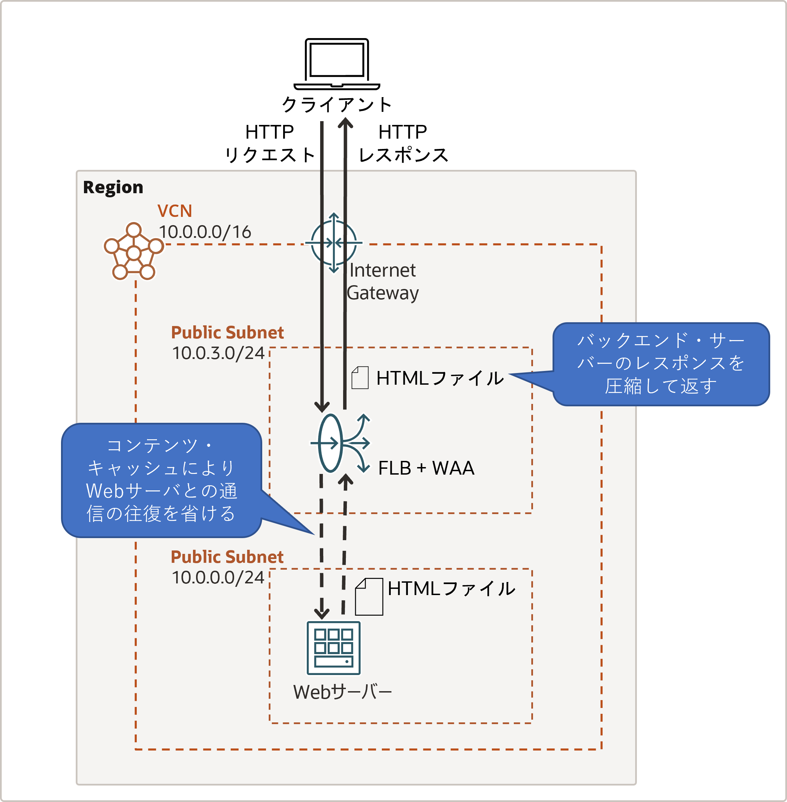


>***Note***
>
>本チュートリアルを行うにあたっては、プロキシが挙動に影響を与える可能性がございます。クライアントPCがVPNに接続している場合は切断されることをお勧めします。


**所要時間 :** 約30分

**前提条件 :**
1. [『OCIチュートリアル中級編『ロードバランサーでWebサーバーを負荷分散する』](https://oracle-japan.github.io/ocitutorials/intermediates/using-load-balancer/)を完遂していること

1. Google Chromeウェブブラウザを用いること


**注意 :** チュートリアル内の画面ショットについては、現在のコンソール画面と異なっている場合があります

**目次 :**
   1. [バックエンド・サーバーにて検証用Webサイトを構築する](#anchor1)
   1. [WAAの設定を行う](#anchor2)
   1. [ブラウザからWebサイトにアクセスし、WAAの働きを確認する](#anchor3)

<br><br>

<a id="anchor1"></a>


# 1. バックエンド・サーバーにて検証用Webサイトを構築する
この章では、FLBのバックエンド・セットのWebサーバ・インスタンスにて、WAAのキャッシュ機能を活用するためのApacheの設定と、圧縮機能を試すためのHTMLファイルの作成を行います。

本チュートリアルの前提条件を完遂すると、FLB専用サブネットおよびFLB、パブリック・サブネットに配置された二台のバックエンド・Webサーバ・インスタンスが作成されます(図)。今回、そのうちの一台の設定を編集しますので、まずはSSH接続のためのパブリック・サブネットのルーティングとセキュリティの設定を行います。
    

1. コンソール・メニューから **`ネットワーキング`**>**`仮想クラウドネットワーク`** を選択します（図）
  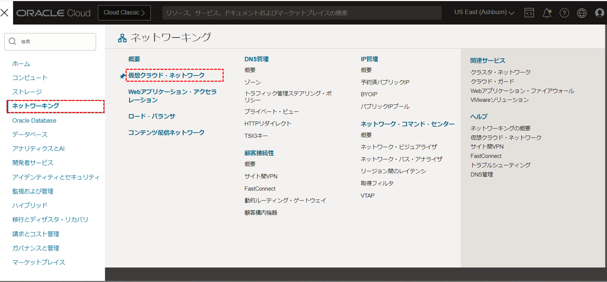

1. 仮想クラウド・ネットワークの一覧から **`TutorialVCN`** のデフォルト・ルート表である、**`Default Route Table for TutorialVCN`** を選択します（図）
  

1. 遷移先、**`Default Route Table for TutorialVCN`** の詳細画面にて、ルート・ルールの追加（図、青色のボタン）をクリックします
    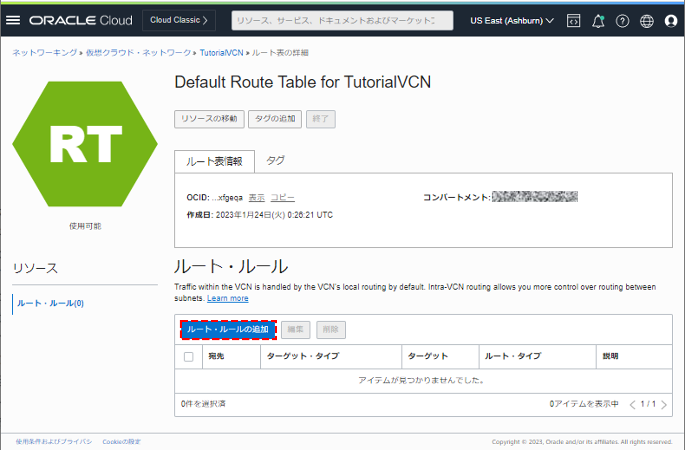

1. 表示されるウィザードにて、次の設定を行い、ルートルールの追加ボタン（図、青色のボタン）をクリックします
  - **`ターゲット・タイプ`** - インターネット・ゲートウェイ
  - **`宛先CIDRブロック`** - 0.0.0.0/0
  - **`[コンパートメント名] のターゲット・インターネット・ゲートウェイ`** - インターネット・ゲートウェイ-TutorialVCN
  - **`説明`** - 任意
  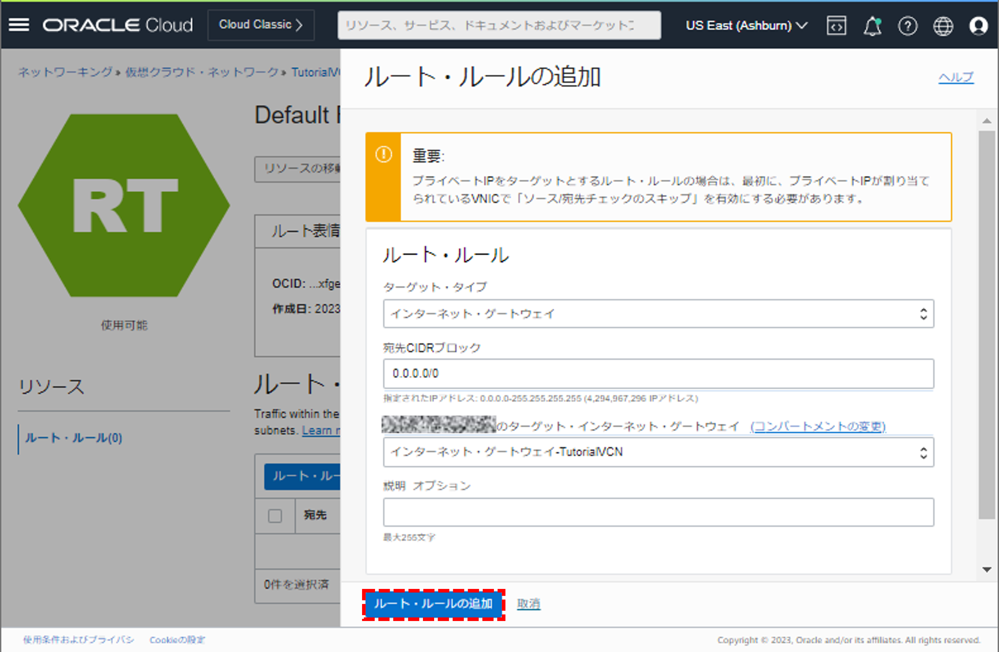

1. 新しいルート・ルールが追加されていればルーティングの設定は完了です
  

1. 次はセキュリティ・リストの設定を行っていきます。コンソール・メニューから **`ネットワーキング`**>**`仮想クラウドネットワーク`**>**`TutorialVCN`** を選択し、詳細画面から **`パブリック・サブネット-TutorialVCN`** を選択します（図）。
  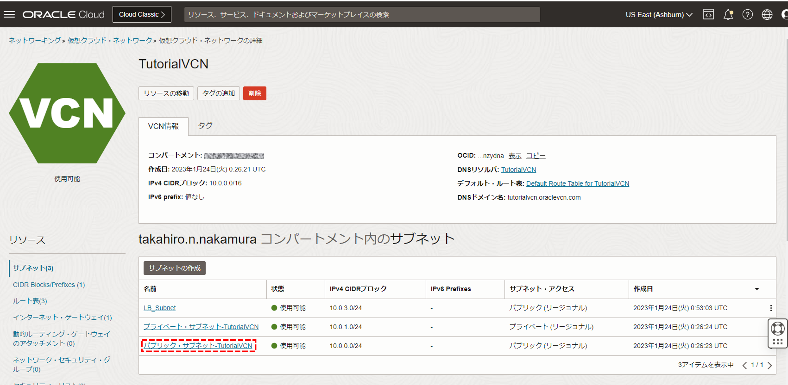

1. 遷移先、**`パブリック・サブネット-TutorialVCN`** の詳細画面にて、**`Default Security List for TutorialVCN`** をクリックします（図）
  

1. 遷移先、**`Default Security List for TutorialVCN`** の詳細画面にて、**`イングレス・ルールの追加`** をクリックします（図）
  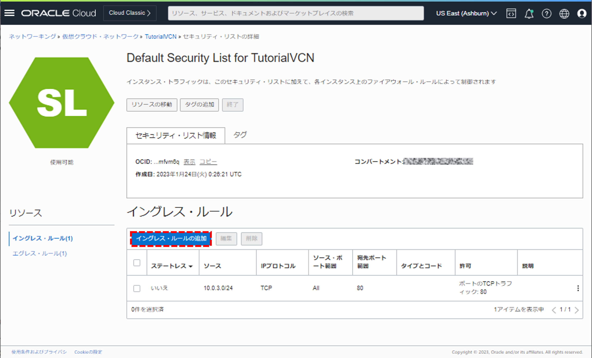

1. 表示されるウィザードで次のように項目を設定し、**`イングレス・ルールの追加`** ボタン（図中青色のボタン）をクリックします
  - **`ステートレス`** - チェックなし
  - **`ソース・タイプ`** - CIDR
  - **`ソースCIDR`** - 0.0.0.0/0
  - **`IPプロトコル`** - TCP
  - **`ソース・ポート範囲`** - All（デフォルト）
  - **`宛先ポート範囲`** - 22
  - **`説明`** - 任意
  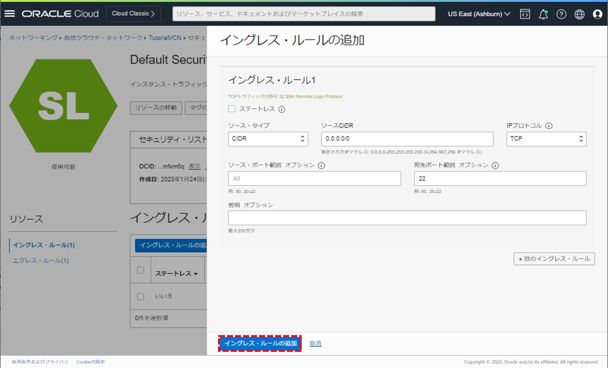

1. イングレス・ルールが追加されていればセキュリティ・リストの設定は完了です（図）
  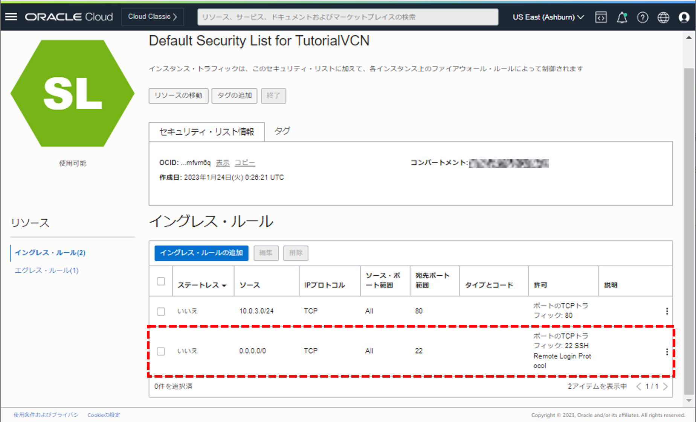

1. コンソールメニューから、**`ネットワーキング`** > **`ロード・バランサ`** を選択して（図）、ロード・バランサの一覧画面を表示します
  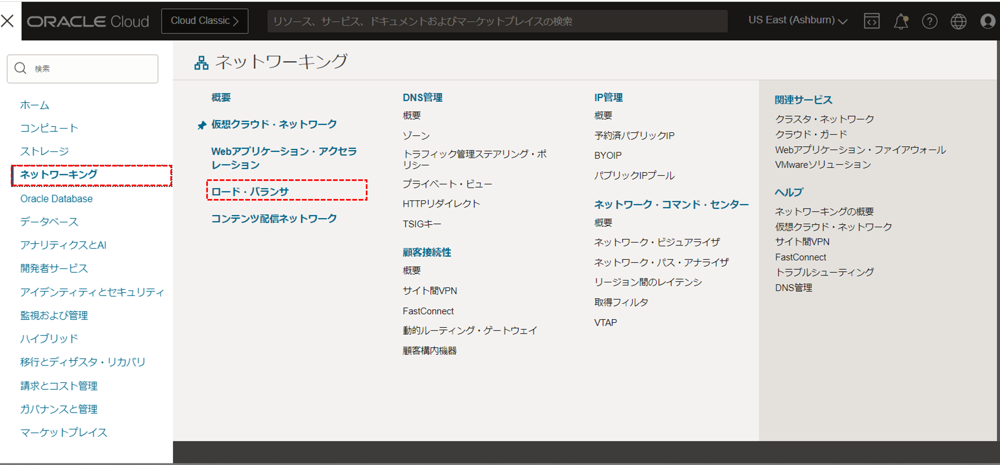

1. Tutorial_LBを選択します（図）
  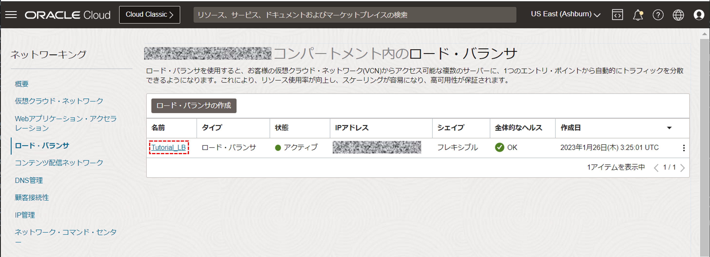
>***Note***
>
>後ほど作成するWebページにアクセスする際に用いるので、Tutorial_LBのパブリックIPアドレスはここで控えておくことをお勧めします

1. 表示される詳細画面の左側、リソースメニューから **`バックエンド・セット`** をクリックします。さらに、表示されるバックエンドセット名をクリックします（図）
  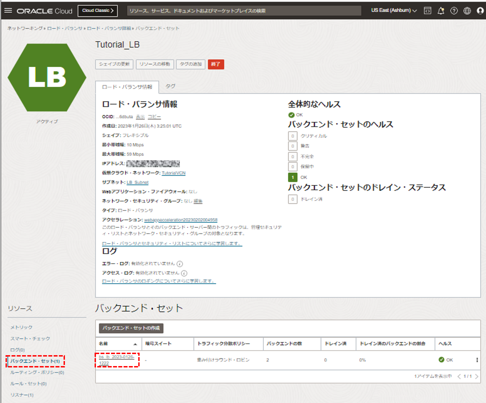

1. 遷移先の画面のリソースメニューから、**`バックエンド`**を選択し、二台ある内の一台にチェックマークを付けます。その後、**`アクション`**>**`削除`** を選択します（図）
  

1. バックエンドとして残した方のインスタンスのIPアドレスを確認し、コンソールメニューから、**`コンピュート`**>**`インスタンス`** を選択し、インスタンスの一覧画面に移動します（図）
  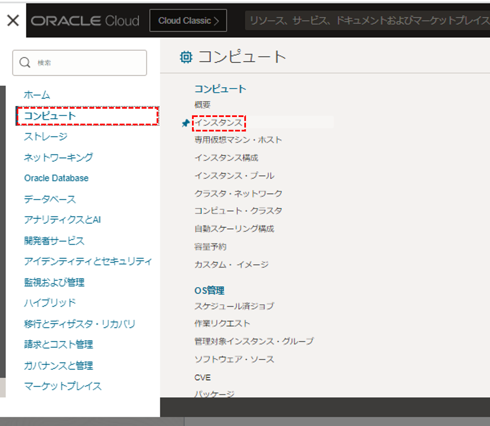

1. 遷移先で、前項で確認したプライベートIPアドレスに対応するパブリックIPアドレスを確認し、次のコマンドでSSH接続を行います（図、コマンド）
  
  <br>
  ```sh
  ssh -i [秘密鍵へのパス] opc@[パブリックIPアドレス]
  ```

1. SSH接続が出来たら、次のコマンドでApacheの設定ファイルにキャッシュ保持の設定を書き込みます
  ```sh
  sudo sh -c 'echo Header set Cache-Control \"Public, max-age=604800\" >> /etc/httpd/conf/httpd.conf'
  ```

1. さらに次のコマンドで、約5MBのHTMLファイルを作成します（少々時間がかかります）
  ```sh
  sudo seq 1 64934 | xargs -I num sh -c 'if [ "num" = 1 ]; then echo "<!doctype html><html><head><meta charset="UTF-8"><title>TEST-page for WAA</title></head><h1>このコンテンツが作成された時間: "`date`"</h1>"; else echo "<li>WAAでコンテンツのキャッシュと圧縮ができます</li><br>";fi' | sudo tee /var/www/html/index.html > /dev/null
  ```

<br>

# 2. WAAの設定を行う
<a id="anchor2"></a>
ここからはWAAの設定を行っていきます。

1. まずコンソール・メニューから **`ネットワーキング`** > **`Webアプリケーション・アクセラレーション`** を選択します（図）
  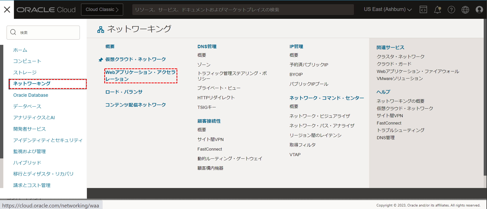

1. 遷移先の画面、**`WAAポリシーの作成`** ボタンをクリックします（図）
  

1. 以下の設定を行ったうえ、**`WAAポリシーの作成`** ボタンをクリックします（図）
  - **`名前`** - TutorialWAA
  - **`コンパートメント`** - 任意
  - **`キャッシング`** - チェックあり（デフォルト）
  - **`圧縮`** - チェックあり
  - **`[コンパートメント名]のロード・バランサ`** - Tutorial_LB
  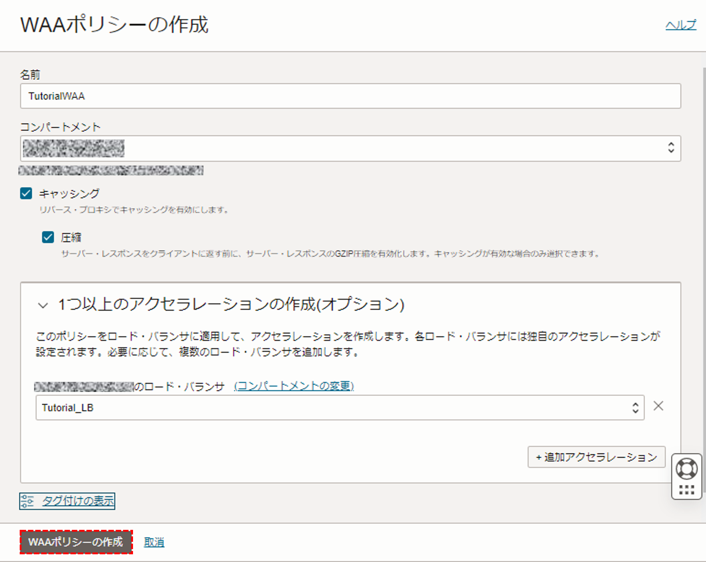

1. 詳細画面にて一つのアクセラレーションが紐づいており、ステータスがアクティブになっていることを確認できれば設定は完了です（図）
  

1. 最後に、自分のみがFLBへのアクセスできるようにセキュリティ・リスト絞っていきます。自身のクライアントPCが使用しているグローバルIPアドレスを調べられるサイトを利用して、表示されるアドレスをメモをしましょう

1. 1章6項を参考に、**`ネットワーキング`**>**`仮想クラウドネットワーク`**>**`TutorialVCN`** を選択し、詳細画面から **`パブリック・サブネット-TutorialVCN`** を選択します。今回は、その中からLB_Subnetを選択し、紐づいているセキュリティ・リスト（FLB専用のセキュリティ・リスト）のイングレス・ルール一覧を表示します

1. FLBのセキュリティ・リストは、ソースを問わない宛先ポートが80番のセキュリティ・ルールが一行書き込まれています。そのルールの右端のトリコロンをクリックし、表示された **`編集`** をクリックします（図）


1. 表示される **`イングレス・ルールの編集`** 画面でソースCIDRを、自身のクライアントPCのグローバルIPアドレスに書き換えます。このときプレフィックス長は32bitにします。したがって、ソースCIDRはxxx.xxx.xxx.xxx/32のように記述します(図)
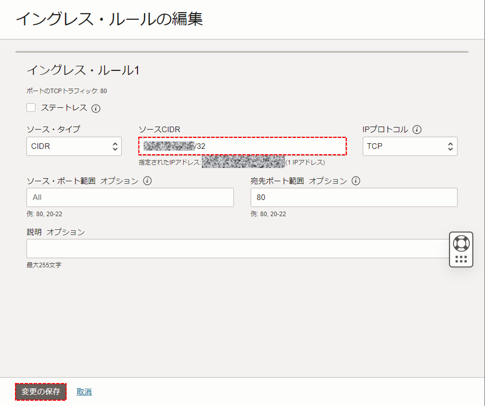

1. セキュリティ・ルールが追加されていれば完了です（図）
  

<br>

# 3. ブラウザからWebサイトにアクセスし、WAAの働きを確認する
<a id="anchor3"></a>
この章ではいよいよ作成したWebページにアクセスして、WAAの働きを確認していきます。

1. アクセラレーションの名前をクリックして詳細画面に移動します（図）
  

1. HTTPリクエスト、レスポンス・サイズ（バイト）、バックエンド・レスポン・サイズ（バイト）、圧縮率、圧縮の入力サイズ、圧縮からの出力バイトの六つのメトリックが表示されており、全ての項目で0がプロットされ続けていることをご覧いただけます（図）
  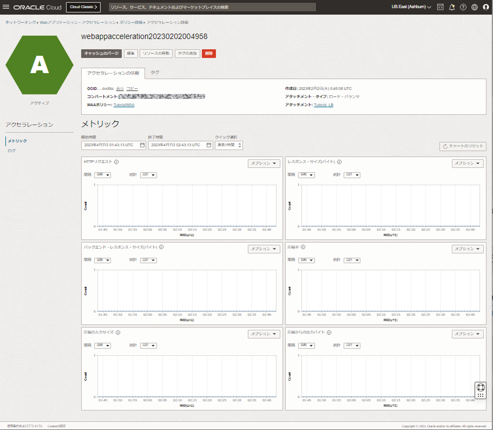

1. アクセラレーションメニューから、**`ログ`** をクリックします（図）
  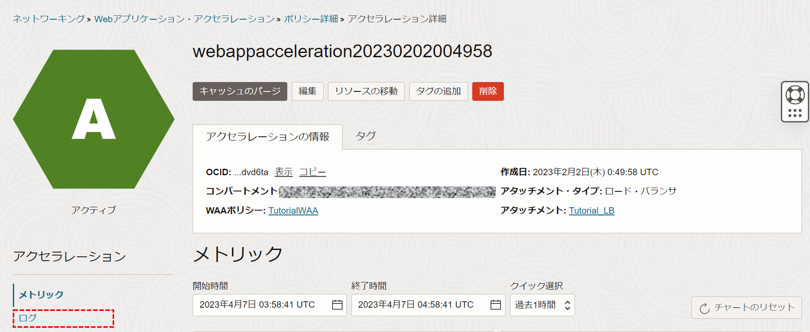

1. 遷移先の詳細画面にて、カテゴリ **`All Logs`** の一行があるので、無効になっているログをトグルボタンで有効化します（図）
  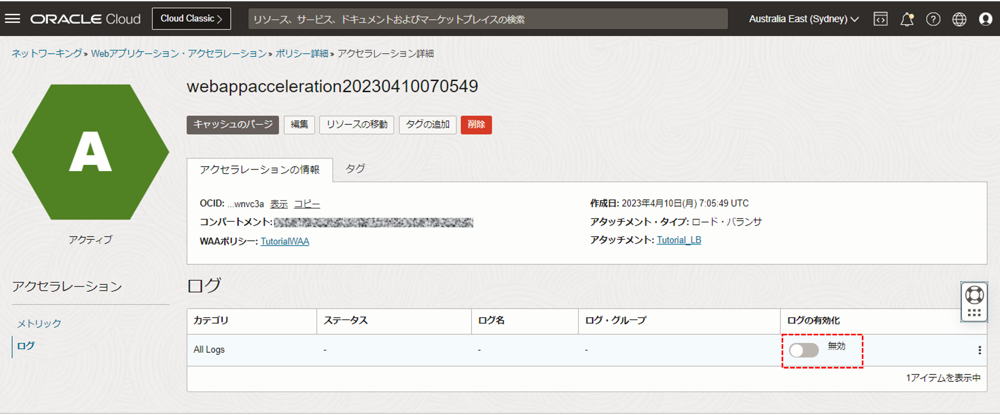

1. デフォルトの設定のままで **`ログの有効化`** ボタンをクリックします（図）
  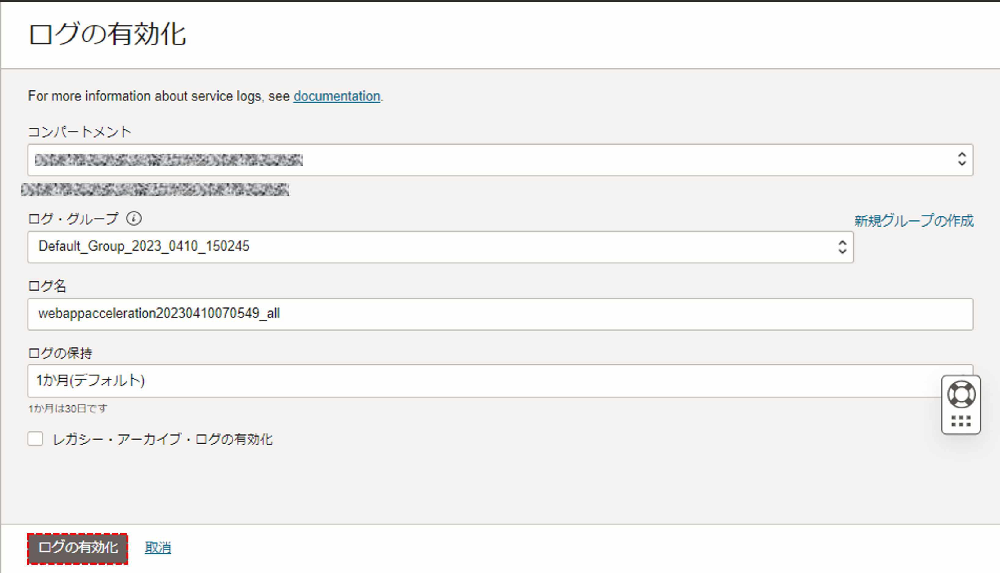

1. **`ステータス`** が **`アクティブ`** に変わったことを確認します（図）
  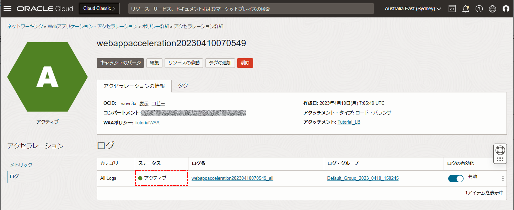

1. Ctrl+Shift+Nでシークレットウィンドウを開きます。後にブラウザが保持するキャッシュを消去する際、他のウィンドウのキャッシュまで削除しないようにWebページへのアクセスはシークレットウィンドウから行います

1. シークレットウィンドウの検索窓にFLBのIPパブリック・アドレスを入力し、Enterキーを押します。すると、Webページが返ってきます（図）
  

1. 少し時間をおいてメトリックを確認します。一件のHTTPリクエストが届いていることと、そのときのレスポンス・サイズが確認できます。バックエンド・レスポンスは5MBですが、圧縮が行われた場合、圧縮率に0より大きい値がプロットされ、圧縮の入力サイズと圧縮からの出力バイトを確認できます。このとき、レスポンス・サイズはバックエンド・レスポンスより小さくなっていることも確認できます(図)
  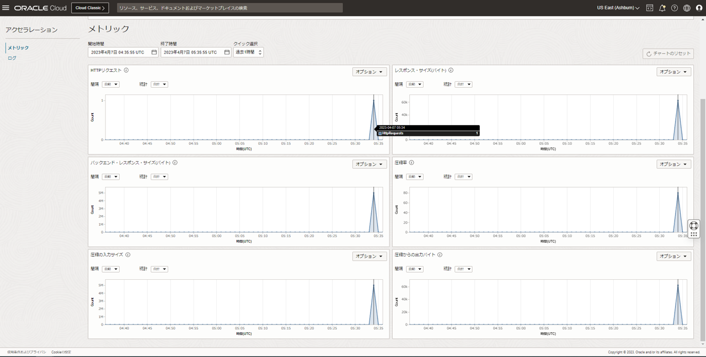

1. **`アクセラレーション`** メニューから **`ログ`** を選択し、**`ログ名`** のリンクをクリックします（図）
  

1. 表示されるログの探索画面で、時間によるフィルタの選択リストをデフォルトの過去5分から過去1時間に変更します（図）
  

1. メトリクスで確認したリクエストとレスポンスに対応するログが一行記録されているので、右端の下矢印をクリックし詳細をドリルダウンします。さらに、表示された"request"と"response"の左のプラスマークもクリックしてドリルダウンします（図）
  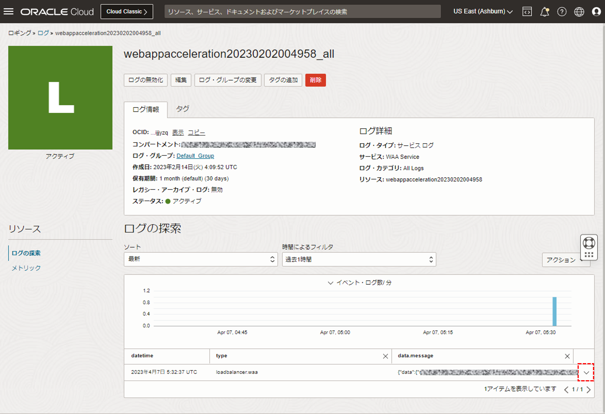
  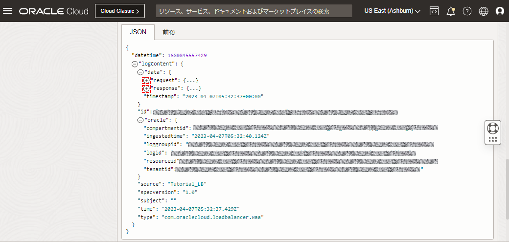

1. GETメソッドのリクエストに対して、200番のステータスコードでページを返したことが確認できます。初めてのレスポンスであるため、cacheStatusキーの値は"Miss"であり、WAAからキャッシュを返したわけではないことが分かります（図）
  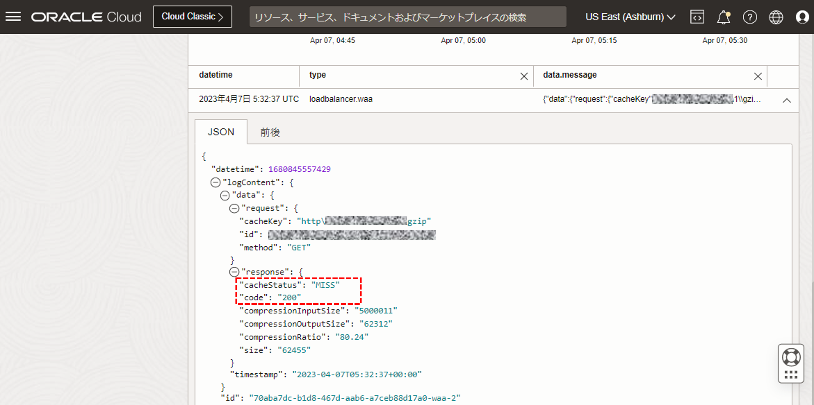

1. 再び、ブラウザのシークレットウィンドウに戻ります。Ctrl+Shift+Iで開発者モードを開き、左上の更新ボタンを右クリックします。表示される三つの選択肢の内の最下段、「キャッシュの消去とハード再読み込み」を選択してリロードします（図）。読み込みが終わってページが返ってきたことを確認したら再び「キャッシュの消去とハード再読み込み」をクリックし、これを何度か繰り返します。
  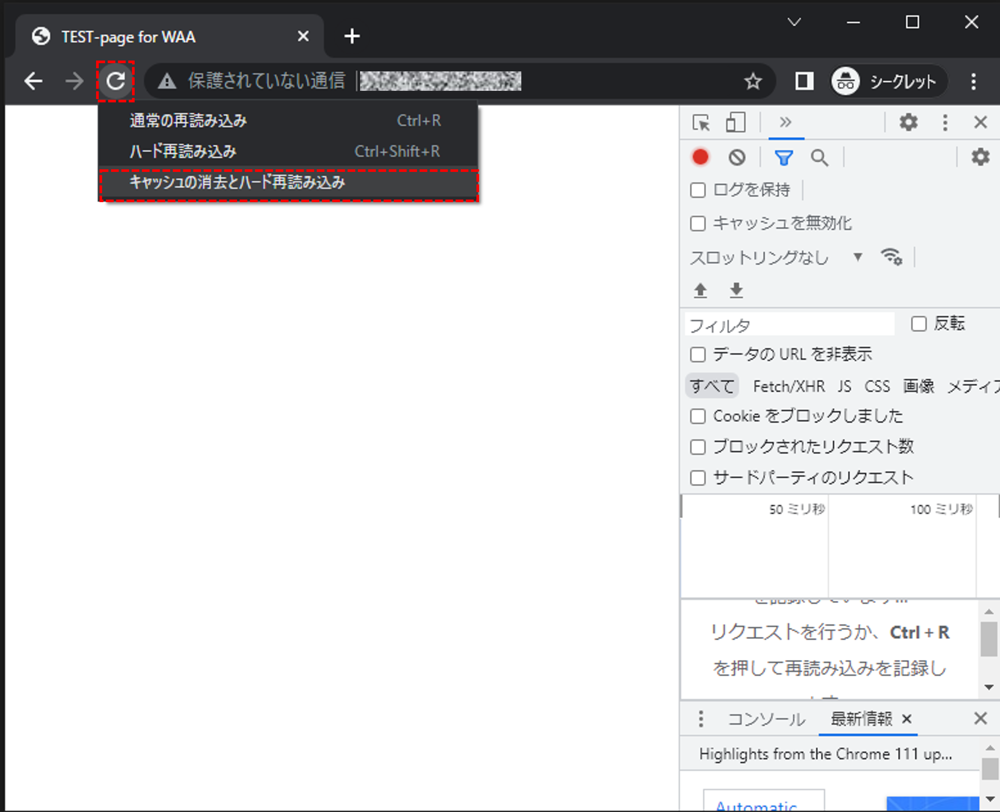
    >***Note***
    >
    >消去しているのはWAAが保持するキャッシュではなく、ブラウザが保持するキャッシュです。


1. 少し時間をおいてログを確認してみます。先ほどと同様に最新のログを確認してみると、今度はcacheStatusキーの値が"Hit"となっており、WAAからキャッシュを返したことが分かります(図)
  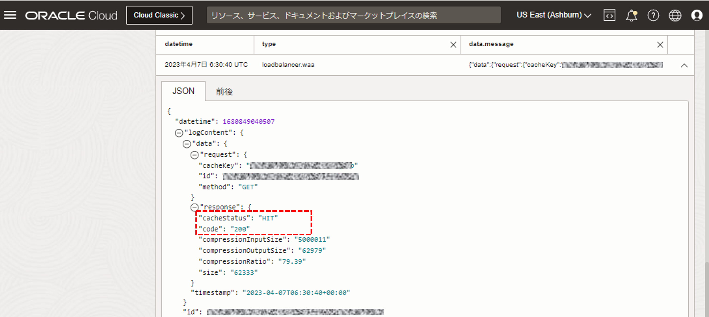
<br>

以上で本チュートリアルは終わりです。
WAAを活用することでFLBにキャッシュ機能と圧縮機能を持たせることができます。本チュートリアルでは、同一のクライアントからWebページをリロードする中でWAAの挙動を確認しました。実際のWebアプリケーションの運用では、異なるクライアントからの大量のリクエストを受け付けることになり、その際のレスポンス速度はユーザーエクスペリエンスの要になります。Webサーバのレスポンス速度でお困りの際は是非WAAの使用をご検討下さい。
