OCI Observability&Managementのサービスの1つ、Logging Analyticsでは様々なログを可視化、分析する機能を提供します。
Logging AnalyticsではOCIの各種ログ(VCN, Load Balancer, Audit...)だけでなく、エージェントを使用することでOSやデータベース、Webサーバーなどのログを可視化、分析することが可能です。
この章では、エージェントは利用せず簡単な操作でOCIの監査ログをLogging Analyticsで分析する手順をご紹介します。


**所要時間 :** 約20分

**前提条件 :**
+ Logging Analyticsが有効化されていること
- OCIコンソールのメニューボタン→監視および管理→ログ・アナリティクス→ログ・エクスプローラを選択し、「ログ・アナリティクスの使用の開始」を選択することで、Logging Analyticsを有効化させることができます。
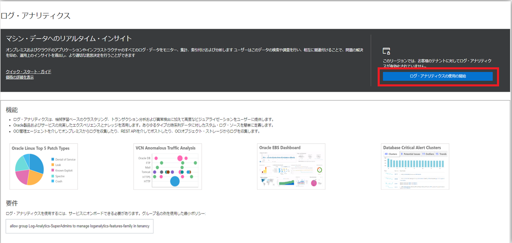


**注意 :** 

※チュートリアル内の画面ショットについてはOracle Cloud Infrastructureの現在のコンソール画面と異なっている場合があります。


# 1. IAMポリシーの作成
Logging Analyticsを利用するためにはOCIの他のサービスと同様に、IAMポリシーによってアクセス権限が付与されている必要があります。
以下のポリシーをテナンシで作成してください。


※この章では、ユーザーにLogging Analyticsの管理権限を付与します。ユーザーはログ・アナリティクスの構成やログファイルのアップロード、削除を含む全ての管理権限を行うことができます。[ドキュメント](https://docs.oracle.com/en-us/iaas/logging-analytics/doc/enable-access-logging-analytics-and-its-resources.html#GUID-EEB0A32F-9D33-4CF6-9FE7-F254C92BB2C0) を参考にユーザーの役割、ロールごとにIAMポリシーの権限を調整してください。

※OCIのテナンシ管理者がLogging Analyticsを利用する場合は、作成するポリシーは「1-2.Logging Analyticsサービスへのポリシー」のみになります。その他のポリシーは作成する必要はありません。

1-1. Loggingサービスを利用するためのポリシー
```
allow group <IAMグループ名> to MANAGE logging-family in tenancy/compartment <コンパートメント名>
allow group <IAMグループ名> to READ audit-events in tenancy/compartment<コンパートメント名>
```

1-2. Logging Analyticsサービスへのポリシー
```
allow service loganalytics to READ loganalytics-features-family in tenancy
allow service loganalytics to {LOG_ANALYTICS_LIFECYCLE_INSPECT, LOG_ANALYTICS_LIFECYCLE_READ} in tenancy
allow service loganalytics to MANAGE cloud-events-rule in tenancy/compartment <コンパートメント名>
allow service loganalytics to READ compartments in tenancy
```

1-3. ユーザーがLogging Analyticsを使用するためのポリシー
```
allow group <IAMグループ名> to READ compartments in tenancy
allow group <IAMグループ名> to MANAGE loganalytics-features-family in tenancy
allow group <IAMグループ名> to MANAGE loganalytics-resources-family in tenancy/compartment <コンパートメント名>
```

1-4. Service Connector Hubを利用するためのポリシー
```
allow group <IAMグループ名> to MANAGE serviceconnectors in tenancy/compartment <コンパートメント名>
```


# 2. ログ・グループの作成
2-1. OCIコンソールのメニューボタン→監視および管理→ログ・アナリティクス→管理
	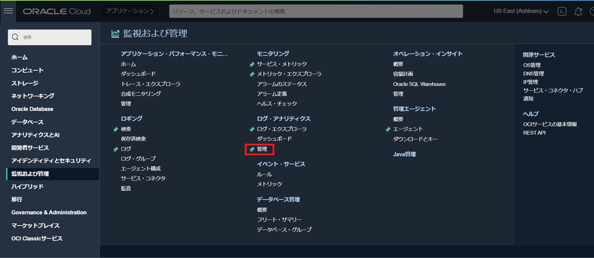

2-2. 管理画面→ログ・グループ 
	

+ ①ログ・グループの作成
+ ②ログ・グループの名前を入力 例)AuditLogs
+ ③作成

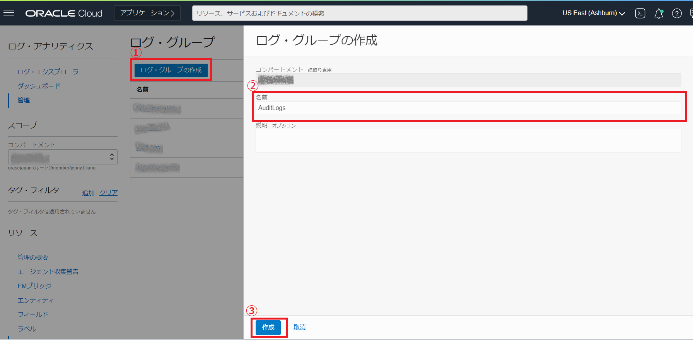


# 3. サービス・コネクタの作成
3-1. OCIコンソールのメニューボタン→監視および管理→ロギング→サービス・コネクタ
	
	
3-2. サービス・コネクタの作成
	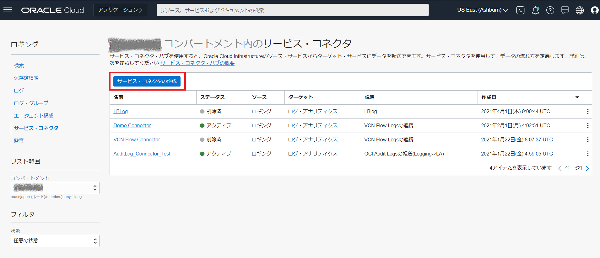
	
- **コネクタ名**: 任意の名前を入力 例) AuditLog_Connector
- **説明**: 任意の説明を入力
- **ソース**: 「ロギング」を選択 
- **ターゲット**: 「ログ・アナリティクス」を選択

	
	
- **ログ・グループ(ソース接続の構成)**: 「_Audit」を選択(OCIの監査ログはデフォルトで_Auditというログ・グループに格納されています。)
- **ログ・グループ(ターゲット接続の構成)**: 手順2-2で作成したLogging Analyticsのログ・グループを選択 例)AuditLogs
	
	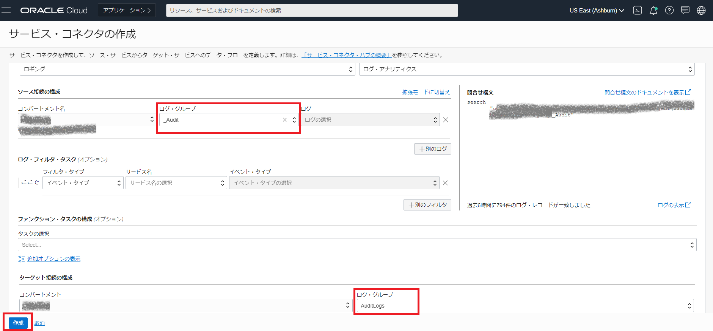

# 4. ログの分析
4-1. ログ・エクスプローラ

OCIコンソールのメニューボタン→監視および管理→ログ・アナリティクス→ログ・エクスプローラ
	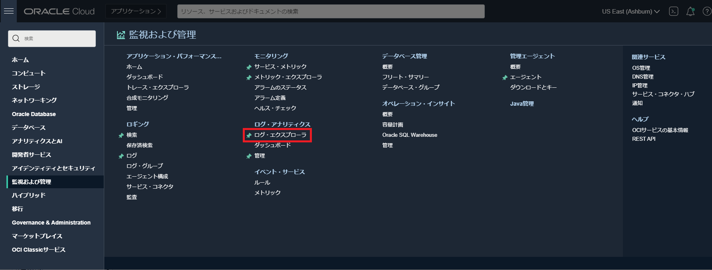
	
ログ・エクスプローラに「OCI Audit Logs」が表示されます。
	
	
「OCI Audit Logs」→「ドリルダウン」を選択するとログレコードがリストとして表示されます。
	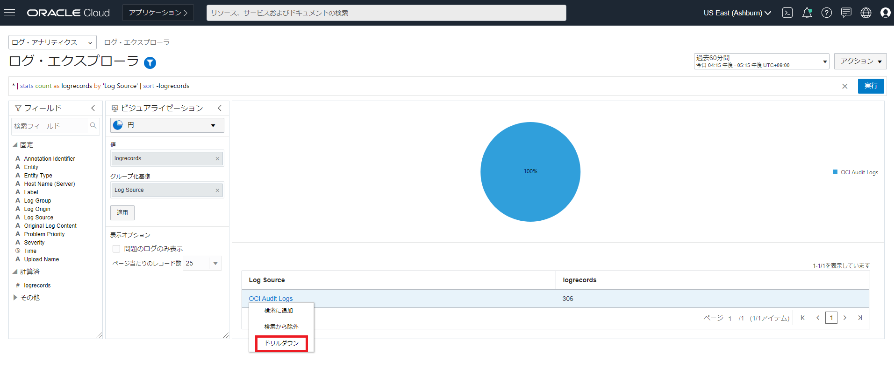
	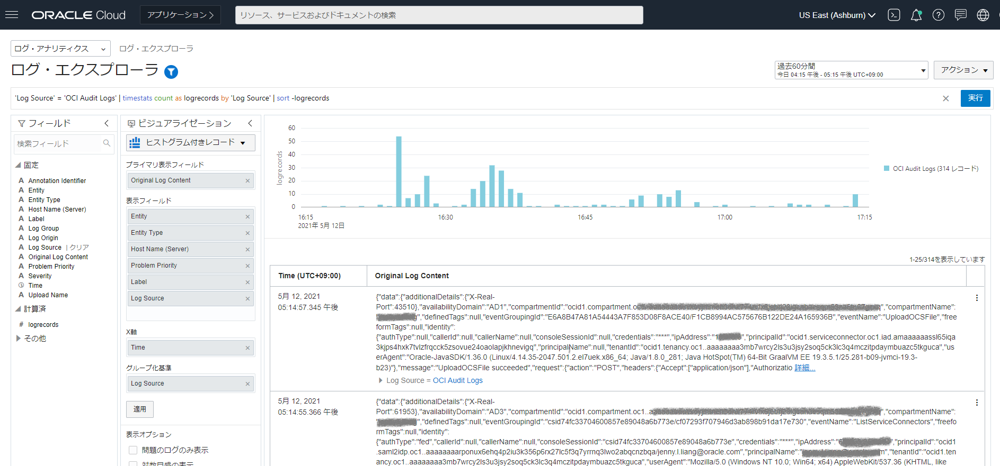
	

デフォルトでは過去60分間のログが表示されますが、過去15分から、最大で過去14日間までのログを表示することができます。
また、「カスタム」からお好きな時間枠に絞り込むこともできます。
	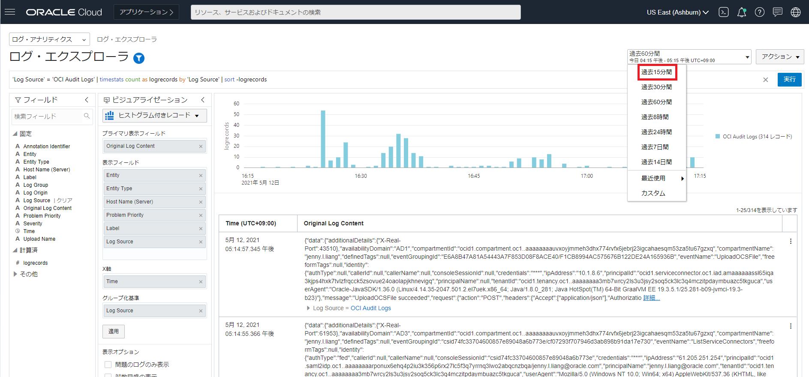
	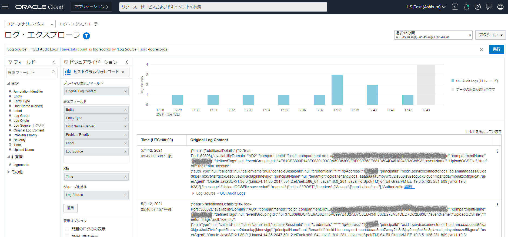
	
	
	
4-2. クラスタ分析でログを分析する

ビジュアライゼーション」→分析→クラスタ分析
	
	

類似した内容のログレコードがクラスタとして表示されます。
画面上部に「クラスタ」、「潜在的な問題」、「外れ値」、「トレンド」の合計4つのタブが表示されます。

- **クラスタ**: 全てのクラスタ
- **潜在的な問題**: ログの中身に「fatal」や「エラー」などの内容を含むクラスタ
- **外れ値**: ログ・レコードが1つしか含まれないクラスタ
- **トレンド**: ログ・レコードのトレンド（傾向を）分析し、トレンドごとにクラスタを表示
	
	
「failed」を選択すると、「failed」という値が含まれるログ・クラスタが表示されます。
	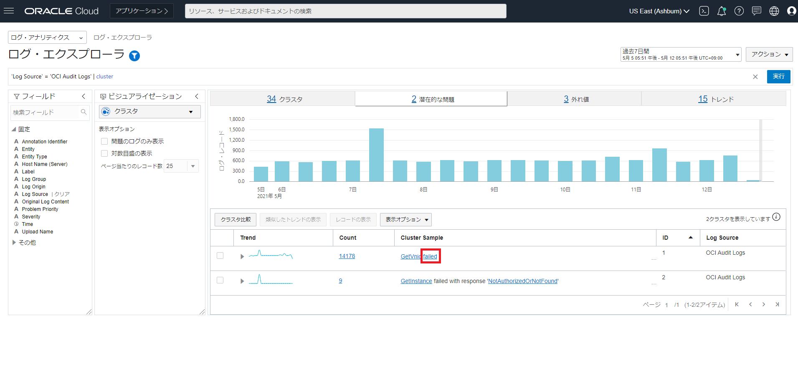
	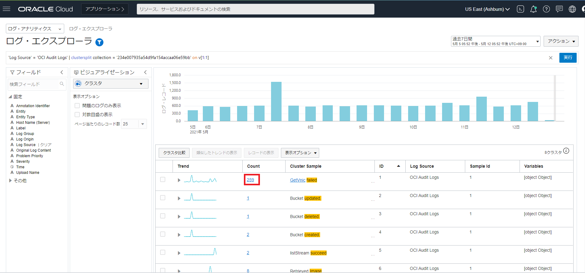
	
Countの数字の部分を選択すると、「failed」という値が含まれるログ・レコードが一覧で表示されます。
	
	
詳細を選択すると、ログレコード全文を確認することができます。
	
	
デフォルトでは生ログが表示されますが、ＪＳＯＮを選択すると視覚的に理解しやすいように情報を整理して表示されます。
	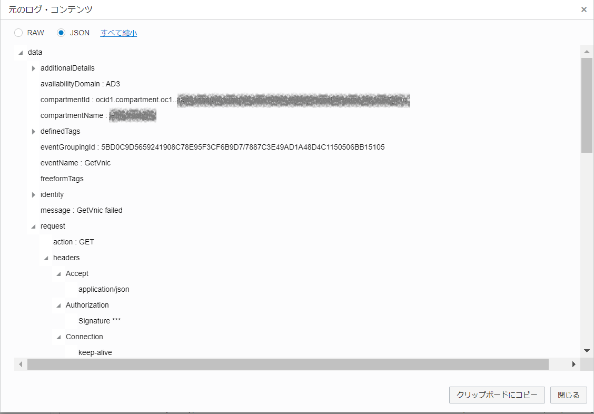
	
4-3. 様々なビジュアライゼーションによるログの可視化

ツリーマップ
	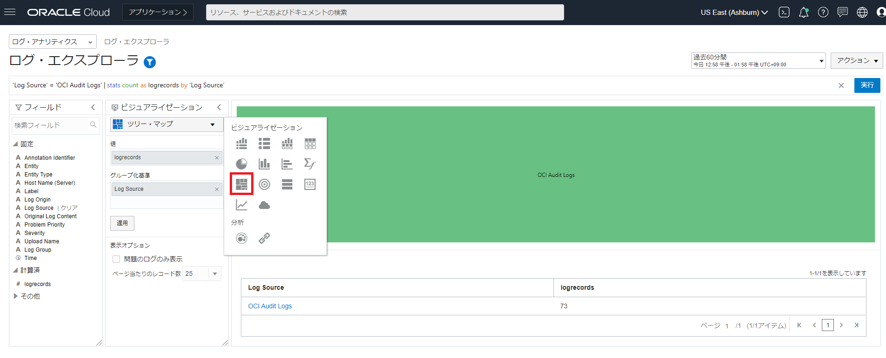
	
折れ線グラフ
	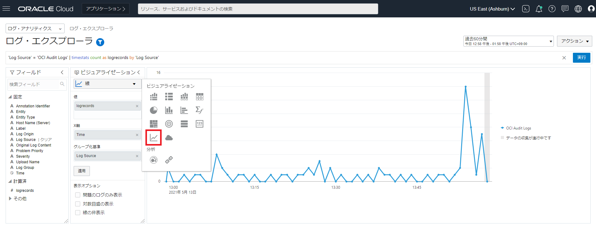
	
ツリーマップ、折れ線グラフの他にも様々なビジュアライゼーションによりログを可視化することができます。
	
4-4. フィールドの値により、ログ・レコードをフィルタリング
- **例) コンパートメント名**

特定のコンパートメント内の監査ログに絞り込むことができます。
	
	
- **例) メソッド**

メソッドによりログをフィルタリングすることができます。
例えば「delete」というメソッドに絞り込むと、ユーザーがOCI上でリソースを削除したログが一覧で表示されます。
	
	
ログから、どのユーザーが何のリソースを削除したかを確認することができます。
	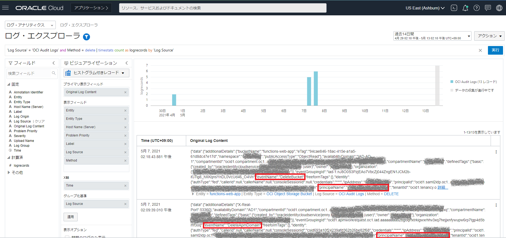
	

以上がLogging Analyticsを使用したOCI監査ログの分析手順になります。
Logging Analyticsにはご紹介したクラスタ分析、ツリーマップ、折れ線グラフの他にも、様々なビジュアライゼーションが提供されています。

