OCI Observability & Managementのサービスの1つ、Database Managementでは、Enterprise Managerで提供されているパフォーマンス分析の機能を中心に、Oracle DBのパフォーマンスを監視することが可能です。本章では、OCIのDatabase Cloud ServiceでDatabase Managementを有効化する手順を紹介します。Base DBでDatabase Managementを有効化する場合、エージェントレスで利用を開始することが出来ます。


**所要時間 :** 約50分

**前提条件 :**
+ OCIのBaseDBが1インスタンス作成されていること
- BaseDBのインスタンスの作成方法は[その8-クラウドでOracle Databaseを使う](/ocitutorials/beginners/using-oracle-database)をご参照ください。

**注意 :**
※監視対象のBaseDBがStandard Editionの場合、Database Managementの一部機能をご利用いただけませんのでご注意ください。


# 1. IAMポリシーの作成
Database Managementを利用するためにはOCIの他のサービスと同様に、IAMポリシーによってアクセス権限が付与されている必要があります。
以下のポリシーをテナンシで作成してください。

1-1. ユーザーがDatabase Managementを利用するためのポリシー
```
allow group <IAＭグループ名> to MANAGE dbmgmt-family in tenancy/compartment <コンパートメント名>
allow group <IAMグループ名> to MANAGE database-family in tenancy/compartment <コンパートメント名>
allow group <IAMグループ名> to MANAGE virtual-network-family in tenancy/compartment <コンパートメント名>
Allow group <IAMグループ名> to MANAGE metrics in tenancy/compartment <コンパートメント名>
Allow group <IAMグループ名> to MANAGE alarms in tenancy/compartment <コンパートメント名>
```

1-2. Database Managementサービスへのポリシー
```
Allow service dpd to MANAGE objects in tenancy/compartment <コンパートメント名>
Allow service dpd to read secret-family in tenancy/compartment <コンパートメント名>
```

1-3. Oracle Databaseのパスワードを管理するVaultサービスのポリシー
```
Allow group <IAMグループ名> to MANAGE vaults in tenancy/compartment <コンパートメント名>
Allow group <IAMグループ名> to MANAGE secret-family in tenancy/compartment<コンパートメント名>
Allow group <IAMグループ名> to MANAGE keys in tenancy/compartment <コンパートメント名>
```
1-4. Cloud Shellを利用するためのポリシー
```
Allow group <IAMグループ名> to MANAGE cloud-shell in tenancy
```


# 2. データベースユーザーの作成と権限付与

SQL*PlusなどでBaseDBにアクセスして以下コマンドを実行します。
```
SQL> alter user dbsnmp account unlock;
User altered.
SQL> alter user dbsnmp identified by "<password>";
User altered.
SQL> GRANT CREATE PROCEDURE TO dbsnmp;
Grant succeeded.
SQL> GRANT SELECT ANY DICTIONARY, SELECT_CATALOG_ROLE TO dbsnmp;
Grant succeeded.
SQL> GRANT ALTER SYSTEM TO dbsnmp;
Grant succeeded.
SQL> GRANT ADVISOR TO dbsnmp;
Grand succeeded.
SQL> GRANT EXECUTE ON DBMS_WORKLOAD_REPOSITORY TO dbsnmp;
Grant succeeded.
```
以上のコマンドで、モニタリング・ユーザー"dbsnmp"をアンロックし、モニタリングの実行権限を付与しました。


# 3. Vaultサービスのデータベースユーザーのパスワードを登録

3-1. Vaultの作成

ユーザー"dbsnmp"のアンロックと権限付与が終わったら、OCI Vaultサービスにdbsnmpユーザーのパスワードを登録します。

OCIコンソールのメニューボタン→アイデンティティとセキュリティ→ボールト→ボールトの作成をクリックします。
    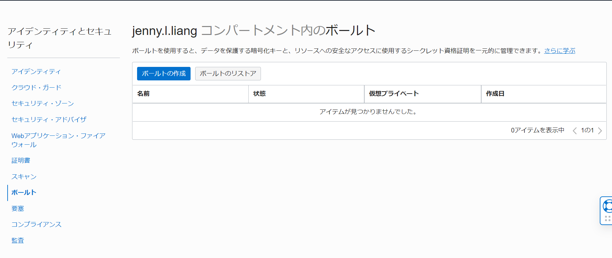

「ボールトの作成」画面にて、以下情報を入力し、「ボールトの作成」ボタンをクリックします。ボールトは5分～10分ほどで作成されます。
- 名前：任意 例) Vault_DB
    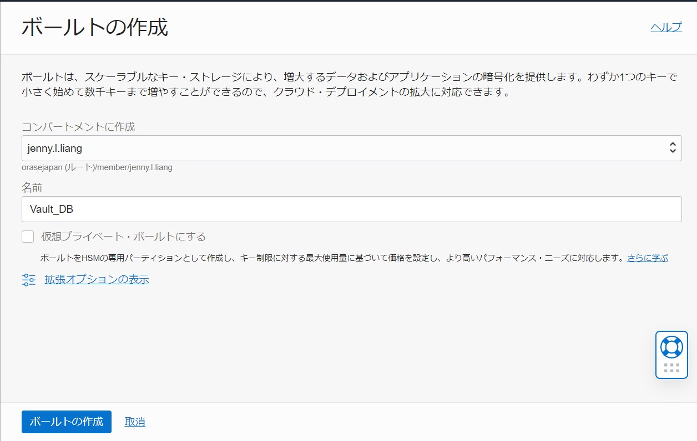


3-2. マスター暗号化キーの作成

手順3-1で作成したVaultをクリックし、ボールトの詳細画面から「キーの作成」ボタンをクリックします。
表示される「キーの作成」画面にて以下項目を入力し、「キーの作成」ボタンをクリックします。
- 保護モード：デフォルト(HSM)
- 名前：任意
- キーのアルゴリズム：デフォルト(AES)
- キーの長さ:256ビット
    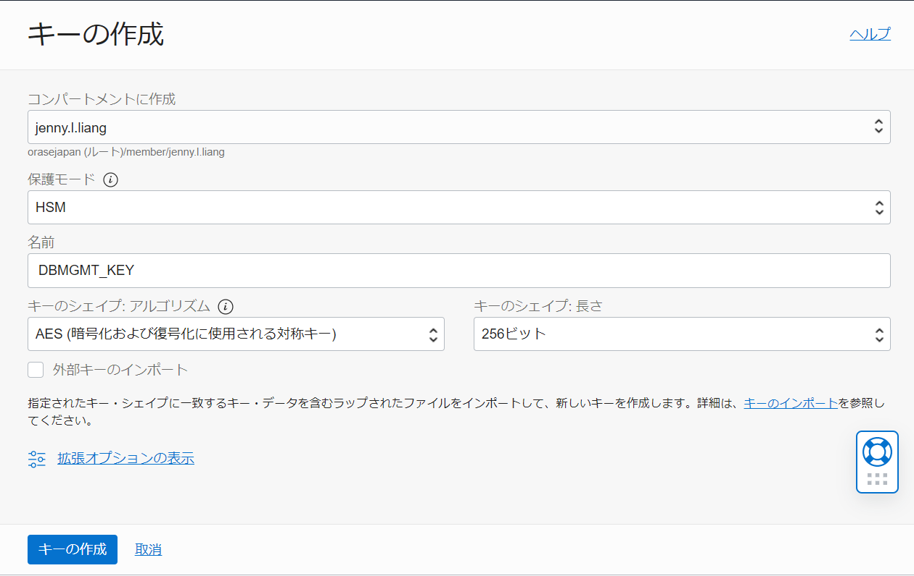


3-3. Secretの作成

Vaultの詳細画面左下のリソース→シークレット→シークレットの作成ボタンをクリックします。
「シークレットの作成」画面にて、以下項目を入力し、「シークレットの作成」ボタンをクリックします。
- 名前：任意
- 説明：任意
- 暗号化キー：手順3-2で作成したキーを選択
- シークレット・タイプ・テンプレート：プレーン・テキストを選択
- シークレット・コンテンツ：手順2で設定したdbsnmpユーザーのパスワードを入力
    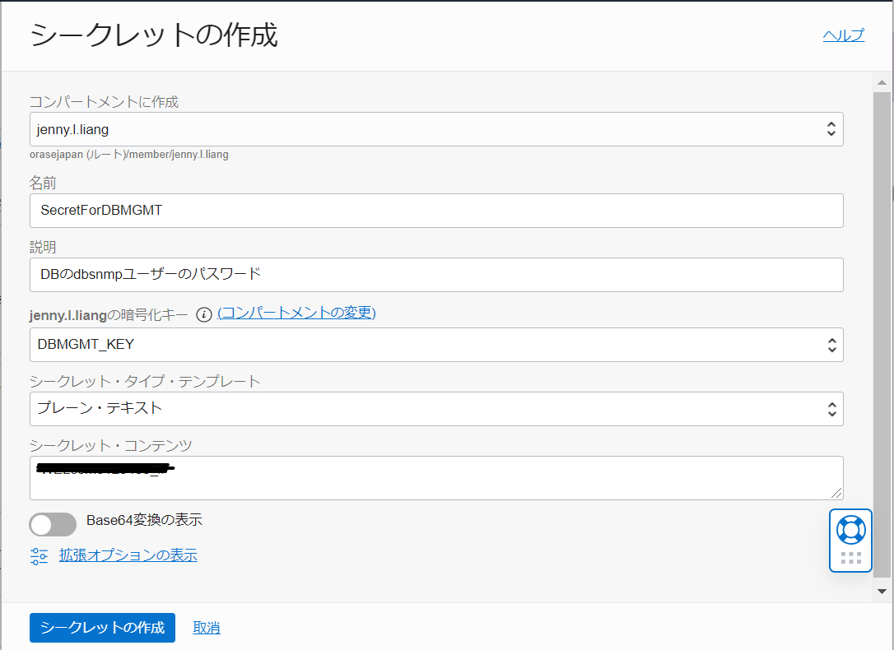


# 4. Network Security Groupの作成と登録

4-1. Network Security Groupの作成

OCIコンソールのメニュー→ネットワーキング→仮想クラウド・ネットワーク→BaseDBを作成したVCNを選択します。
画面左下のリソース→ネットワーク・セキュリティ・グループ→ネットワーク・セキュリティ・グループの作成をクリックします。
「ネットワーク・セキュリティ・グループの作成」画面の基本情報にて以下項目を入力し、「次」をクリックします。
- 名前：任意
    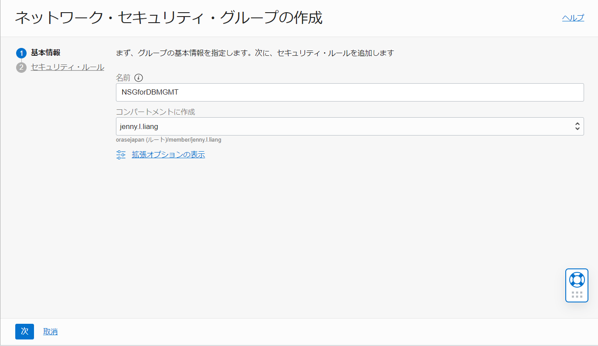

セキュリティ・ルールの追加にて、以下項目を入力し、「作成」ボタンをクリックします。
- **ルール1**
- 方向：イングレス
- ソースタイプ：CIDR
- ソースCIDR：BaseDBのCIDRを入力
- IPプロトコル：TCPを選択
- ソース・ポート範囲：All
- 宛先ポート範囲：1521
- **ルール2**
- 方向：エグレス
- ソースタイプ：CIDR
- ソースCIDR：BaseDBのCIDRを入力
- IPプロトコル：TCPを選択
- ソース・ポート範囲：All
- 宛先ポート範囲：1521
    


4-2. Network Security Groupの登録
NSGを作成したら、監視対象のBaseDBにNSGを割り当てます。
OCIコンソールのメニュー→ Oracle Database → ベア・メタル、VMおよびExadata→監視対象のBaseDBを選択します。
BaseDBの詳細情報のネットワーク・セキュリティ・グループの数字の「編集」をクリックします。
- 「ネットワーク・セキュリティ・グループの編集」画面にて、手順4-1で作成したNSGを選択し、「変更の保存」をクリックします。
    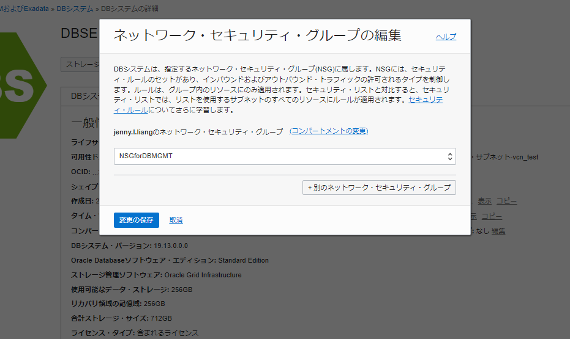


# 5. プライベート・エンドポイントの作成
OCIコンソールのメニュー→監視および管理→データベース管理→管理→プライベート・エンドポイント→プライベート・エンドポイントの作成をクリックします。
    

「プライベート・エンドポイントの作成」画面にて、以下項目を入力し、「プライベート・エンドポイントの作成」ボタンをクリックします。
- 名前：任意
- 説明：任意
- 仮想クラウド・ネットワークの場所：監視対象のBaseDBと通信ができるVCNを選択
- サブネットの場所：監視対象のBaseDBと通信ができるサブネットを選択
- ネットワーク・セキュリティ・グループ：手順4で作成したNSGを選択
    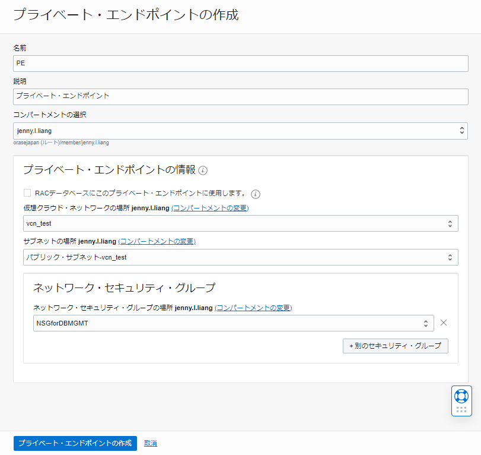


# 6. Database Managementの有効化
OCIコンソールのメニュー→ Oracle Database → ベア・メタル、VMおよびExadata→監視対象のBaseDBを選択します。
BaseDBの詳細画面に表示される、データベースの名前をクリックし、詳細画面のデータベース管理の「有効化」をクリックします
    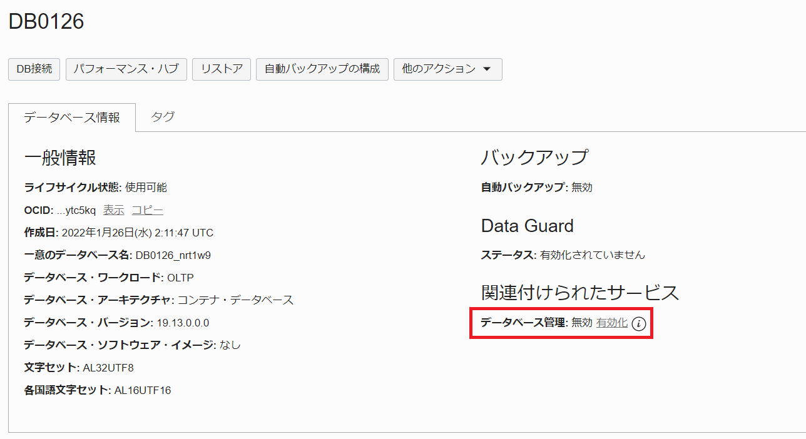

「データベース管理の有効化」画面にて、以下項目を入力し、「データベース管理の有効化」ボタンをクリックします。
- サービス名：デフォルト値
- データベース・ユーザー名：dbsnmp
- データベース・ユーザー・パスワード・シークレットの場所：手順3-3で作成したシークレットを選択
- プライベート・エンドポイントの場所：手順5で作成した・プライベート・エンドポイントを選択
- 管理オプション：完全管理
    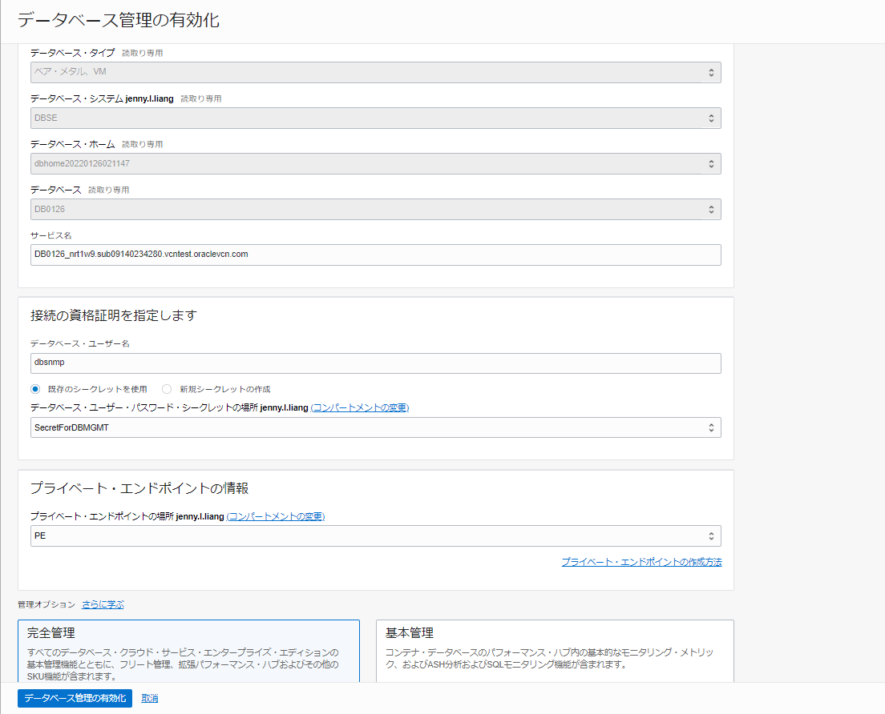


以上の手順で、BaseDBのDatabase Managementを有効化しました。
Database Managementを有効化したら、
OCIコンソールのメニュー→監視および管理→データベース管理→フリート・サマリーに、Database Managementを有効化したDBが表示されます。
    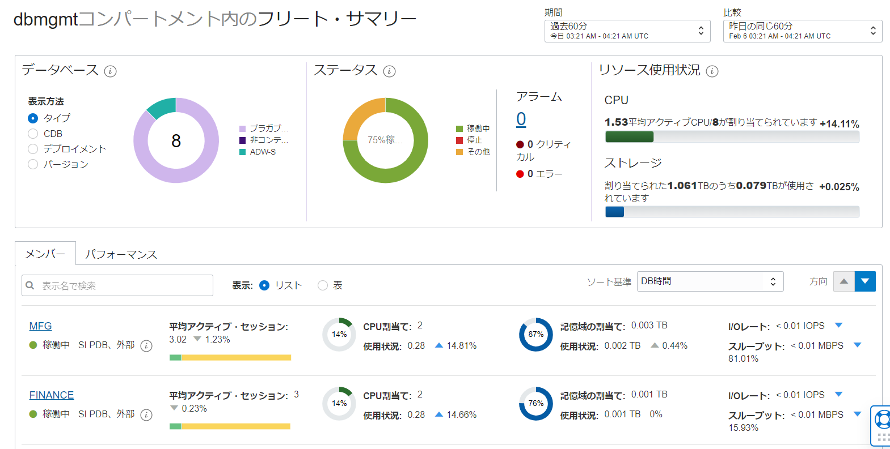


フリートサマリーに表示されるDBをクリックすると、DBのリソースの使用状況や、ユーザー情報の一覧、表領域やパラメーターの情報を確認することができます。
    


また、SQLジョブを使用するとOCIのコンソールからSQL文を実行することができます。ユーザー管理やバックアップ管理にご活用いただけます。
    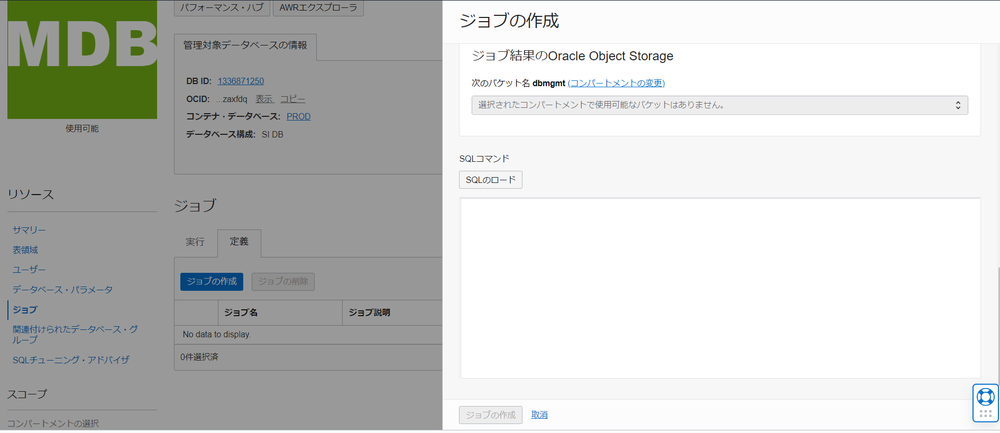


Database ManagementのDB詳細画面上部にある「パフォーマンス・ハブ」は、Active Session History分析や、ADDM、SQLアナリティクスの機能を提供しています。
    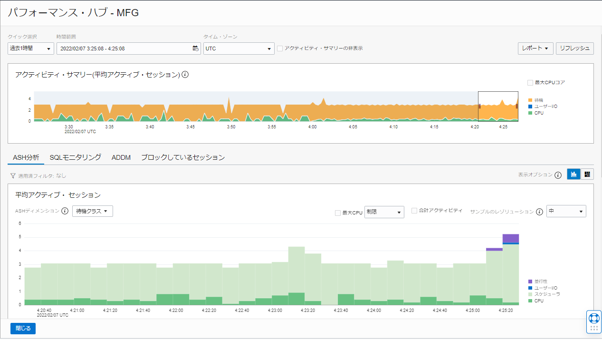


DB詳細画面上部にある「AWRエクスプローラー」からは、AWR（自動ワークロード・リポジトリ）の情報を可視化することが可能です。
    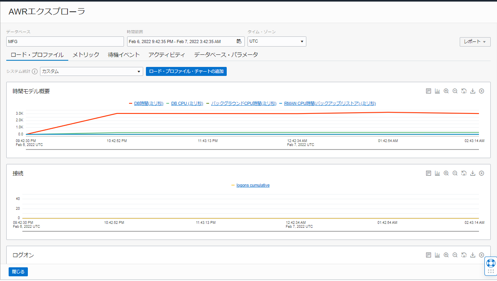


その他DBのパフォーマンスに関するメトリックは、OCI Monitoringサービス、あるいはBaseDBのDBサービス詳細画面からご確認いただけます。
※OCI Monitoringサービスからメトリックを確認する場合は、監視および管理→モニタリング→メトリック・エクスプローラーを選択し、メトリック・ネームスペースは「oracle_oci_database」を選択してください。
    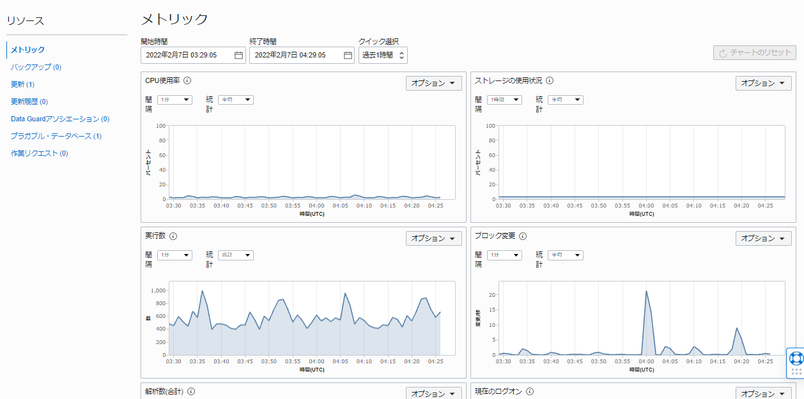


是非、お手元のBaseDBの運用監視にDatabase Managementをご活用ください。

